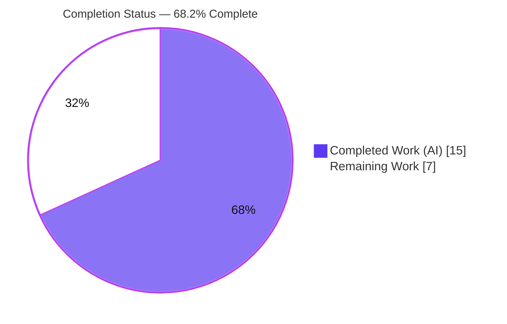
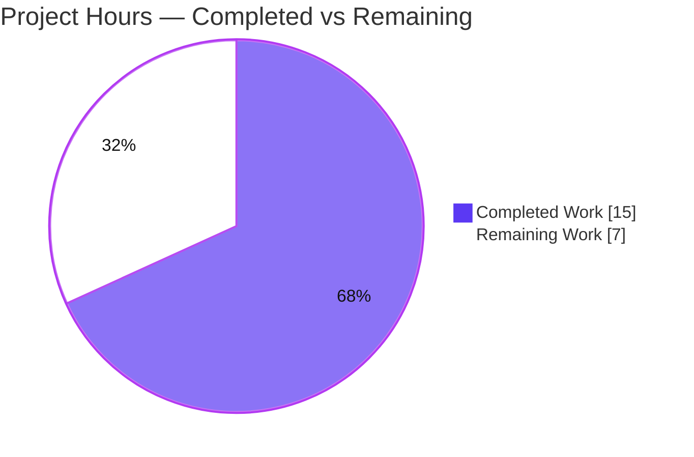
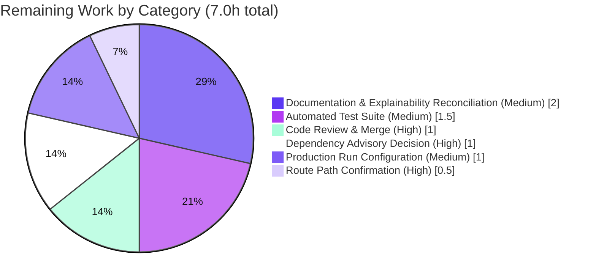
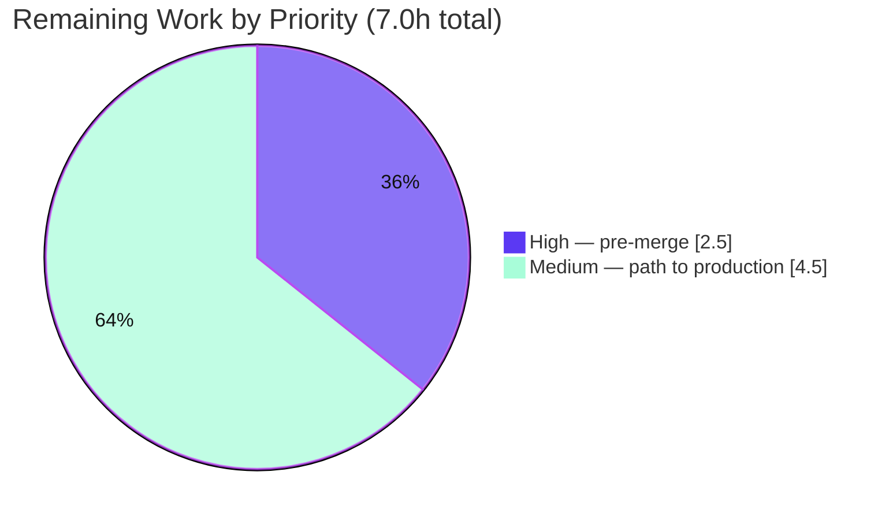

# Blitzy Project Guide — Express.js Endpoint Addition

> **Project:** `hello_world` — Node.js tutorial HTTP server (`existing-projects-qa-test/`)
> **Branch:** `blitzy-58589883-594a-4fe6-ae54-5806b56db2da` · **HEAD:** `d432071`
> **Status:** ✅ All three feature requirements delivered and verified end to end · Pre-merge decisions and path-to-production hardening remain
>
> **Legend / Brand Colors:** ■ Completed / AI Work (Dark Blue `#5B39F3`) · □ Remaining / Not Completed (White `#FFFFFF`) · Headings/accents Violet-Black `#B23AF2` · Highlights Mint `#A8FDD9`

---

# 1. Executive Summary

## 1.1 Project Overview

This project adds the Express.js web framework to a minimal single-file Node.js tutorial server and exposes a second plain-text endpoint, for developers learning Node.js and Express. `express@^5.2.1` becomes the first dependency; the catch-all handler becomes an Express router serving `GET /` (the preserved `"Hello, World!\n"`) and a new `GET /good-evening` (`"Good evening"`); and `http.createServer(app)` wraps the app so every existing operational behaviour — error handling, graceful shutdown, process guards — keeps working. The code change is one hunk in `server.js` (+6/−30) plus three manifest lines.

## 1.2 Completion Status

The project is **68.2% complete** on an AAP-scoped, hours-based measure. All three feature requirements and the integration are delivered and verified; the remaining **7.0 hours** are three pre-merge and three path-to-production items.



| Metric | Hours |
|--------|-------|
| **Total Hours** | **22.0** |
| Completed Hours (AI + Manual) | 15.0 (AI: 15.0 · Manual: 0.0) |
| Remaining Hours | 7.0 |
| **Percent Complete** | **68.2%** |

> Calculation: `Completed 15.0 / (Completed 15.0 + Remaining 7.0) = 15.0 / 22.0 = 68.2%`.

## 1.3 Key Accomplishments

- ✅ **Express 5 added** — `express@^5.2.1` declared; 67 packages locked; `npm ci` reproduces the tree exactly.
- ✅ **`GET /` byte-for-byte preserved** — 200, `text/plain`, the 14-byte `"Hello, World!\n"`.
- ✅ **`GET /good-evening` added** — 200, `text/plain`, the 12-byte `"Good evening"`.
- ✅ **Dispatch is path- and method-aware** — unmatched paths, sub-paths and non-GET methods all 404.
- ✅ **Hardening survives under Express** — drain, forced exit, fatal-error guards, bind failures and malformed requests all driven live.
- ✅ **Configuration intact** — `HOST`/`PORT` overrides bind and serve on non-default addresses.
- ✅ **One hunk, one file** — identity fields, `README.md` and the project's specification untouched.
- ✅ **Rationale recorded** — 9 decisions and a 13-mapping traceability matrix at full coverage.

## 1.4 Critical Unresolved Issues

**0 of 3** requested requirements (R1–R3) are open. **5** release items remain open: four need work and one is accepted with a caveat.

| Issue | Impact | Owner | ETA |
|-------|--------|-------|-----|
| `npm audit` fails on a moderate advisory in the installed `qs@6.15.3` | A moderate-severity advisory ships with the dependency tree; neither route reads query input, so the affected parsing path is unreachable today | Maintainer | 1.0h — pre-merge |
| The `/good-evening` path was chosen, not specified by the requester | If a different path was expected the public URL is wrong; it is a one-line change at `server.js:12` before merge, and a breaking one after | Requester + maintainer | 0.5h — pre-merge |
| No automated test protects either endpoint | Any future edit can silently change the preserved response bytes or break routing; `npm test` is still the npm-init placeholder | Maintainer | 1.5h |
| Both in-repository specifications state a zero-dependency, zero-framework architecture | A maintainer reading either one will conclude Express is forbidden, and the decision log explaining otherwise is not in the checkout | Maintainer | 2.0h |
| Unmatched paths and non-GET methods now return 404 | Accepted by design — any caller relying on the former universal `"Hello, World!"` response breaks | Maintainer | Accepted; no work planned |

## 1.5 Access Issues

| System/Resource | Type of Access | Issue Description | Resolution Status | Owner |
|-----------------|----------------|-------------------|-------------------|-------|
| _n/a_ | _n/a_ | No access issues identified | ✅ N/A | — |

> **No access issues identified.** `npm ci` installs the full tree from the public registry, or offline from cache, without credentials; no secret, database or container is required.

## 1.6 Recommended Next Steps

1. **[High]** Confirm the `/good-evening` path with the requester. *(0.5h)*
2. **[High]** Decide the `qs` advisory: bump to `qs@6.16.0` and re-verify, or formally accept it. *(1.0h)*
3. **[High]** Peer-review and merge, consciously accepting 595 dependency files and 9,190 documentation lines. *(1.0h)*
4. **[Medium]** Add a regression suite wired to `npm test` for both bodies and the 404 behaviour. *(1.5h)*
5. **[Medium]** Reconcile the specifications, commit the decision log, and add run configuration — `start` script, `engines` floor, `NODE_ENV=production`, supervisor. *(3.0h)*

---

# 2. Project Hours Breakdown

## 2.1 Completed Work Detail

No manual engineering hours were spent. Each component below traces to a specific requirement of the agreed scope.

| Component | Hours | Description |
|-----------|------:|-------------|
| Requirements analysis & decomposition | 3.0 | Intent clarification, decomposition into R1/R2/R3, repository scope discovery, integration analysis of the before/after request flow, and verification that `express@^5.2.1` is a real published release |
| R1 — Express dependency | 2.5 | `"express": "^5.2.1"` declared (`existing-projects-qa-test/package.json:9-11`), 67-package tree installed, `package-lock.json` regenerated at `lockfileVersion 3` (+849 lines) — commits `be86a94`, `c09637f`, `552dc09` |
| R2 — Preserve "Hello, World!" | 1.0 | `app.get('/')` returning `text/plain` and the byte-exact 14-byte `"Hello, World!\n"` (`server.js:11`) |
| R3 — "Good evening" endpoint | 0.5 | `app.get('/good-evening')` returning `text/plain` and the 12-byte `"Good evening"` (`server.js:12`) |
| Integration — `http.createServer(app)` | 2.5 | Replacement of the inline 30-line dispatch callback with the Express app in a single hunk (`server.js:14`), preserving all seven operational constructs below it as untouched context |
| Explainability deliverables | 1.5 | 9-entry decision log and a 13-mapping bidirectional traceability matrix at 100% source-construct coverage (0.5h of this item remains — see Section 2.2) |
| Functional, runtime & configuration verification | 4.0 | 59 executed checks: an HTTP contract harness run against the default and an overridden bind address, browser runtime verification, lifecycle, fatal-error and bind-failure drills, Express's error path, dependency-integrity checks, and a line-by-line change audit of the branch |
| **Total Completed** | **15.0** | |

## 2.2 Remaining Work Detail

Three pre-merge items and three path-to-production items. No feature requirement is outstanding.

| Category | Hours | Priority |
|----------|------:|----------|
| Code Review & Merge | 1.0 | High |
| Route Path Confirmation with the Requester | 0.5 | High |
| Dependency Advisory Decision | 1.0 | High |
| Automated Regression Test Suite | 1.5 | Medium |
| Documentation & Explainability Reconciliation | 2.0 | Medium |
| Production Run Configuration | 1.0 | Medium |
| **Total Remaining** | **7.0** | |

**What each category covers**

- **Code Review & Merge (1.0h, High).** Review the three functional files, then consciously accept — or reject — the 595 committed dependency files and the 9,190 lines of documentation the branch adds at the repository root (Section 5.2, row 4).
- **Route Path Confirmation (0.5h, High).** The request named no path for the new endpoint. Confirm `/good-evening` before merge; afterwards it is a breaking URL change (Section 5.2, row 2).
- **Dependency Advisory Decision (1.0h, High).** Apply the single non-breaking bump to `qs@6.16.0`, re-lock, reinstall, re-verify both endpoints and re-commit the tree — or record a formal accepted-risk exception (Section 5.2, row 8).
- **Automated Regression Test Suite (1.5h, Medium).** No test or spec file exists anywhere in the tree. Cover both exact response bodies and content types, an unmatched path, a non-GET method, and the `HOST`/`PORT` overrides; replace the placeholder `test` script. Node's built-in `node:test` needs no new dependency.
- **Documentation & Explainability Reconciliation (2.0h, Medium).** Reconcile or supersede the two in-repository specifications that describe a zero-dependency, zero-framework architecture, and land the decision log and traceability matrix in the checkout so the rationale is discoverable (Section 5.2, rows 5, 6 and 7).
- **Production Run Configuration (1.0h, Medium).** Declare an explicit `start` script rather than relying on npm's implicit default, add `"engines": { "node": ">=18" }` to enforce the Express 5 floor, run with `NODE_ENV=production` so Express's default error page never returns a stack trace, and place the process under a supervisor with a restart policy (Section 6).

## 2.3 Hours Reconciliation

| Aggregate | Hours |
|-----------|------:|
| Completed (Section 2.1) | 15.0 |
| Remaining (Section 2.2) | 7.0 |
| **Total Project Hours** | **22.0** |
| Percent Complete | 68.2% |

> **Integrity:** `2.1 (15.0) + 2.2 (7.0) = 22.0` Total; Remaining `7.0` is identical across Sections 1.2, 2.2 and 7, and the Section 1.6 next-step hours independently sum to the same `7.0`.

---

# 3. Test Results

Every figure below comes from a check executed against the committed code on this branch (Node v22.23.3, npm 10.9.9), aggregated by capability. The project has no coverage instrumentation and no build step, so no line-coverage percentage exists for any row.

| Area / Category | Framework | Tests | Passed | Failed | Coverage | What This Proves |
|-----------------|-----------|------:|-------:|-------:|----------|------------------|
| HTTP contract & routing | Node `http` assertion harness, default `127.0.0.1` bind | 15 | 15 | 0 | n/a | Both endpoints return exactly the specified status, content type and body bytes, dispatch is path- and method-aware rather than a catch-all, and `HEAD` and ETag revalidation behave correctly |
| Configuration override | Same harness, `HOST=0.0.0.0 PORT=3102` | 15 | 15 | 0 | n/a | The environment-driven bind address and port still work, with the full response contract intact on a non-default address |
| Browser runtime | Headless Chrome 154 via DevTools | 6 | 6 | 0 | n/a | Both endpoints render as bare plain text with no application console errors, the not-found body comes from the application, and a reload revalidates with `304` |
| Start-up & entry points | node / npm CLI | 5 | 5 | 0 | n/a | `node server.js` and `npm start` both launch the service with clean logs, and the retained `main` and `test` placeholders behave exactly as before the change |
| Server resilience | Node runtime drills | 4 | 4 | 0 | n/a | A malformed request still gets `400` from the preserved client-error handler, and port-in-use and permission-denied bind failures exit 1 with operator guidance |
| Process lifecycle & error paths | Node runtime drills; test-only preload, `server.js` unmodified | 7 | 7 | 0 | n/a | `SIGINT`/`SIGTERM` handlers drain and exit 0, a held connection triggers the 10-second forced exit, both fatal-error guards close and exit 1, and a throwing route yields `500` without taking the process down |
| Static syntax & dependency integrity | `node --check`; npm `install`, `ls`, `ls --all`, `ci --dry-run` | 6 | 6 | 0 | n/a | `server.js` parses, `express@5.2.1` loads, the 67-package tree has no invalid, unmet or extraneous entries, and the lockfile reproduces it exactly |
| Dependency advisory scan | `npm audit --omit=dev` | 1 | 0 | 1 | n/a | One moderate transitive advisory is present in `qs@6.15.3`; a single non-breaking bump to `qs@6.16.0` clears it |
| **Total** | — | **59** | **58** | **1** | n/a | |

**Not Covered** — delivered behaviour that no test or runtime check exercises, and what to test before release:

- **No regression suite exists in the repository.** Every check above ran from a harness outside the tree; nothing re-runs on a future change, and `npm test` remains the npm-init placeholder that exits 1. Add a suite covering both response bodies and the 404 path/method behaviour (1.5h in Section 2.2).
- **Operating-system signal delivery.** The `SIGINT` and `SIGTERM` handlers (`server.js:68-69`) were driven by raising the signal inside the process; a real signal from a process manager or container runtime was never delivered, because Windows cannot deliver POSIX signals programmatically. Verify on the Linux or container host the service will run on.
- **Express's error page under a production setting.** The `500` path was driven only with a test-only throwing route. With `NODE_ENV` unset — the default launch — the response body carries the error message and stack trace (`node_modules/express/lib/application.js:91`, `node_modules/finalhandler/index.js:160-162`); with `NODE_ENV=production` it is generic. No shipped route can throw today; re-test once the production setting is configured.
- **No concurrency, load, TLS, non-loopback exposure or non-Windows host testing.** Behaviour under sustained or parallel traffic, on a publicly reachable interface, or on Linux and macOS is unknown.

---

# 4. Runtime Validation & UI Verification

This is a server-side, plain-text HTTP service — there is no frontend, component library or design system. The flows below were driven against running instances of the committed code.

**Start-up and configuration**

- ✅ **Operational** — `node server.js` starts cleanly, logging `Server running at http://127.0.0.1:<port>/` and `Press Ctrl+C to stop the server` with empty stderr; `npm start` launches the same service through npm's default `start` behaviour.
- ✅ **Operational** — `HOST` and `PORT` overrides bind as instructed and serve the full response contract; verified on `0.0.0.0:3102`, `0.0.0.0:8080` and on `127.0.0.1` ports `3101`, `3108`, `3109` and `3110`.

**Endpoints**

- ✅ **Operational** — `GET /` → `200`, `Content-Type: text/plain; charset=utf-8`, `Content-Length: 14`, body exactly `"Hello, World!\n"`.
- ✅ **Operational** — `GET /good-evening` → `200`, `text/plain; charset=utf-8`, `Content-Length: 12`, body exactly `"Good evening"`.
- ✅ **Operational** — `GET /<unmatched>`, `GET /good-evening/extra` and `POST /` → `404` with Express's HTML `Cannot GET …` page; `GET /good-evening?x=1` → `200`. Routing follows Express defaults: it is case-insensitive and trailing-slash tolerant, so `/Good-Evening` and `/good-evening/` also return `"Good evening"`.
- ✅ **Operational** — Browser rendering of both endpoints shows bare plain text with no stylesheets, scripts or images; the only console entry is the benign `/favicon.ico` 404, and a reload revalidates with `304`.

**Resilience and lifecycle**

- ✅ **Operational** — Graceful shutdown: the `SIGINT` and `SIGTERM` handlers log `Starting graceful shutdown...` then `Server closed. All connections finished.` and exit 0; with a connection held open mid-request, `Forcing shutdown after timeout` fires and the process exits 1 after about 11 seconds.
- ✅ **Operational** — Bind failures: an occupied port logs `listen EADDRINUSE` and `Port 3101 is already in use`; a Windows-excluded port logs `listen EACCES` and `Permission denied to bind to port 5986`; both exit 1.
- ✅ **Operational** — Malformed request: an invalid `Content-Length` receives `HTTP/1.1 400 Bad Request` and the server logs `Client connection error: Parse Error: Invalid character in Content-Length`.
- ⚠ **Partial** — Fatal errors: the `uncaughtException` and `unhandledRejection` guards log, close the server and exit 1, and a throwing route returns `500` while the process keeps serving — but with `NODE_ENV` unset that `500` page contains the error message and stack trace.

**Never exercised at runtime.** Delivery of a real operating-system signal (the handlers were raised in-process, because Windows has no POSIX signals), sustained or concurrent load, TLS, exposure on a public interface, and any non-Windows host. The project has no external integration of any kind — no outbound calls, database, cache, broker or third-party API — so there is nothing further to integration-test.

---

# 5. Compliance & Quality Review

## 5.1 Compliance Matrix

Where each deliverable and user rule stands now, against the quality benchmarks applied to this project.

| Benchmark / Requirement | Status | Progress | Notes |
|-------------------------|--------|----------|-------|
| R1 — Express declared and locked | ✅ Pass | 100% | `"express": "^5.2.1"` (`package.json:9-11`); `lockfileVersion 3`; 67 installed packages; `npm ci` reproduces the tree from the lockfile |
| R2 — "Hello, World!" preserved | ✅ Pass | 100% | `GET /` → 200, `text/plain`, 14 bytes, byte-exact body (`server.js:11`). This also satisfies the "Hello World" rule, which carries no other actionable constraint |
| R3 — "Good evening" endpoint | ✅ Pass | 100% | `GET /good-evening` → 200, `text/plain`, 12 bytes (`server.js:12`) |
| Integration — hardening preserved verbatim | ✅ Pass | 100% | `http.createServer(app)` (`server.js:14`); all seven operational constructs below it are untouched context in the diff, and drain, forced exit, fatal-error guards, bind failures and client-error handling were each driven live |
| Configuration surface unchanged | ✅ Pass | 100% | `HOST`/`PORT` resolution and the loopback default are intact (`server.js:6-7`), verified on two wildcard binds and four alternative loopback ports |
| Identity surface preserved | ✅ Pass | 100% | `package.json` `name`/`version`/`description`/`main`/`scripts`/`author`/`license` byte-identical; `README.md` and the project's own specification untouched |
| Rule: Make minimal changes | ⚠ Partial | 85% | The application change is one hunk (`+6/−30`) plus three manifest lines — but 9,190 lines of documentation were added at the repository root, outside the planned file set (Section 5.2, row 4) |
| Rule: Explainability | ⚠ Partial | 75% | 9 decisions and 13 traceability mappings authored at 100% source-construct coverage, but neither artifact is present in the checkout (Section 5.2, row 6) |
| Static syntax quality | ✅ Pass | 100% | `node --check server.js` exits 0; no TODO/FIXME/HACK markers; the project configures no linter or formatter, so none applies |
| Dependency advisory scan | ❌ Open | 0% | `npm audit --omit=dev` exits 1 on a moderate `qs@6.15.3` advisory (Section 5.2, row 8) |
| Automated regression coverage | ❌ Open | 0% | No test or spec file exists in the tree; `npm test` is the retained placeholder |
| Documentation consistency | ❌ Open | 0% | Two in-repository specifications describe a zero-dependency, zero-framework architecture that the delivered code contradicts (Section 5.2, row 5) |

## 5.2 AAP & Rule Divergences and Gaps

Eight divergences exist between what was agreed — the delivery plan and the three user-specified rules — and what the repository now contains. One is explicitly sanctioned by the user's own instruction; the rest are recorded with their cause, impact and remediation.

| What the AAP/Rule Required | What Was Delivered Instead | Why It Diverged | Impact | Remediation |
|----------------------------|----------------------------|-----------------|--------|-------------|
| **1.** The original server answered `200 "Hello, World!\n"` for every method and every path | Only `GET /` and `GET /good-evening` are registered; everything else falls through to a 404 (`server.js:11-12`) | Routing is the whole purpose of adding Express; a catch-all would have negated it. Recorded as an authorized deviation in the plan's decision log (D3) | Any caller relying on the former universal response now gets 404 | None required if only the two published routes are consumed; otherwise add a catch-all route |
| **2.** "add another endpoint that returns the response of 'Good evening'" — no path specified | The path `/good-evening` (`server.js:12`) | The requester left it unspecified; descriptive kebab-case was chosen over `/evening`, `/goodevening` and `/good_evening`, and logged as an assumption to confirm (D4) | If a different path was expected, the published URL is wrong | Confirm with the requester before merge — 0.5h in Section 2.2 |
| **3.** `README.md:2` marks the package identity surface immutable — "Do not touch!" — and the project specification extends that to both manifests | `package.json` gained a three-line `dependencies` block; `package-lock.json` was regenerated (+849 lines) | **Sanctioned.** The user's instruction to "add expressjs into the project" cannot be honoured without editing the manifests (D8) | None — every identity and script field is byte-identical | None required |
| **4.** "No new source, test, or configuration files are required" and "No repository documentation files are created or modified" | `blitzy/documentation/Project Guide.md` (543 lines) and `blitzy/documentation/Technical Specifications.md` (8,647 lines) added at the repository root — commits `c4f7ec5`, `527339c` and `e46e0e9` | Not recorded. No decision authorizes it, and it also strains the minimal-changes rule's confinement clause | Adds 9,190 lines of prose to the review surface; see row 5 for the content problem | Decide at review whether to keep them in version control — inside the 1.0h review in Section 2.2 |
| **5.** Documentation that matches the code | Both in-repository specifications assert a zero-dependency, zero-framework architecture while `package.json` declares Express and 67 packages are installed | The plan explicitly placed reconciliation out of scope as "not requested by the user" | A maintainer reading either specification will conclude Express is forbidden and may revert or block the dependency | Update or supersede both — 2.0h in Section 2.2 |
| **6.** "Deliver a decision log as a Markdown table… include a bidirectional traceability matrix… 100% coverage, no gaps" | Both were authored — 9 decisions, 13 mappings — but neither appears anywhere in the repository | A plan-time choice (D7) to embed them in the specification rather than create a repository file, to honour the minimal-changes rule | A maintainer working from a checkout cannot find why Express was added, why unmatched paths now 404, or why the route is named as it is | Commit both into the repository — 0.5h, folded into the 2.0h reconciliation |
| **7.** "Do not embed rationale in code comments. The decision log is the single source of truth for 'why' decisions." | `server.js` retains 15 inherited `// Motive:` comments explaining each hardening construct (`server.js:5`, `17`, `22`, `33`, `38` and ten more) | The minimal-changes rule required preserving the hardening block verbatim. The two rules conflict here and preservation was chosen; the newly written lines add no rationale comments | None functional — the "why" is simply duplicated between code and the decision log | Optional; strip them alongside the documentation reconciliation if the rule is to hold strictly |
| **8.** A clean dependency install for a pinned `express@^5.2.1` | `npm audit --omit=dev` exits 1 — `qs@6.15.3` carries a moderate advisory, reached via `express@5.2.1 → qs` and `→ body-parser@2.3.0 → qs` | Applying the fix would rewrite the lockfile beyond the pinned resolution, and nothing in the project gates on `npm audit` because no CI exists | A moderate-severity advisory ships with the tree; neither route reads query input, so the affected parsing path is unreachable in the delivered surface | Apply the non-breaking bump to `qs@6.16.0` and re-verify, or record an accepted-risk exception — 1.0h in Section 2.2 |

**1 — Universal response replaced by two routes.** Before this change every request, whatever its method or path, received `200 "Hello, World!\n"`. Now `server.js:11-12` register exactly two `GET` handlers and Express's own not-found handler answers everything else. The plan authorized this, because a framework that does not route is pointless. It is verified as intended: an unmatched path, a sub-path under `/good-evening`, and `POST /` all return 404, while `GET /good-evening?x=1` still returns the correct body. The reader's decision is narrow — if any consumer depends on the old blanket response, add a catch-all route; otherwise nothing is needed.

**2 — The route path is an assumption, not a requirement.** The request asked for "another endpoint that returns the response of 'Good evening'" and stopped there. `/good-evening` was selected for being descriptive, lowercase and kebab-case, over `/evening`, `/goodevening` and `/good_evening`, and was logged as needing confirmation. Settle it before merge: today it is a single-token edit at `server.js:12` with no other file affected, whereas after merge it becomes a breaking change to a published URL. Note that Express matches routes case-insensitively, so `/Good-Evening` also answers. This is the cheapest open item in the project.

**3 — Manifests edited despite the preservation notice (sanctioned).** `README.md:2` declares the package identity surface off-limits and the project's specification extends that policy to `package.json` and `package-lock.json`. Declaring a dependency is impossible without touching them, so the user's explicit instruction to add Express overrides the notice — a sanctioned divergence, not a defect. Scope was held tight: the manifest diff is exactly three lines, and `name`, `version`, `description`, `main`, `scripts`, `author` and `license` are byte-identical to the original. No action is required, though a reviewer may record the override in the README.

**4 — Documentation appeared where the plan said none would.** The plan stated that no new source, test or configuration files were needed and that no repository documentation files would be created or modified. Commits `c4f7ec5`, `527339c` and `e46e0e9` nonetheless added and then revised `blitzy/documentation/Project Guide.md` and `blitzy/documentation/Technical Specifications.md` at the repository root — 9,190 lines between them. No recorded decision authorizes this, so no reason can be given. The practical effect is that a reviewer expecting a three-file change opens a 600-file diff. The reader must decide whether these documents belong in version control; if so, row 5 applies.

**5 — The repository contradicts itself about Express.** `blitzy/documentation/Technical Specifications.md` states that the implementation "deliberately excludes web frameworks (Express, Fastify, Koa)" at line 174, adopts a "zero-framework architecture" at line 1195, lists Express among excluded frameworks at line 1258, and diagrams "No Web Frameworks" at line 1653 — 88 lines assert a zero-dependency or zero-framework design. The pre-existing `existing-projects-qa-test/blitzy/documentation/Technical Specifications.md` says the same. Meanwhile `package.json:9-11` declares Express. Reconciliation was placed out of scope as unrequested; the result is that the repository's strongest written guidance tells a maintainer to remove the dependency this project added.

**6 — The rationale is not in the repository.** The Explainability rule requires a decision-log table and, for a refactor, a bidirectional traceability matrix at full coverage. Both exist and are complete — nine decisions covering the framework, integration approach, route naming, version and manifest override, plus thirteen mappings accounting for every construct of the original handler. The gap is discoverability: they were embedded in the planning specification rather than a repository file, to avoid creating files, and no committed file contains either table. A maintainer with only a checkout cannot answer "why Express?" or "why does an unknown path 404?". Committing both tables takes about half an hour.

**7 — Two rules pull in opposite directions in `server.js`.** The Explainability rule forbids rationale in code comments; the minimal-changes rule forbids touching anything outside the scoped objective. The original file carries fifteen `// Motive:` comments explaining each hardening construct, all in the region the change had to leave alone. Preservation won, so they remain at `server.js` lines 5, 17, 22, 33, 38, 47, 52, 59, 67, 72, 79, 86, 94, 101 and 108. The newly written lines — `server.js:9`, `11`, `12` and `14` — add none, so the rule holds for new work. Nothing breaks either way; the reader decides whether strict compliance warrants a cleanup pass.

**8 — A moderate advisory ships with the tree.** `npm audit --omit=dev` exits 1 on `qs@6.15.3`, which carries two moderate findings — an array-limit bypass via bracket-key comma parsing (GHSA-x5fp-wj9c-mxmx) and a denial of service through an attacker-controlled `isBuffer` (GHSA-4mjr-xmp4-gh2g). It arrives directly from `express@5.2.1` and through `body-parser@2.3.0`. `npm audit fix` changes exactly one package, to `qs@6.16.0`, with no breaking change. It was not applied because it moves the lockfile off the pinned resolution and nothing enforces `npm audit`. Exposure is low — both routes are parameterless `GET` handlers — but any scanner will flag it, so it needs an explicit decision.

---

# 6. Risk Assessment

Forward-looking risks only — what could still go wrong in production.

| Risk | Category | Severity | Probability | Mitigation | Status |
|------|----------|----------|-------------|------------|--------|
| A moderate advisory ships in the installed tree (`qs@6.15.3`) | Security | Medium | Medium | Apply the single non-breaking bump to `qs@6.16.0`, re-lock and re-verify both routes; neither route reads query input, so the affected parsing path is unreachable today | Open |
| Express's default error page returns the error message and stack trace whenever `NODE_ENV` is not `production` — the default launch (`node_modules/express/lib/application.js:91`, `node_modules/finalhandler/index.js:160-162`); the original handler returned a plain `Internal Server Error` | Security | Medium | Low | Run with `NODE_ENV=production`, or register a final error handler that returns a generic plain-text `500`; no shipped route can throw today | Open |
| No regression suite — a future edit can silently break an endpoint or alter the preserved response bytes | Technical | Medium | Medium | Add `node:test` or supertest coverage for both routes plus the 404 path/method behaviour, wired to `npm test` | Open |
| No declared `start` script, `engines` floor or supervisor — the package installs on Node < 18, where Express 5 cannot run, and a fatal error exits the process with nothing to restart it | Operational | Medium | Medium | Declare the script explicitly, add `"engines": { "node": ">=18" }`, and run under a process manager with a restart policy | Open |
| In-repository specifications describe a zero-dependency, zero-framework architecture, so a future maintainer may revert or block the dependency | Integration | Low | High | Reconcile or supersede both specifications and land the decision log in the checkout | Open |
| 67 packages and 595 committed dependency files replace a zero-dependency footprint — supply-chain and drift surface | Security | Low | Medium | Every resolution is pinned with SHA-512 integrity and `npm ci` reproduces the tree exactly; enable automated dependency alerts | Open |
| Callers relying on the former universal `"Hello, World!"` response now receive 404 on any other path or method | Technical | Low | Low | Only the two published routes are documented; add a catch-all route if legacy callers exist | Accepted |
| No TLS, authentication, rate limiting or CORS, and `X-Powered-By: Express` discloses the framework | Security | Low | Low | Binds to loopback by default; terminate TLS at a reverse proxy and disable the header if the service is ever exposed | Accepted |

**Summary:** no High-severity risks. Four Medium risks — the dependency advisory, the default error page, the absent regression suite, and the lack of a supervised run configuration — map one-to-one onto remaining work in Section 2.2. The highest-probability item is documentation drift: it cannot break the running service, but it is the likeliest cause of someone undoing this change later. Overall risk posture for the delivered feature is **Low**.

---

# 7. Visual Project Status

**Project Hours Breakdown** (Completed = Dark Blue `#5B39F3`, Remaining = White `#FFFFFF`):



**Remaining Work by Category** (hours, from Section 2.2 — total 7.0h):



**Remaining Work by Priority** — High `2.5h` across three items, Medium `4.5h` across three items, Low `0h`:



> **Integrity:** "Remaining Work" = **7.0h**, identical to the Remaining Hours in Section 1.2 and to the Section 2.2 category sum (`1.0 + 0.5 + 1.0 + 1.5 + 2.0 + 1.0 = 7.0`). "Completed Work" = **15.0h**, identical to the Section 2.1 total. Priority split `2.5 + 4.5 = 7.0`.

---

# 8. Summary & Recommendations

**What was delivered and verified.** The requested feature is complete. Express 5 is now the project's first dependency, the original `"Hello, World!\n"` response is served byte-for-byte through an Express `GET /` route, and a new `GET /good-evening` returns `"Good evening"` — both confirmed at the exact status, content type and byte length, from a scripted HTTP client and again from a real browser. The integration wraps the app in the existing `http.Server` rather than replacing the bootstrap, and every preserved construct was driven live: graceful shutdown drains and exits 0, a held connection triggers the forced exit, both fatal-error guards close and exit 1, bind failures exit 1 with operator guidance, and a malformed request still receives a 400. Fifty-nine checks were executed against the committed code; fifty-eight passed.

**Where the gaps are.** With the feature scope closed, the project stands at **68.2%** on the total path-to-production measure, with **7.0 hours** outstanding. None of it is a missing feature. Two items should be settled before merge: the new route's path was chosen rather than specified, and `npm audit` fails on a moderate advisory in a transitive `qs` package. The rest is the ordinary cost of turning a tutorial into something maintained — a regression suite (there is none, anywhere in the tree), documentation that agrees with the code, explicit run configuration including `NODE_ENV=production` so Express's error page never exposes a stack trace, and the review itself.

**The one thing most likely to undo this work.** Two specifications inside this repository state that the implementation deliberately excludes web frameworks and operates a zero-dependency footprint. They are the most authoritative prose in the checkout, and they now describe the opposite of what the code does. Compounding it, the decision log that explains the reasoning — nine recorded decisions and a full traceability matrix — is not committed, so a maintainer holding only this repository has no counter-argument. Reconciling the documents and landing the decision log is two hours of work and is the single highest-leverage item in Section 2.2.

**Critical path to production.** Confirm the route path with the requester → decide the dependency advisory → peer-review and merge → add the regression suite → reconcile the documentation and add run configuration. The first three are 2.5 hours and unblock the merge; the remainder is 4.5 hours and can follow.

| Success Metric | Target | Actual | Status |
|----------------|--------|--------|--------|
| AAP feature requirements implemented | 3/3 plus integration | 3/3 plus integration | ✅ |
| Endpoints returning the exact specified bodies | 2/2 | 2/2, byte-exact | ✅ |
| Executed checks passing | 100% | 58/59 (98.3%) | ⚠ |
| Compile / syntax gate | Clean | `node --check` exit 0 | ✅ |
| Dependency tree health | Clean | 0 invalid, unmet or extraneous; lockfile in sync | ✅ |
| Dependency advisory scan | Clean | 1 moderate advisory outstanding | ❌ |
| Automated regression suite | Present | None in the tree | ❌ |
| Documentation consistent with the code | Consistent | Two specifications contradict it | ❌ |

**Production readiness.** The service is **functionally ready for the scope that was requested** and can be run today with `node server.js` or `npm start`. It is **not yet ready to be operated as a maintained service**: nothing re-tests it, nothing restarts it, no version floor or production setting is enforced, and its own documentation argues against its architecture. Completion stands at **68.2%** because human review has not occurred and because two decisions — the route path and the advisory — belong to the reader, not to the delivery.

---

# 9. Development Guide

Every command below was executed against this branch and the output shown is what it actually printed.

## 9.1 System Prerequisites

- **Node.js ≥ 18** — required by Express 5. Verified on **v22.23.3**.
- **npm** — bundled with Node. Verified on **10.9.9**.
- **Git** — for clone and checkout. Verified on **2.55.0** (`2.55.0.windows.5`).
- Cross-platform: Windows, Linux and macOS. No compiler, container runtime or database is needed.
- Disk: about **2.2 MB** for the dependency tree, which is already committed.

## 9.2 Environment Setup

> **The project root is nested one level.** `package.json` lives in `existing-projects-qa-test/`, not at the repository root. Nothing installs or runs at the repository root because there is no manifest there.

```bash
# Bash / Linux / macOS
cd existing-projects-qa-test
```
```powershell
# Windows PowerShell
Set-Location existing-projects-qa-test
```

Configuration is entirely optional — the server reads exactly two variables and both have defaults:

| Variable | Default | Purpose |
|----------|---------|---------|
| `HOST` | `127.0.0.1` | Bind address |
| `PORT` | `3000` | Listen port |

There is no `.env` file, no secret, and no required variable of any kind.

## 9.3 Dependency Installation

```bash
npm install --no-audit --no-fund
# Observed: "up to date in 676ms"  (idempotent — the tree is committed)
```
For an exact reproducible install from the lockfile:
```bash
npm ci
# Observed: "added 67 packages"  (add --offline to install from a warm npm cache)
```
Verify the resolution and the tree:
```bash
npm ls express
# Observed: hello_world@1.0.0
#           `-- express@5.2.1
npm ls --all
# Observed: exit 0 — no invalid, unmet, missing or extraneous entries
```
`node_modules/` is tracked in git, so run `git status` after any npm command. If the tree is deleted or altered, restore the committed copy with:
```bash
git checkout -- node_modules
```

## 9.4 Application Startup

```bash
node server.js
# Observed:
#   Server running at http://127.0.0.1:3000/
#   Press Ctrl+C to stop the server
```
`npm start` also works — npm falls back to `node server.js` when no `start` script is declared:
```bash
npm start
# Observed:
#   > hello_world@1.0.0 start
#   > node server.js
#   Server running at http://127.0.0.1:3000/
```
Custom host and port:
```bash
# Bash
PORT=8080 HOST=0.0.0.0 node server.js
# Observed: Server running at http://0.0.0.0:8080/
```
```powershell
# Windows PowerShell
$env:PORT = "8080"; $env:HOST = "0.0.0.0"; node server.js
# Observed: Server running at http://0.0.0.0:8080/
```
For any shared or production environment, also set `NODE_ENV=production` so Express's default error page returns a generic `Internal Server Error` instead of a stack trace:
```bash
NODE_ENV=production node server.js
```
Run in the background on Windows, keeping logs out of the tracked tree, and stop it by the process id you started — never by process name:
```powershell
$p = Start-Process -FilePath node -ArgumentList 'server.js' -NoNewWindow -PassThru -RedirectStandardOutput "$env:TEMP\server.out.log" -RedirectStandardError "$env:TEMP\server.err.log"
Stop-Process -Id $p.Id -Force
```

## 9.5 Verification Steps

```bash
curl -i http://127.0.0.1:3000/
# Observed: HTTP/1.1 200 OK
#           X-Powered-By: Express
#           Content-Type: text/plain; charset=utf-8
#           Content-Length: 14
#
#           Hello, World!

curl -i http://127.0.0.1:3000/good-evening
# Observed: 200, text/plain; charset=utf-8, Content-Length: 12 -> Good evening

curl -i http://127.0.0.1:3000/missing
# Observed: HTTP/1.1 404 Not Found  (Express's own not-found response — intended)

curl -X POST http://127.0.0.1:3000/
# Observed: 404  (routing is method-aware, not a catch-all)

node --check server.js
# Observed: exit 0 — the project's only compile gate; there is no build step
```
On Windows PowerShell, `curl` is an alias for `Invoke-WebRequest`; use `curl.exe` for the syntax above, or the native form:
```powershell
Invoke-RestMethod -Uri http://127.0.0.1:3000/               # -> Hello, World!
Invoke-RestMethod -Uri http://127.0.0.1:3000/good-evening   # -> Good evening
```

## 9.6 Example Usage

```bash
$ curl -s http://127.0.0.1:3000/
Hello, World!
$ curl -s http://127.0.0.1:3000/good-evening
Good evening
```
Both endpoints are parameterless `GET` requests returning plain text; there is no request body, query string, header or authentication involved. Stop the server with **Ctrl+C** — the shutdown handler drains in-flight connections, logs `Server closed. All connections finished.` and exits 0.

## 9.7 Troubleshooting

| Symptom | Cause and resolution |
|---------|----------------------|
| `Port 3000 is already in use`, exit 1 | Another process holds the port. Observed message: `Server error: listen EADDRINUSE: address already in use 127.0.0.1:3000`. Pick a free port with `PORT`. |
| `Permission denied to bind to port <n>`, exit 1 | The port is privileged (below 1024 on Linux/macOS) or, on Windows, inside an excluded range (`netsh interface ipv4 show excludedportrange protocol=tcp`). Handled at `server.js:25-27`. Choose another port. |
| `npm test` prints `Error: no test specified` and exits 1 | The npm-init placeholder, deliberately retained. It is **not** a failing test suite — no suite exists yet. |
| `node .` fails with `MODULE_NOT_FOUND` | `package.json` `main` points at `index.js`, which does not exist — a pre-existing condition left unchanged. Launch with `node server.js` or `npm start`. |
| `npm audit` exits 1 with "1 moderate severity vulnerability" | The known `qs@6.15.3` advisory. Non-blocking today — nothing gates on it — and a decision is tracked in Section 2.2. |
| A `500` response shows an error message and stack trace | Express's default error page runs in development mode when `NODE_ENV` is unset. Start with `NODE_ENV=production`. |
| `npm install` appears to do nothing | Correct. The dependency tree is committed, so it reports `up to date`. Use `npm ci` to force a clean reinstall from the lockfile. |
| `git status` shows `node_modules` changes after an npm command | The tree is tracked and a fresh install can rewrite line endings or files. Revert with `git checkout -- node_modules` unless a dependency change is intended. |
| Express fails to load on an older runtime | Express 5 requires Node ≥ 18 and the project declares no `engines` floor to warn you. Check with `node -v`. |
| Ctrl+C shuts down cleanly but a scripted `SIGTERM` kills the process outright on Windows | Windows does not deliver POSIX signals programmatically. The `SIGTERM` handler is registered (`server.js:68`) and its drain logic is verified; confirm real signal delivery on Linux or in a container. |
| Running several instances at once | The only shared resource is the TCP port. Give each instance its own `PORT`. |

---

# 10. Appendices

## A. Command Reference

All commands run from `existing-projects-qa-test/`.

| Command | Purpose |
|---------|---------|
| `npm install --no-audit --no-fund` | Install dependencies — idempotent, reports `up to date` |
| `npm ci` | Reproducible install from `package-lock.json` (`--offline` to use a warm cache) |
| `git checkout -- node_modules` | Restore the committed dependency tree |
| `npm ls express` | Confirm the resolved Express version (`5.2.1`) |
| `npm ls --all` | Full dependency tree — checks for invalid, unmet or extraneous packages |
| `npm audit --omit=dev` | Advisory scan; currently exits 1 on the known `qs` finding |
| `node server.js` | Start the server |
| `npm start` | Start the server via npm's default `start` behaviour |
| `NODE_ENV=production node server.js` | Start with Express's production error page |
| `node --check server.js` | Static syntax validation — the only compile gate |
| `curl -i http://127.0.0.1:3000/` | Exercise the "Hello, World!" endpoint (`curl.exe` on Windows PowerShell) |
| `curl -i http://127.0.0.1:3000/good-evening` | Exercise the "Good evening" endpoint |
| `git diff origin/QA-03-june-win-env...HEAD --stat` | Review the full change set |

## B. Port Reference

| Port | Service | Notes |
|------|---------|-------|
| `3000` | HTTP server (default) | Override with `PORT` |
| `3101`, `3102`, `3108`, `3109`, `3110`, `8080` | HTTP server (overridden) | Bindings verified on this branch; `3102` and `8080` on `0.0.0.0` |
| `5986` | — | Windows-excluded port used to verify the `EACCES` bind-failure path |

No other port is opened, and no outbound connection is made at runtime.

## C. Key File Locations

| Path | Role |
|------|------|
| `existing-projects-qa-test/server.js` | Entry point — Express app, two routes, full operational hardening (119 lines) |
| `existing-projects-qa-test/package.json` | Manifest — `express ^5.2.1`; identity and script fields unchanged |
| `existing-projects-qa-test/package-lock.json` | Lockfile v3 — 68 entries, i.e. the root project plus 67 installed packages |
| `existing-projects-qa-test/node_modules/` | Installed tree, committed — 595 files, 2.16 MB |
| `existing-projects-qa-test/README.md` | Identity notice ("Do not touch!") — unchanged |
| `existing-projects-qa-test/blitzy/documentation/` | The project's original specification and guide — unchanged |
| `blitzy/documentation/` | Specification and guide added at the repository root (see Section 5.2, rows 4 and 5) |

## D. Technology Versions

| Component | Version |
|-----------|---------|
| Node.js | v22.23.3 (≥ 18 required by Express 5; no `engines` floor declared) |
| npm | 10.9.9 |
| git | 2.55.0 (`2.55.0.windows.5`) |
| express | 5.2.1 (declared `^5.2.1`) |
| finalhandler (transitive) | 2.1.1 — Express's default 404/500 responder |
| qs (transitive) | 6.15.3 — carries the advisory in Section 5.2, row 8 |
| lockfileVersion | 3 |
| Installed packages | 67 (express + 66 transitive) |

No linter, formatter, TypeScript, bundler, container or CI tooling is configured in this project.

## E. Environment Variable Reference

| Variable | Default | Required | Description |
|----------|---------|----------|-------------|
| `HOST` | `127.0.0.1` | No | Interface to bind |
| `PORT` | `3000` | No | TCP port to listen on |

These are the only two variables the application reads. No secrets, tokens or credentials are needed to build, run or test it.

## F. Developer Tools Guide

| Tool | Usage |
|------|-------|
| Node.js runtime | `node server.js`, `node --check server.js` |
| npm | Dependency management — `install`, `ci`, `ls`, `audit` |
| curl / browser | Endpoint verification; on Windows PowerShell use `curl.exe` or `Invoke-RestMethod` |
| git | `git log --oneline origin/QA-03-june-win-env..HEAD`, `git diff --stat` for change review |
| Recommended next | `node:test` (built in, no new dependency) or jest + supertest for the regression suite; a process manager such as PM2 or systemd for supervised running |

## G. Glossary

| Term | Definition |
|------|------------|
| AAP | The agreed delivery plan for this feature — the authoritative statement of scope that Sections 1.2 and 5.2 measure against |
| R1 / R2 / R3 | The three feature requirements — add Express; preserve "Hello, World!"; add "Good evening" |
| Path-to-production | Standard deployment and hardening activity beyond the requested feature scope |
| Graceful shutdown | Draining in-flight connections on `SIGTERM`/`SIGINT` before the process exits |
| Hardening | The server- and process-level error handling and lifecycle guards carried over from the original server |
| Traceability matrix | The bidirectional mapping from each construct of the original request handler to its replacement, at full coverage |
| Divergence | A departure from what was agreed — the plan or a user-specified rule — whether or not the delivered code works |
| `lockfileVersion 3` | The npm 7+ lockfile format, which records the full dependency graph with integrity hashes |
| `NODE_ENV` | Environment setting Express reads to choose development or production behaviour; it controls whether the default error page shows a stack trace |

---

*Completion measured on an hours basis against the agreed scope. Total 22.0h · Completed 15.0h · Remaining 7.0h · 68.2% complete.*
