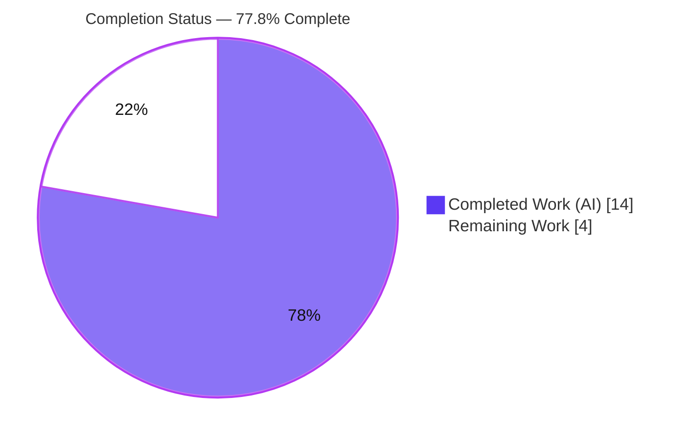
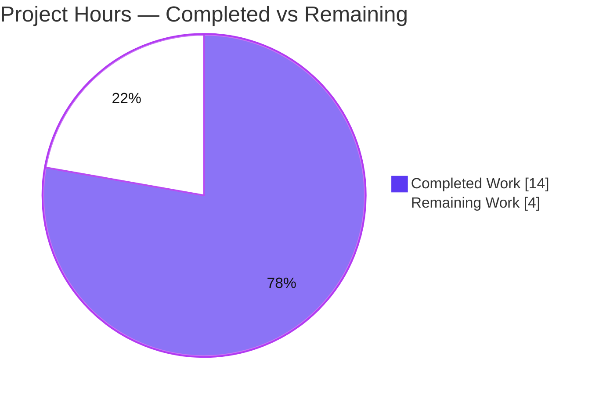
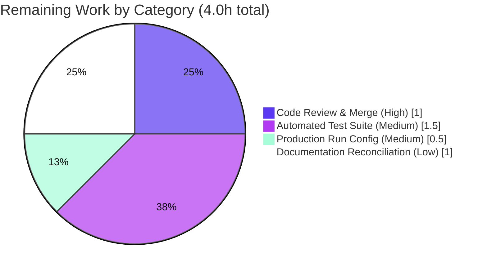

# Blitzy Project Guide — Express.js Endpoint Addition

> **Project:** `hello_world` — Node.js tutorial HTTP server (`existing-projects-qa-test/`)
> **Branch:** `blitzy-58589883-594a-4fe6-ae54-5806b56db2da` · **HEAD:** `552dc09`
> **Status:** ✅ AAP feature complete & validated · Path-to-production hardening remains
>
> **Legend / Brand Colors:** ■ Completed / AI Work (Dark Blue `#5B39F3`) · □ Remaining / Not Completed (White `#FFFFFF`) · Headings/accents Violet-Black `#B23AF2` · Highlights Mint `#A8FDD9`

---

## 1. Executive Summary

### 1.1 Project Overview

This project adds the Express.js web framework to a minimal single-file Node.js HTTP tutorial server and exposes a second plain-text endpoint. The target users are developers learning Node.js/Express fundamentals. Technically, the work introduces `express@^5.2.1` as the first-ever dependency, converts the server's single catch-all request handler into an Express router that serves `GET /` (the preserved `"Hello, World!\n"` response) and a new `GET /good-evening` (returning `"Good evening"`), and wraps the Express app via `http.createServer(app)` so that all pre-existing operational hardening (error handling, graceful shutdown, process guards) is preserved verbatim. The change is intentionally small, surgical, and fully backward compatible for the primary endpoint.

### 1.2 Completion Status

The project is **77.8% complete** on an AAP-scoped, hours-based measure. **100% of the AAP-specified feature requirements (R1, R2, R3, integration, and the explainability deliverables) are complete and independently validated as production-ready.** The remaining 22.2% (4.0 hours) is entirely standard *path-to-production* hardening (human review & merge, an automated regression test suite, production run configuration, and documentation reconciliation) that fell outside the explicit AAP feature scope but is recommended before operating this as a maintained production service.



| Metric | Hours |
|--------|-------|
| **Total Hours** | **18.0** |
| Completed Hours (AI + Manual) | 14.0 (AI: 14.0 · Manual: 0.0) |
| Remaining Hours | 4.0 |
| **Percent Complete** | **77.8%** |

> Calculation: `Completed 14.0 / (Completed 14.0 + Remaining 4.0) = 14.0 / 18.0 = 77.8%`.

### 1.3 Key Accomplishments

- ✅ **Express.js added (R1)** — `express@^5.2.1` declared in `package.json`; `package-lock.json` regenerated (`lockfileVersion 3`, 68 packages); `node_modules/` (express@5.2.1 + 67 transitive deps) installed and committed.
- ✅ **"Hello, World!" preserved (R2)** — `app.get('/')` returns `text/plain` `"Hello, World!\n"` (HTTP 200), byte-identical to the original response.
- ✅ **"Good evening" endpoint added (R3)** — `app.get('/good-evening')` returns `text/plain` `"Good evening"` (HTTP 200).
- ✅ **Zero-regression integration** — Express wrapped via `http.createServer(app)`; every operational hardening construct (server `error`/`clientError` handlers, `gracefulShutdown`, `SIGTERM`/`SIGINT`, `uncaughtException`, `unhandledRejection`, `server.listen`, `HOST`/`PORT` config) preserved verbatim (git diff confirms only the request-dispatch region changed: `+6/-30`).
- ✅ **Explainability deliverables** — 9-entry decision log (D1–D9) and a 13-mapping bidirectional traceability matrix (100% source-construct coverage) delivered in the AAP.
- ✅ **Comprehensive autonomous validation** — 5 production-readiness gates passed 100%; functional harness 11/11; live runtime + browser screenshots; dependency tree clean; `npm ci --dry-run` in sync.

### 1.4 Critical Unresolved Issues

| Issue | Impact | Owner | ETA |
|-------|--------|-------|-----|
| _None — no blocking issues._ All AAP requirements are implemented, compile cleanly (`node --check` exit 0), and pass functional & runtime validation. | None | — | — |

> There are **no critical unresolved issues**. The items in Sections 1.6 / 2.2 are recommended path-to-production enhancements, not defects.

### 1.5 Access Issues

| System/Resource | Type of Access | Issue Description | Resolution Status | Owner |
|-----------------|----------------|-------------------|-------------------|-------|
| _n/a_ | _n/a_ | No access issues identified | ✅ N/A | — |

> **No access issues identified.** The repository, Node.js/npm toolchain, and the npm registry (for dependency resolution) were all reachable; the branch is checked out and fully committed locally.

### 1.6 Recommended Next Steps

1. **[High]** Peer-review the 3-file diff (`server.js`, `package.json`, `package-lock.json`) plus committed `node_modules/`, then merge the branch to `main`. *(≈1.0h)*
2. **[Medium]** Add an automated regression test suite (jest + supertest, or Node's built-in `node:test`) covering both endpoints and 404/method routing, replacing the intentional `npm test` placeholder. *(≈1.5h)*
3. **[Medium]** Add production run configuration — a `start` script, an `"engines": { "node": ">=18" }` field, and a process manager (PM2/systemd/container) with a restart policy. *(≈0.5h)*
4. **[Low]** Reconcile `blitzy/documentation/**` (prior spec still states the zero-dependency mandate / Express exclusion) with the now-authorized Express addition. *(≈1.0h)*

---

## 2. Project Hours Breakdown

### 2.1 Completed Work Detail

All completed work was performed autonomously by Blitzy agents (0 manual hours). Each component traces to a specific AAP requirement.

| Component | Hours | Description |
|-----------|------:|-------------|
| AAP authoring & analysis | 3.0 | Intent clarification, requirement decomposition (R1/R2/R3), repository scope discovery, integration analysis (before/after request-flow) |
| R1 — Express dependency | 2.5 | Version research (`express@^5.2.1`), `package.json` `dependencies` block, `npm install`, `package-lock.json` regeneration (`lockfileVersion 3`, 68 pkgs), `node_modules` commit |
| R2 — Preserve "Hello, World!" | 1.0 | `app.get('/')` returning `text/plain` `"Hello, World!\n"`, byte-preserving the original response |
| R3 — "Good evening" endpoint | 0.5 | New `app.get('/good-evening')` returning `text/plain` `"Good evening"` |
| Integration — `http.createServer(app)` | 2.5 | Surgical replacement of the inline dispatch callback with the Express app; verbatim preservation of all hardening; diff verification |
| Explainability deliverables | 1.5 | Decision log (D1–D9) + bidirectional traceability matrix (13 mappings, 100% coverage) |
| Autonomous validation & QA | 3.0 | 5 production gates, functional harness (11/11), live runtime, `PORT`/`HOST` override, graceful shutdown, browser screenshots |
| **Total Completed** | **14.0** | |

### 2.2 Remaining Work Detail

All remaining work is standard path-to-production hardening (no AAP feature gaps).

| Category | Hours | Priority |
|----------|------:|----------|
| Code Review & Merge | 1.0 | High |
| Automated Test Suite | 1.5 | Medium |
| Production Run Configuration | 0.5 | Medium |
| Documentation Reconciliation | 1.0 | Low |
| **Total Remaining** | **4.0** | |

### 2.3 Hours Reconciliation

| Aggregate | Hours |
|-----------|------:|
| Completed (Section 2.1) | 14.0 |
| Remaining (Section 2.2) | 4.0 |
| **Total Project Hours** | **18.0** |
| Percent Complete | 77.8% |

> **Integrity:** `2.1 (14.0) + 2.2 (4.0) = 18.0` Total; Remaining `4.0` is identical across Sections 1.2, 2.2, and 7.

---

## 3. Test Results

All results below originate from Blitzy's autonomous validation logs for this project and were independently re-verified during this assessment. No persistent automated test suite exists by AAP design (the `npm test` placeholder is intentionally retained), so formal line-coverage instrumentation was not run — the functional harness exercises the real committed `server.js` end-to-end.

| Test Category | Framework | Total Tests | Passed | Failed | Coverage % | Notes |
|---------------|-----------|------------:|-------:|-------:|-----------:|-------|
| Functional / Routing | Ad-hoc Node HTTP harness | 11 | 11 | 0 | N/A | R2 status/type/body; R3 status/type/body; 404 unmatched; `POST /` → 404 (routing proof); `HEAD /` → 200; exact-path matching |
| Static Syntax | `node --check` | 1 | 1 | 0 | N/A | `server.js` parses cleanly (exit 0) |
| Dependency Integrity | npm (`ls` / `ci --dry-run`) | 3 | 3 | 0 | N/A | `npm ls express` → 5.2.1; `npm ls --all` clean; `npm ci --dry-run` "up to date" |
| Runtime Smoke | curl + Chrome (screenshots) | 3 | 3 | 0 | N/A | `GET /`, `GET /good-evening`, `GET /missing` verified; 7 screenshots captured |
| **Total** | — | **18** | **18** | **0** | **N/A** | 100% pass rate across all autonomous checks |

> **Note:** The `npm test` script is an intentional placeholder (`echo "Error: no test specified" && exit 1`) preserved per AAP §0.6.2 — it is a documented stub, **not** a failing test. Establishing a real suite is tracked in Section 2.2 (Automated Test Suite, 1.5h).

---

## 4. Runtime Validation & UI Verification

This is a server-side, plain-text HTTP service; there is no web UI, component library, or design system to verify. Runtime health and API integration were validated live.

**Runtime Health**
- ✅ **Operational** — `node server.js` starts cleanly: `Server running at http://127.0.0.1:3000/`, empty stderr.
- ✅ **Operational** — Configurable binding via `HOST`/`PORT` env vars validated on custom ports (`:3457`, `:3512`, `:8080`).
- ✅ **Operational** — Graceful shutdown: `SIGINT`/`SIGTERM` → "Starting graceful shutdown…" → "Server closed. All connections finished." → exit 0 (validated by Final Validator; screenshot captured).

**API Endpoints**
- ✅ **Operational** — `GET /` → `200`, `Content-Type: text/plain; charset=utf-8`, `X-Powered-By: Express`, body `"Hello, World!\n"` (Content-Length 14).
- ✅ **Operational** — `GET /good-evening` → `200`, `text/plain; charset=utf-8`, body `"Good evening"` (Content-Length 12).
- ✅ **Operational** — `GET /<unmatched>` → `404` (Express default; authorized behavior change D3).
- ✅ **Operational** — `POST /` → `404`, proving genuine method-aware Express routing (vs. the old universal catch-all).

**UI Verification**
- ⚠ **Partial (N/A by design)** — No browser UI exists; endpoints render as raw plain text. Browser screenshots of both endpoints were captured with no console errors.

---

## 5. Compliance & Quality Review

Cross-mapping of AAP deliverables and user rules to quality benchmarks. All items validated during autonomous QA.

| Benchmark / Requirement | Status | Progress | Notes |
|-------------------------|--------|----------|-------|
| R1 — Express dependency declared & locked | ✅ Pass | 100% | `express@^5.2.1`; lockfile v3; 68 pkgs; `npm ci --dry-run` in sync |
| R2 — "Hello, World!" preserved | ✅ Pass | 100% | Byte-identical `"Hello, World!\n"` via `GET /` |
| R3 — "Good evening" endpoint | ✅ Pass | 100% | `text/plain` `"Good evening"` via `GET /good-evening` |
| Integration — hardening preserved | ✅ Pass | 100% | Only dispatch region changed; all guards intact (`+6/-30`) |
| Rule: Minimal changes | ✅ Pass | 100% | Edits confined to `server.js`, `package.json`, `package-lock.json` (+ generated `node_modules`) |
| Rule: Identity surface preserved | ✅ Pass | 100% | `package.json` name/version/description/main/scripts/author/license unchanged; `README.md` untouched |
| Rule: Explainability | ✅ Pass | 100% | Decision log (D1–D9) + traceability matrix (13 mappings) |
| Static syntax quality (`node --check`) | ✅ Pass | 100% | Exit 0; no lint config in project (N/A) |
| Automated regression tests | ❌ Open | 0% | Placeholder retained by design; real suite recommended (Section 2.2) |
| Documentation consistency | ⚠ Partial | 50% | Prior spec still states zero-dependency mandate; reconciliation recommended |

**Fixes applied during autonomous validation:** None required — the prior agents' implementation was already correct; this session confirmed production-readiness end-to-end.

---

## 6. Risk Assessment

| Risk | Category | Severity | Probability | Mitigation | Status |
|------|----------|----------|-------------|------------|--------|
| No automated regression suite (`npm test` is a placeholder) | Technical | Medium | Medium | Add jest+supertest / `node:test` covering both routes + 404/method | Open |
| Express 5.x is a recent major line (some ecosystem still on v4) | Technical | Low | Low | Stable `app.get`/`res.send` API; exact version pinned in lockfile | Mitigated |
| D3 behavior change: unmatched paths/non-GET now return Express 404 | Technical | Low | Low | Documented & authorized (AAP D3); only two routes requested | Accepted |
| Express adds 67 transitive deps (was zero) — supply-chain surface | Security | Low | Low | SHA-512 integrity in lockfile; run `npm audit` + enable Dependabot | Open |
| `X-Powered-By: Express` header disclosure | Security | Low | Low | Optional `app.disable('x-powered-by')` / helmet (out of scope) | Accepted |
| No HTTPS/TLS, rate limiting, CORS, or auth | Security | Low | Low | Loopback default (not public); TLS at reverse proxy if exposed | Accepted |
| No process manager / `start` script; process self-exits on fatal errors | Operational | Medium | Medium | Run under PM2/systemd/container with restart policy; add `start` script | Open |
| No CI/CD pipeline (manual deploys & dep updates) | Operational | Low | Medium | Minimal CI: `npm ci` + `node --check` + tests | Open |
| Console-only logging (no aggregation) | Operational | Low | Low | Add structured logger if productionizing | Accepted |
| `node_modules` committed (595 files, 2.1 MB) | Operational | Low | Low | AAP §0.6.1 includes it; integrity via lockfile + `npm ci` | Accepted |
| Documentation drift (prior spec contradicts implementation) | Integration | Low | Medium | Reconcile `blitzy/documentation/**` | Open |
| No `engines` field to enforce Node ≥ 18 (Express 5 requirement) | Integration | Low | Low | Add `"engines": {"node": ">=18"}` | Open |

**Summary:** 0 High-severity risks. The two Medium risks (no test suite, no process manager/crash-restart) map directly to the remaining path-to-production work. Overall risk posture is **Low** for the delivered feature.

---

## 7. Visual Project Status

**Project Hours Breakdown** (Completed = Dark Blue `#5B39F3`, Remaining = White `#FFFFFF`):



**Remaining Work by Category** (hours, from Section 2.2 — total 4.0h):



> **Integrity:** "Remaining Work" = **4.0h**, identical to Section 1.2 (Remaining Hours) and the Section 2.2 category sum (`1.0 + 1.5 + 0.5 + 1.0 = 4.0`).

---

## 8. Summary & Recommendations

**Achievements.** The requested feature is fully delivered. Express.js was introduced as the project's first dependency, the original `"Hello, World!\n"` response was preserved through an Express `GET /` route, and a new `GET /good-evening` route was added — all while wrapping the app in the existing `http.Server` so that every operational hardening behavior remained byte-for-byte intact. The change is minimal (3 source files; only the request-dispatch region of `server.js` changed) and passed 100% of Blitzy's autonomous validation gates.

**Remaining gaps.** With the AAP feature 100% complete, the project stands at **77.8%** on the total path-to-production measure. The remaining **4.0 hours** are hardening/operability items outside the explicit AAP scope: human review & merge, an automated regression test suite, production run configuration, and documentation reconciliation.

**Critical path to production.** (1) Peer-review & merge the branch → (2) add the automated test suite → (3) add run configuration & a restart policy → (4) reconcile prior documentation.

| Success Metric | Target | Actual | Status |
|----------------|--------|--------|--------|
| AAP requirements implemented | 3/3 (+integration) | 3/3 (+integration) | ✅ |
| Endpoints returning correct bodies | 2/2 | 2/2 | ✅ |
| Functional harness pass rate | 100% | 11/11 (100%) | ✅ |
| Compilation / syntax | Clean | `node --check` exit 0 | ✅ |
| Dependency tree health | Clean | 0 invalid/UNMET/extraneous | ✅ |
| Automated regression suite | Present | Placeholder only | ❌ (path-to-production) |

**Production readiness assessment.** The feature is **functionally production-ready** for the requested scope and can be run today via `node server.js`. Before operating it as a *maintained* production service, complete the 4.0h of path-to-production tasks above (most importantly, human review/merge and a real test suite). Because human review has not yet occurred, completion is capped below 100% at **77.8%**.

---

## 9. Development Guide

### 9.1 System Prerequisites
- **Node.js ≥ 18** (Express 5 requirement). Validated on **v20.20.2**; also runs on v22. LTS v20.x recommended.
- **npm** (bundled with Node; validated **10.8.2**).
- **Git** (to clone/checkout). Cross-platform: Windows, Linux, macOS.
- Disk: ~2.1 MB for `node_modules`.

### 9.2 Environment Setup
The application lives in the `existing-projects-qa-test/` subdirectory.

```bash
# Bash / Linux / macOS
cd existing-projects-qa-test
```
```powershell
# Windows PowerShell
Set-Location existing-projects-qa-test
```

Optional configuration (defaults shown):

| Variable | Default | Purpose |
|----------|---------|---------|
| `HOST` | `127.0.0.1` | Bind address |
| `PORT` | `3000` | Listen port |

### 9.3 Dependency Installation
```bash
npm install        # idempotent; prints "up to date" (deps are committed)
# or, for an exact reproducible install from the lockfile:
npm ci
```
Verify:
```bash
npm ls express     # -> hello_world@1.0.0 └── express@5.2.1
```

### 9.4 Application Startup
```bash
node server.js
# Expected:
#   Server running at http://127.0.0.1:3000/
#   Press Ctrl+C to stop the server
```
Custom host/port:
```bash
# Bash
PORT=8080 HOST=0.0.0.0 node server.js
```
```powershell
# Windows PowerShell
$env:PORT = "8080"; $env:HOST = "0.0.0.0"; node server.js
```

### 9.5 Verification Steps
```bash
curl http://127.0.0.1:3000/               # -> Hello, World!
curl http://127.0.0.1:3000/good-evening   # -> Good evening
curl -i http://127.0.0.1:3000/missing     # -> HTTP/1.1 404 Not Found
node --check server.js                     # static syntax gate (exit 0)
```
Expected response headers for both endpoints: `200 OK`, `Content-Type: text/plain; charset=utf-8`.

### 9.6 Example Usage
```bash
$ curl -s http://127.0.0.1:3000/
Hello, World!
$ curl -s http://127.0.0.1:3000/good-evening
Good evening
```
Stop the server with **Ctrl+C** — the graceful-shutdown handler drains in-flight connections, logs "Server closed. All connections finished.", and exits 0.

### 9.7 Troubleshooting
- **`EADDRINUSE`** — server logs `Port <n> is already in use` and exits 1 → choose a free `PORT`.
- **`EACCES`** — `Permission denied to bind to port <n>` → use `PORT ≥ 1024` or elevated permissions.
- **`npm test` prints "Error: no test specified" and exits 1** — this is an **intentional placeholder** (AAP §0.6.2), not a real failure.
- **Express won't load / syntax errors on old Node** — ensure **Node ≥ 18**.
- **`main` → `index.js`** in `package.json` is a pre-existing anomaly; always launch via `node server.js` (there is no `start` script yet).
- **Windows signals** — interactive **Ctrl+C** triggers the SIGINT graceful path; a *programmatic* `SIGTERM` may force-terminate (Windows lacks POSIX signals) — this is environmental, not a code defect.

---

## 10. Appendices

### A. Command Reference
| Command | Purpose |
|---------|---------|
| `npm install` | Install dependencies (idempotent) |
| `npm ci` | Reproducible install from `package-lock.json` |
| `npm ls express` | Confirm resolved Express version (5.2.1) |
| `node server.js` | Start the server |
| `node --check server.js` | Static syntax validation |
| `curl http://127.0.0.1:3000/` | Test the "Hello, World!" endpoint |
| `curl http://127.0.0.1:3000/good-evening` | Test the "Good evening" endpoint |

### B. Port Reference
| Port | Service | Notes |
|------|---------|-------|
| `3000` | HTTP server (default) | Override with `PORT` |
| `8080` / custom | HTTP server (overridden) | Validated during QA |

### C. Key File Locations
| Path | Role |
|------|------|
| `existing-projects-qa-test/server.js` | Entry point: Express app, 2 routes, full operational hardening (119 lines) |
| `existing-projects-qa-test/package.json` | Manifest (`express ^5.2.1`; identity/scripts unchanged) |
| `existing-projects-qa-test/package-lock.json` | Lockfile v3 (68 packages) |
| `existing-projects-qa-test/node_modules/` | Installed deps (express@5.2.1 + 67 transitive) |
| `existing-projects-qa-test/README.md` | Identity notice ("Do not touch!") — unchanged |
| `blitzy/screenshots/` | QA validation screenshots (7 files) |

### D. Technology Versions
| Component | Version |
|-----------|---------|
| Node.js | v20.20.2 (validated; ≥18 required) |
| npm | 10.8.2 |
| express | 5.2.1 (declared `^5.2.1`) |
| lockfileVersion | 3 |
| Total packages (lockfile) | 68 |

### E. Environment Variable Reference
| Variable | Default | Required | Description |
|----------|---------|----------|-------------|
| `HOST` | `127.0.0.1` | No | Interface to bind |
| `PORT` | `3000` | No | TCP port to listen on |

### F. Developer Tools Guide
| Tool | Usage |
|------|-------|
| Node.js runtime | `node server.js`, `node --check server.js` |
| npm | dependency management (`install`, `ci`, `ls`) |
| curl / browser | endpoint verification |
| git | `git log`, `git diff <base> HEAD --stat` for change review |
| Recommended (path-to-production) | jest + supertest (or `node:test`) for the regression suite; PM2/systemd for process management |

### G. Glossary
| Term | Definition |
|------|------------|
| AAP | Agent Action Plan — the authoritative spec for this feature |
| R1/R2/R3 | The three AAP requirements (add Express; preserve "Hello, World!"; add "Good evening") |
| D3 / D8 | Authorized deviations in the AAP decision log (404 for unmatched paths; touching manifests) |
| Path-to-production | Standard deployment/hardening activities beyond the explicit AAP feature scope |
| Graceful shutdown | Draining in-flight connections on `SIGTERM`/`SIGINT` before process exit |
| Hardening | Server/process error handling and lifecycle guards preserved from the original server |

---

*Generated by the Blitzy Platform · AAP-scoped completion measured via hours-based methodology (PA1). Total 18.0h · Completed 14.0h · Remaining 4.0h · 77.8% complete.*