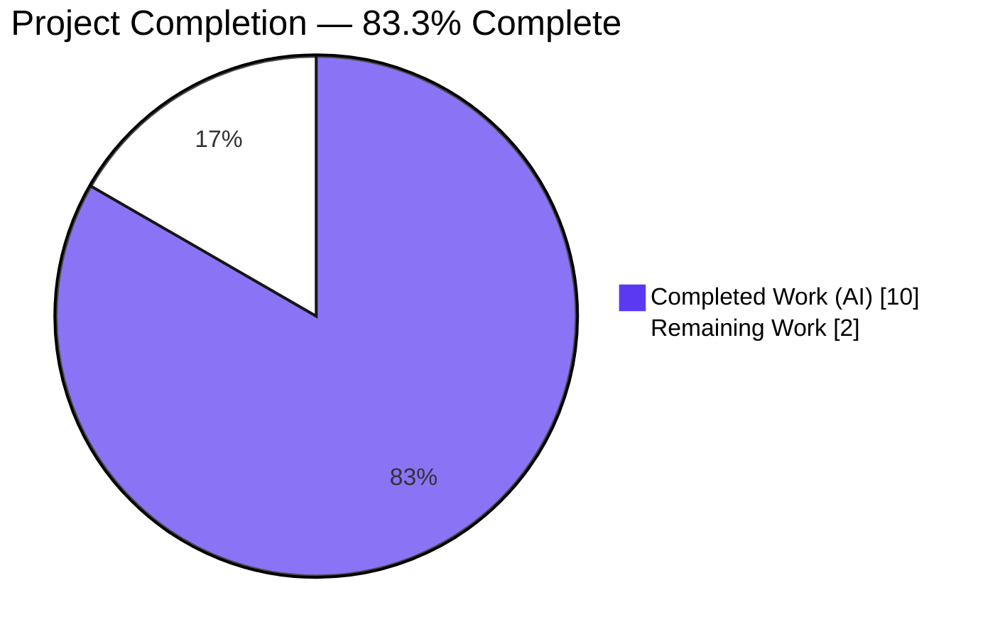
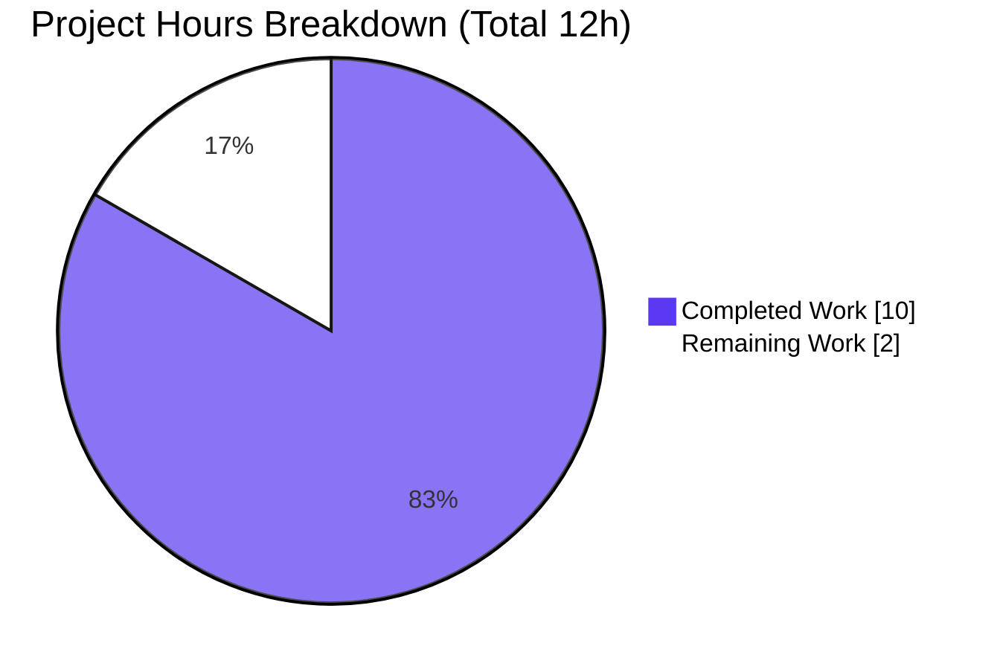
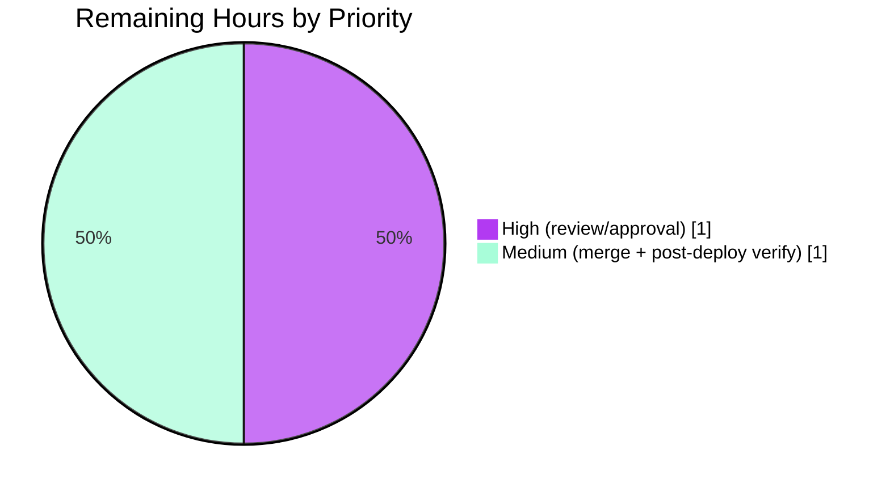

# Blitzy Project Guide — Express.js Integration & `GET /good-evening` Endpoint

> Project: `hello_world` (Node.js single-file HTTP service) · Branch: `blitzy-12bf7583-6d37-4fd4-9410-8011005d98b7` · HEAD: `7e46f2a`
> Brand color legend — **Completed / AI Work:** Dark Blue `#5B39F3` · **Remaining / Not Completed:** White `#FFFFFF` · Headings/Accents: Violet-Black `#B23AF2` · Highlight: Mint `#A8FDD9`

---

## 1. Executive Summary

### 1.1 Project Overview

`hello_world` is a minimal, single-file Node.js HTTP service. This feature introduces the **Express.js** web framework into the previously zero-dependency native-`http` server and adds a second endpoint, **`GET /good-evening`** (returns `Good evening\n`), while preserving the original **`GET /`** response (`Hello, World!\n`) byte-for-byte. Express is mounted via `http.createServer(app)` so every pre-existing operational safeguard — error/client-error handling, graceful shutdown, signal handlers, and startup logging — continues to function unchanged. The technical scope is four files (`server.js`, `package.json`, `package-lock.json`, and a new `DECISION_LOG.md`). Business impact: it demonstrates a minimal, fully-documented, reversible framework-adoption pattern for the project's tutorial/integration audience.

### 1.2 Completion Status



| Metric | Value |
|--------|-------|
| **Total Hours** | 12 |
| **Completed Hours (AI + Manual)** | 10 (AI: 10 · Manual: 0) |
| **Remaining Hours** | 2 |
| **Percent Complete** | **83.3%** |

> Completion is computed with the AAP-scoped hours methodology: `Completed ÷ (Completed + Remaining) = 10 ÷ 12 = 83.3%`. All AAP-defined work is delivered and validated; the remaining 2 hours are path-to-production human activities (review, merge, post-deploy verification).

### 1.3 Key Accomplishments

- ✅ **Express.js `^5.2.1` adopted** as the project's first-ever runtime dependency; resolves to `express@5.2.1` (67-package tree, `npm ci` clean).
- ✅ **New endpoint `GET /good-evening`** returns `Good evening\n` (`200`, `text/plain`) — 13-byte body verified.
- ✅ **`GET /` preserved byte-for-byte** — `Hello, World!\n` (14 bytes, hex-verified identical to the original).
- ✅ **All operational hardening retained** by mounting Express via `http.createServer(app)` (error, clientError, graceful shutdown w/ 10s timer, SIGTERM/SIGINT, uncaughtException/unhandledRejection).
- ✅ **`DECISION_LOG.md` authored** — 9-row decision log + 6-row bidirectional traceability matrix (100% coverage); Explainability rule satisfied with **no** rationale comments in code.
- ✅ **Minimal-changes discipline honored** — exactly 4 in-scope files changed; `README.md` and `blitzy/documentation/*` untouched; `test` placeholder and `main:"index.js"` anomaly intentionally preserved.
- ✅ **Five-gate autonomous validation passed** and **independently re-verified** during this assessment (dependencies, compilation, tests, byte-exact runtime, scope/commits).

### 1.4 Critical Unresolved Issues

| Issue | Impact | Owner | ETA |
|-------|--------|-------|-----|
| _None identified_ | The feature compiles, installs cleanly, runs, and serves both endpoints with byte-exact contracts; zero defects found. | — | — |

> **No critical unresolved issues.** The autonomous validator reported zero outstanding issues and zero required fixes; independent re-verification during this assessment confirmed the same.

### 1.5 Access Issues

| System/Resource | Type of Access | Issue Description | Resolution Status | Owner |
|-----------------|----------------|-------------------|-------------------|-------|
| npm registry (`registry.npmjs.org`) | Package install | Reachable — `npm ci` installed 67 packages successfully | ✅ No issue | — |
| Git repository / branch | Read/write | Branch `blitzy-12bf7583-…` accessible; all commits present at HEAD | ✅ No issue | — |

> **No access issues identified.** All resources required for build, validation, and integration were reachable.

### 1.6 Recommended Next Steps

1. **[High]** Review the 4-file diff and **approve the pull request** (verify byte-exact `GET /` contract, `/good-evening`, preserved hardening, and the 3 documented deviations D4/D6/D9).
2. **[Medium]** **Merge to the base branch** and run `npm ci` in the target environment (confirm runtime is **Node ≥ 18**).
3. **[Medium]** **Post-deployment verification** — smoke-test both endpoints in the deployed environment and confirm graceful shutdown.
4. **[Low]** _(Optional, out of AAP scope)_ Add `npm audit`/Dependabot to CI to monitor the newly introduced dependency tree.
5. **[Low]** _(Optional, out of AAP scope)_ Consider adding a `start` script, an `engines` field (`"node": ">=18"`), and a minimal smoke test — explicitly deferred by the AAP (§0.6.2).

---

## 2. Project Hours Breakdown

### 2.1 Completed Work Detail

| Component | Hours | Description |
|-----------|-------|-------------|
| Express.js adoption & version research (R1) | 1.5 | Selected `express@^5.2.1` (TC-recommended v5 line); confirmed Node ≥ 18 floor and routing convention; wired `require('express')` + `const app = express()`. |
| Preserve `GET /` byte-exact (R3) | 0.5 | Explicit root route reproducing status `200`, `text/plain`, body `Hello, World!\n` identical to the original handler. |
| Add `GET /good-evening` endpoint (R2) | 0.5 | New route returning `Good evening\n`; path (kebab-case, D2) and body/newline (D3) decisions. |
| `package.json` dependency (I1) | 0.5 | Added `dependencies: { "express": "^5.2.1" }`; preserved name/version/main/test/author/license. |
| `package-lock.json` regeneration (I2) | 0.5 | Regenerated lockfile (v3, 68 entries) capturing the resolved `express` graph. |
| Server bootstrap rework preserving hardening (I3) | 2.0 | Mounted Express via `http.createServer(app)` so all lifecycle hooks (error/clientError/graceful shutdown/signals/uncaught handlers/listen) remain bound to the same `http.Server` — the key minimal-diff design choice. |
| `DECISION_LOG.md` — decision log + traceability (I4) | 2.0 | Authored 9-row decision table (alternatives/rationale/risk) + 6-row bidirectional source→target traceability matrix (100% coverage). |
| Explainability compliance — remove code comments | 0.5 | Follow-up commit `7e46f2a` removed rationale comments from source so the log is the single source of truth. |
| Blitzy autonomous validation (5 gates) | 2.0 | Dependencies, compilation, tests, byte-exact runtime (both endpoints + 404 + hardening), and scope/commit verification. |
| **Total Completed** | **10.0** | |

### 2.2 Remaining Work Detail

| Category | Hours | Priority |
|----------|-------|----------|
| Human code review & PR approval (P1) | 1.0 | High |
| Merge to base + deployment sign-off (`npm ci`, confirm Node ≥ 18) (P2) | 0.5 | Medium |
| Post-deployment production verification (endpoint smoke-test + runtime/log check) (P3) | 0.5 | Medium |
| **Total Remaining** | **2.0** | |

> _Optional enhancements_ (add `npm audit` to CI, `start` script, `engines` field, smoke test, disable `X-Powered-By`) are **explicitly out of AAP scope** (§0.6.2) and are **not** counted in the remaining hours above; they appear only as advisory recommendations in Sections 1.6 and 8.

### 2.3 Hours Reconciliation

| Bucket | Hours |
|--------|-------|
| Completed (Section 2.1) | 10.0 |
| Remaining (Section 2.2) | 2.0 |
| **Total Project** | **12.0** |
| **Percent Complete** | **10 ÷ 12 = 83.3%** |

---

## 3. Test Results

> **Testing posture (from Blitzy's autonomous validation logs):** This project has **zero automated tests by explicit design** (decision D8; test frameworks are out of scope per AAP §0.6.2). The mandated validation methodology is **manual functional verification** (`node --check` + HTTP requests). The `npm test` script is a preserved placeholder that exits `1` by design and is explicitly **not** a success criterion. All tests/checks listed below originate from Blitzy's autonomous validation and were independently re-run during this assessment.

| Test Category | Framework | Total Tests | Passed | Failed | Coverage % | Notes |
|---------------|-----------|-------------|--------|--------|-----------|-------|
| Automated Unit/Integration | None (by design, D8) | 0 | 0 | 0 | N/A | Test frameworks out of scope (§0.6.2); `npm test` placeholder exits 1 by design. |
| Compilation Check | `node --check` | 1 | 1 | 0 | N/A | `node --check server.js` → exit 0. |
| Dependency Integrity | `npm ci` / `npm ls` | 2 | 2 | 0 | N/A | Clean deterministic install (67 packages); `express@5.2.1` resolves; `npm ls` clean tree. |
| Manual Functional (Runtime) | `curl` / HTTP client | 3 | 3 | 0 | N/A | `GET /` → 200 byte-exact (14B); `GET /good-evening` → 200 (13B); `GET /<unknown>` → 404 (per D4). |
| Manual Operational (Hardening) | Signal/port harness | 2 | 2 | 0 | N/A | EADDRINUSE → logs + exit 1; SIGINT/SIGTERM → graceful shutdown → exit 0. |
| **Total** | — | **8** | **8** | **0** | **N/A** | **100% of executed checks passed; 0 failing, 0 blocked, 0 skipped.** |

---

## 4. Runtime Validation & UI Verification

**Runtime health & API behavior** (verified on Node v20.20.2; ports 3000/3100/3200/8080):

- ✅ **Server startup** — logs `Server running at http://127.0.0.1:3000/` and `Press Ctrl+C to stop the server`; honors `HOST`/`PORT` env vars.
- ✅ **`GET /`** — `200`, `Content-Type: text/plain; charset=utf-8`, `Content-Length: 14`, body `Hello, World!\n` (hex `48 65 6C 6C 6F 2C 20 57 6F 72 6C 64 21 0A` — byte-identical to original).
- ✅ **`GET /good-evening`** — `200`, `Content-Type: text/plain; charset=utf-8`, `Content-Length: 13`, body `Good evening\n` (hex `47 6F 6F 64 20 65 76 65 6E 69 6E 67 0A`).
- ✅ **`GET /<unknown>`** — `404` (Express default handler; intentional refinement per decision D4).
- ✅ **Port conflict (EADDRINUSE)** — logs `Port <PORT> is already in use` and exits `1`.
- ✅ **Graceful shutdown (SIGINT/SIGTERM)** — `server.close()` → `Server closed. All connections finished.` → exit `0`.
- ⚠ **Framework disclosure** — responses include the default `X-Powered-By: Express` header (informational; see Risk S-R2).

**UI Verification:** ❕ **Not applicable.** This is a backend `text/plain` HTTP service with no frontend, component library, or design system (AAP §0.5.4). No Figma inputs were provided.

**API Integration:** ❕ **Not applicable.** The service has no external service dependencies, databases, or third-party integrations.

---

## 5. Compliance & Quality Review

AAP deliverables cross-mapped to quality/compliance benchmarks. Fixes applied during autonomous validation: **none required (0 defects).** The one self-correction during implementation was commit `7e46f2a`, which removed rationale comments from `server.js` to fully satisfy the Explainability rule.

| Requirement / Benchmark | Status | Progress | Evidence / Notes |
|-------------------------|--------|----------|------------------|
| R1 — Adopt Express.js | ✅ Pass | 100% | `express ^5.2.1` in `package.json`; resolves to `5.2.1`. |
| R2 — `GET /good-evening` → `Good evening\n` | ✅ Pass | 100% | Route present; 13-byte body verified at runtime. |
| R3 — Preserve `GET /` byte-exact | ✅ Pass | 100% | 14-byte hex-identical body verified. |
| Operational hardening preserved (T6) | ✅ Pass | 100% | All hooks intact; EADDRINUSE + SIGINT/SIGTERM validated. |
| Explainability — `DECISION_LOG.md` | ✅ Pass | 100% | 9 decisions + 6 traceability rows; no rationale comments in code. |
| Bidirectional traceability (100% coverage) | ✅ Pass | 100% | T1–T6 map every source construct to its Express target. |
| Minimal-changes rule | ✅ Pass | 100% | Exactly 4 in-scope files changed. |
| Preservation policy (README/anomalies) | ✅ Pass | 100% | `README.md` + docs untouched; `test`/`main` anomalies preserved (D7). |
| Dependency lockfile integrity | ✅ Pass | 100% | `npm ci` clean; lockfileVersion 3; 68 entries. |
| Compilation & static analysis | ✅ Pass | 100% | `node --check` exit 0; 0 static-analysis violations. |
| Automated test coverage | ⚠ By design | N/A | 0 tests (D8, out of scope); manual verification is the mandated method. |

---

## 6. Risk Assessment

| Risk | Category | Severity | Probability | Mitigation | Status |
|------|----------|----------|-------------|------------|--------|
| Node.js floor raised to `>= 18` (Express 5 engines) | Technical | Low | Low | Target runs Node 20 (satisfies); documented D1; verify prod runtime ≥ 18 | Mitigated |
| Unknown paths now return `404` instead of old any-path Hello World | Technical | Low | Low | Intentional (D4); add catch-all middleware only if legacy behavior required | Accepted |
| No automated regression tests (by design) | Technical | Medium | Low | Manual byte-exact verification passed; optional smoke test recommended | Accepted (by design) |
| New ~67-package transitive supply-chain surface (from zero) | Security | Low | Low | Deterministic `npm ci` from committed lockfile; run `npm audit` in CI | Open (recommend audit) |
| `X-Powered-By: Express` header discloses framework | Security | Low | Low | Optional `app.disable('x-powered-by')` (out of scope) | Accepted |
| `node_modules` untracked — must `npm ci` in target env | Operational | Low | Low | Committed lockfile + documented run instructions | Mitigated |
| `npm test` placeholder exits 1 (fails a naive CI gate) | Operational | Low | Low | Intentional (D8); not a success criterion; add real script if CI requires | Accepted (intentional) |
| npm registry reachability required for install | Integration | Low | Low | Lockfile pins exact versions; use private mirror if air-gapped | Mitigated |
| Zero-dependency architecture superseded | Integration | Low | N/A | User-mandated (D6); documented in `DECISION_LOG.md` | Accepted (user-mandated) |

> **Overall risk posture: LOW.** No high-severity or blocking risks. All three deviations (D4/D6/D9) are intentional, documented, and accepted.

---

## 7. Visual Project Status

**Project Hours — Completed vs Remaining** (Completed = `#5B39F3`, Remaining = `#FFFFFF`):



**Remaining Work by Priority** (2.0h total):



> **Integrity check:** "Remaining Work" = **2h**, identical to Section 1.2 (Remaining Hours = 2) and the Section 2.2 total (2.0). "Completed Work" = **10h**, identical to Section 2.1 total.

---

## 8. Summary & Recommendations

**Achievements.** Every AAP-defined requirement is delivered and validated. Express.js `^5.2.1` was integrated as the first runtime dependency, a new `GET /good-evening` endpoint was added, and the original `GET /` response was preserved byte-for-byte — all while retaining 100% of the pre-existing operational hardening by mounting Express onto the existing `http.Server`. The Explainability rule was satisfied via a complete `DECISION_LOG.md` (9 decisions + a 100%-coverage traceability matrix), and the minimal-changes and preservation policies were honored exactly (4 in-scope files; `README.md` and docs untouched).

**Remaining gaps & critical path.** The project is **83.3% complete** (10 of 12 hours). The remaining **2 hours** are entirely **path-to-production human activities**: (1) code review & PR approval, (2) merge + deployment sign-off, and (3) post-deployment verification. There are **no** outstanding engineering defects and **no** partially-completed AAP items.

**Success metrics.** Five autonomous validation gates passed and were independently re-verified: clean `npm ci` (67 packages), `node --check` exit 0, byte-exact endpoint responses (14B / 13B), correct `404` behavior, and validated shutdown/error hardening.

**Production readiness assessment.** ✅ **Ready for human review and merge.** The codebase compiles, installs deterministically, runs, and serves both endpoints with byte-exact contracts. Recommended (optional, out-of-scope) hardening for long-term maintenance: add `npm audit` to CI, a `start` script, an `engines` field, and a minimal smoke test.

| Summary Metric | Value |
|----------------|-------|
| AAP requirements delivered | 9 / 9 (100%) |
| Engineering defects outstanding | 0 |
| Completion (hours-based) | 83.3% (10 / 12h) |
| Remaining work | 2h (path-to-production, human) |
| Overall risk posture | Low |

---

## 9. Development Guide

### 9.1 System Prerequisites

- **Node.js ≥ 18** (Express 5 engine floor). Verified on **v20.20.2**. Recommended: Node 20 LTS.
- **npm** (bundled with Node). Verified on **10.8.2**.
- **Git** for checkout.
- **Network access** to `registry.npmjs.org` for installation (or a configured private mirror).
- OS-agnostic (validated on Windows Server 2022; runs on Linux/macOS).

### 9.2 Environment Setup

```bash
# From the repository root, enter the project directory
cd existing-projects-qa-test

# (Optional) Override bind host/port — defaults are 127.0.0.1:3000
export HOST=127.0.0.1
export PORT=3000
```

| Variable | Default | Purpose |
|----------|---------|---------|
| `HOST` | `127.0.0.1` | Interface the server binds to |
| `PORT` | `3000` | TCP port the server listens on |

### 9.3 Dependency Installation

```bash
# Deterministic, clean install from the committed lockfile (recommended)
npm ci
# Expected output: "added 67 packages in ~1s"  (exit code 0)

# Alternative (updates lockfile if needed)
npm install
```

### 9.4 Compilation / Syntax Check

```bash
node --check server.js
# Expected: exit code 0 (no output)
```

### 9.5 Application Startup

```bash
node server.js
# Expected stdout:
#   Server running at http://127.0.0.1:3000/
#   Press Ctrl+C to stop the server
```

### 9.6 Verification & Example Usage

```bash
# Preserved original endpoint — expect 200 + "Hello, World!\n"
curl -i http://127.0.0.1:3000/
#   HTTP/1.1 200 OK
#   Content-Type: text/plain; charset=utf-8
#   Content-Length: 14
#   X-Powered-By: Express
#   Hello, World!

# New endpoint — expect 200 + "Good evening\n"
curl -i http://127.0.0.1:3000/good-evening
#   HTTP/1.1 200 OK
#   Content-Type: text/plain; charset=utf-8
#   Content-Length: 13
#   Good evening

# Unknown path — expect 404 (Express default, per decision D4)
curl -i http://127.0.0.1:3000/does-not-exist
#   HTTP/1.1 404 Not Found

# Stop the server gracefully
# Press Ctrl+C  ->  "Server closed. All connections finished."  (exit 0)
```

### 9.7 Troubleshooting

| Symptom | Cause | Resolution |
|---------|-------|------------|
| `Port <PORT> is already in use` then exit 1 | `EADDRINUSE` — port occupied | Set a different `PORT`, or free the port. |
| Server won't start on older Node | Express 5 requires Node ≥ 18 | Upgrade to Node 18/20 LTS. |
| `npm ci` fails / lockfile mismatch | Corrupt `node_modules` or no registry access | Delete `node_modules`, re-run `npm ci`; ensure registry reachability (or configure a mirror). |
| `npm test` exits with code 1 | **Expected** — placeholder script (D8) | Do not treat as a failure; it is not a real test suite and must not gate CI. |
| Unknown path returns 404 instead of Hello World | **Expected** — intentional refinement (D4) | Add a catch-all route only if legacy any-path behavior is required. |

---

## 10. Appendices

### A. Command Reference

| Command | Purpose |
|---------|---------|
| `npm ci` | Deterministic install from `package-lock.json` (67 packages) |
| `npm install` | Install/refresh dependencies (may update lockfile) |
| `node --check server.js` | Syntax/compile check (exit 0 = OK) |
| `node server.js` | Start the HTTP server (honors `HOST`/`PORT`) |
| `npm ls express` | Show the resolved Express version (`express@5.2.1`) |
| `curl -i http://127.0.0.1:3000/` | Verify preserved `GET /` |
| `curl -i http://127.0.0.1:3000/good-evening` | Verify new endpoint |
| `npm test` | Placeholder — exits 1 by design (not a success criterion) |

### B. Port Reference

| Port | Purpose | Configurable |
|------|---------|--------------|
| `3000` | Default HTTP listen port | Yes — via `PORT` env var |

### C. Key File Locations

| Path | Role | Change |
|------|------|--------|
| `existing-projects-qa-test/server.js` | Sole runtime — Express app + all hardening (94 lines) | UPDATED |
| `existing-projects-qa-test/package.json` | Manifest — adds `express ^5.2.1` | UPDATED |
| `existing-projects-qa-test/package-lock.json` | Lockfile v3, 68 entries | REGENERATED |
| `existing-projects-qa-test/DECISION_LOG.md` | Decision log + traceability matrix | CREATED |
| `existing-projects-qa-test/README.md` | Identity notice ("Do not touch!") | UNCHANGED (out of scope) |
| `existing-projects-qa-test/node_modules/` | Installed dependencies | Generated (untracked) |

### D. Technology Versions

| Component | Version |
|-----------|---------|
| Node.js (verified) | v20.20.2 (Express floor: ≥ 18) |
| npm (verified) | 10.8.2 |
| express | ^5.2.1 → resolves to 5.2.1 |
| package-lock.json | lockfileVersion 3 (68 package entries) |

### E. Environment Variable Reference

| Variable | Default | Consumed By | Purpose |
|----------|---------|-------------|---------|
| `HOST` | `127.0.0.1` | `server.js` | Bind interface |
| `PORT` | `3000` | `server.js` | Listen port |

> Note: `DB_CONNECTION_STRING` and `NODE_ENV` may be present in some environments but are **not consumed** by this server.

### F. Developer Tools Guide

| Task | Tool / Command |
|------|----------------|
| Inspect the change set | `git diff d4dc583 HEAD --stat` (4 files, +889/-47) |
| Confirm agent authorship | `git log --author="agent@blitzy.com" d4dc583..HEAD --oneline` (4 commits) |
| Verify resolved dependency tree | `npm ls` |
| Byte-inspect a response body | `curl -s http://127.0.0.1:3000/ \| xxd` |

### G. Glossary

| Term | Definition |
|------|------------|
| **AAP** | Agent Action Plan — the controlling specification for this feature. |
| **Byte-exact preservation** | The `GET /` response is identical to the original at the byte level (14 bytes, incl. trailing `\n`). |
| **Operational hardening** | Error/clientError handling, graceful shutdown, signal handlers, and uncaught-exception handlers retained from the original server. |
| **Deviation (D4/D6/D9)** | An intentional, documented departure from the literal prior behavior/architecture, logged in `DECISION_LOG.md`. |
| **Path-to-production** | Standard human activities (review, merge, deploy, verify) required to ship delivered code. |
| **`http.createServer(app)`** | The mount pattern that lets Express handle routing while all server-level lifecycle hooks stay bound to the same `http.Server`. |

---

*Generated by the Blitzy Platform · Completion 83.3% (10 of 12 hours) · Risk posture: Low · 0 outstanding defects.*
