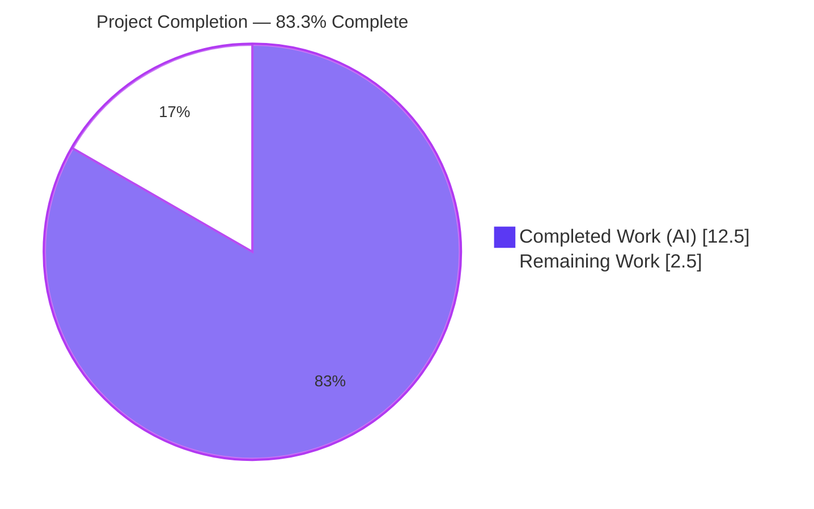
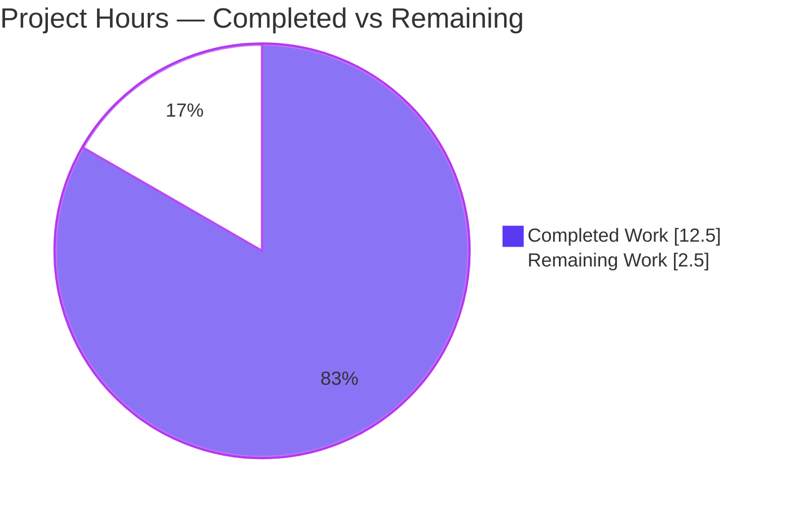
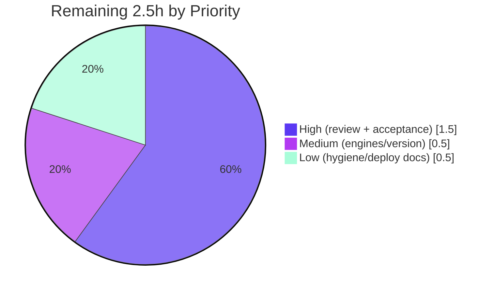

# Blitzy Project Guide — Express.js "Good evening" Endpoint

> Module: `hello_world@1.0.0` · Project root: `existing-projects-qa-test/` · Branch: `blitzy-031de181-09a2-49ee-a8b5-adb2695070e0` · HEAD: `c81186f`
>
> Brand color legend — **Completed / AI Work: Dark Blue `#5B39F3`** · **Remaining / Not Completed: White `#FFFFFF`** · Headings/Accents: Violet-Black `#B23AF2` · Highlight: Mint `#A8FDD9`

---

## 1. Executive Summary

### 1.1 Project Overview

This project adds the Express.js web framework to a previously dependency-free, single-file Node.js HTTP tutorial service and exposes a second endpoint, `GET /good-evening`, returning the plain-text body `Good evening`. The target users are developers learning Node.js routing. The technical scope is deliberately minimal: migrate the native `http` server in `server.js` to a single Express application, add one route, preserve the original `Hello, World!\n` response for every other request via a terminal fallback, and re-attach all pre-existing operational hardening (error handling, graceful shutdown, process guards) to the Express server instance. A rule-mandated `DECISIONS.md` documents every decision and the full migration traceability.

### 1.2 Completion Status



| Metric | Value |
|--------|-------|
| **Total Hours** | **15.0** |
| Completed Hours (AI + Manual) | 12.5 (12.5 AI autonomous + 0.0 manual) |
| Remaining Hours | 2.5 |
| **Percent Complete** | **83.3%** |

> Calculation (PA1, AAP-scoped): `12.5 ÷ (12.5 + 2.5) × 100 = 83.3%`. All **AAP functional deliverables are 100% complete**; the remaining 16.7% is purely path-to-production work (human review gate, acceptance verification, and optional hardening) that cannot be auto-completed.

### 1.3 Key Accomplishments

- ✅ Express.js `^5.2.1` added as the project's first-ever production dependency and wired into `server.js` via CommonJS `require('express')`.
- ✅ New `GET /good-evening` route returns `200`, `text/plain`, body `Good evening` (12 bytes, no trailing newline).
- ✅ Original `Hello, World!\n` contract preserved byte-for-byte (14 bytes) for every other path/method via a terminal `app.use` fallback.
- ✅ All operational hardening re-attached to the captured `app.listen()` server: server `error`, `clientError`, graceful shutdown, `SIGTERM`/`SIGINT`, `uncaughtException`, `unhandledRejection`.
- ✅ Response headers hardened — `X-Powered-By` and `ETag` disabled; strict + case-sensitive routing so only the exact `/good-evening` path matches.
- ✅ `package-lock.json` regenerated (lockfileVersion 3) locking Express 5.2.1 + transitive tree; `npm ci` reproduces deterministically; `npm audit` reports **0 vulnerabilities**.
- ✅ `DECISIONS.md` delivered with decision log (D1–D11) and a 100%-coverage bidirectional `http → Express` traceability matrix (Explainability rule).
- ✅ Independently re-validated: syntax, dependency tree, both endpoints, fallback routing, security headers, and graceful shutdown all pass.

### 1.4 Critical Unresolved Issues

| Issue | Impact | Owner | ETA |
|-------|--------|-------|-----|
| _None._ All in-scope AAP deliverables are implemented, committed, and validated. No blocking or critical issues remain. | None | — | — |

### 1.5 Access Issues

| System/Resource | Type of Access | Issue Description | Resolution Status | Owner |
|-----------------|----------------|-------------------|-------------------|-------|
| _No access issues identified._ Full read/write access to the repository, git history, npm registry cache (offline install verified), and runtime were available throughout analysis and validation. | — | — | Resolved / N/A | — |

### 1.6 Recommended Next Steps

1. **[High]** Perform human code review of the four in-scope files plus `DECISIONS.md` and approve/merge the pull request (mandatory release gate).
2. **[High]** Run manual acceptance verification in a clean checkout (`npm ci` → `node server.js` → curl both endpoints → confirm graceful shutdown).
3. **[Medium]** Confirm the target production Node.js version and add an `engines` field to `package.json` (Express 5 requires Node ≥ 18).
4. **[Low]** Add a `.gitignore` (containing `node_modules/`) and document the deployment/CI approach, including handling of the placeholder `npm test` script.

---

## 2. Project Hours Breakdown

### 2.1 Completed Work Detail

| Component | Hours | Description |
|-----------|-------|-------------|
| Express.js Integration (AAP R1) | 1.5 | Add `express@^5.2.1` to `package.json`; `require('express')` + `const app = express()` in `server.js`; remove now-unused direct `require('http')`; confirm current stable version. |
| `GET /good-evening` Endpoint + Routing (AAP R2) | 2.0 | Register `app.get('/good-evening', …)` → `text/plain` `Good evening`; enable strict + case-sensitive routing so only the exact path matches. |
| Hello World Contract Preservation | 1.0 | Terminal `app.use` fallback returning `200`, `text/plain`, `Hello, World!\n` byte-identical for all other requests. |
| Operational Hardening Re-attachment | 2.5 | Capture `const server = app.listen(...)`; re-base `error`, `clientError`, `gracefulShutdown`, `SIGTERM`/`SIGINT`, `uncaughtException`, `unhandledRejection`; emit startup log on the `'listening'` event (QA-01 fix). |
| Dependency Lockfile Regeneration & Reproducibility | 0.5 | Run `npm install`, keep lockfileVersion 3, lock Express + transitive tree; verify `npm ci` reproduces (67 packages) with 0 vulnerabilities. |
| Response Header Security Hardening | 1.0 | `app.disable('x-powered-by')` and `app.disable('etag')`; review and document the Express default-header contract. |
| `DECISIONS.md` (Explainability) | 2.0 | Author decision log D1–D11 (decision, alternatives, rationale, risks) + 100%-coverage bidirectional `http → Express` traceability matrix + authorized-deviations section. |
| Manual Validation & QA Fix Cycles | 2.0 | 14 manual functional checks + curl runtime + shutdown testing; three QA fix iterations (startup-log semantics, strict route precedence, case-sensitive routing). |
| **Total** | **12.5** | **All hours correspond to completed, validated AAP-scoped deliverables.** |

### 2.2 Remaining Work Detail

| Category | Hours | Priority |
|----------|-------|----------|
| Human Code Review & PR Approval | 1.0 | High |
| Manual Acceptance Verification (clean-checkout run & curl) | 0.5 | High |
| Production Node/Version Configuration (`engines` field) | 0.5 | Medium |
| Repository Hygiene & Deployment Documentation (`.gitignore`, deploy/CI notes) | 0.5 | Low |
| **Total** | **2.5** | |

### 2.3 Hours Reconciliation

- Completed (Section 2.1) = **12.5h** · Remaining (Section 2.2) = **2.5h**
- Section 2.1 + Section 2.2 = **15.0h** = Total Project Hours (Section 1.2) ✓
- Remaining **2.5h** is identical in Sections 1.2, 2.2, and 7 ✓
- Completion = 12.5 ÷ 15.0 = **83.3%** ✓

---

## 3. Test Results

> **Integrity note:** This project has **no automated test framework by design** — adding Jest/Mocha/Supertest is explicitly out of scope (AAP §0.6.2, decision D10). The AAP mandates **manual validation**. All results below originate from Blitzy's autonomous validation logs and were independently re-executed during this assessment. The `npm test` script is an `npm init` placeholder that exits 1 by design (no suite exists to fail).

| Test Category | Framework | Total Tests | Passed | Failed | Coverage % | Notes |
|---------------|-----------|-------------|--------|--------|-----------|-------|
| Static / Compilation | `node --check`, `npm ls` | 3 | 3 | 0 | N/A | Syntax OK; clean dependency tree `express@5.2.1`; valid JSON manifests. |
| Dependency Integrity | `npm ci`, `npm audit --omit=dev` | 2 | 2 | 0 | N/A | `npm ci` added 67 packages, exit 0; **0 vulnerabilities**. |
| Functional / API (manual) | `curl` | 6 | 6 | 0 | N/A | `GET /good-evening` (12 bytes); `GET /` (14 bytes); POST/PUT/DELETE, trailing-slash, case-variant fallbacks all → `Hello, World!\n`. |
| Runtime / Lifecycle (manual) | `node` + signals | 3 | 3 | 0 | N/A | Startup log on bind; SIGTERM & SIGINT graceful shutdown → exit 0. |
| **Total** | — | **14** | **14** | **0** | **N/A** | **100% pass rate across all manual/automated validation gates.** |

_Automated line/branch coverage is not applicable — no automated test framework is present (intentional per AAP scope)._

---

## 4. Runtime Validation & UI Verification

**UI Verification:** Not applicable — this is a headless HTTP service returning `text/plain` only. No front-end, component library, or design assets exist (AAP §0.5.3).

**Runtime health (independently verified in this environment — Node v20.20.2, npm 11.1.0):**

- ✅ **Server startup** — `node server.js` logs `Server running at http://127.0.0.1:3000/` on the `'listening'` event.
- ✅ **New endpoint** — `GET /good-evening` → `200`, `Content-Type: text/plain; charset=utf-8`, `Content-Length: 12`, body `Good evening`.
- ✅ **Preserved contract** — `GET /` → `200`, `text/plain`, `Content-Length: 14`, body `Hello, World!\n`.
- ✅ **Fallback routing** — `POST /good-evening`, `GET /good-evening/`, `GET /GOOD-EVENING`, `GET /anything/else` all → `200` `Hello, World!\n`.
- ✅ **Environment overrides** — `PORT`/`HOST` respected (verified on port 8080).
- ✅ **Security headers** — `X-Powered-By` and `ETag` absent on both routes.
- ✅ **Graceful shutdown** — `SIGTERM` and `SIGINT` both log shutdown and exit `0`; port released.
- ✅ **Error handling** — occupied-port start → `EADDRINUSE` message + exit `1` (server-level `error` handler).
- ✅ **API integration** — no external services/APIs in scope; none required.

---

## 5. Compliance & Quality Review

Cross-map of AAP deliverables and governing rules to their verification status.

| AAP Requirement / Rule | Benchmark | Status | Progress | Evidence / Fix Applied |
|------------------------|-----------|--------|----------|------------------------|
| R1 — Introduce Express.js | `express@^5.2.1` in deps, wired via `require()` | ✅ Pass | 100% | `package.json` deps + `server.js` L1/L9; commits `2652b37`, `e30f236`. |
| R2 — `Good evening` endpoint | `GET /good-evening` → `200` text/plain `Good evening` | ✅ Pass | 100% | `server.js` L21; runtime curl (12 bytes); commit `c81186f`. |
| Preserve `Hello, World!\n` | Identical body/status/type for all other requests | ✅ Pass | 100% | `server.js` L24 fallback; runtime curl (14 bytes). |
| Preserve operational hardening | All handlers bound to captured server | ✅ Pass | 100% | `server.js` L37–L132; live SIGTERM/SIGINT test; QA-01 startup-log fix (`18a290b`). |
| Regenerate lockfile | lockfileVersion 3, Express + transitive locked | ✅ Pass | 100% | `package-lock.json`; `npm ci` (67 pkgs); commits `0242c80`, `6cf7c27`. |
| Explainability rule | `DECISIONS.md` w/ log + 100% traceability | ✅ Pass | 100% | `DECISIONS.md` D1–D11 + matrix; commits `ec8b81e`, `84131ab`. |
| Minimal-change rule | Only scoped files touched; interfaces preserved | ✅ Pass | 100% | Diff limited to `server.js`, `package*.json`, `DECISIONS.md`. |
| CommonJS convention | `require()`, single-file structure | ✅ Pass | 100% | `server.js` uses `require`; single file retained. |
| Version discipline | Pin verified version, not "latest" | ✅ Pass | 100% | `^5.2.1` pinned; verified current stable. |
| Security hardening | Remove framework fingerprinting | ✅ Pass | 100% | `X-Powered-By`/`ETag` disabled (`5cfd916`); `npm audit` 0 vulns. |
| Automated test coverage | Out of scope (D10) | ⚪ N/A | — | Manual validation per AAP; documented accepted deviation. |
| `main`/`start`/README hygiene | Out of scope (D10) | ⚪ N/A | — | Pre-existing conditions intentionally left unchanged. |

**Fixes applied during autonomous validation:** startup log moved to the `'listening'` event (QA-01); strict `/good-evening` route precedence; case-sensitive routing so case variants fall through to the fallback (QA-CASE); response-header security contract secured and documented.

**Outstanding compliance items:** None in scope. Optional path-to-production hardening (`engines`, `.gitignore`, CI) tracked in Sections 2.2 and 8.

---

## 6. Risk Assessment

Overall risk posture: **LOW.** No blocking or critical risks. All items are Low severity, dominated by the intentional absence of automated tests and standard path-to-production hardening.

| Risk | Category | Severity | Probability | Mitigation | Status |
|------|----------|----------|-------------|------------|--------|
| T1 — No automated test suite; future regressions not auto-caught | Technical | Low | Medium | Comprehensive manual validation documented; add Jest/Supertest if project grows | Accepted (out of scope) |
| T2 — `npm test` placeholder exits 1; naive CI would fail | Technical | Low | Medium | Replace/exclude script when CI is added (D10) | Accepted |
| T3 — Fallback masks 404s (all unmatched → 200) | Technical | Low | Low | Intentional tutorial parity (D4); revisit if strict REST needed | Accepted by design |
| S1 — First external dependency / supply-chain surface | Security | Low | Low | Pinned `^5.2.1`, committed lockfile, `npm audit` 0 vulns | Mitigated |
| S2 — No ongoing dependency monitoring | Security | Low | Medium | Periodic `npm audit`; add Dependabot/Renovate | Open (recommended) |
| O1 — `node_modules` untracked but not git-ignored | Operational | Low | Low-Med | Add `.gitignore` (remaining work) | Open (Low) |
| O2 — No `engines` field / Node version drift (v22 planned vs v20 run) | Operational | Low | Low | Add `engines`; confirm target Node (both satisfy ≥18) | Open (Low) |
| O3 — `main` → nonexistent `index.js` | Operational | Low | Low | Accepted pre-existing (D10); run `node server.js` | Accepted |
| O4 — Console-only logging (no structured logs/metrics) | Operational | Low | Low | Adequate for tutorial; add structured logging for production | Accepted for scope |
| I1 — No CI/CD pipeline | Integration | Low | Low | Add CI when needed | Open (future) |
| I2 — No deployment configuration | Integration | Low | Low | Add process manager/container manifest | Open (future) |
| I3 — Express 5.x recency vs long-stable 4.x | Integration | Low | Low | Only core Express used; pinned version | Mitigated |

---

## 7. Visual Project Status

### Project Hours Breakdown



### Remaining Work by Priority (hours)



> **Integrity check:** Pie "Remaining Work" = **2.5h** = Section 1.2 Remaining Hours = Section 2.2 total ✓. Pie "Completed Work" = **12.5h** = Section 1.2 Completed Hours ✓. Priority pie sums to 2.5h ✓.

---

## 8. Summary & Recommendations

**Achievements.** Both AAP requirements are fully delivered and independently validated: Express.js `^5.2.1` is integrated as the project's first production dependency, and `GET /good-evening` returns the exact `Good evening` body while every other request continues to return the byte-identical `Hello, World!\n`. All pre-existing operational hardening was preserved on the Express server instance, response headers were secured, the lockfile was regenerated deterministically with zero vulnerabilities, and the Explainability rule was satisfied via a complete `DECISIONS.md`.

**Remaining gaps.** No functional gaps exist. The **2.5 remaining hours** are entirely path-to-production: the mandatory human code-review/merge gate (1.0h), manual acceptance verification (0.5h), and optional hardening — an `engines` field (0.5h) and repository hygiene/deployment documentation (0.5h).

**Critical path to production.** (1) Human code review & PR approval → (2) manual acceptance verification → (3) optional `engines`/`.gitignore`/deploy hardening → merge & deploy.

**Success metrics (all met for AAP scope):** 14/14 validation checks pass; 0 vulnerabilities; both endpoints byte-exact; graceful shutdown verified; minimal-change rule upheld.

**Production readiness assessment.** The codebase is **functionally production-ready at 83.3% overall completion**, with the residual 16.7% representing human review and optional deployment hardening that, by policy, cannot be auto-completed. Confidence is **High** — the scope is small, fully implemented, well-documented, and independently re-verified.

| Dimension | Assessment |
|-----------|-----------|
| AAP functional completeness | 100% (R1, R2, preservation, hardening, docs) |
| Overall completion (incl. path-to-production) | 83.3% |
| Quality gates | 14/14 pass · 0 vulnerabilities |
| Risk posture | Low (no blocking risks) |
| Confidence level | High |

---

## 9. Development Guide

All commands below were executed and verified in this environment (Node **v20.20.2**, npm **11.1.0**).

### 9.1 System Prerequisites

- **Node.js ≥ 18** (Express 5 requirement; validated on v20.20.2). Recommended: Node 20 LTS or newer.
- **npm ≥ 7** (for lockfileVersion 3; validated on 11.1.0).
- OS: any Linux/macOS/Windows shell. No database, cache, or external service required (stateless service).

```bash
node --version   # expect v18+ (validated: v20.20.2)
npm --version    # expect 7+   (validated: 11.1.0)
```

### 9.2 Environment Setup

```bash
# From the repository root:
cd existing-projects-qa-test

# Optional configuration (defaults shown). No .env file is needed.
export HOST=127.0.0.1   # default 127.0.0.1
export PORT=3000        # default 3000
```

### 9.3 Dependency Installation

```bash
# Clean, reproducible install from the committed lockfile (recommended):
npm ci
# → "added 67 packages, and audited 68 packages ..."
# → "found 0 vulnerabilities"

# Alternative (idempotent) install:
npm install
```

Verify the dependency tree and security posture:

```bash
npm ls                     # → hello_world@1.0.0 └── express@5.2.1
npm audit --omit=dev       # → found 0 vulnerabilities
node --check server.js     # → exit 0 (no output = syntax OK)
```

### 9.4 Application Startup

```bash
# Start the server (foreground):
node server.js
# → Server running at http://127.0.0.1:3000/
# → Press Ctrl+C to stop the server

# Start on a custom host/port:
PORT=8080 HOST=0.0.0.0 node server.js
# → Server running at http://0.0.0.0:8080/
```

> Note: run `node server.js` directly. `npm start` is **not** configured, and `main` points to a nonexistent `index.js` (accepted pre-existing condition, decision D10).

### 9.5 Verification Steps

```bash
# New endpoint — expect: Good evening
curl http://127.0.0.1:3000/good-evening

# Preserved contract — expect: Hello, World! (with trailing newline)
curl http://127.0.0.1:3000/

# Inspect headers (expect 200, text/plain; charset=utf-8, Content-Length 12; no X-Powered-By/ETag)
curl -i http://127.0.0.1:3000/good-evening

# Fallback behavior — all of these return "Hello, World!\n":
curl -X POST http://127.0.0.1:3000/good-evening
curl http://127.0.0.1:3000/good-evening/     # trailing slash
curl http://127.0.0.1:3000/GOOD-EVENING       # case variant
curl http://127.0.0.1:3000/anything/else
```

### 9.6 Graceful Shutdown

```bash
# Foreground: press Ctrl+C (SIGINT)
# Background/by PID:
kill -TERM <pid>
# → "SIGTERM received. Starting graceful shutdown..."
# → "Server closed. All connections finished."   (exit 0)
```

### 9.7 Example Usage

```bash
$ curl http://127.0.0.1:3000/good-evening
Good evening
$ curl http://127.0.0.1:3000/
Hello, World!
```

### 9.8 Troubleshooting

- **`EADDRINUSE: address already in use`** — the port is taken. The server prints `Port <port> is already in use` and exits `1`. Fix: `PORT=<free-port> node server.js`, or stop the process using the port.
- **`npm test` fails with "Error: no test specified" (exit 1)** — this is the `npm init` placeholder; there is no test suite (intentional, AAP §0.6.2/D10). Do not wire CI to `npm test` without replacing it first.
- **`npm start` does nothing / errors** — no `start` script; `main` → nonexistent `index.js`. Always use `node server.js`.
- **Missing `express` module** — run `npm ci` (or `npm install`) inside `existing-projects-qa-test/` before starting.

---

## 10. Appendices

### Appendix A — Command Reference

| Command | Purpose |
|---------|---------|
| `npm ci` | Clean, reproducible dependency install from lockfile (67 packages) |
| `npm install` | Idempotent dependency install |
| `npm ls` | Show dependency tree (`express@5.2.1`) |
| `npm audit --omit=dev` | Security audit (0 vulnerabilities) |
| `node --check server.js` | Static syntax validation |
| `node server.js` | Start the HTTP server |
| `PORT=8080 HOST=0.0.0.0 node server.js` | Start with custom host/port |
| `curl http://127.0.0.1:3000/good-evening` | Verify new endpoint |
| `curl http://127.0.0.1:3000/` | Verify preserved contract |
| `kill -TERM <pid>` / `Ctrl+C` | Graceful shutdown |

### Appendix B — Port Reference

| Port / Setting | Service | Configurable Via | Default |
|----------------|---------|------------------|---------|
| 3000 | HTTP listening port | `PORT` env var | `3000` |
| bind address | Host interface | `HOST` env var | `127.0.0.1` |

### Appendix C — Key File Locations

| Path | Role | Disposition |
|------|------|-------------|
| `existing-projects-qa-test/server.js` | Express app, routing, hardening (132 lines) | UPDATED |
| `existing-projects-qa-test/package.json` | Manifest; `dependencies.express ^5.2.1` | UPDATED |
| `existing-projects-qa-test/package-lock.json` | Lockfile v3; Express + transitive tree | REGENERATED |
| `existing-projects-qa-test/DECISIONS.md` | Decision log D1–D11 + traceability matrix | CREATED |
| `existing-projects-qa-test/README.md` | "Do not touch!" notice | UNCHANGED |
| `existing-projects-qa-test/node_modules/` | Installed dependencies (untracked) | GENERATED |

### Appendix D — Technology Versions

| Component | Version | Notes |
|-----------|---------|-------|
| Node.js | v20.20.2 (validated) | Express 5 requires ≥ 18; AAP planning referenced v22.23.1 |
| npm | 11.1.0 | Supports lockfileVersion 3 |
| express | 5.2.1 | Pinned `^5.2.1`; current stable |
| lockfileVersion | 3 | Unchanged from repository convention |

### Appendix E — Environment Variable Reference

| Variable | Default | Purpose |
|----------|---------|---------|
| `HOST` | `127.0.0.1` | Bind address for the HTTP server |
| `PORT` | `3000` | Listening port for the HTTP server |

### Appendix F — Endpoint / Route Reference

| Method | Path | Status | Content-Type | Body | Bytes |
|--------|------|--------|--------------|------|-------|
| GET | `/good-evening` | 200 | `text/plain; charset=utf-8` | `Good evening` | 12 |
| ANY | `/` and all other paths/methods | 200 | `text/plain; charset=utf-8` | `Hello, World!\n` | 14 |

### Appendix G — Glossary

| Term | Definition |
|------|------------|
| **AAP** | Agent Action Plan — the authoritative specification of the feature scope. |
| **Terminal fallback** | The final `app.use` middleware that handles all otherwise-unmatched requests, preserving the original response. |
| **Strict routing** | Express setting treating `/path` and `/path/` as distinct routes. |
| **Case-sensitive routing** | Express setting treating `/Path` and `/path` as distinct routes. |
| **Graceful shutdown** | Draining in-flight connections on `SIGTERM`/`SIGINT` before exiting (with a forced-exit timeout). |
| **lockfileVersion 3** | The npm ≥ 7 lockfile format used by `package-lock.json`. |
| **Path-to-production** | Standard activities (review, acceptance, hardening, deploy) required to ship a validated deliverable. |

---

*Generated by the Blitzy Platform. Completion measured against the Agent Action Plan (AAP-scoped) plus path-to-production activities using the hours-based PA1 methodology. Completed = Dark Blue `#5B39F3`; Remaining = White `#FFFFFF`.*