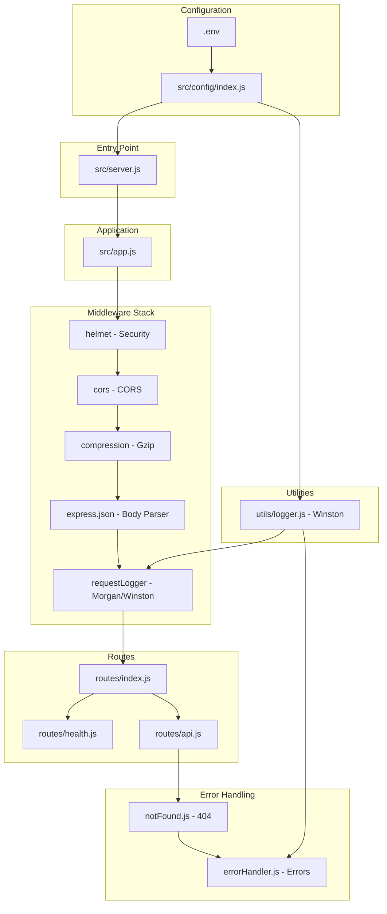
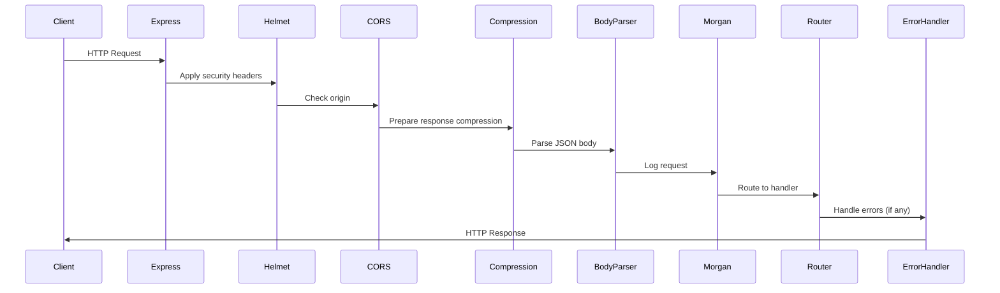

# Technical Specification

# 0. Agent Action Plan

## 0.1 Intent Clarification

### 0.1.1 Core Objective

Based on the provided requirements, the Blitzy platform understands that the objective is to:

- **Transform a zero-dependency native Node.js HTTP server into a production-ready Express.js application** by refactoring the existing `server.js` from using Node's built-in `http` module to the Express.js framework
- **Implement a structured routing architecture** that separates route definitions from business logic using Express Router
- **Add comprehensive middleware stack** including security headers, request logging, CORS support, and request parsing
- **Configure environment-based settings** using dotenv for flexible deployment across development, staging, and production environments
- **Implement production-grade logging** using Winston logger with Morgan HTTP request logging integration for structured, configurable log output
- **Prepare production deployment infrastructure** using PM2 process manager with ecosystem configuration for clustering, automatic restarts, and process management

**Implicit Requirements Detected:**

- The existing graceful shutdown logic must be preserved and adapted for Express.js
- Error handling patterns currently implemented manually must be migrated to Express error middleware
- The existing API endpoints (`/`, `/health`, `/echo`, `/info`) must be maintained with the same response formats
- Environment variable compatibility for `HOST` and `PORT` must be retained
- The application must support both development and production execution modes

**Dependencies and Prerequisites:**

- Node.js v18+ LTS runtime (v20.x recommended for best Express.js 4.x compatibility)
- npm package manager for dependency installation
- PM2 must be installed globally on production servers for process management

### 0.1.2 Task Categorization

| Category | Classification |
|----------|----------------|
| **Primary task type** | Refactoring |
| **Secondary aspects** | Configuration, Production Deployment, Logging Infrastructure |
| **Scope classification** | Cross-cutting change (affects architecture, dependencies, deployment) |

**Task Type Breakdown:**

- **Framework Migration (40%):** Converting native `http` module to Express.js framework
- **Middleware Implementation (25%):** Adding security, logging, parsing, and error handling middleware
- **Configuration Management (15%):** Environment-based configuration with dotenv
- **Deployment Infrastructure (15%):** PM2 ecosystem setup and production hardening
- **Documentation Updates (5%):** README and API documentation updates

### 0.1.3 Special Instructions and Constraints

**Critical Directives:**

- Maintain backward compatibility with existing API endpoints and response formats
- Preserve the existing graceful shutdown behavior with timeout handling
- Retain support for `HOST` and `PORT` environment variables
- Follow Express.js community best practices for project structure
- Ensure the application remains a single-entry-point server

**Methodological Requirements:**

- Follow modular file organization pattern with separation of concerns
- Use CommonJS module syntax to match existing codebase conventions
- Implement middleware in the correct order (security → parsing → logging → routes → errors)
- Configure PM2 for cluster mode to utilize multiple CPU cores

**User Example Preservation:**

The current server demonstrates these patterns that must be preserved:
- 4-layer error handling approach (request, server, process, shutdown)
- Graceful shutdown with connection draining
- Environment-based configuration with sensible defaults

### 0.1.4 Technical Interpretation

These requirements translate to the following technical implementation strategy:

| Requirement | Technical Action | Target Components |
|-------------|------------------|-------------------|
| Express.js framework integration | Create Express application with app factory pattern | `src/app.js`, `src/server.js` |
| Routing implementation | Extract routes to dedicated router modules | `src/routes/index.js`, `src/routes/health.js`, `src/routes/api.js` |
| Middleware stack | Configure security (helmet), CORS, parsing, and logging | `src/middleware/*.js`, `src/app.js` |
| Environment configuration | Implement dotenv-based config with validation | `src/config/index.js`, `.env`, `.env.example` |
| Winston logging | Create centralized logger with file and console transports | `src/utils/logger.js`, `src/middleware/morgan.js` |
| PM2 deployment | Create ecosystem configuration for production clustering | `ecosystem.config.js` |
| Error handling | Implement Express error middleware pattern | `src/middleware/errorHandler.js` |

**Implementation Approach:**

- "To achieve Express.js integration, we will refactor `server.js` by replacing the native `http.createServer()` with Express application factory, preserving graceful shutdown logic"
- "To implement routing, we will extract endpoint handlers into separate router modules under `src/routes/` using Express Router"
- "To add middleware, we will create a middleware chain in `src/app.js` that applies helmet, cors, express.json(), morgan, and custom error handlers in the correct sequence"
- "To configure environment settings, we will create `src/config/index.js` that loads dotenv and exports validated configuration objects"
- "To implement logging, we will create a Winston logger instance in `src/utils/logger.js` and integrate Morgan for HTTP request logging"
- "To prepare for PM2, we will create `ecosystem.config.js` with cluster mode, environment-specific configurations, and process management settings"

## 0.2 Repository Scope Discovery

### 0.2.1 Comprehensive File Analysis

**Current Repository Structure:**

```
existing-projects-qa-test/
├── package.json           # Package manifest (no dependencies)
├── package-lock.json      # Lock file (empty)
├── server.js              # Main server file (286 lines, native http)
├── README.md              # Project documentation
└── blitzy/
    └── documentation/
        ├── Project Guide.md
        └── Technical Specifications.md
```

**Existing Source Files Analysis:**

| File | Lines | Purpose | Migration Impact |
|------|-------|---------|------------------|
| `server.js` | 286 | Native HTTP server with manual routing, error handling, graceful shutdown | **HIGH** - Complete refactoring required |
| `package.json` | 15 | Basic package manifest with no dependencies | **HIGH** - Add all Express.js dependencies |
| `README.md` | ~200 | Comprehensive documentation | **MEDIUM** - Update for Express.js architecture |

**Current `server.js` Features to Migrate:**

- Native `http.createServer()` implementation
- Manual request routing with URL pattern matching
- 4-layer error handling (request, server, process, shutdown)
- Graceful shutdown with connection tracking
- Environment variable configuration (`HOST`, `PORT`)
- Health check endpoint with detailed metrics
- Echo endpoint with request reflection
- Info endpoint with server metadata

**Files Requiring Creation:**

| New File Path | Purpose |
|--------------|---------|
| `src/app.js` | Express application factory |
| `src/server.js` | Server bootstrap and lifecycle management |
| `src/config/index.js` | Environment configuration loader |
| `src/routes/index.js` | Route aggregation |
| `src/routes/health.js` | Health check routes |
| `src/routes/api.js` | API routes (echo, info) |
| `src/middleware/errorHandler.js` | Express error handling middleware |
| `src/middleware/requestLogger.js` | Morgan + Winston integration |
| `src/utils/logger.js` | Winston logger configuration |
| `.env` | Development environment variables |
| `.env.example` | Environment template |
| `ecosystem.config.js` | PM2 process configuration |

### 0.2.2 Web Search Research Conducted

**Research Areas Investigated:**

| Topic | Key Findings |
|-------|-------------|
| Express.js 4.x production best practices | Use helmet for security headers, implement centralized error handling, configure proper middleware order |
| PM2 ecosystem configuration | Use `ecosystem.config.js` with cluster mode, `exec_mode: "cluster"`, `instances: "max"` for production |
| Winston + Morgan integration | Stream Morgan output through Winston transports for unified logging |
| Node.js environment configuration | Use dotenv for `.env` files, validate required variables on startup |
| Express.js project structure | Separate concerns: `src/routes/`, `src/middleware/`, `src/config/`, `src/utils/` |

**Best Practices Identified:**

- **Middleware Order:** Security (helmet) → CORS → Body parsing → Logging → Routes → Error handling
- **Logging:** Use Winston with `http` log level for Morgan integration; configure both console and file transports
- **PM2 Configuration:** Set `max_memory_restart: "300M"` for memory leak protection; use `watch: false` in production
- **Environment Variables:** Set `NODE_ENV` explicitly; use `dotenv` for local development only
- **Error Handling:** Use async wrapper or express-async-errors; implement centralized error middleware as last middleware

### 0.2.3 Existing Infrastructure Assessment

**Current Project Structure:**

- **Architecture:** Single-file monolithic server (`server.js`)
- **Module System:** CommonJS (no ES modules)
- **Dependencies:** Zero external dependencies (pure Node.js)
- **Package Manager:** npm (lock file present but empty)

**Existing Patterns to Preserve:**

- Graceful shutdown with `SIGTERM`/`SIGINT` handling
- Request timeout configuration
- Connection tracking for shutdown
- Structured JSON responses
- Health check with memory/uptime metrics

**Build and Deployment Configuration:**

| Aspect | Current State | Required State |
|--------|---------------|----------------|
| Dependencies | None | Express.js ecosystem |
| Scripts | Only `test` (placeholder) | `start`, `dev`, `start:prod` |
| Entry Point | `server.js` | `src/server.js` |
| Configuration | Inline defaults | `.env` + config module |
| Process Management | Manual | PM2 with ecosystem file |

**Testing Infrastructure:**

- No test framework currently installed
- Test script is a placeholder (`exit 1`)
- Testing implementation is out of scope for this refactoring task

**Documentation System:**

- README.md with comprehensive API documentation
- Existing Blitzy documentation in `blitzy/documentation/`
- Documentation updates needed for new project structure and Express.js patterns

## 0.3 File Transformation Mapping

### 0.3.1 File-by-File Execution Plan

| Target File | Transformation | Source File/Reference | Purpose/Changes |
|-------------|----------------|----------------------|-----------------|
| `src/app.js` | CREATE | `server.js` | Express application factory with middleware configuration |
| `src/server.js` | CREATE | `server.js` | Server bootstrap with graceful shutdown from original implementation |
| `src/config/index.js` | CREATE | `server.js` (env vars) | Centralized environment configuration with validation |
| `src/routes/index.js` | CREATE | `server.js` (routing) | Route aggregator mounting all route modules |
| `src/routes/health.js` | CREATE | `server.js` (healthHandler) | Health check endpoint as Express router |
| `src/routes/api.js` | CREATE | `server.js` (handlers) | API routes for echo, info endpoints |
| `src/middleware/errorHandler.js` | CREATE | `server.js` (error handling) | Express error middleware pattern |
| `src/middleware/requestLogger.js` | CREATE | N/A (new feature) | Morgan middleware with Winston stream |
| `src/middleware/notFound.js` | CREATE | `server.js` (404 handling) | 404 Not Found middleware |
| `src/utils/logger.js` | CREATE | N/A (new feature) | Winston logger with console and file transports |
| `.env` | CREATE | `server.js` (defaults) | Development environment variables |
| `.env.example` | CREATE | N/A | Environment variable template for documentation |
| `ecosystem.config.js` | CREATE | N/A (new feature) | PM2 process manager configuration |
| `package.json` | UPDATE | `package.json` | Add dependencies and npm scripts |
| `server.js` | DELETE | `server.js` | Remove after migration to `src/` structure |
| `README.md` | UPDATE | `README.md` | Update documentation for Express.js architecture |
| `.gitignore` | CREATE | N/A | Git ignore patterns for logs, env, node_modules |

### 0.3.2 New Files Detail

**`src/app.js`** - Express Application Factory
- Content type: Source code (JavaScript)
- Based on: Express.js best practices + original `server.js` patterns
- Key functions: `createApp()` factory, middleware chain configuration
- Exports: Express application instance

**`src/server.js`** - Server Bootstrap
- Content type: Source code (JavaScript)
- Based on: Original `server.js` graceful shutdown implementation
- Key functions: `startServer()`, `gracefulShutdown()`, signal handlers
- Responsibilities: HTTP server creation, lifecycle management

**`src/config/index.js`** - Environment Configuration
- Content type: Configuration module
- Based on: Original environment variable handling (`HOST`, `PORT`)
- Key exports: `config` object with validated environment settings
- Sections: server, logging, app metadata

**`src/routes/index.js`** - Route Aggregator
- Content type: Source code (JavaScript)
- Based on: Original routing logic from `server.js`
- Key exports: Express Router with all routes mounted
- Mounts: `/health`, `/api`, root `/`

**`src/routes/health.js`** - Health Check Routes
- Content type: Source code (JavaScript)
- Based on: Original `handleHealth()` from `server.js`
- Endpoints: `GET /health` with status, memory, uptime metrics

**`src/routes/api.js`** - API Routes
- Content type: Source code (JavaScript)
- Based on: Original `handleEcho()`, `handleInfo()` from `server.js`
- Endpoints: `POST /echo`, `GET /info`

**`src/middleware/errorHandler.js`** - Error Handler
- Content type: Source code (JavaScript)
- Based on: Original error handling patterns from `server.js`
- Key functions: Express 4-argument error middleware
- Features: Structured JSON error responses, stack trace in development

**`src/middleware/requestLogger.js`** - Request Logger
- Content type: Source code (JavaScript)
- Based on: Morgan + Winston integration patterns
- Key exports: Morgan middleware configured with Winston stream

**`src/middleware/notFound.js`** - 404 Handler
- Content type: Source code (JavaScript)
- Based on: Original 404 handling from `server.js`
- Features: Catch-all route for undefined endpoints

**`src/utils/logger.js`** - Winston Logger
- Content type: Source code (JavaScript)
- Based on: Winston best practices
- Key exports: Configured Winston logger instance
- Transports: Console (colored), File (JSON), Error file

**`.env`** - Environment Variables
- Content type: Configuration file
- Variables: `NODE_ENV`, `PORT`, `HOST`, `LOG_LEVEL`

**`.env.example`** - Environment Template
- Content type: Documentation/Template
- Purpose: Document required environment variables

**`ecosystem.config.js`** - PM2 Configuration
- Content type: Configuration (JavaScript module)
- Based on: PM2 ecosystem file best practices
- Sections: apps configuration, environment variants

**`.gitignore`** - Git Ignore
- Content type: Configuration
- Patterns: `node_modules/`, `logs/`, `.env`, `*.log`

### 0.3.3 Files to Modify Detail

**`package.json`** - Package Manifest
- Sections to update:
  - `main`: Change from `index.js` to `src/server.js`
  - `scripts`: Add `start`, `dev`, `start:prod`, `pm2:start`, `pm2:stop`
  - `dependencies`: Add Express.js ecosystem packages
  - `devDependencies`: Add nodemon for development
  - `engines`: Specify Node.js version requirement
- New content to add:
  - Dependencies block with all required packages
  - npm scripts for development and production workflows

**`README.md`** - Documentation
- Sections to update:
  - Project structure diagram
  - Installation instructions
  - Available npm scripts
  - Environment configuration section
  - PM2 deployment instructions
- Content to remove:
  - References to zero-dependency architecture
  - Manual Node.js execution instructions (keep as alternative)
- Content to add:
  - Express.js middleware documentation
  - PM2 usage guide
  - Logging configuration

### 0.3.4 Configuration and Documentation Updates

**Configuration Changes:**

| Config File | Specific Settings | Impact |
|-------------|-------------------|--------|
| `package.json` | `main: "src/server.js"` | Entry point change |
| `package.json` | `scripts.start: "node src/server.js"` | Standard npm start |
| `package.json` | `scripts.dev: "nodemon src/server.js"` | Development with auto-reload |
| `package.json` | `scripts.start:prod: "NODE_ENV=production node src/server.js"` | Production without PM2 |
| `package.json` | `engines.node: ">=18.0.0"` | Minimum Node.js version |
| `.env` | `PORT=3000`, `HOST=0.0.0.0` | Server configuration |
| `.env` | `NODE_ENV=development`, `LOG_LEVEL=debug` | Environment settings |
| `ecosystem.config.js` | `instances: "max"`, `exec_mode: "cluster"` | PM2 clustering |

**Documentation Updates:**

| Document | Sections to Add/Update |
|----------|------------------------|
| `README.md` | Project structure, Installation, Scripts, Configuration |
| `README.md` | PM2 deployment section |
| `README.md` | Environment variables reference |

### 0.3.5 Cross-File Dependencies

**Import/Reference Updates Required:**

| Dependency Relationship | Files Affected |
|------------------------|----------------|
| Logger → Config | `src/utils/logger.js` imports from `src/config/index.js` |
| Middleware → Logger | `src/middleware/*.js` imports from `src/utils/logger.js` |
| Routes → Logger | `src/routes/*.js` imports from `src/utils/logger.js` |
| App → Routes | `src/app.js` imports from `src/routes/index.js` |
| App → Middleware | `src/app.js` imports from `src/middleware/*.js` |
| Server → App | `src/server.js` imports from `src/app.js` |
| Server → Config | `src/server.js` imports from `src/config/index.js` |
| Server → Logger | `src/server.js` imports from `src/utils/logger.js` |

**Configuration Sync Requirements:**

- Environment variables defined in `.env` must match keys in `src/config/index.js`
- PM2 `ecosystem.config.js` environment variables must align with `.env.example`
- Logger configuration in `src/utils/logger.js` must respect `LOG_LEVEL` from config

**Documentation Consistency Needs:**

- All npm scripts in `package.json` must be documented in `README.md`
- All environment variables must be listed in both `.env.example` and `README.md`
- API endpoints documentation must match route implementations

## 0.4 Dependency Inventory

### 0.4.1 Key Private and Public Packages

**Production Dependencies:**

| Registry | Package Name | Version | Purpose |
|----------|--------------|---------|---------|
| npm | express | ^4.21.2 | Web application framework |
| npm | helmet | ^8.1.0 | Security HTTP headers middleware |
| npm | cors | ^2.8.5 | Cross-Origin Resource Sharing middleware |
| npm | morgan | ^1.10.0 | HTTP request logging middleware |
| npm | winston | ^3.19.0 | Logging framework with multiple transports |
| npm | dotenv | ^16.4.7 | Environment variable loader from .env files |
| npm | compression | ^1.7.5 | Response compression middleware |

**Development Dependencies:**

| Registry | Package Name | Version | Purpose |
|----------|--------------|---------|---------|
| npm | nodemon | ^3.1.9 | Development server with auto-restart |

**Global Dependencies (Production Server):**

| Registry | Package Name | Version | Purpose |
|----------|--------------|---------|---------|
| npm | pm2 | ^5.4.3 | Production process manager |

### 0.4.2 Dependency Updates

**New Dependencies to Add:**

All packages are new additions as the current project has zero dependencies.

| Package Name | Version | Reason for Addition |
|-------------|---------|---------------------|
| `express` | ^4.21.2 | Core web framework requirement - replaces native http module |
| `helmet` | ^8.1.0 | Production security best practice - sets security-related HTTP headers |
| `cors` | ^2.8.5 | Required for cross-origin requests - enables CORS headers |
| `morgan` | ^1.10.0 | HTTP request logging - provides structured access logs |
| `winston` | ^3.19.0 | Comprehensive logging - provides file/console/cloud transports |
| `dotenv` | ^16.4.7 | Environment configuration - loads .env files in development |
| `compression` | ^1.7.5 | Performance optimization - gzip compression for responses |
| `nodemon` | ^3.1.9 | Development experience - auto-restart on file changes |

**Dependencies to Update:**

- Not applicable (no existing dependencies)

**Dependencies to Remove:**

- Not applicable (no existing dependencies)

### 0.4.3 Import/Reference Updates

**New Import Patterns:**

The following import patterns will be established across the codebase:

```javascript
// src/config/index.js
require('dotenv').config();

// src/app.js
const express = require('express');
const helmet = require('helmet');
const cors = require('cors');
const compression = require('compression');

// src/middleware/requestLogger.js
const morgan = require('morgan');

// src/utils/logger.js
const winston = require('winston');
```

**Import Transformation Rules:**

| Module | Old Import | New Import | Apply To |
|--------|-----------|------------|----------|
| http | `require('http')` | `require('express')` | `src/app.js` |
| url | `require('url')` | Express routing | `src/routes/*.js` |
| process signals | Inline in server.js | `src/server.js` | Signal handlers |

### 0.4.4 Package.json Dependencies Block

**Production Dependencies Object:**

```json
{
  "dependencies": {
    "compression": "^1.7.5",
    "cors": "^2.8.5",
    "dotenv": "^16.4.7",
    "express": "^4.21.2",
    "helmet": "^8.1.0",
    "morgan": "^1.10.0",
    "winston": "^3.19.0"
  }
}
```

**Development Dependencies Object:**

```json
{
  "devDependencies": {
    "nodemon": "^3.1.9"
  }
}
```

### 0.4.5 Package Version Rationale

| Package | Version Choice | Rationale |
|---------|---------------|-----------|
| express ^4.21.2 | Latest stable 4.x | Express 5.x is in beta; 4.x is production-stable |
| helmet ^8.1.0 | Latest stable | Current stable release with modern security defaults |
| cors ^2.8.5 | Latest stable | Mature package, stable API |
| morgan ^1.10.0 | Latest stable | Standard HTTP logger, stable for years |
| winston ^3.19.0 | Latest 3.x | Current stable with modern transport API |
| dotenv ^16.4.7 | Latest stable | Standard env loader, well-maintained |
| compression ^1.7.5 | Latest stable | Production-ready gzip middleware |
| nodemon ^3.1.9 | Latest stable | Modern file watching, fast restarts |
| pm2 ^5.4.3 | Latest stable | Production process manager with clustering |

## 0.5 Implementation Design

### 0.5.1 Technical Approach

**Primary Objectives with Implementation Approach:**

| Objective | Implementation Approach | Rationale |
|-----------|------------------------|-----------|
| Express.js migration | Create app factory pattern in `src/app.js` exporting configured Express instance | Enables testability and separation of app configuration from server lifecycle |
| Structured routing | Extract routes to `src/routes/` modules using Express Router | Follows Express best practices for scalable route organization |
| Middleware stack | Chain middleware in specific order: security → parsing → logging → routes → errors | Ensures security headers applied before request processing |
| Environment config | Load dotenv early in entry point, export validated config object | Centralized configuration prevents scattered env access |
| Logging infrastructure | Create Winston singleton with Morgan stream integration | Unified logging with consistent formatting across HTTP and application logs |
| PM2 deployment | Create ecosystem.config.js with cluster and environment configuration | Enables zero-downtime deployments and multi-core utilization |

**Logical Implementation Flow:**

1. **First**, establish configuration foundation by creating `src/config/index.js` that loads dotenv and exports validated configuration
2. **Second**, create logging infrastructure in `src/utils/logger.js` with Winston logger configured for both console and file outputs
3. **Third**, build middleware layer by creating `src/middleware/` modules for error handling, request logging, and 404 handling
4. **Fourth**, extract routing logic by creating `src/routes/` modules that mirror existing endpoint behavior
5. **Fifth**, create Express application factory in `src/app.js` that assembles middleware and routes in correct order
6. **Sixth**, implement server lifecycle in `src/server.js` with graceful shutdown preserving original timeout behavior
7. **Finally**, create PM2 configuration in `ecosystem.config.js` for production deployment with clustering

### 0.5.2 Component Impact Analysis

**Direct Modifications Required:**

| Component | Modification | Purpose |
|-----------|-------------|---------|
| `package.json` | Add dependencies, scripts, engines | Enable npm workflow |
| `README.md` | Update structure, installation, deployment sections | Reflect new architecture |

**New Components Introduction:**

| Component | Type | Responsibility |
|-----------|------|----------------|
| `src/app.js` | Express Application | Middleware configuration, route mounting |
| `src/server.js` | Server Bootstrap | HTTP server creation, lifecycle management |
| `src/config/index.js` | Configuration Module | Environment variable loading and validation |
| `src/routes/*.js` | Route Modules | Endpoint definitions and request handling |
| `src/middleware/*.js` | Middleware Modules | Cross-cutting concerns (logging, errors) |
| `src/utils/logger.js` | Utility Module | Centralized logging infrastructure |
| `ecosystem.config.js` | PM2 Config | Process management for production |

**Indirect Impacts and Dependencies:**

| Component | Impact | Reason |
|-----------|--------|--------|
| `.gitignore` | Must be created | Ignore logs/, .env, node_modules/ |
| Deployment documentation | Must update | PM2 commands and workflow changes |
| API behavior | Must validate | Ensure response formats unchanged |

### 0.5.3 Application Architecture Diagram



### 0.5.4 Middleware Execution Order



### 0.5.5 User-Provided Examples Integration

**Preserving Original Endpoint Behavior:**

The original `server.js` demonstrates these patterns that will be preserved:

| Original Pattern | Express Implementation |
|-----------------|------------------------|
| `GET /` returns "Hello, World!" | Root route in `src/routes/index.js` |
| `GET /health` returns JSON metrics | Health router in `src/routes/health.js` |
| `POST /echo` reflects request body | API router in `src/routes/api.js` |
| `GET /info` returns server metadata | API router in `src/routes/api.js` |
| 404 for unknown routes | `src/middleware/notFound.js` |
| JSON error responses | `src/middleware/errorHandler.js` |

**Graceful Shutdown Preservation:**

The original graceful shutdown implementation will be migrated to `src/server.js`:

- Maintain `SIGTERM` and `SIGINT` signal handlers
- Preserve 30-second shutdown timeout
- Keep connection tracking for drain completion
- Retain force termination fallback

### 0.5.6 Critical Implementation Details

**Design Patterns Employed:**

| Pattern | Application |
|---------|-------------|
| Factory Pattern | `createApp()` in `src/app.js` returns configured Express instance |
| Singleton Pattern | Logger instance in `src/utils/logger.js` |
| Module Pattern | Configuration export in `src/config/index.js` |
| Middleware Pattern | Express middleware chain for cross-cutting concerns |
| Router Pattern | Express Router for modular route definitions |

**Error Handling Strategy:**

| Error Type | Handler | Response |
|------------|---------|----------|
| Synchronous route errors | Try-catch + next(err) | 500 with error details |
| Async route errors | Express handles rejected promises | 500 with error details |
| 404 Not Found | `notFound.js` middleware | 404 with path info |
| Validation errors | Route-level validation | 400 with validation details |
| Uncaught exceptions | Process-level handler | Graceful shutdown |

**Performance Considerations:**

- Enable gzip compression via `compression` middleware
- Configure `express.json()` with size limits to prevent payload attacks
- Use `helmet` for security without performance impact
- Stream logs to files asynchronously via Winston

**Security Considerations:**

- Helmet sets security headers (CSP, X-Frame-Options, etc.)
- CORS configured with explicit allowed origins for production
- Request body size limits prevent denial-of-service
- Error messages sanitized in production (no stack traces)

## 0.6 Scope Boundaries

### 0.6.1 Exhaustively In Scope

**Source Code Changes:**

| Pattern | Description |
|---------|-------------|
| `src/**/*.js` | All new Express.js application source files |
| `src/app.js` | Express application factory |
| `src/server.js` | Server bootstrap with graceful shutdown |
| `src/config/index.js` | Environment configuration loader |
| `src/routes/*.js` | Route modules (index, health, api) |
| `src/middleware/*.js` | Middleware modules (errorHandler, requestLogger, notFound) |
| `src/utils/logger.js` | Winston logger configuration |

**Configuration Updates:**

| Pattern | Description |
|---------|-------------|
| `package.json` | Dependencies, scripts, engines, main entry |
| `.env` | Development environment variables |
| `.env.example` | Environment variable template |
| `.gitignore` | Git ignore patterns |
| `ecosystem.config.js` | PM2 process manager configuration |

**Documentation Updates:**

| Pattern | Description |
|---------|-------------|
| `README.md` | Project documentation with Express.js architecture |

**Files to Remove:**

| Pattern | Description |
|---------|-------------|
| `server.js` (root) | Original native HTTP server (replaced by `src/server.js`) |

**Specific Implementation Items:**

- Express.js framework integration and configuration
- Helmet security middleware setup
- CORS middleware with configurable origins
- Morgan HTTP logging with Winston integration
- Winston logger with console and file transports
- Compression middleware for response optimization
- Express.json body parser with size limits
- Modular routing architecture
- Centralized error handling middleware
- 404 Not Found handler
- Graceful shutdown with signal handling
- Environment-based configuration with dotenv
- PM2 ecosystem configuration for production clustering
- npm scripts for development and production workflows

### 0.6.2 Explicitly Out of Scope

**Related Features Not Specified:**

| Feature | Reason for Exclusion |
|---------|---------------------|
| Database integration | Not mentioned in user requirements |
| Authentication/Authorization | Not part of current enhancement scope |
| Session management | Not specified in requirements |
| WebSocket support | Not mentioned in user requirements |
| GraphQL integration | Not specified |
| API versioning structure | Not explicitly requested |

**Testing Implementation:**

| Item | Reason for Exclusion |
|------|---------------------|
| Unit tests | Testing framework not specified in requirements |
| Integration tests | Not part of current scope |
| Test configuration | Not requested |
| Coverage reporting | Not specified |

**Performance Optimizations Beyond Requirements:**

| Item | Reason for Exclusion |
|------|---------------------|
| Redis caching | Not mentioned in requirements |
| Rate limiting middleware | Not explicitly requested |
| Response caching | Beyond current scope |
| Load balancer configuration | Not specified |

**Infrastructure Beyond PM2:**

| Item | Reason for Exclusion |
|------|---------------------|
| Docker containerization | Not specified in requirements |
| Kubernetes configuration | Not requested |
| CI/CD pipeline setup | Not part of current scope |
| Nginx reverse proxy configuration | Not specified |

**Refactoring Unrelated to Core Objectives:**

| Item | Reason for Exclusion |
|------|---------------------|
| TypeScript migration | Not requested |
| ES Modules conversion | Maintain CommonJS compatibility |
| Code splitting | Not necessary for current scale |

**Additional Tooling Not Mentioned:**

| Item | Reason for Exclusion |
|------|---------------------|
| ESLint configuration | Not specified |
| Prettier configuration | Not requested |
| Husky git hooks | Not part of requirements |
| Documentation generation (JSDoc) | Not specified |

**Future Enhancements Not Part of Current Request:**

| Item | Reason for Exclusion |
|------|---------------------|
| API documentation (Swagger/OpenAPI) | Not specified |
| Health check dashboard | Not requested |
| Metrics collection (Prometheus) | Beyond current scope |
| Distributed tracing | Not specified |

### 0.6.3 Boundary Clarification Matrix

| Category | In Scope | Out of Scope |
|----------|----------|--------------|
| **Framework** | Express.js 4.x | Express.js 5.x (beta), other frameworks |
| **Logging** | Winston + Morgan | ELK stack, cloud logging services |
| **Security** | Helmet, CORS | OAuth, JWT, session management |
| **Deployment** | PM2 ecosystem | Docker, K8s, cloud platforms |
| **Configuration** | dotenv, .env files | Config servers, Vault |
| **Documentation** | README updates | API docs generation |
| **Testing** | None | All testing frameworks |
| **Code Style** | None | Linting, formatting tools |
| **Module System** | CommonJS | ES Modules |
| **Database** | None | Any database integration |

## 0.7 Execution Parameters

### 0.7.1 Special Execution Instructions

**Process-Specific Requirements:**

| Requirement | Instruction |
|-------------|-------------|
| Module system | Maintain CommonJS (`require`/`module.exports`) for consistency with Node.js ecosystem |
| Entry point migration | Move main entry from root `server.js` to `src/server.js` |
| Configuration loading | Load dotenv at the very beginning of `src/server.js` before other imports |
| Middleware order | Apply in sequence: helmet → cors → compression → express.json → morgan → routes → errors |
| Error handling | Implement Express 4-argument error middleware as the last middleware |
| Graceful shutdown | Preserve original timeout (30s) and signal handling (SIGTERM, SIGINT) |

**npm Scripts Configuration:**

| Script | Command | Purpose |
|--------|---------|---------|
| `start` | `node src/server.js` | Production start without PM2 |
| `dev` | `nodemon src/server.js` | Development with auto-reload |
| `start:prod` | `NODE_ENV=production node src/server.js` | Production mode without PM2 |
| `pm2:start` | `pm2 start ecosystem.config.js` | Start with PM2 |
| `pm2:stop` | `pm2 stop ecosystem.config.js` | Stop PM2 processes |
| `pm2:restart` | `pm2 restart ecosystem.config.js` | Restart PM2 processes |
| `pm2:logs` | `pm2 logs` | View PM2 logs |

**PM2 Configuration Requirements:**

| Setting | Value | Purpose |
|---------|-------|---------|
| `exec_mode` | `"cluster"` | Enable clustering for multi-core utilization |
| `instances` | `"max"` | Use all available CPU cores |
| `max_memory_restart` | `"300M"` | Restart on memory threshold |
| `watch` | `false` | Disable file watching in production |
| `env_production.NODE_ENV` | `"production"` | Set production environment |

### 0.7.2 Constraints and Boundaries

**Technical Constraints:**

| Constraint | Description |
|------------|-------------|
| Node.js version | Requires Node.js 18.0.0 or higher (LTS recommended) |
| Express version | Use Express 4.x (stable), not 5.x (beta) |
| Module format | CommonJS only (no ES Modules) |
| Backward compatibility | Must maintain existing API response formats |
| Environment variables | Must support existing `HOST` and `PORT` variables |

**Process Constraints:**

| Constraint | Description |
|------------|-------------|
| File structure | Follow `src/` directory pattern for application code |
| Naming conventions | Use camelCase for files, PascalCase for classes |
| Export pattern | Use `module.exports` consistently |
| Import pattern | Use `require()` consistently |

**Output Constraints:**

| Constraint | Description |
|------------|-------------|
| Log format | JSON format for file logs, colored format for console |
| Error responses | JSON format with `error`, `message`, and optional `stack` |
| Health response | JSON with `status`, `timestamp`, `uptime`, `memory` |

**Compatibility Requirements:**

| Requirement | Specification |
|-------------|---------------|
| API compatibility | All existing endpoints must return identical response formats |
| Environment compatibility | All existing env vars must continue to work |
| Shutdown behavior | Graceful shutdown must match original 30s timeout |

### 0.7.3 Environment Configuration Specification

**Required Environment Variables:**

| Variable | Default | Required | Description |
|----------|---------|----------|-------------|
| `NODE_ENV` | `development` | No | Environment mode (development/production) |
| `PORT` | `3000` | No | Server port number |
| `HOST` | `0.0.0.0` | No | Server bind address |
| `LOG_LEVEL` | `info` | No | Winston log level |

**Environment File Templates:**

`.env` (Development):
```
NODE_ENV=development
PORT=3000
HOST=0.0.0.0
LOG_LEVEL=debug
```

`.env.example` (Template):
```
NODE_ENV=development
PORT=3000
HOST=0.0.0.0
LOG_LEVEL=info
```

### 0.7.4 Quality and Validation Criteria

**Implementation Validation Checklist:**

| Criterion | Validation Method |
|-----------|-------------------|
| Express server starts | `npm start` succeeds without errors |
| All endpoints work | Manual testing of `/`, `/health`, `/echo`, `/info` |
| Logging functions | Check console output and log files |
| PM2 clustering | `pm2 start` creates multiple worker processes |
| Graceful shutdown | `SIGTERM` triggers proper shutdown sequence |
| Environment config | Variables load correctly from `.env` |
| Error handling | Invalid requests return proper JSON errors |

**API Response Validation:**

| Endpoint | Method | Expected Response |
|----------|--------|-------------------|
| `/` | GET | `"Hello, World!"` (200) |
| `/health` | GET | JSON with status, uptime, memory (200) |
| `/echo` | POST | Echo of request body (200) |
| `/info` | GET | Server metadata JSON (200) |
| `/unknown` | ANY | 404 error JSON |

### 0.7.5 File Creation Order

**Recommended Implementation Sequence:**

1. Create `.env` and `.env.example` - Foundation for configuration
2. Create `src/config/index.js` - Configuration must exist before other modules
3. Create `src/utils/logger.js` - Logger needed by all subsequent modules
4. Create `src/middleware/requestLogger.js` - Depends on logger
5. Create `src/middleware/errorHandler.js` - Core error handling
6. Create `src/middleware/notFound.js` - 404 handling
7. Create `src/routes/health.js` - Health endpoint
8. Create `src/routes/api.js` - API endpoints
9. Create `src/routes/index.js` - Route aggregator
10. Create `src/app.js` - Application assembly
11. Create `src/server.js` - Server lifecycle
12. Update `package.json` - Dependencies and scripts
13. Create `ecosystem.config.js` - PM2 configuration
14. Create `.gitignore` - Git configuration
15. Update `README.md` - Documentation
16. Delete root `server.js` - Remove deprecated file

### 0.7.6 Deployment Workflow

**Development Workflow:**

```bash
# Install dependencies
npm install

#### Start development server with auto-reload
npm run dev
```

**Production Workflow (without PM2):**

```bash
# Install production dependencies
npm install --production

#### Start in production mode
npm run start:prod
```

**Production Workflow (with PM2):**

```bash
# Install PM2 globally (if not installed)
npm install -g pm2

#### Install application dependencies
npm install --production

#### Start with PM2 in production mode
npm run pm2:start -- --env production

#### Monitor processes
pm2 monit

#### View logs
npm run pm2:logs

#### Restart after code changes
npm run pm2:restart
```

