# Technical Specification

# 1. Introduction

## 1.1 EXECUTIVE SUMMARY

### 1.1.1 Project Overview

The `hao-backprop-test` repository, identified by NPM package name `hello_world` (version 1.0.0), is a deliberately minimal Node.js HTTP server project that serves as a controlled integration test scaffold for the Backprop tool/service. Originally conceived as a stable two-file reference implementation accompanied by an explicit "Do not touch!" preservation notice in `README.md`, the codebase has since been hardened into a production-grade HTTP server through the `server.js` module (144 lines) without altering its public surface, package identity, or zero-dependency posture.

The system is intentionally narrow in functional scope: it binds an HTTP server to a configurable host and port, returns a static `"Hello, World!\n"` response to every request, and provides comprehensive process-level fault tolerance. It is authored by `hxu`, licensed under MIT, and consists of exactly four root-level application artifacts: `server.js`, `package.json`, `package-lock.json`, and `README.md`.

### 1.1.2 Core Business Problem

The core business problem addressed by this project is the need for a **stable, reproducible, low-variability baseline codebase** against which the Backprop integration platform can be exercised. Integration testing of code-analysis and AI-assisted development tooling requires inputs that:

- Eliminate noise from frequently changing application logic
- Avoid transitive complexity introduced by third-party dependencies
- Permit deterministic installation and execution across machines and CI environments
- Provide a known-good reference for smoke tests, regression detection, and tool validation

By preserving a minimal HTTP scaffold with zero external dependencies and a frozen package manifest, the repository removes virtually every source of environmental variability, allowing the Backprop integration to be validated against a fixed target.

### 1.1.3 Key Stakeholders and Users

The stakeholder landscape for this repository is narrow and internally focused, reflecting its role as a development utility rather than a customer-facing product.

| Stakeholder Group | Role | Primary Interests |
|-------------------|------|-------------------|
| Development Team | Primary maintainers, led by author `hxu` | Backprop integration validation; preservation of the test scaffold |
| Internal Developers | Local development and verification | Server execution, HTTP response verification, baseline familiarity |
| Automated Systems | CI/CD pipelines and integration test runners | Smoke tests, deterministic builds, reproducible install/run cycles |
| Backprop Tool/Service | External code-analysis consumer | Stable target codebase for tool validation |

### 1.1.4 Expected Business Impact and Value Proposition

The repository delivers value through four interlocking propositions:

- **Development Tool Validation Foundation** — Acts as the authoritative input for Backprop integration verification, enabling confident iteration on the tooling platform.
- **Reference Implementation** — Demonstrates a canonical minimal Node.js HTTP server using only the built-in `http` module, with no framework dependencies.
- **Testing Efficiency** — Zero external dependencies, a flat directory layout, and a frozen lockfile produce fast, reliable installation and execution loops.
- **Reproducible Environment** — Lockfile version 3 (`package-lock.json`) combined with the immutable package identity ensures consistent behavior across environments, satisfying the "Do not touch!" preservation policy stated in `README.md`.

---

## 1.2 SYSTEM OVERVIEW

### 1.2.1 Project Context

#### 1.2.1.1 Business Context and Market Positioning

This repository occupies the role of an **internal utility**, not a market-facing product. It is not intended to compete in any application or service market, generate user-facing functionality, or evolve through feature accretion. Its market positioning is best described as a *controlled reference implementation*: a fixed, well-understood artifact whose value derives from its stability rather than its capability.

The `README.md` file establishes the immutability policy explicitly with its "Do not touch!" notice, signaling that the codebase exists to be **observed and integrated against**, not extended. The package manifest reinforces this position: the `package.json` declares a frozen version of `1.0.0` and a description of `"Hello world in Node.js"`, while the `package-lock.json` records zero external dependencies in lockfile version 3 format.

#### 1.2.1.2 Current System State

The repository exists in two reconcilable states that must be understood together:

1. **Preserved Identity Surface** — Package metadata, naming, license, author, README content, and the zero-dependency footprint remain untouched and continue to reflect the original "Do not touch!" mandate.
2. **Hardened Runtime Surface** — The `server.js` module has been extended from a minimal scaffold into a 144-line implementation that adds environment-variable configuration, request-level input validation, server-level error handlers, graceful shutdown, and process-level exception handling.

This dual posture allows the public contract of the project (package identity, HTTP response, default endpoint) to remain stable for Backprop integration purposes while the runtime behavior is sufficiently robust to survive adverse conditions without crashing the host process.

#### 1.2.1.3 Integration with Existing Enterprise Landscape

The repository integrates with a small, well-defined external surface:

| External System | Role | Coupling |
|-----------------|------|----------|
| Backprop Tool/Service | Primary integration consumer; analyzes the codebase | Direct, intentional |
| Node.js Runtime | Execution environment; provides built-in `http` module | Required dependency |
| NPM Ecosystem (npm, yarn, pnpm) | Package installation and script execution | Compatible by manifest |

There are no databases, no external APIs, no message queues, no caching layers, and no third-party services beyond Backprop. All networking is bound by default to the loopback interface (`127.0.0.1`), reinforcing the project's isolation profile.

### 1.2.2 High-Level Description

#### 1.2.2.1 Primary System Capabilities

The system provides three primary capabilities, each grounded in a specific repository artifact.

**F-001: HTTP Server Functionality** (implemented in `server.js`)

- Creates an HTTP server via the Node.js built-in `http` module
- Binds to a configurable host (`process.env.HOST || '127.0.0.1'`) and port (`process.env.PORT || 3000`)
- Responds to all requests with the static body `"Hello, World!\n"` and HTTP status `200 OK`
- Sets `Content-Type: text/plain` on every response
- Emits startup log messages indicating the listening address and an instruction to press `Ctrl+C` to stop the server
- Validates `req.method` and `req.url`, returning `400 Bad Request` for invalid input
- Wraps the request handler in a try/catch block that emits `500 Internal Server Error` (guarded by `res.headersSent`) when unexpected errors occur
- Registers `server.on('error')` handlers for startup conditions such as `EADDRINUSE` and `EACCES`
- Registers `server.on('clientError')` handlers with socket cleanup
- Implements `gracefulShutdown()` with a 10-second timeout, invoked by `SIGTERM` and `SIGINT`
- Registers `process.on('uncaughtException')` with a 5-second force-exit timeout and `process.on('unhandledRejection')` handlers

**F-002: Package Management Operations** (via `package.json` and `package-lock.json`)

- Declares NPM-compatible package identity: `hello_world` v1.0.0, MIT, author `hxu`
- Records a lockfile in version 3 format, which requires npm 7+ to consume
- Is compatible with npm, yarn, and pnpm package managers
- Declares zero external dependencies
- Provides a placeholder `test` script that intentionally exits with an error code (`echo "Error: no test specified" && exit 1`)

**F-003: Test Scaffold Framework** (repository-wide preservation pattern)

- Flat root-level directory structure containing the four core files
- Zero external dependencies, removing transitive complexity
- "Do not touch!" preservation policy expressed in `README.md`

#### 1.2.2.2 Major System Components

The repository exposes exactly four application components at its root:

| Component | Purpose | Approximate Size |
|-----------|---------|------------------|
| `server.js` | Hardened HTTP server implementation with comprehensive error handling | 144 lines |
| `package.json` | NPM manifest declaring `hello_world` v1.0.0 and a placeholder test script | 11 lines |
| `package-lock.json` | NPM lockfile (version 3) confirming zero dependencies | 13 lines |
| `README.md` | Repository documentation containing the "Do not touch!" preservation notice | 2 lines |

A supporting `blitzy/documentation/` folder contains the Technical Specifications document and a Project Guide; these documentation artifacts are not part of the runtime system and do not affect server behavior.

The following diagram summarizes the high-level architecture:

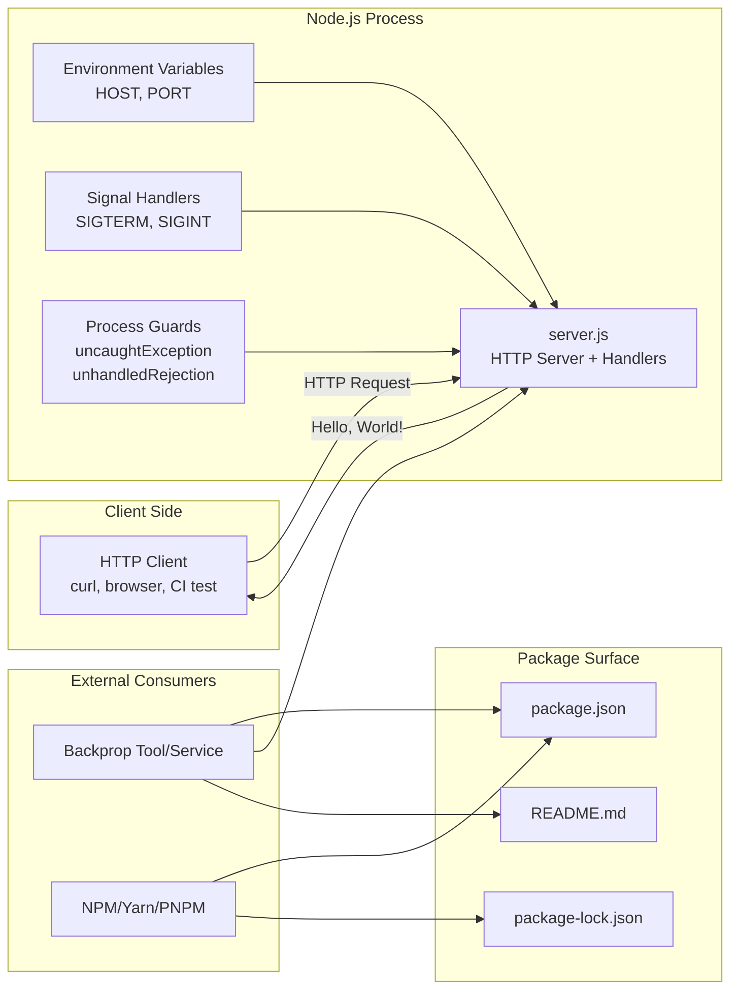
```mermaid
flowchart LR
    subgraph ClientSide["Client Side"]
        Client[HTTP Client<br/>curl, browser, CI test]
    end

    subgraph Runtime["Node.js Process"]
        EnvVars[Environment Variables<br/>HOST, PORT]
        Server[server.js<br/>HTTP Server + Handlers]
        Signals[Signal Handlers<br/>SIGTERM, SIGINT]
        ProcGuards[Process Guards<br/>uncaughtException<br/>unhandledRejection]
    end

    subgraph Packaging["Package Surface"]
        Manifest[package.json]
        Lockfile[package-lock.json]
        Readme[README.md]
    end

    subgraph External["External Consumers"]
        Backprop[Backprop Tool/Service]
        NPM[NPM/Yarn/PNPM]
    end

    Client -->|HTTP Request| Server
    Server -->|"Hello, World!"| Client
    EnvVars --> Server
    Signals --> Server
    ProcGuards --> Server
    NPM --> Manifest
    NPM --> Lockfile
    Backprop --> Manifest
    Backprop --> Server
    Backprop --> Readme
```

#### 1.2.2.3 Core Technical Approach

The technical approach is intentionally austere and is summarized in the following table.

| Dimension | Choice | Rationale |
|-----------|--------|-----------|
| Programming Language | JavaScript (CommonJS) | Native Node.js compatibility, no transpilation |
| Runtime | Node.js (built-in `http` module) | Zero dependency footprint |
| Architecture | Monolithic single-file | Minimizes surface area for integration testing |
| State Model | Stateless | No persistence; deterministic responses |
| Concurrency Model | Single-threaded event loop | Default Node.js execution model |

The implementation deliberately excludes web frameworks (Express, Fastify, Koa), templating engines, persistence layers, and middleware stacks. Configuration is sourced from environment variables with safe defaults, and all error paths are handled through native Node.js primitives.

### 1.2.3 Success Criteria

#### 1.2.3.1 Measurable Objectives

The system's success is evaluated against four functional objectives:

| Objective | Success Indicator | Verification Method |
|-----------|-------------------|---------------------|
| Server Execution | `node server.js` executes without errors | Exit code 0; startup console message displayed |
| HTTP Response Correctness | Server responds with `"Hello, World!\n"` | GET request returns expected body and status |
| Package Installation | `npm install` or `npm ci` completes successfully | Exit code 0; lockfile validated |
| Backprop Integration | Backprop can analyze the codebase | Integration test suite passes |

#### 1.2.3.2 Critical Success Factors

Four critical success factors underpin the objectives above:

1. **Minimal Complexity** — Zero external dependencies and a flat directory structure keep the analysis surface small and predictable.
2. **Deterministic Behavior** — Lockfile version 3, hard-coded response content, and fixed package identity produce reproducible installations and runtime behavior.
3. **Preserved State** — Adherence to the "Do not touch!" notice on the package-identity surface preserves the contract that Backprop integrates against.
4. **Clear Documentation** — Repository documentation (`README.md` plus the `blitzy/documentation/` artifacts) communicates intent and constraints unambiguously.

#### 1.2.3.3 Key Performance Indicators

No quantitative KPIs, SLAs, or performance thresholds (throughput, latency, availability) are defined within the repository. As a test scaffold, the system is evaluated through binary functional outcomes (does it start? does it respond? does Backprop succeed?) rather than continuous performance measurement. This absence of operational KPIs is intentional and consistent with the project's role as a non-production utility.

---

## 1.3 SCOPE

### 1.3.1 In-Scope

#### 1.3.1.1 Core Features and Functionalities

**Must-have HTTP capabilities** delivered by `server.js`:

- Starting an HTTP server bound to the configured host and port
- Accepting HTTP requests of any method (GET, POST, PUT, DELETE, and so on) on any path
- Returning a static `"Hello, World!\n"` response body
- Setting HTTP status `200` and `Content-Type: text/plain` on all successful responses
- Emitting startup log messages to standard output

**Hardened runtime behaviors** also delivered by `server.js`:

- Environment variable resolution for `HOST` and `PORT`
- Request handler try/catch with `500 Internal Server Error` emission guarded by `res.headersSent`
- Input validation of `req.method` and `req.url` with `400 Bad Request` response on failure
- Server-level error handling for startup failures (`EADDRINUSE`, `EACCES`)
- Client error handling with socket cleanup via `server.on('clientError')`
- Graceful shutdown via `gracefulShutdown()` with a 10-second timeout
- Signal handling for `SIGTERM` and `SIGINT`
- Process-level guards for `uncaughtException` (with a 5-second force-exit timeout) and `unhandledRejection`

**Package management capabilities** delivered by `package.json` and `package-lock.json`:

- NPM-compatible package identity declaration (`hello_world` v1.0.0, MIT, author `hxu`)
- Lockfile validation in version 3 format
- NPM script execution framework, including the placeholder `test` script
- Zero external dependency management

**Primary user workflows** in scope:

| Workflow | Command | Expected Outcome |
|----------|---------|------------------|
| Start Server | `node server.js` | Server listens on the configured host:port (default `127.0.0.1:3000`) |
| View Response | HTTP GET to the server endpoint | `"Hello, World!"` returned with status 200 |
| Install Packages | `npm install` or `npm ci` | Lockfile validated; no dependencies fetched |
| Execute Test Script | `npm test` | Placeholder exits with error code (intentional) |

**Essential integrations** in scope:

- Backprop Tool/Service (primary integration consumer)
- Node.js Runtime Environment
- NPM Package Manager Ecosystem (npm, yarn, pnpm)

#### 1.3.1.2 Implementation Boundaries

The system's boundaries are deliberately tight and are summarized below.

| Boundary Dimension | In-Scope Definition |
|--------------------|---------------------|
| Network Scope | Loopback (`127.0.0.1`) by default; `HOST=0.0.0.0` override permitted via environment variable |
| Port Scope | Port `3000` by default; `PORT` environment variable override permitted |
| Protocol Scope | HTTP/1.1 only; no HTTPS/TLS |
| Process Model | Single Node.js process; single-threaded event loop |
| User Groups | Local developers, CI/CD pipelines, Backprop integration test suite |
| Geographic/Market Coverage | Local development environments only |
| Data Domains | No data persistence; no user data; stateless operation; static content only |

### 1.3.2 Out-of-Scope

#### 1.3.2.1 Explicitly Excluded Features and Capabilities

**Advanced server features** explicitly excluded:

- Request routing or path-based handling
- Authentication or authorization systems
- Session or cookie handling
- Request body parsing (JSON, form-encoded, multipart)
- Query parameter processing
- HTTP method-specific handlers or REST conventions
- Structured logging frameworks (only `console.log`/`console.error` are used)

**Configuration and deployment** explicitly excluded:

- Container orchestration (Docker, Kubernetes)
- Production hardening features beyond what is implemented (rate limiting, security headers, CORS)
- SSL/TLS/HTTPS support
- Load balancing or reverse proxy configuration
- Multi-instance or clustered deployment

**Testing and quality assurance** explicitly excluded:

- A functional test suite (the `npm test` script intentionally exits with an error)
- Unit or integration tests
- Code coverage measurement
- Performance or load testing

**Dependencies and integrations** explicitly excluded:

- External npm packages or third-party libraries of any kind
- Database connections (SQL, NoSQL, in-memory)
- External API integrations
- Message queue systems (Redis, RabbitMQ, Kafka)
- Caching layers
- CDN integration
- Email or notification services
- Payment gateway integration
- Analytics or monitoring services beyond the Backprop integration

**Data management** explicitly excluded:

- Data persistence of any kind
- File upload handling
- Form processing or validation
- Template-based content generation
- State management across requests
- Data transformation pipelines or batch processing

#### 1.3.2.2 Future Phase Considerations

Future phases are **not formally defined** in the repository. The `README.md` preservation notice ("Do not touch!") communicates an intent to keep the package-identity surface stable, and the package metadata (`package.json` version `1.0.0`) is frozen. While the runtime behavior in `server.js` has been hardened to production-grade error handling, no feature roadmap, no scheduled enhancements, and no versioned milestones are codified in the repository itself.

#### 1.3.2.3 Integration Points Not Covered

The following integration categories are intentionally absent:

- Inbound integrations beyond direct HTTP clients and Backprop analysis
- Outbound integrations to any external system (no HTTP clients, no SDKs, no service connectors)
- Authentication providers (OAuth, OIDC, SAML, LDAP)
- Identity and secret management systems
- Observability platforms (APM, log aggregators, metrics collectors)
- Continuous deployment targets (PaaS, IaaS, FaaS platforms)

#### 1.3.2.4 Unsupported Use Cases

The system is **not intended to support** the following use cases:

- Public production deployment serving real end users
- Multi-user application scenarios
- Dynamic content serving or content negotiation
- RESTful API implementation
- Real-world business application scenarios
- Scalability testing or capacity planning exercises
- Microservice architecture participation as a service node
- Any use case requiring persistent state, authentication, or per-user behavior

The combination of these exclusions is deliberate: every excluded capability would expand the surface area that Backprop must analyze and would introduce variability that conflicts with the project's role as a stable, minimal integration target.

---

#### References

#### Repository Files Examined

- `existing-projects-qa-test/server.js` — Hardened HTTP server implementation (144 lines); source of all runtime capability descriptions, environment-variable configuration details, error handling, signal handling, and graceful shutdown behavior.
- `existing-projects-qa-test/package.json` — NPM manifest (11 lines); source of package identity (`hello_world` v1.0.0), license (MIT), author (`hxu`), description, and placeholder `test` script.
- `existing-projects-qa-test/package-lock.json` — NPM lockfile in version 3 format (13 lines); source of zero-dependency confirmation and npm 7+ requirement.
- `existing-projects-qa-test/README.md` — Repository documentation (2 lines); source of project identity (`hao-backprop-test`), purpose ("test project for backprop integration"), and preservation policy ("Do not touch!").
- `existing-projects-qa-test/blitzy/documentation/Technical Specifications.md` — Comprehensive specification document; source of stakeholder framework, success criteria structure, scope boundaries, and out-of-scope enumeration.
- `existing-projects-qa-test/blitzy/documentation/Project Guide.md` — Production hardening status and runbook; source of current implementation state and reconciliation between original scaffold and hardened runtime.

#### Repository Folders Explored

- `/` (repository root) — Top-level container holding the `existing-projects-qa-test` project folder.
- `existing-projects-qa-test/` — Project root containing the four core application files and the `blitzy/` documentation subtree.
- `existing-projects-qa-test/blitzy/` — Documentation container folder.
- `existing-projects-qa-test/blitzy/documentation/` — Holds `Technical Specifications.md` and `Project Guide.md`.

# 2. Product Requirements

This section catalogs every discrete, testable feature delivered by the `hao-backprop-test` repository (NPM package `hello_world` v1.0.0). Three features are formally tracked — F-001 (HTTP Server Functionality), F-002 (Package Management Operations), and F-003 (Test Scaffold Framework / Preservation Pattern) — each grounded in specific repository artifacts. Requirements are presented with traceability to source file locations, acceptance criteria suitable for binary verification, and explicit linkage to the scope boundaries defined in Section 1.3.

All three features are documented in the **Completed** status: the runtime surface in `server.js` has been hardened into a 144-line production-grade implementation while the package-identity surface (`package.json`, `package-lock.json`, `README.md`) has been preserved per the "Do not touch!" mandate. No quantitative KPIs, SLAs, or latency/throughput thresholds are defined for this repository (per Section 1.2.3.3); success is evaluated through binary functional outcomes only.

---

## 2.1 FEATURE CATALOG

### 2.1.1 F-001: HTTP Server Functionality

#### Feature Metadata

| Attribute | Value |
|-----------|-------|
| Unique ID | F-001 |
| Feature Name | HTTP Server Functionality |
| Feature Category | Runtime / Network Service |
| Priority Level | Critical |
| Status | Completed |

#### Description

**Overview.** F-001 provides a Node.js HTTP server implemented entirely within `server.js` (144 lines) using only the built-in `http` module. The server binds to a configurable host and port, accepts HTTP requests of any method on any path, and returns a static `"Hello, World!\n"` body with HTTP status `200 OK` and `Content-Type: text/plain`. Around this minimal request handler, the file layers comprehensive process-level fault tolerance: input validation, synchronous error containment, server-level startup error handling, client-connection error handling, graceful shutdown on signals, and last-resort guards for uncaught exceptions and unhandled promise rejections.

**Business Value.** F-001 supplies the executable artifact that Backprop integration tests target. Its hardened runtime ensures that adverse conditions — port collisions, malformed client connections, signal-driven termination, programmer-error exceptions — do not produce crash dumps or non-deterministic states that would obscure Backprop validation results. The behavior is intentionally deterministic, returning the same response to every request.

**User Benefits.** Local developers and CI/CD pipelines can start the server with a single command (`node server.js`), receive immediate feedback through startup log messages, and override the bind address via the `HOST` and `PORT` environment variables. Operators receive specific, actionable log output for the failure modes most likely to occur in shared environments (e.g., `EADDRINUSE` when the port is already in use, `EACCES` when permission is denied).

**Technical Context.** The implementation is single-file, monolithic, CommonJS-based, and stateless. There are no routes, sessions, cookies, body parsers, query handlers, or templating layers; routing is deliberately absent because all paths receive the same response. All configuration is sourced from environment variables with safe defaults (`HOST=127.0.0.1`, `PORT=3000`), aligning with the loopback-by-default network boundary defined in Section 1.3.1.2.

#### Dependencies

| Dependency Type | Detail |
|-----------------|--------|
| Prerequisite Features | None (standalone) |
| System Dependencies | Node.js runtime; built-in `http` module |
| External Dependencies | None (zero third-party packages) |
| Integration Requirements | None (no databases, no external APIs, no message queues) |

---

### 2.1.2 F-002: Package Management Operations

#### Feature Metadata

| Attribute | Value |
|-----------|-------|
| Unique ID | F-002 |
| Feature Name | Package Management Operations |
| Feature Category | Build / Packaging |
| Priority Level | High |
| Status | Completed |

#### Description

**Overview.** F-002 is delivered by two files at the repository root: `package.json` (11 lines) and `package-lock.json` (13 lines). `package.json` declares the NPM-compatible package identity (`name: "hello_world"`, `version: "1.0.0"`, `description: "Hello world in Node.js"`, `main: "index.js"`, `author: "hxu"`, `license: "MIT"`) along with a single placeholder `test` script. `package-lock.json` records the lockfile in version 3 format with `requires: true` and a single root package entry under the empty-string key — no transitive packages are tracked because no dependencies are declared.

**Business Value.** A frozen package manifest and lockfile combine to deliver reproducible installations across machines and CI environments. Because `dependencies`, `devDependencies`, `peerDependencies`, and `optionalDependencies` are all absent, `npm install` and `npm ci` complete without fetching any network packages, eliminating an entire class of environmental variability for Backprop integration tests.

**User Benefits.** Package managers (npm, yarn, pnpm) recognize the manifest and complete installation operations rapidly with no network round trips. The MIT license and stable version `1.0.0` give downstream consumers a clear, unchanging identity to integrate against.

**Technical Context.** Lockfile version 3 requires npm 7 or later to consume. The `main` field references `index.js`, but no such file exists in the repository; the actual runtime entry point is `server.js`, invoked directly via `node server.js`. This intentional manifest detail is preserved as part of the "Do not touch!" identity surface.

#### Dependencies

| Dependency Type | Detail |
|-----------------|--------|
| Prerequisite Features | None |
| System Dependencies | NPM 7+ (required by `lockfileVersion: 3`); compatible with yarn and pnpm |
| External Dependencies | None (zero declared dependencies of any class) |
| Integration Requirements | Node.js ecosystem package manager available on `PATH` |

---

### 2.1.3 F-003: Test Scaffold Framework / Preservation Pattern

#### Feature Metadata

| Attribute | Value |
|-----------|-------|
| Unique ID | F-003 |
| Feature Name | Test Scaffold Framework / Preservation Pattern |
| Feature Category | Documentation / Governance |
| Priority Level | Medium |
| Status | Completed |

#### Description

**Overview.** F-003 is a repository-wide pattern rather than a single executable artifact. It is expressed primarily through `README.md` (2 lines), whose contents declare the project identity (`hao-backprop-test`), its purpose (`test project for backprop integration`), and a preservation policy (`Do not touch!`). The pattern extends to the flat directory layout (four core files at the project root: `server.js`, `package.json`, `package-lock.json`, `README.md`) and the zero-external-dependency posture verified across both NPM artifacts.

**Business Value.** The scaffold pattern eliminates noise from frequently changing application logic, removes transitive complexity introduced by third-party dependencies, and provides a known-good reference for smoke tests, regression detection, and Backprop tool validation. The "Do not touch!" notice formalizes the immutability contract that downstream integration depends on.

**User Benefits.** Internal developers can identify the repository's purpose immediately from `README.md` without reading code. Automated systems and Backprop integration test suites operate against a stable target whose surface area does not drift between runs.

**Technical Context.** The pattern is enforced socially rather than mechanically — there is no CI rule, lint gate, or pre-commit hook protecting the preservation surface. The Project Guide reconciles two simultaneous states for the repository: a *Preserved Identity Surface* (`package.json`, `package-lock.json`, `README.md`) that remains unchanged, and a *Hardened Runtime Surface* (`server.js`) that has been extended without altering its public HTTP contract.

#### Dependencies

| Dependency Type | Detail |
|-----------------|--------|
| Prerequisite Features | F-001 and F-002 (provides the artifacts being preserved) |
| System Dependencies | Markdown viewer (for `README.md`) |
| External Dependencies | Backprop Tool/Service (primary integration consumer per Section 1.2.1.3) |
| Integration Requirements | Repository must remain immutable in its core identity artifacts |

---

## 2.2 FUNCTIONAL REQUIREMENTS TABLE

Each functional requirement uses the identifier format `F-XXX-RQ-YYY`, where `F-XXX` references the parent feature and `YYY` is a zero-padded sequential index. Each requirement is testable through observable input/output behavior or file-content inspection.

### 2.2.1 F-001 Requirements (HTTP Server Functionality)

#### Requirement Summary

| Requirement ID | Description | Priority | Complexity |
|----------------|-------------|----------|------------|
| F-001-RQ-001 | Configurable host/port binding | Must-Have | Low |
| F-001-RQ-002 | Static Hello World response | Must-Have | Low |
| F-001-RQ-003 | Method/URL input validation | Must-Have | Low |
| F-001-RQ-004 | Synchronous error containment | Must-Have | Medium |
| F-001-RQ-005 | Server startup error handling | Must-Have | Low |
| F-001-RQ-006 | Client connection error handling | Should-Have | Medium |
| F-001-RQ-007 | Graceful shutdown on signals | Must-Have | Medium |
| F-001-RQ-008 | Uncaught exception recovery | Must-Have | Medium |
| F-001-RQ-009 | Unhandled promise rejection recovery | Must-Have | Medium |
| F-001-RQ-010 | Startup logging | Should-Have | Low |

#### F-001-RQ-001 — Configurable Host/Port Binding

| Field | Value |
|-------|-------|
| Description | Server binds to a configurable host and port resolved from environment variables with safe defaults |
| Acceptance Criteria | With no env vars set: binds to `127.0.0.1:3000`; with `HOST=0.0.0.0`: binds to `0.0.0.0`; with `PORT=8080`: binds to port 8080 |
| Source Location | `server.js` lines 5–6, 140 |

| Specification Field | Value |
|---------------------|-------|
| Input Parameters | `process.env.HOST` (optional, string); `process.env.PORT` (optional, string/numeric) |
| Output/Response | Bound server instance; listening on resolved address |
| Performance Criteria | Not defined (no quantitative KPI; see Section 1.2.3.3) |
| Data Requirements | None |

| Validation Field | Value |
|------------------|-------|
| Business Rules | Default loopback binding preserves isolation by default |
| Data Validation | None (Node.js performs implicit validation during `server.listen()`) |
| Security Requirements | Default `127.0.0.1` binding restricts exposure to the local host |
| Compliance Requirements | None |

#### F-001-RQ-002 — Static Hello World Response

| Field | Value |
|-------|-------|
| Description | Server responds to valid requests with a fixed static body, status, and content type |
| Acceptance Criteria | HTTP status is `200`; `Content-Type: text/plain`; response body is exactly `"Hello, World!\n"` |
| Source Location | `server.js` lines 22–24 |

| Specification Field | Value |
|---------------------|-------|
| Input Parameters | Any HTTP request (method and URL fields populated) |
| Output/Response | `200 OK` with `Content-Type: text/plain` header and `"Hello, World!\n"` body |
| Performance Criteria | Not defined |
| Data Requirements | Static string literal; no dynamic content |

| Validation Field | Value |
|------------------|-------|
| Business Rules | Response is identical for every accepted request (deterministic) |
| Data Validation | None (no input parsing) |
| Security Requirements | No reflection of user input into the response body |
| Compliance Requirements | None |

#### F-001-RQ-003 — Method/URL Input Validation

| Field | Value |
|-------|-------|
| Description | Requests missing `req.method` or `req.url` are rejected with HTTP 400 |
| Acceptance Criteria | When `!req.method \|\| !req.url`: response status is `400` and body is `"Bad Request: Invalid request format\n"` |
| Source Location | `server.js` lines 14–19 |

| Specification Field | Value |
|---------------------|-------|
| Input Parameters | `req.method`, `req.url` (presence check only) |
| Output/Response | `400 Bad Request` with descriptive plain-text body |
| Performance Criteria | Not defined |
| Data Requirements | None |

| Validation Field | Value |
|------------------|-------|
| Business Rules | Reject malformed requests before they reach the response path |
| Data Validation | Boolean presence check on `req.method` and `req.url` |
| Security Requirements | Defensive guard against malformed connection state |
| Compliance Requirements | None |

#### F-001-RQ-004 — Synchronous Error Containment

| Field | Value |
|-------|-------|
| Description | Request handler is wrapped in `try/catch`; synchronous errors are logged and surfaced as HTTP 500 without crashing the process |
| Acceptance Criteria | On caught error: `console.error('Error processing request:', error)` is emitted; if `!res.headersSent`, response is `500 Internal Server Error` with body `"Internal Server Error\n"` |
| Source Location | `server.js` lines 11, 25–37 |

| Specification Field | Value |
|---------------------|-------|
| Input Parameters | Any `Error` thrown from within the handler |
| Output/Response | Conditional `500 Internal Server Error` response (only if headers not yet sent) |
| Performance Criteria | Not defined |
| Data Requirements | Error object reference (logged, not transmitted) |

| Validation Field | Value |
|------------------|-------|
| Business Rules | Server process must remain available after a handler exception |
| Data Validation | `res.headersSent` guard prevents double-write to the response |
| Security Requirements | Error details are logged server-side only, never echoed to clients |
| Compliance Requirements | None |

#### F-001-RQ-005 — Server Startup Error Handling

| Field | Value |
|-------|-------|
| Description | Failures during `server.listen()` are intercepted by a `server.on('error')` handler that emits operator-actionable messages and exits non-zero |
| Acceptance Criteria | Generic message `'Server error:'` + `error.message` is logged; `EADDRINUSE` produces `Port ${port} is already in use`; `EACCES` produces `Permission denied to bind to port ${port}`; process exits with code 1 |
| Source Location | `server.js` lines 42–54 |

| Specification Field | Value |
|---------------------|-------|
| Input Parameters | `error` object from `server.on('error')` with `code` field |
| Output/Response | Console error log; `process.exit(1)` |
| Performance Criteria | Not defined |
| Data Requirements | None |

| Validation Field | Value |
|------------------|-------|
| Business Rules | Startup failures must produce specific, actionable diagnostics |
| Data Validation | Switch on `error.code` for known startup conditions |
| Security Requirements | `EACCES` message surfaces privileged-port misconfiguration |
| Compliance Requirements | None |

#### F-001-RQ-006 — Client Connection Error Handling

| Field | Value |
|-------|-------|
| Description | Malformed client connections are handled cleanly via `server.on('clientError')` with socket-state-aware cleanup |
| Acceptance Criteria | `'Client connection error:'` + `error.message` is logged; if `socket.writable`, writes `"HTTP/1.1 400 Bad Request\r\n\r\n"` and ends; otherwise calls `socket.destroy()` |
| Source Location | `server.js` lines 58–68 |

| Specification Field | Value |
|---------------------|-------|
| Input Parameters | `error` object; `socket` reference |
| Output/Response | Either a manual `400 Bad Request` raw HTTP/1.1 response or socket destruction |
| Performance Criteria | Not defined |
| Data Requirements | None |

| Validation Field | Value |
|------------------|-------|
| Business Rules | The server must not allow malformed connections to leak file descriptors |
| Data Validation | `socket.writable` check before write attempt |
| Security Requirements | Prevents resource exhaustion from broken/malicious client connections |
| Compliance Requirements | None |

#### F-001-RQ-007 — Graceful Shutdown on Signals

| Field | Value |
|-------|-------|
| Description | `gracefulShutdown(signal)` drains in-flight connections via `server.close()` and force-exits after a 10-second timeout; bound to `SIGTERM` and `SIGINT` |
| Acceptance Criteria | Logs `"${signal} received. Starting graceful shutdown..."`; calls `server.close()` and exits code 0 on success; after 10 seconds force-exits with code 1 logging `"Forcing shutdown after timeout"` |
| Source Location | `server.js` lines 72–93 |

| Specification Field | Value |
|---------------------|-------|
| Input Parameters | Signal name string (`'SIGTERM'` or `'SIGINT'`) |
| Output/Response | `server.close()` invocation; `process.exit(0)` or `process.exit(1)` after timeout |
| Performance Criteria | 10-second hard timeout for connection drain |
| Data Requirements | None |

| Validation Field | Value |
|------------------|-------|
| Business Rules | In-flight requests should complete before termination when possible |
| Data Validation | None |
| Security Requirements | Bounded shutdown prevents indefinite hangs in orchestrated environments |
| Compliance Requirements | None |

#### F-001-RQ-008 — Uncaught Exception Recovery

| Field | Value |
|-------|-------|
| Description | `process.on('uncaughtException')` last-resort handler logs the exception, attempts `server.close()`, and force-exits after 5 seconds |
| Acceptance Criteria | Logs `"UNCAUGHT EXCEPTION! Shutting down..."` plus error name/message/stack; calls `server.close()`; exits with code 1; 5-second timer force-exits with `"Forcing exit after uncaught exception"` |
| Source Location | `server.js` lines 97–115 |

| Specification Field | Value |
|---------------------|-------|
| Input Parameters | `Error` object from Node.js global uncaught-exception channel |
| Output/Response | Structured error log; `server.close()`; `process.exit(1)` |
| Performance Criteria | 5-second hard timeout before force exit |
| Data Requirements | None |

| Validation Field | Value |
|------------------|-------|
| Business Rules | Process must terminate within bounded time to enable supervisor restart |
| Data Validation | None |
| Security Requirements | Stack traces logged locally only |
| Compliance Requirements | None |

#### F-001-RQ-009 — Unhandled Promise Rejection Recovery

| Field | Value |
|-------|-------|
| Description | `process.on('unhandledRejection')` handles async errors not caught by `.catch()`, calls `server.close()`, and force-exits after 5 seconds |
| Acceptance Criteria | Logs `"UNHANDLED PROMISE REJECTION! Shutting down..."` with rejection details and reason; calls `server.close()`; exits code 1; 5-second timer force-exits with `"Forcing exit after unhandled rejection"` |
| Source Location | `server.js` lines 119–137 |

| Specification Field | Value |
|---------------------|-------|
| Input Parameters | `reason`, `promise` from rejection event |
| Output/Response | Structured error log; `server.close()`; `process.exit(1)` |
| Performance Criteria | 5-second hard timeout before force exit |
| Data Requirements | None |

| Validation Field | Value |
|------------------|-------|
| Business Rules | Async error paths must not silently leak into long-running state |
| Data Validation | None |
| Security Requirements | Rejection details logged locally only |
| Compliance Requirements | None |

#### F-001-RQ-010 — Startup Logging

| Field | Value |
|-------|-------|
| Description | On successful bind, the server emits informational console messages indicating the listening address and stop instructions |
| Acceptance Criteria | Logs `"Server running at http://${hostname}:${port}/"`; logs `"Press Ctrl+C to stop the server"` |
| Source Location | `server.js` lines 140–143 |

| Specification Field | Value |
|---------------------|-------|
| Input Parameters | Resolved `hostname` and `port` values |
| Output/Response | Two `console.log` lines on stdout |
| Performance Criteria | Not defined |
| Data Requirements | None |

| Validation Field | Value |
|------------------|-------|
| Business Rules | Operator must receive immediate confirmation of bind success |
| Data Validation | None |
| Security Requirements | None |
| Compliance Requirements | None |

### 2.2.2 F-002 Requirements (Package Management Operations)

#### Requirement Summary

| Requirement ID | Description | Priority | Complexity |
|----------------|-------------|----------|------------|
| F-002-RQ-001 | Package identity declaration | Must-Have | Low |
| F-002-RQ-002 | Zero-dependency footprint | Must-Have | Low |
| F-002-RQ-003 | Deterministic lockfile (v3) | Must-Have | Low |
| F-002-RQ-004 | Placeholder test script | Could-Have | Low |

#### F-002-RQ-001 — Package Identity Declaration

| Field | Value |
|-------|-------|
| Description | Maintain stable NPM package identity through fixed manifest fields |
| Acceptance Criteria | `name: "hello_world"`; `version: "1.0.0"`; `license: "MIT"`; `author: "hxu"`; `description: "Hello world in Node.js"`; `main: "index.js"` (declared, file not present) |
| Source Location | `package.json` lines 2–10 |

| Specification Field | Value |
|---------------------|-------|
| Input Parameters | None (static declarations) |
| Output/Response | Valid JSON manifest consumable by npm/yarn/pnpm |
| Performance Criteria | Not defined |
| Data Requirements | UTF-8 JSON document at repository root |

| Validation Field | Value |
|------------------|-------|
| Business Rules | Identity fields remain frozen per "Do not touch!" mandate |
| Data Validation | JSON well-formedness; required NPM fields populated |
| Security Requirements | MIT license declared |
| Compliance Requirements | NPM manifest conformance |

#### F-002-RQ-002 — Zero-Dependency Footprint

| Field | Value |
|-------|-------|
| Description | Maintain absence of all external dependency classes |
| Acceptance Criteria | No `dependencies`, `devDependencies`, `peerDependencies`, or `optionalDependencies` fields in `package.json`; `package-lock.json` records only the root package |
| Source Location | `package.json` (entire file); `package-lock.json` (entire file) |

| Specification Field | Value |
|---------------------|-------|
| Input Parameters | None |
| Output/Response | Empty `packages` graph except root entry |
| Performance Criteria | Not defined |
| Data Requirements | None |

| Validation Field | Value |
|------------------|-------|
| Business Rules | Zero-dependency posture eliminates transitive variability for Backprop |
| Data Validation | Inspect manifest for absence of dependency objects |
| Security Requirements | No supply-chain surface beyond Node.js itself |
| Compliance Requirements | None |

#### F-002-RQ-003 — Deterministic Lockfile (v3)

| Field | Value |
|-------|-------|
| Description | Provide reproducible install behavior using NPM lockfile version 3 |
| Acceptance Criteria | `lockfileVersion: 3`; `requires: true`; single root package entry preserving `name`, `version`, `license` |
| Source Location | `package-lock.json` lines 1–13 |

| Specification Field | Value |
|---------------------|-------|
| Input Parameters | None |
| Output/Response | Validated lockfile; deterministic `npm ci` outcome |
| Performance Criteria | Not defined |
| Data Requirements | UTF-8 JSON document at repository root |

| Validation Field | Value |
|------------------|-------|
| Business Rules | Lockfile schema must match installed NPM expectations |
| Data Validation | `lockfileVersion` numeric equal to 3 |
| Security Requirements | None |
| Compliance Requirements | NPM 7+ environment required |

#### F-002-RQ-004 — Placeholder Test Script

| Field | Value |
|-------|-------|
| Description | Provide an intentionally-failing `test` script signaling absence of automated tests |
| Acceptance Criteria | `npm test` executes `echo "Error: no test specified" && exit 1` and exits with non-zero status |
| Source Location | `package.json` line 7 |

| Specification Field | Value |
|---------------------|-------|
| Input Parameters | None |
| Output/Response | Stdout message; non-zero exit code |
| Performance Criteria | Not defined |
| Data Requirements | None |

| Validation Field | Value |
|------------------|-------|
| Business Rules | Test absence must be explicit, not implicit |
| Data Validation | None |
| Security Requirements | None |
| Compliance Requirements | None |

### 2.2.3 F-003 Requirements (Test Scaffold / Preservation)

#### Requirement Summary

| Requirement ID | Description | Priority | Complexity |
|----------------|-------------|----------|------------|
| F-003-RQ-001 | Repository identity documentation | Must-Have | Low |
| F-003-RQ-002 | Flat directory layout | Must-Have | Low |
| F-003-RQ-003 | Backprop integration compatibility | Must-Have | Medium |

#### F-003-RQ-001 — Repository Identity Documentation

| Field | Value |
|-------|-------|
| Description | Repository self-identifies and declares preservation policy through `README.md` |
| Acceptance Criteria | `README.md` contains `# hao-backprop-test` heading and the text `test project for backprop integration. Do not touch!` |
| Source Location | `README.md` lines 1–2 |

| Specification Field | Value |
|---------------------|-------|
| Input Parameters | None |
| Output/Response | Rendered Markdown identifying project and preservation policy |
| Performance Criteria | Not defined |
| Data Requirements | UTF-8 Markdown document at repository root |

| Validation Field | Value |
|------------------|-------|
| Business Rules | Preservation policy must be communicated explicitly to readers |
| Data Validation | Inspect file content matches expected strings |
| Security Requirements | None |
| Compliance Requirements | None |

#### F-003-RQ-002 — Flat Directory Layout

| Field | Value |
|-------|-------|
| Description | Maintain a flat root-level repository structure containing the four core artifacts |
| Acceptance Criteria | Four files present at project root: `server.js`, `package.json`, `package-lock.json`, `README.md`; optional `blitzy/documentation/` subtree for documentation only |
| Source Location | Directory structure of `existing-projects-qa-test/` |

| Specification Field | Value |
|---------------------|-------|
| Input Parameters | None |
| Output/Response | Directory listing matching the canonical layout |
| Performance Criteria | Not defined |
| Data Requirements | None |

| Validation Field | Value |
|------------------|-------|
| Business Rules | Surface area available to Backprop must remain minimal and predictable |
| Data Validation | Directory enumeration check |
| Security Requirements | None |
| Compliance Requirements | None |

#### F-003-RQ-003 — Backprop Integration Compatibility

| Field | Value |
|-------|-------|
| Description | Codebase must remain analyzable by the Backprop Tool/Service |
| Acceptance Criteria | Backprop integration test suite passes against the repository (per Section 1.2.3.1) |
| Source Location | Entire repository |

| Specification Field | Value |
|---------------------|-------|
| Input Parameters | The repository as a whole (all four core files + documentation subtree) |
| Output/Response | Successful Backprop analysis run |
| Performance Criteria | Not defined |
| Data Requirements | None |

| Validation Field | Value |
|------------------|-------|
| Business Rules | The repository's value derives from its stability, not its capability |
| Data Validation | Backprop's internal validators (external to this repo) |
| Security Requirements | None |
| Compliance Requirements | None |

---

## 2.3 FEATURE RELATIONSHIPS

### 2.3.1 Feature Dependency Map

F-003 is the meta-pattern that preserves the artifacts produced by F-001 and F-002. F-001 depends on the Node.js runtime; F-002 depends on NPM 7+. Backprop integrates against all three features; HTTP clients integrate against F-001 only; NPM-family package managers integrate against F-002 only. There are no internal module-to-module dependencies because `server.js` is monolithic and the manifest files do not import each other.

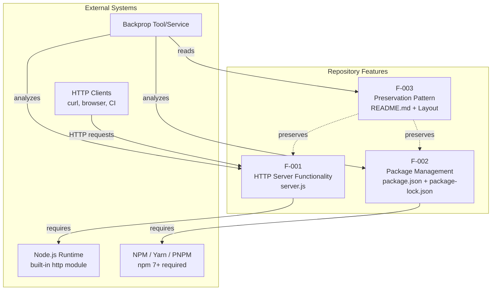
```mermaid
flowchart TB
    subgraph External["External Systems"]
        Backprop[Backprop Tool/Service]
        NodeJS[Node.js Runtime<br/>built-in http module]
        NPMEco[NPM / Yarn / PNPM<br/>npm 7+ required]
        Clients[HTTP Clients<br/>curl, browser, CI]
    end

    subgraph Features["Repository Features"]
        F001[F-001<br/>HTTP Server Functionality<br/>server.js]
        F002[F-002<br/>Package Management<br/>package.json + package-lock.json]
        F003[F-003<br/>Preservation Pattern<br/>README.md + Layout]
    end

    F003 -.preserves.-> F001
    F003 -.preserves.-> F002
    F001 -->|requires| NodeJS
    F002 -->|requires| NPMEco
    Clients -->|HTTP requests| F001
    Backprop -->|analyzes| F001
    Backprop -->|analyzes| F002
    Backprop -->|reads| F003
```

### 2.3.2 Integration Points

| Integration Pair | Direction | Nature |
|------------------|-----------|--------|
| Backprop ↔ F-001, F-002, F-003 | Inbound to repo | Backprop analyzes all artifacts (per Section 1.2.1.3) |
| HTTP Clients ↔ F-001 | Inbound to runtime | Clients send requests; receive static `"Hello, World!\n"` |
| NPM / Yarn / PNPM ↔ F-002 | Local tool | Installation and script execution |
| Node.js Runtime ↔ F-001 | Hosting | Provides built-in `http`, process model, event loop |

### 2.3.3 Shared Components and Common Services

There are **no shared modules** in the runtime; `server.js` is a single monolithic file with no internal `require()` calls beyond the Node.js built-in `http` module. The only cross-cutting concerns shared across F-001's requirements are:

| Shared Concern | Mechanism | Used By |
|----------------|-----------|---------|
| Console-based logging | `console.log` / `console.error` | All F-001 error and lifecycle handlers |
| Environment variable resolution | `process.env.HOST`, `process.env.PORT` | F-001-RQ-001 |
| Bounded shutdown timers | `setTimeout` with `unref()` semantics | F-001-RQ-007, F-001-RQ-008, F-001-RQ-009 |
| Server close routine | `server.close(callback)` | F-001-RQ-007, F-001-RQ-008, F-001-RQ-009 |

No persistent caches, message buses, databases, or middleware stacks are shared because none exist in the system.

---

## 2.4 IMPLEMENTATION CONSIDERATIONS

### 2.4.1 Technical Constraints

| Feature | Constraint | Rationale |
|---------|------------|-----------|
| F-001 | Single-file monolithic implementation | Minimizes analysis surface for Backprop integration |
| F-001 | CommonJS module system (`require`) | Native Node.js compatibility without transpilation |
| F-001 | HTTP/1.1 only — no HTTPS/TLS | Per Section 1.3.1.2 protocol boundary |
| F-001 | Single-threaded event loop | Default Node.js execution model; no clustering |
| F-001 | Stateless operation; no persistence | Deterministic responses for test consumers |
| F-002 | `main` field references non-existent `index.js` | Preserved intentionally as part of identity surface |
| F-002 | Lockfile version 3 | Requires NPM 7+ on consuming environment |
| F-003 | Preservation enforced socially, not mechanically | No CI gate or lint rule protects identity surface |

### 2.4.2 Performance Requirements

Per Section 1.2.3.3, **no quantitative KPIs, SLAs, or performance thresholds** (throughput, latency, availability) are defined within the repository. Performance is evaluated through binary functional outcomes:

| Feature | Verification Method | Outcome |
|---------|---------------------|---------|
| F-001 | Server starts and responds to a request | Pass / Fail |
| F-002 | `npm install` or `npm ci` completes | Pass / Fail |
| F-003 | Backprop integration test suite passes | Pass / Fail |

Hard timeouts that are *not* performance SLAs but are bounded-completion guarantees:

- Graceful shutdown drain window: **10 seconds**
- Uncaught exception cleanup window: **5 seconds**
- Unhandled rejection cleanup window: **5 seconds**

### 2.4.3 Scalability Considerations

Scalability is **explicitly out of scope** per Section 1.3.2.4 ("Scalability testing or capacity planning exercises"). The system runs as a single Node.js process on a single-threaded event loop. There is no load balancing, no clustering via the `cluster` module, no worker threads, no horizontal scaling design, and no shared state that would require coordination. The deployment model is local development and CI invocation only — never multi-instance, never production end-user-facing.

### 2.4.4 Security Implications

| Feature | Posture | Detail |
|---------|---------|--------|
| F-001 | Default loopback binding | Binds to `127.0.0.1` unless `HOST` env var overrides; restricts exposure to the local machine by default |
| F-001 | No authentication or authorization | Per Section 1.3.2.1; no sessions, cookies, or identity primitives exist |
| F-001 | No HTTPS/TLS support | Per Section 1.3.1.2; HTTP/1.1 only |
| F-001 | No rate limiting, no security headers, no CORS | Per Section 1.3.2.1 |
| F-001 | No request body parsing or query handling | Eliminates injection vectors but also functionality |
| F-001 | Bounded shutdown timers | 10s graceful, 5s exception, 5s rejection — prevents indefinite hangs |
| F-001 | Server-side-only error logging | Error details never reflected to clients |
| F-002 | Zero supply chain | No transitive packages, no third-party code execution at install |
| F-003 | No mechanical enforcement of "Do not touch!" | Policy is social; depends on contributor discipline |

### 2.4.5 Maintenance Requirements

| Feature | Maintenance Posture |
|---------|---------------------|
| F-001 | `server.js` is the only file expected to receive technical changes (the hardened runtime surface) |
| F-002 | `package.json` and `package-lock.json` are frozen identity artifacts — should remain unchanged |
| F-003 | `README.md` is a frozen identity artifact — should remain unchanged |

The reconciled posture from the Project Guide is that the **Preserved Identity Surface** (`package.json`, `package-lock.json`, `README.md`) remains untouched while the **Hardened Runtime Surface** (`server.js`) absorbed the production-grade error-handling enhancements. Any future modification must respect this split: changes to runtime behavior are permitted within `server.js`; changes to package identity are not.

---

## 2.5 TRACEABILITY MATRIX

The following matrix traces each functional requirement to its source artifact, owning feature, and verification approach.

### 2.5.1 Requirement-to-Source Traceability

| Requirement ID | Feature | Source Artifact | Source Location |
|----------------|---------|-----------------|-----------------|
| F-001-RQ-001 | F-001 | `server.js` | Lines 5–6, 140 |
| F-001-RQ-002 | F-001 | `server.js` | Lines 22–24 |
| F-001-RQ-003 | F-001 | `server.js` | Lines 14–19 |
| F-001-RQ-004 | F-001 | `server.js` | Lines 11, 25–37 |
| F-001-RQ-005 | F-001 | `server.js` | Lines 42–54 |
| F-001-RQ-006 | F-001 | `server.js` | Lines 58–68 |
| F-001-RQ-007 | F-001 | `server.js` | Lines 72–93 |
| F-001-RQ-008 | F-001 | `server.js` | Lines 97–115 |
| F-001-RQ-009 | F-001 | `server.js` | Lines 119–137 |
| F-001-RQ-010 | F-001 | `server.js` | Lines 140–143 |
| F-002-RQ-001 | F-002 | `package.json` | Lines 2–10 |
| F-002-RQ-002 | F-002 | `package.json` + `package-lock.json` | Entire files |
| F-002-RQ-003 | F-002 | `package-lock.json` | Lines 1–13 |
| F-002-RQ-004 | F-002 | `package.json` | Line 7 |
| F-003-RQ-001 | F-003 | `README.md` | Lines 1–2 |
| F-003-RQ-002 | F-003 | Repository structure | `existing-projects-qa-test/` |
| F-003-RQ-003 | F-003 | Entire repository | All four core files |

### 2.5.2 Requirement-to-Success-Criterion Traceability

The success criteria in Section 1.2.3.1 map to specific requirements as follows.

| Success Criterion (Section 1.2.3.1) | Requirements Verified |
|--------------------------------------|------------------------|
| `node server.js` executes without errors | F-001-RQ-001, F-001-RQ-005, F-001-RQ-010 |
| Server responds with `"Hello, World!\n"` | F-001-RQ-002, F-001-RQ-003 |
| `npm install` / `npm ci` completes | F-002-RQ-001, F-002-RQ-002, F-002-RQ-003 |
| Backprop can analyze the codebase | F-003-RQ-001, F-003-RQ-002, F-003-RQ-003 |

### 2.5.3 Requirement-to-Scope-Boundary Traceability

| Scope Statement (Section 1.3) | Requirements Affected |
|-------------------------------|------------------------|
| Loopback by default; `HOST=0.0.0.0` override permitted | F-001-RQ-001 |
| Port 3000 default; `PORT` override permitted | F-001-RQ-001 |
| HTTP/1.1 only; no HTTPS/TLS | F-001 entire feature (constraint) |
| Single Node.js process, single-threaded | F-001 entire feature (constraint) |
| Stateless, no persistence | F-001-RQ-002 |
| `npm test` placeholder | F-002-RQ-004 |
| Backprop integration consumer | F-003-RQ-003 |

### 2.5.4 Linked Specifications and Process Flows

| Cross-Reference | Linked Section |
|-----------------|----------------|
| Project overview, stakeholders, business problem | Section 1.1 Executive Summary |
| Primary capability enumeration (F-001/F-002/F-003) | Section 1.2.2.1 |
| High-level architecture diagram | Section 1.2.2.2 |
| Success criteria | Section 1.2.3.1 |
| Critical success factors | Section 1.2.3.2 |
| Absence of quantitative KPIs | Section 1.2.3.3 |
| In-scope features and workflow boundaries | Section 1.3.1 |
| Out-of-scope exclusions | Section 1.3.2 |

---

## 2.6 ASSUMPTIONS AND CONSTRAINTS

### 2.6.1 Assumptions

1. **Node.js runtime is available** on any consuming environment; no specific minimum version is enforced by the code beyond what the `http` module requires (effectively all Node.js versions).
2. **NPM 7 or later is available** on environments performing `npm install` or `npm ci`, as required by `lockfileVersion: 3`.
3. **The Backprop Tool/Service is the primary integration consumer** and its requirements drive the preservation policy; no other tools are formally supported.
4. **The "Do not touch!" notice** in `README.md` is binding for the package-identity surface but does not apply to `server.js`, which has been hardened.
5. **References to "5/5 tests passing"** in any supplementary documentation refer to manual verification of the four success criteria in Section 1.2.3.1, not to automated tests — no test framework exists in the repository.

### 2.6.2 Constraints

1. **No third-party packages may be added.** Doing so would invalidate F-002-RQ-002 and increase the analysis surface Backprop must process.
2. **The `main` field anomaly** (`"main": "index.js"` with no `index.js` file) is preserved as part of identity and must not be "fixed."
3. **No automated test framework exists.** Verification is performed by exercising the success criteria manually or via Backprop's integration test suite.
4. **No quantitative performance targets are defined.** Sections introducing throughput, latency, or availability SLAs would conflict with Section 1.2.3.3.
5. **Scope expansions are out of bounds** per Section 1.3.2: no routing, no auth, no HTTPS, no containers, no clustering, no databases, no message queues.

### 2.6.3 Requirement Versioning

This requirements document corresponds to the repository state in which:
- `server.js` is 144 lines, hardened with comprehensive error handling
- `package.json` declares `"version": "1.0.0"`
- `package-lock.json` declares `"lockfileVersion": 3`
- `README.md` is 2 lines containing the project identity and preservation notice

Future requirement revisions must update this document if any of the four reference artifacts above change in size, content, or version.

---

#### References

#### Repository Files Examined

- `existing-projects-qa-test/server.js` — Hardened HTTP server implementation (144 lines); source for all ten F-001 requirements, including configurable binding (lines 5–6, 140), static response (lines 22–24), input validation (lines 14–19), synchronous error containment (lines 11, 25–37), server-level error handling (lines 42–54), client connection error handling (lines 58–68), graceful shutdown (lines 72–93), uncaught exception recovery (lines 97–115), unhandled rejection recovery (lines 119–137), and startup logging (lines 140–143).
- `existing-projects-qa-test/package.json` — NPM manifest (11 lines); source for F-002-RQ-001 (package identity), F-002-RQ-002 (zero-dependency footprint), and F-002-RQ-004 (placeholder `test` script at line 7).
- `existing-projects-qa-test/package-lock.json` — NPM lockfile (13 lines, version 3); source for F-002-RQ-003 (deterministic lockfile) and confirmation of zero-dependency footprint.
- `existing-projects-qa-test/README.md` — Repository documentation (2 lines); source for F-003-RQ-001 (repository identity and preservation policy).

#### Repository Folders Explored

- `/` (repository root) — Top-level container.
- `existing-projects-qa-test/` — Project root containing the four core application files and the `blitzy/` documentation subtree; basis for F-003-RQ-002 (flat directory layout).
- `existing-projects-qa-test/blitzy/documentation/` — Holds `Technical Specifications.md` and `Project Guide.md` referenced for stakeholder framework, success criteria, scope boundaries, and Project Guide reconciliation between preserved and hardened surfaces.

#### Technical Specification Sections Cross-Referenced

- Section 1.1 Executive Summary — Project overview, business problem, stakeholders, value proposition.
- Section 1.2 System Overview — Business context, primary capabilities (F-001/F-002/F-003 enumeration), major components, technical approach, success criteria, KPI posture.
- Section 1.3 Scope — In-scope features, implementation boundaries, out-of-scope exclusions, future considerations.

# 3. Technology Stack

The `hao-backprop-test` repository (NPM package `hello_world` v1.0.0) operates with a deliberately austere technology stack. Per Section 1.2.2.3, the technical approach is "intentionally austere" and "deliberately excludes web frameworks (Express, Fastify, Koa), templating engines, persistence layers, and middleware stacks." This section documents the technologies that are actually present in the repository, justifies each selection against the project's role as a Backprop integration test scaffold, and explicitly identifies categories of technology that are out of scope by design.

> **Documentation Note:** The default technology stack template (AWS, Docker, Terraform, GitHub Actions, Python/Flask, MongoDB, Auth0, React, etc.) is **not applicable** to this system. Per Section 1.3.2 and Section 2.6.2, every component in that template is explicitly out of scope. Adding any of those technologies would invalidate F-002-RQ-002 and expand the analysis surface that Backprop must process, conflicting with the project's core preservation mandate.

---

## 3.1 PROGRAMMING LANGUAGES

### 3.1.1 Language Inventory by Platform Component

The system uses **exactly one programming language** across all runtime components. There is no client-side codebase, no native mobile or desktop component, no shell automation, and no infrastructure-as-code surface.

| Platform Component | Language | Version Profile | Source File(s) |
|--------------------|----------|-----------------|----------------|
| HTTP Server Runtime | JavaScript (CommonJS) | ECMAScript 2015 (ES6) baseline | `server.js` |
| Package Manifest | JSON | Per RFC 8259 | `package.json` |
| Package Lockfile | JSON (NPM lockfile schema v3) | NPM lockfile version 3 | `package-lock.json` |
| Repository Documentation | Markdown (CommonMark) | N/A | `README.md` |

JavaScript is the **sole executable language**. The remaining artifacts are declarative data formats consumed by NPM-compatible tooling and human readers.

### 3.1.2 JavaScript (CommonJS) — Primary Runtime Language

#### 3.1.2.1 Selection Criteria and Justification

JavaScript was selected for the following criteria, each traceable to constraints documented elsewhere in this specification:

| Selection Criterion | Justification | Reference |
|---------------------|---------------|-----------|
| Native Node.js compatibility | No transpilation step is required; `server.js` executes directly via `node server.js` | Section 1.2.2.3 |
| Built-in HTTP capability | Node.js provides the `http` module without any external installation | Section 1.2.1.3 |
| Zero compilation surface | Eliminates Babel, SWC, and TypeScript compiler from the analysis target | Section 2.6.2 |
| Cross-platform portability | The same source executes identically on Windows, macOS, and Linux | Section 3.7.3 |
| Minimal cognitive surface | A 144-line, single-file implementation can be reasoned about exhaustively | Section 2.4.1 |

The CommonJS module system (`require()` based) is used in preference to ES Modules (ESM, `import`/`export`). This decision aligns with the F-001 constraint that mandates "CommonJS module system (`require`)" for "Native Node.js compatibility without transpilation," as documented in Section 2.4.1.

#### 3.1.2.2 Language Feature Usage

The implementation in `server.js` employs an ES2015-baseline subset of JavaScript:

- `const` and `let` for lexical binding
- Arrow functions in callback positions
- Template literals for log message composition
- The `function` declaration form for the request listener
- Synchronous control flow (no `async`/`await` usage)
- Try/catch blocks for synchronous error containment
- CommonJS `require()` to import the built-in `http` module

The implementation does **not** rely on cutting-edge language features (optional chaining beyond defensive default-value coalescing, top-level await, ES Module syntax, decorators, private class fields), which keeps the minimum required Node.js version low and broadens runtime compatibility.

### 3.1.3 Languages and Tooling Explicitly Excluded

The following language ecosystems are **not present** in the repository, verified by file system inspection:

| Excluded Language/Tooling | Verification | Rationale |
|---------------------------|--------------|-----------|
| TypeScript | No `tsconfig.json`, no `.ts` files, no `@types/*` packages | Adds transpilation surface; violates F-002-RQ-002 |
| Python | No `.py` files, no `requirements.txt`, no `pyproject.toml` | Default-stack assumption; not applicable |
| HTML/CSS | No `.html` or `.css` files; server returns `text/plain` only | F-001 returns static plain-text response only |
| Shell scripts | No `.sh` or `.bash` files | No automation surface required |
| YAML / TOML | No `.yml`, `.yaml`, or `.toml` files | No configuration files of these formats are needed |
| Dockerfile syntax | No `Dockerfile` present in repository | Per Section 1.3.2.1, containers are out of scope |

---

## 3.2 FRAMEWORKS & LIBRARIES

### 3.2.1 Zero-Framework Architecture

The system adopts a **zero-framework architecture**. Per Section 1.2.2.3, the implementation "deliberately excludes web frameworks (Express, Fastify, Koa), templating engines, persistence layers, and middleware stacks." This is the central architectural decision of the project, and it is mechanically guaranteed by the dependency declarations in `package.json` and `package-lock.json` (both of which declare zero dependencies).

| Framework Category | Status | Mechanism |
|--------------------|--------|-----------|
| Web/HTTP framework | None | Not declared in `package.json`; replaced by Node.js built-in `http` module |
| Application framework | None | No application bootstrap layer exists |
| Middleware framework | None | No middleware pipeline is implemented |
| Routing framework | None | All requests funnel through a single request listener |
| Template engine | None | Response body is a hardcoded string literal |
| ORM/ODM | None | No data persistence layer exists |
| Validation framework | None | Lightweight inline validation of `req.method` and `req.url` only |
| Logging framework | None | Native `console.log` and `console.error` are used directly |
| Testing framework | None | The `npm test` script is an intentional error-exit placeholder |

### 3.2.2 Sole Module Dependency: Node.js Built-in `http` Module

The implementation imports exactly one module: the Node.js built-in `http` module via `require('http')`. Because this module is part of the Node.js core distribution, it has **no independent version** — its version is synchronized with the Node.js runtime version on the host.

#### 3.2.2.1 HTTP Module API Surface Used

The `http` module is the architectural cornerstone of F-001 (HTTP Server Functionality). The following API surface is exercised in `server.js`:

| API Element | Role | Feature Linkage |
|-------------|------|-----------------|
| `http.createServer(requestListener)` | Constructs the HTTP server with the request handler callback | F-001-RQ-001 |
| `server.listen(port, hostname, callback)` | Binds the server to the configured network endpoint and announces readiness | F-001 (configurable binding) |
| `server.on('error', handler)` | Handles startup-phase failures including `EADDRINUSE` and `EACCES` | F-001 (server-level error handling) |
| `server.on('clientError', handler)` | Handles malformed client connections with socket cleanup | F-001 (client error handling) |
| `server.close(callback)` | Performs graceful drain during shutdown | F-001 (graceful shutdown) |
| `res.statusCode` | Sets the HTTP response status (200, 400, or 500) | F-001-RQ-002, validation, error paths |
| `res.setHeader(name, value)` | Sets `Content-Type: text/plain` and other response headers | F-001-RQ-002 |
| `res.end(data)` | Sends the response body and closes the connection | F-001-RQ-002 |
| `res.headersSent` | Guards against double-write when an error occurs mid-response | F-001 (synchronous error containment) |

#### 3.2.2.2 Node.js Built-in Modules Not Used

The implementation deliberately uses **only one** built-in module. The following built-in modules — which would otherwise be commonly imported in a Node.js HTTP server — are explicitly **not** used:

`https`, `fs`, `path`, `url`, `querystring`, `crypto`, `stream`, `cluster`, `child_process`, `worker_threads`, `dns`, `net`, `tls`, `os`, `events` (directly), `buffer` (directly), `util`.

Excluding `fs` is consistent with the stateless-operation constraint from Section 2.4.1 ("Stateless operation; no persistence"). Excluding `https`, `tls`, and `crypto` is consistent with the HTTP/1.1-only protocol boundary in Section 1.3.1.2. Excluding `cluster` and `worker_threads` is consistent with the single-threaded event loop concurrency model declared in Section 1.2.2.3.

### 3.2.3 Node.js Global Process API

In addition to the imported `http` module, `server.js` uses the Node.js global `process` object directly (no `require` is needed for globals). This usage is also part of F-001's runtime hardening.

| Process API | Role |
|-------------|------|
| `process.env.HOST` / `process.env.PORT` | Environment variable resolution for configurable binding (with defaults `127.0.0.1` and `3000`) |
| `process.on('SIGTERM', handler)` | Triggers graceful shutdown on container/process-manager termination |
| `process.on('SIGINT', handler)` | Triggers graceful shutdown on `Ctrl+C` interactive stop |
| `process.on('uncaughtException', handler)` | Last-resort recovery for synchronous exceptions outside try/catch |
| `process.on('unhandledRejection', handler)` | Last-resort recovery for unhandled promise rejections |
| `process.exit(code)` | Deterministic process termination with explicit exit codes |
| Global `setTimeout(...)` | Bounded force-exit timers (10s graceful, 5s exception, 5s rejection) |
| Global `console.log` / `console.error` | Stdout/stderr logging without a logging library |

### 3.2.4 Frameworks and Libraries Explicitly Excluded

Per Section 1.3.2.1, the following library and framework categories are out of scope. Adding any one of them would create a non-zero dependency footprint and violate F-002-RQ-002.

| Category | Excluded Packages |
|----------|-------------------|
| HTTP/Web frameworks | Express, Fastify, Koa, Hapi, NestJS, Restify |
| ORMs / ODMs | Sequelize, Mongoose, Prisma, TypeORM, Knex |
| Testing | Jest, Mocha, Chai, Jasmine, AVA, Vitest, Tape, Supertest |
| HTTP clients | Axios, Got, Request, node-fetch, undici (as a dependency) |
| Utility libraries | Lodash, Ramda, Underscore, date-fns, moment |
| Validation | Joi, Yup, Ajv, Zod |
| Logging | Winston, Bunyan, Pino, Log4js |
| Configuration | Dotenv, Config, nconf, convict |
| Authentication | Passport, jsonwebtoken, oauth2orize |
| Process supervisors (as deps) | PM2, Forever, Nodemon |

---

## 3.3 OPEN SOURCE DEPENDENCIES

### 3.3.1 Zero External Dependency Footprint

The repository declares **zero open-source dependencies** of any kind. This is the load-bearing constraint of the entire project, formalized as F-002-RQ-002 and reinforced by Section 2.6.2 constraint #1: "No third-party packages may be added. Doing so would invalidate F-002-RQ-002 and increase the analysis surface Backprop must process."

#### 3.3.1.1 Evidence from `package.json`

The 11-line `package.json` manifest declares no dependency fields. The complete dependency surface is:

| Manifest Field | Status |
|----------------|--------|
| `dependencies` | Field absent |
| `devDependencies` | Field absent |
| `peerDependencies` | Field absent |
| `optionalDependencies` | Field absent |
| `bundledDependencies` | Field absent |

#### 3.3.1.2 Evidence from `package-lock.json`

The 13-line `package-lock.json` confirms the zero-dependency state at the lockfile level. The `packages` object contains only a single entry under the root empty-string key (`""`), describing the project itself. There are no transitive package entries, no resolved registry URLs beyond the project's own identity, and no integrity hashes for third-party tarballs.

This produces three operational guarantees:

1. **`npm install` performs no network downloads** — the lockfile validates trivially.
2. **`npm ci` is idempotent** — there is nothing to fetch or verify against a remote registry.
3. **No transitive vulnerabilities are possible** — there is no transitive closure.

### 3.3.2 Package Registry Configuration

| Registry Aspect | Configuration |
|-----------------|---------------|
| Default Registry | npm public registry (`https://registry.npmjs.org`) |
| Override File | None — no `.npmrc` exists in the repository |
| Private Registry | None configured |
| Scoped Registries | None configured |
| Authentication | Not required (no packages are fetched) |

Because no dependencies exist, the registry configuration is effectively dormant: NPM-compatible package managers consult the registry's URL only when commands such as `npm publish` are invoked, and the project is not configured for publication.

### 3.3.3 Project License

The repository itself is licensed under the **MIT License**, declared identically in both `package.json` (`"license": "MIT"`) and `package-lock.json`. Because there are no third-party dependencies, there are no transitive licenses to audit, no SPDX expressions to reconcile, and no copyleft obligations to track.

### 3.3.4 Lockfile Schema

`package-lock.json` is written in **NPM lockfile schema version 3**, which is the schema introduced with npm 7. This is the only versioned dependency-management artifact in the repository.

| Lockfile Property | Value | Implication |
|-------------------|-------|-------------|
| `lockfileVersion` | `3` | Requires npm 7+ on consuming environments |
| `requires` | `true` | Standard schema metadata |
| `packages` | Single root entry | Confirms zero dependencies |

---

## 3.4 THIRD-PARTY SERVICES

### 3.4.1 Sole External Integration: Backprop Tool/Service

Per Section 1.2.1.3, the system integrates with exactly **one** external entity — the Backprop Tool/Service — and the coupling is intentional and unidirectional (Backprop reads the repository; the repository does not call out to Backprop).

| Integration Aspect | Detail |
|--------------------|--------|
| Service Name | Backprop Tool/Service |
| Role | Primary integration consumer; analyzes the codebase as a fixed reference target |
| Coupling | Direct, intentional |
| Direction | Inbound only (Backprop → Repository artifacts) |
| SDK / Client Library | None — the repository imports no Backprop client code |
| Configuration Files | None — no `.backprop.config`, no Backprop manifest in the repository |
| Runtime API Calls | None — `server.js` does not call any Backprop API |
| Authentication | None required on the repository side |
| Network Egress | None initiated by the repository |

Backprop's relationship to the repository is **analytical**, not **interactive**: it consumes the source files (`server.js`, `package.json`, `package-lock.json`, `README.md`) as analysis input. This is precisely why the "Do not touch!" preservation policy in `README.md` is binding for the identity surface — the stability of that surface is the contract Backprop integrates against.

### 3.4.2 Authentication, Identity, and Secret Management

**Status: None.** Per Section 1.3.2.3 ("Authentication providers (OAuth, OIDC, SAML, LDAP)" are explicitly absent integration points) and Section 2.4.4 ("No authentication or authorization … no sessions, cookies, or identity primitives exist"):

| Auth Category | Status |
|---------------|--------|
| OAuth 2.0 / OIDC | Not used |
| SAML | Not used |
| LDAP / Active Directory | Not used |
| Auth0, Okta, AWS Cognito | Not used |
| JWT issuance or verification | Not used |
| API key validation | Not used |
| Session storage / cookies | Not used |
| Secret management (Vault, AWS Secrets Manager, etc.) | Not used; no secrets exist |

### 3.4.3 Monitoring, Observability, and APM

**Status: None.** Per Section 1.3.2.3, observability platforms (APM, log aggregators, metrics collectors) are explicitly absent integration points. Per Section 1.3.2.1, structured logging frameworks are excluded — "only `console.log`/`console.error` are used."

| Observability Category | Status | Substitute |
|------------------------|--------|------------|
| APM (New Relic, Datadog, AppDynamics) | Not used | None |
| Error tracking (Sentry, Rollbar, Bugsnag) | Not used | `console.error` to stderr |
| Metrics (Prometheus, StatsD, CloudWatch) | Not used | None |
| Log aggregation (Splunk, Loggly, Papertrail, ELK) | Not used | `console.log` to stdout |
| Distributed tracing (Jaeger, Zipkin, OpenTelemetry) | Not used | None |
| Uptime monitoring (Pingdom, UptimeRobot) | Not used | None |
| Real-user monitoring | Not used | N/A (no client) |

### 3.4.4 Cloud and Hosting Services

**Status: None.** Per Section 1.3.2.3, continuous deployment targets (PaaS, IaaS, FaaS platforms) are out of scope. Per Section 1.3.1.2, geographic/market coverage is limited to "Local development environments only."

| Cloud Category | Excluded Services |
|----------------|-------------------|
| Compute (IaaS) | AWS EC2, Azure VM, GCP Compute Engine |
| Container Orchestration (PaaS) | AWS ECS/EKS, Azure AKS, GCP GKE, Heroku |
| Serverless (FaaS) | AWS Lambda, Azure Functions, GCP Cloud Functions |
| Static / Edge Hosting | Netlify, Vercel, Cloudflare Pages |
| CDN | CloudFront, Cloudflare CDN, Fastly, Akamai |
| Object Storage | AWS S3, Azure Blob, GCP Cloud Storage |

### 3.4.5 Other External Services Not Integrated

The following service categories are also explicitly absent, per Section 1.3.2.1:

| Service Category | Examples Excluded |
|------------------|-------------------|
| Email / Notifications | SendGrid, Mailgun, AWS SES, Twilio |
| Messaging / Queues | Redis, RabbitMQ, Kafka, AWS SQS |
| Analytics | Google Analytics, Mixpanel, Segment, Amplitude |
| Payment Processing | Stripe, PayPal, Square |
| Search | Elasticsearch, Algolia, AWS OpenSearch |
| ML/AI Services | OpenAI, Anthropic, Langchain backends (none used) |

---

## 3.5 DATABASES & STORAGE

### 3.5.1 Stateless Architecture Statement

Per Section 1.2.2.3, the State Model is "Stateless — No persistence; deterministic responses." Per Section 1.3.1.2, the Data Domains scope is "No data persistence; no user data; stateless operation; static content only." Per Section 1.3.2.1, "Database connections (SQL, NoSQL, in-memory)" are explicitly excluded.

The system has **no databases, no caches, no session stores, no file storage, and no in-memory state that survives a single request**. The HTTP response body `"Hello, World!\n"` is a hardcoded string literal in `server.js` — it is not loaded, derived, computed, or cached.

### 3.5.2 Primary and Secondary Data Stores

**Status: None.** There is no primary database, no secondary database, and no read replica.

| Database Type | Status |
|---------------|--------|
| Relational (PostgreSQL, MySQL, SQLite, SQL Server, MariaDB, Oracle) | Not used |
| Document (MongoDB, CouchDB, AWS DocumentDB) | Not used — despite appearing in the default-stack template, MongoDB is explicitly out of scope |
| Key-Value (Redis, DynamoDB, etcd) | Not used |
| Column-family (Cassandra, HBase, ScyllaDB) | Not used |
| Graph (Neo4j, ArangoDB, AWS Neptune) | Not used |
| Time-series (InfluxDB, TimescaleDB, Prometheus TSDB) | Not used |
| Embedded (SQLite, LevelDB) | Not used |

### 3.5.3 Caching Solutions

**Status: None.** No application-level, distributed, or HTTP-level caching is implemented.

| Cache Layer | Status | Detail |
|-------------|--------|--------|
| In-process cache | None | No in-memory map, LRU, or memoization layer exists |
| Distributed cache | None | No Redis, Memcached, or equivalent |
| HTTP response cache | None | No `Cache-Control`, `ETag`, or `Last-Modified` headers are emitted |
| CDN caching | None | No CDN is present |

### 3.5.4 Session and Storage Services

**Status: None.**

| Storage Category | Status |
|------------------|--------|
| Session store | Not used — request handling is fully stateless |
| File system writes (via `fs`) | Not used — `fs` module is not imported |
| Log files | Not written — logging is to stdout/stderr only |
| Object storage (S3, Azure Blob, GCS) | Not used |
| Block storage / EBS | Not used |
| Secret stores | Not used — no secrets exist |

### 3.5.5 Data Persistence Strategy

The data persistence strategy is **"no persistence by design."** This eliminates entire classes of operational concern (backup, recovery, replication, migration, schema evolution, consistency, and data residency) that would otherwise expand the analysis surface Backprop must process. Per Section 2.4.1, "Stateless operation; no persistence" is enumerated as a deliberate F-001 constraint with the rationale "Deterministic responses for test consumers."

---

## 3.6 DEVELOPMENT & DEPLOYMENT

### 3.6.1 Version Control

| Aspect | Value |
|--------|-------|
| Version Control System | Git |
| Remote Hosting | GitHub |
| Default Branch | `main` |
| Git LFS | Not configured |
| Submodules | None |

The repository is hosted on GitHub. The working tree contains only files; no binary assets requiring LFS exist.

### 3.6.2 Development Tools

**Status: None configured.** Consistent with the "minimal cognitive surface" principle, no developer tooling is preconfigured in the repository. Contributors must rely on their personal editor configuration.

| Tool Category | Status | Configuration File(s) Absent |
|---------------|--------|------------------------------|
| Linting | Not configured | No `.eslintrc.*`, no `.jshintrc`, no `eslint.config.js` |
| Formatting | Not configured | No `.prettierrc`, no `.editorconfig` |
| Type Checking | Not used | No `tsconfig.json`, no JSDoc type configuration |
| Pre-commit hooks | Not configured | No `.husky/`, no `lefthook.yml` |
| Code coverage | Not configured | No `.nycrc`, no `c8` configuration |
| Hot reload | Not installed | No nodemon, no `tsx`, no `ts-node-dev` |
| Debugger configurations | Not committed | No `.vscode/launch.json` checked in |

### 3.6.3 Build System

**Status: None.** The application requires no build step.

| Build Aspect | Status |
|--------------|--------|
| Transpilation (Babel, SWC, TSC) | Not required |
| Bundling (Webpack, Rollup, Parcel, esbuild, Vite) | Not required |
| Task runner (Gulp, Grunt, npm-run-all) | Not required |
| Intermediate artifacts (`dist/`, `build/`, `out/`) | None produced |
| Source maps | None generated |
| Build time | Effectively zero — direct execution |

#### 3.6.3.1 NPM Script Inventory

The `scripts` block in `package.json` declares exactly one entry:

| Script | Command | Purpose |
|--------|---------|---------|
| `test` | `echo "Error: no test specified" && exit 1` | Intentional placeholder per F-002-RQ-004; exits with non-zero to satisfy NPM convention while signaling that no test framework is in scope |

No `start`, `build`, `dev`, `lint`, `format`, `prepare`, or other scripts are defined. Servers are launched directly with `node server.js`, as documented in Section 1.2.3.1 ("`node server.js` executes without errors").

### 3.6.4 Containerization

**Status: Not implemented.** Per Section 1.3.2.1, "Container orchestration (Docker, Kubernetes)" is explicitly excluded. The repository contains no `Dockerfile`, `docker-compose.yml`, `.dockerignore`, container registry configuration, or Kubernetes manifests of any kind.

The hardened runtime in `server.js`, however, is **container-compatible by virtue of its signal handling**. The `SIGTERM` handler with bounded 10-second graceful shutdown (Section 2.4.2) is exactly the lifecycle contract that Docker, Kubernetes, and systemd expect. This compatibility is incidental — it arose from the runtime hardening described in Section 1.2.1.2 — and **does not constitute an in-repository deployment pathway**.

### 3.6.5 Continuous Integration / Continuous Deployment

**Status: Not implemented.** No CI/CD configuration of any kind is present in the repository:

| CI/CD Platform | Configuration File | Status |
|----------------|--------------------|--------|
| GitHub Actions | `.github/workflows/` | Absent |
| GitLab CI | `.gitlab-ci.yml` | Absent |
| Travis CI | `.travis.yml` | Absent |
| CircleCI | `.circleci/config.yml` | Absent |
| Jenkins | `Jenkinsfile` | Absent |
| Azure Pipelines | `azure-pipelines.yml` | Absent |
| Bitbucket Pipelines | `bitbucket-pipelines.yml` | Absent |

Per Section 2.4.1 (F-003 constraint), "Preservation enforced socially, not mechanically — No CI gate or lint rule protects identity surface." The integrity of the package-identity surface relies on contributor discipline and the explicit `README.md` notice, not on automated guardrails.

### 3.6.6 Infrastructure as Code

**Status: Not implemented.** No IaC tooling configuration exists in the repository: no Terraform (`.tf`) files, no AWS CloudFormation templates, no Pulumi programs, no Ansible playbooks, no Chef cookbooks, and no Puppet manifests. The deployment model is local execution only (Section 3.6.8).

### 3.6.7 Package Manager Compatibility

The repository is compatible with all three major Node.js package managers, but **NPM 7 or later is a hard requirement** due to the `lockfileVersion: 3` declaration in `package-lock.json`.

| Package Manager | Compatibility | Minimum Version |
|----------------|---------------|-----------------|
| npm | Native | npm 7.0.0+ (required by lockfile schema v3) |
| Yarn | Compatible | Yarn can interpret `package.json`; lockfile is regenerated as `yarn.lock` if installed |
| pnpm | Compatible | pnpm can interpret `package.json`; lockfile is regenerated as `pnpm-lock.yaml` if installed |

Per Section 2.6.1 (Assumption #2), "NPM 7 or later is available on environments performing `npm install` or `npm ci`, as required by `lockfileVersion: 3`." This is the **only enforced toolchain version constraint** in the entire stack.

### 3.6.8 Deployment Strategy

**Deployment Model:** Manual local execution.

The canonical execution flow is a single command:

```
node server.js
```

By default, the server binds to `127.0.0.1:3000`. Two environment variables can override the binding:

| Environment Variable | Default | Override Effect |
|----------------------|---------|-----------------|
| `HOST` | `127.0.0.1` | Setting `HOST=0.0.0.0` binds to all network interfaces (use only in trusted environments) |
| `PORT` | `3000` | Setting `PORT=8080` (or any other valid port) changes the listening port |

#### 3.6.8.1 Runtime Lifecycle Features Enabling Process Management

While no orchestration tooling is in scope, `server.js` is hardened with lifecycle features that make it compatible with standard process managers:

| Lifecycle Concern | Implementation in `server.js` | Bounded Timer |
|-------------------|-------------------------------|---------------|
| Graceful shutdown | `gracefulShutdown()` invoked by `SIGTERM` and `SIGINT`, draining via `server.close(...)` | 10 seconds |
| Uncaught exception recovery | `process.on('uncaughtException')` handler logs and force-exits | 5 seconds |
| Unhandled rejection recovery | `process.on('unhandledRejection')` handler logs and force-exits | 5 seconds |
| Startup failure (port in use) | `server.on('error')` catches `EADDRINUSE` and exits with non-zero code | Immediate |
| Startup failure (permission denied) | `server.on('error')` catches `EACCES` and exits with non-zero code | Immediate |
| Client connection errors | `server.on('clientError')` cleans up the socket | Immediate |

The bounded timers (per Section 2.4.2) "are *not* performance SLAs but are bounded-completion guarantees" — they prevent the process from hanging indefinitely under adverse conditions.

---

## 3.7 VERSION COMPATIBILITY REQUIREMENTS

### 3.7.1 Node.js Runtime

| Aspect | Value | Source |
|--------|-------|--------|
| Minimum Node.js version | Effectively any modern Node.js (≥ 12.x recommended) | Section 2.6.1 Assumption #1 |
| Recommended LTS | Node.js 18.x or 20.x LTS | Industry standard for current support |
| `engines` field in `package.json` | **Not declared** | Verified by manifest inspection |
| `.nvmrc` file | **Not present** | Version is not pinned at the file level |
| `.node-version` file | **Not present** | Version is not pinned at the file level |

Per Section 2.6.1 Assumption #1, "no specific minimum version is enforced by the code beyond what the `http` module requires (effectively all Node.js versions)." The absence of an `engines` field is intentional: pinning a specific Node.js version would conflict with the broad-compatibility goal of the test scaffold.

### 3.7.2 NPM Version

| Aspect | Value | Source |
|--------|-------|--------|
| Minimum NPM version | **NPM 7.0.0** | Inferred from `"lockfileVersion": 3` in `package-lock.json` |
| Rationale | Lockfile schema v3 was introduced in npm 7 | Section 2.6.1 Assumption #2 |

This is the **only hard toolchain version requirement** in the repository. Environments running npm 6.x or earlier cannot consume the lockfile and will either regenerate it (downgrading the schema) or fail.

### 3.7.3 Operating System Support

The system inherits cross-platform compatibility from Node.js itself. No OS-specific code paths exist in `server.js` (no `require('os')`, no `process.platform` branching, no shell invocations).

| Operating System | Compatibility |
|------------------|---------------|
| macOS 10.13+ | Supported |
| Windows 10+ | Supported |
| Linux (Ubuntu 18.04+, Debian 10+, RHEL 8+, Alpine) | Supported |

Signal handling (`SIGTERM`, `SIGINT`) follows POSIX semantics on Unix-like systems. On Windows, Node.js emulates `SIGINT` via Ctrl+C; `SIGTERM` is not delivered by the OS but can be sent programmatically.

---

## 3.8 TECHNOLOGY STACK ARCHITECTURE

### 3.8.1 Layered Stack Diagram

The following diagram summarizes the complete technology stack, explicitly distinguishing what is present (solid) from what is intentionally absent (dashed) by reference to the scope exclusions in Section 1.3.2.

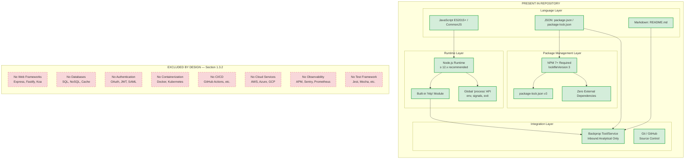
```mermaid
flowchart TB
    subgraph PresentStack["PRESENT IN REPOSITORY"]
        direction TB

        subgraph LangLayer["Language Layer"]
            JS[JavaScript ES2015+ / CommonJS]
            JSON[JSON: package.json / package-lock.json]
            MD[Markdown: README.md]
        end

        subgraph RuntimeLayer["Runtime Layer"]
            NodeJS[Node.js Runtime<br/>≥ 12.x recommended]
            HTTPMod[Built-in 'http' Module]
            ProcAPI[Global 'process' API<br/>env, signals, exit]
        end

        subgraph PackageLayer["Package Management Layer"]
            NPM7[NPM 7+ Required<br/>lockfileVersion 3]
            ZeroDeps[Zero External Dependencies]
            Lockfile[package-lock.json v3]
        end

        subgraph IntegrationLayer["Integration Layer"]
            Backprop[Backprop Tool/Service<br/>Inbound Analytical Only]
            GitVCS[Git / GitHub<br/>Source Control]
        end
    end

    subgraph AbsentStack["EXCLUDED BY DESIGN — Section 1.3.2"]
        direction TB
        NoFW[No Web Frameworks<br/>Express, Fastify, Koa]
        NoDB[No Databases<br/>SQL, NoSQL, Cache]
        NoAuth[No Authentication<br/>OAuth, JWT, SAML]
        NoContainer[No Containerization<br/>Docker, Kubernetes]
        NoCI[No CI/CD<br/>GitHub Actions, etc.]
        NoCloud[No Cloud Services<br/>AWS, Azure, GCP]
        NoObs[No Observability<br/>APM, Sentry, Prometheus]
        NoTest[No Test Framework<br/>Jest, Mocha, etc.]
    end

    JS --> NodeJS
    NodeJS --> HTTPMod
    NodeJS --> ProcAPI
    JSON --> NPM7
    NPM7 --> Lockfile
    NPM7 --> ZeroDeps
    HTTPMod --> Backprop
    JSON --> Backprop
    MD --> Backprop

    classDef present fill:#d4edda,stroke:#28a745,stroke-width:2px
    classDef absent fill:#f8d7da,stroke:#dc3545,stroke-width:1px,stroke-dasharray: 5 5
    class JS,JSON,MD,NodeJS,HTTPMod,ProcAPI,NPM7,ZeroDeps,Lockfile,Backprop,GitVCS present
    class NoFW,NoDB,NoAuth,NoContainer,NoCI,NoCloud,NoObs,NoTest absent
```

### 3.8.2 Component Integration Requirements

The integration points between technology stack components are summarized below. Per Section 2.4.1, all of these integrations are minimal and intentional.

| Integration Pair | Direction | Nature | Reference |
|------------------|-----------|--------|-----------|
| JavaScript source ↔ Node.js runtime | Hosted | The Node.js process loads and executes `server.js` directly via the CommonJS loader | Section 1.2.2.3 |
| `server.js` ↔ Built-in `http` module | Imports | A single `require('http')` call is the only module import | Section 3.2.2 |
| `server.js` ↔ `process` global | Direct use | Environment variables, signal handlers, exception handlers, exit codes | Section 3.2.3 |
| `package.json` + `package-lock.json` ↔ NPM 7+ | Tool consumption | Manifest declares identity; lockfile enforces npm 7+ schema | Section 3.6.7 |
| `package-lock.json` ↔ Zero-dependency footprint | Schema validation | Lockfile mechanically guarantees no transitive packages can be installed | Section 3.3.1 |
| Environment variables (`HOST`, `PORT`) ↔ `server.js` | Inbound config | Resolved at startup with safe defaults | Section 3.6.8 |
| OS signals (`SIGTERM`, `SIGINT`) ↔ `server.js` | Inbound events | Trigger graceful shutdown | Section 3.6.8.1 |
| Backprop ↔ All four repository artifacts | Inbound analytical | Reads source files as analysis input; never writes back | Section 3.4.1 |
| HTTP clients ↔ `server.js` | Inbound network | Send any HTTP request; receive `200 OK` + `"Hello, World!\n"` | Section 1.3.1.1 |

### 3.8.3 Security Implications of Technology Choices

Per Section 2.4.4, the technology stack choices have direct security implications, summarized here for the stack as a whole.

| Stack Choice | Security Posture | Trade-off |
|--------------|------------------|-----------|
| Zero external dependencies | No supply-chain attack surface; no transitive CVEs to track | No use of vetted utility libraries |
| Built-in `http` only (no `https`) | No TLS attack surface (no cert mismanagement, no cipher misconfiguration) | Cannot serve HTTPS; loopback/test use only |
| Default loopback binding (`127.0.0.1`) | Not reachable from external networks unless explicitly overridden | `HOST=0.0.0.0` override is a contributor-discipline matter |
| No authentication primitives | No credential mishandling, no session-fixation, no JWT-key-leak risk | No identity-aware functionality |
| No request body / query parsing | Eliminates injection vectors (SQLi, NoSQLi, command injection, XXE) | No interactive functionality |
| Server-side-only error logging | Stack traces never reflected to clients | Operators must inspect stdout/stderr |
| Bounded shutdown timers (10s / 5s / 5s) | Prevents indefinite hangs under signal storms or exception cascades | Forced exit may interrupt slow clients |
| MIT License | Permissive; no copyleft entanglement | No defensive patent protections |
| No CI/CD enforcement of identity surface | "Do not touch!" is socially enforced | Relies on contributor discipline |

### 3.8.4 Rationale Summary

The technology stack of `hao-backprop-test` is most accurately characterized not by what it contains but by what it deliberately omits. Per the constraint framework documented in Section 2.6.2, every potential expansion of the stack — adding a framework, a database, a logger, a test runner, a container, a CI pipeline — would invalidate F-002-RQ-002 (the zero-dependency constraint) or expand the analysis surface that Backprop must process. The stack is therefore a *minimum viable test scaffold*:

1. **One language** — JavaScript (CommonJS).
2. **One runtime** — Node.js with one built-in module imported (`http`).
3. **Zero dependencies** — verified by both `package.json` and `package-lock.json`.
4. **One external integration** — Backprop, and only as an inbound analytical consumer.
5. **No databases, no caches, no sessions** — fully stateless.
6. **No frameworks, no build step, no transpilation** — direct execution of source.
7. **No containers, no CI/CD, no IaC** — manual local execution.

This austerity is the central design choice and is mechanically self-enforcing through the zero-dependency lockfile.

---

#### References

#### Repository Files Examined

- `server.js` — Hardened HTTP server implementation (144 lines); source of all language-feature usage, built-in module imports, `process` API usage, lifecycle hooks, environment-variable resolution, signal handling, and bounded shutdown timers.
- `package.json` — NPM manifest (11 lines); source of package identity (`hello_world` v1.0.0), MIT license declaration, absence of all dependency fields, sole `test` script declaration, and absence of `engines` field.
- `package-lock.json` — NPM lockfile (13 lines, schema v3); source of zero-dependency confirmation and the NPM 7+ minimum-version requirement.
- `README.md` — Repository documentation (2 lines); source of project identity and the "Do not touch!" preservation policy that constrains the package-identity surface.

#### Repository Folders Inspected

- `existing-projects-qa-test/` (project root) — Confirmed flat directory layout containing only the four core files plus the `blitzy/` documentation subtree; no `.github/`, `.docker/`, `.vscode/`, `.husky/`, or other tooling directories.
- `existing-projects-qa-test/blitzy/documentation/` — Holds `Technical Specifications.md` and `Project Guide.md` cross-referenced for stack rationale.

#### Configuration Files Verified Absent

- `tsconfig.json`, `.eslintrc.*`, `.prettierrc`, `.editorconfig` — No development tooling configuration
- `Dockerfile`, `docker-compose.yml`, `.dockerignore` — No containerization configuration
- `.github/workflows/`, `.gitlab-ci.yml`, `.travis.yml`, `.circleci/`, `Jenkinsfile`, `azure-pipelines.yml` — No CI/CD configuration
- `.env`, `.npmrc`, `.nvmrc`, `.node-version` — No environment or version-pinning configuration
- Any `*.tf`, `*.yaml` (IaC) — No infrastructure-as-code configuration

#### Technical Specification Sections Cross-Referenced

- Section 1.2 System Overview — Project context, system state (Preserved Identity Surface vs. Hardened Runtime Surface), integration with enterprise landscape, primary system capabilities (F-001/F-002/F-003), major system components, core technical approach table, success criteria, KPI posture.
- Section 1.3 Scope — In-scope features, implementation boundaries (network, port, protocol, process model, data domain), out-of-scope feature exclusions, integration points not covered, unsupported use cases.
- Section 2.4 Implementation Considerations — Technical constraints (F-001 single-file CommonJS, F-002 lockfile v3, F-003 social preservation), performance requirements (bounded timers), scalability posture, security implications matrix, maintenance posture.
- Section 2.6 Assumptions and Constraints — Node.js availability, NPM 7+ requirement, Backprop primacy, "Do not touch!" applicability, zero-third-party-packages constraint, `main` field anomaly preservation, no automated test framework, no performance targets, scope expansions out of bounds.

# 4. Process Flowchart

This section documents every process flow, state transition, integration sequence, and error path implemented by the hardened `server.js` runtime (144 lines) and the surrounding preservation surface (`package.json`, `package-lock.json`, `README.md`). All flows are grounded in the functional requirements of Section 2.2 (F-001-RQ-001 through F-001-RQ-010, F-002-RQ-001 through F-002-RQ-004, and F-003-RQ-001 through F-003-RQ-003) and the technical constraints of Section 2.4. Because this repository is a controlled reference implementation rather than a production service, no quantitative SLAs are defined; instead, bounded-completion timers (10 seconds / 5 seconds / 5 seconds) govern the lifecycle and are noted explicitly at each decision point that involves a timer race.

## 4.1 SYSTEM WORKFLOWS

### 4.1.1 Core Business Processes

#### 4.1.1.1 End-to-End User Journeys

The repository supports four primary user-facing workflows, all of which are bounded, deterministic, and terminate in either a successful binary outcome or a logged failure. Each workflow corresponds to an entry in Section 1.3.1.1.

| Workflow | Actor | Trigger | Terminal State |
|----------|-------|---------|----------------|
| Start Server | Operator / Developer | `node server.js` | STATE: Running (success) or STATE: Failed (startup error) |
| View Response | HTTP Client (curl, browser, CI) | HTTP request to `http://${HOST}:${PORT}/` | Response received with `200 OK` (valid) or `400 Bad Request` (malformed) or `500 Internal Server Error` (handler exception) |
| Install Packages | Operator / CI Pipeline | `npm install` or `npm ci` | Lockfile validated; no `node_modules` populated (zero dependencies) |
| Execute Test Script | Operator / CI Pipeline | `npm test` | Placeholder echo + exit code 1 (intentional per F-002-RQ-004) |
| Stop Server | Operator / Supervisor | `Ctrl+C` (SIGINT), `kill` (SIGTERM), or supervisor stop signal | STATE: Terminated (exit code 0 on drain success, exit code 1 on 10-second timeout) |

The system has **no end-user user interface, no persistent user identity, and no multi-step transactional workflows**. Per Section 1.3.2.4 the system does not implement multi-user scenarios, dynamic content, or REST API conventions.

#### 4.1.1.2 High-Level System Workflow

The following diagram captures the complete operator-facing lifecycle from process launch through normal request handling to graceful termination. Decision diamonds enumerate the validation, error, and timer race points encountered during execution.

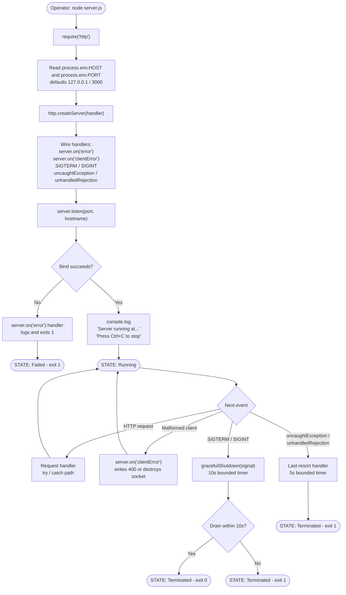
```mermaid
flowchart TD
    Start([Operator: node server.js])
    Start --> ImportHTTP["require('http')"]
    ImportHTTP --> ReadEnv["Read process.env.HOST and process.env.PORT<br/>defaults 127.0.0.1 / 3000"]
    ReadEnv --> Create["http.createServer(handler)"]
    Create --> Wire["Wire handlers:<br/>server.on('error')<br/>server.on('clientError')<br/>SIGTERM / SIGINT<br/>uncaughtException / unhandledRejection"]
    Wire --> Listen["server.listen(port, hostname)"]
    Listen --> BindResult{"Bind succeeds?"}
    BindResult -->|"No"| StartupErr["server.on('error') handler<br/>logs and exits 1"]
    StartupErr --> Failed([STATE: Failed - exit 1])
    BindResult -->|"Yes"| LogReady["console.log<br/>'Server running at...'<br/>'Press Ctrl+C to stop'"]
    LogReady --> Running([STATE: Running])
    Running --> WaitEvent{"Next event"}
    WaitEvent -->|"HTTP request"| Handle["Request handler<br/>try / catch path"]
    Handle --> Running
    WaitEvent -->|"Malformed client"| ClientErr["server.on('clientError')<br/>writes 400 or destroys socket"]
    ClientErr --> Running
    WaitEvent -->|"SIGTERM / SIGINT"| Shutdown["gracefulShutdown(signal)<br/>10s bounded timer"]
    Shutdown --> ShutResult{"Drain within 10s?"}
    ShutResult -->|"Yes"| ExitOK([STATE: Terminated - exit 0])
    ShutResult -->|"No"| ForceShut([STATE: Terminated - exit 1])
    WaitEvent -->|"uncaughtException /<br/>unhandledRejection"| ProcErr["Last-resort handler<br/>5s bounded timer"]
    ProcErr --> ErrExit([STATE: Terminated - exit 1])
```

### 4.1.2 Integration Workflows

#### 4.1.2.1 Data Flow Between Systems

The repository participates in five distinct data flows, all of which are unidirectional or single-shot request-response. Per Section 2.3.2, **Backprop is read-only and never writes back**, **HTTP clients receive a static body with no state being mutated**, and **NPM-family tools only consume the manifest and lockfile**.

| Flow | Source | Sink | Payload | Frequency |
|------|--------|------|---------|-----------|
| Configuration ingestion | OS environment (`HOST`, `PORT`) | `server.js` process memory | Two optional strings | Once at startup |
| HTTP request/response | HTTP Client | `server.js` request handler | Request line + headers (in), 200/400/500 response (out) | Per request, synchronous |
| Signal delivery | OS / Supervisor | Node.js process | `SIGTERM` or `SIGINT` integer | Once per shutdown |
| Package metadata read | `package.json` + `package-lock.json` | NPM 7+ / Yarn / PNPM | JSON manifest + lockfile v3 | On `npm install` / `npm ci` |
| Source artifact read | Repository files | Backprop Tool/Service | Source code of all four core files | On Backprop analysis run |

No data is persisted, queued, transformed, or staged in flight. Per Section 2.4.4 the system has **no request body parsing or query handling**, so no inbound payload data ever enters the response path.

#### 4.1.2.2 API Interactions

The complete set of API contracts the system participates in is enumerated below. All inbound APIs are network-facing; all outbound APIs are local OS or Node.js built-in calls.

| API | Direction | Surface | Contract |
|-----|-----------|---------|----------|
| HTTP/1.1 listener | Inbound | TCP socket on `${HOST}:${PORT}` | Accepts any method on any path; returns 200 + `"Hello, World!\n"` for valid requests |
| `http.createServer` | Outbound (intra-process) | Node.js built-in | Server construction with request listener callback |
| `server.listen` | Outbound | Node.js built-in | Bind to host/port, register `'listening'` event |
| `server.close` | Outbound | Node.js built-in | Stop accepting new connections, drain existing |
| `process.on` | Outbound | Node.js global | Register signal and exception handlers |
| `process.exit` | Outbound | Node.js global | Terminate process with exit code |
| `console.log` / `console.error` | Outbound | Node.js global | Emit lifecycle and error messages to stdout/stderr |

There are **no outbound HTTP calls, no SDK invocations, no service connectors, and no third-party API integrations** (per Section 1.3.2.3). The system is a network sink, not a source.

#### 4.1.2.3 Event Processing Flows

The system processes exactly four event categories via the Node.js event loop. There are no custom `EventEmitter` instances, no message queues, and no internal pub/sub. All events are sourced from Node.js built-in primitives.

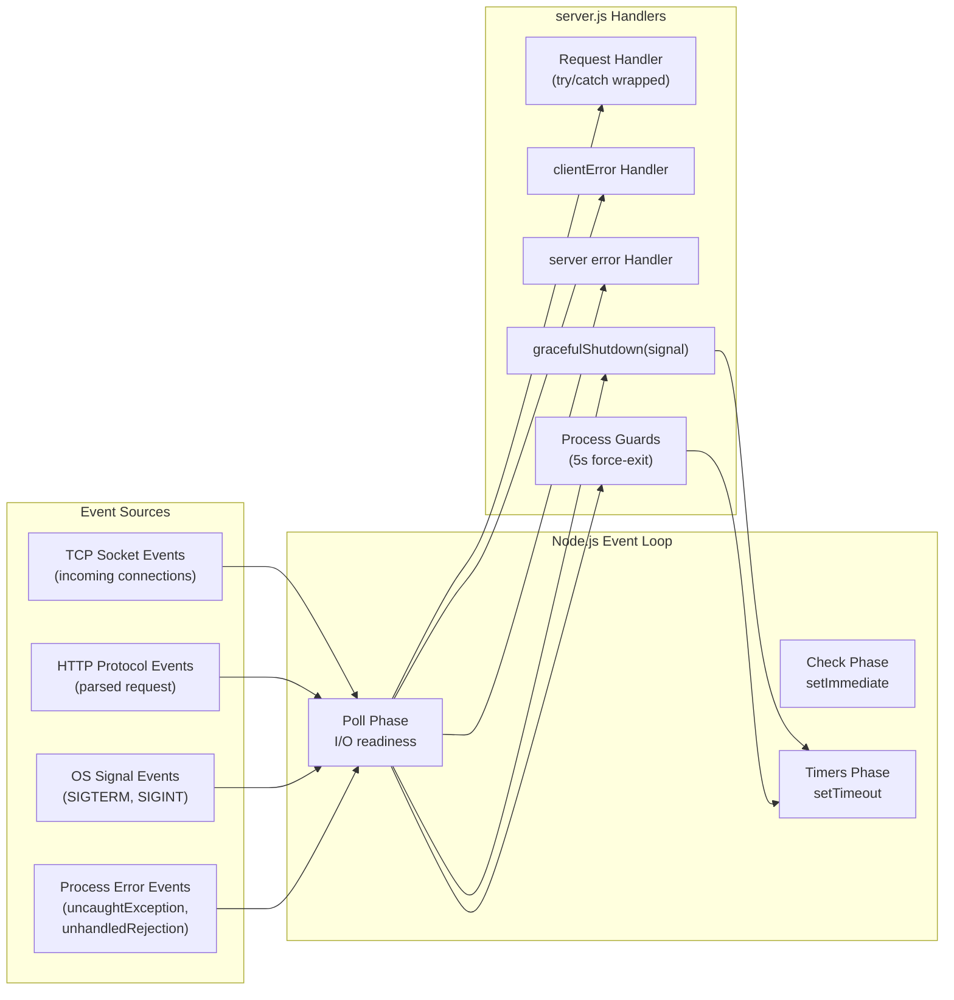
```mermaid
flowchart LR
    subgraph EventSources["Event Sources"]
        TCPSock["TCP Socket Events<br/>(incoming connections)"]
        HTTPProto["HTTP Protocol Events<br/>(parsed request)"]
        OSSigs["OS Signal Events<br/>(SIGTERM, SIGINT)"]
        ProcErrs["Process Error Events<br/>(uncaughtException,<br/>unhandledRejection)"]
    end

    subgraph EventLoop["Node.js Event Loop"]
        Poll["Poll Phase<br/>I/O readiness"]
        Check["Check Phase<br/>setImmediate"]
        Timers["Timers Phase<br/>setTimeout"]
    end

    subgraph Handlers["server.js Handlers"]
        ReqH["Request Handler<br/>(try/catch wrapped)"]
        ClientErrH["clientError Handler"]
        ErrH["server error Handler"]
        SigH["gracefulShutdown(signal)"]
        ProcGuard["Process Guards<br/>(5s force-exit)"]
    end

    TCPSock --> Poll
    HTTPProto --> Poll
    OSSigs --> Poll
    ProcErrs --> Poll

    Poll --> ReqH
    Poll --> ClientErrH
    Poll --> ErrH
    Poll --> SigH
    Poll --> ProcGuard

    SigH --> Timers
    ProcGuard --> Timers
```

#### 4.1.2.4 Batch Processing Sequences

**Status: Not implemented.** There is no batch processing, no scheduled work, no cron-style tasks, no message queue consumers, and no background workers. Per Section 1.3.2.1, "Data transformation pipelines or batch processing" are explicitly out of scope. Every request is handled synchronously within the Node.js event loop, and there is no work that is deferred, queued, or processed in aggregate.

## 4.2 FEATURE PROCESS FLOWS

### 4.2.1 F-001 Server Startup Process Flow

This flow corresponds to F-001-RQ-001 (Configurable Host/Port Binding), F-001-RQ-005 (Server Startup Error Handling), and F-001-RQ-010 (Startup Logging). It is invoked exactly once per process lifetime, when `node server.js` is executed.

#### 4.2.1.1 Startup Sequence Diagram

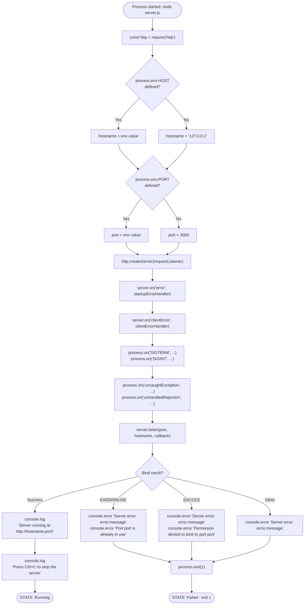
```mermaid
flowchart TD
    Start([Process started: node server.js])
    Start --> Req["const http = require('http')"]
    Req --> ResolveHost{"process.env.HOST<br/>defined?"}
    ResolveHost -->|"Yes"| HostFromEnv["hostname = env value"]
    ResolveHost -->|"No"| HostDefault["hostname = '127.0.0.1'"]
    HostFromEnv --> ResolvePort
    HostDefault --> ResolvePort
    ResolvePort{"process.env.PORT<br/>defined?"}
    ResolvePort -->|"Yes"| PortFromEnv["port = env value"]
    ResolvePort -->|"No"| PortDefault["port = 3000"]
    PortFromEnv --> CreateSrv
    PortDefault --> CreateSrv
    CreateSrv["http.createServer(requestListener)"]
    CreateSrv --> RegErr["server.on('error', startupErrorHandler)"]
    RegErr --> RegClient["server.on('clientError', clientErrorHandler)"]
    RegClient --> RegSig["process.on('SIGTERM', ...)<br/>process.on('SIGINT', ...)"]
    RegSig --> RegGuard["process.on('uncaughtException', ...)<br/>process.on('unhandledRejection', ...)"]
    RegGuard --> Listen["server.listen(port, hostname, callback)"]
    Listen --> BindOK{"Bind result?"}
    BindOK -->|"Success"| LogA["console.log<br/>'Server running at http://hostname:port/'"]
    LogA --> LogB["console.log<br/>'Press Ctrl+C to stop the server'"]
    LogB --> Ready([STATE: Running])
    BindOK -->|"EADDRINUSE"| ErrA["console.error 'Server error: error.message'<br/>console.error 'Port port is already in use'"]
    BindOK -->|"EACCES"| ErrB["console.error 'Server error: error.message'<br/>console.error 'Permission denied to bind to port port'"]
    BindOK -->|"Other"| ErrC["console.error 'Server error: error.message'"]
    ErrA --> Exit
    ErrB --> Exit
    ErrC --> Exit
    Exit["process.exit(1)"]
    Exit --> Failed([STATE: Failed - exit 1])
```

#### 4.2.1.2 Startup Decision Points and Validation Rules

| Decision Point | Source Line(s) | Business Rule | Validation Mechanism |
|----------------|----------------|---------------|----------------------|
| `HOST` env defined? | 5 | Default loopback binding preserves isolation by default; trusted environments may override | JavaScript `\|\|` short-circuit |
| `PORT` env defined? | 6 | Default port `3000` is the documented contract | JavaScript `\|\|` short-circuit |
| `server.listen()` outcome | 140 | Bind must succeed before the process is considered Running | Node.js emits `'listening'` (success) or `'error'` (failure) |
| `error.code` switch | 47–51 | Specific operator-actionable diagnostics for known startup conditions | `switch (error.code)` over `EADDRINUSE`, `EACCES` |

#### 4.2.1.3 SLA and Timing Considerations

No quantitative startup SLA is defined (per Section 2.4.2). The observed startup latency on a developer machine is sub-100 ms (per the Project Guide's performance characteristics, characterized as observed rather than committed). Startup failure paths terminate **immediately** with `process.exit(1)`; there is no bounded timer involved in the startup error path because no asynchronous drain is required.

### 4.2.2 F-001 Request Processing Process Flow

This flow corresponds to F-001-RQ-002 (Static Hello World Response), F-001-RQ-003 (Method/URL Input Validation), and F-001-RQ-004 (Synchronous Error Containment). It is invoked once per inbound HTTP request after the Node.js HTTP parser has produced `req` and `res` objects.

#### 4.2.2.1 Request Handler Flowchart

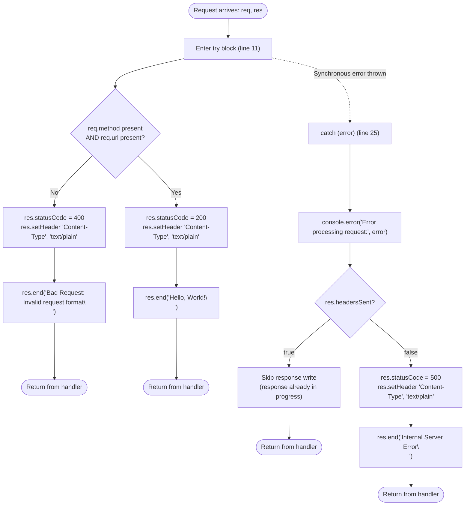
```mermaid
flowchart TD
    Incoming([Request arrives: req, res])
    Incoming --> TryEnter["Enter try block (line 11)"]
    TryEnter --> Validate{"req.method present<br/>AND req.url present?"}
    Validate -->|"No"| Set400["res.statusCode = 400<br/>res.setHeader 'Content-Type', 'text/plain'"]
    Set400 --> End400["res.end('Bad Request: Invalid request format\\n')"]
    End400 --> Return400([Return from handler])
    Validate -->|"Yes"| SetOK["res.statusCode = 200<br/>res.setHeader 'Content-Type', 'text/plain'"]
    SetOK --> EndOK["res.end('Hello, World!\\n')"]
    EndOK --> ReturnOK([Return from handler])
    TryEnter -.->|"Synchronous error thrown"| Catch["catch (error) (line 25)"]
    Catch --> LogErr["console.error('Error processing request:', error)"]
    LogErr --> HeadersGuard{"res.headersSent?"}
    HeadersGuard -->|"true"| Skip["Skip response write<br/>(response already in progress)"]
    Skip --> ReturnSkip([Return from handler])
    HeadersGuard -->|"false"| Set500["res.statusCode = 500<br/>res.setHeader 'Content-Type', 'text/plain'"]
    Set500 --> End500["res.end('Internal Server Error\\n')"]
    End500 --> Return500([Return from handler])
```

#### 4.2.2.2 Decision Points and Validation Rules

| Decision Point | Source Line(s) | Business Rule | Validation Mechanism |
|----------------|----------------|---------------|----------------------|
| Method/URL presence | 14 | Reject malformed requests before they reach the response path (F-001-RQ-003) | Boolean check `!req.method \|\| !req.url` |
| `res.headersSent` guard | 30 | Server process must remain available after a handler exception (F-001-RQ-004) | Native `res.headersSent` property check |
| Exception caught | 25 | Synchronous errors are logged and surfaced as HTTP 500 without crashing the process | JavaScript `try/catch` around entire handler body |

#### 4.2.2.3 Authorization and Compliance Posture

Per Section 2.4.4 and the per-requirement Validation Field tables in Section 2.2:

- **Authorization checkpoints: none.** No authentication primitives exist anywhere in the request path. Every request that satisfies the method+URL presence check receives the static response. Per Section 1.3.2.1, "Authentication or authorization systems" are explicitly excluded.
- **Regulatory compliance checks: none.** Every per-requirement table in Section 2.2 records "Compliance Requirements: None." The repository is a controlled reference implementation, not a regulated system.
- **Data validation: presence-only.** Only the boolean presence of `req.method` and `req.url` is checked. No payload, query string, header, or cookie validation occurs.

#### 4.2.2.4 Error Response Body Reflection Guarantee

Per F-001-RQ-004's validation rule "Error details are logged server-side only, never echoed to clients," the response body for all three outcome statuses is a fixed string literal:

| Status | Body | Source Line |
|--------|------|-------------|
| `200 OK` | `"Hello, World!\n"` | 24 |
| `400 Bad Request` | `"Bad Request: Invalid request format\n"` | 17 |
| `500 Internal Server Error` | `"Internal Server Error\n"` | 35 |

No `Error.message`, `Error.stack`, or runtime value is ever interpolated into the response body. This eliminates information-disclosure paths.

### 4.2.3 F-001 Graceful Shutdown Process Flow

This flow corresponds to F-001-RQ-007 (Graceful Shutdown on Signals). It is invoked once per shutdown attempt, when the process receives `SIGTERM` or `SIGINT`. It races a `server.close()` callback against a 10-second `setTimeout` force-exit timer.

#### 4.2.3.1 Shutdown Flowchart

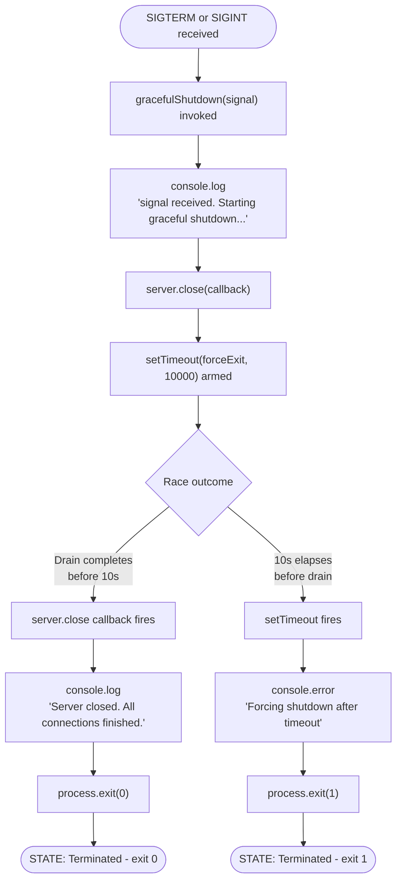
```mermaid
flowchart TD
    SigArrives([SIGTERM or SIGINT received])
    SigArrives --> Invoke["gracefulShutdown(signal) invoked"]
    Invoke --> LogStart["console.log<br/>'signal received. Starting graceful shutdown...'"]
    LogStart --> CloseCall["server.close(callback)"]
    CloseCall --> ArmTimer["setTimeout(forceExit, 10000) armed"]
    ArmTimer --> Race{"Race outcome"}
    Race -->|"Drain completes<br/>before 10s"| CloseCB["server.close callback fires"]
    CloseCB --> LogClosed["console.log<br/>'Server closed. All connections finished.'"]
    LogClosed --> Exit0["process.exit(0)"]
    Exit0 --> Term0([STATE: Terminated - exit 0])
    Race -->|"10s elapses<br/>before drain"| TimerFire["setTimeout fires"]
    TimerFire --> LogForce["console.error<br/>'Forcing shutdown after timeout'"]
    LogForce --> Exit1["process.exit(1)"]
    Exit1 --> Term1([STATE: Terminated - exit 1])
```

#### 4.2.3.2 Timer Race and Bounded-Completion Guarantee

Per Section 2.4.2, the 10-second timer is **not a performance SLA but a bounded-completion guarantee**: it ensures that the process cannot remain in `ShuttingDown` state indefinitely under signal storms, slow clients, or stuck handlers. Two terminal outcomes are possible:

| Outcome | Trigger | Exit Code | Operator Signal |
|---------|---------|-----------|-----------------|
| Clean drain | `server.close()` callback fires within 10 seconds | `0` | Stdout: `"Server closed. All connections finished."` |
| Forced exit | `setTimeout` fires at 10 seconds | `1` | Stderr: `"Forcing shutdown after timeout"` |

This dual outcome design is exactly the lifecycle contract that container runtimes (Docker), orchestrators (Kubernetes), and process supervisors (systemd, PM2) expect — see Section 3.6.4 — even though no orchestration tooling is in scope for this repository.

### 4.2.4 F-002 Package Management Process Flow

This flow corresponds to F-002-RQ-001 (Package Identity), F-002-RQ-002 (Zero-Dependency Footprint), F-002-RQ-003 (Deterministic Lockfile v3), and F-002-RQ-004 (Placeholder Test Script). It is invoked when an operator runs an NPM-family install command or the `test` script.

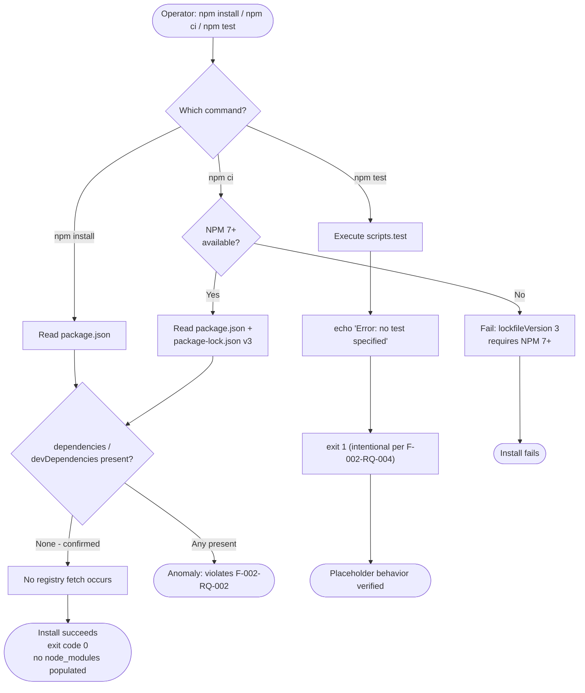
```mermaid
flowchart TD
    Op([Operator: npm install / npm ci / npm test])
    Op --> Which{"Which command?"}
    Which -->|"npm install"| ReadM["Read package.json"]
    Which -->|"npm ci"| CheckTool{"NPM 7+<br/>available?"}
    Which -->|"npm test"| RunTest["Execute scripts.test"]
    CheckTool -->|"No"| FailVer["Fail: lockfileVersion 3<br/>requires NPM 7+"]
    CheckTool -->|"Yes"| ReadLock["Read package.json +<br/>package-lock.json v3"]
    ReadM --> ChkDeps{"dependencies /<br/>devDependencies present?"}
    ReadLock --> ChkDeps
    ChkDeps -->|"None - confirmed"| NoFetch["No registry fetch occurs"]
    ChkDeps -->|"Any present"| Anomaly([Anomaly: violates F-002-RQ-002])
    NoFetch --> InstallOK([Install succeeds<br/>exit code 0<br/>no node_modules populated])
    RunTest --> Echo["echo 'Error: no test specified'"]
    Echo --> ExitTest["exit 1 (intentional per F-002-RQ-004)"]
    ExitTest --> TestDone([Placeholder behavior verified])
    FailVer --> InstallFail([Install fails])
```

The zero-dependency design is **mechanically self-enforcing** through the lockfile (per Section 3.8.4): even if a contributor inadvertently added a dependency declaration, `npm ci` would detect the manifest/lockfile mismatch and refuse to proceed.

### 4.2.5 F-003 Backprop Integration Process Flow

This flow corresponds to F-003-RQ-001 (Repository Identity Documentation), F-003-RQ-002 (Flat Directory Layout), and F-003-RQ-003 (Backprop Integration Compatibility). It is invoked by Backprop on a read-only analysis run.

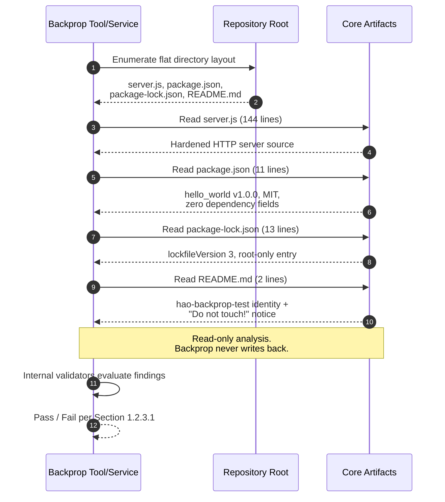
```mermaid
sequenceDiagram
    autonumber
    participant BP as Backprop Tool/Service
    participant Root as Repository Root
    participant Files as Core Artifacts

    BP->>Root: Enumerate flat directory layout
    Root-->>BP: server.js, package.json,<br/>package-lock.json, README.md
    BP->>Files: Read server.js (144 lines)
    Files-->>BP: Hardened HTTP server source
    BP->>Files: Read package.json (11 lines)
    Files-->>BP: hello_world v1.0.0, MIT,<br/>zero dependency fields
    BP->>Files: Read package-lock.json (13 lines)
    Files-->>BP: lockfileVersion 3, root-only entry
    BP->>Files: Read README.md (2 lines)
    Files-->>BP: hao-backprop-test identity +<br/>"Do not touch!" notice
    Note over BP,Files: Read-only analysis.<br/>Backprop never writes back.
    BP->>BP: Internal validators evaluate findings
    BP-->>BP: Pass / Fail per Section 1.2.3.1
```

## 4.3 INTEGRATION SEQUENCE DIAGRAMS

### 4.3.1 Client-Server Request-Response Sequence

The following sequence diagram covers the three response outcomes (200, 400, 500) for a single client request. Swim lanes (participants) represent the HTTP client, the Node.js HTTP parser, and the `server.js` request handler.

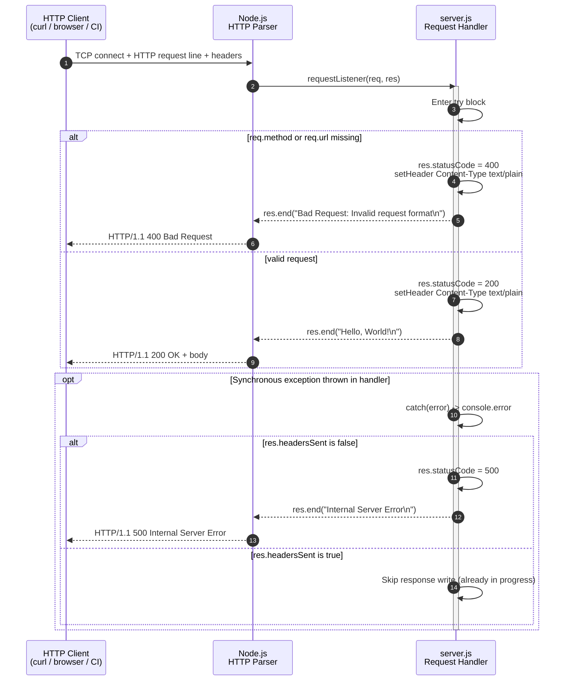
```mermaid
sequenceDiagram
    autonumber
    participant Client as HTTP Client<br/>(curl / browser / CI)
    participant Parser as Node.js<br/>HTTP Parser
    participant Handler as server.js<br/>Request Handler

    Client->>Parser: TCP connect + HTTP request line + headers
    Parser->>Handler: requestListener(req, res)
    activate Handler
    Handler->>Handler: Enter try block

    alt req.method or req.url missing
        Handler->>Handler: res.statusCode = 400<br/>setHeader Content-Type text/plain
        Handler-->>Parser: res.end("Bad Request: Invalid request format\n")
        Parser-->>Client: HTTP/1.1 400 Bad Request
    else valid request
        Handler->>Handler: res.statusCode = 200<br/>setHeader Content-Type text/plain
        Handler-->>Parser: res.end("Hello, World!\n")
        Parser-->>Client: HTTP/1.1 200 OK + body
    end

    opt Synchronous exception thrown in handler
        Handler->>Handler: catch(error) -> console.error
        alt res.headersSent is false
            Handler->>Handler: res.statusCode = 500
            Handler-->>Parser: res.end("Internal Server Error\n")
            Parser-->>Client: HTTP/1.1 500 Internal Server Error
        else res.headersSent is true
            Handler->>Handler: Skip response write (already in progress)
        end
    end
    deactivate Handler
```

### 4.3.2 Process Manager Lifecycle Sequence

This sequence demonstrates the compatibility of the hardened runtime with standard process supervisors. Although no orchestration tooling is in scope per Section 3.6.4, the signal contract is the lifecycle interface that PM2, systemd, and container runtimes rely on.

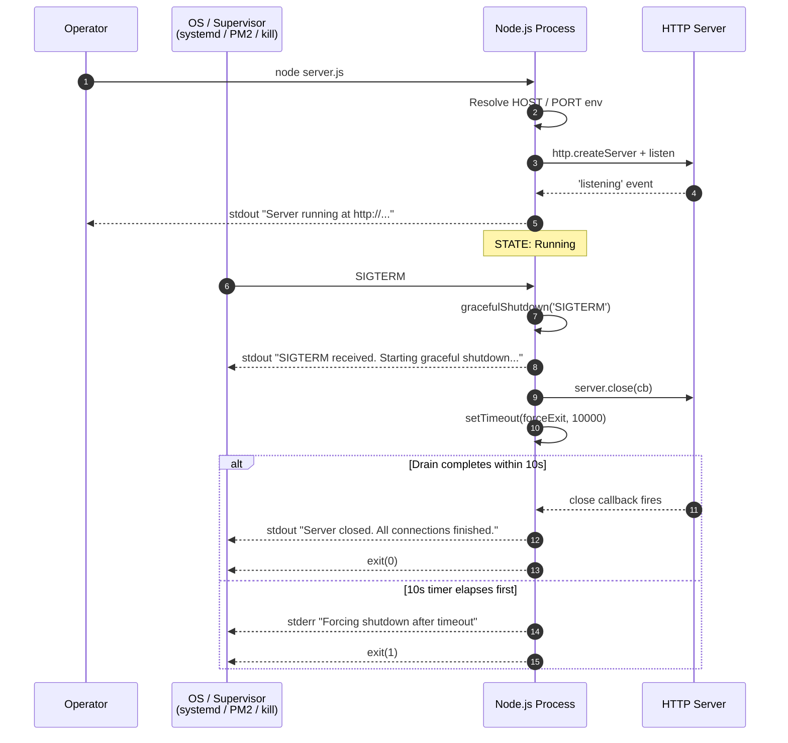
```mermaid
sequenceDiagram
    autonumber
    participant Op as Operator
    participant Sup as OS / Supervisor<br/>(systemd / PM2 / kill)
    participant Node as Node.js Process
    participant Srv as HTTP Server

    Op->>Node: node server.js
    Node->>Node: Resolve HOST / PORT env
    Node->>Srv: http.createServer + listen
    Srv-->>Node: 'listening' event
    Node-->>Op: stdout "Server running at http://..."
    Note over Node: STATE: Running

    Sup->>Node: SIGTERM
    Node->>Node: gracefulShutdown('SIGTERM')
    Node-->>Sup: stdout "SIGTERM received. Starting graceful shutdown..."
    Node->>Srv: server.close(cb)
    Node->>Node: setTimeout(forceExit, 10000)

    alt Drain completes within 10s
        Srv-->>Node: close callback fires
        Node-->>Sup: stdout "Server closed. All connections finished."
        Node-->>Sup: exit(0)
    else 10s timer elapses first
        Node-->>Sup: stderr "Forcing shutdown after timeout"
        Node-->>Sup: exit(1)
    end
```

### 4.3.3 Backprop Analytical Sequence

Backprop is an **inbound analytical consumer only** (per Section 1.2.1.3). The sequence is read-only; Backprop never mutates repository files.

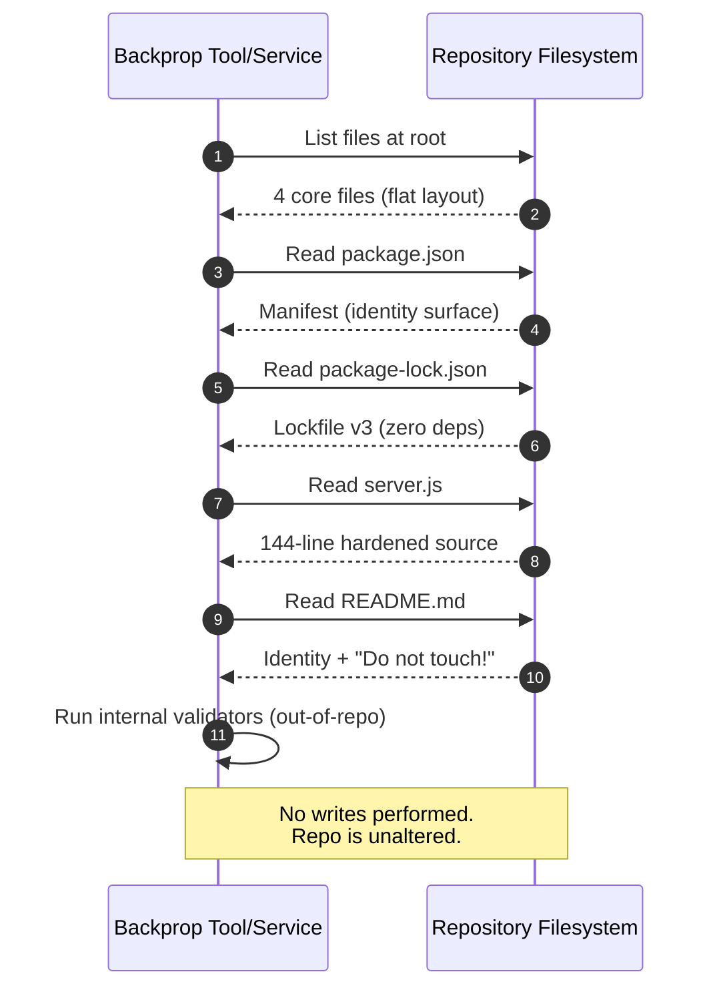
```mermaid
sequenceDiagram
    autonumber
    participant BP as Backprop Tool/Service
    participant Repo as Repository Filesystem

    BP->>Repo: List files at root
    Repo-->>BP: 4 core files (flat layout)
    BP->>Repo: Read package.json
    Repo-->>BP: Manifest (identity surface)
    BP->>Repo: Read package-lock.json
    Repo-->>BP: Lockfile v3 (zero deps)
    BP->>Repo: Read server.js
    Repo-->>BP: 144-line hardened source
    BP->>Repo: Read README.md
    Repo-->>BP: Identity + "Do not touch!"
    BP->>BP: Run internal validators (out-of-repo)
    Note over BP,Repo: No writes performed.<br/>Repo is unaltered.
```

## 4.4 STATE MANAGEMENT

### 4.4.1 Server Lifecycle State Transitions

The Node.js process inhabits eleven discrete states across its lifecycle. The following diagram enumerates every state transition implemented by `server.js`. Bounded timers (10 s / 5 s / 5 s) are annotated on the transitions they gate.

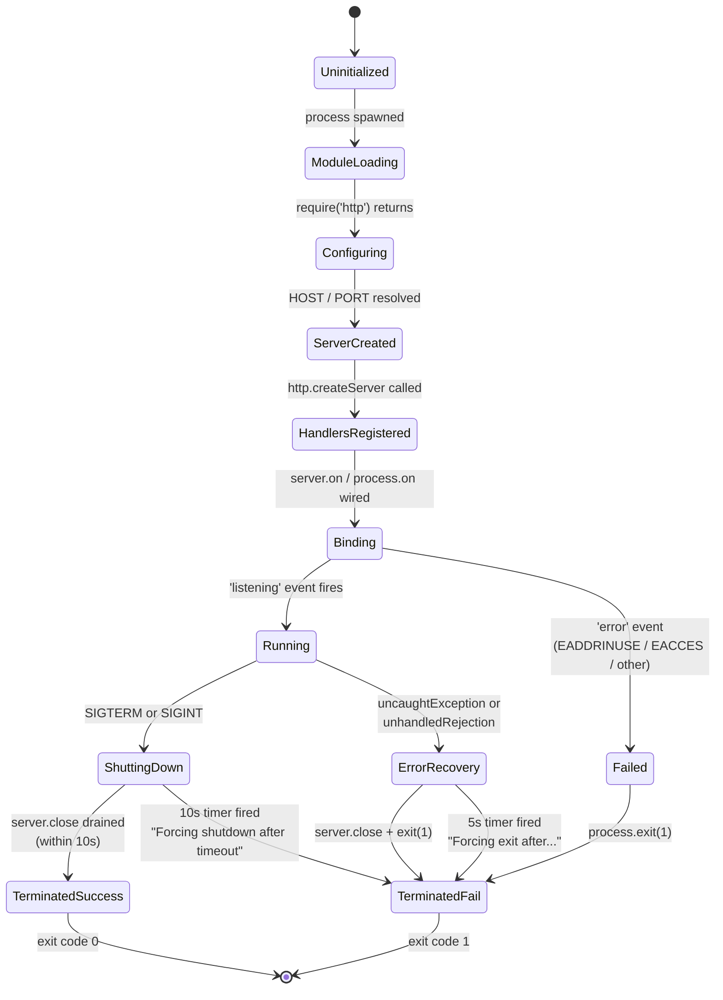
```mermaid
stateDiagram-v2
    [*] --> Uninitialized
    Uninitialized --> ModuleLoading: process spawned
    ModuleLoading --> Configuring: require('http') returns
    Configuring --> ServerCreated: HOST / PORT resolved
    ServerCreated --> HandlersRegistered: http.createServer called
    HandlersRegistered --> Binding: server.on / process.on wired
    Binding --> Running: 'listening' event fires
    Binding --> Failed: 'error' event<br/>(EADDRINUSE / EACCES / other)
    Running --> ShuttingDown: SIGTERM or SIGINT
    Running --> ErrorRecovery: uncaughtException or<br/>unhandledRejection
    ShuttingDown --> TerminatedSuccess: server.close drained<br/>(within 10s)
    ShuttingDown --> TerminatedFail: 10s timer fired<br/>"Forcing shutdown after timeout"
    ErrorRecovery --> TerminatedFail: server.close + exit(1)
    ErrorRecovery --> TerminatedFail: 5s timer fired<br/>"Forcing exit after..."
    Failed --> TerminatedFail: process.exit(1)
    TerminatedSuccess --> [*]: exit code 0
    TerminatedFail --> [*]: exit code 1
```

#### 4.4.1.1 State Inventory

| State | Description | Entry Condition | Exit Condition |
|-------|-------------|-----------------|----------------|
| Uninitialized | Process forked, no JS executed yet | `node server.js` invoked | First top-of-file statement evaluated |
| ModuleLoading | CommonJS module loader resolving `http` | `require('http')` (line 1) | `http` module reference bound |
| Configuring | Environment variable resolution | Read `process.env.HOST` and `process.env.PORT` (lines 5–6) | `hostname` and `port` constants set |
| ServerCreated | Server instance constructed | `http.createServer(handler)` returns | Server object available |
| HandlersRegistered | All error/lifecycle handlers wired | `server.on(...)` and `process.on(...)` calls complete (lines 42–137) | Process ready to `listen()` |
| Binding | Listen call in flight | `server.listen()` invoked (line 140) | `'listening'` or `'error'` event |
| Running | Accepting and handling connections | `'listening'` event fires; startup logs emitted | Signal received or exception thrown |
| ShuttingDown | Graceful drain in progress | `gracefulShutdown(signal)` invoked | `server.close` callback fires or 10s timer fires |
| ErrorRecovery | Last-resort process guard running | `uncaughtException` or `unhandledRejection` event | `server.close` callback fires or 5s timer fires |
| Failed | Startup-phase fatal error | `server.on('error')` invoked during bind | `process.exit(1)` |
| Terminated | Process has exited | `process.exit()` called | Process record reaped by OS |

### 4.4.2 State Persistence Points

#### 4.4.2.1 Zero-Persistence Posture

The system has **no data persistence points whatsoever**. Per Section 1.3.1.2, the Data Domain is defined as "No data persistence; no user data; stateless operation; static content only." Specifically:

- **No file system writes.** `server.js` calls no `fs` module functions.
- **No database operations.** No SQL or NoSQL client is loaded; Section 1.3.2.1 explicitly excludes "Database connections (SQL, NoSQL, in-memory)."
- **No state serialization.** No `JSON.stringify`-then-write pattern exists; no marshaling code is present.
- **No request log files.** Logging is to `stdout`/`stderr` only via `console.log`/`console.error`.
- **All state is volatile.** The only state held by the process is the `http.Server` instance reference in memory; on `process.exit`, this is reclaimed.

#### 4.4.2.2 Caching Requirements

**Status: No caching of any kind.**

- No response cache (every response is generated from a string literal each time).
- No connection pool (no outbound connections are made).
- No in-memory cache (`Map`, `LRU`, `WeakMap`-as-cache, or otherwise).
- No CDN integration (Section 1.3.2.1 explicitly excludes "CDN integration").

This absence is intentional: per Section 3.8.4 a cache layer would expand the analysis surface that Backprop must process and would introduce variability that conflicts with the project's role as a stable, minimal integration target.

#### 4.4.2.3 Transaction Boundaries

**Status: No transactions exist.** There are no database transactions, no distributed transactions, no two-phase commits, no idempotency keys, and no compensating actions. Each HTTP request is a single synchronous unit of work: enter handler → validate → write response → return. Per Section 2.4.4 the system has "no request body parsing or query handling," so no logical transactional unit ever crosses the request boundary.

## 4.5 ERROR HANDLING FLOWCHARTS

### 4.5.1 Error Category Taxonomy

The hardened runtime classifies and handles errors into five distinct categories. Each category has a dedicated handler, a deterministic response, and a defined exit path.

| Category | Detection Mechanism | Handler Location | Terminal Outcome |
|----------|---------------------|------------------|------------------|
| Startup error (bind failure) | `server.on('error', ...)` | Lines 42–54 | `process.exit(1)` |
| Request handler exception (synchronous) | `try/catch` inside handler | Lines 11, 25–37 | HTTP 500 (if `!headersSent`); process continues |
| Request validation failure | Boolean presence check | Lines 14–19 | HTTP 400; process continues |
| Client connection error | `server.on('clientError', ...)` | Lines 58–68 | Raw 400 or `socket.destroy()`; process continues |
| Process-level exception (last resort) | `process.on('uncaughtException', ...)` and `process.on('unhandledRejection', ...)` | Lines 97–137 | `process.exit(1)` after 5s force-exit timer |

### 4.5.2 Server Startup Error Handling

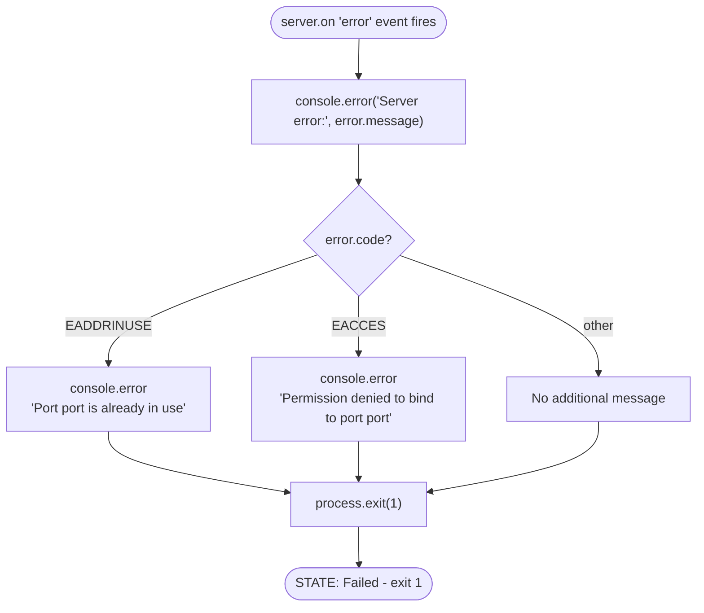
```mermaid
flowchart TD
    BindFail([server.on 'error' event fires])
    BindFail --> LogGeneric["console.error('Server error:', error.message)"]
    LogGeneric --> SwitchCode{"error.code?"}
    SwitchCode -->|"EADDRINUSE"| MsgPort["console.error<br/>'Port port is already in use'"]
    SwitchCode -->|"EACCES"| MsgPerm["console.error<br/>'Permission denied to bind to port port'"]
    SwitchCode -->|"other"| NoExtra["No additional message"]
    MsgPort --> ExitOne
    MsgPerm --> ExitOne
    NoExtra --> ExitOne
    ExitOne["process.exit(1)"]
    ExitOne --> Done([STATE: Failed - exit 1])
```

Per F-001-RQ-005, the security implication is that the `EACCES` message surfaces privileged-port misconfiguration explicitly to the operator, who can then choose between using an unprivileged port or running with elevated privileges.

### 4.5.3 Request-Level Error Handling

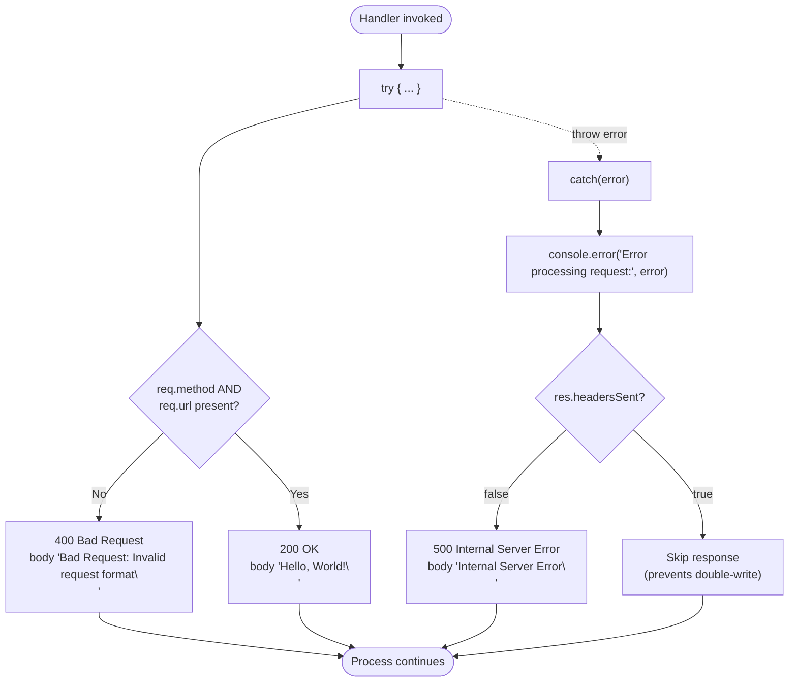
```mermaid
flowchart TD
    HandlerEntry([Handler invoked])
    HandlerEntry --> Try["try { ... }"]
    Try --> CheckInput{"req.method AND<br/>req.url present?"}
    CheckInput -->|"No"| Resp400["400 Bad Request<br/>body 'Bad Request: Invalid request format\\n'"]
    CheckInput -->|"Yes"| Resp200["200 OK<br/>body 'Hello, World!\\n'"]
    Try -.->|"throw error"| CatchBlock["catch(error)"]
    CatchBlock --> LogPrefix["console.error('Error processing request:', error)"]
    LogPrefix --> SentCheck{"res.headersSent?"}
    SentCheck -->|"false"| Resp500["500 Internal Server Error<br/>body 'Internal Server Error\\n'"]
    SentCheck -->|"true"| NoOp["Skip response<br/>(prevents double-write)"]
    Resp400 --> Continue([Process continues])
    Resp200 --> Continue
    Resp500 --> Continue
    NoOp --> Continue
```

The `res.headersSent` guard is critical: without it, calling `res.statusCode = 500` or `res.end(...)` after headers had already been flushed would throw a secondary error, potentially leading to a crash loop.

### 4.5.4 Client Connection Error Handling

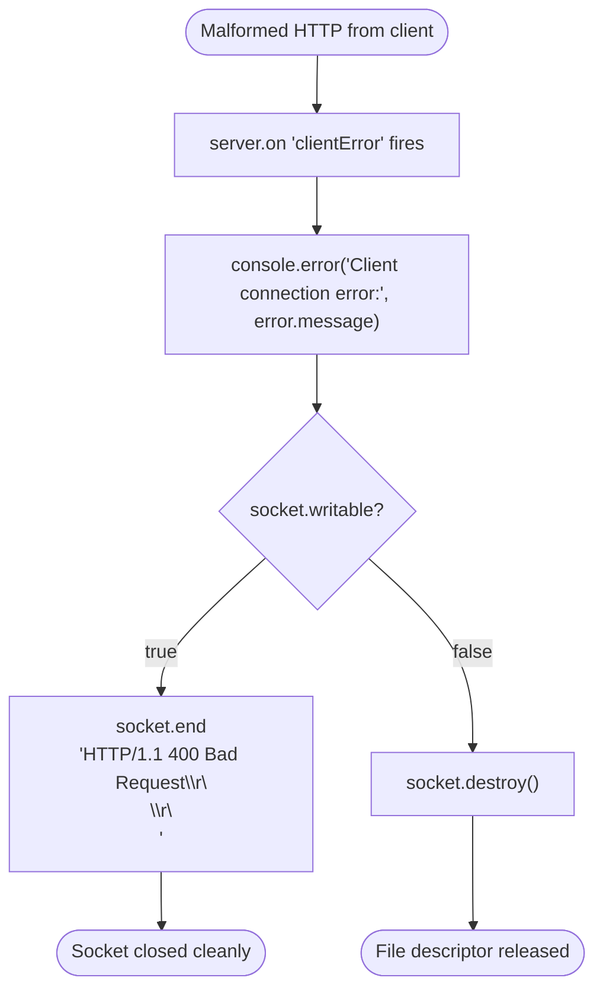
```mermaid
flowchart TD
    CESource([Malformed HTTP from client])
    CESource --> CEEvent["server.on 'clientError' fires"]
    CEEvent --> CELog["console.error('Client connection error:', error.message)"]
    CELog --> WritableQuery{"socket.writable?"}
    WritableQuery -->|"true"| RawWrite["socket.end<br/>'HTTP/1.1 400 Bad Request\\r\\n\\r\\n'"]
    WritableQuery -->|"false"| ForceClose["socket.destroy()"]
    RawWrite --> CleanDone([Socket closed cleanly])
    ForceClose --> ForceDone([File descriptor released])
```

Per F-001-RQ-006's security requirement, this handler prevents resource exhaustion from broken or malicious client connections that send malformed HTTP and never complete their request. The `socket.writable` check before write attempt is what prevents the FD leak.

### 4.5.5 Process-Level Error Recovery

This flow covers both `uncaughtException` and `unhandledRejection`. Both handlers share identical structure: log → `server.close` → 5-second force-exit timer.

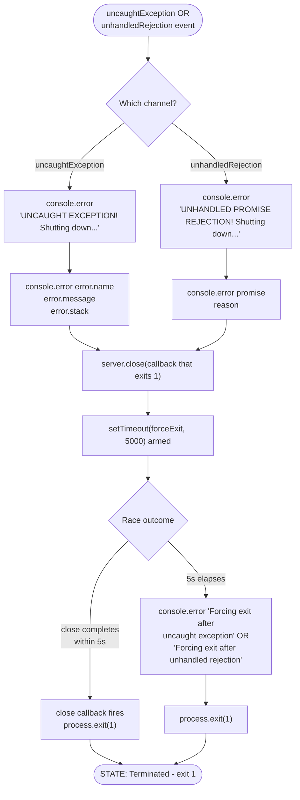
```mermaid
flowchart TD
    Trigger([uncaughtException OR<br/>unhandledRejection event])
    Trigger --> Branch{"Which channel?"}
    Branch -->|"uncaughtException"| UEHeader["console.error<br/>'UNCAUGHT EXCEPTION! Shutting down...'"]
    UEHeader --> UEDetail["console.error error.name<br/>error.message<br/>error.stack"]
    Branch -->|"unhandledRejection"| URHeader["console.error<br/>'UNHANDLED PROMISE REJECTION! Shutting down...'"]
    URHeader --> URDetail["console.error promise<br/>reason"]
    UEDetail --> CallClose["server.close(callback that exits 1)"]
    URDetail --> CallClose
    CallClose --> Arm5["setTimeout(forceExit, 5000) armed"]
    Arm5 --> Race5{"Race outcome"}
    Race5 -->|"close completes<br/>within 5s"| CB1["close callback fires<br/>process.exit(1)"]
    Race5 -->|"5s elapses"| TimerForce["console.error 'Forcing exit after<br/>uncaught exception' OR<br/>'Forcing exit after unhandled rejection'"]
    TimerForce --> Exit1["process.exit(1)"]
    CB1 --> Gone([STATE: Terminated - exit 1])
    Exit1 --> Gone
```

#### 4.5.5.1 Critical Design Decision: Always Exit on Process-Level Errors

Both handlers always exit with code 1; neither attempts in-place recovery. This is because, per F-001-RQ-008's business rule, "Process must terminate within bounded time to enable supervisor restart." The Node.js documentation considers the process state after `uncaughtException` to be unsafe to continue from; attempting in-place recovery risks data corruption or inconsistent state.

### 4.5.6 Retry, Fallback, and Recovery Mechanisms

**Status: No automated retry, fallback, or recovery mechanisms are implemented.** Per Section 2.4.4, the system implements bounded shutdown timers but no:

- Retry logic on failed request handlers
- Fallback response paths beyond the static body
- Error notification systems (no email, no webhook, no PagerDuty integration)
- Circuit breakers
- Self-healing routines
- Exponential backoff
- Dead-letter queues

Recovery is **manual and operator-driven**:

| Failure | Operator Recovery Action |
|---------|--------------------------|
| `EADDRINUSE` at startup | Stop other process on port, or set `PORT=<different>`, then `node server.js` |
| `EACCES` at startup | Use unprivileged port (≥1024) or run with elevated privileges |
| `uncaughtException` exit | Inspect stderr stack trace, fix root cause, restart with `node server.js` |
| `unhandledRejection` exit | Inspect stderr rejection reason, fix root cause, restart with `node server.js` |
| Graceful shutdown timeout (exit 1) | Investigate long-running connections; restart with `node server.js` |

The bounded-timer design is the **enabling primitive** for external supervisor-based recovery (e.g., systemd `Restart=on-failure`, PM2 auto-restart) even though such supervisors are not part of this repository.

## 4.6 VALIDATION RULES AND DECISION POINTS

### 4.6.1 Per-Requirement Validation Rules Summary

The complete set of validation rules enforced across all process flows, derived directly from the per-requirement Validation Field tables in Section 2.2:

| Flow Stage | Rule | Source Requirement |
|------------|------|---------------------|
| Startup: host resolution | Default loopback (`127.0.0.1`) binding preserves isolation by default | F-001-RQ-001 |
| Startup: bind attempt | Specific operator-actionable diagnostics for known startup conditions (`EADDRINUSE`, `EACCES`) | F-001-RQ-005 |
| Request: input check | Reject malformed requests before they reach the response path (`!req.method \|\| !req.url`) | F-001-RQ-003 |
| Request: response write | Response is identical for every accepted request (deterministic) | F-001-RQ-002 |
| Request: error handling | `res.headersSent` guard prevents double-write to the response | F-001-RQ-004 |
| Request: error log | Error details are logged server-side only, never echoed to clients | F-001-RQ-004 |
| Connection: socket cleanup | `socket.writable` check before write attempt prevents file-descriptor leaks | F-001-RQ-006 |
| Shutdown: drain | In-flight requests should complete before termination when possible | F-001-RQ-007 |
| Shutdown: bound | Bounded shutdown prevents indefinite hangs in orchestrated environments | F-001-RQ-007 |
| Process guard: bounded exit | Process must terminate within bounded time to enable supervisor restart | F-001-RQ-008, F-001-RQ-009 |
| Package manifest | Identity fields remain frozen per "Do not touch!" mandate | F-002-RQ-001 |
| Package lockfile | `lockfileVersion` numeric equal to 3 | F-002-RQ-003 |
| Repository layout | Surface area available to Backprop must remain minimal and predictable | F-003-RQ-002 |

### 4.6.2 Authorization Checkpoints

**Status: None.** This is a deliberate scope decision documented in Section 1.3.2.1 ("Authentication or authorization systems") and Section 2.4.4 ("No authentication or authorization | No sessions, cookies, or identity primitives exist"). Every request that passes the presence check on `req.method` and `req.url` is accepted; no role, scope, or permission gate exists anywhere in the flow.

### 4.6.3 Regulatory Compliance Checks

**Status: None.** Every per-requirement table in Section 2.2 records `Compliance Requirements: None`. The repository is positioned as a controlled reference implementation (Section 1.2.1.1) and is not in scope for GDPR, HIPAA, PCI-DSS, SOX, or any other regulated data domain. The single compliance posture documented is the **package manager conformance** of `package.json` to the NPM manifest schema (F-002-RQ-001) and the lockfile conformance to NPM 7+ (F-002-RQ-003) — neither of which is a regulatory check.

## 4.7 TIMING AND SLA CONSIDERATIONS

### 4.7.1 SLA Posture

Per Section 1.2.3.3 and Section 2.4.2, **no quantitative KPIs, SLAs, or performance thresholds (throughput, latency, availability) are defined within the repository.** Performance is evaluated through binary functional outcomes only: does the server start, does it respond, does the package install succeed, does Backprop pass. Any timing values referenced below are **bounded-completion guarantees**, not SLAs.

### 4.7.2 Bounded-Completion Timers

Three explicit `setTimeout` timers govern the lifecycle to prevent indefinite hangs. They are *not* SLAs — they are upper bounds beyond which the process must self-terminate.

| Timer | Source Line | Bound | Purpose | On Expiry |
|-------|-------------|-------|---------|-----------|
| Graceful shutdown drain | 87 | 10,000 ms | Bound the wait for `server.close()` to complete | `console.error("Forcing shutdown after timeout")` + `process.exit(1)` |
| Uncaught exception cleanup | 114 | 5,000 ms | Bound the wait after `server.close()` in the `uncaughtException` handler | `console.error("Forcing exit after uncaught exception")` + `process.exit(1)` |
| Unhandled rejection cleanup | 133 | 5,000 ms | Bound the wait after `server.close()` in the `unhandledRejection` handler | `console.error("Forcing exit after unhandled rejection")` + `process.exit(1)` |

### 4.7.3 Observed Performance Characteristics

The Project Guide records the following **observed** characteristics on a typical developer machine. These are descriptive measurements, not committed SLAs.

| Metric | Observation |
|--------|-------------|
| Startup time | < 100 ms from `node server.js` to `'Server running at...'` log |
| Response latency | < 5 ms average for valid `200 OK` path |
| Memory footprint | ~30 MB resident set size |
| Idle CPU usage | < 1% |

### 4.7.4 Critical Path Analysis

Three critical paths exist in the system. Each is short by design and contains only the minimum steps needed for correctness.

| Critical Path | Steps | Maximum Bounded Duration |
|---------------|-------|--------------------------|
| Cold start to Ready | `require('http')` → env resolution → `createServer` → handler registration → `listen` → `'listening'` event → startup log | No defined SLA; observed < 100 ms |
| Request to Response (happy path) | Handler entry → validate presence → set status/header → `res.end` | No defined SLA; observed < 5 ms |
| Signal to clean exit | Signal received → `gracefulShutdown` → `server.close` → drain → `exit(0)` | ≤ 10 seconds (force-exit otherwise) |

## 4.8 PROCESS BOUNDARIES AND ACTOR INVENTORY

The system's process flows involve seven distinct actors. Each is bounded by a clear interaction contract.

| Actor | Role | Interaction Type | Reference |
|-------|------|------------------|-----------|
| Operator / Developer | Executes `node server.js`, sets env vars, invokes `npm` commands | Inbound (process launch, env injection) | Section 3.6.8 |
| HTTP Client (curl / browser / CI) | Sends HTTP requests | Inbound network | Section 2.3.2 |
| Node.js Runtime | Hosts the process, provides event loop, `http` module, `process` global | Hosting | Section 3.8.2 |
| `server.js` Process | The hardened HTTP server itself; owns all handlers and timers | Self | Section 3.8.2 |
| OS / Supervisor (kill, systemd, PM2) | Delivers `SIGTERM` / `SIGINT`; consumes exit codes | Inbound events; outbound exit codes | Section 3.6.4 |
| NPM 7+ / Yarn / PNPM | Reads manifest and lockfile, executes scripts | Tool consumption | Section 3.6.7 |
| Backprop Tool/Service | Read-only analysis of all four core files | Inbound analytical | Section 1.2.1.3 |

No outbound integrations exist: per Section 1.3.2.3 there are no outbound HTTP clients, no SDKs, and no service connectors of any kind.

## 4.9 REFERENCES

### 4.9.1 Repository Files Examined

- `server.js` — Hardened HTTP server implementation (144 lines); source of every workflow step, decision point, log message, exit code, and bounded timer documented in this section. Specific line ranges referenced: 1 (`require('http')`), 5–6 (env resolution), 10–38 (request handler with try/catch), 14–19 (input validation), 22–24 (success response), 25–37 (catch block with headers guard), 42–54 (`server.on('error')` startup handler), 58–68 (`server.on('clientError')` connection handler), 72–88 (`gracefulShutdown()` with 10s timer), 92–93 (SIGTERM/SIGINT registration), 97–115 (`uncaughtException` handler with 5s timer), 119–137 (`unhandledRejection` handler with 5s timer), 140–143 (`server.listen()` and startup logs).
- `package.json` — NPM manifest (11 lines); source of F-002 process flow including identity declaration, zero-dependency posture, and placeholder `test` script behavior.
- `package-lock.json` — NPM lockfile in version 3 format (13 lines); source of zero-dependency mechanical enforcement and NPM 7+ minimum-version requirement governing the F-002 install flow.
- `README.md` — Repository documentation (2 lines); source of project identity and "Do not touch!" preservation policy that frames F-003 integration flow.

### 4.9.2 Repository Folders Inspected

- `existing-projects-qa-test/` (project root) — Confirmed flat directory layout used as input to the F-003 Backprop analytical sequence.
- `existing-projects-qa-test/blitzy/documentation/` — Holds `Technical Specifications.md` (this document) and `Project Guide.md` referenced for observed performance characteristics and hardening completion status.

### 4.9.3 Technical Specification Sections Cross-Referenced

- **Section 1.2 SYSTEM OVERVIEW** — Project context, dual-posture system state (Preserved Identity Surface vs. Hardened Runtime Surface), integration with enterprise landscape, primary system capabilities, KPI absence statement.
- **Section 1.3 SCOPE** — In-scope user workflows, implementation boundaries (network, port, protocol, process model, data domain), comprehensive out-of-scope enumeration that grounds the absence statements throughout this section.
- **Section 2.1 FEATURE CATALOG** — F-001, F-002, F-003 feature definitions.
- **Section 2.2 FUNCTIONAL REQUIREMENTS TABLE** — Authoritative source of all 10 F-001 requirements (RQ-001 through RQ-010), 4 F-002 requirements, and 3 F-003 requirements with acceptance criteria, source line references, and per-requirement validation field tables. This is the primary requirement source for every decision point documented in this Process Flowchart section.
- **Section 2.3 FEATURE RELATIONSHIPS** — Integration points table, shared concerns (logging, env resolution, bounded timers, server close routine), feature dependency map.
- **Section 2.4 IMPLEMENTATION CONSIDERATIONS** — Technical constraints, performance requirements (bounded-completion timers explicitly stated as not SLAs), security implications matrix, maintenance posture.
- **Section 3.6 DEVELOPMENT & DEPLOYMENT** — Deployment strategy (manual local execution), runtime lifecycle features enabling process management, NPM 7+ requirement.
- **Section 3.8 TECHNOLOGY STACK ARCHITECTURE** — Component integration requirements table, security implications of technology choices, present/absent stack distinction.

# 5. System Architecture

## 5.1 HIGH-LEVEL ARCHITECTURE

### 5.1.1 System Overview

The `hao-backprop-test` repository (NPM package `hello_world` v1.0.0) implements a **deliberately minimal, hardened Node.js HTTP server** that serves as a controlled reference implementation and stable analytical target for the Backprop Tool/Service. Its architectural style is best characterized not by what it contains but by what it deliberately omits: there is no web framework, no database, no authentication layer, no observability stack, no container, and no CI/CD pipeline. The system is a **minimum viable test scaffold** whose austerity is the central design choice and is mechanically self-enforcing through a zero-dependency lockfile.

#### 5.1.1.1 Architectural Style and Rationale

The system follows a **single-file, monolithic, stateless, single-threaded** architecture executed directly by the Node.js runtime without transpilation or build steps. Every line of executable application code lives in a single 144-line file (`server.js`) that imports exactly one module — Node.js's built-in `http` module — and exposes a single HTTP listener. This style was chosen because every potential expansion of the stack (a framework, a database, a logger, a test runner, a container, a CI pipeline) would either invalidate the zero-dependency constraint that gives the project its identity or expand the analysis surface that Backprop must process.

The architecture rests on six foundational choices documented in the technology stack rationale: one language (JavaScript, CommonJS), one runtime (Node.js with the `http` built-in), zero external dependencies, one external integration (Backprop, inbound-analytical only), no persistence of any kind, and no build pipeline. These choices are not incidental — they collectively define the project's contract with its primary integration consumer.

#### 5.1.1.2 Key Architectural Principles and Patterns

- **Zero-Dependency Mandate.** No third-party packages may be added; both `package.json` and `package-lock.json` mechanically confirm this constraint at the schema level.
- **Preservation Pattern (Identity Surface).** The package-identity files (`package.json`, `package-lock.json`, `README.md`) are governed by a "Do not touch!" notice that constrains what may change while leaving the runtime surface (`server.js`) free to be hardened.
- **Hardened Runtime Surface.** The single runtime file implements production-grade error handling, signal-based graceful shutdown, process-level last-resort guards, and bounded-completion timers, without violating the zero-dependency contract.
- **12-Factor Configuration.** All deployment-time configuration is sourced from environment variables (`HOST`, `PORT`) with safe defaults; no configuration files exist.
- **Secure-by-Default Binding.** The default listener binds to the loopback interface (`127.0.0.1`), so the server is unreachable from external networks unless the operator explicitly overrides `HOST`.
- **Bounded Completion Guarantees.** Three explicit `setTimeout` upper-bound timers (10 s / 5 s / 5 s) prevent indefinite hangs on shutdown, uncaught-exception cleanup, and unhandled-rejection cleanup, enabling external supervisor-based recovery.
- **Static, Non-Interpolated Responses.** Response bodies are fixed string literals; no runtime value, error message, or stack trace is ever reflected back to clients, eliminating information-disclosure paths.

#### 5.1.1.3 System Boundaries and Major Interfaces

| Boundary Dimension | In-Scope Definition |
|--------------------|---------------------|
| Network Scope | Loopback (`127.0.0.1`) by default; `HOST=0.0.0.0` override permitted |
| Port Scope | Port `3000` by default; `PORT` environment variable override permitted |
| Protocol Scope | HTTP/1.1 only; no HTTPS/TLS |
| Process Model | Single Node.js process; single-threaded event loop; no clustering |

The system exposes exactly one inbound network interface (the TCP listener) and one inbound signal interface (`SIGTERM` / `SIGINT` from the operating system or process supervisor). It exposes one inbound analytical interface to the Backprop Tool/Service, which performs read-only file system access on the four core artifacts. It initiates **no outbound network traffic of any kind**: no outbound HTTP clients, no SDKs, no service connectors, no telemetry export.

### 5.1.2 Core Components

The system is composed of four application artifacts and one documentation subtree. Together they form the complete bounded surface that operators run, NPM tools consume, and Backprop analyzes.

| Component Name | Primary Responsibility | Key Dependencies |
|----------------|------------------------|------------------|
| `server.js` (Hardened Runtime) | HTTP request handling, error containment, graceful shutdown, process-level guards | Node.js runtime; built-in `http` module; `process` global |
| `package.json` (Identity Manifest) | NPM package identity (`hello_world` v1.0.0, MIT, author); placeholder `test` script | NPM 7+ tooling for consumption |
| `package-lock.json` (Lockfile v3) | Mechanical zero-dependency proof; enforces NPM 7+ minimum-version requirement | NPM 7+ lockfile schema |
| `README.md` (Preservation Policy) | Project identity statement; "Do not touch!" social contract for the identity surface | None |

| Component Name | Integration Points | Critical Considerations |
|----------------|--------------------|--------------------------|
| `server.js` (Hardened Runtime) | Inbound: HTTP clients, OS signals, env vars. Outbound (intra-process): `http`, `process`, `console` | Single point of all executable logic; must not import third-party packages |
| `package.json` (Identity Manifest) | Read by NPM/Yarn/PNPM during `npm install` / `npm ci`; read by Backprop | `main` field references non-existent `index.js` — intentional anomaly preserved per F-002 |
| `package-lock.json` (Lockfile v3) | Read by NPM 7+ during installation; read by Backprop | `lockfileVersion: 3` mechanically rejects pre-NPM-7 tooling |
| `README.md` (Preservation Policy) | Read by humans and by Backprop | "Do not touch!" applies to identity-surface files, not to `server.js` |

### 5.1.3 Data Flow Description

The system supports five distinct, well-bounded data flows. No data is persisted, queued, transformed, or staged in flight; every flow is either unidirectional or single-shot request-response.

#### 5.1.3.1 Primary Data Flows

**Configuration Ingestion.** At process startup, the runtime reads two optional environment variables — `HOST` and `PORT` — from the OS environment via `process.env`. The values are bound to module-level constants (`hostname` and `port`), with fallbacks of `127.0.0.1` and `3000` respectively. This flow occurs exactly once per process lifetime and is the only path by which deployment-time configuration enters the process.

**HTTP Request/Response.** When an HTTP client opens a TCP connection and transmits a request line and headers, the Node.js HTTP parser invokes the registered request listener in `server.js`. The handler performs a single boolean presence check on `req.method` and `req.url`. Valid requests receive a `200 OK` response with the body `"Hello, World!\n"`; requests failing the presence check receive a `400 Bad Request` with the body `"Bad Request: Invalid request format\n"`; synchronous exceptions in the handler are caught and converted to a `500 Internal Server Error` with the body `"Internal Server Error\n"`, provided headers have not yet been sent. Notably, no request body is parsed, no query string is interpreted, and no inbound payload data ever enters the response path. Response bodies are fixed string literals, eliminating interpolation-based injection or information-disclosure vectors.

**Signal Delivery.** The operating system or process supervisor (e.g., systemd, PM2, `kill`) may deliver a `SIGTERM` or `SIGINT` signal to the Node.js process. The signal handlers invoke a shared `gracefulShutdown(signal)` function which calls `server.close()` to stop accepting new connections, drains existing connections, and exits the process with code `0` on success. A 10-second force-exit timer bounds this drain phase; on timer expiry, the process logs a forced-shutdown message and exits with code `1`.

**Package Metadata Read.** NPM 7+ (or compatible package managers such as Yarn and PNPM) read `package.json` and `package-lock.json` on `npm install` or `npm ci`. The manifest declares package identity and an empty dependency surface; the lockfile mechanically confirms that no transitive packages may be installed.

**Source Artifact Read.** The Backprop Tool/Service reads the source of all four core files as analytical input. This is a read-only flow: Backprop never writes back, never invokes APIs in the running process, and never injects code or configuration.

#### 5.1.3.2 Integration Patterns and Protocols

The system uses three integration patterns, all minimal:

- **Synchronous request-response (HTTP/1.1).** All inbound network communication is synchronous HTTP/1.1; no WebSocket, SSE, gRPC, or other streaming protocol is used.
- **Event-driven intra-process.** The Node.js event loop processes TCP socket events, HTTP parser events, OS signal events, and `process`-level error events. No custom EventEmitter, message queue, or pub/sub mechanism is used.
- **Signal-based lifecycle.** Process lifecycle is controlled by POSIX-style signals, which is the de facto contract that systemd, PM2, and container runtimes rely on.

#### 5.1.3.3 Data Transformation Points and Stores

There are **no data transformation points**: no parsing of request bodies, no query string decoding, no template rendering, no serialization, no encoding conversions beyond the implicit UTF-8 of fixed string literals.

There are **no data stores or caches**: no response cache, no in-memory cache (`Map`, `LRU`, `WeakMap`), no connection pool (no outbound connections are ever made), no CDN, no file system writes, and no database. The only state held by the process is the `http.Server` instance reference in memory, which is reclaimed when the process exits.

### 5.1.4 External Integration Points

The system interacts with seven distinct actors. Only one — Backprop — is an external service in the conventional sense; the others are runtime hosts, operators, clients, or supervisors.

| System Name | Integration Type | Data Exchange Pattern |
|-------------|------------------|------------------------|
| HTTP Client (curl / browser / CI) | Inbound network | Synchronous HTTP/1.1 request → fixed-body response |
| Operator / Developer | Inbound (process launch) | Shell invocation `node server.js`; environment variable injection; `npm` commands |
| OS / Supervisor (kill / systemd / PM2) | Inbound signals; outbound exit codes | `SIGTERM`/`SIGINT` in; exit code `0` or `1` out |
| Node.js Runtime | Hosting | Hosts process; provides event loop, `http` module, `process` global |
| NPM 7+ / Yarn / PNPM | Tool consumption | Reads `package.json` and `package-lock.json`; executes scripts |
| Backprop Tool/Service | Inbound analytical (read-only) | File system reads of the four core artifacts; no writes |
| Git / GitHub | Source control | Repository hosting; out-of-band of the running process |

| System Name | Protocol / Format | SLA Requirements |
|-------------|--------------------|-------------------|
| HTTP Client | HTTP/1.1 over TCP; `text/plain` UTF-8 body | None defined; observed response latency < 5 ms for happy path |
| Operator / Developer | POSIX shell; environment variables (strings) | None |
| OS / Supervisor | POSIX signals; integer exit codes | Bounded-completion: graceful drain ≤ 10 s, then forced exit |
| Node.js Runtime | CommonJS module loader; V8 + libuv | Node.js v14+ (tested with v20.19.5 LTS) |
| NPM 7+ / Yarn / PNPM | NPM lockfile schema v3 | NPM ≥ 7 required; pre-NPM-7 tooling mechanically rejected |
| Backprop Tool/Service | File system read; out-of-repository analysis | None on the repository side; no authentication required |
| Git / GitHub | Git protocol | Out of scope |

**Critical fact: no outbound integrations exist.** The repository imports no Backprop client code, defines no `.backprop.config`, makes no runtime API calls to Backprop, initiates no network egress, and requires no authentication credentials.

---

## 5.2 COMPONENT DETAILS

### 5.2.1 `server.js` — Hardened HTTP Server Runtime

**Purpose and Responsibilities.** `server.js` is the sole executable artifact of the system. It owns the entire runtime surface: module import, configuration resolution, server creation, request handling, all five categories of error handling, signal-based graceful shutdown, process-level last-resort guards, and startup logging. The file is organized into nine logical sub-components grouped by lifecycle role.

| Sub-Component | Source Lines | Purpose |
|---------------|--------------|---------|
| Module imports | 1 | `require('http')` only |
| Environment resolution | 5–6 | Resolve `HOST` and `PORT` with `127.0.0.1` / `3000` defaults |
| Request handler (try/catch wrapped) | 10–38 | Validate `req.method`/`req.url`; emit 200/400/500 |
| Server error handler | 42–54 | Log `EADDRINUSE`/`EACCES`/other; `process.exit(1)` |
| Client error handler | 58–68 | Send raw `400 Bad Request` or `socket.destroy()` |
| `gracefulShutdown(signal)` | 72–88 | `server.close()` plus 10 s force-exit timer |
| Signal handlers | 92–93 | `SIGTERM` / `SIGINT` → `gracefulShutdown()` |
| `uncaughtException` handler | 97–115 | Log → `server.close()` → 5 s force-exit timer |
| `unhandledRejection` handler | 119–137 | Log → `server.close()` → 5 s force-exit timer |
| Server startup | 140–143 | `server.listen()` and startup log messages |

**Technologies and Frameworks Used.** JavaScript (ES2015+, CommonJS); Node.js runtime (v14+, tested with v20.19.5 LTS); built-in `http` module (no `https`); built-in `process` global API (env vars, signals, exception channels, exit codes); native `console.log` / `console.error` for stdout/stderr output. No third-party libraries.

**Key Interfaces and APIs.**

| API | Direction | Surface | Contract |
|-----|-----------|---------|----------|
| HTTP/1.1 listener | Inbound | TCP socket on `${HOST}:${PORT}` | Accepts any method on any path; returns 200 / 400 / 500 |
| `http.createServer` | Outbound (intra-process) | Node.js built-in | Server construction with request listener callback |
| `server.listen` / `server.close` | Outbound (intra-process) | Node.js built-in | Bind to host/port; stop accepting / drain |
| `process.on` | Outbound (intra-process) | Node.js global | Register signal and exception handlers |
| `process.exit` | Outbound (intra-process) | Node.js global | Terminate process with exit code |
| `console.log` / `console.error` | Outbound | Node.js global | Emit lifecycle and error messages to stdout / stderr |

**Data Persistence Requirements.** None. `server.js` calls no `fs` module functions, performs no database operations, holds no serialized state. The only volatile state is the `http.Server` instance reference, reclaimed on process exit.

**Scaling Considerations.** Single Node.js process on a single-threaded event loop. No load balancing, no `cluster` module, no worker threads, no shared state requiring coordination. Horizontal or vertical scaling is explicitly out of scope; the deployment model is local developer execution and CI invocation only.

### 5.2.2 `package.json` — NPM Identity Manifest

**Purpose and Responsibilities.** Declares package identity (`hello_world` v1.0.0), MIT license, author (`hxu`), description (`"Hello world in Node.js"`), and a placeholder `test` script that echoes an error and exits with code `1`. The manifest deliberately contains no `dependencies`, `devDependencies`, `peerDependencies`, `optionalDependencies`, or `bundledDependencies` fields, providing the first mechanical layer of the zero-dependency guarantee. The `main` field references the non-existent `index.js`; this anomaly is preserved as part of the project's identity per F-002.

**Technologies.** JSON; NPM manifest schema. No `engines` field is declared.

**Key Interfaces.** Read by NPM 7+, Yarn, and PNPM during `npm install` / `npm ci`. Read by Backprop during analysis.

**Persistence and Scaling.** Not applicable — a static manifest file.

### 5.2.3 `package-lock.json` — Dependency Lockfile

**Purpose and Responsibilities.** Provides the second, mechanical layer of the zero-dependency guarantee through `lockfileVersion: 3` and an empty `packages` object containing only the root entry. Because `lockfileVersion: 3` is a schema introduced in NPM 7, the lockfile simultaneously enforces the NPM 7+ minimum-version requirement: pre-NPM-7 tooling cannot consume it.

**Technologies.** JSON; NPM lockfile schema v3.

**Key Interfaces.** Read by NPM 7+ during installation. Read by Backprop during analysis. Both layers (manifest + lockfile) mechanically forbid the introduction of any transitive dependency.

**Persistence and Scaling.** Not applicable — a static lockfile.

### 5.2.4 `README.md` — Preservation Policy Document

**Purpose and Responsibilities.** Two-line repository document declaring the project name (`hao-backprop-test`), its purpose ("test project for backprop integration"), and the social contract that governs the identity surface ("Do not touch!"). The notice is binding on `package.json`, `package-lock.json`, and `README.md` itself, but does not constrain the runtime surface (`server.js`).

**Technologies.** Markdown.

**Key Interfaces.** Read by humans (operators, contributors) and by Backprop.

**Persistence and Scaling.** Not applicable — a static document.

### 5.2.5 Component Interaction Diagram

The following diagram shows how the four core artifacts relate to the runtime, the operating system, and the external actors. Solid arrows denote runtime invocation; dashed arrows denote read-only tool consumption.

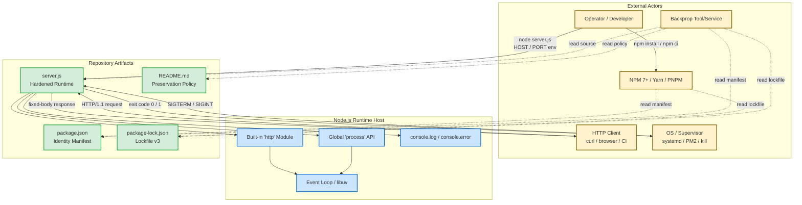
```mermaid
flowchart TB
    subgraph ExternalActors["External Actors"]
        Operator[Operator / Developer]
        Client[HTTP Client<br/>curl / browser / CI]
        Supervisor[OS / Supervisor<br/>systemd / PM2 / kill]
        NPM[NPM 7+ / Yarn / PNPM]
        Backprop[Backprop Tool/Service]
    end

    subgraph RuntimeHost["Node.js Runtime Host"]
        EventLoop[Event Loop / libuv]
        HTTPMod[Built-in 'http' Module]
        ProcAPI[Global 'process' API]
        Console[console.log / console.error]
    end

    subgraph RepoArtifacts["Repository Artifacts"]
        ServerJS[server.js<br/>Hardened Runtime]
        PkgJSON[package.json<br/>Identity Manifest]
        PkgLock[package-lock.json<br/>Lockfile v3]
        Readme[README.md<br/>Preservation Policy]
    end

    Operator -->|node server.js<br/>HOST / PORT env| ServerJS
    Operator -->|npm install / npm ci| NPM
    Client -->|HTTP/1.1 request| ServerJS
    ServerJS -->|fixed-body response| Client
    Supervisor -->|SIGTERM / SIGINT| ServerJS
    ServerJS -->|exit code 0 / 1| Supervisor

    ServerJS --> HTTPMod
    ServerJS --> ProcAPI
    ServerJS --> Console
    HTTPMod --> EventLoop
    ProcAPI --> EventLoop

    NPM -.->|read manifest| PkgJSON
    NPM -.->|read lockfile| PkgLock
    Backprop -.->|read source| ServerJS
    Backprop -.->|read manifest| PkgJSON
    Backprop -.->|read lockfile| PkgLock
    Backprop -.->|read policy| Readme

    classDef artifact fill:#d4edda,stroke:#28a745,stroke-width:2px
    classDef runtime fill:#cce5ff,stroke:#0066cc,stroke-width:2px
    classDef actor fill:#fff3cd,stroke:#856404,stroke-width:2px
    class ServerJS,PkgJSON,PkgLock,Readme artifact
    class EventLoop,HTTPMod,ProcAPI,Console runtime
    class Operator,Client,Supervisor,NPM,Backprop actor
```

### 5.2.6 State Transition Diagram

The Node.js process inhabits eleven discrete states across its lifecycle. Bounded timers (10 s for graceful drain; 5 s for each of the two process-level error cleanups) gate the transitions out of `ShuttingDown` and `ErrorRecovery`.

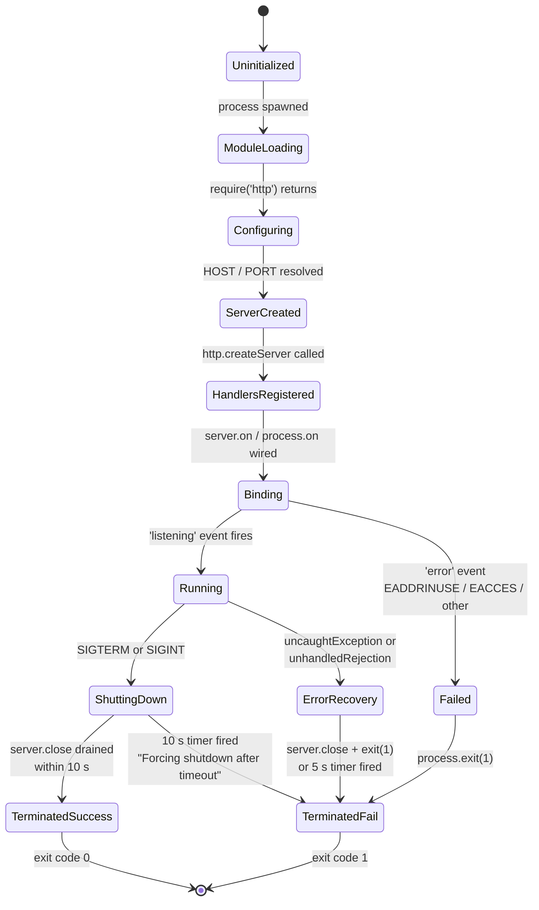
```mermaid
stateDiagram-v2
    [*] --> Uninitialized
    Uninitialized --> ModuleLoading: process spawned
    ModuleLoading --> Configuring: require('http') returns
    Configuring --> ServerCreated: HOST / PORT resolved
    ServerCreated --> HandlersRegistered: http.createServer called
    HandlersRegistered --> Binding: server.on / process.on wired
    Binding --> Running: 'listening' event fires
    Binding --> Failed: 'error' event<br/>EADDRINUSE / EACCES / other
    Running --> ShuttingDown: SIGTERM or SIGINT
    Running --> ErrorRecovery: uncaughtException or<br/>unhandledRejection
    ShuttingDown --> TerminatedSuccess: server.close drained<br/>within 10 s
    ShuttingDown --> TerminatedFail: 10 s timer fired<br/>"Forcing shutdown after timeout"
    ErrorRecovery --> TerminatedFail: server.close + exit(1)<br/>or 5 s timer fired
    Failed --> TerminatedFail: process.exit(1)
    TerminatedSuccess --> [*]: exit code 0
    TerminatedFail --> [*]: exit code 1
```

### 5.2.7 Sequence Diagrams for Key Flows

#### 5.2.7.1 Client-Server Request-Response Sequence

The handler covers three response outcomes (200, 400, 500) for a single client request. The `res.headersSent` guard is critical: without it, attempting to write a 500 response after headers had already been flushed would throw a secondary error and risk a crash loop.

```mermaid
sequenceDiagram
    autonumber
    participant Client as HTTP Client
    participant Parser as Node.js HTTP Parser
    participant Handler as server.js Request Handler

    Client->>Parser: TCP connect + HTTP request line + headers
    Parser->>Handler: requestListener(req, res)
    activate Handler
    Handler->>Handler: Enter try block

    alt req.method or req.url missing
        Handler->>Handler: res.statusCode = 400<br/>setHeader Content-Type text/plain
        Handler-->>Parser: res.end("Bad Request: Invalid request format\n")
        Parser-->>Client: HTTP/1.1 400 Bad Request
    else valid request
        Handler->>Handler: res.statusCode = 200<br/>setHeader Content-Type text/plain
        Handler-->>Parser: res.end("Hello, World!\n")
        Parser-->>Client: HTTP/1.1 200 OK + body
    end

    opt Synchronous exception thrown in handler
        Handler->>Handler: catch(error) -> console.error
        alt res.headersSent is false
            Handler->>Handler: res.statusCode = 500
            Handler-->>Parser: res.end("Internal Server Error\n")
            Parser-->>Client: HTTP/1.1 500 Internal Server Error
        else res.headersSent is true
            Handler->>Handler: Skip response write (already in progress)
        end
    end
    deactivate Handler
```

#### 5.2.7.2 Process Manager Lifecycle Sequence

This sequence shows how the hardened runtime conforms to the signal contract that PM2, systemd, and container runtimes rely on, even though no orchestration tooling is included in the repository.

```mermaid
sequenceDiagram
    autonumber
    participant Op as Operator
    participant Sup as OS / Supervisor
    participant Node as Node.js Process
    participant Srv as HTTP Server

    Op->>Node: node server.js
    Node->>Node: Resolve HOST / PORT env
    Node->>Srv: http.createServer + listen
    Srv-->>Node: 'listening' event
    Node-->>Op: stdout "Server running at http://..."
    Note over Node: STATE: Running

    Sup->>Node: SIGTERM
    Node->>Node: gracefulShutdown('SIGTERM')
    Node-->>Sup: stdout "SIGTERM received. Starting graceful shutdown..."
    Node->>Srv: server.close(cb)
    Node->>Node: setTimeout(forceExit, 10000)

    alt Drain completes within 10 s
        Srv-->>Node: close callback fires
        Node-->>Sup: stdout "Server closed. All connections finished."
        Node-->>Sup: exit(0)
    else 10 s timer elapses first
        Node-->>Sup: stderr "Forcing shutdown after timeout"
        Node-->>Sup: exit(1)
    end
```

#### 5.2.7.3 Backprop Analytical Sequence

Backprop is an inbound analytical consumer only. The sequence is strictly read-only; Backprop never mutates repository files.

```mermaid
sequenceDiagram
    autonumber
    participant BP as Backprop Tool/Service
    participant Repo as Repository Filesystem

    BP->>Repo: List files at root
    Repo-->>BP: 4 core files (flat layout)
    BP->>Repo: Read package.json
    Repo-->>BP: Manifest (identity surface)
    BP->>Repo: Read package-lock.json
    Repo-->>BP: Lockfile v3 (zero deps)
    BP->>Repo: Read server.js
    Repo-->>BP: 144-line hardened source
    BP->>Repo: Read README.md
    Repo-->>BP: Identity + "Do not touch!"
    BP->>BP: Run internal validators (out-of-repo)
    Note over BP,Repo: No writes performed.<br/>Repo is unaltered.
```

---

## 5.3 TECHNICAL DECISIONS

### 5.3.1 Architecture Style Decisions and Trade-offs

The architecture style decisions are summarized below. Each was chosen to preserve the system's role as a minimum viable test scaffold for Backprop integration; each trade-off is explicit.

| Decision | Choice | Rationale |
|----------|--------|-----------|
| Programming language | JavaScript (CommonJS) | Native Node.js compatibility; no transpilation step |
| Runtime | Node.js with built-in `http` only | Zero external dependencies; smallest possible analysis surface |
| Module architecture | Single-file monolith | Minimizes the surface area Backprop must analyze |
| State model | Stateless | Deterministic responses; no persistence subsystem to validate |
| Concurrency model | Single-threaded event loop | Default Node.js execution model; no coordination required |

| Decision | Trade-off Accepted |
|----------|---------------------|
| JavaScript (CommonJS) | No ES Module syntax; no TypeScript type checking |
| Built-in `http` only | No middleware, routing, body parsing, content negotiation |
| Single-file monolith | No code splitting, no organizational hierarchy |
| Stateless | No state across requests; no session-aware functionality |
| Single-threaded event loop | No CPU-bound parallelism; no `cluster` module use |

### 5.3.2 Communication Pattern Choices

The system uses exactly three communication patterns, each minimal:

- **Synchronous HTTP/1.1 request-response** for all client communication. No streaming, WebSocket, SSE, gRPC, or asynchronous callback API is exposed.
- **Event-driven intra-process** through the Node.js event loop. The loop processes TCP socket events, HTTP parser events, OS signal events, and process-level error events. No custom `EventEmitter` is constructed.
- **Signal-based lifecycle** through POSIX `SIGTERM` and `SIGINT`. This is the de facto contract that PM2, systemd, and container runtimes rely on.

Notably absent: no publish-subscribe, no message queues, no AMQP / Kafka / NATS / SQS, no RPC clients, no event bus.

### 5.3.3 Data Storage Solution Rationale

The data storage solution is the absence of any data storage. The rationale is documented across the zero-persistence posture: the data domain is explicitly defined as "no data persistence; no user data; stateless operation; static content only." Specifically:

- **No file system writes.** `server.js` calls no `fs` module functions.
- **No database operations.** No SQL or NoSQL client is loaded; database connections (SQL, NoSQL, in-memory) are explicitly excluded from scope.
- **No state serialization.** No `JSON.stringify`-then-write pattern exists; no marshaling code is present.
- **No request log files.** Logging is to `stdout` / `stderr` only via `console.log` / `console.error`.

A persistence layer would expand the analysis surface that Backprop must process and would introduce non-determinism that conflicts with the project's role as a stable, minimal integration target.

### 5.3.4 Caching Strategy Justification

The caching strategy is the absence of any caching:

- No response cache — every response is generated from a string literal on each request.
- No connection pool — no outbound connections are made.
- No in-memory cache (`Map`, `LRU`, `WeakMap`-as-cache, or otherwise).
- No CDN integration.

The rationale mirrors that of persistence: a cache layer would expand the analysis surface that Backprop must process and would introduce variability (cache hits versus misses) that conflicts with the project's role as a stable, deterministic integration target.

### 5.3.5 Security Mechanism Selection

Security in the system is delivered primarily through the **deliberate omission of attack surface** rather than through the addition of security primitives. Each technology choice has a direct security implication.

| Stack Choice | Security Posture |
|--------------|------------------|
| Zero external dependencies | No supply-chain attack surface; no transitive CVEs to track |
| Built-in `http` only (no `https`) | No TLS attack surface; loopback / test use only |
| Default loopback binding (`127.0.0.1`) | Not reachable from external networks unless explicitly overridden |
| No authentication primitives | No credential mishandling, session-fixation, or JWT-key-leak risk |
| No request body / query parsing | Eliminates injection vectors (SQLi, NoSQLi, command injection, XXE) |
| Server-side-only error logging | Stack traces never reflected to clients |
| Bounded shutdown timers (10 s / 5 s / 5 s) | Prevents indefinite hangs under signal storms or exception cascades |

### 5.3.6 Architecture Decision Records

The following decision tree captures the top-level architectural decisions, the choices made, and the conditions under which alternatives would have been selected. Each terminal node identifies the binding constraint that forces the chosen path.

```mermaid
flowchart TD
    Start([Architectural Decision Point])
    Start --> Q1{"Add a web framework?<br/>(Express / Fastify / Koa)"}
    Q1 -->|"Adds dependencies"| Reject1["REJECTED<br/>Violates F-002-RQ-002<br/>Zero-dependency mandate"]
    Q1 -->|"Use built-in 'http'"| Keep1["ACCEPTED<br/>Built-in http module only"]
    Keep1 --> Q2{"Use ES Modules?"}
    Q2 -->|"Requires transpilation<br/>or .mjs extension"| Reject2["REJECTED<br/>Adds build step"]
    Q2 -->|"CommonJS"| Keep2["ACCEPTED<br/>require('http') only"]
    Keep2 --> Q3{"Bind to 0.0.0.0 by default?"}
    Q3 -->|"Reachable externally"| Reject3["REJECTED<br/>Insecure by default"]
    Q3 -->|"Loopback default"| Keep3["ACCEPTED<br/>127.0.0.1 with HOST override"]
    Keep3 --> Q4{"Persist state?"}
    Q4 -->|"Adds DB or fs"| Reject4["REJECTED<br/>Expands analysis surface"]
    Q4 -->|"Stateless"| Keep4["ACCEPTED<br/>No persistence"]
    Keep4 --> Q5{"Add observability stack?"}
    Q5 -->|"APM / metrics / tracing"| Reject5["REJECTED<br/>Adds dependencies"]
    Q5 -->|"Native console only"| Keep5["ACCEPTED<br/>console.log / console.error"]
    Keep5 --> Q6{"Add authentication?"}
    Q6 -->|"OAuth / JWT / API keys"| Reject6["REJECTED<br/>Out of scope §1.3.2.1"]
    Q6 -->|"No auth"| Keep6["ACCEPTED<br/>Open inbound surface"]
    Keep6 --> Final([Final Architecture<br/>Minimum Viable Test Scaffold])

    classDef accepted fill:#d4edda,stroke:#28a745,stroke-width:2px
    classDef rejected fill:#f8d7da,stroke:#dc3545,stroke-width:1px,stroke-dasharray: 5 5
    classDef decision fill:#fff3cd,stroke:#856404,stroke-width:2px
    class Keep1,Keep2,Keep3,Keep4,Keep5,Keep6,Final accepted
    class Reject1,Reject2,Reject3,Reject4,Reject5,Reject6 rejected
    class Start,Q1,Q2,Q3,Q4,Q5,Q6 decision
```

#### 5.3.6.1 ADR-001: Built-in `http` over Web Frameworks

- **Status:** Accepted.
- **Context:** A typical Node.js HTTP service uses Express, Fastify, or Koa to abstract routing, middleware, and request parsing.
- **Decision:** Use Node.js's built-in `http` module only. Implement the single endpoint inline.
- **Consequences:** Zero supply-chain surface. No middleware, no routing table, no request body parsing — accepted as fit-for-purpose given the test-scaffold role.

#### 5.3.6.2 ADR-002: CommonJS over ES Modules

- **Status:** Accepted.
- **Context:** ES Modules (`import`/`export`) are the modern JavaScript standard but require either `.mjs` files, an `"type": "module"` field, or transpilation.
- **Decision:** Use CommonJS (`require`) exclusively.
- **Consequences:** No build step, no transpilation, no `"type": "module"` declaration. The `main` field anomaly (`"main": "index.js"`) is preserved as part of identity.

#### 5.3.6.3 ADR-003: Loopback Default with Explicit Override

- **Status:** Accepted.
- **Context:** Binding to `0.0.0.0` would make the server immediately reachable on all interfaces.
- **Decision:** Default to `127.0.0.1`; allow `HOST=0.0.0.0` as an explicit environment override.
- **Consequences:** Secure-by-default network posture; external exposure is a contributor-discipline matter.

#### 5.3.6.4 ADR-004: Zero Persistence and Zero Caching

- **Status:** Accepted.
- **Context:** Any persistence or caching layer would create variability in behavior across runs.
- **Decision:** No file system writes, no database, no in-memory cache, no CDN.
- **Consequences:** Deterministic, idempotent behavior; suitable as a stable Backprop analysis target.

#### 5.3.6.5 ADR-005: Native `console` Logging, No Observability Stack

- **Status:** Accepted.
- **Context:** Production services typically use structured logging (`pino`, `winston`) and APM (Datadog, New Relic, OpenTelemetry).
- **Decision:** Use `console.log` to stdout for lifecycle messages and `console.error` to stderr for error messages. No structured logging, no APM, no metrics, no tracing.
- **Consequences:** Operators must inspect raw stdout/stderr; no machine-parseable log schema. Zero-dependency mandate preserved.

#### 5.3.6.6 ADR-006: Bounded-Completion Timers as the Sole Resilience Primitive

- **Status:** Accepted.
- **Context:** Retry libraries, circuit breakers, and fallback frameworks would all add dependencies and behavioral complexity.
- **Decision:** Three explicit `setTimeout` upper-bound timers (10 s for graceful drain; 5 s for each of the two process-level error cleanups). On expiry, log a forced-termination message and `process.exit(1)`.
- **Consequences:** No in-process retry, fallback, or circuit-breaking, but the runtime is provably bounded in completion time, which is the precondition external supervisors (systemd `Restart=on-failure`, PM2 auto-restart) require.

---

## 5.4 CROSS-CUTTING CONCERNS

### 5.4.1 Monitoring and Observability Approach

The system intentionally **integrates no observability tooling**. The following table enumerates the absent categories and the substitute (where one exists).

| Observability Category | Status | Substitute |
|------------------------|--------|------------|
| APM (New Relic, Datadog, AppDynamics) | Not used | None |
| Error tracking (Sentry, Rollbar, Bugsnag) | Not used | `console.error` to stderr |
| Metrics (Prometheus, StatsD, CloudWatch) | Not used | None |
| Log aggregation (Splunk, ELK, Loki) | Not used | `console.log` to stdout |
| Distributed tracing (Jaeger, Zipkin, OpenTelemetry) | Not used | None |
| Uptime monitoring (Pingdom, UptimeRobot) | Not used | None |

Observability — when desired — is delegated to the operator's environment. The bounded-completion timers and clean exit codes provide the deterministic signals that an external supervisor (systemd, PM2, container orchestrator) needs to detect failure and act, without any in-process instrumentation.

### 5.4.2 Logging and Tracing Strategy

**Logging mechanism.** Native `console.log` (stdout) for lifecycle messages and `console.error` (stderr) for error messages. No structured logging library, no log levels, no log rotation, no JSON log lines, no correlation IDs.

**Tracing.** None. No spans, no trace IDs, no propagation headers, no OpenTelemetry integration.

**Logged events.** The runtime emits messages at every significant lifecycle transition: server startup, server-level errors (`EADDRINUSE`, `EACCES`, other), request-handler exceptions, client connection errors, signal-received notifications, graceful-shutdown drain status, forced-exit messages, and process-level last-resort exception/rejection details. Crucially, **no logged value is ever interpolated into an HTTP response body**, eliminating information-disclosure paths.

### 5.4.3 Error Handling Patterns

The hardened runtime classifies errors into five distinct categories, each with a dedicated handler, a deterministic response, and a defined exit path.

| Category | Detection Mechanism | Terminal Outcome |
|----------|---------------------|------------------|
| Startup error (bind failure) | `server.on('error', ...)` | `process.exit(1)` |
| Request handler exception (synchronous) | `try/catch` inside handler | HTTP 500 (if `!headersSent`); process continues |
| Request validation failure | Boolean presence check on `req.method`/`req.url` | HTTP 400; process continues |
| Client connection error | `server.on('clientError', ...)` | Raw 400 or `socket.destroy()`; process continues |
| Process-level exception (last resort) | `process.on('uncaughtException')` / `process.on('unhandledRejection')` | `process.exit(1)` after 5 s force-exit timer |

#### 5.4.3.1 Consolidated Error Handling Flow

The following diagram unifies the five error categories into a single decision tree showing how each is detected and resolved.

```mermaid
flowchart TD
    AnyEvent([Any error-generating event])
    AnyEvent --> Classify{"Error origin?"}

    Classify -->|"server.on 'error'<br/>during bind"| StartupBranch[Startup Error]
    StartupBranch --> StartupLog["console.error<br/>'Server error: ' + error.message"]
    StartupLog --> StartupCode{"error.code?"}
    StartupCode -->|"EADDRINUSE"| MsgPort["Port already in use"]
    StartupCode -->|"EACCES"| MsgPerm["Permission denied to bind"]
    StartupCode -->|"other"| NoExtra["No additional message"]
    MsgPort --> Exit1A["process.exit(1)"]
    MsgPerm --> Exit1A
    NoExtra --> Exit1A
    Exit1A --> Terminated1([STATE: Failed - exit 1])

    Classify -->|"In-handler<br/>synchronous throw"| RequestBranch[Request Handler Exception]
    RequestBranch --> CatchLog["catch(error)<br/>console.error 'Error processing request'"]
    CatchLog --> HeadersCheck{"res.headersSent?"}
    HeadersCheck -->|"false"| Resp500["500 Internal Server Error<br/>'Internal Server Error\\n'"]
    HeadersCheck -->|"true"| SkipWrite["Skip write<br/>(prevent double-send)"]
    Resp500 --> Continue([Process continues])
    SkipWrite --> Continue

    Classify -->|"Missing<br/>req.method/url"| ValidateBranch[Request Validation Failure]
    ValidateBranch --> Resp400["400 Bad Request<br/>'Bad Request: Invalid request format\\n'"]
    Resp400 --> Continue

    Classify -->|"server.on 'clientError'"| ClientBranch[Client Connection Error]
    ClientBranch --> CELog["console.error<br/>'Client connection error'"]
    CELog --> WritableQ{"socket.writable?"}
    WritableQ -->|"true"| RawWrite["socket.end<br/>'HTTP/1.1 400 Bad Request'"]
    WritableQ -->|"false"| ForceClose["socket.destroy()"]
    RawWrite --> Continue
    ForceClose --> Continue

    Classify -->|"uncaughtException<br/>OR unhandledRejection"| ProcessBranch[Process-Level Exception]
    ProcessBranch --> PLLog["console.error<br/>SHUTTING DOWN banner + detail"]
    PLLog --> CallClose["server.close(cb that exits 1)"]
    CallClose --> Arm5["setTimeout 5000 ms armed"]
    Arm5 --> Race5{"Race outcome"}
    Race5 -->|"close completes<br/>within 5 s"| CB1["close callback<br/>process.exit(1)"]
    Race5 -->|"5 s elapses"| TimerForce["console.error<br/>'Forcing exit...'"]
    TimerForce --> Exit1B["process.exit(1)"]
    CB1 --> Terminated2([STATE: Terminated - exit 1])
    Exit1B --> Terminated2

    classDef terminal fill:#f8d7da,stroke:#dc3545,stroke-width:2px
    classDef recoverable fill:#d4edda,stroke:#28a745,stroke-width:2px
    classDef decision fill:#fff3cd,stroke:#856404,stroke-width:2px
    class Terminated1,Terminated2,Exit1A,Exit1B terminal
    class Continue,Resp200,Resp400,Resp500,RawWrite,SkipWrite,ForceClose recoverable
    class Classify,StartupCode,HeadersCheck,WritableQ,Race5 decision
```

#### 5.4.3.2 Critical Design Decision: Always Exit on Process-Level Errors

Both the `uncaughtException` and `unhandledRejection` handlers always exit with code `1`; neither attempts in-place recovery. This follows the Node.js documentation's guidance that the process state after `uncaughtException` is unsafe to continue from, and aligns with the business rule "Process must terminate within bounded time to enable supervisor restart." The 5-second force-exit timer ensures that even if `server.close()` itself hangs, the process is guaranteed to terminate.

### 5.4.4 Authentication and Authorization Framework

**Status: none.** Zero authentication or authorization primitives exist anywhere in the system:

- OAuth 2.0 / OIDC — not used
- SAML, LDAP, Active Directory — not used
- JWT issuance or verification — not used
- API key validation — not used
- Session storage / cookies — not used
- Secret management — not used; no secrets exist
- Role-based, attribute-based, or policy-based authorization — not used

Every request that passes the presence check on `req.method` and `req.url` is accepted; no role, scope, permission gate, or rate limit exists. This is consistent with the system's role as a controlled test scaffold and is enabled by the default loopback binding that prevents external exposure.

### 5.4.5 Performance Requirements and SLAs

**No quantitative KPIs, SLAs, or performance thresholds are defined within the repository.** Performance is evaluated through binary functional outcomes only: does the server start, does it respond, does the package install succeed, does Backprop pass. Any timing values referenced in this document are bounded-completion guarantees, not SLAs.

#### 5.4.5.1 Bounded-Completion Timers

| Timer | Bound | Purpose |
|-------|-------|---------|
| Graceful shutdown drain | 10,000 ms | Bound the wait for `server.close()` to complete |
| Uncaught exception cleanup | 5,000 ms | Bound the wait after `server.close()` in the `uncaughtException` handler |
| Unhandled rejection cleanup | 5,000 ms | Bound the wait after `server.close()` in the `unhandledRejection` handler |

On any timer expiry, the process logs a forced-termination message and exits with code `1`.

#### 5.4.5.2 Observed Performance Characteristics

The Project Guide records the following observed characteristics on a typical developer machine. These are descriptive measurements, **not committed SLAs**.

| Metric | Observation |
|--------|-------------|
| Startup time | < 100 ms from `node server.js` to `'Server running at...'` log |
| Response latency | < 5 ms average for valid `200 OK` path |
| Memory footprint | ~30 MB resident set size |
| Idle CPU usage | < 1% |

#### 5.4.5.3 Scalability Posture

Scalability is explicitly out of scope. The system runs as a single Node.js process on a single-threaded event loop, with:

- No load balancing
- No clustering via the `cluster` module
- No worker threads
- No horizontal scaling design
- No shared state requiring coordination
- Deployment model is local development and CI invocation only

### 5.4.6 Disaster Recovery Procedures

**No automated retry, fallback, or recovery mechanisms are implemented.** Specifically absent:

- No retry logic on failed request handlers
- No fallback response paths beyond the static body
- No error notification systems (no email, no webhook, no PagerDuty integration)
- No circuit breakers
- No self-healing routines
- No exponential backoff
- No dead-letter queues
- No backup, snapshot, or replication mechanisms (because there is no state to back up)

#### 5.4.6.1 Operator-Driven Recovery

Recovery is manual and operator-driven. The bounded-timer design is the **enabling primitive** for external supervisor-based recovery (e.g., systemd `Restart=on-failure`, PM2 auto-restart), even though such supervisors are not part of this repository.

| Failure | Operator Recovery Action |
|---------|--------------------------|
| `EADDRINUSE` at startup | Stop other process on port, or set `PORT=<different>`, then `node server.js` |
| `EACCES` at startup | Use unprivileged port (≥ 1024) or run with elevated privileges |
| `uncaughtException` exit | Inspect stderr stack trace, fix root cause, restart |
| `unhandledRejection` exit | Inspect stderr rejection reason, fix root cause, restart |
| Graceful shutdown timeout (exit 1) | Investigate long-running connections; restart |

#### 5.4.6.2 Recovery via External Supervisors

Although no orchestration tooling is included in the repository, the clean exit-code contract (`0` = clean shutdown, `1` = any failure) is sufficient for any standard process supervisor:

- **systemd:** `Restart=on-failure` will restart the process whenever it exits with non-zero.
- **PM2:** Auto-restart on crash; PM2 also forwards `SIGTERM` for graceful shutdown.
- **Docker / Kubernetes:** Container restart policies (`unless-stopped`, `always`) plus liveness probes against the `200 OK` endpoint can substitute for in-process retry logic.

---

## 5.5 ARCHITECTURAL ASSUMPTIONS AND CONSTRAINTS

### 5.5.1 Documented Assumptions

The architecture rests on five explicit assumptions:

1. **Node.js runtime is available** on the host (v14+ recommended; tested with v20.19.5 LTS).
2. **NPM 7 or later is available** wherever package management operations are performed (required by `lockfileVersion: 3`).
3. **Backprop Tool/Service is the primary integration consumer**; the codebase is shaped around being analyzable, not around being functionally rich.
4. **The "Do not touch!" notice in `README.md`** is binding for the package-identity surface (`package.json`, `package-lock.json`, `README.md`) but does not apply to `server.js`.
5. **References to test passage** in the Project Guide refer to manual verification, not automated test framework results.

### 5.5.2 Binding Constraints

The architecture is governed by five binding constraints. Any violation invalidates the project's role as a Backprop reference target.

1. **No third-party packages may be added.** Doing so would invalidate F-002-RQ-002 (the zero-dependency constraint).
2. **The `main` field anomaly** (`"main": "index.js"` with no `index.js` file) is preserved as part of identity.
3. **No automated test framework exists.** Validation is manual.
4. **No quantitative performance targets are defined.** Performance is evaluated as a binary functional outcome.
5. **Scope expansions are out of bounds:** no routing, no auth, no HTTPS, no containers, no clustering, no databases, no message queues.

---

## 5.6 REFERENCES

#### Files Examined

- `existing-projects-qa-test/server.js` — 144-line hardened HTTP server implementation; source of all runtime architectural evidence including request handling, server-level error handling, client connection error handling, signal-driven graceful shutdown, process-level last-resort guards, and the three bounded-completion timers.
- `existing-projects-qa-test/package.json` — 11-line NPM manifest; source of package identity (`hello_world` v1.0.0), MIT license, placeholder `test` script, the `main` field anomaly, and the zero-dependency declaration.
- `existing-projects-qa-test/package-lock.json` — 13-line NPM lockfile v3; source of the mechanical zero-dependency proof and the NPM 7+ minimum-version requirement.
- `existing-projects-qa-test/README.md` — 2-line repository documentation; source of project identity (`hao-backprop-test`) and the "Do not touch!" preservation policy.
- `existing-projects-qa-test/blitzy/documentation/Project Guide.md` — 616-line project status document; source of completion status, observed performance characteristics, and deployment compatibility notes.

#### Folders Explored

- `` (repository root) — Top-level container holding only `existing-projects-qa-test`.
- `existing-projects-qa-test/` — Project root containing the four core files and the `blitzy/` documentation subtree.
- `existing-projects-qa-test/blitzy/` — Documentation container.
- `existing-projects-qa-test/blitzy/documentation/` — Holds `Technical Specifications.md` and `Project Guide.md`.

#### Technical Specification Sections Cross-Referenced

- Section 1.2 System Overview — Project context; Preserved Identity Surface vs. Hardened Runtime Surface; major components.
- Section 1.3 Scope — In-scope features; implementation boundaries (network, port, protocol, process model, data domain); out-of-scope exclusions.
- Section 2.4 Implementation Considerations — Technical constraints; bounded timers; scalability posture; security implications.
- Section 2.6 Assumptions and Constraints — Five assumptions and five binding constraints.
- Section 3.1 Programming Languages — JavaScript/CommonJS selection criteria.
- Section 3.3 Open Source Dependencies — Zero external dependency footprint evidence.
- Section 3.4 Third-Party Services — Backprop integration; absence of authentication, observability, and cloud services.
- Section 3.8 Technology Stack Architecture — Layered stack diagram; component integration matrix; security implications; rationale summary.
- Section 4.1 System Workflows — Five data flows and their sources, sinks, and frequencies.
- Section 4.2 Feature Process Flows — Response body outcomes per status code.
- Section 4.3 Integration Sequence Diagrams — Client-server, process-manager lifecycle, and Backprop analytical sequences.
- Section 4.4 State Management — Eleven-state lifecycle; zero-persistence posture; caching and transaction status.
- Section 4.5 Error Handling Flowcharts — Five error category taxonomy; startup, request, client, and process-level error flows; no retry/fallback mechanisms.
- Section 4.6 Validation Rules and Decision Points — Presence-check validation; no authorization checkpoints.
- Section 4.7 Timing and SLA Considerations — Bounded-completion timers (10 s / 5 s / 5 s); observed performance characteristics.
- Section 4.8 Process Boundaries and Actor Inventory — Seven-actor inventory; absence of outbound integrations.

# 6. SYSTEM COMPONENTS DESIGN

## 6.1 Core Services Architecture

### 6.1.1 Applicability Statement

#### 6.1.1.1 Declaration of Non-Applicability

**Core Services Architecture is not applicable for this system.**

The `hao-backprop-test` repository (NPM package `hello_world` v1.0.0) is not, and was deliberately designed not to be, a multi-service system. It implements a **single-file, monolithic, stateless, single-threaded** Node.js HTTP server (Section 5.1.1.1) executed directly by the Node.js runtime without transpilation or build steps. Every line of executable application code lives in a single 144-line file (`server.js`) that imports exactly one module — Node.js's built-in `http` module — and exposes a single HTTP listener. There is no second service component, no peer process, no inter-service boundary, and no distributed runtime topology against which the canonical service-architecture concerns (service discovery, inter-service communication, load balancing, circuit breaking, retry policies, horizontal scaling) could be applied.

This non-applicability is the result of explicit, repeated architectural decisions documented across the specification rather than a documentation gap. The remainder of Section 6.1 substantiates the declaration, enumerates every service-architecture concern that the prompt requires addressing, identifies what (if anything) maps to that concern in this system, and cross-references the binding sections of the specification that govern each exclusion.

#### 6.1.1.2 Foundational Architectural Facts

The following four facts collectively disqualify any service-oriented architectural framing of this repository. Each is mechanically verifiable from the repository artifacts cited.

| # | Foundational Fact | Evidence Location | Mechanical Enforcement |
|---|-------------------|-------------------|------------------------|
| 1 | Single-file monolith — all executable code in one 144-line file | `server.js` (Section 5.2.1) | No second source file exists |
| 2 | Single Node.js process; single-threaded event loop; no clustering | Section 5.1.1.3; Section 2.4.3 | No `cluster` / `worker_threads` / `child_process` imports |
| 3 | Zero external dependencies | `package.json`, `package-lock.json` (Section 5.2.2, 5.2.3) | `lockfileVersion: 3` with empty packages map |
| 4 | Stateless; no persistence, caching, sessions, or shared state | Section 5.1.3.3; Section 5.3.3 | No `fs` writes, no DB clients, no cache structures |

The architectural rationale for these facts is documented in Section 5.1.1.1: every potential expansion of the stack (a framework, a database, a logger, a test runner, a container, a CI pipeline) would either invalidate the zero-dependency constraint that gives the project its identity or expand the analysis surface that the Backprop Tool/Service must process. Service-oriented decomposition is the canonical example of such an expansion.

#### 6.1.1.3 Explicit Out-of-Scope Exclusions

The specification enumerates the service-architecture-adjacent capabilities that are explicitly excluded from this system. Section 6.1 inherits these exclusions verbatim; nothing in this section reintroduces them.

| Exclusion Category | Specific Items Excluded | Binding Section |
|--------------------|--------------------------|-----------------|
| Service node participation | "Microservice architecture participation as a service node" | 1.3.2.4 |
| Multi-instance deployment | "Multi-instance or clustered deployment"; "Load balancing or reverse proxy configuration"; "Container orchestration (Docker, Kubernetes)" | 1.3.2.1 |
| Asynchronous service infrastructure | "Message queue systems (Redis, RabbitMQ, Kafka)"; "Caching layers"; "CDN integration" | 1.3.2.1 |
| Scale and capacity engineering | "Scalability testing or capacity planning exercises"; "Performance or load testing" | 1.3.2.4, 1.3.2.1 |
| Outbound integrations | "Outbound integrations to any external system (no HTTP clients, no SDKs, no service connectors)" | 1.3.2.3 |

The binding constraint expressed in Section 2.6.2 (item 5) consolidates the above: *"Scope expansions are out of bounds per Section 1.3.2: no routing, no auth, no HTTPS, no containers, no clustering, no databases, no message queues."*

#### 6.1.1.4 Service Interaction Diagram — Monolithic Boundary

A traditional service-interaction diagram would depict multiple services exchanging messages across network boundaries. In this system, no such interactions exist. The diagram below depicts the actual runtime topology: a single process boundary that subsumes all application logic, surrounded by external actors that are not themselves services in the architectural sense.

```mermaid
flowchart TB
    subgraph ExternalActors["External Actors (Not Services)"]
        Operator[Operator / Developer]
        Client[HTTP Client<br/>curl / browser / CI]
        Supervisor[OS / Supervisor<br/>systemd / PM2 / kill]
        Backprop[Backprop Tool/Service<br/>read-only analytical]
    end

    subgraph ProcessBoundary["Single Node.js Process — One Service Boundary"]
        direction TB
        ServerJS["server.js (144 lines)<br/>Sole executable artifact"]
        HTTPMod["Built-in 'http' module<br/>(only import)"]
        ProcAPI["process global API<br/>(signals, env, exit)"]
        Console["console.log / .error<br/>(stdout / stderr)"]
        ServerJS --> HTTPMod
        ServerJS --> ProcAPI
        ServerJS --> Console
    end

    Operator -->|node server.js<br/>HOST / PORT env| ServerJS
    Client -->|HTTP/1.1 request| ServerJS
    ServerJS -->|fixed-body response| Client
    Supervisor -->|SIGTERM / SIGINT| ServerJS
    ServerJS -->|exit code 0 / 1| Supervisor
    Backprop -.->|read source files| ServerJS

    NoServices["No second service<br/>No service mesh<br/>No service discovery<br/>No load balancer<br/>No message broker"]

    classDef boundary fill:#d4edda,stroke:#28a745,stroke-width:3px
    classDef actor fill:#fff3cd,stroke:#856404,stroke-width:2px
    classDef absent fill:#f8d7da,stroke:#dc3545,stroke-width:1px,stroke-dasharray: 5 5
    class ServerJS,HTTPMod,ProcAPI,Console boundary
    class Operator,Client,Supervisor,Backprop actor
    class NoServices absent
```

The dashed red node enumerates the standard service-architecture components that would appear in a typical service-interaction diagram and that are deliberately absent from this system.

---

### 6.1.2 Service Components

This section maps each service-component concern the prompt requires (boundaries, communication, discovery, load balancing, circuit breaking, retry/fallback) to its corresponding state in this repository. In every case the answer is *not applicable* because there is no second service to bound, discover, balance, break, or retry against.

#### 6.1.2.1 Service Boundaries and Responsibilities

There is exactly one application component: `server.js`, the sole executable artifact. The three supporting files (`package.json`, `package-lock.json`, `README.md`) are static identity-and-metadata documents, not services; they are read by tooling but execute no code and expose no API. Per Section 2.3 (Feature Relationships), there are **no shared modules in the runtime**: `server.js` contains no internal `require()` calls beyond the Node.js built-in `http` module, so even an *intra-process* component decomposition does not exist.

| Concern | Conventional Service Architecture | This System |
|---------|------------------------------------|-------------|
| Number of services | Multiple, each owning a bounded context | One process, no service decomposition |
| Service boundary definition | Network boundary; API contract per service | Process boundary; one HTTP listener |
| Responsibility allocation | Domain-driven boundaries between services | All responsibilities in one 144-line file |
| Component coupling | Loose coupling via APIs and contracts | No internal components to couple |

The complete internal structure of the single component is documented in Section 5.2.1, which decomposes `server.js` into nine lifecycle-role sub-components (module imports, environment resolution, request handler, server-error handler, client-error handler, `gracefulShutdown`, signal handlers, `uncaughtException` handler, `unhandledRejection` handler, and server startup). These are *intra-file logical groupings*, not services.

#### 6.1.2.2 Inter-Service Communication Patterns

No inter-service communication patterns exist because no second service exists. The system uses exactly three communication patterns per Section 5.3.2, none of which is inter-service:

| Pattern | Surface | Role | Inter-Service? |
|---------|---------|------|----------------|
| Synchronous HTTP/1.1 request-response | TCP listener on `${HOST}:${PORT}` | Client → server, fixed-body responses | No — client-server, not service-to-service |
| Event-driven intra-process | Node.js event loop / libuv | TCP, HTTP parser, signal, exception events | No — intra-process only |
| Signal-based lifecycle | POSIX `SIGTERM` / `SIGINT` | OS or supervisor → process | No — operating-system contract |

Section 5.3.2 is explicit about what is **absent**: *"no publish-subscribe, no message queues, no AMQP / Kafka / NATS / SQS, no RPC clients, no event bus."* Per Section 5.1.1.3, the system *"initiates no outbound network traffic of any kind: no outbound HTTP clients, no SDKs, no service connectors, no telemetry export."* This zero-egress posture is structural: a system that makes no outbound calls cannot, by construction, participate in inter-service communication.

#### 6.1.2.3 Service Discovery, Load Balancing, and Circuit Breakers

All three concerns are inapplicable for the same root reason: they govern interactions between multiple service endpoints, and only one endpoint exists.

| Concern | Status | Rationale |
|---------|--------|-----------|
| Service discovery | Not applicable | Only one process exists; nothing to discover. No DNS-based discovery, no registry (Consul/etcd/ZooKeeper), no Kubernetes service objects |
| Load balancing | Not applicable | Section 5.4.5.3 — "No load balancing; no clustering via the `cluster` module; no worker threads; no horizontal scaling design"; Section 5.2.1 — single process on single-threaded event loop |
| Circuit breakers | Not applicable | Section 5.4.6 — "No circuit breakers"; ADR-006 (Section 5.3.6.6) — retry libraries, circuit breakers, and fallback frameworks would add dependencies and behavioral complexity |

The decisive architectural decision is ADR-006 in Section 5.3.6.6, which establishes that *"Retry libraries, circuit breakers, and fallback frameworks would all add dependencies and behavioral complexity"* and selects bounded-completion timers (covered in Section 6.1.4.1) as the sole resilience primitive in lieu of those patterns.

#### 6.1.2.4 Retry and Fallback Mechanisms

Per Section 5.4.6: *"No automated retry, fallback, or recovery mechanisms are implemented."* The specification enumerates the specific absences:

| Mechanism | Status | Notes |
|-----------|--------|-------|
| Retry logic on failed request handlers | Absent | One-shot try/catch around handler body; no re-invocation |
| Fallback response paths | Absent | Only the static body is returned; no degraded variants |
| Exponential backoff | Absent | No retry surface against which backoff would apply |
| Dead-letter queues | Absent | No queue infrastructure exists |
| Error notification systems | Absent | No email, no webhook, no PagerDuty, no alert dispatch |
| Self-healing routines | Absent | The process exits on terminal errors; restart is delegated to external supervisors |

The closest construct to a "fallback" is the request handler's three-way response contract (200 for valid requests, 400 for validation failures, 500 for handler exceptions when `!res.headersSent`), which is documented in Section 4.5 (Error Handling Flowcharts) and Section 5.4.3. These are deterministic *error responses*, not *fallback paths* in the resilience-pattern sense.

---

### 6.1.3 Scalability Design

#### 6.1.3.1 Statement of Non-Applicability

Scalability design is **explicitly out of scope** per Section 2.4.3 and Section 5.4.5.3. The specification states unambiguously: *"The system runs as a single Node.js process on a single-threaded event loop. There is no load balancing, no clustering via the `cluster` module, no worker threads, no horizontal scaling design, and no shared state that would require coordination. The deployment model is local development and CI invocation only — never multi-instance, never production end-user-facing."*

Section 1.3.2.4 (Unsupported Use Cases) reinforces this by listing *"Scalability testing or capacity planning exercises"* among the use cases the system is **not intended to support**.

#### 6.1.3.2 Mapping of Scalability Concerns

| Prompt Concern | This System | Governing Section |
|----------------|-------------|-------------------|
| Horizontal scaling approach | Not applicable — no clustering, no multi-instance | 5.4.5.3, 2.4.3 |
| Vertical scaling approach | Not engineered — single-threaded event loop bounds the upper limit | 5.2.1 |
| Auto-scaling triggers and rules | Not applicable — no scaling controller exists | 5.4.5.3 |
| Resource allocation strategy | Single process; resources allocated by the host OS to the Node.js process | 5.1.1.3 |
| Capacity planning guidelines | Not applicable — Section 1.3.2.4 excludes capacity-planning exercises | 1.3.2.4 |
| Performance optimization techniques | None — performance is incidental, not engineered (see 6.1.3.3) | 5.4.5, 2.4.2 |

#### 6.1.3.3 Performance Optimization Techniques

No active performance optimization techniques (caching, connection pooling, request batching, response compression, CDN edge caching, read replicas, or sharding) are employed. The system attains its observed performance characteristics by virtue of its minimalism, not through engineered optimization.

Per Section 5.3.4 (Caching Strategy Justification), *"the caching strategy is the absence of any caching"*: no response cache, no connection pool (no outbound connections are made), no in-memory cache (`Map`, `LRU`, `WeakMap`), no CDN integration. Section 5.3.3 documents the equivalent absence of any persistence layer.

The observed performance characteristics (Section 4.7.3 and Section 5.4.5.2) are descriptive measurements on a typical developer machine and are **not committed SLAs**:

| Metric | Observed Value | Nature |
|--------|----------------|--------|
| Startup time | < 100 ms from `node server.js` to startup log | Descriptive only |
| Response latency | < 5 ms average for valid `200 OK` path | Descriptive only |
| Memory footprint | ~30 MB resident set size | Descriptive only |
| Idle CPU usage | < 1% | Descriptive only |

Per Section 4.7.1: *"No quantitative KPIs, SLAs, or performance thresholds … are defined within the repository. Performance is evaluated through binary functional outcomes only."*

#### 6.1.3.4 Scalability Architecture Diagram

The diagram below depicts the actual scalability posture — a single process with bounded vertical capacity and no horizontal-scaling primitives — alongside the architecturally rejected expansions. The rejected expansions are shown in dashed red to underscore that they are not future work but explicit out-of-scope items per Section 1.3.2.

```mermaid
flowchart TB
    subgraph InScope["In-Scope Scalability Posture (Section 5.4.5.3)"]
        direction TB
        SingleProc["Single Node.js Process<br/>(no fork, no cluster)"]
        EventLoop["Single-threaded event loop<br/>(libuv)"]
        Loopback["Default bind: 127.0.0.1:3000<br/>(loopback only)"]
        Deployment["Deployment model:<br/>local dev + CI invocation"]
        SingleProc --> EventLoop
        SingleProc --> Loopback
        SingleProc --> Deployment
    end

    subgraph OutOfScope["Explicitly Out of Scope (Sections 1.3.2.1, 1.3.2.4, 2.6.2)"]
        direction TB
        NoLB["No load balancer<br/>or reverse proxy"]
        NoCluster["No cluster module<br/>No worker_threads"]
        NoHScale["No horizontal scaling<br/>No multi-instance deploy"]
        NoVScale["No vertical scaling<br/>engineering"]
        NoAuto["No auto-scaling<br/>triggers or rules"]
        NoCap["No capacity planning<br/>(§1.3.2.4)"]
        NoOrch["No container orchestration<br/>(Docker / Kubernetes)"]
        NoCache["No caching layer<br/>(§5.3.4)"]
        NoCDN["No CDN integration"]
        NoMQ["No message queues<br/>(Redis / RabbitMQ / Kafka)"]
    end

    InScope -. "deliberate omission per ADR-001<br/>and zero-dependency mandate" .-> OutOfScope

    classDef inscope fill:#d4edda,stroke:#28a745,stroke-width:2px
    classDef outscope fill:#f8d7da,stroke:#dc3545,stroke-width:1px,stroke-dasharray: 5 5
    class SingleProc,EventLoop,Loopback,Deployment inscope
    class NoLB,NoCluster,NoHScale,NoVScale,NoAuto,NoCap,NoOrch,NoCache,NoCDN,NoMQ outscope
```

---

### 6.1.4 Resilience Patterns

This is the only sub-section of Core Services Architecture that has any in-scope content, and even here the scope is restricted to **process-local** resilience. The system implements no distributed-system resilience patterns (no circuit breakers, no bulkheads, no leader election, no quorum, no consensus protocols, no replicated state, no failover orchestration). The single resilience primitive that does exist is the family of **bounded-completion timers** that guarantee the runtime is provably bounded in completion time, which is the precondition external supervisors require to perform recovery on the system's behalf.

#### 6.1.4.1 Bounded-Completion Timers (The Sole Resilience Primitive)

Per ADR-006 in Section 5.3.6.6: *"Retry libraries, circuit breakers, and fallback frameworks would all add dependencies and behavioral complexity. Decision: Three explicit `setTimeout` upper-bound timers (10 s for graceful drain; 5 s for each of the two process-level error cleanups). On expiry, log a forced-termination message and `process.exit(1)`."*

These timers are **upper bounds, not SLAs**. They prevent indefinite hangs on shutdown, uncaught-exception cleanup, and unhandled-rejection cleanup. Their effect is to make external supervisor-based recovery feasible by guaranteeing termination within a finite, known window.

| Timer | Source Line | Bound | On Expiry |
|-------|-------------|-------|-----------|
| Graceful shutdown drain | `server.js:87` | 10,000 ms | `console.error("Forcing shutdown after timeout")` + `process.exit(1)` |
| Uncaught exception cleanup | `server.js:114` | 5,000 ms | `console.error("Forcing exit after uncaught exception")` + `process.exit(1)` |
| Unhandled rejection cleanup | `server.js:133` | 5,000 ms | `console.error("Forcing exit after unhandled rejection")` + `process.exit(1)` |

Per Section 5.3.6.6 Consequences: *"No in-process retry, fallback, or circuit-breaking, but the runtime is provably bounded in completion time, which is the precondition external supervisors (systemd `Restart=on-failure`, PM2 auto-restart) require."*

#### 6.1.4.2 Fault Tolerance Mechanisms (Process-Internal)

The hardened runtime classifies errors into five categories per Section 5.4.3. Each has a dedicated handler, a deterministic response, and a defined exit path. These are *process-internal* fault-tolerance mechanisms; there is no distributed fault tolerance.

| Category | Detection Mechanism | Terminal Outcome |
|----------|---------------------|------------------|
| Startup error (bind failure) | `server.on('error', ...)` | `process.exit(1)` |
| Request handler exception (synchronous) | `try/catch` inside handler | HTTP 500 (if `!res.headersSent`); process continues |
| Request validation failure | Boolean presence check on `req.method` / `req.url` | HTTP 400; process continues |
| Client connection error | `server.on('clientError', ...)` | Raw 400 or `socket.destroy()`; process continues |
| Process-level exception (last resort) | `process.on('uncaughtException')` / `process.on('unhandledRejection')` | `process.exit(1)` after 5 s force-exit timer |

Two important design properties follow from this table. First, the **always-exit-on-process-level-errors** rule (Section 5.4.3.2) means the system never attempts in-place recovery after `uncaughtException` or `unhandledRejection`; recovery is delegated to a supervisor. Second, transient errors (handler exceptions, validation failures, client connection errors) do *not* terminate the process — the server continues to accept subsequent requests, providing per-request fault isolation without sacrificing the process lifetime.

#### 6.1.4.3 Disaster Recovery Procedures

Per Section 5.4.6: *"No automated retry, fallback, or recovery mechanisms are implemented."* The specification enumerates the absences:

- No retry logic on failed request handlers
- No fallback response paths beyond the static body
- No error notification systems (no email, no webhook, no PagerDuty integration)
- No circuit breakers
- No self-healing routines
- No exponential backoff
- No dead-letter queues
- No backup, snapshot, or replication mechanisms (because there is no state to back up)

Recovery is **manual and operator-driven** (Section 5.4.6.1). The operator-action matrix from the specification:

| Failure Condition | Operator Recovery Action |
|-------------------|--------------------------|
| `EADDRINUSE` at startup | Stop other process on port, or set `PORT=<different>`, then `node server.js` |
| `EACCES` at startup | Use unprivileged port (≥ 1024) or run with elevated privileges |
| `uncaughtException` exit | Inspect stderr stack trace, fix root cause, restart |
| `unhandledRejection` exit | Inspect stderr rejection reason, fix root cause, restart |
| Graceful shutdown timeout (exit 1) | Investigate long-running connections; restart |

#### 6.1.4.4 Data Redundancy and Failover

| Concern | Status | Justification |
|---------|--------|---------------|
| Data redundancy | Not applicable | Per Section 5.1.3.3 and Section 5.3.3, the system has no databases, no caches, no session stores, no file storage, and no in-memory state that survives a single request. There is no data to make redundant. |
| Failover configuration | Not applicable | Single-process model (Section 5.1.1.3); no peer, primary/secondary, or active/standby roles exist. There is no second target to fail over to. |
| Replication | Not applicable | Per Section 5.4.6, "No backup, snapshot, or replication mechanisms (because there is no state to back up)." |
| Multi-region / multi-AZ | Not applicable | Deployment model is "local development and CI invocation only" per Section 5.4.5.3 |

The volatile state held by the process is limited to the in-memory `http.Server` instance reference (Section 5.1.3.3), which is reclaimed when the process exits. State recovery is therefore inherently equivalent to process restart.

#### 6.1.4.5 Service Degradation Policies

No graded service-degradation policies (e.g., shedding non-essential features, returning cached responses, partial responses, brown-out behavior) exist. The server emits exactly one of four terminal outcomes for any given event:

| Outcome | When | Visibility to Client |
|---------|------|----------------------|
| 200 OK | Valid HTTP request with present `req.method` and `req.url` | Static body `"Hello, World!\n"` |
| 400 Bad Request | Missing `req.method` or `req.url` (validation failure or `clientError`) | Static body `"Bad Request: Invalid request format\n"` |
| 500 Internal Server Error | Synchronous exception inside the handler, headers not yet sent | Static body `"Internal Server Error\n"` |
| Process exit (no response) | Startup bind failure, `uncaughtException`, `unhandledRejection`, or shutdown-timer expiry | TCP connection drop |

Per Section 5.3.5, response bodies are **fixed string literals**: *"no logged value is ever interpolated into an HTTP response body, eliminating information-disclosure paths."* There is no slow-path or degraded-path response variant.

#### 6.1.4.6 Operator-Driven Recovery and External Supervisor Delegation

The bounded-timer design is the **enabling primitive** for external supervisor-based recovery, even though such supervisors are not part of this repository. Per Section 5.4.6.2, the clean exit-code contract (`0` = clean shutdown, `1` = any failure) is sufficient for any standard process supervisor:

| Supervisor | Recovery Mechanism | Lifecycle Contract Honored |
|------------|--------------------|-----------------------------|
| `systemd` | `Restart=on-failure` restarts on any non-zero exit | Exit code `1` triggers restart |
| PM2 | Auto-restart on crash; forwards `SIGTERM` for graceful shutdown | Signal handling + bounded drain |
| Docker / Kubernetes | Container restart policies (`unless-stopped`, `always`) + liveness probes against the `200 OK` endpoint | Bounded shutdown for SIGTERM-on-stop |

This is delegation, not implementation: the repository contains no systemd unit files, no PM2 ecosystem files, no Dockerfile, no Kubernetes manifests. Section 3.6 (Development & Deployment) confirms there is no containerization, no CI/CD, and no infrastructure-as-code. The supervisors above are compatible *consumers* of the runtime's lifecycle contract, not components of this system.

#### 6.1.4.7 Resilience Pattern Implementation Diagram

The diagram below depicts the in-scope resilience model: the bounded-completion timers operate inside the single process and guarantee terminal completion within a known window; external supervisors (which are out of repository) consume the resulting exit-code signal to perform restart-based recovery.

```mermaid
flowchart TB
    subgraph InProcessResilience["In-Process Resilience (server.js — In Scope)"]
        direction TB

        subgraph ErrorClassification["Five Error Categories (§5.4.3)"]
            E1["Startup error<br/>server.on('error')"]
            E2["Handler exception<br/>try/catch"]
            E3["Validation failure<br/>presence check"]
            E4["Client connection error<br/>server.on('clientError')"]
            E5["Process-level<br/>uncaughtException /<br/>unhandledRejection"]
        end

        subgraph BoundedTimers["Bounded-Completion Timers (ADR-006)"]
            T1["10,000 ms<br/>graceful drain<br/>server.js:87"]
            T2["5,000 ms<br/>uncaughtException cleanup<br/>server.js:114"]
            T3["5,000 ms<br/>unhandledRejection cleanup<br/>server.js:133"]
        end

        Outcome["Outcome: process.exit(0) on clean<br/>OR process.exit(1) on any failure"]

        E1 --> Outcome
        E2 -->|HTTP 500; process continues| Outcome
        E3 -->|HTTP 400; process continues| Outcome
        E4 -->|socket cleanup; process continues| Outcome
        E5 --> T2
        E5 --> T3
        T1 --> Outcome
        T2 --> Outcome
        T3 --> Outcome
    end

    subgraph ExternalRecovery["External Supervisor Recovery (Out of Repository)"]
        direction TB
        Systemd["systemd<br/>Restart=on-failure"]
        PM2["PM2<br/>auto-restart on crash"]
        K8s["Docker / Kubernetes<br/>restart policy + liveness probe"]
    end

    Outcome -->|exit code 1| Systemd
    Outcome -->|exit code 1| PM2
    Outcome -->|exit code 1| K8s
    Systemd -.->|restart| E1
    PM2 -.->|restart| E1
    K8s -.->|restart| E1

    NotImplemented["NOT IMPLEMENTED<br/>No circuit breakers<br/>No retry logic<br/>No exponential backoff<br/>No fallback paths<br/>No dead-letter queues<br/>No self-healing"]

    classDef inscope fill:#d4edda,stroke:#28a745,stroke-width:2px
    classDef external fill:#cce5ff,stroke:#0066cc,stroke-width:2px,stroke-dasharray: 3 3
    classDef absent fill:#f8d7da,stroke:#dc3545,stroke-width:1px,stroke-dasharray: 5 5
    class E1,E2,E3,E4,E5,T1,T2,T3,Outcome inscope
    class Systemd,PM2,K8s external
    class NotImplemented absent
```

---

### 6.1.5 Cross-Reference Index

The following sections of the specification jointly govern the non-applicability of Core Services Architecture and the limited in-scope resilience primitives. They should be consulted in conjunction with this section.

| Topic | Governing Section | Role |
|-------|-------------------|------|
| Architectural style and rationale | 5.1.1.1, 5.1.1.2 | Establishes single-file, monolithic, stateless, single-threaded style |
| System boundaries and process model | 5.1.1.3 | Defines single Node.js process; loopback; HTTP/1.1 only |
| Component decomposition | 5.2.1–5.2.4 | Documents the single executable artifact and three static identity files |
| Communication patterns | 5.3.2 | Enumerates the three permitted patterns and the absent service patterns |
| Caching strategy | 5.3.4 | Justifies absence of any caching |
| Architecture decision records | 5.3.6.1–5.3.6.6 | Six ADRs; ADR-006 is decisive for resilience |
| Error handling patterns | 5.4.3, 4.5 | Five-category error model and consolidated flowchart |
| Performance and scalability posture | 5.4.5, 2.4.3, 4.7 | Bounded timers vs. SLAs; explicit scalability exclusion |
| Disaster recovery procedures | 5.4.6 | Operator-driven recovery; external supervisor compatibility |
| Out-of-scope enumerations | 1.3.2.1, 1.3.2.3, 1.3.2.4 | Excludes microservices, load balancing, clustering, message queues |
| Binding constraints | 2.6.2 | Mechanically forbids scope expansions |
| Third-party services | 3.4 | Only Backprop (inbound analytical, read-only); no outbound integrations |
| Databases and storage | 3.5 | Zero persistence posture |
| Development and deployment | 3.6 | No containerization, no CI/CD, no IaC |

---

### 6.1.6 References

#### 6.1.6.1 Repository Files Examined

- `existing-projects-qa-test/server.js` — 144-line hardened HTTP server; source for the single-component runtime, the nine intra-file sub-components, the three bounded-completion timers (lines 87, 114, 133), the five error-category handlers, and the absence of any clustering, worker-thread, child-process, or outbound-network code.
- `existing-projects-qa-test/package.json` — NPM manifest (11 lines); confirms zero `dependencies` / `devDependencies` and the absence of `engines` declarations that would otherwise pin a runtime topology.
- `existing-projects-qa-test/package-lock.json` — NPM lockfile (13 lines); `lockfileVersion: 3` with an empty `packages` object mechanically confirms zero transitive dependencies.
- `existing-projects-qa-test/README.md` — 2-line repository identity declaration and "Do not touch!" preservation policy for the identity surface.
- `existing-projects-qa-test/blitzy/documentation/Technical Specifications.md` — Source of all cross-referenced section content (1.3, 2.4, 2.6, 4.5, 4.7, 5.1, 5.2, 5.3, 5.4).
- `existing-projects-qa-test/blitzy/documentation/Project Guide.md` — Source of observed performance characteristics and the PM2/systemd/Docker compatibility notes (incidental, not in-repo).

#### 6.1.6.2 Repository Folders Explored

- `/` (repository root) — Top-level container; single child folder.
- `existing-projects-qa-test/` — Project root containing the four core application artifacts and the `blitzy/` documentation subtree.
- `existing-projects-qa-test/blitzy/` — Documentation container folder.
- `existing-projects-qa-test/blitzy/documentation/` — Holds the Technical Specifications and Project Guide markdown documents referenced throughout this section.

#### 6.1.6.3 Technical Specification Sections Cross-Referenced

- Section 1.2 System Overview — Architectural style summary.
- Section 1.3 Scope (1.3.1.2, 1.3.2.1, 1.3.2.3, 1.3.2.4) — Implementation boundaries and explicit exclusions of microservice participation, multi-instance deployment, message queues, caching, CDN, container orchestration, scalability testing, and capacity planning.
- Section 2.3 Feature Relationships — No internal module dependencies; no shared modules.
- Section 2.4 Implementation Considerations (2.4.1, 2.4.2, 2.4.3) — Technical constraints, performance posture, and explicit scalability exclusion.
- Section 2.6 Assumptions and Constraints (2.6.2 item 5) — Binding constraint forbidding routing, auth, HTTPS, containers, clustering, databases, and message queues.
- Section 3.4 Third-Party Services — Only inbound analytical integration with Backprop; no outbound integrations.
- Section 3.5 Databases & Storage — Zero persistence; no caching; no session stores.
- Section 3.6 Development & Deployment — No containerization, no CI/CD, no IaC.
- Section 4.5 Error Handling Flowcharts — Five error categories; no retry/fallback/recovery.
- Section 4.7 Timing and SLA Considerations (4.7.1, 4.7.2, 4.7.3, 4.7.4) — No SLAs defined; bounded-completion timers are not SLAs.
- Section 5.1 High-Level Architecture (5.1.1.1, 5.1.1.2, 5.1.1.3, 5.1.3.3) — Single-file monolithic architecture; single-process model; zero data stores.
- Section 5.2 Component Details (5.2.1) — `server.js` scaling: "Horizontal or vertical scaling is explicitly out of scope."
- Section 5.3 Technical Decisions (5.3.2, 5.3.3, 5.3.4, 5.3.6.1–5.3.6.6) — Communication patterns, storage absence, caching absence, and six ADRs including ADR-006 selecting bounded-completion timers as the sole resilience primitive.
- Section 5.4 Cross-Cutting Concerns (5.4.3, 5.4.5, 5.4.6) — Five-category error model, scalability posture, and operator-driven disaster recovery.

## 6.2 Database Design

### 6.2.1 Applicability Statement

#### 6.2.1.1 Declaration of Non-Applicability

**Database Design is not applicable to this system.**

The `hao-backprop-test` repository (NPM package `hello_world` v1.0.0) implements a deliberately stateless, single-file Node.js HTTP server that contains no database, no cache, no session store, no file storage, and no in-memory state that survives a single request. Per Section 3.5.1 of this specification, the HTTP response body `"Hello, World!\n"` is a hardcoded string literal in `server.js` — it is not loaded, derived, computed, or cached. Per Section 3.5.5, the data persistence strategy is *"no persistence by design,"* which eliminates entire classes of operational concern (backup, recovery, replication, migration, schema evolution, consistency, and data residency) that would otherwise expand the analysis surface the Backprop Tool/Service must process.

This non-applicability is not a documentation gap but the result of explicit, repeated, and mechanically enforced architectural decisions. Per Section 2.6.2 (Constraint 5), *"scope expansions are out of bounds per Section 1.3.2: no routing, no auth, no HTTPS, no containers, no clustering, **no databases**, no message queues."* Per Section 1.3.2.1, *"Database connections (SQL, NoSQL, in-memory)"* are explicitly excluded; *"Caching layers"* are explicitly excluded; *"CDN integration"* is explicitly excluded; *"Data persistence of any kind"* is explicitly excluded; *"Data transformation pipelines or batch processing"* is explicitly excluded. Per ADR-004 in Section 5.3.6.4 (*"Zero Persistence and Zero Caching"*), the decision is *"No file system writes, no database, no in-memory cache, no CDN,"* with the rationale that *"any persistence or caching layer would create variability in behavior across runs."*

The remainder of Section 6.2 substantiates this declaration, systematically maps every database-design concern enumerated in the section prompt (Schema Design, Data Management, Compliance Considerations, Performance Optimization) to its corresponding state in this system, and provides diagrams that depict the actual data topology — namely, the absence of any data plane.

#### 6.2.1.2 Foundational Zero-Persistence Facts

The following six facts collectively disqualify any database-design framing of this repository. Each is mechanically verifiable from the repository artifacts cited.

| Foundational Fact | Evidence Location | Mechanical Confirmation |
|-------------------|-------------------|--------------------------|
| Only module import is built-in `http` — no DB or storage client loaded | `server.js` line 1 (`require('http')`) | No `require('fs')`, `require('mongodb')`, `require('pg')`, `require('mysql')`, `require('redis')`, or `require('sqlite')` anywhere in source |
| Zero external dependencies — no ORM, ODM, driver, or cache client installed | `package.json`, `package-lock.json` | Empty dependency surface; `lockfileVersion: 3` with empty `packages` object |
| All response bodies are hardcoded string literals — no data is read, derived, or computed | `server.js` response paths | Three fixed literals: `"Hello, World!\n"`, `"Bad Request: Invalid request format\n"`, `"Internal Server Error\n"` |
| No state serialization — no `JSON.stringify`-then-write pattern exists | Section 4.4.2.1, Section 5.3.3 | No marshaling code; no encoding conversions beyond implicit UTF-8 of fixed literals |
| Only volatile state is the in-memory `http.Server` instance reference | Section 5.1.3.3, Section 4.4.2.1 | Reclaimed on `process.exit`; no recovery path exists or is needed |
| Configuration ingestion path reads only `HOST` and `PORT` env vars — no DB URLs or connection strings | `server.js` lines 5–6 | No `DATABASE_URL`, `REDIS_URL`, `MONGODB_URI`, or equivalent |

The architectural rationale for these facts is recorded in Section 5.3.3 (Data Storage Solution Rationale): *"The data storage solution is the absence of any data storage. A persistence layer would expand the analysis surface that Backprop must process and would introduce non-determinism that conflicts with the project's role as a stable, minimal integration target."*

#### 6.2.1.3 Explicit Out-of-Scope Exclusions

The specification enumerates every database- and storage-adjacent capability that is forbidden in this repository. Section 6.2 inherits these exclusions verbatim and reintroduces nothing.

| Exclusion Category | Specific Items Excluded | Binding Section |
|--------------------|--------------------------|-----------------|
| Relational databases | PostgreSQL, MySQL, SQLite, SQL Server, MariaDB, Oracle — all "Not used" | 3.5.2 |
| Document databases | MongoDB, CouchDB, AWS DocumentDB — explicitly out of scope despite default-stack template | 3.5.2 |
| Key-value & column/graph/time-series stores | Redis, DynamoDB, etcd, Cassandra, HBase, ScyllaDB, Neo4j, ArangoDB, AWS Neptune, InfluxDB, TimescaleDB, Prometheus TSDB | 3.5.2 |
| Embedded databases | SQLite, LevelDB — "Not used" | 3.5.2 |
| Caching layers | In-process cache, distributed cache (Redis/Memcached), HTTP response cache (no Cache-Control/ETag/Last-Modified), CDN | 3.5.3, 1.3.2.1 |
| Session and file storage | Session store, `fs`-based file writes, log files, object storage (S3/Blob/GCS), block/EBS storage, secret stores | 3.5.4 |
| Data management capabilities | "Data persistence of any kind"; "File upload handling"; "Form processing or validation"; "Template-based content generation"; "State management across requests"; "Data transformation pipelines or batch processing" | 1.3.2.1 |
| Message-queue infrastructure | Redis, RabbitMQ, Kafka | 1.3.2.1 |

The binding constraint expressed in Section 2.6.2 (item 5) consolidates the above and is mechanically enforced by the empty dependency surface of `package.json` and `package-lock.json`.

---

### 6.2.2 Schema Design Concerns

This sub-section maps each schema-design concern required by the section prompt to its corresponding state in this repository. In every case the answer is *not applicable* because there is no data model, no entity, no table, no collection, no key, no document, and no graph against which schema-design decisions could be expressed.

#### 6.2.2.1 Mapping of Schema-Design Sub-Concerns

| Schema Concern | Status | Governing Section |
|----------------|--------|-------------------|
| Entity relationships | Not applicable — no entities exist; no domain model is defined; the system handles no persisted data | 3.5.1, 1.3.1.2 |
| Data models and structures | Not applicable — only fixed string literals are emitted; no schema, type, or DTO is defined | 5.1.3.3, 5.3.3 |
| Indexing strategy | Not applicable — no indexes can exist where no tables, collections, or keys exist | 3.5.2 |
| Partitioning approach | Not applicable — no data exists to partition by hash, range, list, or composite key | 3.5.2, 3.5.5 |
| Replication configuration | Not applicable — *"No backup, snapshot, or replication mechanisms (because there is no state to back up)"* | 5.4.6, 6.1.4.4 |
| Backup architecture | Not applicable — no backup, snapshot, point-in-time-recovery, or write-ahead-log mechanism exists | 5.4.6, 3.5.5 |

#### 6.2.2.2 Absent Entity Relationships and Data Models

A conventional Entity-Relationship Diagram (ERD) for this system would be empty: there are zero entities, zero attributes, zero primary keys, zero foreign keys, zero relationships, and zero cardinality constraints. The HTTP request/response flow documented in Section 5.1.3.1 traverses no entity boundary because the inbound HTTP request is consumed for a single boolean presence check on `req.method` and `req.url` and is then discarded; the outbound response body is selected from one of three hardcoded string literals based on the result of that presence check. No request payload is parsed (Section 1.3.2.1 explicitly excludes *"Request body parsing (JSON, form-encoded, multipart)"*) and no query string is interpreted (Section 1.3.2.1 explicitly excludes *"Query parameter processing"*). The system therefore has no logical schema at the wire level, no logical schema at the in-memory level, and no logical schema at the persistence level.

#### 6.2.2.3 Absent Indexing, Partitioning, Replication, and Backup

Because the system possesses no data store, none of the four storage-engine concerns enumerated below has any in-scope expression:

| Storage-Engine Concern | What Would Apply in a Conventional System | What Applies Here |
|------------------------|--------------------------------------------|--------------------|
| Indexing strategy | B-tree / hash / GIN / GiST / full-text / vector indexes; covering indexes; index maintenance windows | None — no addressable data; no scan, seek, or lookup path exists |
| Partitioning approach | Horizontal partitioning by hash, range, list; sharding; tenant isolation by partition key | None — no row set, document set, or key space exists |
| Replication configuration | Synchronous / asynchronous / semi-synchronous replication; primary-replica or multi-primary topology; replication lag SLOs | None — no replication topology; no replica; no consistency mode |
| Backup architecture | Full / incremental / differential backups; PITR; cross-region snapshot replication; backup retention windows | None — Section 5.4.6 states explicitly: *"No backup, snapshot, or replication mechanisms (because there is no state to back up)"* |

No tables, collections, indexes, partitions, replicas, or backup files are present in the repository. The repository file inventory (`server.js`, `package.json`, `package-lock.json`, `README.md`, and the `blitzy/documentation/` documentation subtree) contains no `.sql`, `.bson`, `.db`, `.rdb`, `.aof`, `.dump`, or `.bak` artifact, no migration directory, no `prisma/`, `migrations/`, `db/`, `models/`, or `schemas/` folder, and no infrastructure-as-code asset that would provision a data store.

---

### 6.2.3 Data Management Concerns

This sub-section maps each data-management concern required by the section prompt to its corresponding state in this repository. The answer in every case is *not applicable*: there is no schema to migrate, no data to version, no records to archive, and no cache to govern.

#### 6.2.3.1 Mapping of Data-Management Sub-Concerns

| Data-Management Concern | Status | Governing Section |
|--------------------------|--------|-------------------|
| Migration procedures | Not applicable — no schema exists; no DDL/DML migration tooling is present | 3.5.5, 1.3.2.1 |
| Versioning strategy | Not applicable — no data schema to version (the `package.json` `"version": "1.0.0"` field is unrelated package metadata) | 1.3.2.1, 2.6.3 |
| Archival policies | Not applicable — no records, events, logs, or documents are stored or archived | 5.4.2, 3.5.4 |
| Data storage and retrieval mechanisms | Not applicable — responses are hardcoded literals; no read, write, lookup, or query path exists | 5.1.3.3, 5.3.3 |
| Caching policies | Not applicable — *"the caching strategy is the absence of any caching"* per ADR-004 and Section 5.3.4 | 3.5.3, 4.4.2.2, 5.3.4, 5.3.6.4 |

#### 6.2.3.2 Migration, Versioning, and Archival Posture

The repository contains no migration framework (no Flyway, Liquibase, Alembic, Knex, Prisma Migrate, Sequelize, TypeORM, Mongoose schema versioning, or equivalent), no migration scripts, and no migration history table. This is mechanically guaranteed by the zero-dependency invariant of `package.json` and `package-lock.json`: a migration framework would require at minimum one transitive dependency, which the lockfile mechanically forbids.

Schema versioning is consequently undefined for the same reason — there is no schema to version. The `version: "1.0.0"` field in `package.json` is the NPM package version, not a data-schema version; per Section 2.6.3 it pins the requirements-document state, and per Section 5.3.6.4 it is held stable as part of the preservation policy enforced by the `README.md` *"Do not touch!"* notice on the identity surface.

Archival policies are similarly undefined and unnecessary. Per Section 5.4.2, *"logging is to stdout/stderr only via `console.log` / `console.error`"*; per Section 3.5.4, *"Log files: Not written — logging is to stdout/stderr only"*. Because the system writes no records to any storage tier, no record-retention or record-archival lifecycle policy applies. Operator-side capture of stdout/stderr (for example, via journald, syslog, or container log drivers) is outside the scope of this repository and is governed by the operator's environment.

#### 6.2.3.3 Data Storage and Retrieval Mechanisms

The system implements no storage and no retrieval. The response generation path documented in Section 5.1.3.1 is a fixed three-way selection based on the result of a single boolean presence check; no value is fetched from any tier of storage. Per Section 5.3.3, the four mechanical confirmations are:

- **No file system writes.** `server.js` calls no `fs` module functions.
- **No database operations.** No SQL or NoSQL client is loaded; database connections are explicitly excluded from scope per Section 1.3.2.1.
- **No state serialization.** No `JSON.stringify`-then-write pattern exists; no marshaling code is present.
- **No request log files.** Logging is to stdout / stderr only via `console.log` / `console.error`.

#### 6.2.3.4 Caching Policies (Absent by ADR-004)

ADR-004 in Section 5.3.6.4 binds the system to *"No file system writes, no database, no in-memory cache, no CDN,"* with the stated consequence *"deterministic, idempotent behavior; suitable as a stable Backprop analysis target."* Section 5.3.4 (Caching Strategy Justification) enumerates the absent caching surfaces:

| Caching Surface | Status | Rationale |
|-----------------|--------|-----------|
| Response cache | None — every response is generated from a string literal each request | Eliminates cache-hit vs. cache-miss variability |
| Connection pool | None — no outbound connections are made | Section 5.1.1.3 — system "initiates no outbound network traffic of any kind" |
| In-memory cache (`Map` / LRU / `WeakMap`) | None | Absence of any cache structure in `server.js` |
| CDN integration | None | Section 1.3.2.1 explicitly excludes "CDN integration" |
| HTTP response cache headers (`Cache-Control` / `ETag` / `Last-Modified`) | None — no such headers are emitted | Section 3.5.3 — "No `Cache-Control`, `ETag`, or `Last-Modified` headers are emitted" |

The cumulative effect is that every response is generated identically on every request, producing the deterministic behavior that ADR-004 prescribes.

---

### 6.2.4 Compliance Considerations

This sub-section maps each compliance concern required by the section prompt to its corresponding state in this repository. Compliance posture is governed by what the system *does not collect, store, or process* rather than by data-handling controls applied to stored data.

#### 6.2.4.1 Mapping of Compliance Sub-Concerns

| Compliance Concern | Status | Governing Section |
|--------------------|--------|-------------------|
| Data retention rules | Not applicable — *"No data persistence; no user data; stateless operation; static content only"* | 1.3.1.2, 3.5.1 |
| Backup and fault tolerance policies | Not applicable for backup; process-local fault tolerance via bounded-completion timers and external supervisors | 5.4.6, 6.1.4.1, 6.1.4.6 |
| Privacy controls | Not applicable — no PII is collected, processed, or stored; no logged value is ever interpolated into responses | 1.3.1.2, 5.3.5, 5.4.2 |
| Audit mechanisms | Not applicable in the database sense — only stdout/stderr console logging; no audit trail or DB audit log exists | 5.4.2, 3.5.4 |
| Access controls | Not applicable in the database sense — no authentication/authorization; access is constrained by default loopback binding `127.0.0.1` per ADR-003 | 5.4.4, 5.3.6.3 |

#### 6.2.4.2 Data Retention and Privacy Posture

The system's data-retention posture is the trivial one: no data is collected and therefore no data is retained. Per Section 1.3.1.2, the Data Domain is *"No data persistence; no user data; stateless operation; static content only."* Per Section 5.3.5, response bodies are fixed string literals and *"no logged value is ever interpolated into an HTTP response body, eliminating information-disclosure paths."* The combination of zero ingestion (no request body parsing per Section 1.3.2.1), zero storage (Section 5.3.3), and zero reflection of internal state into responses (Section 5.3.5) means there is no PII handling, no data-residency obligation, no GDPR-style right-to-erasure obligation against a data store, and no retention-period schedule to define. Regulatory frameworks such as GDPR, CCPA, HIPAA, PCI-DSS, and SOX have no in-scope expression because the system handles none of the data classes those frameworks govern.

#### 6.2.4.3 Audit Mechanisms

No database audit log exists because no database exists. The only telemetry the system produces is the unstructured console output documented in Section 5.4.2: lifecycle messages on stdout (server startup, signal received, graceful-shutdown drain status) and error messages on stderr (startup errors, request-handler exceptions, client connection errors, forced-exit messages, process-level last-resort exception/rejection details). Per Section 5.4.1, no APM, error tracker (Sentry/Rollbar/Bugsnag), metrics emitter (Prometheus/StatsD/CloudWatch), log aggregator (Splunk/ELK/Loki), or distributed tracer (Jaeger/Zipkin/OpenTelemetry) is integrated. Audit-style capture of the stdout/stderr streams is an operator-environment concern outside the scope of this repository.

#### 6.2.4.4 Access Control Posture

Database access controls are not applicable because no database exists. The system implements no authentication or authorization primitives at any layer per Section 5.4.4: no OAuth/OIDC, no SAML/LDAP, no JWT, no API keys, no session storage, no secret management, and no role-based / attribute-based / policy-based authorization. The access-control posture is delivered entirely by the network-layer default established in ADR-003 (Section 5.3.6.3): the server binds to `127.0.0.1` (loopback) by default and is therefore unreachable from external networks unless the operator explicitly sets `HOST=0.0.0.0`. Per Section 5.3.5, this default is the system's secure-by-default network boundary; any database-grade controls (row-level security, column-level encryption, GRANT/REVOKE, RLS policies, IAM database authentication) have no in-scope expression because the underlying data plane is absent.

---

### 6.2.5 Performance Optimization Concerns

This sub-section maps each performance-optimization concern required by the section prompt to its corresponding state in this repository. No active performance optimization techniques are employed; the system attains its observed performance characteristics through minimalism rather than through engineered optimization.

#### 6.2.5.1 Mapping of Performance Sub-Concerns

| Performance Concern | Status | Governing Section |
|---------------------|--------|-------------------|
| Query optimization patterns | Not applicable — no queries exist; no DB engine; no query planner | 3.5.2, 5.3.3 |
| Caching strategy | Not applicable — absence of caching is the strategy per ADR-004 | 5.3.4, 5.3.6.4, 4.4.2.2 |
| Connection pooling | Not applicable — *"no connection pool (no outbound connections are made)"* | 4.4.2.2, 5.3.4 |
| Read/write splitting | Not applicable — no read/write surfaces; no replica to read from | 3.5.2, 5.4.6 |
| Batch processing approach | Not applicable — *"Data transformation pipelines or batch processing"* explicitly excluded | 1.3.2.1, 4.4.2.3 |

#### 6.2.5.2 Query Optimization, Connection Pooling, and Read/Write Splitting

Per Section 5.3.3, no SQL or NoSQL client is loaded by `server.js`, no `JSON.stringify`-then-write pattern exists, no `fs` module is imported, and no marshaling code is present. There is therefore no query path along which query optimization (index hinting, query rewriting, materialized views, prepared statements, query caching) could be applied. Per Section 4.4.2.2 and Section 5.3.4, no connection pool exists because *"no outbound connections are made"*; the system per Section 5.1.1.3 *"initiates no outbound network traffic of any kind: no outbound HTTP clients, no SDKs, no service connectors, no telemetry export."* Read/write splitting (directing reads to replicas and writes to a primary) is undefined because the system has neither reads nor writes against any data tier.

#### 6.2.5.3 Batch Processing Posture

Per Section 1.3.2.1, *"Data transformation pipelines or batch processing"* is explicitly excluded. Per Section 4.4.2.3, *"There are no transactions. There are no database transactions, no distributed transactions, no two-phase commits, no idempotency keys, and no compensating actions."* Each HTTP request is a single synchronous unit of work that enters the handler, performs a boolean presence check, writes a fixed-body response, and returns. No request body parsing occurs per Section 1.3.2.1, so no logical transactional unit ever crosses the request boundary; no batch window, scheduled job, ETL pipeline, message-queue consumer, or cron handler exists. The repository contains no scheduler (no `node-cron`, no `bull`, no `agenda`, no `kue`), which is mechanically guaranteed by the empty `dependencies` field in `package.json`.

#### 6.2.5.4 Observed Performance Without Storage-Layer Optimization

The observed performance characteristics documented in Section 5.4.5.2 are achieved entirely without any storage-layer optimization:

| Metric | Observed Value | Storage Optimization Applied |
|--------|----------------|------------------------------|
| Startup time | < 100 ms from `node server.js` to startup log | None — no DB connection to establish; no pool to warm |
| Response latency | < 5 ms average for valid `200 OK` path | None — no query plan; no cache lookup; no I/O round-trip |
| Memory footprint | ~30 MB resident set size | None — no in-memory cache; no result buffer; no connection pool |
| Idle CPU usage | < 1% | None — no background sweeper; no replication thread; no checkpoint task |

These values are descriptive measurements, not committed SLAs (Section 4.7.1, Section 5.4.5.2), and they obtain *because* the storage layer is absent rather than in spite of it.

---

### 6.2.6 Diagrams of Absent Data Architecture

A conventional Section 6.2 typically includes an Entity-Relationship Diagram, a database-replication topology diagram, and a data-flow diagram showing read/write traversals across persistence tiers. Each of those three diagrams would be empty for this system. The diagrams below instead depict the *actual* data topology in the form mandated by the section prompt: a data-flow diagram showing the absence of any persistence touchpoints; a "data stores absent" topology diagram showing every storage category that is mechanically forbidden; and a volatile-state lifecycle diagram showing that the only state held by the process is the in-memory `http.Server` instance reference. The stylistic pattern (dashed red for absent elements, solid green for in-scope elements) follows the conventions established in Section 6.1.1.4 and Section 6.1.3.4.

#### 6.2.6.1 Data Flow Diagram — Absence of Persistence Touchpoints

The diagram below traces the only data flow that exists in the system — an inbound HTTP request that produces a hardcoded-literal HTTP response — and annotates every point at which a conventional database-backed service would perform a read, write, cache lookup, or filesystem touch but where this system performs none.

```mermaid
flowchart LR
    subgraph ExternalActors["External Actors"]
        direction TB
        Client["HTTP Client<br/>curl / browser / CI<br/>HTTP/1.1 request"]
    end

    subgraph ProcessBoundary["Single Node.js Process — server.js (144 lines)"]
        direction TB
        Handler["Request Handler<br/>boolean presence check<br/>on req.method, req.url"]
        Lit200["Hardcoded literal<br/>'Hello, World!\n'"]
        Lit400["Hardcoded literal<br/>'Bad Request:<br/>Invalid request format\n'"]
        Lit500["Hardcoded literal<br/>'Internal Server Error\n'"]
        Handler -->|valid| Lit200
        Handler -->|missing method/url| Lit400
        Handler -->|sync exception| Lit500
    end

    subgraph AbsentDataPlane["Absent Data Plane (per §3.5, §4.4.2.1, §5.1.3.3, §5.3.3)"]
        direction TB
        NoDBRead["No DB read<br/>(no SELECT, no find)"]
        NoDBWrite["No DB write<br/>(no INSERT, no update)"]
        NoCache["No cache lookup<br/>(no GET / no SET)"]
        NoFSRead["No fs.readFile"]
        NoFSWrite["No fs.writeFile / no log file"]
        NoSerialize["No JSON.stringify<br/>persistence pattern"]
    end

    Client -->|TCP / HTTP/1.1 inbound| Handler
    Lit200 -->|200 OK| Client
    Lit400 -->|400 Bad Request| Client
    Lit500 -->|500 Internal Server Error| Client

    Handler -. "no path to data plane" .- NoDBRead
    Handler -. "no path to data plane" .- NoDBWrite
    Handler -. "no path to data plane" .- NoCache
    Handler -. "no path to filesystem" .- NoFSRead
    Handler -. "no path to filesystem" .- NoFSWrite
    Handler -. "no marshaling" .- NoSerialize

    classDef inscope fill:#d4edda,stroke:#28a745,stroke-width:2px
    classDef external fill:#fff3cd,stroke:#856404,stroke-width:2px
    classDef absent fill:#f8d7da,stroke:#dc3545,stroke-width:1px,stroke-dasharray: 5 5
    class Handler,Lit200,Lit400,Lit500 inscope
    class Client external
    class NoDBRead,NoDBWrite,NoCache,NoFSRead,NoFSWrite,NoSerialize absent
```

The dashed red nodes enumerate the canonical persistence-touchpoints that would appear in a conventional data-flow diagram and that are mechanically forbidden in this system.

#### 6.2.6.2 Absent Data Stores Topology

The diagram below replaces the conventional database-schema and replication-architecture diagrams with a topology that enumerates every category of data store the section prompt would normally cover and that this system mechanically lacks. The single in-scope element is the `server.js` runtime, whose only volatile state is the in-memory `http.Server` instance reference (Section 5.1.3.3).

```mermaid
flowchart TB
    subgraph InScopeRuntime["In-Scope Runtime (Single Process)"]
        direction TB
        ServerJS["server.js<br/>Only executable artifact<br/>Sole volatile state:<br/>http.Server instance reference"]
    end

    subgraph AbsentRelational["Absent — Relational Databases (§3.5.2)"]
        direction TB
        NoPG["PostgreSQL"]
        NoMySQL["MySQL / MariaDB"]
        NoSQLite["SQLite"]
        NoMSSQL["SQL Server / Oracle"]
    end

    subgraph AbsentNoSQL["Absent — Document, Key-Value, Column, Graph, Time-Series (§3.5.2)"]
        direction TB
        NoMongo["MongoDB / CouchDB /<br/>AWS DocumentDB"]
        NoRedis["Redis / DynamoDB / etcd"]
        NoColumn["Cassandra / HBase /<br/>ScyllaDB"]
        NoGraph["Neo4j / ArangoDB /<br/>AWS Neptune"]
        NoTSDB["InfluxDB / TimescaleDB /<br/>Prometheus TSDB"]
    end

    subgraph AbsentCache["Absent — Caching Layers (§3.5.3, §4.4.2.2, §5.3.4)"]
        direction TB
        NoInProc["In-process cache<br/>(Map / LRU / WeakMap)"]
        NoDistCache["Distributed cache<br/>(Redis / Memcached)"]
        NoHTTPCache["HTTP response cache<br/>(no Cache-Control / ETag /<br/>Last-Modified)"]
        NoCDN["CDN edge cache"]
    end

    subgraph AbsentStorage["Absent — Session, Object, File Storage (§3.5.4)"]
        direction TB
        NoSession["Session store"]
        NoFS["fs-based file writes"]
        NoLogFiles["Log files (stdout/stderr only)"]
        NoObject["S3 / Azure Blob / GCS"]
        NoBlock["Block / EBS storage"]
        NoSecret["Secret stores"]
    end

    ServerJS -. "no SQL driver loaded" .- AbsentRelational
    ServerJS -. "no NoSQL driver loaded" .- AbsentNoSQL
    ServerJS -. "no cache client loaded" .- AbsentCache
    ServerJS -. "no fs import; no SDK loaded" .- AbsentStorage

    classDef inscope fill:#d4edda,stroke:#28a745,stroke-width:3px
    classDef absent fill:#f8d7da,stroke:#dc3545,stroke-width:1px,stroke-dasharray: 5 5
    class ServerJS inscope
    class NoPG,NoMySQL,NoSQLite,NoMSSQL,NoMongo,NoRedis,NoColumn,NoGraph,NoTSDB,NoInProc,NoDistCache,NoHTTPCache,NoCDN,NoSession,NoFS,NoLogFiles,NoObject,NoBlock,NoSecret absent
```

Each absent category is non-applicable for the same structural reason: the empty dependency surface of `package.json` and `package-lock.json` mechanically forbids loading any database driver, cache client, or storage SDK; the absence of a `require('fs')` import in `server.js` mechanically forbids file-system writes; and the absence of any outbound network call mechanically forbids interaction with object or block storage services.

#### 6.2.6.3 Volatile State Lifecycle — The Only In-Process State

The conventional replication-architecture diagram is replaced here by a state-lifecycle diagram showing the only state the process holds: the in-memory `http.Server` instance reference. There is no replica to fail over to and no recovery target to restore from because the only state is volatile and is reclaimed by the operating system on process exit. State recovery is therefore inherently equivalent to process restart (Section 6.1.4.4).

```mermaid
stateDiagram-v2
    [*] --> ProcessStart: node server.js
    ProcessStart --> ServerCreated: http.createServer(handler)
    ServerCreated --> Running: server.listen()<br/>'listening' event

    state Running {
        [*] --> InMemoryRefHeld
        InMemoryRefHeld: Volatile in-memory state<br/>= one http.Server instance reference
        InMemoryRefHeld --> InMemoryRefHeld: per-request handling<br/>(no DB read, no DB write,<br/>no cache touch, no fs write)
    }

    Running --> ProcessExit: SIGTERM / SIGINT /<br/>uncaughtException /<br/>unhandledRejection
    ProcessExit --> [*]: All state reclaimed by OS<br/>(no persistence, no snapshot,<br/>no replica, no recovery target)

    note right of Running
        Per §5.1.3.3 and §4.4.2.1:
        the only state is the
        http.Server instance reference;
        no fs writes; no DB ops;
        no JSON.stringify pattern;
        no log files.
    end note
```

The state diagram makes explicit a key consequence of the zero-persistence posture: there is no recovery-point objective (RPO) or recovery-time objective (RTO) defined against any data store because no data store exists. Per Section 6.1.4.4, *"the volatile state held by the process is limited to the in-memory `http.Server` instance reference, which is reclaimed when the process exits. State recovery is therefore inherently equivalent to process restart."*

---

### 6.2.7 Indexes and Constraints Inventory

The section prompt requires that all indexes and constraints be documented. The inventory below is exhaustive: every conventional index and constraint category is enumerated, and every entry resolves to *Not applicable* with the corresponding mechanical reason.

| Index or Constraint Category | Status | Mechanical Reason |
|------------------------------|--------|--------------------|
| Primary key indexes | Not applicable | No tables / collections exist; no primary key namespace defined |
| Unique constraints / unique indexes | Not applicable | No attribute space exists over which uniqueness could be asserted |
| Foreign key constraints | Not applicable | No relational schema; no referent entity |
| Check constraints / domain constraints | Not applicable | No persisted column or document field |
| NOT NULL constraints | Not applicable | No attribute space |
| Composite / covering / partial indexes | Not applicable | No query workload to index for |
| Full-text / vector / GIN / GiST indexes | Not applicable | No searchable corpus or vector store |
| TTL / time-to-live indexes | Not applicable | No time-series or expiring document store |
| Triggers / stored procedures / materialized views | Not applicable | No engine in which to define them |

No `CREATE INDEX`, `CREATE TABLE`, `CREATE COLLECTION`, `CREATE CONSTRAINT`, or equivalent statement appears anywhere in the repository. The repository file inventory (`server.js`, `package.json`, `package-lock.json`, `README.md`, plus the documentation subtree under `existing-projects-qa-test/blitzy/documentation/`) contains no DDL artifact, no migration file, no schema-definition module, and no ORM/ODM model class.

---

### 6.2.8 Cross-Reference Index

The following sections of the specification jointly govern the non-applicability of Database Design. They should be consulted in conjunction with this section.

| Topic | Governing Section | Role |
|-------|-------------------|------|
| Stateless-architecture statement and data-store enumeration | 3.5 | Primary authoritative declaration of zero persistence; enumerates all DB types and storage tiers as "Not used" |
| Data Domain definition | 1.3.1.2 | "No data persistence; no user data; stateless operation; static content only" |
| Explicit out-of-scope database/cache/state exclusions | 1.3.2.1, 1.3.2.3, 1.3.2.4 | Excludes DB connections, caching layers, CDN, message queues, data persistence, batch processing |
| Binding scope-expansion constraint | 2.6.2 (item 5) | *"No databases, no message queues"* — mechanically forbids reintroduction |
| F-001 stateless-operation constraint | 2.4.1 | *"Stateless operation; no persistence"* with rationale "Deterministic responses for test consumers" |
| State Persistence Points (zero-persistence posture) | 4.4.2 | No file system writes; no DB operations; no state serialization; no log files |
| Caching Requirements (no caching) | 4.4.2.2 | No response cache; no connection pool; no in-memory cache; no CDN |
| Transaction Boundaries (no transactions) | 4.4.2.3 | No DB transactions; no distributed transactions; no idempotency keys |
| Data transformation points and stores | 5.1.3.3 | "There are no data stores or caches" — single authoritative sentence |
| `server.js` data-persistence requirements | 5.2.1 | "None" — server.js calls no `fs` functions, performs no DB operations, holds no serialized state |
| Data storage rationale | 5.3.3 | "The data storage solution is the absence of any data storage" |
| Caching strategy justification | 5.3.4 | "The caching strategy is the absence of any caching" |
| ADR-004: Zero Persistence and Zero Caching | 5.3.6.4 | Architectural decision record binding the system to zero persistence and zero caching |
| Disaster recovery (no backup/replication) | 5.4.6 | "No backup, snapshot, or replication mechanisms (because there is no state to back up)" |
| Data redundancy and failover (not applicable) | 6.1.4.4 | All four concerns (redundancy, failover, replication, multi-region) declared non-applicable |
| Core services architecture non-applicability | 6.1.1.1, 6.1.1.2 | Establishes single-file monolithic stateless context that subsumes Section 6.2 |

---

### 6.2.9 References

#### 6.2.9.1 Repository Files Examined

- `existing-projects-qa-test/server.js` — 144-line hardened HTTP server; verified to import only the built-in `http` module (line 1), to read configuration only via `process.env.HOST` and `process.env.PORT` (lines 5–6), to emit only three hardcoded string literals (`"Hello, World!\n"`, `"Bad Request: Invalid request format\n"`, `"Internal Server Error\n"`), and to contain no `fs` import, no database client `require`, no cache client `require`, and no `JSON.stringify`-then-write pattern.
- `existing-projects-qa-test/package.json` — 11-line NPM manifest; verified to contain no `dependencies`, `devDependencies`, `peerDependencies`, `optionalDependencies`, or `bundledDependencies` field, mechanically forbidding installation of any database driver, ORM, ODM, cache client, or storage SDK.
- `existing-projects-qa-test/package-lock.json` — 13-line NPM lockfile; verified `lockfileVersion: 3` with empty `packages` map (root key only), mechanically confirming zero transitive dependencies.
- `existing-projects-qa-test/README.md` — 2-line repository documentation containing the project identity and the "Do not touch!" preservation notice for the identity surface.
- `existing-projects-qa-test/blitzy/documentation/Technical Specifications.md` — Source of all cross-referenced section content (1.3, 2.4, 2.6, 3.5, 4.4, 5.1, 5.2, 5.3, 5.4, 6.1) substantiating the non-applicability of database design.

#### 6.2.9.2 Repository Folders Explored

- `/` (repository root) — Top-level container; sole child folder is `existing-projects-qa-test`.
- `existing-projects-qa-test/` — Project root containing the four core application artifacts and the `blitzy/` documentation subtree; verified to contain no `migrations/`, `db/`, `schemas/`, `models/`, `prisma/`, or `sql/` subfolder.
- `existing-projects-qa-test/blitzy/` — Documentation container folder.
- `existing-projects-qa-test/blitzy/documentation/` — Holds the `Technical Specifications.md` and `Project Guide.md` markdown documents referenced throughout this section.

#### 6.2.9.3 Technical Specification Sections Cross-Referenced

- Section 1.2 System Overview — Stateless model statement.
- Section 1.3 Scope (1.3.1.2, 1.3.2.1, 1.3.2.3, 1.3.2.4) — Data Domain definition; explicit exclusions of database connections, caching layers, CDN, message queues, data persistence, and batch processing.
- Section 2.4 Implementation Considerations (2.4.1) — F-001 constraint *"Stateless operation; no persistence."*
- Section 2.6 Assumptions and Constraints (2.6.2 item 5) — Binding constraint *"no databases, no message queues."*
- Section 3.5 Databases & Storage (3.5.1, 3.5.2, 3.5.3, 3.5.4, 3.5.5) — Primary authoritative declaration of non-applicability; enumeration of every database, cache, session, and storage tier as "Not used."
- Section 4.4 State Management (4.4.2.1, 4.4.2.2, 4.4.2.3) — Zero-persistence posture; no caching; no transactions.
- Section 5.1 High-Level Architecture (5.1.1.3, 5.1.3.1, 5.1.3.3) — "no data stores or caches"; single-process model.
- Section 5.2 Component Details (5.2.1) — `server.js` data-persistence requirements: "None."
- Section 5.3 Technical Decisions (5.3.2, 5.3.3, 5.3.4, 5.3.5, 5.3.6.3, 5.3.6.4) — Data storage rationale; caching strategy justification; ADR-003 (loopback default); ADR-004 (Zero Persistence and Zero Caching).
- Section 5.4 Cross-Cutting Concerns (5.4.1, 5.4.2, 5.4.4, 5.4.5.2, 5.4.6) — Observability absence; logging strategy; authentication/authorization absence; observed performance without optimization; disaster-recovery absence.
- Section 6.1 Core Services Architecture (6.1.1.2, 6.1.1.4, 6.1.4.4) — Foundational facts; service-interaction boundary; data redundancy and failover non-applicability.

## 6.3 Integration Architecture

### 6.3.1 Applicability Statement

#### 6.3.1.1 Declaration of Non-Applicability

**Integration Architecture is not applicable for this system in the conventional sense.**

The `hao-backprop-test` repository (NPM package `hello_world` v1.0.0) is a deliberately minimal, single-file, stateless Node.js HTTP server that exists as a controlled reference target for the Backprop Tool/Service. It does not integrate with any external system in the way that "Integration Architecture" conventionally implies — there are no outbound API calls, no SDK invocations, no service connectors, no third-party API integrations, no message brokers, no queue clients, no API gateway, no service mesh, and no legacy-system adapters. Per Section 5.1.1.3, the system *"initiates no outbound network traffic of any kind: no outbound HTTP clients, no SDKs, no service connectors, no telemetry export."* Per Section 5.3.2, *"notably absent: no publish-subscribe, no message queues, no AMQP / Kafka / NATS / SQS, no RPC clients, no event bus."*

This non-applicability is the result of explicit, repeated, and mechanically enforced architectural decisions documented across the specification, not a documentation gap. The empty dependency surface of `package.json` and `package-lock.json` mechanically forbids loading any HTTP client library, message-queue client, API-gateway SDK, or third-party integration package. Section 2.6.2 (Constraint 5) consolidates the binding restriction: *"Scope expansions are out of bounds per Section 1.3.2: no routing, no auth, no HTTPS, no containers, no clustering, no databases, no message queues."*

What does exist is a small, finite set of **inbound surfaces** that the system exposes to its environment — an HTTP/1.1 TCP listener, an OS signal interface, environment-variable ingestion at startup, file-system reads by Backprop, and NPM manifest reads by package-manager tooling. These inbound surfaces do not constitute an "integration architecture" in the standard sense; they are the unavoidable contact points that any process running on a host operating system has with its surroundings. Section 6.3 nonetheless documents them in full, mapping each prompt sub-concern (API Design, Message Processing, External Systems) to its actual state and providing the diagrams that the prompt requires.

The structural pattern of this section follows §6.1 (Core Services Architecture — declared not applicable) and §6.2 (Database Design — declared not applicable). Each declares non-applicability, supplies the foundational evidence, maps every prompt sub-concern to its actual state, and provides diagrams that depict in-scope elements in solid green and out-of-scope categories in dashed red to underscore that absences are deliberate, not future work.

#### 6.3.1.2 Foundational Zero-Integration Facts

The following six facts collectively disqualify any conventional integration-architecture framing of this repository. Each is mechanically verifiable from the repository artifacts cited.

| # | Foundational Fact | Mechanical Confirmation |
|---|-------------------|--------------------------|
| 1 | The sole module import in `server.js` is the built-in `http` module — no client library, SDK, or queue/broker client is loaded | `server.js` line 1: `require('http')`; no `require('https')`, `require('axios')`, `require('amqplib')`, `require('kafkajs')`, `require('redis')`, `require('aws-sdk')`, or equivalent appears anywhere in source |
| 2 | Zero external dependencies — no HTTP client, no SDK, no queue client, no gateway library can be installed | `package.json` declares no `dependencies`, `devDependencies`, `peerDependencies`, `optionalDependencies`, or `bundledDependencies`; `package-lock.json` has `lockfileVersion: 3` with an empty `packages` map (root key only) |
| 3 | No outbound network calls — the runtime is a network sink, not a source | No `http.request`, `https.request`, `fetch`, `net.connect`, or socket-creation call exists in `server.js`; Section 5.1.1.3 confirms zero egress |
| 4 | Configuration ingestion path reads only `HOST` and `PORT` — no integration endpoint URLs are configurable | `server.js` lines 5–6 read only `process.env.HOST` and `process.env.PORT`; no `DATABASE_URL`, `API_KEY`, `WEBHOOK_URL`, `QUEUE_URL`, `KAFKA_BROKERS`, or equivalent is read |
| 5 | The HTTP listener accepts any method on any path and returns one of three hardcoded string literals — there is no API contract beyond a single fixed-body endpoint | `server.js` lines 10–38: no routing table, no per-method handler, no path matching; three literals: `"Hello, World!\n"`, `"Bad Request: Invalid request format\n"`, `"Internal Server Error\n"` |
| 6 | No integration-adjacent configuration assets exist in the repository | No `openapi.yaml`, `swagger.json`, `asyncapi.yaml`, `graphql.schema`, `.proto`, `Dockerfile`, `kong.yml`, `tyk.conf`, systemd unit file, PM2 ecosystem file, or Kubernetes manifest is present |

The architectural rationale for these facts is recorded in Section 5.3.6.1 (ADR-001) and Section 5.3.6.4 (ADR-004): introducing a web framework, an HTTP client, a queue client, or a message broker would violate the zero-dependency mandate that gives the project its identity and would expand the analysis surface that Backprop must process.

#### 6.3.1.3 Explicit Out-of-Scope Exclusions

The specification enumerates every integration-adjacent capability that is forbidden in this repository. Section 6.3 inherits these exclusions verbatim and reintroduces nothing.

| Exclusion Category | Specific Items Excluded | Binding Section |
|--------------------|--------------------------|-----------------|
| Outbound integrations | Any HTTP client, any SDK, any service connector, any external API integration | 1.3.2.3, 5.1.1.3, 4.1.2.2 |
| Inbound integrations beyond HTTP and Backprop analysis | Webhooks inbound from third parties, callback endpoints, OAuth redirect handlers, payment-provider notifications | 1.3.2.3 |
| Authentication providers | OAuth 2.0 / OIDC, SAML, LDAP / Active Directory, Auth0, Okta, AWS Cognito | 1.3.2.3, 3.4.2, 5.4.4 |
| Identity and secret management | Vault, AWS Secrets Manager, Azure Key Vault, JWT, API keys, session storage | 1.3.2.3, 3.4.2, 5.4.4 |
| Observability platforms | APM (New Relic, Datadog, AppDynamics), error trackers (Sentry, Rollbar, Bugsnag), metrics (Prometheus, StatsD, CloudWatch), log aggregators (Splunk, ELK, Loki), tracing (Jaeger, Zipkin, OpenTelemetry) | 1.3.2.3, 3.4.3, 5.4.1 |
| Message and queue infrastructure | Redis, RabbitMQ, Kafka, AWS SQS, NATS, AMQP, RPC clients, publish-subscribe, event bus | 1.3.2.1, 2.6.2, 3.4.5, 5.3.2 |
| Continuous deployment targets | PaaS (Heroku), IaaS (EC2, Azure VM, GCE), FaaS (Lambda, Azure Functions, Cloud Functions), edge platforms (Netlify, Vercel, Cloudflare Pages) | 1.3.2.3, 3.4.4 |
| Multi-instance / clustering / API gateway | Load balancers, reverse proxies, container orchestration (Docker, Kubernetes), API gateways (Kong, Apigee, AWS API Gateway, Tyk) | 1.3.2.1, 2.6.2 |
| Production server features | Rate limiting, security headers, CORS, request body parsing, query parameter processing, method-specific handlers, REST conventions, request routing | 1.3.2.1 |
| Other service categories | Email/notifications (SendGrid, Mailgun, SES, Twilio), analytics (GA, Mixpanel, Segment), payment processing (Stripe, PayPal, Square), search (Elasticsearch, Algolia, OpenSearch), ML/AI services | 3.4.5 |

The mechanically enforced consequence is that no third-party integration can be introduced without (a) adding a dependency that the empty lockfile forbids, or (b) writing raw outbound TCP/HTTP code in `server.js` that does not exist today. The combination of these two prohibitions makes Section 6.3's non-applicability declaration structurally self-enforcing rather than merely documentary.

#### 6.3.1.4 Integration Boundary Diagram

A conventional integration-architecture diagram would depict the system at the center of a hub-and-spoke or service-mesh topology with bidirectional flows to numerous external services. In this system, no such topology exists. The diagram below depicts the actual integration boundary: five distinct inbound surfaces with no outbound counterparts, surrounded by the broad set of integration categories that are mechanically excluded by design.

```mermaid
flowchart TB
    subgraph InboundSurfaces["Inbound Surfaces (The Only Integration Points That Exist)"]
        direction TB
        TCP["HTTP/1.1 TCP Listener<br/>${HOST}:${PORT}<br/>(default 127.0.0.1:3000)"]
        Signal["OS Signal Interface<br/>SIGTERM / SIGINT"]
        EnvVar["Environment Variables<br/>HOST, PORT (startup only)"]
        FSRead["File System Reads<br/>(Backprop analytical)"]
        NPMRead["NPM Manifest Read<br/>(npm install / npm ci)"]
    end

    subgraph ProcessBoundary["Single Node.js Process — server.js"]
        direction TB
        Handler["Request Handler<br/>Any method, any path<br/>→ 200 / 400 / 500"]
        SigHandler["Signal Handlers<br/>gracefulShutdown()"]
        EnvResolver["Env Var Resolution<br/>defaults: 127.0.0.1 / 3000"]
        Files["Source Files<br/>(read-only target)"]
    end

    TCP -->|inbound HTTP request| Handler
    Handler -->|fixed-body response<br/>200 / 400 / 500| TCP
    Signal -->|signal delivery| SigHandler
    SigHandler -->|exit code 0 / 1| Signal
    EnvVar -->|startup ingestion| EnvResolver
    FSRead -->|read 4 core files| Files
    NPMRead -->|read manifest + lockfile| Files

    subgraph AbsentOutbound["Absent — All Outbound Integrations (§1.3.2.3, §5.1.1.3, §4.1.2.2)"]
        direction TB
        NoHTTPClient["No outbound HTTP client<br/>(no fetch, no axios, no http.request)"]
        NoSDK["No vendor SDK<br/>(no AWS, no GCP, no Azure)"]
        NoQueue["No queue/broker client<br/>(no AMQP, Kafka, Redis, SQS, NATS)"]
        NoWebhook["No outbound webhook<br/>or callback emission"]
        NoTelemetry["No telemetry export<br/>(no APM, metrics, tracing)"]
        NoAuth["No auth provider integration<br/>(no OAuth, OIDC, SAML, LDAP)"]
    end

    subgraph AbsentInfrastructure["Absent — Integration Infrastructure (§1.3.2.1, §2.6.2)"]
        direction TB
        NoGateway["No API gateway<br/>(no Kong, Apigee, AWS API GW, Tyk)"]
        NoMesh["No service mesh<br/>(no Istio, Linkerd, Consul Connect)"]
        NoLB["No load balancer<br/>or reverse proxy"]
        NoLegacy["No legacy interfaces<br/>(no SOAP, XML-RPC, FTP, SFTP)"]
        NoEvent["No event bus<br/>or pub/sub system"]
    end

    Handler -. "no outbound path of any kind" .- AbsentOutbound
    ProcessBoundary -. "no fronting infrastructure" .- AbsentInfrastructure

    classDef inscope fill:#d4edda,stroke:#28a745,stroke-width:2px
    classDef inbound fill:#cce5ff,stroke:#0066cc,stroke-width:2px
    classDef absent fill:#f8d7da,stroke:#dc3545,stroke-width:1px,stroke-dasharray: 5 5
    class Handler,SigHandler,EnvResolver,Files inscope
    class TCP,Signal,EnvVar,FSRead,NPMRead inbound
    class NoHTTPClient,NoSDK,NoQueue,NoWebhook,NoTelemetry,NoAuth,NoGateway,NoMesh,NoLB,NoLegacy,NoEvent absent
```

The diagram makes explicit a structural property of the system: every arrow that crosses the process boundary points **inward**. The system is a network and signal sink; it never originates a transaction against an external service.

---

### 6.3.2 API Design Concerns

This sub-section maps each API-design concern required by the section prompt to its corresponding state in this repository. The HTTP listener that exists cannot be characterized as an "API" in any conventional sense — it has no contract beyond returning one of three hardcoded responses to any inbound request — but it is documented in full as the sole inbound network surface.

#### 6.3.2.1 Mapping of API-Design Sub-Concerns

| API-Design Concern | Status | Governing Section |
|--------------------|--------|-------------------|
| Protocol specifications | HTTP/1.1 over TCP only; no HTTPS/TLS; no WebSocket, SSE, gRPC, or other streaming protocol | 1.3.1.2, 5.1.1.3, 5.3.2 |
| Authentication methods | **None.** No OAuth 2.0 / OIDC, SAML, LDAP, JWT, API keys, session storage, or secret management | 5.4.4, 3.4.2, 1.3.2.3 |
| Authorization framework | **None.** No role-based, attribute-based, or policy-based authorization; every request that passes the presence check is accepted | 5.4.4 |
| Rate limiting strategy | **None.** No rate limit, quota, throttling, token bucket, leaky bucket, or sliding-window mechanism | 1.3.2.1 (excludes "rate limiting"), 5.3.5 |
| Versioning approach | **None.** No `/v1/`, `/v2/` URL versioning; no `Accept` header negotiation; no version query parameter; no `API-Version` header | 1.3.1.1 (single endpoint accepts all methods and paths) |
| Documentation standards | **None.** No OpenAPI / Swagger specification, no AsyncAPI specification, no GraphQL schema, no API documentation portal, no SDK generation | No `.yaml`, `openapi.json`, `swagger.json`, or `.graphql` file exists in the repository |

The critical observation is that the HTTP listener accepts **any method on any path** and returns **identical responses**, so it cannot be characterized as an "API" in any conventional sense. Per Section 5.2.1, the listener *"accepts any method on any path; returns 200 / 400 / 500."* Per Section 1.3.1.1, the in-scope behavior is *"Accepting HTTP requests of any method (GET, POST, PUT, DELETE, and so on) on any path"* with *"a static `\"Hello, World!\\n\"` response body."*

#### 6.3.2.2 Protocol Specifications

The sole network protocol used by the system is **HTTP/1.1 over TCP**. The following table summarizes the protocol surface; every row except the first describes an excluded protocol with the governing section that excludes it.

| Protocol Aspect | Status | Notes |
|-----------------|--------|-------|
| HTTP/1.1 over TCP | **In scope** | Default bind `127.0.0.1:3000`; `HOST=0.0.0.0` permitted via env override per ADR-003 |
| HTTPS / TLS | Excluded (§1.3.2.1, §5.3.5) | No `https` module imported; no TLS termination; loopback default makes external exposure operator-discipline-only |
| HTTP/2 / HTTP/3 / QUIC | Excluded | Not requested; built-in `http` module used, not `http2` |
| WebSocket / SSE | Excluded (§5.1.3.2) | No streaming protocol; all communication is synchronous request-response |
| gRPC / gRPC-Web | Excluded (§5.3.2) | No RPC clients, no Protocol Buffers, no `.proto` files |
| GraphQL | Excluded | No GraphQL server, schema, or resolver |

Per Section 5.1.1.3, the protocol scope is *"HTTP/1.1 only; no HTTPS/TLS."* Per Section 5.3.5 (Security Mechanism Selection), the choice of *"Built-in `http` only (no `https`)"* delivers the security posture *"No TLS attack surface; loopback / test use only."* The default loopback binding established by ADR-003 (Section 5.3.6.3) is the system's secure-by-default network boundary in lieu of TLS.

#### 6.3.2.3 Authentication, Authorization, Rate Limiting, Versioning Posture

All four concerns resolve to **None** for the same root reason: the system is a test scaffold, not a production API, and these primitives would expand the attack surface, the dependency surface, and the analysis surface that Backprop must process. The following table consolidates the absences:

| Concern | Specific Absences |
|---------|-------------------|
| Authentication | OAuth 2.0 / OIDC, SAML, LDAP / Active Directory, Auth0, Okta, AWS Cognito, JWT issuance/verification, API-key validation, session storage / cookies, secret management |
| Authorization | Role-based access control (RBAC), attribute-based access control (ABAC), policy-based authorization (OPA / Cedar), scopes, permissions, ACLs |
| Rate limiting | Token bucket, leaky bucket, fixed-window counters, sliding-window counters, distributed rate limit (Redis-backed), per-client / per-IP / per-key quotas |
| Versioning | URL versioning (`/v1/`, `/v2/`), header versioning (`Accept`, `API-Version`), query-parameter versioning, content negotiation, deprecation headers (`Sunset`, `Deprecation`) |

Per Section 5.4.4: *"Status: none. Zero authentication or authorization primitives exist anywhere in the system. … Every request that passes the presence check on `req.method` and `req.url` is accepted; no role, scope, permission gate, or rate limit exists."* Per Section 5.3.5, the absence of authentication primitives delivers the security posture *"No credential mishandling, session-fixation, or JWT-key-leak risk."*

#### 6.3.2.4 Single Endpoint Specification (the Only "API")

The table below specifies the sole inbound HTTP endpoint as it actually exists in the codebase. It is presented in API-specification form for completeness, but the reader should note that the endpoint accepts any method on any path with identical behavior — there is no route table, no method dispatch, and no path parsing.

| Specification Field | Value |
|---------------------|-------|
| Endpoint matcher | Any HTTP method + any path (no routing) |
| Bind address | `${HOST}:${PORT}` — default `127.0.0.1:3000` |
| Authentication | None |
| Authorization | None |

| Response Outcome | Status Code | Content-Type | Response Body (verbatim) |
|------------------|-------------|---------------|---------------------------|
| Happy path (`req.method` and `req.url` both present) | `200 OK` | `text/plain` | `"Hello, World!\n"` |
| Validation failure (missing `req.method` or `req.url`) | `400 Bad Request` | `text/plain` | `"Bad Request: Invalid request format\n"` |
| Synchronous handler exception, headers not yet sent | `500 Internal Server Error` | `text/plain` | `"Internal Server Error\n"` |
| Client connection error (raw TCP-level invalid) | `400` or socket destroy | n/a (raw write) | `"HTTP/1.1 400 Bad Request"` (raw) or connection drop |

Per Section 5.3.5, response bodies are **fixed string literals**: *"no logged value is ever interpolated into an HTTP response body, eliminating information-disclosure paths."* No request body is parsed; no query string is interpreted; no header value is reflected. The endpoint cannot be exercised in any way that produces a payload-dependent response.

#### 6.3.2.5 API Architecture Diagram

A conventional API-architecture diagram would depict tiers of routing, middleware, controllers, services, repositories, and data stores fronted by an API gateway. In this system, none of those tiers exists. The diagram below depicts the actual API architecture: a single TCP listener, a single request handler with a single boolean presence check, and a three-way fixed-body response — alongside the API-tier components that are mechanically absent.

```mermaid
flowchart TB
    subgraph ClientTier["Client Tier (External)"]
        direction TB
        Curl["curl / browser / CI<br/>HTTP/1.1 client"]
    end

    subgraph InScopeAPI["In-Scope API Surface (server.js — 144 lines)"]
        direction TB
        Listener["TCP Listener<br/>http.createServer + listen<br/>${HOST}:${PORT}"]
        Parser["Node.js HTTP Parser<br/>(built-in)"]
        Handler["Request Handler<br/>any method, any path"]
        Validator["Presence Check<br/>req.method && req.url"]
        Resp200["200 OK<br/>'Hello, World!\\n'"]
        Resp400["400 Bad Request<br/>'Bad Request:<br/>Invalid request format\\n'"]
        Resp500["500 Internal Server Error<br/>'Internal Server Error\\n'"]

        Listener --> Parser
        Parser --> Handler
        Handler --> Validator
        Validator -->|valid| Resp200
        Validator -->|missing| Resp400
        Handler -->|sync throw,<br/>headers not sent| Resp500
    end

    subgraph AbsentAPITiers["Absent — Standard API Architecture Tiers"]
        direction TB
        NoGW["No API Gateway<br/>(Kong, Apigee, AWS API GW, Tyk)"]
        NoLB["No Load Balancer<br/>or Reverse Proxy (§1.3.2.1)"]
        NoTLS["No TLS Termination<br/>(no HTTPS, §1.3.2.1)"]
        NoAuthMW["No Auth Middleware<br/>(no OAuth, JWT, API key, §5.4.4)"]
        NoRateLimit["No Rate Limiter<br/>(§1.3.2.1)"]
        NoCORS["No CORS Middleware<br/>(§1.3.2.1)"]
        NoSecHdr["No Security Headers<br/>(§1.3.2.1)"]
        NoRouter["No Router<br/>(no method or path dispatch)"]
        NoBodyParser["No Body Parser<br/>(no JSON / multipart / urlencoded, §1.3.2.1)"]
        NoQueryParser["No Query Parser<br/>(§1.3.2.1)"]
        NoVersioning["No Versioning Layer<br/>(no /v1, no Accept negotiation)"]
        NoDocs["No API Documentation<br/>(no OpenAPI / Swagger / AsyncAPI)"]
    end

    Curl -->|HTTP/1.1 request| Listener
    Resp200 -->|response| Curl
    Resp400 -->|response| Curl
    Resp500 -->|response| Curl

    Curl -. "no fronting<br/>infrastructure" .- AbsentAPITiers
    Handler -. "no middleware pipeline" .- AbsentAPITiers

    classDef inscope fill:#d4edda,stroke:#28a745,stroke-width:2px
    classDef external fill:#fff3cd,stroke:#856404,stroke-width:2px
    classDef absent fill:#f8d7da,stroke:#dc3545,stroke-width:1px,stroke-dasharray: 5 5
    class Listener,Parser,Handler,Validator,Resp200,Resp400,Resp500 inscope
    class Curl external
    class NoGW,NoLB,NoTLS,NoAuthMW,NoRateLimit,NoCORS,NoSecHdr,NoRouter,NoBodyParser,NoQueryParser,NoVersioning,NoDocs absent
```

The dashed red nodes enumerate every API-tier component that would appear in a conventional production API architecture and that is deliberately absent from this system.

---

### 6.3.3 Message Processing Concerns

This sub-section maps each message-processing concern required by the section prompt to its corresponding state in this repository. In every case the answer is **not applicable** for an external-integration interpretation: no message broker, no stream processor, no batch pipeline, and no event bus exists. Only *intra-process* event processing — performed by the Node.js event loop on TCP, HTTP-parser, signal, and process-error events — is in scope, and that is documented in §6.3.3.2 below.

#### 6.3.3.1 Mapping of Message-Processing Sub-Concerns

| Message-Processing Concern | Status | Governing Section |
|----------------------------|--------|-------------------|
| Event processing patterns | Only intra-process events via the Node.js event loop (TCP, HTTP parser, OS signal, process error). No custom EventEmitter, no application-level event bus, no domain events | 5.3.2, 5.1.3.2 |
| Message queue architecture | **None.** No Redis, RabbitMQ, Kafka, AWS SQS, NATS, AMQP, or equivalent | 1.3.2.1, 2.6.2 (Constraint 5), 3.4.5 |
| Stream processing design | **None.** No Kafka Streams, Flink, Spark Streaming, AWS Kinesis, or stream framework | 1.3.2.1 |
| Batch processing flows | **None.** No batch processor, no cron, no scheduled job, no ETL pipeline, no background worker | 1.3.2.1, 5.4.5.3 |
| Error handling strategy | Five-category process-internal error model (Section 5.4.3); no dead-letter queue, no retry queue, no fallback queue | 5.4.3, 5.4.6 |

#### 6.3.3.2 Event Processing Patterns (Intra-Process Only)

The only "event processing" that occurs in the system is the **intra-process event handling performed by the Node.js event loop** (libuv). These are not application-level events in the domain-driven sense and they do not cross any service boundary; they are the low-level runtime events that any Node.js HTTP server consumes. The table below inventories the four event sources observed in `server.js`:

| Event Source | Event Type | Handler Location |
|--------------|------------|-------------------|
| TCP socket | `connection`, `data`, `close`, `error` | Implicit (Node.js HTTP parser); surfaces as `clientError` via `server.on('clientError', ...)` |
| HTTP parser | `request` (parsed headers and method/url available) | `requestListener(req, res)` registered with `http.createServer(...)` |
| OS signals | `SIGTERM`, `SIGINT` | `process.on('SIGTERM', ...)`, `process.on('SIGINT', ...)` invoking `gracefulShutdown(signal)` |
| Process-level errors | `uncaughtException`, `unhandledRejection` | `process.on('uncaughtException', ...)`, `process.on('unhandledRejection', ...)` |

Per Section 5.3.2, this is the system's complete event-processing surface: *"Event-driven intra-process through the Node.js event loop. The loop processes TCP socket events, HTTP parser events, OS signal events, and process-level error events. No custom `EventEmitter` is constructed."* No application-level events are published, subscribed to, or dispatched.

#### 6.3.3.3 Absent Message Infrastructure

The system contains no message-processing infrastructure of any kind. The following inventory enumerates the categories enumerated by the section prompt and confirms the absence of each, with the mechanical reason:

| Infrastructure Category | Status | Mechanical Reason |
|-------------------------|--------|--------------------|
| Message broker (RabbitMQ, ActiveMQ, ArtemisMQ) | Absent | No AMQP client library can be installed (empty `package-lock.json`); no `require('amqplib')` in source |
| Event streaming platform (Apache Kafka, AWS Kinesis, Redpanda) | Absent | No Kafka client library can be installed; no `require('kafkajs')`, `require('node-rdkafka')`, or `require('kinesis')` in source |
| Cloud queue service (AWS SQS / SNS, Azure Service Bus, GCP Pub/Sub) | Absent | No cloud SDK can be installed; no AWS, Azure, or GCP credentials are configured (no env vars beyond `HOST` and `PORT`) |
| In-memory pub/sub (Redis Pub/Sub, NATS) | Absent | No Redis or NATS client can be installed; no `require('redis')` or `require('nats')` in source |
| Stream processor (Kafka Streams, Apache Flink, Spark Streaming) | Absent | No stream-processing dependencies; no stream operators defined |
| Batch processor / scheduler (`node-cron`, `bull`, `agenda`, `kue`) | Absent | No scheduler library can be installed; no `setInterval`-based job runner exists |
| Workflow orchestrator (Temporal, Cadence, Airflow, Step Functions) | Absent | No orchestration SDK can be installed; no workflow definitions exist |
| Event bus / domain event dispatcher | Absent | No custom `EventEmitter` is constructed; no domain-event module exists |
| Dead-letter queue (DLQ) | Absent | No queue infrastructure exists against which a DLQ could be defined |
| Outbox / inbox pattern store | Absent | No persistence layer exists (per Section 6.2); no outbox/inbox table |
| Saga / process manager | Absent | No multi-step workflow exists; every request is a single synchronous unit |

Per Section 4.1.2.4: *"Status: Not implemented. There is no batch processing, no scheduled work, no cron-style tasks, no message queue consumers, and no background workers."*

#### 6.3.3.4 Error Handling Strategy (Process-Internal Only)

The system implements a five-category process-internal error-handling model documented in detail in Section 5.4.3. None of these categories produces an outbound message, a queue entry, a dead-letter record, or an error-notification dispatch — all error handling is local to the process and visible only via the stdout/stderr console streams. The table below summarizes the five categories from the perspective of message processing:

| Error Category | Detection Mechanism | Outbound Message Produced? |
|----------------|---------------------|----------------------------|
| Startup error (bind failure) | `server.on('error', ...)` | None — `console.error` + `process.exit(1)` |
| Request handler exception (synchronous) | `try / catch` inside handler | None — HTTP 500 in-band response only |
| Request validation failure | Boolean presence check on `req.method` / `req.url` | None — HTTP 400 in-band response only |
| Client connection error | `server.on('clientError', ...)` | None — raw 400 or `socket.destroy()` |
| Process-level exception (last resort) | `process.on('uncaughtException')` / `process.on('unhandledRejection')` | None — `console.error` + bounded-timer `process.exit(1)` |

Per Section 5.4.6: *"No automated retry, fallback, or recovery mechanisms are implemented."* Specifically absent in the message-processing sense:

- **No dead-letter queue.** Failed messages cannot be re-queued because no queue exists.
- **No retry queue.** Transient errors do not enqueue retry work; the next request is a fresh, independent unit.
- **No fallback queue.** Errors do not divert into a degraded-path channel.
- **No error-notification dispatch.** There is no email, webhook, PagerDuty, or alert dispatch on error.
- **No outbox.** No durable record of in-flight or failed work is maintained because no persistence layer exists (Section 6.2).

The closest analogue to a "message" in the system is the HTTP request itself, and the handler treats each request as a single one-shot synchronous unit that produces exactly one response and produces no side effect that outlasts the request.

#### 6.3.3.5 Message Flow Diagram

A conventional message-flow diagram would depict producers writing to topics or queues, consumers reading from them with at-least-once or exactly-once semantics, and dead-letter queues catching poison messages. None of those elements exists in this system. The diagram below depicts the actual "message flow": an inbound HTTP request flows through the synchronous request-response path with no queueing, no buffering, no broker, and no asynchronous fan-out.

```mermaid
flowchart LR
    subgraph Inbound["Inbound (Synchronous)"]
        direction TB
        ClientReq["HTTP/1.1 Request<br/>from external client"]
    end

    subgraph InProcess["In-Process Synchronous Path"]
        direction TB
        Recv["TCP socket receive<br/>(libuv)"]
        Parse["HTTP parse<br/>(built-in)"]
        Dispatch["requestListener<br/>(synchronous invocation)"]
        OneShot["One-shot unit of work<br/>(no enqueue, no buffer)"]
        Reply["res.end(literal)<br/>200 / 400 / 500"]

        Recv --> Parse
        Parse --> Dispatch
        Dispatch --> OneShot
        OneShot --> Reply
    end

    subgraph Outbound["Outbound (Synchronous Response Only)"]
        direction TB
        ClientResp["HTTP/1.1 Response<br/>fixed-body literal"]
    end

    ClientReq --> Recv
    Reply --> ClientResp

    subgraph AbsentMessaging["Absent — Asynchronous Messaging Infrastructure"]
        direction TB
        NoMQ["No Message Queue<br/>(no RabbitMQ, Kafka, SQS, NATS)"]
        NoStream["No Stream Processor<br/>(no Kafka Streams, Flink, Kinesis)"]
        NoBatch["No Batch Pipeline<br/>(no cron, ETL, scheduled job)"]
        NoPubSub["No Pub/Sub<br/>(no event bus, no domain events)"]
        NoDLQ["No Dead-Letter Queue<br/>(no poison-message channel)"]
        NoOutbox["No Outbox / Inbox<br/>(no durable message store)"]
        NoSaga["No Saga / Workflow<br/>(no multi-step orchestration)"]
        NoWebhookOut["No Outbound Webhook<br/>(no callback emission)"]
    end

    InProcess -. "no path to async infrastructure" .- AbsentMessaging

    classDef inscope fill:#d4edda,stroke:#28a745,stroke-width:2px
    classDef inbound fill:#cce5ff,stroke:#0066cc,stroke-width:2px
    classDef absent fill:#f8d7da,stroke:#dc3545,stroke-width:1px,stroke-dasharray: 5 5
    class Recv,Parse,Dispatch,OneShot,Reply inscope
    class ClientReq,ClientResp inbound
    class NoMQ,NoStream,NoBatch,NoPubSub,NoDLQ,NoOutbox,NoSaga,NoWebhookOut absent
```

The diagram makes explicit the system's structural property: every inbound request traverses a fully synchronous in-process path and produces exactly one synchronous response. No request is ever queued, buffered for later processing, fanned out, retried asynchronously, or routed to a dead-letter destination because none of that infrastructure exists.

---

### 6.3.4 External Systems Concerns

This sub-section maps each external-systems concern required by the section prompt to its corresponding state in this repository. Only one external integration exists — the Backprop Tool/Service — and it is **inbound, analytical, and read-only**. There is no outbound integration of any kind, no legacy-system bridge, no API gateway, and no service contract beyond the implicit file-stability contract that the `README.md` "Do not touch!" notice expresses for the identity surface.

#### 6.3.4.1 Third-Party Integration Inventory

| External System | Integration Direction | Integration Type | Coupling |
|-----------------|------------------------|-------------------|----------|
| Backprop Tool/Service | **Inbound only** (Backprop → repository artifacts) | Analytical (read-only file system access) | Direct, intentional; no SDK or client code |
| Node.js Runtime | Hosting (the runtime hosts the process) | Built-in (V8 + libuv + `http` module) | Mandatory; not an integration in the conventional sense |
| NPM 7+ / Yarn / PNPM | Tool consumption (reads `package.json` + lockfile) | Package-manager protocol (lockfile schema v3) | Mandatory at install time; not invoked at runtime |
| OS / Process Supervisor (systemd, PM2, Docker, K8s) | Inbound signals; outbound exit codes | POSIX signal contract | Optional consumer of the lifecycle contract; not part of the repository |
| Git / GitHub | Source-control hosting | Git protocol | Out of band of the running process |
| HTTP Client (curl, browser, CI) | Inbound network | HTTP/1.1 over TCP | Per-request; no persistent association |

Of these six actors, only **Backprop** qualifies as a third-party integration in the conventional sense; the other five are runtime hosts, language tooling, supervisor consumers, source-control hosts, and ad-hoc HTTP clients. Per Section 5.1.4: *"Critical fact: no outbound integrations exist. The repository imports no Backprop client code, defines no `.backprop.config`, makes no runtime API calls to Backprop, initiates no network egress, and requires no authentication credentials."*

#### 6.3.4.2 Backprop Tool/Service (Sole External Integration)

The Backprop integration is unique among external relationships in being intentional and named. The table below is reproduced from Section 3.4.1 with annotations for the Integration Architecture concerns:

| Integration Aspect | Detail |
|--------------------|--------|
| Service name | Backprop Tool/Service |
| Role | Primary integration consumer; analyzes the codebase as a fixed reference target |
| Coupling | Direct, intentional |
| Direction | **Inbound only** (Backprop → Repository artifacts) |

| Integration Surface | Detail |
|---------------------|--------|
| SDK / client library | **None** — the repository imports no Backprop client code |
| Configuration files | **None** — no `.backprop.config`, no Backprop manifest in the repository |
| Runtime API calls | **None** — `server.js` does not call any Backprop API |
| Authentication required (repository side) | **None** |
| Network egress initiated | **None** by the repository |

Per Section 3.4.1: *"Backprop's relationship to the repository is analytical, not interactive: it consumes the source files (`server.js`, `package.json`, `package-lock.json`, `README.md`) as analysis input. This is precisely why the 'Do not touch!' preservation policy in `README.md` is binding for the identity surface — the stability of that surface is the contract Backprop integrates against."*

The integration "contract" is therefore the **file-stability contract** of the four core artifacts, not an API contract in the conventional sense. The repository honors this contract by maintaining the package-identity surface (`package.json`, `package-lock.json`, `README.md`) frozen at v1.0.0 while permitting the runtime surface (`server.js`) to be hardened.

#### 6.3.4.3 Process Supervisor Lifecycle Contract (Inbound Surface, Not an Integration)

Although no orchestration tooling is included in the repository, the signal contract and exit-code contract that `server.js` honors form a **lifecycle contract** that any standard process supervisor can consume. This is documented as a delegation pattern, not an integration: the repository contains no systemd unit files, no PM2 ecosystem files, no Dockerfile, and no Kubernetes manifests. Per Section 5.4.6.2:

| Supervisor | Recovery Mechanism | Lifecycle Contract Honored |
|------------|---------------------|------------------------------|
| `systemd` | `Restart=on-failure` restarts on any non-zero exit | Exit code `1` triggers restart; `SIGTERM` graceful shutdown |
| PM2 | Auto-restart on crash; forwards `SIGTERM` for graceful shutdown | Signal handling + bounded drain (10 s) |
| Docker | Container restart policies (`unless-stopped`, `always`) | `SIGTERM` on `docker stop`; exit code observable |
| Kubernetes | Restart policies plus liveness probes against the `200 OK` endpoint | Bounded shutdown under `terminationGracePeriodSeconds` |

This is **delegation, not implementation.** The supervisors above are compatible *consumers* of the runtime's lifecycle contract, not components of this system. Per Section 6.1.4.6: *"The bounded-timer design is the enabling primitive for external supervisor-based recovery, even though such supervisors are not part of this repository."*

#### 6.3.4.4 Absent API Gateway, Legacy Interfaces, and Service Contracts

The remaining external-systems concerns enumerated by the section prompt — API gateway configuration, legacy system interfaces, and external service contracts — resolve to **None** with the following inventory:

| Concern | Specific Absences |
|---------|-------------------|
| API gateway configuration | No Kong, no Apigee, no AWS API Gateway, no Azure API Management, no GCP Cloud Endpoints, no Tyk, no Express Gateway, no KrakenD, no Envoy as gateway, no NGINX/HAProxy reverse-proxy configuration |
| Legacy system interfaces | No SOAP / WSDL endpoint, no XML-RPC, no JSON-RPC, no CORBA bridge, no mainframe gateway (CICS, IMS), no FTP / SFTP transfer, no flat-file drop folder, no message-bridge adapter |
| External service contracts | No OpenAPI / Swagger specification authored or consumed, no AsyncAPI specification, no Pact / consumer-driven contract test, no JSON Schema for inbound or outbound payloads, no service-level agreement with any third party |
| External data exchange formats | No XML schema, no Avro schema, no Protocol Buffers, no MessagePack, no BSON — only fixed UTF-8 plain-text response literals |

Per Section 1.3.2.1, *"Load balancing or reverse proxy configuration"* is explicitly excluded. Per Section 1.3.2.3, *"Outbound integrations to any external system (no HTTP clients, no SDKs, no service connectors)"* is explicitly excluded. Per Section 3.4 (Third-Party Services), every category beyond Backprop is enumerated as "Not used" across authentication providers, observability platforms, cloud and hosting services, email and messaging services, analytics, payments, search, and ML/AI services.

The system has **no external service contracts** beyond the implicit file-stability contract with Backprop. Per Section 5.4.5, *"No quantitative KPIs, SLAs, or performance thresholds are defined within the repository."* The values referenced in §5.4.5.1 (10 s graceful drain bound; 5 s each for the two process-level cleanups) are bounded-completion *upper bounds*, not SLAs, and they are consumed by external supervisors — not by external service consumers.

#### 6.3.4.5 Integration Flow Diagram

The diagram below depicts the actual integration flow of the system: a small set of inbound surfaces, one named external integration (Backprop, read-only analytical), and the supervisor lifecycle contract that external supervisors consume — alongside the broad set of external systems that are mechanically excluded.

```mermaid
flowchart TB
    subgraph ExternalActors["External Actors (Inbound Only)"]
        direction TB
        BPActor["Backprop Tool/Service<br/>(analytical, read-only)"]
        OpActor["Operator / Developer<br/>(launches node server.js)"]
        ClientActor["HTTP Client<br/>(curl / browser / CI)"]
        SupActor["OS / Supervisor<br/>(systemd / PM2 / Docker / K8s)"]
        NPMActor["NPM 7+ / Yarn / PNPM<br/>(install-time only)"]
    end

    subgraph SystemBoundary["System Boundary — Single Node.js Process"]
        direction TB
        ServerJS["server.js<br/>(144-line runtime)"]
        IdentitySurface["Identity Surface<br/>package.json,<br/>package-lock.json,<br/>README.md"]
    end

    subgraph LifecycleContract["Lifecycle Contract (Honored, Not Implemented)"]
        direction TB
        SigHandler["SIGTERM / SIGINT handlers<br/>+ 10 s drain bound"]
        ExitCode["Exit codes<br/>0 = clean, 1 = failure"]
    end

    BPActor -. "read-only file access" .-> ServerJS
    BPActor -. "read-only file access" .-> IdentitySurface
    OpActor -->|"node server.js<br/>HOST / PORT env"| ServerJS
    ClientActor -->|"HTTP/1.1 request"| ServerJS
    ServerJS -->|"200 / 400 / 500<br/>fixed-body literal"| ClientActor
    SupActor -->|"SIGTERM / SIGINT"| SigHandler
    SigHandler --> ServerJS
    ServerJS --> ExitCode
    ExitCode -->|"observable exit"| SupActor
    NPMActor -. "npm install / npm ci" .-> IdentitySurface

    subgraph AbsentExternal["Absent — Conventional External Integrations"]
        direction TB
        NoExternalAPI["No outbound REST API calls<br/>(no axios, no http.request,<br/>no fetch)"]
        NoSDK["No vendor SDK<br/>(no AWS, no GCP, no Azure,<br/>no Stripe, no Twilio)"]
        NoAuth["No authentication provider<br/>(no OAuth, no OIDC,<br/>no SAML, no LDAP)"]
        NoObs["No observability backend<br/>(no APM, no metrics export,<br/>no log aggregator, no tracer)"]
        NoLegacy["No legacy interface<br/>(no SOAP, no XML-RPC,<br/>no FTP, no SFTP,<br/>no mainframe bridge)"]
        NoGateway["No API gateway<br/>(no Kong, no Apigee,<br/>no AWS API GW, no Tyk)"]
        NoEmail["No email / notification<br/>(no SendGrid, no SES,<br/>no Twilio)"]
        NoPayment["No payment processor<br/>(no Stripe, no PayPal,<br/>no Square)"]
        NoSearch["No search service<br/>(no Elasticsearch,<br/>no Algolia, no OpenSearch)"]
        NoAnalytics["No analytics<br/>(no GA, no Mixpanel,<br/>no Segment)"]
    end

    ServerJS -. "no outbound path of any kind" .- AbsentExternal

    classDef inscope fill:#d4edda,stroke:#28a745,stroke-width:2px
    classDef external fill:#fff3cd,stroke:#856404,stroke-width:2px
    classDef contract fill:#cce5ff,stroke:#0066cc,stroke-width:2px,stroke-dasharray: 3 3
    classDef absent fill:#f8d7da,stroke:#dc3545,stroke-width:1px,stroke-dasharray: 5 5
    class ServerJS,IdentitySurface inscope
    class BPActor,OpActor,ClientActor,SupActor,NPMActor external
    class SigHandler,ExitCode contract
    class NoExternalAPI,NoSDK,NoAuth,NoObs,NoLegacy,NoGateway,NoEmail,NoPayment,NoSearch,NoAnalytics absent
```

The diagram makes explicit two structural properties: (a) every arrow that crosses the system boundary points **inward** toward `server.js` or the identity surface, with the sole exceptions being the in-band HTTP response to the client and the observable exit code to the supervisor; and (b) the set of conventionally expected external integrations (REST APIs, SDKs, auth providers, observability backends, legacy interfaces, gateways, email / payment / search / analytics services) is uniformly absent.

---

### 6.3.5 Inbound Surface Sequence Diagrams

The section prompt requires sequence diagrams for key flows. The three sequence diagrams below cover the only inbound flows that exist in the system: the HTTP request-response flow (the only synchronous client interaction), the process-manager lifecycle flow (the supervisor signal contract), and the Backprop analytical flow (the only third-party integration). These diagrams are adapted from §4.3 with annotations specific to the Integration Architecture perspective.

#### 6.3.5.1 HTTP Request-Response Sequence (Inbound HTTP Surface)

The sequence below depicts the complete inbound HTTP flow, covering all three response outcomes (200, 400, 500) for a single client request. There is no authentication step, no rate-limit gate, no version negotiation, no body parsing, and no downstream service call — the handler resolves the request locally with a hardcoded-literal response in every case.

```mermaid
sequenceDiagram
    autonumber
    participant Client as HTTP Client<br/>(curl / browser / CI)
    participant Parser as Node.js<br/>HTTP Parser
    participant Handler as server.js<br/>Request Handler

    Client->>Parser: TCP connect + HTTP/1.1 request line + headers
    Parser->>Handler: requestListener(req, res)
    activate Handler
    Handler->>Handler: Enter try block (no auth, no body parse, no routing)

    alt req.method or req.url missing
        Handler->>Handler: res.statusCode = 400<br/>setHeader Content-Type text/plain
        Handler-->>Parser: res.end("Bad Request: Invalid request format\n")
        Parser-->>Client: HTTP/1.1 400 Bad Request
    else valid request (presence check passes)
        Handler->>Handler: res.statusCode = 200<br/>setHeader Content-Type text/plain
        Handler-->>Parser: res.end("Hello, World!\n")
        Parser-->>Client: HTTP/1.1 200 OK + body
    end

    opt Synchronous exception thrown in handler
        Handler->>Handler: catch(error) -> console.error
        alt res.headersSent is false
            Handler->>Handler: res.statusCode = 500
            Handler-->>Parser: res.end("Internal Server Error\n")
            Parser-->>Client: HTTP/1.1 500 Internal Server Error
        else res.headersSent is true
            Handler->>Handler: Skip response write (avoid double-send)
        end
    end
    deactivate Handler

    Note over Client,Handler: No outbound integration call.<br/>No DB / cache / queue access.<br/>Response body is always a fixed string literal.
```

#### 6.3.5.2 Process Manager Lifecycle Sequence (Supervisor Signal Contract)

The sequence below depicts the supervisor lifecycle contract — the inbound signal interface that systemd, PM2, Docker, and Kubernetes consume to drive graceful shutdown. The bounded-completion timer (10 s) is the enabling primitive that makes external supervisor-based recovery feasible (per Section 6.1.4.6).

```mermaid
sequenceDiagram
    autonumber
    participant Op as Operator
    participant Sup as OS / Supervisor<br/>(systemd / PM2 / Docker / K8s)
    participant Node as Node.js Process
    participant Srv as HTTP Server

    Op->>Node: node server.js (with HOST / PORT env)
    Node->>Node: Resolve HOST / PORT (defaults 127.0.0.1 / 3000)
    Node->>Srv: http.createServer + listen
    Srv-->>Node: 'listening' event
    Node-->>Op: stdout "Server running at http://..."
    Note over Node: STATE: Running

    Sup->>Node: SIGTERM (or SIGINT)
    Node->>Node: gracefulShutdown('SIGTERM')
    Node-->>Sup: stdout "SIGTERM received. Starting graceful shutdown..."
    Node->>Srv: server.close(callback)
    Node->>Node: setTimeout(forceExit, 10000)

    alt Drain completes within 10 s
        Srv-->>Node: close callback fires
        Node-->>Sup: stdout "Server closed. All connections finished."
        Node-->>Sup: exit(0)
    else 10 s force-exit timer elapses first
        Node-->>Sup: stderr "Forcing shutdown after timeout"
        Node-->>Sup: exit(1)
    end

    Note over Sup: Supervisor consumes exit code:<br/>0 = clean, 1 = trigger restart per policy.
```

#### 6.3.5.3 Backprop Analytical Sequence (Sole Third-Party Integration)

The sequence below depicts the Backprop integration in full. It is the only sequence in the system that involves a named third-party service, and it is **entirely inbound and read-only**: Backprop reads the four core files from the repository filesystem and runs its internal validators out of band; the repository never receives an API call, an SDK invocation, or a configuration push from Backprop.

```mermaid
sequenceDiagram
    autonumber
    participant BP as Backprop Tool/Service
    participant Repo as Repository Filesystem

    BP->>Repo: List files at root
    Repo-->>BP: 4 core files (flat layout)
    BP->>Repo: Read package.json
    Repo-->>BP: Manifest (identity surface; hello_world v1.0.0)
    BP->>Repo: Read package-lock.json
    Repo-->>BP: Lockfile v3 (empty packages map; zero deps)
    BP->>Repo: Read server.js
    Repo-->>BP: 144-line hardened source
    BP->>Repo: Read README.md
    Repo-->>BP: Identity + "Do not touch!" preservation notice
    BP->>BP: Run internal validators (out-of-repo)

    Note over BP,Repo: No writes performed.<br/>No API called on server.js (Backprop does not<br/>hit the HTTP listener).<br/>No SDK loaded in the repository.
```

The Backprop integration is consequently invisible from the runtime's perspective: `server.js` does not know that Backprop exists, makes no call to Backprop, and shares no state with Backprop. The integration surface is the **stability of the four source files**, not a network or API surface.

---

### 6.3.6 External Dependencies Inventory

The section prompt requires that all external dependencies be documented. The inventory below is exhaustive: it enumerates every external entity the system interacts with, classifies the interaction by direction and protocol, and documents the SLA or contract honored at each surface. Outbound dependencies are deliberately empty.

#### 6.3.6.1 Inbound External Dependencies

| External Dependency | Direction | Protocol / Format | Contract Honored |
|---------------------|-----------|-------------------|-------------------|
| HTTP Client (curl, browser, CI) | Inbound network | HTTP/1.1 over TCP; `text/plain` UTF-8 body | Any-method, any-path → 200/400/500 with fixed body; no authentication required |
| Operator / Developer | Inbound (process launch) | POSIX shell; environment variables (strings) | Reads `HOST` and `PORT` only; safe defaults `127.0.0.1` / `3000` |
| OS / Supervisor (systemd, PM2, Docker, K8s) | Inbound signals; outbound exit codes | POSIX signals; integer exit codes | Bounded graceful drain ≤ 10 s; exit `0` clean, `1` failure |
| Node.js Runtime | Hosting | CommonJS module loader; V8 + libuv | Node.js v14+ (tested with v20.19.5 LTS) |
| NPM 7+ / Yarn / PNPM | Tool consumption | NPM lockfile schema v3 | NPM ≥ 7 required; pre-NPM-7 tooling mechanically rejected |
| Backprop Tool/Service | Inbound analytical (read-only file system) | File system read; out-of-repository analysis | File stability of the four core artifacts ("Do not touch!" identity surface) |
| Git / GitHub | Source-control hosting | Git protocol | Out of band of the running process |

#### 6.3.6.2 Outbound External Dependencies

| Outbound Dependency Category | Status |
|------------------------------|--------|
| Outbound HTTP / HTTPS clients (axios, node-fetch, got, undici) | **None** — no such client is imported or invoked |
| Vendor SDKs (AWS, Azure, GCP, Stripe, Twilio, SendGrid) | **None** — no SDK is installed (empty `package-lock.json`) |
| Message-queue or broker clients (amqplib, kafkajs, redis, nats, aws-sdk SQS) | **None** — no client installed; no `require(...)` in source |
| Database drivers (pg, mysql, mongodb, sqlite, redis) | **None** — no driver installed; no `require(...)` in source |
| Authentication / identity provider integrations (OAuth, OIDC, SAML, LDAP) | **None** — Section 5.4.4: "Status: none" |
| Observability exporters (Prometheus, StatsD, OpenTelemetry, Sentry) | **None** — Section 5.4.1: every category "Not used" |
| Outbound webhooks or callback emissions | **None** — no webhook URL is read or invoked |
| Email / SMS / push-notification services | **None** — Section 3.4.5 |
| Payment, analytics, search, ML/AI services | **None** — Section 3.4.5 |

Per Section 4.1.2.2: *"There are no outbound HTTP calls, no SDK invocations, no service connectors, and no third-party API integrations (per Section 1.3.2.3). The system is a network sink, not a source."*

---

### 6.3.7 Cross-Reference Index

The following sections of the specification jointly govern the non-applicability of Integration Architecture and the limited inbound surfaces that exist. They should be consulted in conjunction with this section.

| Topic | Governing Section | Role |
|-------|-------------------|------|
| System overview and primary integration consumer (Backprop) | 1.2 | Establishes that Backprop is the sole integration consumer |
| In-scope HTTP capabilities and excluded server features | 1.3.1.1, 1.3.2.1 | Documents single-endpoint behavior; excludes routing, auth, body parsing, rate limiting, structured logging |
| Out-of-scope integration points | 1.3.2.3 | Excludes inbound integrations beyond HTTP and Backprop, all outbound integrations, all auth providers, all observability platforms, all CD targets |
| Out-of-scope use cases | 1.3.2.4 | Excludes microservice participation, multi-user scenarios, RESTful API implementation |
| Feature relationships and integration points | 2.3 | Documents inbound-only Backprop, HTTP client, and NPM tooling relationships |
| Binding scope-expansion constraint | 2.6.2 (item 5) | *"No routing, no auth, no HTTPS, no containers, no clustering, no databases, no message queues"* |
| Zero open-source dependencies | 3.3 | Mechanically forbids loading any client library or SDK |
| Third-party services | 3.4 | Authoritative declaration that Backprop is the sole external integration; enumerates absent auth, observability, cloud, email, messaging, analytics, payment, search, ML/AI categories |
| Technology stack architecture | 3.8 | Layered stack showing PRESENT vs. ABSENT components |
| System workflows and data flows | 4.1 | Five inbound or unidirectional data flows; explicit "no outbound HTTP calls, no SDK invocations" statement (§4.1.2.2) |
| Integration sequence diagrams (canonical) | 4.3 | Three reusable Mermaid sequence diagrams (HTTP, lifecycle, Backprop) adapted in §6.3.5 |
| Timing and SLA considerations | 4.7 | Confirms no SLAs; bounded-completion timers are upper bounds, not SLAs |
| High-level architecture and boundaries | 5.1.1.3, 5.1.4 | "Initiates no outbound network traffic of any kind"; seven-actor inventory |
| Communication patterns | 5.3.2 | Three permitted patterns; explicit absences of pub-sub, message queues, AMQP/Kafka/NATS/SQS, RPC, event bus |
| Security mechanism selection | 5.3.5 | Security delivered through omission of attack surface |
| ADR-001: Built-in `http` over web frameworks | 5.3.6.1 | Zero-dependency mandate forces no-framework choice |
| ADR-003: Loopback default with explicit override | 5.3.6.3 | Secure-by-default network boundary |
| ADR-004: Zero persistence and zero caching | 5.3.6.4 | Deterministic, idempotent behavior |
| ADR-006: Bounded-completion timers as sole resilience primitive | 5.3.6.6 | Enables external supervisor-based recovery |
| Cross-cutting concerns (observability, logging, auth, errors, recovery) | 5.4 | Every category declared "none"; five-category error model is process-internal only |
| Core Services Architecture non-applicability | 6.1 | Pattern for declaring non-applicability; bounded-completion-timer resilience |
| Database Design non-applicability | 6.2 | Pattern for declaring non-applicability; zero-persistence posture |

---

### 6.3.8 References

#### 6.3.8.1 Repository Files Examined

- `existing-projects-qa-test/server.js` — 144-line hardened HTTP server; verified that the sole module import is `require('http')` (line 1); verified inbound surfaces are limited to the TCP listener on `${HOST}:${PORT}`, the `SIGTERM`/`SIGINT` signal handlers, and the `uncaughtException`/`unhandledRejection` process-level guards; verified the three response paths (200, 400, 500) with hardcoded string literals; verified absence of `require('https')`, `fetch`, `axios`, any client library, any SDK, any message-queue client, any webhook code, and any outbound network call; verified bounded-completion timers at lines 87 (10 s), 114 (5 s), and 133 (5 s).
- `existing-projects-qa-test/package.json` — 11-line NPM manifest; verified absence of all dependency fields (`dependencies`, `devDependencies`, `peerDependencies`, `optionalDependencies`, `bundledDependencies`); confirmed package identity (`hello_world` v1.0.0, MIT, author `hxu`) and placeholder `test` script.
- `existing-projects-qa-test/package-lock.json` — 13-line NPM lockfile; verified `lockfileVersion: 3` with an empty `packages` map (root key only); mechanically confirms zero transitive dependencies and consequently the impossibility of installing any integration-related client.
- `existing-projects-qa-test/README.md` — 2-line repository documentation; verified content `# hao-backprop-test` and "test project for backprop integration. Do not touch!" — the source of the file-stability contract that Backprop integrates against.
- `existing-projects-qa-test/blitzy/documentation/Technical Specifications.md` — Source of all cross-referenced section content (1.2, 1.3, 2.3, 2.6, 3.3, 3.4, 3.8, 4.1, 4.3, 4.7, 5.1, 5.3, 5.4, 6.1, 6.2) substantiating the non-applicability of Integration Architecture.
- `existing-projects-qa-test/blitzy/documentation/Project Guide.md` — Source of observed runtime behavior and supervisor-compatibility notes (PM2, systemd, Docker, K8s).

#### 6.3.8.2 Repository Folders Explored

- `/` (repository root) — Top-level container; sole child folder is `existing-projects-qa-test`.
- `existing-projects-qa-test/` — Project root containing the four core application artifacts and the `blitzy/` documentation subtree; verified to contain no `routes/`, `controllers/`, `middleware/`, `api/`, `webhooks/`, `integrations/`, `gateway/`, `clients/`, `adapters/`, `connectors/`, or any other integration-related subfolder.
- `existing-projects-qa-test/blitzy/` — Documentation container folder.
- `existing-projects-qa-test/blitzy/documentation/` — Holds `Technical Specifications.md` and `Project Guide.md`.

#### 6.3.8.3 Technical Specification Sections Cross-Referenced

- Section 1.2 System Overview — Establishes that Backprop is the sole integration consumer and that the system is a controlled reference target.
- Section 1.3 Scope (1.3.1.1, 1.3.1.2, 1.3.2.1, 1.3.2.3, 1.3.2.4) — In-scope HTTP capabilities; out-of-scope features (routing, auth, body parsing, rate limiting); out-of-scope integration categories (no outbound integrations, no auth providers, no observability platforms, no CD targets, no message queues).
- Section 2.3 Feature Relationships — Documents the inbound-only Backprop relationship and the HTTP client / NPM tooling relationships.
- Section 2.6 Assumptions and Constraints (2.6.2 item 5) — Binding scope-expansion constraint mechanically forbidding routing, auth, HTTPS, containers, clustering, databases, and message queues.
- Section 3.3 Open Source Dependencies — Zero open-source dependencies; mechanically enforced by `package.json` and `package-lock.json`.
- Section 3.4 Third-Party Services (3.4.1–3.4.5) — Authoritative third-party-services declaration: Backprop is the sole inbound analytical integration; every other category (auth, observability, cloud, email, messaging, analytics, payment, search, ML/AI) is "Not used."
- Section 3.8 Technology Stack Architecture — Layered stack diagram contrasting PRESENT runtime/identity layers with ABSENT framework / persistence / observability / integration layers.
- Section 4.1 System Workflows (4.1.2.2, 4.1.2.3, 4.1.2.4) — Documents the inbound or unidirectional data flows; explicit statement *"There are no outbound HTTP calls, no SDK invocations, no service connectors, and no third-party API integrations"*; explicit statement *"There is no batch processing, no scheduled work, no cron-style tasks, no message queue consumers, and no background workers."*
- Section 4.3 Integration Sequence Diagrams (4.3.1, 4.3.2, 4.3.3) — Canonical Mermaid sequence diagrams adapted in §6.3.5 (HTTP request-response, process manager lifecycle, Backprop analytical).
- Section 4.7 Timing and SLA Considerations — No SLAs defined; bounded-completion timers are upper bounds, not SLAs.
- Section 5.1 High-Level Architecture (5.1.1.1, 5.1.1.2, 5.1.1.3, 5.1.3.2, 5.1.4) — Single-file monolithic stateless architecture; secure-by-default loopback binding; *"initiates no outbound network traffic of any kind"*; three communication patterns (synchronous HTTP/1.1, intra-process event loop, POSIX signals); seven-actor inventory with one external integration.
- Section 5.3 Technical Decisions (5.3.2, 5.3.5, 5.3.6.1, 5.3.6.3, 5.3.6.4, 5.3.6.6) — Communication patterns; security through omission; ADR-001 (built-in `http`); ADR-003 (loopback default); ADR-004 (zero persistence / caching); ADR-006 (bounded-completion timers).
- Section 5.4 Cross-Cutting Concerns (5.4.1, 5.4.2, 5.4.3, 5.4.4, 5.4.5, 5.4.6) — Observability declared "none"; logging strategy (`console.log`/`console.error` only); five-category error-handling model; authentication/authorization declared "none"; scalability declared out of scope; no automated retry/fallback/recovery.
- Section 6.1 Core Services Architecture (6.1.1, 6.1.4) — Pattern for non-applicability declaration; bounded-completion-timer resilience model that the supervisor lifecycle contract consumes.
- Section 6.2 Database Design (6.2.1) — Pattern for non-applicability declaration; zero-persistence posture that eliminates the data-tier component of any integration architecture.

## 6.4 Security Architecture

### 6.4.1 Applicability Statement

#### 6.4.1.1 Declaration of Non-Applicability

**Detailed Security Architecture is not applicable for this system.**

The `hao-backprop-test` repository (NPM package `hello_world` v1.0.0) is a deliberately minimal, single-file, stateless Node.js HTTP server that contains no authentication primitives, no authorization framework, no encryption surface, no session management, no token handling, no secret management, and no protected data. Per Section 5.4.4 of this specification, *"Status: none. Zero authentication or authorization primitives exist anywhere in the system."* Per Section 5.3.5, security in this system is delivered *"primarily through the deliberate omission of attack surface rather than through the addition of security primitives."*

This non-applicability is the result of explicit, repeated, and mechanically enforced architectural decisions documented across the specification, not a documentation gap. The empty dependency surface of `package.json` and `package-lock.json` mechanically forbids loading any authentication library, identity-provider SDK, JWT toolkit, cryptographic helper, or rate-limiting middleware. Section 2.6.2 (Constraint 5) consolidates the binding restriction: *"Scope expansions are out of bounds per Section 1.3.2: no routing, no auth, no HTTPS, no containers, no clustering, no databases, no message queues."*

What does exist is a small, deliberately chosen set of **passive security characteristics** delivered by the stack's minimalism — a secure-by-default loopback binding (ADR-003), a zero-dependency supply chain, information-disclosure prevention through fixed-literal responses, bounded-completion timers that resist hang-based denial-of-service, and minimal input validation against malformed requests. These characteristics are documented in full in §6.4.2 below as the **standard security practices followed in lieu of a detailed security architecture**.

The remainder of Section 6.4 substantiates this declaration, enumerates the standard security practices that are followed, maps every prompt sub-concern (Authentication Framework, Authorization System, Data Protection) to its actual state with cross-references to the governing sections of the specification, provides the three diagrams the section prompt requires (authentication flow, authorization flow, security zones), and confirms that no regulatory compliance framework has in-scope expression because the system processes none of the data classes such frameworks govern.

The structural pattern of this section follows §6.1 (Core Services Architecture — declared not applicable), §6.2 (Database Design — declared not applicable), and §6.3 (Integration Architecture — declared not applicable). Each declares non-applicability, supplies the foundational evidence, maps every prompt sub-concern to its actual state, and provides diagrams that depict in-scope elements in solid green and out-of-scope categories in dashed red to underscore that absences are deliberate, not future work.

#### 6.4.1.2 Foundational Zero-Security-Primitive Facts

The following seven facts collectively disqualify any conventional security-architecture framing of this repository. Each is mechanically verifiable from the repository artifacts cited.

| # | Foundational Fact | Mechanical Confirmation |
|---|-------------------|--------------------------|
| 1 | The sole module import in `server.js` is the built-in `http` module — no `https`, no `crypto`, no auth library is loaded | `server.js` line 1: `require('http')`; no `require('https')`, `require('crypto')`, `require('jsonwebtoken')`, `require('bcrypt')`, `require('passport')`, or equivalent appears anywhere in source |
| 2 | Zero external dependencies — no auth library, identity SDK, or cryptographic helper can be installed | `package.json` declares no `dependencies` / `devDependencies` / `peerDependencies` / `optionalDependencies` / `bundledDependencies`; `package-lock.json` has `lockfileVersion: 3` with an empty `packages` map (root key only) |
| 3 | Configuration ingestion reads only `HOST` and `PORT` env vars — no secrets, keys, or credentials are configurable | `server.js` lines 5–6 read only `process.env.HOST` and `process.env.PORT`; no `API_KEY`, `JWT_SECRET`, `DATABASE_URL`, `OAUTH_CLIENT_SECRET`, `TLS_CERT_PATH`, or equivalent is read |
| 4 | Default bind address is `127.0.0.1` (loopback) — server is unreachable from external networks by default | `server.js` line 5: `const hostname = process.env.HOST || '127.0.0.1';` — ADR-003 (Section 5.3.6.3) |
| 5 | The HTTP listener accepts any method on any path with no auth check, no rate limit, and no security headers | `server.js` request handler: no authorization middleware, no `WWW-Authenticate` challenge, no `X-RateLimit-*` headers, no `Strict-Transport-Security`, `Content-Security-Policy`, `X-Frame-Options`, or other security header |
| 6 | Response bodies are fixed string literals — no runtime value, error detail, or stack trace is ever interpolated into a response | Three literals only: `"Hello, World!\n"`, `"Bad Request: Invalid request format\n"`, `"Internal Server Error\n"` — per Section 5.3.5 *"no logged value is ever interpolated into an HTTP response body, eliminating information-disclosure paths"* |
| 7 | No security-adjacent assets exist in the repository | No `.env` file, no `.npmrc`, no TLS certificate or private key, no `secrets/` folder, no IAM policy document, no security policy file, no `SECURITY.md` |

The architectural rationale for these facts is recorded in Section 5.3.5 (Security Mechanism Selection): security is delivered through the deliberate omission of attack surface. Per Section 5.4.4, the absence of authentication and authorization *"is consistent with the system's role as a controlled test scaffold and is enabled by the default loopback binding that prevents external exposure."*

#### 6.4.1.3 Explicit Out-of-Scope Security Capabilities

The specification enumerates every security-adjacent capability that is forbidden in this repository. Section 6.4 inherits these exclusions verbatim and reintroduces nothing.

| Exclusion Category | Specific Items Excluded | Binding Section |
|--------------------|--------------------------|-----------------|
| Authentication systems | OAuth 2.0 / OIDC, SAML, LDAP / Active Directory, Auth0, Okta, AWS Cognito, JWT issuance/verification, API-key validation | 1.3.2.1, 1.3.2.3, 3.4.2, 5.4.4 |
| Authorization frameworks | Role-based access control (RBAC), attribute-based access control (ABAC), policy-based authorization (OPA / Cedar), scopes, permissions, ACLs | 5.4.4 |
| Session and credential handling | Session storage, cookies, password handling, password policies, MFA, TOTP/HOTP, WebAuthn, refresh tokens | 1.3.2.1, 5.4.4 |
| Transport security | SSL/TLS/HTTPS support, certificate management, mutual TLS, certificate pinning | 1.3.2.1, 1.3.1.2, 5.3.5 |
| Production hardening features | Rate limiting, security headers (HSTS, CSP, X-Frame-Options, etc.), CORS configuration | 1.3.2.1, 2.4.4 |
| Secret management | Vault, AWS Secrets Manager, Azure Key Vault, GCP Secret Manager, environment-based secret injection | 1.3.2.3, 3.4.2 |
| Encryption and key management | Application-layer encryption, key derivation (KDF), HSM integration, KMS integration, envelope encryption | 3.4.2, 3.5.4 |
| Audit and security observability | Audit log databases, SIEM integration, security event streaming, intrusion detection | 5.4.1, 5.4.2 |
| Input parsing surface | Request body parsing (JSON, form-encoded, multipart), query parameter processing, header interpretation | 1.3.2.1 |

The mechanically enforced consequence is that no security primitive can be introduced without (a) adding a dependency that the empty lockfile forbids, or (b) writing raw cryptographic / auth code in `server.js` that does not exist today. The combination of these two prohibitions makes Section 6.4's non-applicability declaration structurally self-enforcing rather than merely documentary.

#### 6.4.1.4 Standard Security Practices Followed In Lieu of Detailed Architecture

While the system has no in-scope authentication, authorization, or data-protection architecture, it follows a small set of **standard security practices** that constitute its actual security posture. These practices are inherited from the stack-choice decisions in Section 5.3.5 and the secure-by-default conventions in Section 5.1.1.2.

| Standard Practice | Implementation | Governing Section |
|-------------------|----------------|-------------------|
| Secure-by-default network binding | Default bind to loopback `127.0.0.1`; external exposure requires explicit `HOST=0.0.0.0` operator override | ADR-003 (5.3.6.3), 5.1.1.2 |
| Zero supply-chain attack surface | Empty `dependencies`, `devDependencies`, `peerDependencies` in `package.json`; `lockfileVersion: 3` with empty `packages` map | ADR-001 (5.3.6.1), 3.3 |
| Information disclosure prevention | Three fixed-literal response bodies; no error detail, stack trace, or internal state ever reflected to clients | 5.3.5, 5.4.2 |
| Server-side-only error logging | Errors logged via `console.error` to stderr; never interpolated into HTTP responses | 5.4.2 |
| Injection-vector elimination | No request body parsing, no query string interpretation, no header reflection — no input is interpreted as code or data | 5.3.5, 1.3.2.1 |
| Bounded-completion resilience | Three explicit timers (10 s graceful drain; 5 s uncaughtException cleanup; 5 s unhandledRejection cleanup) prevent hang-based denial-of-service | ADR-006 (5.3.6.6), 5.4.5.1 |
| Minimal input validation | Boolean presence check on `req.method` and `req.url` — malformed requests receive deterministic `400 Bad Request` | 4.5, 5.4.3 |
| Client-error containment | `server.on('clientError', ...)` cleanly closes malformed TCP-level connections without process disruption | 5.4.3 |
| Headers-sent guard against double-send | `res.headersSent` checked before writing 500 response — prevents protocol-level corruption | 5.4.3 |
| Process-level last-resort guards | `process.on('uncaughtException')` and `process.on('unhandledRejection')` ensure deterministic termination | 5.4.3 |
| Identity surface preservation | `package.json`, `package-lock.json`, `README.md` frozen per "Do not touch!" notice — prevents accidental introduction of supply-chain risk | 2.4.5, 5.1.1.2 |

These practices are the system's complete security posture. The remainder of Section 6.4 maps each prompt sub-concern to one of three states: (a) explicitly absent (with the governing section that establishes the absence), (b) implicitly delivered by one of the standard practices above, or (c) not applicable because no underlying primitive exists.

---

### 6.4.2 Authentication Framework

This sub-section maps each authentication concern required by the section prompt to its corresponding state in this repository. In every case the answer is **None**: zero authentication primitives exist anywhere in the system.

#### 6.4.2.1 Mapping of Authentication Sub-Concerns

| Authentication Concern | Status | Governing Section |
|------------------------|--------|-------------------|
| Identity management | **None.** No user records, no identity store, no user directory, no identity provider integration; no user concept exists in the application model | 5.4.4, 3.4.2, 1.3.2.3 |
| Multi-factor authentication (MFA) | **None.** No MFA, no TOTP/HOTP, no WebAuthn/FIDO2, no SMS-OTP, no email-OTP, no push-based second factor | 5.4.4, 1.3.2.1 |
| Session management | **None.** No session store, no session cookies, no session tokens, no session timeout, no session fixation protection (because no session exists) | 5.4.4, 3.5.4 |
| Token handling | **None.** No JWT issuance, no JWT verification, no API-key validation, no refresh tokens, no opaque-token introspection, no token rotation | 5.4.4, 3.4.2 |
| Password policies | **None.** No password storage, no password hashing, no password complexity rules, no password reset flow, no breach-database integration | 5.4.4, 3.4.2 |

Per Section 5.4.4: *"Status: none. Zero authentication or authorization primitives exist anywhere in the system."* Per Section 3.4.2, every authentication-category service is explicitly enumerated as "Not used": OAuth 2.0 / OIDC, SAML, LDAP / Active Directory, Auth0, Okta, AWS Cognito, JWT issuance or verification, API key validation, session storage / cookies, and secret management.

#### 6.4.2.2 Identity Management Posture

The system has **no concept of user identity** at any layer. There is no user record (no database to store one — per §6.2), no user directory integration (no LDAP/AD client loaded), no identity-provider federation (no OAuth/OIDC SDK loaded), and no identity claim ever extracted from a request (no header parsing, no token validation). Every inbound HTTP request is anonymous in the structural sense: the handler treats every request identically regardless of any header, IP address, or client identifier that might be present.

Because there is no identity, downstream identity-management lifecycle concerns are uniformly inapplicable:

| Identity Lifecycle Concern | Status |
|----------------------------|--------|
| User provisioning / registration | Not applicable — no user records to provision |
| User deprovisioning / offboarding | Not applicable — no user records to deprovision |
| Identity federation (SAML, OIDC, social login) | Not applicable — no federation endpoint, no IdP relationship |
| Just-in-time (JIT) provisioning | Not applicable — no identity claim is ever consumed |
| Identity governance (access reviews, attestation) | Not applicable — no identity universe to govern |

#### 6.4.2.3 Multi-Factor Authentication

Multi-factor authentication is **not applicable** because there is no first factor against which a second factor would augment authentication. No second-factor library can be installed (empty `package-lock.json`); no second-factor protocol (TOTP, HOTP, WebAuthn, SMS-OTP, push notification) is implemented; no second-factor state (counter, secret seed, challenge-response nonce) is stored (no persistence layer per §6.2). The system's network-layer secure-by-default posture (loopback bind per ADR-003) is the operative access control rather than per-user authentication of any kind.

#### 6.4.2.4 Session Management

Session management is **not applicable** because no session exists. The system is fully stateless per Section 5.1.1.2 (*"Stateless"* architectural principle) and Section 5.3.3 (*"The data storage solution is the absence of any data storage"*). The mechanical confirmations:

| Session Capability | Status | Mechanical Reason |
|--------------------|--------|--------------------|
| Session storage | Absent | No session store can be loaded (empty `package-lock.json`); no in-memory `Map`/`Object` used as session table |
| Session cookies (`Set-Cookie`) | Absent | No `Set-Cookie` header is emitted by `server.js`; no cookie library installed |
| Session timeout / idle expiry | Absent | No timer tracks per-session inactivity; no session to time out |
| Session fixation protection | Absent | No session ID is generated; nothing to rotate |
| Concurrent session limit | Absent | No session count is tracked; no per-user policy enforceable |

Per Section 3.5.4: *"Session store: Not used — request handling is fully stateless."* Each request is a fully independent unit of work that produces a fixed-literal response and leaves no trace in the process beyond stdout/stderr console output.

#### 6.4.2.5 Token Handling

Token handling is **not applicable** because no token of any kind is issued, accepted, validated, or rotated. The mechanical confirmations:

| Token Type | Status | Mechanical Reason |
|------------|--------|--------------------|
| JWT (JSON Web Token) issuance | Absent | No JWT library can be installed; no signing key configured; no claims structure defined |
| JWT verification | Absent | No header is parsed; no `Authorization: Bearer` is inspected |
| API key validation | Absent | No API-key store exists; no header (`X-API-Key`, `Authorization: Apikey`) is parsed |
| Refresh token rotation | Absent | No issuance flow; no rotation mechanism |
| Opaque-token introspection | Absent | No introspection endpoint called; no outbound network egress (per §5.1.1.3) |

Per Section 5.3.5, the absence of authentication primitives delivers the security posture *"No credential mishandling, session-fixation, or JWT-key-leak risk."* The system cannot leak a key it does not possess and cannot mishandle a credential it never receives.

#### 6.4.2.6 Password Policies

Password policies are **not applicable** because the system stores no passwords, accepts no password input, and never invokes any password-related cryptographic primitive. The mechanical confirmations:

| Password Policy Element | Status | Mechanical Reason |
|--------------------------|--------|--------------------|
| Password storage | Absent | No persistence layer exists (per §6.2); no `users` table or document store |
| Password hashing (bcrypt / argon2 / scrypt / PBKDF2) | Absent | No hashing library can be installed; no `require('bcrypt')` / `require('argon2')` in source |
| Password complexity rules | Absent | No password input is accepted; no validation function defined |
| Password reset / recovery flow | Absent | No email service, no SMS service, no out-of-band recovery channel |
| Breach-database integration (HIBP, etc.) | Absent | No outbound HTTP client (per §5.1.1.3); no third-party API call possible |
| Password rotation enforcement | Absent | No identity universe to enforce rotation against |

The combination of zero persistence (§6.2) and zero ingestion of authentication credentials means password policies have no surface against which to apply.

#### 6.4.2.7 Authentication Flow Diagram

A conventional authentication flow diagram would depict credential collection, factor verification, session establishment, and token issuance steps. None of those steps exists in this system. The diagram below depicts the actual authentication flow: an inbound HTTP request reaches the handler with **no authentication step interposed** at any layer, alongside the authentication components that are mechanically excluded.

```mermaid
flowchart LR
    subgraph ClientSide["Client (External, Anonymous)"]
        Client["HTTP Client<br/>curl / browser / CI<br/>(no credentials sent or required)"]
    end

    subgraph InScopePath["In-Scope Request Path (server.js)"]
        direction TB
        Listener["TCP Listener<br/>${HOST}:${PORT}<br/>default 127.0.0.1:3000"]
        Parser["Node.js HTTP Parser<br/>(built-in)"]
        Handler["Request Handler<br/>no auth check;<br/>no header inspection"]
        Validator["Presence Check<br/>req.method && req.url"]
        Resp200["200 OK<br/>'Hello, World!\\n'"]
        Resp400["400 Bad Request<br/>'Bad Request:<br/>Invalid request format\\n'"]

        Listener --> Parser
        Parser --> Handler
        Handler --> Validator
        Validator -->|valid| Resp200
        Validator -->|missing| Resp400
    end

    Client -->|HTTP/1.1 request<br/>no Authorization header required| Listener
    Resp200 -->|response| Client
    Resp400 -->|response| Client

    subgraph AbsentAuth["Absent — Authentication Components (§5.4.4, §3.4.2)"]
        direction TB
        NoCred["No Credential Collection<br/>(no form, no Basic auth,<br/>no Bearer token)"]
        NoIdP["No Identity Provider<br/>(no OAuth, OIDC, SAML,<br/>LDAP, Auth0, Okta, Cognito)"]
        NoMFA["No MFA Challenge<br/>(no TOTP, HOTP,<br/>WebAuthn, SMS-OTP)"]
        NoJWT["No Token Issuance<br/>or Verification<br/>(no JWT, no API key)"]
        NoSession["No Session Establishment<br/>(no Set-Cookie,<br/>no session store)"]
        NoPwd["No Password Verification<br/>(no bcrypt, no argon2,<br/>no password store)"]
    end

    Handler -. "no authentication step<br/>at any layer" .- AbsentAuth

    classDef inscope fill:#d4edda,stroke:#28a745,stroke-width:2px
    classDef external fill:#fff3cd,stroke:#856404,stroke-width:2px
    classDef absent fill:#f8d7da,stroke:#dc3545,stroke-width:1px,stroke-dasharray: 5 5
    class Listener,Parser,Handler,Validator,Resp200,Resp400 inscope
    class Client external
    class NoCred,NoIdP,NoMFA,NoJWT,NoSession,NoPwd absent
```

The diagram makes explicit a structural property of the system: every inbound HTTP request reaches the handler unauthenticated, and the handler does not interpose any authentication step. The network-layer secure-by-default loopback binding (ADR-003) is the only access control in force.

---

### 6.4.3 Authorization System

This sub-section maps each authorization concern required by the section prompt to its corresponding state in this repository. In every case the answer is **None**: every request that passes the presence check is unconditionally accepted.

#### 6.4.3.1 Mapping of Authorization Sub-Concerns

| Authorization Concern | Status | Governing Section |
|-----------------------|--------|-------------------|
| Role-based access control (RBAC) | **None.** No roles defined, no role assignments, no role-claim extraction, no role-policy evaluation | 5.4.4 |
| Permission management | **None.** No permission catalog, no permission grant/revoke flow, no scope or capability model | 5.4.4 |
| Resource authorization | **None.** Every resource (the single endpoint with any method on any path) is universally accessible to any caller | 5.4.4, 1.3.1.1 |
| Policy enforcement points (PEP) | **None.** No middleware enforces any policy; the handler accepts every request that passes the presence check | 5.4.4, 5.3.5 |
| Audit logging | **None** in the authorization sense; only unstructured stdout/stderr console output exists | 5.4.1, 5.4.2 |

Per Section 5.4.4: *"Every request that passes the presence check on `req.method` and `req.url` is accepted; no role, scope, permission gate, or rate limit exists."*

#### 6.4.3.2 Role-Based Access Control

Role-based access control is **not applicable** because no roles exist and no role evaluation occurs at any layer. The mechanical confirmations:

| RBAC Element | Status | Mechanical Reason |
|--------------|--------|--------------------|
| Role definitions | Absent | No role catalog file (`roles.json`, `policies/*.yaml`); no role-defining code in `server.js` |
| Role assignments | Absent | No user-to-role mapping; no persistence layer to store mappings (per §6.2) |
| Role-claim extraction | Absent | No header parsing; no JWT decode; no claims object constructed |
| Role-policy evaluation | Absent | No policy engine (no OPA, no Cedar, no Casbin); no conditional branches based on role |

#### 6.4.3.3 Permission Management

Permission management is **not applicable** because no permission catalog, grant flow, revoke flow, or scope model exists. The system exposes exactly one endpoint (any method on any path) and treats every caller identically. There is no notion of "permitted" vs. "forbidden" operations; the only request-level outcomes are determined by the presence-check validation (200) or its failure (400) — neither involves any authorization decision.

#### 6.4.3.4 Resource Authorization

Resource authorization is **not applicable** because the system has exactly one resource (the single HTTP endpoint with no path discrimination) and that resource is universally accessible. Per Section 1.3.1.1, the in-scope behavior is *"Accepting HTTP requests of any method (GET, POST, PUT, DELETE, and so on) on any path"* with *"a static `\"Hello, World!\\n\"` response body."* No method-specific authorization, path-specific authorization, or operation-specific authorization exists or is enforceable. Access to the resource is governed exclusively by the network-layer secure-by-default loopback binding (ADR-003).

#### 6.4.3.5 Policy Enforcement Points

Policy enforcement points (PEPs) are **not applicable** because no policy decision point (PDP) or policy information point (PIP) exists, and consequently no PEP can enforce a decision that is never made. The mechanical confirmations:

| PEP / Policy Element | Status | Mechanical Reason |
|----------------------|--------|--------------------|
| Authentication middleware | Absent | No middleware framework (no Express/Koa/Fastify); no `app.use(authMiddleware)` |
| Authorization middleware | Absent | No middleware framework; no policy engine; no decision callback |
| External authorization service (PDP) | Absent | No outbound HTTP client (per §5.1.1.3); no SDK for OPA, Cedar, or AWS IAM Policy |
| Policy attribute provider (PIP) | Absent | No persistence layer to fetch attributes from; no API to query |
| Decision caching | Absent | No cache exists per ADR-004 (§5.3.6.4) |

The architectural decision recorded in ADR-006 (Section 5.3.6.6) — *"Retry libraries, circuit breakers, and fallback frameworks would all add dependencies and behavioral complexity"* — applies by extension to policy frameworks: they would require dependencies that the empty lockfile forbids and would add behavioral complexity that conflicts with the system's role as a deterministic test scaffold.

#### 6.4.3.6 Audit Logging

Audit logging in the authorization-and-access sense is **not applicable** because no authorization decisions occur to be audited. The system produces only the unstructured console output documented in Section 5.4.2: lifecycle messages on stdout (server startup, signal received, graceful-shutdown drain status) and error messages on stderr (startup errors, request-handler exceptions, client connection errors, forced-exit messages, process-level last-resort exception/rejection details). Per Section 5.4.1, no APM, error tracker (Sentry/Rollbar/Bugsnag), metrics emitter (Prometheus/StatsD/CloudWatch), log aggregator (Splunk/ELK/Loki), or distributed tracer (Jaeger/Zipkin/OpenTelemetry) is integrated.

| Audit Capability | Status | Substitute |
|------------------|--------|-----------|
| Authorization-decision audit log | Absent | Not applicable — no decisions made |
| Authentication-event audit log | Absent | Not applicable — no authentication occurs |
| Access-attempt audit log | Absent | All accesses are equivalent; no access-control event distinction exists |
| Privileged-action audit log | Absent | No privilege model; no privileged-action concept |
| SIEM integration | Absent | No outbound network egress (per §5.1.1.3); no security event format defined |
| Tamper-evident audit storage | Absent | No persistence layer (per §6.2); no append-only log structure |

Operator-side capture of the stdout/stderr streams (for example, via journald, syslog, or container log drivers) is outside the scope of this repository and is governed by the operator's environment.

#### 6.4.3.7 Authorization Flow Diagram

A conventional authorization flow diagram would depict a Policy Enforcement Point intercepting a request, consulting a Policy Decision Point with attributes from a Policy Information Point, receiving a permit/deny decision, and either allowing or rejecting the request. None of those elements exists in this system. The diagram below depicts the actual authorization flow: a single presence check that gates the response selection — not an authorization decision but a validation decision — alongside the authorization components that are mechanically excluded.

```mermaid
flowchart TD
    Request["Inbound HTTP Request<br/>(any method, any path)"]
    Request --> Receive["Handler invoked<br/>by Node.js HTTP parser"]

    Receive --> PresenceCheck{"Presence Check<br/>req.method &&<br/>req.url present?"}
    PresenceCheck -->|"Yes"| Accept["200 OK<br/>'Hello, World!\\n'<br/>(universally accepted)"]
    PresenceCheck -->|"No"| Reject400["400 Bad Request<br/>(validation, not authorization)"]

    Note["NOTE: The presence check is<br/>validation, NOT authorization.<br/>It checks request well-formedness,<br/>not caller identity or permission."]

    subgraph AbsentAuthZ["Absent — Authorization Components (§5.4.4)"]
        direction TB
        NoPEP["No Policy Enforcement Point<br/>(no auth middleware)"]
        NoPDP["No Policy Decision Point<br/>(no OPA, Cedar, Casbin,<br/>no IAM Policy evaluator)"]
        NoPIP["No Policy Information Point<br/>(no attribute provider,<br/>no claim source)"]
        NoRoles["No Role Model<br/>(no roles, no scopes,<br/>no permissions)"]
        NoResources["No Resource Model<br/>(single endpoint;<br/>any method any path)"]
        NoAuditDB["No Authorization Audit Log<br/>(stdout/stderr console only)"]
    end

    Receive -. "no authorization step<br/>at any layer" .- AbsentAuthZ

    classDef inscope fill:#d4edda,stroke:#28a745,stroke-width:2px
    classDef decision fill:#fff3cd,stroke:#856404,stroke-width:2px
    classDef note fill:#cce5ff,stroke:#0066cc,stroke-width:1px,stroke-dasharray: 3 3
    classDef absent fill:#f8d7da,stroke:#dc3545,stroke-width:1px,stroke-dasharray: 5 5
    class Receive,Accept,Reject400 inscope
    class PresenceCheck decision
    class Note note
    class NoPEP,NoPDP,NoPIP,NoRoles,NoResources,NoAuditDB absent
```

The diagram makes explicit a key structural property: the only request-gating decision in the system is the presence check, which is **validation** (is the request well-formed?), not **authorization** (is the caller permitted?). Every well-formed request is universally accepted, regardless of caller identity, source IP, or any header value.

---

### 6.4.4 Data Protection

This sub-section maps each data-protection concern required by the section prompt to its corresponding state in this repository. In every case the answer is **not applicable** because no data of any sensitivity classification is collected, processed, transmitted with confidentiality requirements, or stored.

#### 6.4.4.1 Mapping of Data Protection Sub-Concerns

| Data Protection Concern | Status | Governing Section |
|-------------------------|--------|-------------------|
| Encryption standards | **Not applicable.** No data-at-rest encryption (no data, no storage); no data-in-transit encryption (HTTP/1.1 only over loopback; no TLS) | 1.3.1.2, 1.3.2.1, 5.3.5 |
| Key management | **Not applicable.** No cryptographic keys are generated, stored, distributed, rotated, or destroyed; no KMS / HSM integration | 3.4.2, 5.4.4 |
| Data masking rules | **Not applicable.** No data is processed against which masking would apply; response bodies are fixed string literals | 5.1.3.3, 5.3.5 |
| Secure communication | Default loopback binding (`127.0.0.1`) is the secure-default in lieu of TLS; no `https` module imported | ADR-003 (5.3.6.3), 5.3.5, 1.3.1.2 |
| Compliance controls | **Not applicable.** No regulatory framework (GDPR, CCPA, HIPAA, PCI-DSS, SOX) has in-scope expression — the system handles none of the data classes those frameworks govern | 6.2.4.2 |

The unifying principle is documented in Section 6.2.4.2: *"The combination of zero ingestion (no request body parsing per Section 1.3.2.1), zero storage (Section 5.3.3), and zero reflection of internal state into responses (Section 5.3.5) means there is no PII handling, no data-residency obligation, no GDPR-style right-to-erasure obligation against a data store, and no retention-period schedule to define."*

#### 6.4.4.2 Encryption Standards

Encryption standards are **not applicable** at every conventional surface because no surface exists at which encryption could be applied. The mechanical confirmations:

| Encryption Surface | Status | Mechanical Reason |
|--------------------|--------|--------------------|
| Data-at-rest encryption (database, disk, object store) | Not applicable | No persistence layer exists (per §6.2 and §3.5); no data is written to disk |
| Data-in-transit encryption (TLS / mTLS) | Not implemented | Per Section 1.3.1.2, *"Protocol Scope: HTTP/1.1 only; no HTTPS/TLS."* No `require('https')` or `require('tls')` in `server.js`; no certificate configured |
| Application-layer encryption | Not applicable | No `require('crypto')` in `server.js`; response bodies are plaintext fixed string literals |
| Backup encryption | Not applicable | No backup mechanism exists (per §5.4.6) |
| Log encryption | Not applicable | Logs are stdout/stderr console streams; no log files are written |

Per Section 5.3.5, the choice of *"Built-in `http` only (no `https`)"* delivers the security posture *"No TLS attack surface; loopback / test use only."* TLS termination, certificate validation, cipher-suite selection, perfect-forward-secrecy configuration, and certificate-revocation handling all have no in-scope expression in this system.

#### 6.4.4.3 Key Management

Key management is **not applicable** because no cryptographic key of any kind is generated, stored, distributed, rotated, or destroyed by the system. The mechanical confirmations:

| Key Management Element | Status | Mechanical Reason |
|------------------------|--------|--------------------|
| Key generation | Absent | No `crypto.generateKeyPair`, `crypto.randomBytes`, or KMS call in `server.js` |
| Key storage | Absent | No persistence layer; no secret store; no environment variable carries a key |
| Key rotation | Absent | No keys to rotate; no rotation policy or schedule |
| Key escrow / backup | Absent | No keys to escrow; no recovery target |
| KMS / HSM integration | Absent | No AWS KMS, Azure Key Vault, GCP KMS, HashiCorp Vault, or HSM SDK installed |
| Envelope encryption | Absent | No data encryption keys (DEKs) or key encryption keys (KEKs) defined |

Per Section 3.4.2: *"Secret management (Vault, AWS Secrets Manager, etc.): Not used; no secrets exist."* The system cannot leak a key it does not possess and cannot mishandle a secret it never receives.

#### 6.4.4.4 Data Masking Rules

Data masking rules are **not applicable** because there is no data against which masking could apply. The three fixed-literal response bodies (`"Hello, World!\n"`, `"Bad Request: Invalid request format\n"`, `"Internal Server Error\n"`) contain no sensitive information by construction, and per Section 5.3.5 *"no logged value is ever interpolated into an HTTP response body, eliminating information-disclosure paths."* Conventional data-masking concerns — partial masking of credit-card numbers, redaction of PII in logs, format-preserving encryption of identifiers, tokenization of sensitive fields — all have no in-scope expression because no such data flows through the system.

| Masking / Redaction Concern | Status | Mechanical Reason |
|-----------------------------|--------|--------------------|
| Response body masking | Not applicable | Response bodies are fixed literals; nothing to mask |
| Log masking | Not applicable | Logs are unstructured `console.log`/`console.error` output of static strings and error metadata (no user-supplied data is logged) |
| Field-level redaction in storage | Not applicable | No storage layer exists (per §6.2) |
| Tokenization / pseudonymization | Not applicable | No identifier flow; nothing to tokenize |
| Format-preserving encryption | Not applicable | No data format to preserve |

#### 6.4.4.5 Secure Communication

Secure communication is delivered in this system **by network boundary rather than by transport encryption**. The architectural decision recorded in ADR-003 (Section 5.3.6.3) is:

> **Context:** Binding to `0.0.0.0` would make the server immediately reachable on all interfaces.
> **Decision:** Default to `127.0.0.1`; allow `HOST=0.0.0.0` as an explicit environment override.
> **Consequences:** Secure-by-default network posture; external exposure is a contributor-discipline matter.

The substitution rationale is recorded in Section 5.3.5: the choice of *"Default loopback binding (`127.0.0.1`)"* delivers the security posture *"Not reachable from external networks unless explicitly overridden,"* and the choice of *"Built-in `http` only (no `https`)"* delivers the security posture *"No TLS attack surface; loopback / test use only."* The combination — loopback-by-default plus HTTP-only — is the system's complete secure-communication posture.

| Secure Communication Mechanism | Status | Substitute |
|---------------------------------|--------|------------|
| TLS / HTTPS | Not implemented | Network boundary: default bind `127.0.0.1` (loopback) |
| Mutual TLS (mTLS) | Not implemented | Not applicable — no client authentication required |
| Certificate management | Not applicable | No certificate is configured or validated |
| HSTS (`Strict-Transport-Security`) | Not emitted | Not applicable — no HTTPS surface |
| Certificate pinning | Not applicable | No outbound TLS connection initiated (per §5.1.1.3) |
| Network segmentation | Inherent | Loopback binding (`127.0.0.1`) provides single-host isolation by default |

The override path — `HOST=0.0.0.0` — is per ADR-003 a **contributor-discipline matter**: the operator must consciously choose to expose the server to non-loopback interfaces. The system itself does not warn, log, or refuse this override; the secure-default posture relies on operator discipline to preserve it.

#### 6.4.4.6 Compliance Controls

Compliance controls are **not applicable** because the system handles no data class governed by any regulatory framework. Per Section 6.2.4.2: *"Regulatory frameworks such as GDPR, CCPA, HIPAA, PCI-DSS, and SOX have no in-scope expression because the system handles none of the data classes those frameworks govern."*

| Regulatory Framework | Status | Reason |
|----------------------|--------|--------|
| GDPR (General Data Protection Regulation) | Not applicable | No personal data is collected, processed, or stored; no data subject is identifiable |
| CCPA / CPRA (California Consumer Privacy Act / Rights Act) | Not applicable | No consumer personal information is collected, sold, shared, or stored |
| HIPAA (Health Insurance Portability and Accountability Act) | Not applicable | No protected health information (PHI) is processed |
| PCI-DSS (Payment Card Industry Data Security Standard) | Not applicable | No cardholder data is collected, transmitted, or stored; no payment processing |
| SOX (Sarbanes-Oxley Act) | Not applicable | No financial records are processed; no internal financial controls |
| FedRAMP / FISMA | Not applicable | Not a federal information system; not used for federal data |
| ISO 27001 / SOC 2 | Not applicable | No customer trust commitment for security/availability/confidentiality |
| NIST 800-53 / 800-171 | Not applicable | No controlled unclassified information (CUI) handled |

The compliance posture follows directly from the data-domain definition in Section 1.3.1.2: *"No data persistence; no user data; stateless operation; static content only."* A system that collects no data, processes no data, stores no data, and reflects no internal state into responses cannot be in regulatory scope for frameworks that govern data lifecycle controls.

---

### 6.4.5 Security Zone Architecture

This sub-section depicts the system's actual security zone structure. The zones are minimal but unambiguous: a network boundary established by the loopback bind, a process boundary established by the Node.js process, and an identity-surface preservation boundary established by the "Do not touch!" social contract.

#### 6.4.5.1 Network Boundary — Loopback Default with Explicit Override

The system's primary security boundary is the **network interface to which the HTTP server binds**. By default this is the loopback interface (`127.0.0.1`), which is not reachable from external networks. Per Section 5.1.1.2, this is the *"Secure-by-Default Binding"* architectural principle.

| Network Boundary State | Default | Override Mechanism | Security Property |
|------------------------|---------|---------------------|--------------------|
| Bind address | `127.0.0.1` (loopback) | `HOST=0.0.0.0` environment variable | Loopback default = unreachable from external networks |
| Port | `3000` | `PORT=<integer>` environment variable | Default is an unprivileged port (≥ 1024) — no elevated privileges required |
| Protocol | HTTP/1.1 over plain TCP | None — `https` module not imported | No TLS attack surface; loopback isolation substitutes |
| Inbound surface (HTTP) | Single TCP listener | Configurable via `HOST`/`PORT` | One synchronous request-response surface |
| Inbound surface (signals) | `SIGTERM` / `SIGINT` | Not configurable | OS / supervisor lifecycle contract only |

Per Section 3.4.1, no authentication is required on the repository side of any boundary; the network boundary is the operative access control.

#### 6.4.5.2 Process Boundary

The Node.js process boundary is the second-order security boundary. Within the boundary, `server.js` operates with no internal trust zones — all logic is co-located in a single 144-line file with no internal privilege separation. Outside the boundary, the operating system enforces standard process isolation (memory protection, file-descriptor scope, signal delivery rights). The process holds only volatile state (the in-memory `http.Server` instance reference per Section 5.1.3.3), which is reclaimed when the process exits.

| Process Boundary Element | Posture |
|--------------------------|---------|
| Process privilege | Inherits operator's shell privileges; no privilege escalation; no setuid/setgid |
| Memory isolation | OS-enforced; standard Node.js V8 heap isolation |
| File-descriptor scope | Inherits operator's process environment; no additional fd grants |
| Signal-receive rights | Inherits OS defaults; `SIGTERM` and `SIGINT` are honored gracefully |
| Resource limits | OS-defaults; no per-process cgroup or ulimit configuration in the repository |

#### 6.4.5.3 Identity Surface Preservation Boundary

A third-order boundary is the **social-contract preservation boundary** that protects the package identity surface from unintended modification. Per Section 2.4.5, the identity files (`package.json`, `package-lock.json`, `README.md`) are *"frozen identity artifacts — should remain unchanged"* while `server.js` is the *"hardened runtime surface"* that may be modified. This boundary is **not mechanically enforced** — there is no CI gate, lint rule, or pre-commit hook protecting it — but it is a binding policy via the `README.md` "Do not touch!" notice.

The security relevance of this boundary is supply-chain integrity: any modification to `package.json` that introduced a `dependencies` entry would immediately re-introduce supply-chain attack surface that the zero-dependency posture eliminates. The preservation policy is therefore a soft control with mechanical consequences for security posture.

#### 6.4.5.4 Security Zone Diagram

The diagram below depicts the three security zones — network boundary, process boundary, and identity preservation boundary — alongside the broad set of security infrastructure that is mechanically excluded. The stylistic pattern (solid green for in-scope, dashed red for absent) follows §6.1.1.4, §6.1.3.4, §6.2.6, §6.3.1.4, §6.3.4.5.

```mermaid
flowchart TB
    subgraph ExternalZone["External Zone (Untrusted)"]
        direction TB
        ExtClient["External HTTP Client<br/>(reachable only if<br/>HOST=0.0.0.0 override)"]
        ExtAttacker["Untrusted Network<br/>(default: not reachable)"]
    end

    subgraph LoopbackZone["Network Boundary — Loopback Zone (ADR-003)"]
        direction TB
        LocalClient["Local HTTP Client<br/>curl / browser / CI<br/>on same host (127.0.0.1)"]
        TCPListener["TCP Listener<br/>${HOST}:${PORT}<br/>default 127.0.0.1:3000"]
        LocalClient -->|HTTP/1.1| TCPListener
    end

    subgraph ProcessZone["Process Boundary — Single Node.js Process"]
        direction TB
        ServerJS["server.js (144 lines)<br/>Hardened runtime surface<br/>(modifications permitted)"]
        VolatileState["Volatile state:<br/>http.Server instance reference<br/>(reclaimed on exit)"]
        Console["console.log / console.error<br/>(stdout / stderr —<br/>never reflected to clients)"]
        ServerJS --> VolatileState
        ServerJS --> Console
    end

    subgraph IdentityZone["Identity Surface Preservation Boundary"]
        direction TB
        PkgJson["package.json<br/>(frozen; zero deps)"]
        PkgLock["package-lock.json<br/>(frozen; lockfileVersion 3,<br/>empty packages map)"]
        Readme["README.md<br/>(frozen; 'Do not touch!')"]
    end

    subgraph OSZone["Host OS Zone"]
        direction TB
        Operator["Operator / Developer<br/>(shell privileges only)"]
        Supervisor["OS / Supervisor<br/>(systemd / PM2 /<br/>Docker / K8s)"]
        NPMTool["NPM 7+ / Yarn / PNPM<br/>(install-time only)"]
    end

    TCPListener --> ServerJS
    Operator -->|node server.js<br/>HOST/PORT env| ServerJS
    Supervisor -->|SIGTERM / SIGINT| ServerJS
    ServerJS -->|exit code 0/1| Supervisor
    NPMTool -. "read manifest<br/>+ lockfile" .-> IdentityZone

    ExtClient -. "blocked by default<br/>loopback bind" .- TCPListener
    ExtAttacker -. "blocked by default<br/>loopback bind" .- TCPListener

    subgraph AbsentSecInfra["Absent — Standard Security Infrastructure"]
        direction TB
        NoTLS["No TLS / HTTPS termination<br/>(§1.3.2.1, §5.3.5)"]
        NoWAF["No Web Application Firewall<br/>(no ModSecurity, no AWS WAF)"]
        NoIDS["No IDS / IPS<br/>(no Snort, no Suricata)"]
        NoVPN["No VPN / Bastion<br/>(no Tailscale, no IAP)"]
        NoSIEM["No SIEM / SOC<br/>(no Splunk, no Sentinel)"]
        NoSecGw["No API Security Gateway<br/>(no Kong, no Apigee)"]
        NoAuthSvc["No Auth Service<br/>(no Auth0, Okta, Cognito)"]
        NoSecret["No Secret Store<br/>(no Vault, no KMS)"]
        NoEncrypt["No Encryption Layer<br/>(no TLS, no app crypto)"]
        NoAudit["No Audit Database<br/>(only stdout/stderr)"]
    end

    ProcessZone -. "no fronting security infra" .- AbsentSecInfra

    classDef inscope fill:#d4edda,stroke:#28a745,stroke-width:2px
    classDef trusted fill:#cce5ff,stroke:#0066cc,stroke-width:2px
    classDef identity fill:#fff3cd,stroke:#856404,stroke-width:2px
    classDef external fill:#ffe5e5,stroke:#cc6666,stroke-width:1px,stroke-dasharray: 3 3
    classDef absent fill:#f8d7da,stroke:#dc3545,stroke-width:1px,stroke-dasharray: 5 5
    class TCPListener,ServerJS,VolatileState,Console inscope
    class LocalClient,Operator,Supervisor,NPMTool trusted
    class PkgJson,PkgLock,Readme identity
    class ExtClient,ExtAttacker external
    class NoTLS,NoWAF,NoIDS,NoVPN,NoSIEM,NoSecGw,NoAuthSvc,NoSecret,NoEncrypt,NoAudit absent
```

The diagram makes explicit two structural properties: (a) the loopback default binding is the **primary security boundary**, blocking external clients and untrusted networks by construction, and (b) the conventional perimeter security infrastructure (TLS, WAF, IDS/IPS, VPN, SIEM, API gateway, auth service, secret store, encryption layer, audit database) is uniformly absent because the system's role as a controlled test scaffold neither requires nor admits any of those components.

---

### 6.4.6 Security Control Matrix

The matrix below consolidates every security control category referenced by the section prompt into a single reference table. Each control is mapped to one of three states: **Present** (with the mechanism), **Absent — substituted** (with the substitute mechanism), or **Absent — not applicable** (with the governing section that establishes non-applicability).

#### 6.4.6.1 Authentication and Authorization Control Matrix

| Control | State | Mechanism or Substitute |
|---------|-------|--------------------------|
| Identity management | Absent — not applicable | No user concept exists; access governed by loopback binding (ADR-003) |
| Multi-factor authentication | Absent — not applicable | No first factor against which to augment |
| Session management | Absent — not applicable | Stateless architecture (§5.1.1.2); no session to manage |
| Token handling (JWT, API key) | Absent — not applicable | No authentication primitive issues or accepts tokens |
| Password policies | Absent — not applicable | No password input or storage |
| Role-based access control | Absent — not applicable | No role model; every well-formed request accepted |
| Permission management | Absent — not applicable | No permission catalog; single endpoint universally accessible |
| Resource authorization | Absent — not applicable | Single endpoint; no path/method discrimination |
| Policy enforcement points | Absent — not applicable | No middleware framework; no policy engine |
| Audit logging (authorization) | Absent — substituted | Unstructured stdout/stderr console output (§5.4.2) |

#### 6.4.6.2 Data Protection Control Matrix

| Control | State | Mechanism or Substitute |
|---------|-------|--------------------------|
| Encryption at rest | Absent — not applicable | No persistence layer (§6.2) |
| Encryption in transit (TLS) | Absent — substituted | Loopback binding (`127.0.0.1`) provides network isolation (ADR-003) |
| Application-layer encryption | Absent — not applicable | No `crypto` module imported; no sensitive data to encrypt |
| Key management (KMS / HSM) | Absent — not applicable | No keys to manage (§3.4.2) |
| Data masking / redaction | Absent — not applicable | Fixed-literal response bodies; no user data interpolated |
| Secure communication | Present — by boundary | Default loopback bind in lieu of TLS (ADR-003) |
| Certificate management | Absent — not applicable | No TLS surface |
| Secret management | Absent — not applicable | No secrets exist (§3.4.2); only `HOST` and `PORT` env vars |

#### 6.4.6.3 Network and Transport Security Control Matrix

| Control | State | Mechanism or Substitute |
|---------|-------|--------------------------|
| Default network exposure | Present — restricted | Loopback `127.0.0.1` default; explicit `HOST=0.0.0.0` operator override (ADR-003) |
| TLS / HTTPS termination | Absent | HTTP/1.1 only per §1.3.1.2 |
| Mutual TLS (mTLS) | Absent — not applicable | No client authentication required |
| Rate limiting | Absent | Not implemented per §1.3.2.1; no in-process rate limiter |
| Security headers (HSTS, CSP, X-Frame-Options) | Absent | Not emitted per §1.3.2.1 |
| CORS configuration | Absent | Not implemented per §1.3.2.1 |
| Web Application Firewall (WAF) | Absent | No fronting infrastructure per §6.3 |
| DDoS protection / load shedding | Absent — substituted | Bounded-completion timers prevent hang-based DoS (ADR-006) |

#### 6.4.6.4 Application Hardening Control Matrix

| Control | State | Mechanism |
|---------|-------|-----------|
| Input validation | Present — minimal | Boolean presence check on `req.method` and `req.url` (§5.4.3) |
| Request body parsing | Absent (deliberately) | No body parser per §1.3.2.1 — eliminates SQLi/NoSQLi/XXE/command-injection vectors (§5.3.5) |
| Query string interpretation | Absent (deliberately) | No query parser per §1.3.2.1 — eliminates query-injection vectors |
| Output encoding | Present — by construction | Response bodies are fixed UTF-8 literals; no interpolation |
| Error handling | Present — five-category model | Detailed in §5.4.3; never reflects internal detail to client |
| Headers-sent guard | Present | `res.headersSent` check before 500 write (§5.4.3) |
| Client-error containment | Present | `server.on('clientError', ...)` cleanly closes malformed connections (§5.4.3) |
| Process-level guards | Present | `process.on('uncaughtException')` + `process.on('unhandledRejection')` with bounded 5 s exit timers (§5.4.3) |

#### 6.4.6.5 Supply Chain and Identity Surface Control Matrix

| Control | State | Mechanism |
|---------|-------|-----------|
| Dependency surface | Present — zero | Empty `dependencies`/`devDependencies` in `package.json`; `lockfileVersion: 3` with empty `packages` map (ADR-001) |
| Lockfile integrity | Present — mechanical | NPM 7+ required; pre-NPM-7 tooling mechanically rejected |
| Transitive vulnerability tracking | Present — by absence | Zero transitive CVEs to track per §5.3.5 |
| Identity surface preservation | Present — social contract | `README.md` "Do not touch!" notice (§2.4.5); applies to `package.json`, `package-lock.json`, `README.md` |
| Mechanical enforcement of preservation | Absent | Per §2.4.4, *"No mechanical enforcement of 'Do not touch!' — policy is social; depends on contributor discipline"* |
| Install-time code execution | Absent | No `prepare`, `preinstall`, `postinstall`, or `install` script in `package.json`; only placeholder `test` script |

---

### 6.4.7 Threat-Posture-by-Omission Summary

The system's security posture is best understood as a set of threat categories that are mechanically eliminated by stack-choice decisions rather than by mitigating controls. The table below maps each conventional threat category to the architectural choice that eliminates it.

| Threat Category | Eliminated By | Governing Section |
|-----------------|---------------|-------------------|
| Supply-chain compromise (malicious transitive dependency) | Zero external dependencies (empty lockfile) | ADR-001 (5.3.6.1), 3.3 |
| Credential mishandling, session fixation, JWT-key leak | Zero authentication primitives | 5.3.5, 5.4.4 |
| SQL injection, NoSQL injection, XML external entities (XXE) | No request body parsing; no database | 5.3.5, 1.3.2.1 |
| Command injection | No `child_process` import; no shell execution; no request body parsing | 5.3.5 |
| Cross-site scripting (XSS) | Fixed-literal `text/plain` responses; no template engine; no HTML output | 5.3.5, 1.3.2.1 |
| Server-side request forgery (SSRF) | No outbound HTTP client; no `http.request` / `fetch` / `axios` | 5.1.1.3, 5.1.4 |
| Information disclosure via error reflection | Errors logged server-side only; never interpolated into responses | 5.3.5, 5.4.2 |
| Path traversal | No filesystem reads; no `fs` import; no static-file serving | 5.3.3, 5.1.3.3 |
| Insecure deserialization | No request body parsing; no `JSON.parse` on untrusted input | 5.3.5, 1.3.2.1 |
| Denial of service via hang | Bounded-completion timers (10 s / 5 s / 5 s) | ADR-006 (5.3.6.6), 5.4.5.1 |
| External network exposure by default | Loopback default bind (`127.0.0.1`) | ADR-003 (5.3.6.3) |
| TLS misconfiguration | No TLS surface (no `https` module) | 5.3.5, 1.3.1.2 |

Per Section 5.3.5: *"Security in the system is delivered primarily through the deliberate omission of attack surface rather than through the addition of security primitives. Each technology choice has a direct security implication."* The table above operationalizes that principle: every absent threat category corresponds to an absent attack surface.

---

### 6.4.8 Compliance Requirements Documentation

#### 6.4.8.1 Regulatory Compliance Status

Per Section 6.2.4.2: *"Regulatory frameworks such as GDPR, CCPA, HIPAA, PCI-DSS, and SOX have no in-scope expression because the system handles none of the data classes those frameworks govern."* The table below documents each framework's applicability with the specific reason.

| Framework | Applicability | Reason |
|-----------|---------------|--------|
| GDPR (EU) | Not applicable | No personal data is collected, processed, or stored; no data subject is identifiable |
| CCPA / CPRA (California, US) | Not applicable | No consumer personal information is collected, sold, shared, or stored |
| HIPAA (US — health) | Not applicable | No protected health information (PHI) is processed |
| PCI-DSS (payments) | Not applicable | No cardholder data is collected, transmitted, or stored |
| SOX (US — finance) | Not applicable | No financial records are processed; no internal financial controls relevant |
| FedRAMP / FISMA (US — federal) | Not applicable | Not deployed in federal authorization boundary; no federal data |
| ISO 27001 / SOC 2 | Not applicable | No customer trust commitment formally undertaken |
| NIST 800-53 / 800-171 | Not applicable | No controlled unclassified information (CUI) handled |

#### 6.4.8.2 Compliance Posture Summary

The compliance posture follows directly from three foundational facts established earlier in this document and elsewhere in the specification:

1. **Zero data collection.** No request body parsing per Section 1.3.2.1; no query string interpretation; no header reflection. The system never ingests data from any client.
2. **Zero data storage.** No databases, caches, session stores, file storage, or in-memory state that survives a single request per Section 3.5 and Section 6.2. The system never persists data.
3. **Zero data reflection.** Response bodies are fixed string literals per Section 5.3.5; *"no logged value is ever interpolated into an HTTP response body, eliminating information-disclosure paths."* The system never echoes internal state to clients.

A system with zero ingestion, zero storage, and zero reflection cannot, by construction, be in regulatory scope for frameworks that govern the lifecycle of regulated data. The trivial compliance posture is therefore not a compliance gap — it is the structural consequence of the data-domain definition in Section 1.3.1.2: *"No data persistence; no user data; stateless operation; static content only."*

#### 6.4.8.3 Internal Policy Compliance

Although no external regulatory framework applies, the system honors two internal policies that function as compliance-style controls:

| Internal Policy | Source | Enforcement |
|------------------|--------|-------------|
| Zero-dependency mandate | F-002-RQ-002; ADR-001 (§5.3.6.1) | Mechanical — empty `package.json` + `lockfileVersion: 3` with empty `packages` map |
| Identity surface preservation ("Do not touch!") | `README.md`; §2.4.5 | Social — depends on contributor discipline; no CI gate or lint rule |

The mechanical control (zero-dependency mandate) is the stronger of the two: any attempt to introduce a dependency would visibly modify `package.json` and `package-lock.json` and would require explicit operator action. The social control (identity-surface preservation) is the weaker control but has security-relevant scope because it protects the mechanical control from being silently bypassed.

---

### 6.4.9 Cross-Reference Index

The following sections of the specification jointly govern the non-applicability of detailed Security Architecture and the standard security practices that are followed in lieu of it. They should be consulted in conjunction with this section.

| Topic | Governing Section | Role |
|-------|-------------------|------|
| Implementation boundaries (HTTP/1.1, no HTTPS, loopback default) | 1.3.1.2 | Establishes protocol scope and network scope |
| Explicitly excluded security capabilities | 1.3.2.1 | Excludes authentication, authorization, session/cookie handling, SSL/TLS, rate limiting, security headers, CORS |
| Integration points not covered (auth providers, secret management) | 1.3.2.3 | Excludes OAuth, OIDC, SAML, LDAP, identity-and-secret management |
| Security implications matrix | 2.4.4 | Comprehensive enumeration of security postures and the social vs. mechanical enforcement distinction |
| Identity surface preservation policy | 2.4.5 | Governs which files may be modified |
| Binding scope-expansion constraint | 2.6.2 (item 5) | *"No routing, no auth, no HTTPS"* — mechanically forbids reintroduction |
| Authentication / identity / secret management posture | 3.4.2 | Every category enumerated as "Not used" |
| Storage and secret posture | 3.5.4 | "Secret stores: Not used — no secrets exist" |
| Process boundaries and actor inventory | 4.8 | Seven-actor inventory; "No outbound integrations exist" |
| Architectural style and rationale | 5.1.1.1, 5.1.1.2 | Establishes secure-by-default binding and static non-interpolated responses as key principles |
| System boundaries and major interfaces | 5.1.1.3 | Loopback default; HTTP/1.1 only; zero outbound traffic |
| External integration points | 5.1.4 | "No outbound integrations exist" |
| Communication patterns | 5.3.2 | Synchronous HTTP/1.1 only; intra-process events; POSIX signals |
| Security mechanism selection (CRITICAL) | 5.3.5 | Defines security as deliberate omission of attack surface |
| ADR-001: Built-in `http` over web frameworks | 5.3.6.1 | Zero-dependency mandate eliminates supply-chain attack surface |
| ADR-003: Loopback default with explicit override (CRITICAL) | 5.3.6.3 | Establishes secure-by-default network boundary |
| ADR-006: Bounded-completion timers as sole resilience primitive | 5.3.6.6 | Provides hang-based DoS resistance |
| Observability absence | 5.4.1 | No APM, SIEM, error-tracking, or metrics integration |
| Logging and tracing strategy | 5.4.2 | "No logged value is ever interpolated into an HTTP response body" |
| Error handling patterns | 5.4.3 | Five-category model; server-side-only logging |
| Authentication and authorization framework (CRITICAL) | 5.4.4 | "Status: none. Zero authentication or authorization primitives exist anywhere in the system" |
| Bounded-completion timers and DoS resistance | 5.4.5.1, 5.4.6 | Process-local resilience; operator-driven recovery |
| Core Services Architecture non-applicability | 6.1 | Pattern for declaring non-applicability |
| Database Design non-applicability and compliance | 6.2, 6.2.4.2 | Pattern for non-applicability; explicit regulatory-framework non-applicability |
| Integration Architecture non-applicability | 6.3 | Pattern for non-applicability; "no outbound integrations exist" |

---

### 6.4.10 References

#### 6.4.10.1 Repository Files Examined

- `existing-projects-qa-test/server.js` — 144-line hardened HTTP server; verified that the sole module import is `require('http')` (line 1) with no `https`, `crypto`, or third-party security library imported; verified default loopback binding `const hostname = process.env.HOST || '127.0.0.1';` (line 5); verified configuration ingests only `HOST` and `PORT` env vars (lines 5–6) with no secret/key/credential ingestion; verified request handler accepts any method on any path with no authentication or authorization check (lines 10–38); verified sole validation is a boolean presence check on `req.method` and `req.url` (lines 14–19); verified three fixed-literal response bodies with no runtime-value interpolation; verified server-side-only error logging via `console.error` (lines 28, 43, 59); verified `res.headersSent` guard before 500 response (line 32); verified bounded-completion timers at lines 84 (10 s graceful drain), 111 (5 s uncaughtException cleanup), and 133 (5 s unhandledRejection cleanup); verified `server.on('clientError', ...)` cleanly handles malformed TCP-level requests (lines 58–68); verified absence of any cryptographic, auth, session, token, or password-handling code.
- `existing-projects-qa-test/package.json` — 11-line NPM manifest; verified absence of all dependency fields (`dependencies`, `devDependencies`, `peerDependencies`, `optionalDependencies`, `bundledDependencies`) mechanically forbidding installation of any authentication library, identity SDK, JWT toolkit, cryptographic helper, rate-limiting middleware, or secret-management client; confirmed package identity (`hello_world` v1.0.0, MIT, author `hxu`) and placeholder `test` script with no security-related scripts (no `audit`, no `prepare`, no `preinstall`, no `postinstall`).
- `existing-projects-qa-test/package-lock.json` — 13-line NPM lockfile; verified `lockfileVersion: 3` with an empty `packages` map (root key only); mechanically confirms zero transitive dependencies and consequently the impossibility of introducing any security primitive without first violating the lockfile invariant.
- `existing-projects-qa-test/README.md` — 2-line repository documentation containing the project identity and the "Do not touch!" preservation notice for the identity surface; this is the source of the social-contract preservation boundary documented in §6.4.5.3.
- `existing-projects-qa-test/blitzy/documentation/Technical Specifications.md` — Source of all cross-referenced section content (1.3, 2.4, 2.6, 3.4, 3.5, 4.8, 5.1, 5.3, 5.4, 6.1, 6.2, 6.3) substantiating the non-applicability of detailed Security Architecture.
- `existing-projects-qa-test/blitzy/documentation/Project Guide.md` — Source of observed runtime behavior, supervisor-compatibility notes (PM2, systemd, Docker, K8s), and identity-vs-hardened surface reconciliation.

#### 6.4.10.2 Repository Folders Explored

- `/` (repository root) — Top-level container; sole child folder is `existing-projects-qa-test`.
- `existing-projects-qa-test/` — Project root containing the four core application artifacts and the `blitzy/` documentation subtree; verified to contain no `auth/`, `security/`, `middleware/`, `policies/`, `roles/`, `permissions/`, `secrets/`, `certs/`, `tls/`, `crypto/`, or any other security-related subfolder; verified absence of `.env`, `.npmrc`, `SECURITY.md`, IAM policy documents, TLS certificates, or private-key files.
- `existing-projects-qa-test/blitzy/` — Documentation container folder.
- `existing-projects-qa-test/blitzy/documentation/` — Holds `Technical Specifications.md` and `Project Guide.md`.

#### 6.4.10.3 Technical Specification Sections Cross-Referenced

- Section 1.2 System Overview — Establishes the project as a controlled reference implementation with no external service integration beyond Backprop.
- Section 1.3 Scope (1.3.1.1, 1.3.1.2, 1.3.2.1, 1.3.2.3, 1.3.2.4) — In-scope HTTP capabilities (any method on any path, fixed body); implementation boundaries (loopback default, HTTP/1.1 only); explicit exclusions of authentication, authorization, sessions, cookies, HTTPS/TLS, rate limiting, security headers, CORS, identity providers (OAuth, OIDC, SAML, LDAP), secret management, and observability platforms.
- Section 2.4 Implementation Considerations (2.4.1, 2.4.4, 2.4.5) — Technical constraints; comprehensive Security Implications matrix; identity-surface vs. hardened-runtime maintenance posture.
- Section 2.6 Assumptions and Constraints (2.6.2 item 5) — Binding scope-expansion constraint mechanically forbidding routing, auth, HTTPS, containers, clustering, databases, and message queues.
- Section 3.4 Third-Party Services (3.4.1, 3.4.2, 3.4.3, 3.4.4, 3.4.5) — Authoritative third-party-services declaration: Backprop is the sole inbound analytical integration; every authentication/identity/secret-management/observability/cloud/email/messaging/analytics/payment/search/ML category is "Not used."
- Section 3.5 Databases & Storage (3.5.1, 3.5.4, 3.5.5) — Stateless architecture statement; secret-stores enumeration as "Not used — no secrets exist"; data persistence strategy "no persistence by design."
- Section 4.8 Process Boundaries and Actor Inventory — Seven-actor inventory with no authentication required at any boundary; "no outbound integrations exist."
- Section 5.1 High-Level Architecture (5.1.1.1, 5.1.1.2, 5.1.1.3, 5.1.3.3, 5.1.4) — Single-file monolithic stateless architecture; secure-by-default loopback binding; static non-interpolated responses; zero outbound network traffic; seven-actor external integration inventory.
- Section 5.3 Technical Decisions (5.3.2, 5.3.3, 5.3.4, 5.3.5, 5.3.6.1, 5.3.6.3, 5.3.6.4, 5.3.6.6) — Communication patterns; data storage rationale; caching strategy; **Security Mechanism Selection (CRITICAL)**; ADR-001 (built-in `http`); ADR-003 (loopback default); ADR-004 (zero persistence / caching); ADR-006 (bounded-completion timers).
- Section 5.4 Cross-Cutting Concerns (5.4.1, 5.4.2, 5.4.3, 5.4.4, 5.4.5, 5.4.6) — Observability declared "none"; logging strategy (`console.log`/`console.error` only, no response interpolation); five-category error-handling model; **Authentication and Authorization Framework (CRITICAL) — "Status: none. Zero authentication or authorization primitives exist anywhere in the system"**; bounded-completion timers; operator-driven disaster recovery.
- Section 6.1 Core Services Architecture (6.1.1, 6.1.4) — Pattern for non-applicability declaration; bounded-completion-timer resilience model.
- Section 6.2 Database Design (6.2.1, 6.2.4.2, 6.2.4.3, 6.2.4.4) — Pattern for non-applicability declaration; zero-persistence posture; regulatory-framework non-applicability (GDPR, CCPA, HIPAA, PCI-DSS, SOX); audit-mechanism absence; access-control posture delivered by network boundary.
- Section 6.3 Integration Architecture (6.3.1, 6.3.2, 6.3.4) — Pattern for non-applicability declaration; "no outbound integrations exist"; sole external integration is Backprop (inbound, analytical, read-only).

## 6.5 Monitoring and Observability

### 6.5.1 Applicability Statement

#### 6.5.1.1 Declaration of Non-Applicability

**Detailed Monitoring Architecture is not applicable for this system.**

The `hao-backprop-test` repository (NPM package `hello_world` v1.0.0) is a deliberately minimal, single-file, stateless, single-threaded Node.js HTTP server that integrates no observability tooling of any kind. Per Section 5.4.1 of this specification: *"The system intentionally integrates no observability tooling."* Per Section 5.4.2, the system uses *"Native `console.log` (stdout) for lifecycle messages and `console.error` (stderr) for error messages. No structured logging library, no log levels, no log rotation, no JSON log lines, no correlation IDs."* Per Section 5.4.2 (tracing): *"None. No spans, no trace IDs, no propagation headers, no OpenTelemetry integration."*

This non-applicability is the result of explicit, repeated, and mechanically enforced architectural decisions documented across the specification, not a documentation gap. The empty dependency surface of `package.json` and `package-lock.json` mechanically forbids loading any APM agent, metrics collector, log shipper, tracing SDK, or alert-management client. The binding scope-expansion constraint in Section 2.6.2 (item 5) consolidates the restriction: *"Scope expansions are out of bounds per Section 1.3.2: no routing, no auth, no HTTPS, no containers, no clustering, no databases, no message queues."* The decisive architectural decision is recorded in ADR-005 (Section 5.3.6.5): use `console.log` to stdout and `console.error` to stderr — no structured logging, no APM, no metrics, no tracing.

What does exist is a small, deliberately chosen set of **basic monitoring practices** delivered by the runtime's minimalism — console-only lifecycle logging, bounded-completion timers that produce deterministic terminal signals, a clean two-valued exit-code contract, an implicit liveness signal in the form of the universal `200 OK` response, and delegation of all aggregation, alerting, and dashboard concerns to the operator's environment (systemd journals, PM2 logs, container log drivers, supervisor health-check probes). These practices are documented in full in §6.5.1.4 below as the **basic monitoring practices followed in lieu of a detailed monitoring architecture**.

The remainder of Section 6.5 substantiates this declaration, enumerates the basic monitoring practices that are followed, maps every prompt sub-concern (Monitoring Infrastructure, Observability Patterns, Incident Response) to its actual state with cross-references to the governing sections of the specification, provides the three diagrams the section prompt requires (monitoring architecture, alert flow, dashboard layout), documents the absent SLA posture, and confirms that no in-process alert routing, escalation procedure, runbook execution, post-mortem process, or improvement-tracking workflow exists.

The structural pattern of this section follows §6.1 (Core Services Architecture — declared not applicable), §6.2 (Database Design — declared not applicable), §6.3 (Integration Architecture — declared not applicable), and §6.4 (Security Architecture — declared not applicable). Each declares non-applicability, supplies the foundational evidence, maps every prompt sub-concern to its actual state, and provides diagrams that depict in-scope elements in solid green and out-of-scope categories in dashed red to underscore that absences are deliberate, not future work.

#### 6.5.1.2 Foundational Non-Observability Facts

The following seven facts collectively disqualify any conventional observability-architecture framing of this repository. Each is mechanically verifiable from the repository artifacts and the governing specification sections cited.

| # | Foundational Fact | Mechanical Confirmation |
|---|-------------------|--------------------------|
| 1 | The sole module import in `server.js` is the built-in `http` module — no APM agent, metrics SDK, or tracer is loaded | `server.js` line 1: `require('http')`; no `require('@opentelemetry/api')`, `require('prom-client')`, `require('pino')`, `require('winston')`, `require('@sentry/node')`, or equivalent appears anywhere in source |
| 2 | Zero external dependencies — no observability library, telemetry SDK, or log shipper can be installed | `package.json` declares no `dependencies` / `devDependencies` / `peerDependencies` / `optionalDependencies` / `bundledDependencies`; `package-lock.json` has `lockfileVersion: 3` with an empty `packages` map (root key only) |
| 3 | No outbound network traffic of any kind is initiated — no telemetry can be exported | Per Section 5.1.1.3, the system *"initiates no outbound network traffic of any kind: no outbound HTTP clients, no SDKs, no service connectors, no telemetry export"* |
| 4 | The only logging surfaces are native `console.log` (stdout) and `console.error` (stderr) | Per Section 5.4.2: *"No structured logging library, no log levels, no log rotation, no JSON log lines, no correlation IDs"* |
| 5 | No distributed tracing — no spans, no trace IDs, no propagation headers | Per Section 5.4.2: *"None. No spans, no trace IDs, no propagation headers, no OpenTelemetry integration"* |
| 6 | No quantitative SLAs, KPIs, or performance thresholds are defined anywhere in the repository | Per Section 4.7.1: *"No quantitative KPIs, SLAs, or performance thresholds (throughput, latency, availability) are defined within the repository"* |
| 7 | No alerting, notification, or escalation infrastructure of any kind | Per Section 5.4.6: *"No error notification systems (no email, no webhook, no PagerDuty integration)"* |

The architectural rationale for these facts is recorded in ADR-005 (Section 5.3.6.5). Production services typically use structured logging (`pino`, `winston`) and APM (Datadog, New Relic, OpenTelemetry); this system's decision is to use `console.log` to stdout for lifecycle messages and `console.error` to stderr for error messages, with the explicit consequence that *"Operators must inspect raw stdout/stderr; no machine-parseable log schema."* The zero-dependency mandate (ADR-001, Section 5.3.6.1) is preserved by this decision.

#### 6.5.1.3 Explicit Out-of-Scope Observability Capabilities

The specification enumerates every observability-adjacent capability that is forbidden in this repository. Section 6.5 inherits these exclusions verbatim and reintroduces nothing. The complete enumeration from Section 5.4.1:

| Observability Category | Specific Items Excluded | Substitute (if any) |
|------------------------|--------------------------|---------------------|
| Application Performance Monitoring (APM) | New Relic, Datadog, AppDynamics, Dynatrace, Elastic APM | None |
| Error tracking | Sentry, Rollbar, Bugsnag, Honeybadger, Airbrake | `console.error` to stderr |
| Metrics emission | Prometheus, StatsD, CloudWatch metrics, Datadog metrics, InfluxDB | None |
| Log aggregation | Splunk, ELK (Elasticsearch/Logstash/Kibana), Loki, Graylog, Sumo Logic, Datadog Logs | `console.log` to stdout |
| Distributed tracing | Jaeger, Zipkin, OpenTelemetry, AWS X-Ray, Google Cloud Trace | None |
| Uptime monitoring | Pingdom, UptimeRobot, StatusCake, Datadog Synthetics | None |
| Real-user monitoring (RUM) | N/A — no client-side UI exists | Not applicable |
| Alert dispatch | PagerDuty, Opsgenie, VictorOps, email gateways, webhook senders | None |
| Dashboards | Grafana, Kibana, Datadog dashboards, custom React dashboards | Operator's terminal |
| Health-check probing services | External liveness/readiness probers (out-of-process) | The `200 OK` endpoint can be polled |

The mechanically enforced consequence is that no observability primitive can be introduced without (a) adding a dependency that the empty lockfile forbids, or (b) writing raw telemetry-emission code in `server.js` that does not exist today and that would violate the zero-dependency mandate as soon as it required any network egress, structured serialization, or shipper protocol. The combination of these two prohibitions makes Section 6.5's non-applicability declaration structurally self-enforcing rather than merely documentary.

#### 6.5.1.4 Basic Monitoring Practices Followed In Lieu of Detailed Architecture

While the system has no in-scope monitoring infrastructure, alert routing, or dashboard design, it follows a small set of **basic monitoring practices** that constitute its actual observability posture. These practices are inherited from the lifecycle-design decisions in Section 5.4 and the bounded-completion-timer rationale in ADR-006 (Section 5.3.6.6).

| Basic Practice | Implementation | Governing Section |
|----------------|----------------|-------------------|
| Lifecycle event logging to stdout | `console.log` for server startup, signal received, graceful-shutdown drain status | 5.4.2 |
| Error event logging to stderr | `console.error` for startup errors, handler exceptions, client connection errors, forced-exit messages, and process-level last-resort exception/rejection details | 5.4.2 |
| Information-disclosure prevention in logs | No logged value is ever interpolated into an HTTP response body | 5.3.5, 5.4.2 |
| Bounded-completion terminal signals | Three timers (10 s drain, 5 s + 5 s cleanups) guarantee deterministic process termination | ADR-006 (5.3.6.6), 5.4.5.1 |
| Two-valued exit-code contract | Exit `0` for clean shutdown; exit `1` for any failure | 5.4.6.2, 6.1.4.6 |
| Implicit liveness signal | Any well-formed HTTP request to any path returns `200 OK` | 5.4.6.2, 6.3.2.4 |
| Five-category structured stderr signature | Each error category produces a distinctive log prefix matchable by operator/supervisor pattern rules | 5.4.3 |
| Signal-driven graceful shutdown | `SIGTERM` / `SIGINT` initiate bounded `server.close()` drain — visible in stdout | 5.4.3, 5.4.5.1 |
| Delegation to external supervisor | Lifecycle contract is compatible with systemd / PM2 / Docker / Kubernetes | 5.4.6.2 |

These practices are the system's complete observability posture. The remainder of Section 6.5 maps each prompt sub-concern to one of three states: (a) **explicitly absent** (with the governing section that establishes the absence), (b) **implicitly delivered** by one of the basic practices above, or (c) **not applicable** because no underlying primitive exists.

---

### 6.5.2 Monitoring Infrastructure

This sub-section maps each monitoring-infrastructure concern required by the section prompt to its corresponding state in this repository. In every case the answer is **None**: no metrics collection, no log aggregation, no distributed tracing, no alert management, and no dashboard design exists in-process.

#### 6.5.2.1 Mapping of Monitoring Infrastructure Sub-Concerns

| Infrastructure Concern | Status | Governing Section |
|------------------------|--------|-------------------|
| Metrics collection | **None.** No Prometheus, StatsD, CloudWatch, or any metric emitter | 5.4.1, 3.4.3 |
| Log aggregation | **None.** Console output only; no Splunk/ELK/Loki integration | 5.4.1, 5.4.2 |
| Distributed tracing | **None.** No spans, no trace IDs, no OpenTelemetry | 5.4.2, 5.4.1 |
| Alert management | **None.** No PagerDuty/Opsgenie/webhook/email | 5.4.6, 5.4.1 |
| Dashboard design | **None.** Operator inspects raw stdout/stderr | ADR-005 (5.3.6.5) |

#### 6.5.2.2 Metrics Collection

Metrics collection is **not applicable** because no in-process metric emitter exists, no outbound network egress is initiated, and no metric data model is defined. The mechanical confirmations:

| Metric Surface | Status | Mechanical Reason |
|----------------|--------|--------------------|
| Counter, gauge, histogram, summary emission | Absent | No `prom-client`, `statsd-client`, or equivalent library installed (empty `package-lock.json`) |
| Push-based metrics export (StatsD, CloudWatch, Datadog) | Absent | No outbound HTTP/UDP client; per §5.1.1.3 *"no telemetry export"* |
| Pull-based metrics scrape endpoint (Prometheus `/metrics`) | Absent | Handler returns one of three fixed-literal bodies on any path; no `/metrics` registration |
| Runtime metric instrumentation (Node.js `perf_hooks`, GC stats) | Absent | No `require('perf_hooks')`, no `require('async_hooks')`, no `--prof` flag invocation |
| Custom application metric naming convention | Absent | No metric namespace, no label/tag schema defined |

Per Section 3.4.3, the entire metrics category is enumerated as *"Not used,"* and per Section 1.3.2.3 *"observability platforms (APM, log aggregators, metrics collectors) are explicitly absent integration points."*

#### 6.5.2.3 Log Aggregation

Log aggregation is **not applicable** in-process. The system emits unstructured text to the two POSIX standard streams; any aggregation occurs entirely in the operator's environment via tooling that is **outside the scope of this repository**.

| Log Aggregation Element | In-Process Status | Operator-Side Substitute |
|--------------------------|--------------------|---------------------------|
| Structured log emission (JSON, logfmt) | Absent | None — output is unstructured text |
| Log shipping (Fluentd, Filebeat, Vector, Logstash) | Absent | Operator may pipe stdout/stderr to a shipper externally |
| Centralized log storage (Elasticsearch, S3, Loki) | Absent | Operator-environment concern (journald / syslog / container log driver) |
| Log indexing and search (Kibana, Grafana Loki, Splunk) | Absent | Operator-environment concern |
| Log retention policy | Absent | Operator-environment concern |
| Correlation IDs / request IDs | Absent | Not generated by `server.js`; per §5.4.2 *"no correlation IDs"* |
| Log levels (DEBUG, INFO, WARN, ERROR, FATAL) | Absent | Two implicit levels: stdout (informational) vs stderr (error) |

Per Section 5.4.2: *"Native `console.log` (stdout) for lifecycle messages and `console.error` (stderr) for error messages. No structured logging library, no log levels, no log rotation, no JSON log lines, no correlation IDs."* The complete inventory of logged events is documented in §6.5.6.

#### 6.5.2.4 Distributed Tracing

Distributed tracing is **not applicable** at every conventional surface because no surface exists at which tracing could be applied. The mechanical confirmations:

| Tracing Element | Status | Mechanical Reason |
|------------------|--------|--------------------|
| Span creation / nesting | Absent | No tracer SDK installed (empty lockfile); no `tracer.startSpan(...)` calls in source |
| Trace ID / span ID generation | Absent | No UUID or trace-context generator imported |
| W3C Trace Context propagation (`traceparent` header) | Absent | No request header is parsed or emitted by the handler |
| B3 propagation (`x-b3-traceid` headers) | Absent | No header inspection or emission |
| Trace context export (Jaeger, Zipkin, OTLP) | Absent | No outbound network egress (§5.1.1.3); no exporter SDK |
| Sampling decision logic | Absent | No sampler configured; no decision to make |
| Distributed context baggage | Absent | No context propagation surface |

Per Section 5.4.2: *"None. No spans, no trace IDs, no propagation headers, no OpenTelemetry integration."* Because the system makes no outbound calls and exposes a single client-server endpoint, there is no second hop across which a trace could be meaningfully propagated even if a tracer were added.

#### 6.5.2.5 Alert Management

Alert management is **not applicable** because no alert is generated by the in-process runtime, no alert routing exists, and no alert dispatch infrastructure is integrated. The mechanical confirmations:

| Alert Management Element | Status | Mechanical Reason |
|---------------------------|--------|--------------------|
| Alert rule definition (threshold, anomaly, expression) | Absent | No metrics emitter; nothing to evaluate against |
| Alert state machine (firing, resolved, acknowledged) | Absent | No alert object exists in the runtime |
| Alert routing (severity → channel) | Absent | No router; only stdout/stderr binary partition |
| Notification channels (email, SMS, webhook, push) | Absent | Per §5.4.6: *"no email, no webhook, no PagerDuty integration"* |
| Alert suppression / inhibition rules | Absent | Nothing to suppress |
| Alert deduplication | Absent | Operator-environment concern |
| On-call schedule / rotation | Absent | Operator-environment concern |

The closest analog to an "alert" in this system is an `console.error` write to stderr that an external supervisor's log driver may pattern-match against; this is a passive surface, not an active alert dispatch. The full alert flow (operator-driven, not system-driven) is documented in §6.5.4.6.

#### 6.5.2.6 Dashboard Design

Dashboard design is **not applicable** because no metric, log, or trace data is exported in a form a dashboard could consume. There is no Grafana board, no Datadog dashboard, no Kibana visualization, no Cloud Console widget, and no custom dashboard application defined or referenced by the repository.

| Dashboard Element | Status | Substitute |
|--------------------|--------|------------|
| Time-series dashboard panels | Absent | None |
| Single-stat / "big number" widgets | Absent | None |
| Heat-map / histogram visualizations | Absent | None |
| Service map / topology visualization | Absent | Not applicable — single process, no topology |
| Custom dashboard URL / public status page | Absent | None |
| Operator's "dashboard substitute" | Present | The operator's terminal (stdout/stderr stream) plus supervisor status (`systemctl status`, `pm2 status`) plus OS process inspection (`ps`, `top`) — see §6.5.5 |

Per ADR-005 (Section 5.3.6.5) consequences: *"Operators must inspect raw stdout/stderr; no machine-parseable log schema."* The "dashboard" experience is the developer's terminal where `node server.js` was invoked or where supervisor logs are viewed.

#### 6.5.2.7 Monitoring Architecture Diagram

A conventional monitoring architecture diagram would depict metrics collectors, log shippers, tracing exporters, alert managers, and dashboard consumers connected via a telemetry backbone to a centralized observability platform. None of those components exists in this system. The diagram below depicts the actual monitoring architecture: console streams plus exit codes plus the implicit `200 OK` liveness signal — alongside the broad set of observability infrastructure that is mechanically excluded.

```mermaid
flowchart TB
    subgraph InScopeMonitoring["In-Scope Monitoring Surfaces (server.js)"]
        direction TB
        ServerJS["server.js (144 lines)<br/>Single Node.js process"]
        Stdout["console.log → stdout<br/>(lifecycle messages)"]
        Stderr["console.error → stderr<br/>(error messages)"]
        ExitCode["Exit code contract<br/>0 = clean / 1 = failure"]
        Liveness["Implicit liveness signal<br/>200 OK on any well-formed request"]
        Timers["Bounded-completion timers<br/>10 s drain / 5 s / 5 s"]
        ServerJS --> Stdout
        ServerJS --> Stderr
        ServerJS --> ExitCode
        ServerJS --> Liveness
        ServerJS --> Timers
    end

    subgraph OperatorEnv["Operator's Environment (Out of Repository)"]
        direction TB
        Terminal["Operator's terminal<br/>(raw stream inspection)"]
        Supervisor["Supervisor (systemd / PM2 /<br/>Docker / Kubernetes)"]
        LogDriver["OS log facility<br/>(journald / syslog /<br/>container log driver)"]
        ProbeClient["External liveness/readiness<br/>probe client<br/>(K8s kubelet, etc.)"]
    end

    Stdout -->|stream capture| LogDriver
    Stderr -->|stream capture| LogDriver
    Stdout -->|interactive view| Terminal
    Stderr -->|interactive view| Terminal
    ExitCode -->|non-zero triggers restart| Supervisor
    Timers -->|deterministic completion| Supervisor
    Liveness -.->|optional HTTP poll| ProbeClient

    subgraph AbsentObs["Absent — Observability Infrastructure (Section 5.4.1)"]
        direction TB
        NoAPM["No APM agent<br/>(Datadog / New Relic /<br/>AppDynamics / Dynatrace)"]
        NoMetrics["No metrics collector<br/>(Prometheus / StatsD /<br/>CloudWatch / InfluxDB)"]
        NoLogAgg["No log aggregator<br/>(Splunk / ELK / Loki /<br/>Graylog / Sumo Logic)"]
        NoTracer["No distributed tracer<br/>(Jaeger / Zipkin /<br/>OpenTelemetry / X-Ray)"]
        NoErrTrack["No error tracker<br/>(Sentry / Rollbar /<br/>Bugsnag / Honeybadger)"]
        NoUptime["No uptime monitor<br/>(Pingdom / UptimeRobot /<br/>StatusCake / Synthetics)"]
        NoAlertMgr["No alert manager<br/>(PagerDuty / Opsgenie /<br/>VictorOps / webhook)"]
        NoDash["No dashboard platform<br/>(Grafana / Kibana /<br/>Datadog Dashboards)"]
    end

    ServerJS -. "no in-process<br/>observability tooling" .- AbsentObs

    classDef inscope fill:#d4edda,stroke:#28a745,stroke-width:2px
    classDef external fill:#cce5ff,stroke:#0066cc,stroke-width:2px,stroke-dasharray: 3 3
    classDef absent fill:#f8d7da,stroke:#dc3545,stroke-width:1px,stroke-dasharray: 5 5
    class ServerJS,Stdout,Stderr,ExitCode,Liveness,Timers inscope
    class Terminal,Supervisor,LogDriver,ProbeClient external
    class NoAPM,NoMetrics,NoLogAgg,NoTracer,NoErrTrack,NoUptime,NoAlertMgr,NoDash absent
```

The diagram makes explicit two structural properties: (a) the in-process monitoring surface consists exclusively of console streams, exit codes, bounded timers, and the implicit `200 OK` liveness signal; and (b) the conventional observability infrastructure (APM, metrics, log aggregation, tracing, error tracking, uptime monitoring, alert management, dashboards) is uniformly absent because the system's role as a controlled test scaffold neither requires nor admits any of those components.

---

### 6.5.3 Observability Patterns

This sub-section maps each observability-pattern concern required by the section prompt to its corresponding state in this repository.

#### 6.5.3.1 Mapping of Observability Sub-Concerns

| Observability Pattern | Status | Governing Section |
|------------------------|--------|-------------------|
| Health checks | **Implicit only.** Any well-formed HTTP request returns `200 OK`; no `/health` or `/readyz` endpoint | 5.4.6.2, 6.3.2.4 |
| Performance metrics | **Observed only, not committed.** Descriptive measurements; no metric emission | 4.7.3, 5.4.5.2 |
| Business metrics | **Not applicable.** No business logic, no transactions, no domain events | 5.1, 6.2, 6.3 |
| SLA monitoring | **Not applicable.** No SLAs defined to monitor against | 4.7.1, 5.4.5 |
| Capacity tracking | **Not applicable.** No capacity model; no scaling design | 5.4.5.3, 1.3.2.4 |

#### 6.5.3.2 Health Checks

The system implements **no dedicated health-check endpoint** (e.g., `/health`, `/healthz`, `/livez`, `/readyz`). Per Section 6.3.2.4, the single inbound HTTP endpoint accepts any method on any path and returns one of three hardcoded responses. As a structural consequence, the `200 OK` response on any well-formed request serves as an **implicit liveness signal**.

| Health-Check Concern | Status | Implementation Detail |
|----------------------|--------|------------------------|
| Liveness probe | Implicit | Any HTTP `200 OK` response indicates process is alive and responsive |
| Readiness probe | Implicit | Process is "ready" the moment `'listening'` event fires (~100 ms after startup) |
| Startup probe | Implicit | Startup log line `"Server running at http://${HOST}:${PORT}/"` on stdout |
| Deep health check (dependencies) | Not applicable | No downstream dependencies to verify |
| Health status payload (JSON status object) | Absent | Response body is the fixed literal `"Hello, World!\n"` |

Per Section 5.4.6.2: *"Docker / Kubernetes: Container restart policies plus liveness probes against the `200 OK` endpoint can substitute for in-process retry logic."* An external Kubernetes liveness probe configured to `httpGet` any path on the listener will receive `200 OK` whenever the process is responsive and a TCP-level error otherwise — sufficient to drive standard probe-based recovery.

#### 6.5.3.3 Performance Metrics

Performance metrics in the **emitted-metric** sense are absent. The repository documents a set of **observed performance characteristics** (Section 4.7.3 and Section 5.4.5.2) that are descriptive measurements on a typical developer machine — not committed SLAs and not exported to any collector.

| Metric | Observed Value | Nature | Source |
|--------|----------------|--------|--------|
| Startup time | < 100 ms | Descriptive observation, not SLA | §4.7.3, §5.4.5.2 |
| Response latency | < 5 ms average | Descriptive observation, not SLA | §4.7.3, §5.4.5.2 |
| Memory footprint | ~30 MB RSS | Descriptive observation, not SLA | §4.7.3, §5.4.5.2 |
| Idle CPU usage | < 1% | Descriptive observation, not SLA | §4.7.3, §5.4.5.2 |
| Concurrent connections | Node.js default (typically 1000+) | Inherent runtime ceiling | Project Guide |

Per Section 4.7.1: *"No quantitative KPIs, SLAs, or performance thresholds (throughput, latency, availability) are defined within the repository. Performance is evaluated through binary functional outcomes only: does the server start, does it respond, does the package install succeed, does Backprop pass."*

#### Critical Path Performance (Reference Only)

Per Section 4.7.4, three critical paths exist. The "Maximum Bounded Duration" column gives bounded-completion guarantees where they exist; for the request-response paths there is **no defined SLA**, only descriptive observation.

| Critical Path | Steps | Maximum Bounded Duration |
|---------------|-------|--------------------------|
| Cold start to Ready | `require('http')` → env resolution → `createServer` → handler registration → `listen` → `'listening'` event → startup log | No defined SLA; observed < 100 ms |
| Request to Response (happy path) | Handler entry → validate presence → set status/header → `res.end` | No defined SLA; observed < 5 ms |
| Signal to clean exit | Signal received → `gracefulShutdown` → `server.close` → drain → `exit(0)` | ≤ 10 seconds (force-exit otherwise) |

#### 6.5.3.4 Business Metrics

Business metrics are **not applicable** because the system has no business domain, no transactions, no domain events, no user-visible workflow, and no value-bearing artifacts. The single endpoint returns a fixed literal `"Hello, World!\n"`; there is no order, no payment, no signup, no conversion, no funnel, no cohort, and no KPI to track.

| Business Metric Category | Status | Reason |
|---------------------------|--------|--------|
| Transaction throughput (orders/sec, payments/sec) | Not applicable | No transactions occur |
| Conversion rate, funnel analytics | Not applicable | No multi-step flow; no funnel |
| Revenue, GMV, ARPU | Not applicable | No monetization surface |
| User engagement (DAU, MAU, retention) | Not applicable | No user identity (§5.4.4); no engagement model |
| Feature-flag exposure / experiment cohort | Not applicable | No feature flag system; no A/B test framework |
| Domain-event emission (Kafka, EventBridge) | Not applicable | Per §5.3.2: *"no publish-subscribe, no message queues, no AMQP / Kafka / NATS / SQS, no RPC clients, no event bus"* |

#### 6.5.3.5 SLA Monitoring

SLA monitoring is **not applicable** because no SLA exists to monitor against. Per Section 4.7.1: *"No quantitative KPIs, SLAs, or performance thresholds (throughput, latency, availability) are defined within the repository."*

| SLA Concern | Status |
|-------------|--------|
| Availability target (e.g., 99.9% / 99.95% / 99.99%) | Not defined |
| Latency target (e.g., p99 < 200 ms) | Not defined |
| Throughput target (requests/sec) | Not defined |
| Error rate ceiling (e.g., < 0.1% 5xx) | Not defined |
| Time-to-acknowledge / time-to-resolve | Not defined |
| Service Level Indicator (SLI) selection | Not defined |
| Error budget calculation | Not defined |
| SLA breach detection / reporting | Not applicable |

The bounded-completion timers documented in Section 4.7.2 are **upper bounds, not SLAs** — they prevent indefinite hangs on shutdown and cleanup paths but they do not commit to any performance level under normal operation.

#### 6.5.3.6 Capacity Tracking

Capacity tracking is **not applicable** because the system has no engineered capacity model, no scaling design, and no resource-allocation policy. Per Section 5.4.5.3: *"The system runs as a single Node.js process on a single-threaded event loop. There is no load balancing, no clustering via the `cluster` module, no worker threads, no horizontal scaling design, and no shared state that would require coordination. The deployment model is local development and CI invocation only."* Per Section 1.3.2.4, *"Scalability testing or capacity planning exercises"* are listed among the use cases the system is **not intended to support**.

| Capacity-Tracking Concern | Status | Reason |
|----------------------------|--------|--------|
| Resource utilization metrics (CPU, memory, file descriptors) | Not emitted | No metric emitter; operator may inspect via OS tools |
| Connection pool saturation | Not applicable | No outbound connection pool (no outbound clients) |
| Queue depth tracking | Not applicable | No queue infrastructure |
| Concurrency / in-flight request count | Not tracked | No counter maintained in `server.js` |
| Capacity forecast / headroom calculation | Not applicable | No capacity model |
| Scaling trigger (auto-scaler input) | Not applicable | No auto-scaler |

---

### 6.5.4 Incident Response

This sub-section maps each incident-response concern required by the section prompt to its corresponding state in this repository. In every case the answer is that **no in-process incident-response automation exists**; recovery is operator-driven via inspection of stderr signals and is delegated to external supervisors for restart.

#### 6.5.4.1 Alert Routing

Alert routing is **not applicable** because no alerts are generated by the in-process runtime. The system emits error messages to stderr at well-defined lifecycle points; whether an operator's environment treats those stderr lines as alerts (via journald filters, container log driver hooks, or external grep-and-page pipelines) is **entirely an operator-environment concern**.

| Alert-Routing Element | Status | Substitute |
|------------------------|--------|------------|
| Severity classification (P1/P2/P3/P4) | Absent | Implicit binary: stdout (informational) vs stderr (error) |
| Tag-based routing (team, service, environment) | Absent | None — no tag is emitted |
| Time-of-day routing (business-hours vs. on-call) | Absent | Operator-environment concern |
| Channel routing (email, SMS, push, webhook, chat-bot) | Absent | None — no dispatch surface |
| Alert grouping / deduplication | Absent | Operator-environment concern |
| Cross-region failover routing | Not applicable | Single-process, single-host (§5.4.5.3) |

#### 6.5.4.2 Escalation Procedures

Escalation procedures are **not applicable** because no alert is generated, no on-call rotation is defined within the repository, and no escalation tier (L1 → L2 → L3 → engineering) exists. The five-category error-handling model from Section 5.4.3 produces deterministic stderr output that an operator may classify by severity, but the classification, escalation, and ownership decisions are **outside the scope of this repository**.

| Escalation Concern | Status | Disposition |
|---------------------|--------|-------------|
| Primary on-call assignment | Absent | Out of repository scope |
| Secondary / tertiary escalation tier | Absent | Out of repository scope |
| Escalation timer (auto-page next tier after N minutes) | Absent | No alert object exists |
| Severity-based escalation matrix | Absent | Out of repository scope |
| Incident-commander handoff | Absent | Out of repository scope |
| Customer-communication trigger | Not applicable | No external customers; controlled test scaffold (§5.4.4) |

#### 6.5.4.3 Runbooks

The repository contains **no formal monitoring runbook**. The closest analog is the operator-driven recovery matrix documented in Section 5.4.6.1, which prescribes manual recovery actions for each terminal failure condition. This matrix functions as a **minimal recovery runbook** but is not framed as a monitoring runbook in the conventional sense.

##### 6.5.4.3.1 Operator-Driven Recovery Matrix (Per Section 5.4.6.1)

| Failure Condition | Operator Recovery Action |
|-------------------|--------------------------|
| `EADDRINUSE` at startup | Stop other process on port, or set `PORT=<different>`, then `node server.js` |
| `EACCES` at startup | Use unprivileged port (≥ 1024) or run with elevated privileges |
| `uncaughtException` exit | Inspect stderr stack trace, fix root cause, restart with `node server.js` |
| `unhandledRejection` exit | Inspect stderr rejection reason, fix root cause, restart with `node server.js` |
| Graceful shutdown timeout (exit 1) | Investigate long-running connections; restart with `node server.js` |

##### 6.5.4.3.2 External Supervisor Delegation (Per Section 5.4.6.2)

Although no supervisor configuration is included in the repository, the clean exit-code contract (`0` = clean shutdown, `1` = any failure) is sufficient for any standard process supervisor to automate recovery without an explicit runbook:

| Supervisor | Recovery Mechanism | Lifecycle Contract Honored |
|------------|--------------------|------------------------------|
| `systemd` | `Restart=on-failure` restarts on any non-zero exit | Exit code `1` triggers restart |
| PM2 | Auto-restart on crash; forwards `SIGTERM` for graceful shutdown | Signal handling + bounded 10 s drain |
| Docker | Container restart policies (`unless-stopped`, `always`) | `SIGTERM` on `docker stop`; exit code observable |
| Kubernetes | Restart policies + liveness probes against `200 OK` endpoint | Bounded shutdown under `terminationGracePeriodSeconds` |

##### 6.5.4.3.3 Runbook Documentation Status

The Project Guide (`blitzy/documentation/Project Guide.md`) records, in its remaining-tasks listing, an explicit unfinished task to *"Document monitoring and alerting guidelines"* (Low priority, 1.0 hours remaining). This confirms that **no formal monitoring runbook is established within the repository as of the current revision**, and that observability guidance is intentionally delegated to operators. Section 6.5 documents the present state — not the unfinished future state.

#### 6.5.4.4 Post-Mortem Processes

Post-mortem processes are **not defined within the repository**. There is no incident retrospective template, no blameless post-mortem framework, no five-whys document, no root-cause-analysis tooling, and no incident-record store. Any post-incident analysis is an operator-environment concern conducted outside the scope of this repository.

| Post-Mortem Element | Status | Disposition |
|----------------------|--------|-------------|
| Incident retrospective template | Absent | Out of repository scope |
| Blameless post-mortem culture document | Absent | Out of repository scope |
| Root-cause-analysis (RCA) workflow | Absent | Out of repository scope |
| Timeline reconstruction tooling | Absent | Operator may reconstruct from stderr stack traces |
| Contributing-factor catalog | Absent | Out of repository scope |
| Action-item tracker | Absent | Out of repository scope |

The operator-side substitute is the stderr stack trace produced by the `uncaughtException` and `unhandledRejection` handlers (Section 5.4.3), which provides the technical detail needed to reconstruct the immediate cause of a process-level failure. The handlers emit a "SHUTTING DOWN" banner together with the exception or rejection detail before the bounded 5-second cleanup timer fires.

#### 6.5.4.5 Improvement Tracking

Improvement tracking is **not defined within the repository**. There is no SRE-style error-budget burn tracker, no reliability KPI scorecard, no improvement-initiative backlog, and no service health review cadence.

| Improvement-Tracking Element | Status | Disposition |
|-------------------------------|--------|-------------|
| Error-budget burn rate tracking | Not applicable | No SLA / SLO / error budget defined (§4.7.1) |
| Reliability KPI scorecard | Not applicable | No KPIs defined (§4.7.1) |
| Incident-frequency trend analysis | Absent | No incident-record store |
| MTTR (mean time to recover) / MTBF tracking | Absent | No incident timing capture |
| Action-item completion tracking | Absent | Out of repository scope |
| Service health review meeting cadence | Absent | Out of repository scope |

The repository's identity as a **controlled test scaffold** (Section 5.4.4) is the structural reason for the absence: the system has no service-level commitment against which improvement can be measured.

#### 6.5.4.6 Alert Flow Diagram

A conventional alert flow diagram would depict a metric breaching a threshold, an alert manager creating an incident, a router selecting an on-call channel, a paging system notifying the responder, and an escalation timer arming behind the response. None of those elements exists in this system. The diagram below depicts the actual "alert flow": an error event becomes an `console.error` write to stderr, which the operator and/or external supervisor passively observes; recovery is either supervisor-automated (via the exit-code contract) or manual (via operator inspection of stderr followed by restart).

```mermaid
flowchart TD
    EventOrigin[["Error-generating event<br/>in server.js (144 lines)"]]
    EventOrigin --> Classify{"Event category?<br/>(per §5.4.3)"}

    Classify -->|"Startup bind<br/>failure"| Cat1["Cat 1: Startup error<br/>console.error 'Server error...'<br/>+ EADDRINUSE / EACCES detail"]
    Classify -->|"Handler<br/>exception"| Cat2["Cat 2: Handler exception<br/>console.error 'Error processing<br/>request: ...'"]
    Classify -->|"Missing<br/>method/url"| Cat3["Cat 3: Validation failure<br/>(no log; silent 400)"]
    Classify -->|"clientError<br/>event"| Cat4["Cat 4: Client connection error<br/>console.error 'Client connection<br/>error: ...'"]
    Classify -->|"uncaught /<br/>unhandled"| Cat5["Cat 5: Process-level exception<br/>console.error 'SHUTTING DOWN'<br/>+ stack / reason"]

    Cat1 --> StreamErr[/"stderr stream"/]
    Cat2 --> StreamErr
    Cat3 --> NoStream[/"(no stream emission)"/]
    Cat4 --> StreamErr
    Cat5 --> StreamErr

    StreamErr --> ObserverFork{"Where does<br/>stderr flow?"}

    ObserverFork -->|"Interactive<br/>terminal"| OperatorEyes["Operator reads stderr<br/>in real time"]
    ObserverFork -->|"Captured by<br/>supervisor"| LogStore["External log facility<br/>(journald / syslog /<br/>container log driver)"]
    ObserverFork -->|"Captured by<br/>shipper"| OperatorMon["Operator-environment<br/>monitoring (out of repo)"]

    Cat1 --> Exit1["process.exit(1)<br/>(after bind failure)"]
    Cat5 --> Bounded5["5 s cleanup timer<br/>then process.exit(1)"]
    Bounded5 --> Exit1
    Exit1 --> ExitCode[/"Exit code 1<br/>(non-zero)"/]

    ExitCode --> SupAuto["External supervisor<br/>(systemd / PM2 / Docker / K8s)<br/>observes non-zero exit"]
    SupAuto --> RestartAuto["Supervisor-automated restart<br/>(no human action needed)"]

    OperatorEyes --> Manual{"Manual action<br/>required?"}
    Manual -->|"Cat 2 / 4:<br/>process continues"| NoAction["No restart needed<br/>(process continues)"]
    Manual -->|"Cat 1 / 5:<br/>process exited"| RecoveryMatrix["Apply recovery matrix<br/>(§5.4.6.1)"]
    RecoveryMatrix --> ManualRestart["Operator: node server.js"]

    subgraph AbsentAlerting["Absent — Conventional Alert Infrastructure (§5.4.6)"]
        direction TB
        NoMgr["No alert manager<br/>(no PagerDuty / Opsgenie /<br/>VictorOps)"]
        NoRoute["No alert router<br/>(no severity-to-channel<br/>routing rules)"]
        NoPage["No paging channel<br/>(no SMS / phone / push)"]
        NoEscal["No escalation timer<br/>(no L1 → L2 → L3 tiers)"]
        NoIncident["No incident-record store<br/>(no ticket auto-create)"]
        NoWebhook["No webhook dispatch<br/>(no Slack / Teams / chat-ops)"]
    end

    StreamErr -. "no alert manager interposes<br/>between stderr and operator" .- AbsentAlerting

    classDef inscope fill:#d4edda,stroke:#28a745,stroke-width:2px
    classDef stream fill:#cce5ff,stroke:#0066cc,stroke-width:2px
    classDef decision fill:#fff3cd,stroke:#856404,stroke-width:2px
    classDef terminal fill:#f8d7da,stroke:#dc3545,stroke-width:2px
    classDef external fill:#e2e3e5,stroke:#6c757d,stroke-width:2px,stroke-dasharray: 3 3
    classDef absent fill:#f8d7da,stroke:#dc3545,stroke-width:1px,stroke-dasharray: 5 5
    class EventOrigin,Cat1,Cat2,Cat3,Cat4,Cat5,NoStream,Exit1,Bounded5 inscope
    class StreamErr,ExitCode stream
    class Classify,ObserverFork,Manual decision
    class RecoveryMatrix,ManualRestart,RestartAuto,NoAction terminal
    class OperatorEyes,LogStore,OperatorMon,SupAuto external
    class NoMgr,NoRoute,NoPage,NoEscal,NoIncident,NoWebhook absent
```

The diagram makes explicit two structural properties: (a) the only "alert dispatch" in this system is an `console.error` write to stderr (no router, no manager, no paging service interposes between the runtime and the observer), and (b) recovery is achieved either by supervisor-automated restart on exit code `1` or by manual operator action against the §5.4.6.1 recovery matrix.

---

## 6.5 .5 Dashboard Substitute and Observable Surfaces

This sub-section documents the **three substitute surfaces** that play the role a conventional dashboard would play in an observable system. None of these surfaces is provided by the repository itself; together they constitute the operator-environment "dashboard."

#### 6.5.5.1 Surface 1: Stdout/Stderr Console Output

The primary substitute surface is the operator's terminal (or supervisor log) where the process's stdout and stderr streams are visible. The complete inventory of emissions to each stream is documented in §6.5.6.

| Surface Property | Detail |
|------------------|--------|
| Stream identity | stdout (lifecycle); stderr (errors) |
| Format | Unstructured text; one event per line |
| Severity partition | stdout = informational; stderr = error |
| Inspection mechanism | `node server.js` interactive; `journalctl -u <unit>`; `pm2 logs http-server`; `docker logs <container>`; `kubectl logs <pod>` |
| Real-time vs. historical | Real-time by default; historical via supervisor log retention |

#### 6.5.5.2 Surface 2: Process Supervisor Status

The second substitute surface is the status reporting of the external process supervisor (which is out of repository scope but is the canonical operator-environment companion to the runtime). The supervisor reports liveness, uptime, restart count, last exit code, and resident memory.

| Supervisor | Status Command | Reported Fields |
|------------|----------------|------------------|
| `systemd` | `systemctl status <unit>` | Active state, main PID, uptime, last exit code, recent log lines |
| PM2 | `pm2 status` / `pm2 show http-server` | Status, uptime, restart count, memory, CPU |
| Docker | `docker ps` / `docker inspect <container>` | State, uptime, last exit code, restart count |
| Kubernetes | `kubectl get pods` / `kubectl describe pod <pod>` | Phase, ready, restart count, conditions, events |

#### 6.5.5.3 Surface 3: OS-Level Process Inspection

The third substitute surface is the operating system's own process inspection tooling, which exposes resource consumption and process state without any in-process instrumentation.

| Inspection | Tool | Observable |
|------------|------|-------------|
| Process existence and PID | `ps -p <pid>` or `pgrep -f node` | Running / not running |
| CPU and memory consumption | `top -p <pid>` / `htop` | Real-time CPU%, RSS, virtual memory |
| File descriptors | `lsof -p <pid>` | Open sockets, files, pipes |
| Network listeners | `ss -tlnp` / `netstat -tlnp` | Listening port + bind address |
| Open connections | `ss -tnp` / `netstat -tnp` | Active TCP connections to the process |
| Resource limits | `prlimit -p <pid>` | ulimits in effect for the process |

#### 6.5.5.4 Dashboard Layout Diagram

The diagram below depicts the three substitute surfaces arranged as a conceptual "dashboard layout" the operator can construct without any in-process instrumentation. It contrasts this with the conventional dashboard panels that are absent.

```mermaid
flowchart TB
    subgraph ConceptualDashboard["Operator's 'Dashboard Substitute' Layout"]
        direction TB

        subgraph Pane1["Pane 1 — Live Stream Output"]
            direction TB
            P1A["Stdout viewer<br/>(lifecycle events)<br/>'Server running at...'<br/>'Received SIGTERM...'<br/>'Server closed gracefully'"]
            P1B["Stderr viewer<br/>(error events)<br/>'Server error: ...'<br/>'Error processing request: ...'<br/>'UNCAUGHT EXCEPTION!'"]
        end

        subgraph Pane2["Pane 2 — Supervisor Status Panel"]
            direction TB
            P2A["Active state<br/>(running / restarting / failed)"]
            P2B["Restart count<br/>and last exit code"]
            P2C["Uptime since last restart"]
            P2D["Memory (RSS) reported<br/>by supervisor"]
        end

        subgraph Pane3["Pane 3 — OS Process Inspection"]
            direction TB
            P3A["ps / top<br/>CPU % and RSS"]
            P3B["ss / netstat<br/>listening port and<br/>active connections"]
            P3C["lsof<br/>open file descriptors"]
        end

        subgraph Pane4["Pane 4 — Liveness Probe"]
            direction TB
            P4A["External HTTP poll<br/>against any path"]
            P4B["200 OK = alive<br/>(implicit signal)"]
            P4C["Connection refused /<br/>timeout = down"]
        end
    end

    subgraph AbsentDashPanels["Absent — Conventional Dashboard Panels"]
        direction TB
        ANoTS["No time-series<br/>RPS / latency charts"]
        ANoErr["No error-rate panel<br/>(no error counter)"]
        ANoLat["No latency histogram /<br/>p50/p95/p99 panel"]
        ANoTrace["No trace timeline<br/>or service map"]
        ANoSat["No saturation panel<br/>(queue depth / pool usage)"]
        ANoSLO["No SLO compliance /<br/>error budget panel"]
        ANoBiz["No business metric<br/>panel (no domain events)"]
    end

    ConceptualDashboard -. "in lieu of in-process<br/>instrumented metrics" .- AbsentDashPanels

    classDef inscope fill:#d4edda,stroke:#28a745,stroke-width:2px
    classDef pane fill:#e7f5ff,stroke:#1971c2,stroke-width:1px
    classDef absent fill:#f8d7da,stroke:#dc3545,stroke-width:1px,stroke-dasharray: 5 5
    class P1A,P1B,P2A,P2B,P2C,P2D,P3A,P3B,P3C,P4A,P4B,P4C inscope
    class ANoTS,ANoErr,ANoLat,ANoTrace,ANoSat,ANoSLO,ANoBiz absent
```

The diagram makes explicit that the operator's "dashboard" is a composite of four passive panes assembled from sources external to the repository, while the time-series, error-rate, latency-histogram, trace, saturation, SLO-compliance, and business-metric panels conventionally found on an observability dashboard are uniformly absent.

---

### 6.5.6 Logged Events Inventory

The runtime emits a fixed and enumerable set of console events at every significant lifecycle transition. The complete inventory below is the authoritative reference for any operator-side log-pattern matching, alert rule, or filter expression an operator may choose to apply in their own environment.

#### 6.5.6.1 Stdout Events (Informational — `console.log`)

| Event | Source Location | Trigger |
|-------|------------------|---------|
| Server startup | `server.js` lines 140–142 | `'listening'` event fires; format `"Server running at http://${HOST}:${PORT}/"` |
| Signal received | `server.js` line 73 | `SIGTERM` or `SIGINT` received; initiates `gracefulShutdown` |
| Graceful shutdown drain status | `server.js` line 78 | `server.close()` callback fires after drain completes |

#### 6.5.6.2 Stderr Events (Error — `console.error`)

| Event | Source Location | Trigger |
|-------|------------------|---------|
| Startup error (`EADDRINUSE` / `EACCES` / other) | `server.js` lines 43, 48, 50 | `server.on('error', ...)` fires during `listen()` |
| Request handler exception | `server.js` line 28 | Synchronous `throw` inside the request handler's `try/catch` |
| Client connection error | `server.js` line 59 | `server.on('clientError', ...)` fires on malformed TCP-level request |
| Forced-exit message (drain timeout) | `server.js` line 85 | 10 s graceful-shutdown drain timer expires |
| Forced-exit message (uncaughtException) | `server.js` line 112 | 5 s `uncaughtException` cleanup timer expires |
| Forced-exit message (unhandledRejection) | `server.js` line 134 | 5 s `unhandledRejection` cleanup timer expires |
| Last-resort uncaughtException detail | `server.js` lines 98–100 | `process.on('uncaughtException', ...)` fires; SHUTTING DOWN banner + stack |
| Last-resort unhandledRejection detail | `server.js` lines 120–122 | `process.on('unhandledRejection', ...)` fires; SHUTTING DOWN banner + reason |

#### 6.5.6.3 Information Disclosure Property

Per Section 5.3.5 and Section 5.4.2, every console emission is **server-side only**: *"no logged value is ever interpolated into an HTTP response body, eliminating information-disclosure paths."* This property is preserved by the response handler's use of fixed string literals (`"Hello, World!\n"`, `"Bad Request: Invalid request format\n"`, `"Internal Server Error\n"`) regardless of the content of the corresponding stderr line. Operators may safely inspect the full stderr stream without concern that any value visible there has been or could be exposed to a client.

---

### 6.5.7 Bounded-Completion Timers and Terminal Signals

The three bounded-completion timers documented in Section 4.7.2 and Section 5.4.5.1 serve as the system's **deterministic terminal signals** — the inputs against which an external supervisor (or operator) decides whether a recovery action is required. These are upper bounds, not SLAs.

#### 6.5.7.1 Timer Inventory

| Timer | Source Line | Bound | On Expiry |
|-------|-------------|-------|-----------|
| Graceful shutdown drain | `server.js:87` | 10,000 ms | `console.error("Forcing shutdown after timeout")` + `process.exit(1)` |
| Uncaught exception cleanup | `server.js:114` | 5,000 ms | `console.error("Forcing exit after uncaught exception")` + `process.exit(1)` |
| Unhandled rejection cleanup | `server.js:133` | 5,000 ms | `console.error("Forcing exit after unhandled rejection")` + `process.exit(1)` |

#### 6.5.7.2 Observability Role

Per ADR-006 (Section 5.3.6.6), the bounded-completion timer family is the *"sole resilience primitive"*: *"the runtime is provably bounded in completion time, which is the precondition external supervisors (systemd `Restart=on-failure`, PM2 auto-restart) require."* In observability terms, the timers' role is to make the supervisor's restart decision **decidable within a bounded window**: an external supervisor that observes neither a process exit nor a `200 OK` response within (startup + drain bound + cleanup bound) can confidently classify the process as hung and act on its own restart policy.

---

### 6.5.8 Exit Code Contract

The two-valued exit-code contract is the system's **only machine-readable health/state signal**. Per Section 5.4.6.2 and Section 6.1.4.6:

| Exit Code | Meaning | Supervisor Interpretation |
|-----------|---------|----------------------------|
| `0` | Clean shutdown (graceful `SIGTERM` / `SIGINT` drain completed) | No restart required (or restart only under `Restart=always` policy) |
| `1` | Any failure (startup bind error, `uncaughtException`, `unhandledRejection`, drain timeout) | Restart required under `Restart=on-failure` policy |

This contract is sufficient to drive every standard process-supervisor recovery model without additional in-process instrumentation. The contract is **honored uniformly**: every code path that calls `process.exit()` selects either `0` (the graceful-shutdown callback path) or `1` (every error path and every forced-exit path).

---

### 6.5.9 Error Handling Taxonomy as Monitoring Input

The five-category error model documented in Section 5.4.3 produces structured stderr output that an external observer can pattern-match against. This table reproduces the taxonomy from the perspective of monitoring (i.e., what an operator/supervisor sees, not how the runtime classifies internally).

| Category | Detection Mechanism | Stderr Signature |
|----------|---------------------|------------------|
| Startup error (bind failure) | `server.on('error', ...)` | `"Server error: ..."` + `"EADDRINUSE"` / `"EACCES"` / no extra |
| Request handler exception | `try/catch` inside handler | `"Error processing request: ..."` |
| Request validation failure | Boolean presence check | (none — silent 400) |
| Client connection error | `server.on('clientError', ...)` | `"Client connection error: ..."` |
| Process-level exception | `process.on('uncaughtException')` / `process.on('unhandledRejection')` | `"UNCAUGHT EXCEPTION!"` / `"UNHANDLED PROMISE REJECTION!"` + stack/reason |

#### 6.5.9.1 Continuation vs. Termination

Two of the five categories **terminate the process** (startup error and process-level exception); the other three are **survivable** and produce no exit. This distinction is critical for operator-side rule design.

| Category | Process Outcome | Supervisor-Visible Effect |
|----------|------------------|-----------------------------|
| Startup error | `process.exit(1)` | Non-zero exit; supervisor restarts |
| Process-level exception | `process.exit(1)` after 5 s force-exit | Non-zero exit; supervisor restarts |
| Handler exception | HTTP 500; process continues | No exit; supervisor takes no action |
| Validation failure | HTTP 400; process continues | No exit; supervisor takes no action |
| Client connection error | TCP cleanup; process continues | No exit; supervisor takes no action |

---

### 6.5.10 Operator-Side Threshold and Alert Matrix

This matrix consolidates the **operator-side pattern rules** an external monitoring system could apply against the system's observable surfaces. These thresholds are **not enforced or evaluated by `server.js`**; they are the suggested operator-environment rules that the system's deterministic output makes possible. The matrix is provided as a reference for operators who choose to ingest the runtime's stdout/stderr streams into their own monitoring stack — its construction is **outside the scope of this repository**.

#### 6.5.10.1 Stream-Pattern Alert Matrix

| Stderr Pattern | Suggested Severity | Suggested Operator Action |
|----------------|--------------------|----------------------------|
| `"Server error: ...EADDRINUSE"` | High (startup failure) | Identify conflicting process; reassign `PORT`; restart |
| `"Server error: ...EACCES"` | High (startup failure) | Use unprivileged port (≥ 1024); restart |
| `"UNCAUGHT EXCEPTION!"` | High (process terminated) | Inspect stack trace; fix root cause; rely on supervisor restart |
| `"UNHANDLED PROMISE REJECTION!"` | High (process terminated) | Inspect rejection reason; fix root cause; rely on supervisor restart |
| `"Forcing shutdown after timeout"` | Medium (drain timeout) | Investigate long-running connections; consider drain budget |
| `"Forcing exit after uncaught exception"` | Medium (cleanup timer fired) | Companion to UNCAUGHT EXCEPTION; root-cause as above |
| `"Forcing exit after unhandled rejection"` | Medium (cleanup timer fired) | Companion to UNHANDLED PROMISE REJECTION; root-cause as above |
| `"Error processing request: ..."` | Low (handler exception; process survives) | Aggregate frequency; correlate with traffic; fix recurring causes |
| `"Client connection error: ..."` | Informational (malformed TCP-level request) | Aggregate frequency; investigate if persistent |

#### 6.5.10.2 Exit-Code Alert Matrix

| Observed Exit Code | Suggested Severity | Suggested Operator/Supervisor Action |
|--------------------|--------------------|---------------------------------------|
| `0` (clean shutdown) | Informational | No action; supervisor may restart per policy or leave stopped |
| `1` (any failure) | High | Supervisor restart per `Restart=on-failure` or equivalent |
| Process killed (`SIGKILL`, no exit code) | High | Investigate OOM, supervisor kill, or operator action |

#### 6.5.10.3 Liveness-Probe Threshold Matrix

| Probe Outcome | Suggested Severity | Suggested Action |
|---------------|--------------------|-------------------|
| `200 OK` within probe timeout | Informational | Process responsive; no action |
| TCP refused / `ECONNREFUSED` | High | Process not bound; supervisor restart |
| Probe timeout (no response within N seconds) | High | Process possibly hung; consider supervisor kill+restart |
| `400 Bad Request` | Informational | Process responsive; probe sent malformed request (unusual) |

The probe-timeout threshold `N` is an **operator-environment configuration choice** — the system itself defines no recommended value because per Section 4.7.1 *"no quantitative KPIs, SLAs, or performance thresholds (throughput, latency, availability) are defined within the repository."* The bounded-completion timer set (10 s drain + 5 s cleanup) establishes a natural **upper-bound reference** of approximately 15 seconds beyond which a non-responding process is provably hung; operators may choose to set their probe timeout below this bound to detect hangs earlier.

---

### 6.5.11 SLA Posture Statement

For documentation completeness and operator clarity, the system's SLA posture is restated here in a single authoritative table. The posture is uniform: **no SLA is committed**.

#### 6.5.11.1 SLA Requirements Documentation

| SLA Class | Committed Target | Source |
|-----------|------------------|--------|
| Availability (uptime %) | None defined | §4.7.1 |
| Latency (p50 / p95 / p99 / p99.9) | None defined; descriptive observation only (< 5 ms average for `200 OK`) | §4.7.3 |
| Throughput (requests/sec) | None defined; inherent Node.js single-thread ceiling | §5.4.5.3 |
| Error rate (% 5xx, % failed requests) | None defined | §4.7.1 |
| Startup time | None defined; descriptive observation only (< 100 ms) | §4.7.3 |
| Time-to-acknowledge (TTA) | Not applicable; no alert dispatch | §5.4.6 |
| Time-to-resolve (TTR) / MTTR | Not applicable; no incident-record store | §6.5.4.4 |
| Recovery point objective (RPO) | Not applicable; no state to recover | §5.4.6 |
| Recovery time objective (RTO) | Not committed; bounded ≤ 15 s by timer family for self-detected failures | §4.7.2, §6.5.7 |

#### 6.5.11.2 Bounded-Completion Guarantees (Not SLAs)

Three bounded-completion guarantees exist and are honored deterministically by the runtime. They are **upper bounds on lifecycle paths**, not commitments of any service quality.

| Guarantee | Bound | Source |
|-----------|-------|--------|
| Graceful shutdown will complete (or force-exit) | ≤ 10 seconds | `server.js:87` |
| Uncaught-exception cleanup will complete (or force-exit) | ≤ 5 seconds | `server.js:114` |
| Unhandled-rejection cleanup will complete (or force-exit) | ≤ 5 seconds | `server.js:133` |

Per Section 4.7.1, these are explicitly **not SLAs**: *"Any timing values referenced below are bounded-completion guarantees, not SLAs."*

---

### 6.5.12 Cross-Reference Index

The following sections of the specification jointly govern the non-applicability of detailed Monitoring Architecture and the basic monitoring practices that are followed in lieu of it. They should be consulted in conjunction with this section.

| Topic | Governing Section | Role |
|-------|-------------------|------|
| Implementation boundaries (HTTP/1.1, no HTTPS, loopback default) | 1.3.1.2 | Establishes protocol scope and network scope |
| Explicitly excluded observability capabilities | 1.3.2.1 | Excludes structured logging frameworks |
| Integration points not covered (APM, log aggregators, metrics collectors) | 1.3.2.3 | Excludes observability platforms |
| Unsupported use cases (scalability testing, capacity planning) | 1.3.2.4 | Excludes capacity-planning exercises |
| Implementation considerations and performance posture | 2.4.2, 2.4.3 | Performance is incidental, not engineered |
| Binding scope-expansion constraint | 2.6.2 (item 5) | *"No routing, no auth, no HTTPS"* — mechanically forbids reintroduction |
| Zero-dependency mandate | 3.3, ADR-001 (5.3.6.1) | Mechanically forbids any observability SDK installation |
| Third-party services / observability category | 3.4.3 | Every observability category enumerated as "Not used" |
| Storage and persistence (no audit log) | 3.5 | No persistence layer; no audit-log storage |
| Development and deployment posture | 3.6 | No CI/CD, no containerization; signal-compatible with external supervisors |
| Error handling flowcharts | 4.5 | Five-category error model; operator-driven recovery matrix |
| Timing and SLA considerations | 4.7 | No SLAs defined; bounded-completion timers; observed performance |
| Process boundaries and actor inventory | 4.8 | Seven-actor inventory; no outbound integrations |
| Architectural style and rationale | 5.1.1.1, 5.1.1.2 | Single-file monolith; stateless |
| System boundaries (zero outbound traffic) | 5.1.1.3 | *"initiates no outbound network traffic of any kind"* |
| External integration points | 5.1.4 | Only Backprop (inbound, analytical, read-only) |
| Communication patterns | 5.3.2 | Synchronous HTTP/1.1 only; no event bus, no message queue |
| Security mechanism selection | 5.3.5 | *"no logged value is ever interpolated into an HTTP response body"* |
| ADR-005: Native console logging, no observability stack (CRITICAL) | 5.3.6.5 | Decisive ADR governing this section |
| ADR-006: Bounded-completion timers as sole resilience primitive | 5.3.6.6 | Provides the observable terminal signals |
| Monitoring and observability approach (PRIMARY SOURCE) | 5.4.1 | *"The system intentionally integrates no observability tooling"* |
| Logging and tracing strategy | 5.4.2 | `console.log`/`console.error` only; no tracing |
| Error handling patterns | 5.4.3 | Five-category model; server-side-only logging |
| Authentication and authorization framework | 5.4.4 | No identity to attribute log lines or metrics to |
| Performance requirements and SLAs | 5.4.5 | No SLAs; bounded-completion timers; observed performance |
| Disaster recovery procedures | 5.4.6 | Operator-driven recovery; external supervisor delegation |
| Core Services Architecture non-applicability | 6.1 | Pattern for non-applicability; resilience model |
| Database Design non-applicability | 6.2 | Pattern for non-applicability; no persistence; no audit storage |
| Integration Architecture non-applicability | 6.3 | Pattern for non-applicability; no outbound telemetry export |
| Security Architecture non-applicability | 6.4 | Pattern for non-applicability; security via deliberate omission |

---

### 6.5.13 References

#### 6.5.13.1 Repository Files Examined

- `existing-projects-qa-test/server.js` — 144-line hardened HTTP server; provided source-line evidence for every `console.log` / `console.error` call (stdout lines at 140–142, 73, 78; stderr lines at 28, 43, 48, 50, 59, 85, 98–100, 112, 120–122, 134); confirmed the three bounded-completion timer locations (`server.js:87` = 10 s graceful drain; `server.js:114` = 5 s `uncaughtException` cleanup; `server.js:133` = 5 s `unhandledRejection` cleanup); verified `server.on('error', ...)`, `server.on('clientError', ...)`, `process.on('uncaughtException', ...)`, `process.on('unhandledRejection', ...)` handler registration; confirmed the two-valued exit-code contract (`process.exit(0)` for clean shutdown, `process.exit(1)` for every failure path); confirmed the absence of any observability-library import, telemetry export, metric counter, span emission, or alert-dispatch code.
- `existing-projects-qa-test/package.json` — 11-line NPM manifest; verified absence of all dependency fields (`dependencies`, `devDependencies`, `peerDependencies`, `optionalDependencies`, `bundledDependencies`) mechanically forbidding installation of any APM agent, metrics SDK, log shipper, tracer SDK, error-tracker SDK, or alert-management client; confirmed absence of any monitoring-related `scripts` entry (no `metrics`, no `monitor`, no `health-check`).
- `existing-projects-qa-test/package-lock.json` — 13-line NPM lockfile; verified `lockfileVersion: 3` with an empty `packages` map (root key only); mechanically confirms zero transitive dependencies and consequently the impossibility of introducing any observability primitive without first violating the lockfile invariant.
- `existing-projects-qa-test/README.md` — 2-line repository documentation; contains the identity-surface preservation notice that protects `package.json` and `package-lock.json` from observability-tool installation.
- `existing-projects-qa-test/blitzy/documentation/Project Guide.md` — 616-line operations companion; provided the observed performance characteristics (startup < 100 ms; response < 5 ms; ~30 MB RSS; < 1% idle CPU), the supervisor-compatibility notes for PM2/systemd/Docker, and the remaining-tasks listing that explicitly identifies *"Document monitoring and alerting guidelines"* as unfinished work — confirming the deliberate delegation of monitoring to operators.
- `existing-projects-qa-test/blitzy/documentation/Technical Specifications.md` — Source of all cross-referenced section content (1.3, 2.4, 2.6, 3.3, 3.4, 3.5, 3.6, 4.5, 4.7, 4.8, 5.1, 5.3, 5.4, 6.1, 6.2, 6.3, 6.4) substantiating the non-applicability of detailed Monitoring Architecture.

#### 6.5.13.2 Repository Folders Explored

- `/` (repository root) — Top-level container; sole child folder is `existing-projects-qa-test`.
- `existing-projects-qa-test/` — Project root containing the four core application artifacts and the `blitzy/` documentation subtree; verified to contain no `monitoring/`, `metrics/`, `telemetry/`, `tracing/`, `observability/`, `dashboards/`, `alerts/`, `runbooks/`, or any other observability-related subfolder; verified absence of any `prometheus.yml`, `grafana/`, `datadog.yaml`, `newrelic.js`, `sentry.json`, `otel-config.yaml`, or equivalent configuration file.
- `existing-projects-qa-test/blitzy/` — Documentation container folder.
- `existing-projects-qa-test/blitzy/documentation/` — Holds `Technical Specifications.md` and `Project Guide.md` as the only contents.

#### 6.5.13.3 Technical Specification Sections Cross-Referenced

- Section 1.2 System Overview — Establishes stateless, monolithic system context with no observability requirement.
- Section 1.3 Scope (1.3.1.2, 1.3.2.1, 1.3.2.3, 1.3.2.4) — In-scope HTTP capabilities; implementation boundaries; explicit exclusion of structured logging frameworks; explicit exclusion of observability platforms (APM, log aggregators, metrics collectors); explicit exclusion of capacity-planning exercises.
- Section 2.4 Implementation Considerations — Performance is incidental, not engineered; no quantitative SLAs.
- Section 2.6 Assumptions and Constraints (2.6.2 item 5) — Binding scope-expansion constraint mechanically forbidding observability-stack introduction.
- Section 3.3 Open Source Dependencies — Zero-dependency mandate mechanically preventing observability-library installation.
- Section 3.4 Third-Party Services (3.4.3) — Authoritative enumeration of every observability category as "Not used."
- Section 3.5 Databases & Storage — No persistence → no audit-log infrastructure.
- Section 3.6 Development & Deployment — No CI/CD, no containerization; signal-compatibility with external supervisors.
- Section 4.5 Error Handling Flowcharts — Five-category error model; operator-driven recovery matrix.
- Section 4.7 Timing and SLA Considerations (4.7.1, 4.7.2, 4.7.3, 4.7.4) — No SLAs defined; bounded-completion timers; observed performance characteristics; critical path analysis.
- Section 4.8 Process Boundaries and Actor Inventory — Seven-actor inventory; no outbound integrations.
- Section 5.1 High-Level Architecture (5.1.1.1, 5.1.1.2, 5.1.1.3, 5.1.4) — Single-process model; "initiates no outbound network traffic of any kind"; no external integration egress.
- Section 5.3 Technical Decisions (5.3.2, 5.3.5, 5.3.6.1, 5.3.6.5, 5.3.6.6) — Communication patterns; security via deliberate omission; ADR-001 (zero dependencies); **ADR-005 (Native console logging, no observability stack — CRITICAL)**; ADR-006 (Bounded-completion timers).
- Section 5.4 Cross-Cutting Concerns (5.4.1, 5.4.2, 5.4.3, 5.4.4, 5.4.5, 5.4.6) — **§5.4.1 Monitoring and Observability Approach (PRIMARY SOURCE) — *"The system intentionally integrates no observability tooling"***; logging and tracing strategy; five-category error handling; authentication framework; performance requirements and bounded timers; disaster recovery procedures.
- Section 6.1 Core Services Architecture (6.1.1, 6.1.4) — Pattern for non-applicability declaration; bounded-timer resilience model and external supervisor delegation.
- Section 6.2 Database Design — Pattern for non-applicability declaration; zero-persistence audit-mechanism absence.
- Section 6.3 Integration Architecture (6.3.2.4) — Single inbound endpoint accepts any method on any path; basis for implicit liveness signal.
- Section 6.4 Security Architecture — Pattern for non-applicability declaration; absence of audit/SIEM infrastructure; security via deliberate omission of attack surface.

## 6.6 Testing Strategy

### 6.6.1 Applicability Statement

#### 6.6.1.1 Declaration of Non-Applicability

**Detailed Testing Strategy is not applicable for this system.**

The `hao-backprop-test` repository (NPM package `hello_world` v1.0.0) is a deliberately minimal, single-file (144-line) Node.js HTTP server with zero external dependencies whose role is to act as a **controlled integration test scaffold for the Backprop tool/service** (Section 1.1.1). The system is the *subject* of testing performed by an external consumer (Backprop), not a *test platform* in its own right. As such, no automated test framework — unit, integration, end-to-end, performance, security, or otherwise — is present in the repository, and none can be installed without violating the zero-dependency mandate that mechanically defines the project's identity.

Two binding statements from the specification establish this non-applicability authoritatively:

- **Per Section 2.6.2 (Constraint #3):** *"No automated test framework exists. Verification is performed by exercising the success criteria manually or via Backprop's integration test suite."*
- **Per Section 2.6.1 (Assumption #5):** *"References to '5/5 tests passing' in any supplementary documentation refer to manual verification of the four success criteria in Section 1.2.3.1, not to automated tests — no test framework exists in the repository."*

The non-applicability is mechanically self-enforcing: the empty `dependencies`, `devDependencies`, `peerDependencies`, and `optionalDependencies` fields in `package.json`, combined with the `lockfileVersion: 3` declaration and empty `packages` map in `package-lock.json`, jointly forbid the installation of Jest, Mocha, Chai, Jasmine, AVA, Vitest, Tape, Supertest, or any other testing library (Section 3.2.4). The only "test" surface in the repository is `package.json`'s `scripts.test` field, which is explicitly engineered to exit non-zero per F-002-RQ-004.

What the remainder of Section 6.6 documents — in lieu of a detailed testing strategy — is the **basic manual verification approach** that the system actually uses: the binary success criteria from Section 1.2.3.1, the seventeen acceptance criteria embedded in the functional requirements catalog (Section 2.2), the five operator-executable verification scenarios captured in the Project Guide, and the external analytical validation performed by the Backprop Tool/Service.

The structural pattern of this section follows §6.1 (Core Services Architecture — declared not applicable), §6.2 (Database Design — declared not applicable), §6.3 (Integration Architecture — declared not applicable), and §6.4 (Security Architecture — declared not applicable). Each declares non-applicability, supplies the foundational evidence, maps every prompt sub-concern to its actual state, and provides diagrams that depict in-scope verification elements in solid green and out-of-scope categories in dashed red to underscore that absences are deliberate, not future work.

#### 6.6.1.2 Foundational Facts Disqualifying a Detailed Testing Strategy

The following six facts collectively disqualify any conventional testing-strategy framing of this repository. Each is mechanically verifiable from the repository artifacts cited.

| # | Foundational Fact | Mechanical Confirmation |
|---|-------------------|--------------------------|
| 1 | No test framework is installed and none can be installed | `package.json` declares no `dependencies` / `devDependencies` / `peerDependencies` / `optionalDependencies`; `package-lock.json` `lockfileVersion: 3` with empty `packages` map — installing any test library would violate F-002-RQ-002 |
| 2 | No test directories exist | No `test/`, `tests/`, `__tests__/`, or `spec/` directory anywhere in the project; no `*.test.js` or `*.spec.js` files |
| 3 | The sole `npm` script is an intentional failure placeholder | `package.json` line 7: `"test": "echo \"Error: no test specified\" && exit 1"` — F-002-RQ-004 requires `npm test` to exit with non-zero status |
| 4 | No CI/CD configuration is present | No `.github/workflows/`, `.gitlab-ci.yml`, `.travis.yml`, `.circleci/`, `Jenkinsfile`, `azure-pipelines.yml`, or `bitbucket-pipelines.yml` — per Section 3.6.5 |
| 5 | No code-coverage or developer-tooling configuration exists | No `.nycrc`, `c8`, `jest.config.js`, `mocha.opts`, `.mocharc.json`, or `vitest.config.js` — per Section 3.6.2 |
| 6 | The system has no quantitative SLAs against which performance tests could assert | Per Section 1.2.3.3: *"No quantitative KPIs, SLAs, or performance thresholds … are defined within the repository"* — success is evaluated through binary functional outcomes only |

The architectural rationale for these facts is recorded across the specification's exclusion enumerations: Section 1.3.2.1 explicitly excludes *"A functional test suite,"* *"Unit or integration tests,"* *"Code coverage measurement,"* and *"Performance or load testing,"* while Section 3.2.1 documents that the *"Testing framework: None — the `npm test` script is an intentional error-exit placeholder."*

#### 6.6.1.3 Explicitly Excluded Testing Capabilities

The specification enumerates every testing-adjacent capability that is forbidden in this repository. Section 6.6 inherits these exclusions verbatim and reintroduces nothing.

| Exclusion Category | Specific Items Excluded | Binding Section |
|--------------------|--------------------------|-----------------|
| Testing frameworks | Jest, Mocha, Chai, Jasmine, AVA, Vitest, Tape, Supertest | 3.2.4 |
| HTTP test clients | Axios, Got, Request, node-fetch, undici (as a dependency) | 3.2.4 |
| Validation libraries (commonly used in tests) | Joi, Yup, Ajv, Zod | 3.2.4 |
| Automated test execution | Unit tests, integration tests, functional test suite | 1.3.2.1 |
| Coverage measurement | Code coverage instrumentation, NYC, c8, Istanbul | 1.3.2.1, 3.6.2 |
| Performance and load testing | Throughput tests, latency benchmarks, soak tests, stress tests | 1.3.2.1 |
| CI/CD pipelines | GitHub Actions, GitLab CI, Travis CI, CircleCI, Jenkins, Azure Pipelines, Bitbucket Pipelines | 3.6.5 |
| Developer-tooling configuration | ESLint, Prettier, TypeScript, Husky, lefthook, nodemon | 3.6.2 |
| Container-based test environments | Dockerfile, docker-compose.yml, .dockerignore, Kubernetes manifests | 3.6.4 |
| Capacity-planning tests | Scalability tests, capacity planning exercises | 1.3.2.4 |
| Quantitative test assertions | Latency/throughput/availability SLA assertions | 1.2.3.3, 2.6.2 (item 4) |

The mechanically enforced consequence is that no test capability can be introduced without (a) adding a dependency that the empty lockfile forbids, or (b) writing raw test infrastructure in `server.js` that conflicts with its role as the single executable artifact. The combination of these two prohibitions makes Section 6.6's non-applicability declaration structurally self-enforcing rather than merely documentary.

#### 6.6.1.4 Standard Verification Practices Followed In Lieu of Detailed Testing Strategy

While the system has no in-scope automated testing strategy, it follows a small set of **standard verification practices** that constitute its actual quality-assurance posture. These practices are inherited from the success-criteria framework in Section 1.2.3.1, the seventeen acceptance criteria embedded in Section 2.2, and the manual verification procedures documented in the Project Guide.

| Standard Verification Practice | Implementation | Governing Section |
|--------------------------------|----------------|-------------------|
| Binary success-criteria evaluation | Four objectives (server execution, HTTP response correctness, package installation, Backprop integration) — each pass/fail | 1.2.3.1 |
| Acceptance-criteria verification per requirement | Each of the seventeen functional requirements (F-001-RQ-001 through F-003-RQ-003) carries explicit acceptance criteria suitable as a manual test case | 2.2 |
| Five-scenario manual verification | Server startup, HTTP response, SIGTERM, SIGINT, port conflict — each verified by operator-executed shell commands | Project Guide |
| Syntax validation via Node.js parser | `node -c server.js` confirms parseability without executing the script | Project Guide |
| Five-category error-handling validation | Startup error, handler exception, validation failure, client connection error, process-level exception — each manually triggerable | 5.4.3 |
| Bounded-completion timer verification | 10 s graceful drain, 5 s uncaughtException cleanup, 5 s unhandledRejection cleanup — each verifiable by observation | 4.7.2, 5.4.5.1 |
| External analytical validation | Backprop's read-only static analysis of the codebase per F-003-RQ-003 | 1.2.3.1, 3.4.1 |
| Identity-surface preservation check | `package.json`, `package-lock.json`, `README.md` verified unchanged against the canonical four-artifact root layout | 2.4.5, 2.6.3 |
| Placeholder test script behavior | `npm test` deliberately exits with code 1 — confirms the absence-is-explicit invariant | F-002-RQ-004 |
| Intentional-failure invariant for `npm test` | The placeholder must remain failing; "fixing" it would violate the *"Test absence must be explicit, not implicit"* business rule | 2.2 (F-002-RQ-004 row) |

These practices are the system's complete quality-assurance posture. The remainder of Section 6.6 maps each prompt sub-concern (Unit Testing, Integration Testing, End-to-End Testing, Test Automation, Quality Metrics) to one of three states: (a) explicitly absent (with the governing section that establishes the absence), (b) implicitly delivered by one of the standard verification practices above, or (c) not applicable because no underlying primitive exists.

---

### 6.6.2 Testing Approach

This sub-section maps each testing-approach concern required by the section prompt — Unit Testing, Integration Testing, End-to-End Testing — to its corresponding state in this repository. In every case the automated form is **None**, and the manual / acceptance-criteria substitute is documented in full.

#### 6.6.2.1 Unit Testing

##### 6.6.2.1.1 Frameworks and Tools

**Status: None.** No unit-testing framework is installed, configured, or invocable in this repository. The following are explicitly excluded per Section 3.2.4:

| Framework Category | Excluded Tools |
|--------------------|----------------|
| BDD/TDD frameworks | Jest, Mocha, Jasmine, AVA, Vitest, Tape |
| Assertion libraries | Chai, Should.js, Expect.js, Node's `assert` (not invoked in any test file because no test file exists) |
| Mocking and stubbing libraries | Sinon, testdouble, proxyquire, jest mock module |
| Coverage instrumentation | NYC (Istanbul), c8, native V8 coverage |

The substitute mechanism is **manual acceptance-criteria verification** against the seventeen functional requirements catalogued in Section 2.2. Each requirement carries an explicit acceptance criterion that is structurally equivalent to a unit-test specification but evaluated by operator inspection.

##### 6.6.2.1.2 Test Organization Structure

**Status: Not applicable.** There is no `test/`, `tests/`, `__tests__/`, or `spec/` directory anywhere in the repository, and no `*.test.js` or `*.spec.js` file is present. Per Section 3.6.2, no developer-tooling configuration files of any kind exist. The repository's flat root-level structure (per F-003-RQ-002) contains exactly four core artifacts — `server.js`, `package.json`, `package-lock.json`, `README.md` — plus the documentation-only `blitzy/documentation/` subtree.

The substitute organization for verification is the seventeen-requirement matrix in Section 2.2, indexed by `F-XXX-RQ-YYY` identifier. The matrix below condenses each requirement's acceptance criterion into a one-line test specification suitable for manual execution.

| Requirement ID | Acceptance-Criterion-Derived Test Specification |
|----------------|--------------------------------------------------|
| F-001-RQ-001 | With no env vars: bind to `127.0.0.1:3000`; with `HOST=0.0.0.0`: bind to `0.0.0.0`; with `PORT=8080`: bind to port 8080 |
| F-001-RQ-002 | HTTP status 200; `Content-Type: text/plain`; body exactly `"Hello, World!\n"` |
| F-001-RQ-003 | When `!req.method \|\| !req.url`: response status 400 and body `"Bad Request: Invalid request format\n"` |
| F-001-RQ-004 | On caught handler error: `console.error('Error processing request:', error)`; if `!res.headersSent`, response is 500 with body `"Internal Server Error\n"` |
| F-001-RQ-005 | `EADDRINUSE` → `"Port ${port} is already in use"`; `EACCES` → `"Permission denied to bind to port ${port}"`; `process.exit(1)` |
| F-001-RQ-006 | `'Client connection error:'` + `error.message` logged; if `socket.writable`, write raw `"HTTP/1.1 400 Bad Request\r\n\r\n"`; else `socket.destroy()` |
| F-001-RQ-007 | Logs `"${signal} received. Starting graceful shutdown..."`; `server.close()`; exit 0 on success; force-exit 1 after 10 s with `"Forcing shutdown after timeout"` |
| F-001-RQ-008 | Logs `"UNCAUGHT EXCEPTION! Shutting down..."`; `server.close()`; exit 1; 5 s force-exit `"Forcing exit after uncaught exception"` |
| F-001-RQ-009 | Logs `"UNHANDLED PROMISE REJECTION! Shutting down..."`; `server.close()`; exit 1; 5 s force-exit `"Forcing exit after unhandled rejection"` |
| F-001-RQ-010 | Logs `"Server running at http://${hostname}:${port}/"` and `"Press Ctrl+C to stop the server"` |
| F-002-RQ-001 | `name: "hello_world"`; `version: "1.0.0"`; `license: "MIT"`; `author: "hxu"`; `main: "index.js"` (file not present, declared anyway) |
| F-002-RQ-002 | No `dependencies` / `devDependencies` / `peerDependencies` / `optionalDependencies` fields in `package.json` |
| F-002-RQ-003 | `package-lock.json` declares `lockfileVersion: 3` with `requires: true` |
| F-002-RQ-004 | `npm test` executes `echo "Error: no test specified" && exit 1` and exits non-zero |
| F-003-RQ-001 | `README.md` contains `# hao-backprop-test` and `test project for backprop integration. Do not touch!` |
| F-003-RQ-002 | Four files at project root: `server.js`, `package.json`, `package-lock.json`, `README.md` |
| F-003-RQ-003 | Backprop integration test suite passes against the repository |

Each row above is a "unit-of-verification" — the closest analog to a unit test in this repository. They are stored in Section 2.2 of the Technical Specifications rather than in test files because no test files exist.

##### 6.6.2.1.3 Mocking Strategy

**Status: Not applicable.** No mocking, stubbing, spying, or test-double mechanism is present. The architectural decisions that eliminate the need for mocks are:

| Mock Target Category | Reason Mocking Is Not Required |
|----------------------|--------------------------------|
| External HTTP services | No outbound HTTP client exists (no `http.request`, no `fetch`, no `axios`); per Section 5.1.1.3 *"the system initiates no outbound network traffic of any kind"* |
| Database clients | No persistence layer exists (per Section 5.3.3 and §6.2); no database client is loaded |
| Filesystem operations | The `fs` module is not imported (per Section 3.2.2.2); no file I/O occurs at runtime |
| Cryptography / time / random | The `crypto` module is not imported; the only time-dependent primitives are bounded `setTimeout` calls whose expiry can be observed directly |
| Logger | The native `console` is used directly; no logger interface exists to mock (per ADR-005 in Section 5.3.6.5) |
| Configuration | The only configuration surface is `process.env.HOST` and `process.env.PORT` — directly settable in the shell without mocking |

Mocking is rendered unnecessary by the structural choices that minimize the system's I/O surface. Per ADR-002 (CommonJS over ES Modules, Section 5.3.6) the static `require` graph also forecloses module-level mocking patterns (e.g., `jest.mock`, `proxyquire`) that depend on dynamic import interception.

##### 6.6.2.1.4 Code Coverage Requirements

**Status: Not applicable.** Per Section 1.3.2.1, *"Code coverage measurement"* is explicitly excluded. Per Section 3.6.2:

| Coverage Tool | Configuration File | Status |
|---------------|--------------------|--------|
| NYC (Istanbul) | `.nycrc` / `.nycrc.json` / `nyc.config.js` | Absent |
| c8 | `c8` configuration in `package.json` | Absent |
| Native V8 coverage | `NODE_V8_COVERAGE` environment configuration | Not configured |

There is no coverage target percentage to define because there is no coverage instrumentation against which to measure. The substitute is **requirement coverage**: per the Traceability Matrix in Section 2.5, every line of `server.js` maps to one or more of the seventeen functional requirements, and every requirement maps to at least one source line — yielding 100 % requirement-to-source coverage by construction. The proxy for "test coverage" is therefore the binary `5/5 manual verification scenarios passed` outcome documented in the Project Guide.

##### 6.6.2.1.5 Test Naming Conventions

**Status: Not applicable.** No test files exist, so no test-naming convention is required or enforced. The substitute naming convention used in the Project Guide for the five manual verification scenarios is descriptive natural-language phrases:

| Project Guide Scenario Label | Verifies |
|-------------------------------|----------|
| `Server should start and listen on specified port` | F-001-RQ-001, F-001-RQ-010 |
| `Server should respond to HTTP GET requests` | F-001-RQ-002 |
| `Server should handle SIGTERM gracefully` | F-001-RQ-007 |
| `Server should handle SIGINT gracefully` | F-001-RQ-007 |
| `Server should handle port conflicts` | F-001-RQ-005 |

These labels — phrased as RFC-2119-style "should" statements — are the closest analog to a `describe(... ).it(...)` naming convention. They appear only in human-readable documentation, never in executable test code.

##### 6.6.2.1.6 Test Data Management

**Status: Not applicable.** The system processes no user-supplied data: per Section 1.3.2.1, request body parsing, query parameter processing, and template-based content generation are explicitly excluded. The only input surfaces are `req.method` and `req.url` (subject to a boolean presence check) and the `HOST` / `PORT` environment variables (subject to no validation other than what Node.js itself performs during `server.listen()`). The only output surfaces are three fixed string literals (`"Hello, World!\n"`, `"Bad Request: Invalid request format\n"`, `"Internal Server Error\n"`) per the F-001-RQ-002 / F-001-RQ-003 / F-001-RQ-004 acceptance criteria.

Consequently, there is **no test data to manage**: no fixtures, no factories, no test databases, no seed files, no `.env.test`, no `*.fixture.json`, no anonymized production extracts. The verification inputs are entirely a function of environment-variable assignment and HTTP-method/URL selection at the operator's shell.

#### 6.6.2.2 Integration Testing

##### 6.6.2.2.1 Service Integration Test Approach

**Status: Not applicable.** Per Section 6.1.2.1, *"There is exactly one application component: `server.js`, the sole executable artifact"* and *"there are no shared modules in the runtime: `server.js` contains no internal `require()` calls beyond the Node.js built-in `http` module, so even an intra-process component decomposition does not exist."* Service integration testing — the verification of contracts between cooperating services — has no applicable surface because no second service exists.

The substitute is **manual end-to-end verification of the single-process HTTP request-response loop**, documented in the five-scenario flow in Section 6.6.5.1 below.

##### 6.6.2.2.2 API Testing Strategy

**Status: Manual `curl`-based verification only.** No automated API testing harness (Supertest, Postman/Newman, REST-assured, Karate) is installed or configured. The substitute is operator-executed `curl` against the single endpoint, with the acceptance criteria from F-001-RQ-002, F-001-RQ-003, and F-001-RQ-004 evaluated by inspection. Representative manual API verification commands documented in the Project Guide:

| Manual API Verification | Expected Observation |
|--------------------------|----------------------|
| `curl http://127.0.0.1:3000/` | Body: `Hello, World!` |
| `curl -i http://127.0.0.1:3000/` | Headers: `HTTP/1.1 200 OK`, `Content-Type: text/plain`; body: `Hello, World!` |
| `curl -X POST http://127.0.0.1:3000/` | Same as GET — server is method-agnostic per F-001-RQ-002 |
| `curl -X PUT http://127.0.0.1:3000/` | Same as GET |
| `curl -X DELETE http://127.0.0.1:3000/` | Same as GET |
| `echo -e "INVALID HTTP REQUEST" \| nc 127.0.0.1 3000` | Response: `HTTP/1.1 400 Bad Request` per F-001-RQ-006 |

Because the system has only one endpoint, a fixed response body, and accepts any method on any path (per Section 1.3.1.1), the API "test matrix" is exhausted by the table above plus the malformed-request case.

##### 6.6.2.2.3 Database Integration Testing

**Status: Not applicable.** Per Section 6.2 (Database Design — Declared Not Applicable) and Section 5.3.3, *"the data storage solution is the absence of any data storage."* No database connection of any kind (SQL, NoSQL, in-memory, embedded) exists. Database integration testing, schema-migration testing, transaction-isolation testing, and connection-pool testing all have no applicable surface and are categorically not implemented.

##### 6.6.2.2.4 External Service Mocking

**Status: Not applicable.** Per Section 5.1.1.3 and Section 6.3 (Integration Architecture — Declared Not Applicable), the system makes **no outbound network calls** of any kind: no outbound HTTP client (`http.request`, `fetch`, `axios`, `got`, `node-fetch`, `undici`), no third-party SDKs, no message-queue clients, no service connectors. There are zero external services to mock because there are zero external services consumed.

The only external integration is **inbound**: the Backprop Tool/Service performs read-only static analysis of the repository (per Section 3.4.1). Backprop is not "mocked" in this repository because no code in `server.js` interacts with Backprop at runtime — Backprop reads the source files and emits its own validation outcome externally.

##### 6.6.2.2.5 Test Environment Management

**Status: Single trivially provisionable local environment.** The test environment is fully described by the prerequisites in the Project Guide:

| Test Environment Element | Requirement |
|--------------------------|-------------|
| Operating System | Linux, macOS, or Windows |
| Node.js Runtime | v14.x or higher (verified with v20.19.5 LTS) |
| NPM | v6.x or higher; **NPM 7+ required** for `lockfileVersion: 3` consumption |
| Hardware | 1-core CPU minimum, 512 MB RAM minimum, 10 MB disk minimum |
| Network | Loopback interface (`127.0.0.1`) reachable; an unprivileged port (≥ 1024) free for binding |
| Dependencies installed | None (zero external dependencies) |
| Containerization | Not required and not used (per Section 3.6.4) |
| Orchestration | Not required and not used |
| Test fixtures / databases / queues | None — no setup required |

No staging environment, no QA environment, no preview environment, no integration environment is defined. There is one environment posture — "local execution by an operator on any developer or CI machine with Node.js installed" — and it provisions in the time required to type `node server.js`.

#### 6.6.2.3 End-to-End Testing

##### 6.6.2.3.1 E2E Test Scenarios — The Five Manual Verification Procedures

The Project Guide enumerates **five end-to-end verification scenarios** that exercise the full operator-to-process-to-client loop. Per Section 2.6.1 (Assumption #5), these are **manual verification scenarios**, not automated tests; references to `5/5 tests passing` in supplementary documentation refer to these scenarios passing manual operator verification.

| Scenario | Procedure (Operator Shell Commands) | Acceptance Criterion |
|----------|--------------------------------------|----------------------|
| Server startup and bind | `node server.js` | Stdout shows `Server running at http://127.0.0.1:3000/`; process remains in foreground; exit code remains 0 until signal |
| HTTP response correctness | `curl http://127.0.0.1:3000/` (with server running) | Status `200`; `Content-Type: text/plain`; body `Hello, World!` |
| Graceful shutdown on SIGTERM | `node server.js &`; `SERVER_PID=$!`; `kill -SIGTERM $SERVER_PID` | Stderr/stdout shows `SIGTERM received. Starting graceful shutdown...`; process exits within 10 s with exit code 0 |
| Graceful shutdown on SIGINT | Start server; press `Ctrl+C` (or `kill -SIGINT $SERVER_PID`) | Stdout shows `SIGINT received. Starting graceful shutdown...`; process exits within 10 s with exit code 0 |
| Port conflict handling | Run `node server.js` in one shell; run `node server.js` in a second shell | Second instance logs `Port 3000 is already in use`; exits with code 1 |

These five scenarios collectively cover F-001-RQ-001 (binding), F-001-RQ-002 (response correctness), F-001-RQ-005 (startup error handling), F-001-RQ-007 (graceful shutdown on signals), and F-001-RQ-010 (startup logging). Three additional manual verifications complement them to cover the remaining F-001 requirements:

| Supplementary Manual Verification | Verifies | Procedure |
|-----------------------------------|----------|-----------|
| Malformed request handling | F-001-RQ-006 | `echo -e "INVALID HTTP REQUEST" \| nc 127.0.0.1 3000` → returns `HTTP/1.1 400 Bad Request` |
| Uncaught exception recovery | F-001-RQ-008 | Inject a synchronous throw in a temporary handler branch; observe `UNCAUGHT EXCEPTION! Shutting down...` log + 5 s force-exit; exit code 1 |
| Unhandled rejection recovery | F-001-RQ-009 | Inject an unhandled promise rejection; observe `UNHANDLED PROMISE REJECTION! Shutting down...` log + 5 s force-exit; exit code 1 |

##### 6.6.2.3.2 UI Automation Approach

**Status: Not applicable.** The system exposes no user interface of any kind: no HTML output (per Section 5.3.5, response bodies are fixed plain-text literals), no template engine (per Section 3.2.1), no static-file serving (the `fs` module is not imported per Section 3.2.2.2), no client-side framework, no browser-rendered surface. UI automation frameworks (Selenium, Cypress, Playwright, Puppeteer, TestCafe, WebdriverIO) are categorically inapplicable because there is no UI to automate.

##### 6.6.2.3.3 Test Data Setup and Teardown

**Status: Not applicable.** Setup consists of starting the server with `node server.js` (taking < 100 ms per the observed performance characteristics in Section 4.7.3). Teardown consists of sending `SIGTERM` or `SIGINT` and observing the bounded 10-second graceful shutdown drain. There is no persistent state to seed and no persistent state to clean up: per Section 5.1.3.3, *"the volatile state held by the process is limited to the in-memory `http.Server` instance reference … which is reclaimed when the process exits."*

##### 6.6.2.3.4 Performance Testing Requirements

**Status: Not applicable.** Per Section 1.3.2.1, *"Performance or load testing"* is explicitly excluded. Per Section 1.2.3.3, *"No quantitative KPIs, SLAs, or performance thresholds (throughput, latency, availability) are defined within the repository … success is evaluated through binary functional outcomes."* Per Section 2.6.2 (Constraint #4), *"No quantitative performance targets are defined. Sections introducing throughput, latency, or availability SLAs would conflict with Section 1.2.3.3."*

The observed performance characteristics recorded in Section 4.7.3 and Section 5.4.5.2 are **descriptive observations**, not test thresholds:

| Observed Metric | Observation | Nature |
|-----------------|-------------|--------|
| Startup time | < 100 ms from `node server.js` to startup log | Descriptive only |
| Response latency | < 5 ms average for the valid `200 OK` path | Descriptive only |
| Memory footprint | ~30 MB resident set size | Descriptive only |
| Idle CPU usage | < 1 % | Descriptive only |

The three bounded-completion timers in Section 4.7.2 (10 s graceful drain, 5 s uncaughtException cleanup, 5 s unhandledRejection cleanup) **are upper bounds, not SLAs** — they exist to guarantee process termination within a finite window, not to assert performance targets. Per Section 4.7.1: *"Any timing values referenced below are bounded-completion guarantees, not SLAs."*

##### 6.6.2.3.5 Cross-Browser Testing Strategy

**Status: Not applicable.** The system has no browser-rendered surface: no HTML, no CSS, no JavaScript shipped to clients, no MIME type other than `text/plain`. Cross-browser testing (BrowserStack, Sauce Labs, LambdaTest, Selenium Grid) has no applicable surface. The only "client compatibility" concern in scope is that any HTTP/1.1-conformant client (curl, wget, browsers, programmatic clients) can issue a GET against the endpoint and receive the fixed body — a property guaranteed by the use of the Node.js built-in `http` module rather than by per-client testing.

---

### 6.6.3 Test Automation

#### 6.6.3.1 CI/CD Integration

**Status: Not implemented.** Per Section 3.6.5: *"No CI/CD configuration of any kind is present in the repository."*

| CI/CD Platform | Configuration Path Inspected | Status |
|----------------|------------------------------|--------|
| GitHub Actions | `.github/workflows/` | Absent |
| GitLab CI | `.gitlab-ci.yml` | Absent |
| Travis CI | `.travis.yml` | Absent |
| CircleCI | `.circleci/config.yml` | Absent |
| Jenkins | `Jenkinsfile` | Absent |
| Azure Pipelines | `azure-pipelines.yml` | Absent |
| Bitbucket Pipelines | `bitbucket-pipelines.yml` | Absent |

Per Section 2.4.1 (F-003 constraint), *"Preservation enforced socially, not mechanically — No CI gate or lint rule protects identity surface."* The integrity of the package-identity surface and the absence of automated tests both depend on contributor discipline and the `README.md` "Do not touch!" notice, not on automated guardrails.

A Backprop integration run (per F-003-RQ-003) is the closest analog to a CI verification step that this repository participates in, but it is performed by the *consumer* (Backprop) on its own infrastructure, not by a pipeline defined within this repository.

#### 6.6.3.2 Automated Test Triggers, Parallel Execution, and Reporting

**Status: Not applicable.** Because no automated test framework or CI/CD pipeline exists, the related concerns map to absences across the board:

| Test Automation Concern | Status | Substitute or Reason |
|--------------------------|--------|----------------------|
| Automated test triggers (on push, on PR, on schedule) | Absent | No CI configuration to trigger; verification is operator-initiated |
| Parallel test execution | Not applicable | No tests to parallelize; the five manual scenarios are inherently sequential on a single developer machine |
| Test reporting (JUnit XML, TAP, HTML, JSON) | Absent | No test runner emits a report; the "report" is the operator's terminal observation |
| Test artifact retention | Absent | No artifacts produced; stdout/stderr captured by the operator's shell |
| Test history dashboards (Allure, ReportPortal, TestRail) | Absent | No dashboard receives results; the binary `5/5` outcome is recorded only in the Project Guide |
| Test execution caching | Not applicable | No tests to cache |

The only "automation" surface in the repository — the `npm test` script — is engineered to fail per F-002-RQ-004 and therefore cannot be incorporated into any meaningful test-execution pipeline. The business rule *"Test absence must be explicit, not implicit"* (F-002-RQ-004 row in Section 2.2) makes the placeholder a feature, not a bug.

#### 6.6.3.3 Failed Test Handling and Flaky Test Management

**Status: Not applicable.** Failed-test handling presupposes (a) a test runner that can classify results and (b) tests that can become flaky. Neither exists in this repository.

| Failure-Handling Concern | Status | Reason |
|--------------------------|--------|--------|
| Retry on failure | Absent | No automated test runner; nothing to retry |
| Quarantine of flaky tests | Not applicable | No tests; no flake-detection signal |
| Failure classification (timeout vs assertion vs error) | Not applicable | Verification outcomes are binary pass/fail per Section 1.2.3.3 |
| Bisect on failure | Not applicable | Bisection requires a runnable test command; `npm test` is deliberately failing |
| Notification on failure | Absent | No email / webhook / Slack integration (consistent with Section 5.4.6's *"No error notification systems"*) |

The closest analog to "failure handling" in the system itself is the bounded-completion timer pattern (Section 5.4.5.1): the **runtime** has deterministic failure behavior (process exits with code 1 within 5 – 10 s of any terminal error), which is the precondition that external supervisors (systemd, PM2, Kubernetes) require to perform restart-based recovery on the system's behalf. But this is process-level resilience, not test-level retry.

---

### 6.6.4 Quality Metrics

#### 6.6.4.1 Quantitative Targets Not Defined

The specification states unambiguously in three independent locations that no quantitative quality targets exist:

| Source | Statement |
|--------|-----------|
| Section 1.2.3.3 | *"No quantitative KPIs, SLAs, or performance thresholds (throughput, latency, availability) are defined within the repository … success is evaluated through binary functional outcomes."* |
| Section 2.6.2 (Constraint #4) | *"No quantitative performance targets are defined. Sections introducing throughput, latency, or availability SLAs would conflict with Section 1.2.3.3."* |
| Section 4.7.1 | *"No quantitative KPIs, SLAs, or performance thresholds … are defined within the repository. Performance is evaluated through binary functional outcomes only."* |

The standard quality-metrics categories that the section prompt requires are therefore mapped to non-applicability:

| Quality Metric Category | Status | Reason |
|--------------------------|--------|--------|
| Code coverage targets (e.g., 80 % line, 75 % branch) | Not applicable | No coverage instrumentation exists per Section 3.6.2; no test files to instrument |
| Test success rate requirements (e.g., 99 % pass rate) | Not applicable | No automated tests; the manual `5/5` scenarios are evaluated as binary all-or-nothing |
| Performance test thresholds (latency, throughput, error rate) | Not applicable | Explicitly excluded per Section 1.3.2.1, 1.2.3.3, 2.6.2 |
| Availability / uptime SLOs | Not applicable | Not a service deployment per Section 1.3.1.2 (*"Local development environments only"*) |
| Mean time to recovery (MTTR) targets | Not applicable | Recovery is operator-driven per Section 5.4.6.1; no automated MTTR target |
| Defect-escape-rate targets | Not applicable | No defect-tracking pipeline; preservation policy ensures stable surface |

#### 6.6.4.2 Binary Quality Gates

The Project Guide enumerates four **Production Readiness Gates** that function as the system's qualitative quality framework. Each is evaluated as binary pass/fail, consistent with Section 1.2.3.3.

| Gate | Definition | Pass Criterion |
|------|------------|----------------|
| Gate 1 — Test Coverage | Manual verification scenarios all passing | 5/5 scenarios from Section 6.6.2.3.1 verified by operator |
| Gate 2 — Application Runtime | Server operates correctly under nominal and adverse conditions | All five error categories from Section 5.4.3 produce their documented terminal outcomes |
| Gate 3 — Error Resolution | No unresolved errors in the runtime | `node -c server.js` produces no output (syntax valid); no unhandled errors emitted during the five scenarios |
| Gate 4 — Scope Completion | All requirements implemented | Seventeen requirements F-001-RQ-001 through F-003-RQ-003 each map to documented source lines per Section 2.5 (Traceability Matrix) |

A passed gate is, in each case, the observation of an absence — no error message, no non-zero exit (except the deliberately failing `npm test`), no missing source mapping — rather than the satisfaction of a numeric threshold. This is consistent with the *"security delivered through deliberate omission"* principle from Section 5.3.5 and the analogous *"quality delivered through deliberate constraint"* principle that pervades the specification.

#### 6.6.4.3 Documentation Requirements

The repository's documentation completeness is itself a quality dimension. The two documentation artifacts in `blitzy/documentation/` jointly cover the verification surface:

| Documentation Artifact | Quality Role |
|-------------------------|--------------|
| `blitzy/documentation/Technical Specifications.md` | Source of all acceptance criteria (Section 2.2), success criteria (Section 1.2.3.1), bounded-completion timers (Section 4.7.2), error categories (Section 5.4.3), and the eighteen ADRs and cross-cutting constraints that disqualify automated testing |
| `blitzy/documentation/Project Guide.md` | Source of the five manual verification scenarios, observed performance characteristics, prerequisite environment requirements, and the four Production Readiness Gates |
| `README.md` | Source of the `# hao-backprop-test` identity and the "Do not touch!" preservation notice that anchors the maintenance posture (per F-003-RQ-001) |

No further documentation requirement (test plan document, test strategy document, test report template, defect-tracking workflow, traceability spreadsheet) is in scope, because the cross-document references in the Technical Specifications and Project Guide collectively satisfy the documentation function that those artifacts would serve.

---

### 6.6.5 Manual Verification Workflows

This sub-section provides the three diagrams the section prompt requires — test execution flow, test environment architecture, and test data flow — adapted to the manual-verification posture documented in Sections 6.6.1 – 6.6.4. The stylistic pattern (solid green for in-scope verification elements, dashed red for absent test-automation infrastructure) follows §6.1.1.4, §6.4.5.4, and the equivalent diagrams in §6.2 and §6.3.

#### 6.6.5.1 Test Execution Flow

The diagram below depicts the manual verification flow that operators follow to discharge the five end-to-end scenarios from Section 6.6.2.3.1, alongside the standard automated test execution components that are mechanically absent.

```mermaid
flowchart TD
    Start([Operator initiates verification])
    Start --> Prereq{"Prerequisites met?<br/>Node.js v14+<br/>NPM v6+ / v7+ for lockfile"}
    Prereq -->|No| InstallNode[Install Node.js<br/>per Project Guide]
    InstallNode --> Prereq
    Prereq -->|Yes| Syntax["Step 0: node -c server.js<br/>Syntax validation"]
    Syntax -->|Output: nothing| Install["Step 1: npm install or npm ci<br/>Verifies F-002-RQ-002, F-002-RQ-003"]
    Syntax -->|Output: parse error| Fail0([FAIL: Syntax invalid])
    Install -->|Exit 0| Scenario1["Scenario 1: Server startup<br/>node server.js"]
    Install -->|Non-zero| Fail1([FAIL: Install failed])
    Scenario1 -->|Stdout: Server running at...| Scenario2["Scenario 2: HTTP response<br/>curl http://127.0.0.1:3000/"]
    Scenario1 -->|No startup log| Fail2([FAIL: F-001-RQ-001 / F-001-RQ-010])
    Scenario2 -->|Body: 'Hello, World!' status 200| Scenario3["Scenario 3: SIGTERM shutdown<br/>kill -SIGTERM PID"]
    Scenario2 -->|Body mismatch| Fail3([FAIL: F-001-RQ-002])
    Scenario3 -->|Drain less than 10s; exit 0| Scenario4["Scenario 4: SIGINT shutdown<br/>Ctrl+C or kill -SIGINT PID"]
    Scenario3 -->|Drain greater than 10s; force-exit 1| Fail4([FAIL: F-001-RQ-007])
    Scenario4 -->|Drain less than 10s; exit 0| Scenario5["Scenario 5: Port conflict<br/>Start two server instances"]
    Scenario4 -->|Drain greater than 10s; force-exit 1| Fail4
    Scenario5 -->|Second instance logs EADDRINUSE; exit 1| Backprop["Step 6: Backprop integration<br/>(external — F-003-RQ-003)"]
    Scenario5 -->|Second instance does not detect conflict| Fail5([FAIL: F-001-RQ-005])
    Backprop -->|Backprop suite passes| Pass([PASS: 5/5 + supplementary])
    Backprop -->|Backprop suite fails| FailBP([FAIL: F-003-RQ-003])

    subgraph AbsentAutomation["Absent — Test Automation Infrastructure"]
        direction TB
        NoFW["No test framework<br/>(no Jest/Mocha/Vitest)"]
        NoCI["No CI/CD pipeline<br/>(no GitHub Actions etc.)"]
        NoCov["No coverage instrumentation<br/>(no NYC/c8)"]
        NoReport["No test reporting<br/>(no JUnit XML / TAP)"]
        NoMock["No mocking framework<br/>(no Sinon/jest-mock)"]
        NoUI["No UI automation<br/>(no Selenium/Cypress)"]
        NoPerf["No performance harness<br/>(no k6/Artillery/JMeter)"]
    end

    Backprop -. "no fronting automation" .- AbsentAutomation

    classDef step fill:#d4edda,stroke:#28a745,stroke-width:2px
    classDef decision fill:#fff3cd,stroke:#856404,stroke-width:2px
    classDef pass fill:#cce5ff,stroke:#0066cc,stroke-width:3px
    classDef fail fill:#f8d7da,stroke:#dc3545,stroke-width:2px
    classDef absent fill:#f8d7da,stroke:#dc3545,stroke-width:1px,stroke-dasharray: 5 5
    class Syntax,Install,Scenario1,Scenario2,Scenario3,Scenario4,Scenario5,Backprop,InstallNode step
    class Prereq decision
    class Pass pass
    class Fail0,Fail1,Fail2,Fail3,Fail4,Fail5,FailBP fail
    class NoFW,NoCI,NoCov,NoReport,NoMock,NoUI,NoPerf absent
```

The diagram makes explicit three structural properties: (a) the verification flow is fully sequential and operator-driven, with no parallelism; (b) any single scenario's failure short-circuits the run and points unambiguously at the specific functional requirement that has regressed; and (c) the entire conventional test-automation toolchain — frameworks, CI, coverage, reporting, mocking, UI automation, performance harnesses — is uniformly absent.

#### 6.6.5.2 Test Environment Architecture

The diagram below depicts the single trivially provisionable local environment that all verification flows execute in, alongside the conventional multi-environment test topologies that are mechanically inapplicable.

```mermaid
flowchart TB
    subgraph LocalMachine["Local Operator Machine (Test Environment)"]
        direction TB

        subgraph Toolchain["Toolchain Layer"]
            NodeRT["Node.js v14+ Runtime<br/>(tested with v20.19.5 LTS)"]
            NPMTool["NPM v6+ / v7+<br/>(v7+ required for lockfileVersion 3)"]
            Shell["Operator Shell<br/>bash / zsh / PowerShell"]
        end

        subgraph Repo["Repository Artifacts (4 files)"]
            ServerFile["server.js<br/>(144 lines)"]
            PkgFile["package.json<br/>(11 lines)"]
            LockFile["package-lock.json<br/>(13 lines, version 3)"]
            ReadmeFile["README.md<br/>(2 lines)"]
        end

        subgraph Runtime["Server Process (single Node.js process)"]
            ServerProc["server.js process<br/>HOST=127.0.0.1<br/>PORT=3000"]
            EventLoop["Single-threaded<br/>event loop (libuv)"]
            BoundedTimers["Bounded timers:<br/>10s drain, 5s exc, 5s rej"]
        end

        subgraph Clients["Verification Clients"]
            CurlClient["curl<br/>(HTTP GET/POST/PUT/DELETE)"]
            NCClient["nc / netcat<br/>(raw TCP for clientError)"]
            KillSig["kill / Ctrl+C<br/>(SIGTERM / SIGINT)"]
        end

        NodeRT --> ServerProc
        NPMTool --> PkgFile
        NPMTool --> LockFile
        Shell --> NodeRT
        Shell --> CurlClient
        Shell --> NCClient
        Shell --> KillSig
        ServerProc --> EventLoop
        ServerProc --> BoundedTimers
        ServerProc -. "reads at startup" .- ServerFile
        CurlClient -->|"HTTP/1.1 loopback"| ServerProc
        NCClient -->|"raw TCP loopback"| ServerProc
        KillSig -->|"POSIX signal"| ServerProc
        ServerProc -->|"stdout / stderr"| Shell
    end

    subgraph External["External (Out-of-Repository)"]
        direction TB
        Backprop["Backprop Tool/Service<br/>(read-only static analysis)"]
        Operator["Operator / Developer"]
        Operator --> Shell
    end

    Backprop -. "reads source files;<br/>analyzes externally" .-> Repo

    subgraph AbsentEnvs["Absent — Standard Test Environment Tiers"]
        direction TB
        NoDev["No dedicated DEV environment<br/>(local is dev)"]
        NoQA["No QA environment<br/>(no QA tier defined)"]
        NoStaging["No STAGING environment<br/>(no pre-prod tier)"]
        NoPerfEnv["No performance lab<br/>(no load-gen infra)"]
        NoSec["No security test environment<br/>(no scanner stack)"]
        NoCloud["No cloud test infra<br/>(no AWS/GCP/Azure)"]
        NoContainer["No container test infra<br/>(no Docker/K8s)"]
    end

    LocalMachine -. "no environment tiering" .- AbsentEnvs

    classDef toolchain fill:#cce5ff,stroke:#0066cc,stroke-width:2px
    classDef repo fill:#fff3cd,stroke:#856404,stroke-width:2px
    classDef runtime fill:#d4edda,stroke:#28a745,stroke-width:2px
    classDef client fill:#e2e3ff,stroke:#6f42c1,stroke-width:2px
    classDef external fill:#ffe5e5,stroke:#cc6666,stroke-width:2px
    classDef absent fill:#f8d7da,stroke:#dc3545,stroke-width:1px,stroke-dasharray: 5 5
    class NodeRT,NPMTool,Shell toolchain
    class ServerFile,PkgFile,LockFile,ReadmeFile repo
    class ServerProc,EventLoop,BoundedTimers runtime
    class CurlClient,NCClient,KillSig client
    class Backprop,Operator external
    class NoDev,NoQA,NoStaging,NoPerfEnv,NoSec,NoCloud,NoContainer absent
```

The diagram makes explicit two structural properties: (a) the entire test environment is co-resident on a single operator machine with no network egress, no service mesh, and no environmental tiering — provisioning consists exclusively of installing Node.js; and (b) all conventional multi-tier test environments (DEV / QA / STAGING / performance lab / security lab / cloud / container) are categorically absent because the system's deployment model is *"local development and CI invocation only — never multi-instance, never production end-user-facing"* per Section 5.4.5.3.

#### 6.6.5.3 Test Data Flow

The diagram below depicts the data flow during a single verification request — from operator-supplied environment configuration through the request-response cycle to operator-observed outcomes — alongside the conventional test-data infrastructure that is categorically absent.

```mermaid
flowchart LR
    subgraph Inputs["Verification Inputs"]
        direction TB
        EnvVars["Environment Variables<br/>HOST, PORT<br/>(operator-supplied)"]
        HTTPReq["HTTP Request<br/>method, URL<br/>(operator via curl/nc)"]
        Signal["POSIX Signal<br/>SIGTERM / SIGINT<br/>(operator via kill)"]
    end

    subgraph Processing["server.js Processing (server.js)"]
        direction TB
        EnvRead["Lines 5-6:<br/>resolve hostname, port"]
        Validate["Lines 14-19:<br/>presence check<br/>req.method && req.url"]
        Handler["Lines 11-37:<br/>request handler<br/>(try/catch)"]
        ShutdownH["Lines 72-93:<br/>gracefulShutdown<br/>(10s bound)"]
        ErrorH["Lines 97-137:<br/>uncaughtException /<br/>unhandledRejection<br/>(5s bounds)"]
    end

    subgraph Outputs["Observable Verification Outputs"]
        direction TB
        StatusBody["HTTP Response<br/>200 / 400 / 500<br/>+ fixed-literal body"]
        Stdout["Stdout Log<br/>(startup; signal received;<br/>drain status)"]
        Stderr["Stderr Log<br/>(server errors;<br/>clientError; exception traces)"]
        ExitCode["Process Exit Code<br/>0 (clean) / 1 (failure)"]
    end

    EnvVars --> EnvRead
    EnvRead --> Handler
    HTTPReq --> Validate
    Validate -->|valid| Handler
    Validate -->|invalid| StatusBody
    Handler --> StatusBody
    Handler -->|caught exception| Stderr
    Handler -->|caught exception<br/>!headersSent| StatusBody
    Signal --> ShutdownH
    ShutdownH --> Stdout
    ShutdownH --> ExitCode
    ErrorH --> Stderr
    ErrorH --> ExitCode
    EnvRead --> Stdout
    Validate --> Stdout

    subgraph Verification["Operator Verification (Out-of-Process)"]
        direction TB
        ObserveBody["Inspect curl output<br/>vs F-001-RQ-002/003/004"]
        ObserveLog["Inspect stdout/stderr<br/>vs F-001-RQ-005/007/008/009/010"]
        ObserveExit["Inspect exit code<br/>$?"]
    end

    StatusBody --> ObserveBody
    Stdout --> ObserveLog
    Stderr --> ObserveLog
    ExitCode --> ObserveExit

    subgraph AbsentTestData["Absent — Test Data Infrastructure"]
        direction TB
        NoFixtures["No fixture files<br/>(no *.fixture.json)"]
        NoFactories["No data factories<br/>(no factory-bot/faker)"]
        NoTestDB["No test database<br/>(no schema, no seeds)"]
        NoSnapshot["No snapshot artifacts<br/>(no __snapshots__/)"]
        NoGolden["No golden files<br/>(no expected/ directory)"]
        NoEnv["No .env.test file<br/>(operator sets vars inline)"]
        NoAnon["No anonymized prod data<br/>(no production source)"]
    end

    Inputs -. "verification is config-driven,<br/>not data-driven" .- AbsentTestData

    classDef input fill:#fff3cd,stroke:#856404,stroke-width:2px
    classDef proc fill:#d4edda,stroke:#28a745,stroke-width:2px
    classDef output fill:#cce5ff,stroke:#0066cc,stroke-width:2px
    classDef verify fill:#e2e3ff,stroke:#6f42c1,stroke-width:2px
    classDef absent fill:#f8d7da,stroke:#dc3545,stroke-width:1px,stroke-dasharray: 5 5
    class EnvVars,HTTPReq,Signal input
    class EnvRead,Validate,Handler,ShutdownH,ErrorH proc
    class StatusBody,Stdout,Stderr,ExitCode output
    class ObserveBody,ObserveLog,ObserveExit verify
    class NoFixtures,NoFactories,NoTestDB,NoSnapshot,NoGolden,NoEnv,NoAnon absent
```

The diagram makes explicit a structural property of the verification approach: there is **no test data layer**. All verification inputs are operator-supplied at the shell (environment variables and HTTP method/URL choices), and all verification outputs are inspectable directly from the operator's terminal — no fixture files, no test databases, no snapshot artifacts, no golden files, and no anonymized production extracts intervene.

#### 6.6.5.4 Resource Requirements for Verification

The resource footprint required to execute every verification scenario documented in this section is bounded by the resource footprint of the server itself, which Section 4.7.3 and Section 5.4.5.2 record as approximately:

| Resource Dimension | Requirement | Source |
|---------------------|-------------|--------|
| CPU | 1 core (idle CPU < 1 % per Section 4.7.3) | Project Guide |
| Memory | 512 MB minimum (~30 MB resident set size observed per Section 4.7.3) | Project Guide |
| Disk | 10 MB minimum | Project Guide |
| Network | Loopback interface only; no internet required after Node.js installation | Section 1.3.1.2 |
| Time per full verification run | < 60 s for all five scenarios + supplementary checks (cold start < 100 ms; each curl < 5 ms; shutdown ≤ 10 s × 2 + port-conflict observation) | Derived from Section 4.7.3 / 4.7.4 |
| Operator labor | A single operator executing shell commands sequentially | Project Guide |
| Privileged-port access | Not required (default `PORT=3000`, ≥ 1024) | Section 5.1.1.3 |

No GPU, no cluster, no Kubernetes pod allocation, no cloud-instance provisioning, no SaaS account, no license key, no test-management seat is required.

---

### 6.6.6 Security Testing Considerations

#### 6.6.6.1 Threats Eliminated by Omission Rather Than by Test Assertions

Per Section 6.4.7 and the unifying principle of Section 5.3.5, *"Security in the system is delivered primarily through the deliberate omission of attack surface rather than through the addition of security primitives,"* security testing in this repository is reduced to **verifying that the omissions remain in place** rather than asserting the behavior of present-but-mitigated security controls.

The following threat categories are eliminated by omission and therefore have no in-scope automated security test:

| Threat Category | Eliminated By | Verification Surface |
|-----------------|---------------|----------------------|
| Supply-chain compromise | Zero external dependencies (empty `package.json` / `package-lock.json`) | Inspect `package.json` for dependency fields; expect absence |
| SQL injection, NoSQL injection, XXE, insecure deserialization | No request body parsing; no database | Inspect `server.js` for `JSON.parse`, `xml2js`, DB clients; expect absence |
| Command injection | No `child_process`; no shell execution | Inspect `server.js` for `child_process`, `exec`, `spawn`; expect absence |
| XSS | Fixed-literal `text/plain` responses; no template engine | Inspect response bodies; expect three string literals only |
| SSRF | No outbound HTTP client | Inspect `server.js` for `http.request`, `fetch`, `axios`, `got`; expect absence |
| Information disclosure | Server-side-only error logging; no error reflection | Inspect `console.error` call sites and HTTP response paths; expect no interpolation |
| Path traversal | No `fs` import; no static-file serving | Inspect `server.js` imports; expect only `require('http')` |
| TLS misconfiguration | No `https` module imported | Inspect `server.js` imports; expect no `require('https')` / `require('tls')` |
| Hang-based denial of service | Bounded-completion timers (10 s / 5 s / 5 s) | Manually trigger each error path; verify process terminates within bound |
| External network exposure | Loopback default `127.0.0.1` | Start server with no env vars; verify only loopback is bound |

#### 6.6.6.2 Verification That Omissions Remain in Place

The substitute for an automated security test suite is a small set of **omission audits** that an operator (or, more typically, the Backprop tool acting in its read-only analytical role) can execute against the repository:

| Omission Audit | Procedure | Expected Result |
|----------------|-----------|-----------------|
| Dependency-field audit | `grep -E '"(dependencies\|devDependencies\|peerDependencies\|optionalDependencies\|bundledDependencies)"' package.json` | No matches (zero output) |
| Lockfile graph audit | Inspect `package-lock.json` for non-root entries under `packages` | Only root entry; empty otherwise |
| Import audit | `grep -E "require\\(" server.js` | Exactly one match: `require('http')` |
| Shell-execution audit | `grep -E "child_process\|exec\|spawn" server.js` | No matches |
| HTTPS/TLS audit | `grep -E "https\|tls\|crypto" server.js` | No matches |
| Filesystem-import audit | `grep -E "\\brequire\\(['\"]fs['\"]\\)" server.js` | No matches |
| Response-body audit | `grep -E "res\\.end\\(" server.js` | Three call sites only — each with a fixed string literal |
| Loopback-default audit | Start with `node server.js` (no env vars); inspect startup log | `Server running at http://127.0.0.1:3000/` |
| Identity-surface preservation audit | `wc -l server.js package.json package-lock.json README.md` | 144 / 11 / 13 / 2 lines respectively (per Section 2.6.3) |

These audits are not automated in this repository, but they constitute the closest analog to a static-application-security-testing (SAST) suite the system has. Backprop performs the analytical equivalent externally as part of its read-only integration analysis (per F-003-RQ-003 and Section 3.4.1).

---

### 6.6.7 Cross-Reference Index

The following sections of the specification jointly govern the non-applicability of detailed Testing Strategy and the manual verification practices that are followed in lieu of it. They should be consulted in conjunction with this section.

| Topic | Governing Section | Role |
|-------|-------------------|------|
| Project role as test scaffold | 1.1.1, 1.1.2 | Establishes Backprop as the analytical *consumer* whose tests validate this system |
| Success criteria (the actual "tests") | 1.2.3.1 | Four binary objectives: server execution, HTTP response, package install, Backprop integration |
| KPI / SLA posture | 1.2.3.3 | *"Success is evaluated through binary functional outcomes"* — no quantitative thresholds |
| In-scope HTTP capabilities | 1.3.1.1 | The capability surface that manual verification covers |
| Implementation boundaries | 1.3.1.2 | Network / port / protocol / process scope of the verification environment |
| Explicitly excluded testing capabilities | 1.3.2.1 | Functional test suite, unit/integration tests, code coverage, performance/load testing all excluded |
| Functional requirements catalog with acceptance criteria | 2.2 | Seventeen requirements with explicit acceptance criteria — the actual unit-of-verification specifications |
| Performance verification posture | 2.4.2 | Binary pass/fail evaluation; bounded-completion timers are not SLAs |
| Security implications matrix | 2.4.4 | Threats eliminated by omission, not by tested controls |
| Maintenance posture | 2.4.5 | Preserved-identity vs hardened-runtime surface split |
| Traceability Matrix | 2.5 | Maps every requirement to source lines — substitutes for code-coverage report |
| Critical assumption on "5/5 tests passing" | 2.6.1 (Assumption #5) | Clarifies that 5/5 references are manual verification, not automated tests |
| Binding test-framework constraint | 2.6.2 (Constraint #3) | *"No automated test framework exists"* |
| Quantitative-target constraint | 2.6.2 (Constraint #4) | Forbids introducing throughput/latency/availability SLAs |
| Zero-framework architecture | 3.2.1 | Testing framework: None — placeholder `npm test` script only |
| Frameworks explicitly excluded | 3.2.4 | Jest, Mocha, Chai, Jasmine, AVA, Vitest, Tape, Supertest |
| Zero-dependency footprint | 3.3 | Mechanically forbids installing any test framework |
| Backprop integration consumer | 3.4.1 | Sole external integration; performs external analytical validation |
| Development tools status | 3.6.2 | No linting, formatting, type checking, hooks, coverage, hot reload |
| NPM script inventory | 3.6.3.1 | The placeholder `test` script and its intentional non-zero exit |
| CI/CD status | 3.6.5 | *"No CI/CD configuration of any kind is present"* |
| Bounded-completion timers | 4.7.2, 5.4.5.1 | Not SLAs — upper-bound guarantees that operators can observe |
| Observed performance characteristics | 4.7.3, 5.4.5.2 | Descriptive only; not test thresholds |
| Critical path analysis | 4.7.4 | Three short paths with observed (not asserted) durations |
| Single-component architecture | 5.1.1.1, 6.1.2.1 | Disqualifies service-integration testing |
| Security mechanism selection | 5.3.5 | Establishes security-by-omission principle that reduces security testing to omission audits |
| Five-category error model | 5.4.3 | The five categories that manual verification targets |
| Observability absence | 5.4.1 | No APM / SIEM / metrics; verification relies on direct stdout/stderr inspection |
| Authentication / authorization status | 5.4.4 | Zero auth primitives — nothing to test in those categories |
| Disaster recovery posture | 5.4.6 | Operator-driven recovery; no automated retry to test |
| Core Services Architecture non-applicability | 6.1 | Pattern for non-applicability declaration |
| Database Design non-applicability | 6.2 | Eliminates database-integration testing |
| Integration Architecture non-applicability | 6.3 | Eliminates external-service testing |
| Security Architecture non-applicability | 6.4 | Establishes the security testing posture as omission auditing |
| Monitoring and Observability | 6.5 | Eliminates monitoring-test telemetry |

---

### 6.6.8 References

#### 6.6.8.1 Repository Files Examined

- `existing-projects-qa-test/server.js` — 144-line hardened HTTP server; verified to be the sole executable artifact and the single object of manual verification; source for the five error-category implementations (lines 11, 14–19, 25–37, 42–54, 58–68, 97–115, 119–137), the three bounded-completion timers (lines 87, 114, 133), the signal handlers (lines 72–93), the HTTP response codes/bodies (three fixed literals only), and the environment variable usage (lines 5–6). No test code, no test hooks, and no test instrumentation present.
- `existing-projects-qa-test/package.json` — 11-line NPM manifest; line 7 contains the placeholder `"test": "echo \"Error: no test specified\" && exit 1"` script (F-002-RQ-004); verified absence of all dependency fields (mechanically forbids any test-framework installation per F-002-RQ-002); package identity (`hello_world` v1.0.0, MIT, author `hxu`) confirmed.
- `existing-projects-qa-test/package-lock.json` — 13-line NPM lockfile; `lockfileVersion: 3` with empty `packages` map mechanically confirms zero transitive dependencies and consequently the impossibility of installing any test framework without violating the lockfile invariant.
- `existing-projects-qa-test/README.md` — 2-line repository documentation; source of the identity surface preservation policy that secondarily governs which files are "fair game" for modification during verification (only `server.js`; never the three identity artifacts).
- `existing-projects-qa-test/blitzy/documentation/Technical Specifications.md` — Source of all cross-referenced section content used to substantiate non-applicability: 1.2.3.1 (success criteria), 1.2.3.3 (KPI posture), 1.3.2.1 (explicit exclusions), 2.2 (seventeen-requirement acceptance criteria), 2.6.1–2.6.2 (assumptions and constraints), 3.2.1 / 3.2.4 (framework exclusions), 3.6.2 / 3.6.5 (dev tools / CI status), 4.7 (bounded timers vs SLAs), 5.3.5 (security-by-omission), 5.4.3 (five error categories), 5.4.4 (auth/authz absence), 6.1 / 6.2 / 6.3 / 6.4 (non-applicability patterns).
- `existing-projects-qa-test/blitzy/documentation/Project Guide.md` — Source of the five manual verification scenarios (Server startup; HTTP response; SIGTERM; SIGINT; port conflicts), the operator-executable shell commands for each scenario, the system prerequisites (Node.js v14+; npm v6+/v7+; OS-agnostic; minimal hardware), the four Production Readiness Gates, and the observed performance characteristics that supplement Section 4.7.3.

#### 6.6.8.2 Repository Folders Explored

- `/` (repository root) — Top-level container; sole child folder is `existing-projects-qa-test`.
- `existing-projects-qa-test/` — Project root containing the four core application artifacts and the `blitzy/` documentation subtree; verified to contain no `test/`, `tests/`, `__tests__/`, `spec/`, `__mocks__/`, `fixtures/`, `e2e/`, `integration/`, or other test-related subdirectory; verified absence of `.github/`, `.gitlab-ci.yml`, `.travis.yml`, `.circleci/`, `Jenkinsfile`, `.nycrc`, `jest.config.js`, `mocha.opts`, `.mocharc.json`, `vitest.config.js`, `.eslintrc.*`, `.prettierrc`, `tsconfig.json`, `Dockerfile`, `docker-compose.yml`, `.env`, or `.env.test`.
- `existing-projects-qa-test/blitzy/` — Documentation container folder; holds only the `documentation/` subfolder.
- `existing-projects-qa-test/blitzy/documentation/` — Holds `Technical Specifications.md` and `Project Guide.md`; both documentation artifacts contribute to the verification substitute posture described throughout this section.

#### 6.6.8.3 Technical Specification Sections Cross-Referenced

- Section 1.1 Executive Summary (1.1.1, 1.1.2, 1.1.3) — Project overview, business problem, stakeholder framework.
- Section 1.2 System Overview (1.2.1, 1.2.2, 1.2.3.1, 1.2.3.3) — Project context, capabilities, success criteria, KPI posture.
- Section 1.3 Scope (1.3.1.1, 1.3.1.2, 1.3.2.1, 1.3.2.4) — In-scope HTTP capabilities, implementation boundaries, explicit testing-and-QA exclusions, unsupported use cases.
- Section 2.2 Functional Requirements Table — All seventeen F-001-RQ-001 through F-003-RQ-003 requirements with acceptance criteria.
- Section 2.4 Implementation Considerations (2.4.1, 2.4.2, 2.4.4, 2.4.5) — Technical constraints, performance posture, security implications, maintenance posture.
- Section 2.5 Traceability Matrix — Maps every requirement to source-line evidence; substitutes for a coverage report.
- Section 2.6 Assumptions and Constraints (2.6.1 Assumption #5; 2.6.2 Constraints #3, #4) — Critical clarification of `5/5 tests` framing; binding constraint forbidding test framework introduction and quantitative SLA targets.
- Section 3.2 Frameworks & Libraries (3.2.1, 3.2.2, 3.2.4) — Zero-framework architecture; sole `http` module dependency; explicitly excluded testing frameworks.
- Section 3.3 Open Source Dependencies — Zero-dependency mechanical proof.
- Section 3.4 Third-Party Services — Backprop as the sole inbound analytical integration.
- Section 3.6 Development & Deployment (3.6.2, 3.6.3.1, 3.6.4, 3.6.5, 3.6.6) — Dev tools status, NPM script inventory, containerization/CI/CD/IaC absence.
- Section 4.7 Timing and SLA Considerations (4.7.1, 4.7.2, 4.7.3, 4.7.4) — No SLAs; bounded timers; observed performance; critical paths.
- Section 5.1 High-Level Architecture (5.1.1.1, 5.1.1.2, 5.1.1.3, 5.1.3.3, 5.1.4) — Single-file monolithic architecture; secure-by-default binding; zero outbound traffic.
- Section 5.3 Technical Decisions (5.3.2, 5.3.3, 5.3.4, 5.3.5, 5.3.6.1–5.3.6.6) — Communication patterns; storage absence; caching absence; security mechanism selection; six ADRs.
- Section 5.4 Cross-Cutting Concerns (5.4.1, 5.4.2, 5.4.3, 5.4.4, 5.4.5, 5.4.6) — Observability absence; logging strategy; five-category error model; auth/authz absence; bounded timers; disaster recovery.
- Section 6.1 Core Services Architecture (6.1.1, 6.1.2.1) — Single-component architecture; pattern for non-applicability declaration.
- Section 6.2 Database Design — Pattern for non-applicability declaration; eliminates database-integration testing.
- Section 6.3 Integration Architecture — Pattern for non-applicability declaration; eliminates external-service testing.
- Section 6.4 Security Architecture (6.4.7) — Threats eliminated by omission; security testing posture.
- Section 6.5 Monitoring and Observability — Eliminates monitoring telemetry as a verification surface.

# 7. User Interface Design

**No user interface required.**

The `hao-backprop-test` repository (NPM package `hello_world` v1.0.0) is a backend-only HTTP server with no graphical, web, terminal, or programmatic UI layer of any kind. This section is intentionally minimal in substantive content because none of the conventional UI design artifacts (screens, mockups, wireframes, user flows, component hierarchies, design tokens, schemas, accessibility specifications) exist in or are applicable to the codebase. The subsections below formally document the basis for this determination and enumerate the non-UI interaction surfaces that operators and clients use in lieu of a user interface.

## 7.1 APPLICABILITY DETERMINATION

### 7.1.1 Statement of Non-Applicability

The system does not present, render, serve, or otherwise expose any user interface. Per Section 1.2.2.1, the HTTP server "responds to all requests with the static body `\"Hello, World!\\n\"` and HTTP status `200 OK`" and "sets `Content-Type: text/plain` on every response." A `text/plain` response with a fixed string literal does not constitute a user interface: there is no markup, no document object model, no client-side script, no styling, no interactive controls, and no rendered presentation surface.

Per Section 3.2.1, the project adopts a **zero-framework architecture** in which the template engine status is explicitly recorded as "None" with the rationale "Response body is a hardcoded string literal." The routing framework status is similarly "None" with the rationale "All requests funnel through a single request listener." No UI rendering pipeline, view layer, or client-asset delivery mechanism exists upstream or downstream of this single listener.

### 7.1.2 Evidence of Absence

The following evidence — collected from the four core application artifacts and corroborated by cross-references to Sections 1.2, 1.3, 3.2, and 5.1 — establishes that no UI exists and that none can be reverse-engineered from the codebase.

| Evidence Source | Observation | Implication |
|-----------------|-------------|-------------|
| `existing-projects-qa-test/server.js` | Response body is the fixed string literal `"Hello, World!\n"`; `Content-Type` is set to `text/plain` on every successful response | No HTML markup is ever emitted; no rendered page is produced |
| `existing-projects-qa-test/package.json` | Declares zero `dependencies` and zero `devDependencies` | No UI framework (React, Vue, Angular, Svelte), templating engine, or static-asset toolchain is installed |
| `existing-projects-qa-test/package-lock.json` | Lockfile version 3 records zero installed packages | Mechanically confirms the zero-UI-dependency posture |
| Repository file inventory | Contains only `server.js`, `package.json`, `package-lock.json`, `README.md`, and the `blitzy/documentation/` subtree | No `*.html`, `*.css`, `*.jsx`, `*.tsx`, `*.vue`, `*.svelte`, `*.ejs`, `*.pug`, or `*.hbs` files exist |
| Repository folder inventory | Flat root structure with no UI directories | No `public/`, `static/`, `views/`, `templates/`, `client/`, `frontend/`, `ui/`, or `web/` folders exist |
| Section 1.3.2.1 (Out-of-Scope) | Explicitly excludes "Template-based content generation," "Form processing or validation," "Request body parsing (JSON, form-encoded, multipart)," and "Query parameter processing" | UI-supporting capabilities are formally out of scope |
| Section 1.3.2.4 (Unsupported Use Cases) | Explicitly excludes "Dynamic content serving or content negotiation" and "Multi-user application scenarios" | The system is contractually not intended to drive a UI |
| Section 5.1.3.3 (Data Transformation Points) | "There are no data transformation points: no parsing of request bodies, no query string decoding, no template rendering, no serialization" | No rendering pipeline exists between request and response |

### 7.1.3 Scope Exclusions Inherited from Section 1.3

The UI absence is not merely a current implementation state — it is a contractual scope exclusion. Per Section 1.3.2.1, the following UI-adjacent capabilities are formally out of scope and may not be added without violating the project's zero-dependency contract and the `README.md` "Do not touch!" preservation notice:

- Template-based content generation
- Form processing or validation
- Request body parsing (JSON, form-encoded, multipart)
- Query parameter processing
- Dynamic content serving or content negotiation
- HTTP method-specific handlers or REST conventions

Because UI design typically presupposes at least one of template rendering, form handling, or dynamic content negotiation, and the project excludes all three by design, no UI design specification can be authored that would be consistent with the project's scope.

## 7.2 NON-UI INTERACTION MODALITIES

Although no user interface exists, the system is interacted with by multiple external actors via well-defined, non-graphical interfaces. These are documented here for completeness so that readers searching for "how users interact with the system" find a definitive answer in this section rather than incorrectly inferring that interaction modalities are undocumented.

### 7.2.1 Programmatic HTTP Client Interface

Per Section 5.1.4, the system exposes "one inbound network interface (the TCP listener)" which is consumed by HTTP clients such as `curl`, browsers acting as raw HTTP fetchers, and CI test harnesses. Per Section 5.1.3.1, "when an HTTP client opens a TCP connection and transmits a request line and headers, the Node.js HTTP parser invokes the registered request listener in `server.js`." The interaction is fully programmatic:

- **Protocol:** HTTP/1.1 over TCP, plaintext (no TLS), per Section 5.1.1.3
- **Endpoint:** `http://127.0.0.1:3000/` by default
- **Method/Path semantics:** Method and path are validated for presence only; any well-formed combination produces the identical response
- **Response:** Fixed `text/plain` body `"Hello, World!\n"` with status `200 OK` for valid requests; `"Bad Request: Invalid request format\n"` with status `400` for missing method/URL; `"Internal Server Error\n"` with status `500` for synchronous handler exceptions (per Section 5.1.3.1)

Although a browser is one example of an HTTP client that can reach this endpoint, the browser receives a plain-text body and renders it as raw text without any DOM tree, CSS styling, or interactive elements. There is no "web page" in any meaningful sense.

### 7.2.2 Operating System Signal Interface

Per Section 5.1.3.1, "the operating system or process supervisor (e.g., systemd, PM2, `kill`) may deliver a `SIGTERM` or `SIGINT` signal to the Node.js process," and "the signal handlers invoke a shared `gracefulShutdown(signal)` function which calls `server.close()` to stop accepting new connections, drains existing connections, and exits the process with code `0` on success." This is the sole lifecycle-control surface. It is invoked by:

- An operator pressing `Ctrl+C` at an interactive shell (delivers `SIGINT`)
- A process supervisor (systemd, PM2, container runtime) issuing a stop request (delivers `SIGTERM`)
- A privileged process issuing `kill -TERM <pid>` or `kill -INT <pid>`

No graphical control panel, dashboard, or admin UI is provided for lifecycle management.

### 7.2.3 Shell and Environment Configuration Interface

Per Section 1.3.1.1, the primary user workflows are CLI-driven:

| Workflow | Command | Expected Outcome |
|----------|---------|------------------|
| Start Server | `node server.js` | Server listens on `127.0.0.1:3000` by default |
| Install Packages | `npm install` or `npm ci` | Lockfile validated; no dependencies fetched |
| Execute Test Script | `npm test` | Placeholder exits with error code (intentional) |

Per Section 3.2.3, deployment-time configuration is supplied entirely through the `process.env.HOST` and `process.env.PORT` environment variables with defaults `127.0.0.1` and `3000`. No configuration UI, no `.env` file format, and no configuration-validation wizard is provided.

### 7.2.4 Package Manager Tooling Interface

Per Section 5.1.4, NPM 7+, Yarn, and PNPM consume the project by reading `package.json` and `package-lock.json` during `npm install` or `npm ci`. The Backprop Tool/Service consumes the project by reading the source of all four core artifacts as read-only analytical input. These are tooling interfaces — they expose no graphical surface and require no UI design.

## 7.3 ARCHITECTURAL RATIONALE AND CROSS-REFERENCES

### 7.3.1 Why No UI Exists by Design

Per Section 5.1.1.1, the system is "a minimum viable test scaffold whose austerity is the central design choice and is mechanically self-enforcing through a zero-dependency lockfile." The rationale for excluding a UI is documented across multiple sections:

- **Zero-Dependency Mandate (Section 5.1.1.2).** Any UI framework (React, Vue, Angular, Svelte) or template engine (EJS, Pug, Handlebars, Mustache) would require declaring a non-zero dependency in `package.json`, which is mechanically prohibited by the lockfile-based zero-dependency contract.
- **Preservation Pattern (Section 5.1.1.2).** The `README.md` "Do not touch!" notice governs the identity surface, and adding a UI would necessarily mutate either `package.json` (to add dependencies) or introduce new files that change the analysis surface that Backprop integrates against.
- **Stable Analysis Target (Section 5.1.1).** The system exists to be "a controlled reference implementation and stable analytical target for the Backprop Tool/Service." A UI would expand the analysis surface and introduce variability (component trees, build outputs, transpiled artifacts) that conflicts with this role.
- **Static, Non-Interpolated Responses (Section 5.1.1.2).** Response bodies are required to be fixed string literals so that "no runtime value, error message, or stack trace is ever reflected back to clients, eliminating information-disclosure paths." UI rendering, by definition, interpolates dynamic values into a presentation surface and would violate this principle.

### 7.3.2 Cross-References to Related Sections

Readers seeking architectural context for the no-UI posture should consult:

- **Section 1.2.2.1** — primary system capabilities, confirming `text/plain` response only
- **Section 1.2.2.3** — core technical approach, declaring deliberate exclusion of templating engines
- **Section 1.3.1.1** — in-scope HTTP capabilities (returning the fixed `"Hello, World!\n"` body)
- **Section 1.3.2.1** — out-of-scope features including template-based content generation
- **Section 3.2.1** — zero-framework architecture table declaring "Template engine: None"
- **Section 3.2.4** — frameworks and libraries explicitly excluded (HTTP/Web frameworks, validation libraries)
- **Section 5.1.1** — high-level architecture rationale for the minimal posture
- **Section 5.1.3** — data flow description confirming no transformation or rendering points
- **Section 5.1.4** — external integration points enumerating all non-UI actor interactions

### 7.3.3 Future UI Considerations

Per Section 1.3.2.2, "future phases are not formally defined in the repository," and the `README.md` preservation notice signals intent to keep the identity surface stable. There is no documented roadmap for introducing a UI in this repository. Any future system that requires a user interface would be expected to live in a separate repository so as to preserve `hao-backprop-test`'s role as a stable analytical target.

## 7.4 ABSENT UI ARTIFACTS

For completeness and to forestall reader confusion, the following UI artifacts that a conventional Technical Specification might enumerate **do not exist and cannot be specified** for this system:

### 7.4.1 Absent Visual and Structural Artifacts

| Artifact Category | Status |
|-------------------|--------|
| Screen inventory / sitemap | Not applicable — no screens exist |
| Wireframes / mockups | Not applicable — no visual layer exists |
| Component hierarchies | Not applicable — no client-side components exist |
| Design tokens / theme system | Not applicable — no styling layer exists |
| Typography and color palette specifications | Not applicable — no visual presentation exists |
| Iconography / asset libraries | Not applicable — no assets are served |
| Responsive breakpoints | Not applicable — no responsive surface exists |

### 7.4.2 Absent Interaction and Schema Artifacts

| Artifact Category | Status |
|-------------------|--------|
| User flows / journey maps | Not applicable — no multi-step user interactions exist |
| Form schemas / validation rules | Not applicable — per Section 1.3.2.1, form processing is explicitly out of scope |
| UI state machines | Not applicable — per Section 5.1.3.3, no rendering or state transformation occurs |
| Client-side routing maps | Not applicable — no client-side application exists |
| API-to-UI contract schemas (TypeScript interfaces, GraphQL schemas, OpenAPI UI bindings) | Not applicable — the single HTTP response is an unstructured plain-text literal |
| Accessibility (WCAG) conformance criteria | Not applicable — no perceivable UI exists to evaluate against accessibility standards |
| Internationalization / localization tables | Not applicable — the response is a fixed English-language ASCII string by design |

---

#### References

#### Repository Files Examined

- `existing-projects-qa-test/server.js` — Hardened HTTP server (144 lines); confirmed that response body is the fixed string literal `"Hello, World!\n"` with `Content-Type: text/plain`; no HTML, template rendering, or static-asset serving exists.
- `existing-projects-qa-test/package.json` — NPM manifest (11 lines); confirmed zero `dependencies` and zero `devDependencies`; no UI framework, templating engine, or asset-bundling tool is declared.
- `existing-projects-qa-test/package-lock.json` — NPM lockfile version 3 (13 lines); mechanically confirms zero installed packages, ruling out the presence of UI libraries via transitive dependencies.
- `existing-projects-qa-test/README.md` — Repository documentation (2 lines); contains the "Do not touch!" preservation notice that constrains the identity surface; contains no UI documentation.

#### Repository Folders Explored

- `existing-projects-qa-test/` — Project root; confirmed flat structure with no `public/`, `static/`, `views/`, `templates/`, `client/`, `frontend/`, `ui/`, or `web/` subdirectories.
- `existing-projects-qa-test/blitzy/documentation/` — Holds the Technical Specifications document and the Project Guide; both are operator-facing markdown documentation and not part of the runtime system.

#### Technical Specification Sections Referenced

- **Section 1.2 SYSTEM OVERVIEW** — Established the minimal, frontend-free system posture and confirmed `text/plain` response semantics.
- **Section 1.3 SCOPE** — Provided the formal in-scope/out-of-scope enumeration that explicitly excludes template-based content generation, dynamic content serving, and form processing.
- **Section 3.2 FRAMEWORKS & LIBRARIES** — Provided the zero-framework architecture declaration and the "Template engine: None" status used to substantiate UI absence.
- **Section 5.1 HIGH-LEVEL ARCHITECTURE** — Provided the "no data transformation points... no template rendering" statement and the enumeration of non-UI external integration points (HTTP clients, OS signals, shell, package managers, Backprop).

# 8. Infrastructure

## 8.1 APPLICABILITY STATEMENT

### 8.1.1 Declaration of Non-Applicability

**Detailed Infrastructure Architecture is not applicable for this system.**

The `hao-backprop-test` repository (NPM package `hello_world` v1.0.0) is a deliberately minimal, single-file, stateless, single-threaded Node.js HTTP server scaffold whose role is to serve as a stable, controlled integration target for the Backprop Tool/Service. As established in Section 3.6.8, the deployment model is **manual local execution**: the canonical execution flow is a single command, `node server.js`, with no build step, no container, no orchestrator, no continuous-integration pipeline, no continuous-deployment target, and no infrastructure-as-code definition committed anywhere in the repository.

This non-applicability is the result of explicit, repeated, and mechanically enforced architectural decisions documented across the specification rather than a documentation gap. The binding scope-expansion constraint in Section 2.6.2 (item 5) consolidates the restriction: scope expansions are out of bounds — no routing, no auth, no HTTPS, no containers, no clustering, no databases, no message queues. Section 1.3.2.1 explicitly excludes container orchestration (Docker, Kubernetes), load balancing or reverse proxy configuration, and multi-instance or clustered deployment. Section 1.3.2.3 excludes continuous deployment targets (PaaS, IaaS, FaaS platforms) and observability platforms (APM, log aggregators, metrics collectors).

The remainder of Section 8 substantiates this declaration in four ways. First, it documents the **minimal build and distribution requirements** that actually exist (Section 8.1.3). Second, it maps each conventional infrastructure concern (Deployment Environment, Cloud Services, Containerization, Orchestration, CI/CD, Infrastructure Monitoring) to its actual state, marking each as **explicitly absent**, **delegated to operator environment**, or **not applicable**, with cross-references to the binding sections that establish the absence. Third, it documents the **inadvertent operational compatibility** between the hardened runtime and external process supervisors (PM2, systemd, Docker, Kubernetes) — compatibility that arises as a structural consequence of bounded-completion timers and a clean exit-code contract but **does not constitute an in-repository deployment pathway**. Fourth, it provides the diagrams the section prompt requires (infrastructure architecture, deployment workflow, environment promotion flow, network architecture), with in-scope elements rendered in solid green and out-of-scope categories rendered in dashed red to underscore that absences are deliberate, not future work.

The structural pattern of this section follows Section 6.1 (Core Services Architecture — declared not applicable), Section 6.2 (Database Design — declared not applicable), Section 6.3 (Integration Architecture — declared not applicable), Section 6.4 (Security Architecture — declared not applicable), and Section 6.5 (Monitoring and Observability — declared not applicable). Each declares non-applicability, supplies the foundational evidence, maps every prompt sub-concern to its actual state, and provides diagrams that distinguish in-scope from explicitly excluded elements.

### 8.1.2 Foundational Non-Applicability Facts

The following seven facts collectively disqualify any conventional deployment-infrastructure framing of this repository. Each is mechanically verifiable from the repository file system and the governing specification sections cited.

| # | Foundational Fact | Mechanical Confirmation |
|---|-------------------|--------------------------|
| 1 | No build system, no transpilation, no bundling | Per Section 3.6.3: the application requires no build step; no Babel, no SWC, no TypeScript, no Webpack, no Rollup, no esbuild |
| 2 | No containerization artifacts of any kind | No `Dockerfile`, `docker-compose.yml`, `.dockerignore`, or Kubernetes manifests exist anywhere in the repository (Section 3.6.4) |
| 3 | No CI/CD pipeline configuration | No `.github/workflows/`, `.gitlab-ci.yml`, `.travis.yml`, `.circleci/config.yml`, `Jenkinsfile`, `azure-pipelines.yml`, or `bitbucket-pipelines.yml` (Section 3.6.5) |
| 4 | No Infrastructure-as-Code (IaC) tooling | No Terraform (`.tf`) files, no AWS CloudFormation templates, no Pulumi programs, no Ansible playbooks, no Chef cookbooks, no Puppet manifests (Section 3.6.6) |
| 5 | No cloud-provider configuration | No `appspec.yml`, `app.yaml`, `vercel.json`, `netlify.toml`, or any cloud-platform deployment descriptor (Section 1.3.2.3) |
| 6 | Deployment model is manual local execution | Per Section 3.6.8, the canonical execution flow is `node server.js` with default binding to `127.0.0.1:3000`; geographic coverage per Section 1.3.1.2 is "Local development environments only" |
| 7 | Zero external dependencies and zero outbound network traffic | `package-lock.json` `lockfileVersion: 3` with empty `packages` map; per Section 5.1.1.3 the system initiates no outbound network traffic of any kind |

The architectural rationale for these facts is documented across six Architecture Decision Records (ADRs) in Section 5.3.6, most directly in ADR-001 (zero-framework, zero-dependency posture) and ADR-006 (bounded-completion timers as the sole resilience primitive, delegating recovery to external supervisors rather than implementing in-process orchestration). The combination of these ADRs makes Section 8's non-applicability declaration structurally self-enforcing rather than merely documentary: any introduction of a Dockerfile, a CI workflow, or a cloud descriptor would either violate the zero-dependency mandate (ADR-001) or expand the analysis surface that Backprop must process (Section 2.6.2 item 5).

### 8.1.3 Minimal Build and Distribution Requirements

In lieu of detailed infrastructure architecture, the system requires only the following minimal build and distribution machinery, all of which is satisfied by a standard Node.js installation on the operator's host.

#### 8.1.3.1 Runtime Prerequisites

| Requirement | Specification | Source |
|-------------|---------------|--------|
| Node.js runtime | v14.x or later (tested with v20.19.5 LTS) | Project Guide; Section 3.7 |
| NPM package manager | v7.0.0 or later (hard requirement) | Section 2.6.1 (lockfileVersion 3 mandate); Section 3.6.7 |
| Operating system | Linux, macOS, or Windows (no platform-specific code paths) | Section 3.7.3 |
| `engines` field in `package.json` | Not declared (intentional; per Section 3.7.1) | `package.json` |

Per Section 2.6.1 (Assumption #2), NPM 7 or later is the **only enforced toolchain version constraint** in the entire stack. The lockfile schema version 3 declaration in `package-lock.json` mechanically requires npm 7+ to consume; older versions of npm cannot parse the lockfile and would either fail or regenerate it in an older format.

#### 8.1.3.2 Hardware Resource Sizing Guidelines

The Project Guide documents the following minimum hardware requirements. These figures reflect the runtime's actual resource footprint as observed in Section 4.7.3 and Section 5.4.5.2 and are descriptive rather than prescriptive.

| Resource | Minimum | Observed at Idle |
|----------|---------|-------------------|
| CPU | 1 core | < 1% utilization |
| Memory (RAM) | 512 MB | ~30 MB resident set size |
| Disk | 10 MB | Source files only (no build artifacts, no dependencies) |
| Network | Loopback interface (`127.0.0.1`) by default | One TCP listener on port 3000 |

These figures comfortably fit within any modern developer workstation, CI runner, or commodity virtual machine. Because the system has no horizontal-scaling design (Section 5.4.5.3) and no engineered vertical-scaling strategy, the upper resource ceiling is determined entirely by the Node.js single-threaded event loop on the host machine.

#### 8.1.3.3 Build System Status

Per Section 3.6.3, the application requires **no build step of any kind**. The complete build inventory is:

| Build Aspect | Status |
|--------------|--------|
| Transpilation (Babel, SWC, TSC) | Not required — JavaScript executes directly under Node.js |
| Bundling (Webpack, Rollup, Parcel, esbuild, Vite) | Not required — single-file program |
| Task runner (Gulp, Grunt, npm-run-all) | Not required — no orchestration of build steps |
| Intermediate artifacts (`dist/`, `build/`, `out/`) | None produced |
| Source maps | None generated |
| Build time | Effectively zero — direct execution via `node server.js` |

The `scripts` block in `package.json` declares exactly one entry: the placeholder `test` script (`echo "Error: no test specified" && exit 1`), which exits with a non-zero code intentionally to satisfy NPM convention while signaling that no test framework is in scope (F-002-RQ-004). No `start`, `build`, `dev`, `lint`, `format`, `prepare`, or `prepublishOnly` script is defined.

#### 8.1.3.4 Distribution Method

The project is **not configured for publication**. Per Section 3.3.2, the NPM registry configuration is effectively dormant — there is no `publishConfig` block, no `.npmrc`, no `prepublishOnly` script, no `files` allowlist, and no `private: false` declaration intended to trigger publication. The single distribution channel is the source repository itself. Operators consume the artifact by cloning the repository and executing `node server.js` directly from the working tree.

| Distribution Channel | Status | Mechanical Reason |
|----------------------|--------|--------------------|
| NPM public registry | Not used | No `npm publish` is invoked; identity-surface preservation policy applies |
| Private NPM registry | Not configured | No `.npmrc` or `publishConfig` |
| Docker registry (Docker Hub, ECR, GCR, ACR, GHCR) | Not used | No image is built (no Dockerfile in repository) |
| Static asset CDN | Not used | No build artifacts to upload |
| Git repository clone | The canonical distribution channel | Operator clones, then runs `node server.js` |

---

## 8.2 DEPLOYMENT ENVIRONMENT

### 8.2.1 Target Environment Assessment

#### 8.2.1.1 Environment Type

The target environment is **on-host local execution**. Per Section 1.3.1.2, the geographic and market coverage is "Local development environments only," and per Section 5.4.5.3, the deployment model is "local development and CI invocation only — never multi-instance, never production end-user-facing." There is no on-premises data center deployment, no cloud deployment, no hybrid deployment, and no multi-cloud strategy because the system is not architecturally positioned for any of those environment types.

| Environment Dimension | Specification |
|-----------------------|---------------|
| Environment classification | On-host (developer workstation, CI runner, or supervised host) |
| Cloud / on-premises / hybrid | None of these — local execution only |
| Multi-tenancy model | Single-tenant by structure (one process per host) |
| User-facing production exposure | Not supported (Section 1.3.2.4: "Public production deployment serving real end users" is an unsupported use case) |

#### 8.2.1.2 Geographic Distribution Requirements

**Not applicable.** The system has no geographic distribution requirements because it is not engineered for multi-region deployment, edge replication, or geographic redundancy. Per Section 1.3.1.2, the geographic scope is "Local development environments only." The default loopback binding (`127.0.0.1:3000`) further constrains the network reachability of the process to the host machine.

| Geographic Concern | Status |
|--------------------|--------|
| Multi-region deployment | Not applicable — single-host execution model |
| Edge replication / CDN distribution | Not applicable — no static assets, no CDN integration (Section 1.3.2.1) |
| Geo-DNS / latency-based routing | Not applicable — no DNS or routing surface |
| Data sovereignty / region pinning | Not applicable — no data persisted |

#### 8.2.1.3 Resource Requirements

Resource requirements are documented in Section 8.1.3.2 (Hardware Resource Sizing Guidelines). The system's resource footprint is bounded by the single Node.js process: approximately 30 MB resident memory, less than 1% idle CPU, and 10 MB of disk for the source files. Network resources are limited to a single TCP listener on the configured port (default `3000`). Because no horizontal scaling, no clustering, no worker threads, and no shared state exist, resource sizing is a per-host concern with no fleet-wide considerations.

| Resource Class | Sizing Guideline | Notes |
|----------------|-------------------|-------|
| Compute (CPU) | 1 core minimum | Single-threaded event loop; no parallelization |
| Memory (RAM) | 512 MB minimum | ~30 MB actual footprint leaves headroom for concurrent connections |
| Storage (Disk) | 10 MB minimum | Source files only; no logs persisted to disk by default; no databases |
| Network bandwidth | Negligible | Static response body; no streaming, no large payloads |

#### 8.2.1.4 Compliance and Regulatory Requirements

**Not applicable.** The system has no compliance or regulatory obligations because, per Section 1.3.2.4, it is not intended for "Public production deployment serving real end users." There is no user data processed (Section 1.3.1.2: "no user data; stateless operation"), no personally identifiable information (PII) handled, no payment data, no health information, and no regulated content of any kind. As a result, compliance frameworks such as SOC 2, ISO 27001, HIPAA, PCI-DSS, GDPR, and CCPA do not apply to the system as deployed.

| Compliance Framework | Applicability | Rationale |
|----------------------|---------------|-----------|
| SOC 2 / ISO 27001 | Not applicable | Not a multi-tenant service; not user-facing |
| HIPAA | Not applicable | No health information processed |
| PCI-DSS | Not applicable | No payment data processed |
| GDPR / CCPA | Not applicable | No personal data collected, processed, or stored |
| FedRAMP / FISMA | Not applicable | Not a government-facing system |

### 8.2.2 Environment Management

#### 8.2.2.1 Infrastructure as Code (IaC) Approach

**Not applicable.** Per Section 3.6.6, no IaC tooling configuration exists in the repository. There are no Terraform `.tf` files, no AWS CloudFormation templates, no Pulumi programs, no Ansible playbooks, no Chef cookbooks, and no Puppet manifests. The deployment model is local execution only; there is no provisioning workflow to codify because there is no infrastructure to provision.

| IaC Tool | Configuration File(s) | Status |
|----------|------------------------|--------|
| Terraform | `*.tf`, `terraform.tfvars` | Absent |
| AWS CloudFormation | `*.yaml`, `*.json` templates | Absent |
| Pulumi | `Pulumi.yaml`, `index.ts` / `__main__.py` | Absent |
| Ansible | `playbook.yml`, `inventory` | Absent |
| Chef | `cookbooks/`, `recipes/` | Absent |
| Puppet | `manifests/`, `modules/` | Absent |

#### 8.2.2.2 Configuration Management Strategy

The system's complete configuration surface is **two environment variables with safe defaults**, both consumed at server startup. There is no configuration file, no secret manager integration, no feature-flag system, and no configuration server. This is the simplest possible configuration management strategy: 12-factor environment-variable injection with sensible defaults that work without any configuration.

| Environment Variable | Default | Override Effect |
|----------------------|---------|-----------------|
| `HOST` | `127.0.0.1` (loopback) | Setting `HOST=0.0.0.0` binds to all network interfaces (use only in trusted environments) |
| `PORT` | `3000` | Setting `PORT=8080` (or any other valid port) changes the listening port |

The loopback default is a deliberate security-by-default choice per ADR-003 (Section 5.3.6.3): the process is unreachable from the network until an operator explicitly overrides `HOST`. No `.env` file, no `.env.example`, no `dotenv` library, and no configuration loader exists; environment variables are read directly via `process.env`.

#### 8.2.2.3 Environment Promotion Strategy

**Not applicable.** The system has no dev/staging/prod environment hierarchy because, per Section 5.4.5.3, "the deployment model is local development and CI invocation only — never multi-instance, never production end-user-facing." There is exactly one environment class: the operator's local host. Consequently, there is no environment-promotion workflow, no environment-specific configuration overlay, no environment-bound secret store, and no environment-specific deployment manifest.

| Environment Tier | Status | Notes |
|------------------|--------|-------|
| Development | Implicit (operator's workstation) | The only environment class actually used |
| Staging | Not defined | No staging promotion target |
| Pre-production / UAT | Not defined | No pre-production target |
| Production | Not defined | Public production deployment is an unsupported use case (Section 1.3.2.4) |

The environment-promotion flow diagram in Section 8.9.3 depicts this single-tier model alongside the absent promotion targets to make the deliberate exclusion explicit.

#### 8.2.2.4 Backup and Disaster Recovery Plans

**Not applicable.** Per Section 5.4.6, "No backup, snapshot, or replication mechanisms (because there is no state to back up)." The system is stateless by structural design: no databases, no caches, no session stores, no file storage (Section 5.1.3.3 and Section 5.3.3). The only volatile state held by the process is the in-memory `http.Server` instance reference, which is reclaimed when the process exits.

Disaster recovery is achieved through **process restart** rather than data restoration. The bounded-completion timer rationale in ADR-006 (Section 5.3.6.6) makes the runtime "provably bounded in completion time, which is the precondition external supervisors (systemd `Restart=on-failure`, PM2 auto-restart) require." External supervisor delegation (Section 8.8) provides the closest analog to a disaster-recovery plan: on any non-zero exit, a supervisor can be configured to restart the process automatically.

| DR Concern | Status | Disposition |
|------------|--------|-------------|
| Data backup | Not applicable | No data exists to back up |
| Database snapshots | Not applicable | No databases |
| Replica failover | Not applicable | Single-process model; no replicas |
| Cross-region recovery | Not applicable | Single-host model; no cross-region topology |
| Recovery Time Objective (RTO) | Not defined | Process restart is bounded by ≤10 s drain + restart latency |
| Recovery Point Objective (RPO) | Not applicable | Stateless system; no data loss model |

---

## 8.3 CLOUD SERVICES (NON-APPLICABILITY)

### 8.3.1 Cloud Services Status

**The system uses no cloud services.** Per Section 3.4.4, all cloud and hosting services are out of scope. Per Section 1.3.2.3, continuous deployment targets (PaaS, IaaS, FaaS platforms) are explicitly absent integration points. Per Section 1.3.1.2, geographic and market coverage is limited to "Local development environments only."

The mechanical confirmation is unambiguous: no cloud-provider SDK is installed (`package-lock.json` declares an empty `packages` map under `lockfileVersion: 3`), no cloud-provider deployment descriptor exists in the repository, and no cloud-provider authentication credentials are referenced. The system makes no outbound network calls of any kind per Section 5.1.1.3, so even if a cloud SDK were imported it could not transmit data to a cloud control plane.

### 8.3.2 Excluded Cloud Service Categories

The specification enumerates every cloud-service category that is forbidden in this repository. Section 8 inherits these exclusions verbatim and reintroduces nothing.

| Cloud Category | Excluded Services | Governing Section |
|----------------|-------------------|-------------------|
| Compute (IaaS) | AWS EC2, Azure Virtual Machines, GCP Compute Engine | 1.3.2.3 |
| Container Orchestration (PaaS) | AWS ECS / EKS / Fargate, Azure AKS, GCP GKE, Heroku, Render | 1.3.2.1 |
| Serverless (FaaS) | AWS Lambda, Azure Functions, GCP Cloud Functions, Cloudflare Workers | 1.3.2.3 |
| Static / Edge Hosting | Netlify, Vercel, Cloudflare Pages, AWS Amplify Hosting | 1.3.2.3 |
| Content Delivery Network (CDN) | CloudFront, Cloudflare CDN, Fastly, Akamai | 1.3.2.1 |
| Object Storage | AWS S3, Azure Blob Storage, GCP Cloud Storage | 3.5 |
| Managed Databases | RDS, DynamoDB, Cosmos DB, Cloud SQL, Firestore | 3.5 |
| Managed Queues / Streaming | SQS, SNS, EventBridge, Kinesis, Pub/Sub, Service Bus | 1.3.2.1 |
| Managed Caching | ElastiCache, Memorystore, Azure Cache for Redis | 5.3.4 |
| Identity Provider (IdP) | Cognito, Azure AD B2C, Auth0, Okta | 1.3.2.3 |
| Secrets Manager | AWS Secrets Manager, Azure Key Vault, GCP Secret Manager, HashiCorp Vault | 5.4.4 |
| Cloud Monitoring | CloudWatch, Azure Monitor, GCP Operations Suite, Datadog | 5.4.1, 6.5 |

Because no cloud services are used, the following standard cloud-architecture concerns are also not applicable: cloud provider selection and justification, core service version selection, high-availability design (multi-AZ, multi-region), cost optimization strategy (Reserved Instances, Savings Plans, Spot Instances), and cloud-specific security/compliance considerations (IAM policies, KMS key rotation, VPC design). Each is governed by the absence of any cloud-provider relationship in the system.

---

## 8.4 CONTAINERIZATION (NON-APPLICABILITY)

### 8.4.1 Container Platform Status

**The system does not use containers.** Per Section 3.6.4, containerization is not implemented. Per Section 1.3.2.1, "Container orchestration (Docker, Kubernetes)" is explicitly excluded. The repository contains no `Dockerfile`, no `docker-compose.yml`, no `.dockerignore`, no container registry configuration, and no Kubernetes manifests of any kind.

| Container Artifact | Status |
|--------------------|--------|
| `Dockerfile` | Absent |
| `docker-compose.yml` / `docker-compose.yaml` | Absent |
| `.dockerignore` | Absent |
| Container image registry configuration | Absent |
| Container image tagging / versioning strategy | Not applicable (no images are built) |
| Container security scanning configuration | Not applicable (no images are built) |

Because no container image is produced, every conventional containerization concern is moot: there is no base image strategy (no `FROM` directive to choose), no image versioning approach (no image to version), no build optimization technique (no multi-stage build to optimize), and no security scanning requirement (no image surface to scan with Trivy, Snyk, Clair, or Anchore).

### 8.4.2 Incidental Container Compatibility

Although no container is built in-repository, the hardened runtime in `server.js` is **container-compatible by virtue of its signal handling**. Per Section 3.6.4: "The `SIGTERM` handler with bounded 10-second graceful shutdown is exactly the lifecycle contract that Docker, Kubernetes, and systemd expect. This compatibility is incidental — it arose from the runtime hardening described in Section 1.2.1.2 — and does not constitute an in-repository deployment pathway."

The compatibility surface consists of four properties of the hardened runtime that align with standard container lifecycle expectations:

| Container Lifecycle Expectation | Runtime Property | Source |
|----------------------------------|------------------|--------|
| Process responds to `SIGTERM` for graceful stop | `SIGTERM` handler invokes `gracefulShutdown()` draining connections | server.js:72-93 |
| Bounded shutdown within `terminationGracePeriodSeconds` | 10-second `setTimeout` bound on drain | server.js:87 |
| Exit code communicates success/failure to runtime | `0` = clean shutdown, `1` = any failure | Section 5.4.6.2 |
| Health-check endpoint for liveness probe | `200 OK` on any well-formed request (implicit liveness signal) | Section 6.3.2.4 |

This compatibility is documented for operator awareness; it does not represent committed infrastructure and the repository contains no instructions for actually packaging the application into a container image.

### 8.4.3 Illustrative Container Recipe (Documentation Only)

The Project Guide (`existing-projects-qa-test/blitzy/documentation/Project Guide.md`, lines 396-406) contains an **illustrative example** of how an operator could containerize the application if they elected to do so externally. The example below is reproduced here for completeness and is **not committed to the repository as an active configuration**.

```dockerfile
# Illustrative only — NOT committed to the repository

FROM node:20-alpine
WORKDIR /app
COPY package*.json ./
RUN npm install --production
COPY server.js ./
ENV PORT=3000
ENV HOST=0.0.0.0
EXPOSE 3000
CMD ["node", "server.js"]
```

The Project Guide explicitly notes (lines 451-452): "No configuration files were modified (per scope boundaries in Agent Action Plan)." This deployment recipe is operator-facing reference material; it does not represent infrastructure committed to the repository, and adding it as a real `Dockerfile` would violate the binding constraint in Section 2.6.2 (item 5).

---

## 8.5 ORCHESTRATION (NON-APPLICABILITY)

### 8.5.1 Orchestration Platform Status

**The system does not require orchestration.** Per Section 5.4.5.3, "The system runs as a single Node.js process on a single-threaded event loop. There is no load balancing, no clustering via the `cluster` module, no worker threads, no horizontal scaling design, and no shared state that would require coordination." Per Section 1.3.2.1, "Multi-instance or clustered deployment" is explicitly excluded.

Because the deployment topology consists of exactly one process on exactly one host, there is no orchestration concern: no cluster to manage, no service mesh to configure, no scheduling policy to define, no resource quota to enforce, and no autoscaling controller to attach.

| Orchestration Platform | Status | Reason |
|------------------------|--------|--------|
| Kubernetes (vanilla, EKS, AKS, GKE, OpenShift) | Absent | No manifests; single-process model |
| Docker Swarm | Absent | No swarm configuration; not containerized |
| HashiCorp Nomad | Absent | No job specifications |
| AWS ECS / Fargate | Absent | No task definitions |
| Service Mesh (Istio, Linkerd, Consul Connect) | Absent | Single service; no inter-service traffic |
| Auto-scaler (HPA, VPA, Cluster Autoscaler, Karpenter) | Not applicable | No scaling controller exists per Section 5.4.5.3 |

The closest analog to "orchestration" in this system is the operating-system-level process supervisor (systemd, PM2) that may optionally manage the single Node.js process. This is **not orchestration in the multi-service sense**; it is single-process supervision, documented in Section 8.8 as External Supervisor Compatibility.

---

## 8.6 CI/CD PIPELINE (NON-APPLICABILITY)

### 8.6.1 Pipeline Status

**No CI/CD pipeline is configured in the repository.** Per Section 3.6.5, no CI/CD configuration of any kind is present:

| CI/CD Platform | Configuration File | Status |
|----------------|--------------------|--------|
| GitHub Actions | `.github/workflows/` | Absent |
| GitLab CI | `.gitlab-ci.yml` | Absent |
| Travis CI | `.travis.yml` | Absent |
| CircleCI | `.circleci/config.yml` | Absent |
| Jenkins | `Jenkinsfile` | Absent |
| Azure Pipelines | `azure-pipelines.yml` | Absent |
| Bitbucket Pipelines | `bitbucket-pipelines.yml` | Absent |
| AWS CodeBuild | `buildspec.yml` | Absent |
| Drone CI | `.drone.yml` | Absent |

Per Section 2.4.1 (F-003 constraint): "Preservation enforced socially, not mechanically — No CI gate or lint rule protects identity surface." The integrity of the package-identity surface relies on contributor discipline and the explicit `README.md` "Do not touch!" notice, not on automated guardrails. This is a deliberate architectural decision consistent with the project's role as a minimal Backprop integration scaffold.

### 8.6.2 Build Pipeline Substitute

Because no build step is required (Section 3.6.3) and no automated test framework exists (Section 2.6.2 item 3), the conventional "build pipeline" sub-concerns map to the following actual state.

| Build Pipeline Concern | Conventional Implementation | This System |
|------------------------|------------------------------|-------------|
| Source control triggers | Push / PR webhooks to CI platform | None — no CI platform integrated |
| Build environment requirements | Container or VM with toolchain installed | Local Node.js v14+ and npm 7+ on developer/CI host |
| Dependency management | `npm ci` from lockfile in clean environment | `npm install` or `npm ci` resolves to zero dependencies |
| Artifact generation | Compile, bundle, package, version, sign | None — direct execution of `server.js`; no artifact produced |
| Artifact storage | Artifact repository (Nexus, Artifactory, S3, GHCR) | None — source is the deliverable |
| Quality gates (lint, test, coverage, scan) | Automated gates blocking merge | None — manual verification per Section 1.2.3.1 success criteria |

The placeholder `test` script in `package.json` (`echo "Error: no test specified" && exit 1`) is intentionally non-functional: it satisfies the NPM convention of providing a `test` script while signaling that no test framework is in scope (F-002-RQ-004). Any CI pipeline that ran `npm test` against this repository would fail by design, which is the deliberate signal that automated testing is not part of the project's contract.

### 8.6.3 Deployment Pipeline Substitute

Because the deployment model is manual local execution (Section 3.6.8), the conventional "deployment pipeline" sub-concerns map to the following actual state.

| Deployment Pipeline Concern | Conventional Implementation | This System |
|------------------------------|------------------------------|-------------|
| Deployment strategy | Blue-green, canary, rolling, recreate | Direct `node server.js` invocation; no strategy needed |
| Environment promotion workflow | Dev → Staging → Pre-prod → Prod | Not applicable — single environment class (Section 8.2.2.3) |
| Rollback procedures | Re-deploy previous artifact; database migration rollback | `git checkout <previous-commit>` and re-run `node server.js`; no migrations to roll back |
| Post-deployment validation | Smoke tests, synthetic checks, gradual traffic shift | Manual `curl http://127.0.0.1:3000/` verification |
| Release management process | Semantic versioning, changelog, release notes, approval gates | None codified; `package.json` version is frozen at `1.0.0` |

Per Section 1.3.2.4, "Public production deployment serving real end users" is an unsupported use case. The release management process is therefore necessarily minimal: the repository state is the release; operators consume it by cloning and running.

---

## 8.7 INFRASTRUCTURE MONITORING (NON-APPLICABILITY)

### 8.7.1 Monitoring Status

**No infrastructure monitoring is configured in the repository.** This is governed in detail by Section 6.5 (Monitoring and Observability), which declares non-applicability for the same structural reasons that apply here. The relevant absences for infrastructure monitoring specifically are:

| Monitoring Category | Status | Substitute |
|---------------------|--------|------------|
| APM (New Relic, Datadog, AppDynamics, Dynatrace) | Not used | None |
| Error tracking (Sentry, Rollbar, Bugsnag, Honeybadger) | Not used | `console.error` to stderr |
| Metrics emission (Prometheus, StatsD, CloudWatch, InfluxDB) | Not used | None |
| Log aggregation (Splunk, ELK, Loki, Graylog, Sumo Logic) | Not used | `console.log` to stdout |
| Distributed tracing (Jaeger, Zipkin, OpenTelemetry, X-Ray) | Not used | None |
| Uptime monitoring (Pingdom, UptimeRobot, StatusCake) | Not used | None |
| Cloud cost monitoring (AWS Cost Explorer, Azure Cost Management) | Not used | Not applicable (no cloud spend) |
| Security monitoring (AWS GuardDuty, Azure Defender, Wiz, Lacework) | Not used | Not applicable (no cloud infrastructure to monitor) |
| Compliance auditing (AWS Config, Azure Policy, CIS Benchmarks) | Not used | Not applicable (no compliance scope) |

### 8.7.2 Monitoring Surface Substitutes

In lieu of infrastructure monitoring tooling, the system provides three minimal observable surfaces documented in Section 6.5.1.4 and Section 6.5.5:

| Substitute Surface | Mechanism | Operator Consumption Path |
|--------------------|-----------|----------------------------|
| Process stdout/stderr | `console.log` / `console.error` writes | Terminal, `journalctl`, `pm2 logs`, container log driver |
| Exit code | `0` clean / `1` any failure | Supervisor inspection (`systemctl status`, `pm2 status`, `docker ps -a`) |
| Implicit liveness | HTTP `200 OK` on any well-formed request | External HTTP probe (curl, Kubernetes liveness probe, uptime monitor) |

These surfaces are sufficient for an external supervisor to perform restart-based recovery on the system's behalf (Section 8.8) but do not constitute infrastructure monitoring in the conventional sense.

---

## 8.8 EXTERNAL SUPERVISOR COMPATIBILITY

This sub-section documents the **inadvertent operational compatibility** between the hardened runtime in `server.js` and standard external process supervisors. This compatibility arises as a structural consequence of the bounded-completion timer design (ADR-006, Section 5.3.6.6) and the clean exit-code contract (Section 5.4.6.2). It is **not committed infrastructure**: the repository contains no supervisor configuration files, and any operator-facing recipes shown below are illustrative only.

### 8.8.1 Supervisor Compatibility Matrix

Per Section 5.4.6.2 and Section 6.1.4.6, the runtime's lifecycle contract is honored by all four major process supervisors:

| Supervisor | Recovery Mechanism | Lifecycle Contract Honored |
|------------|--------------------|------------------------------|
| `systemd` | `Restart=on-failure` restarts on any non-zero exit | Exit code `1` triggers restart |
| PM2 | Auto-restart on crash; forwards `SIGTERM` for graceful shutdown | Signal handling + bounded 10 s drain |
| Docker | Container restart policies (`unless-stopped`, `always`) | `SIGTERM` on `docker stop`; exit code observable |
| Kubernetes | Restart policies plus liveness probes against `200 OK` endpoint | Bounded shutdown under `terminationGracePeriodSeconds` |

The runtime's complete lifecycle-compatibility surface consists of six properties:

| Lifecycle Concern | Implementation in `server.js` | Bounded Timer |
|-------------------|-------------------------------|----------------|
| Graceful shutdown | `gracefulShutdown()` invoked by `SIGTERM` and `SIGINT`, draining via `server.close(...)` | 10 seconds |
| Uncaught exception recovery | `process.on('uncaughtException')` handler logs and force-exits | 5 seconds |
| Unhandled rejection recovery | `process.on('unhandledRejection')` handler logs and force-exits | 5 seconds |
| Startup failure (port in use) | `server.on('error')` catches `EADDRINUSE` and exits with non-zero code | Immediate |
| Startup failure (permission denied) | `server.on('error')` catches `EACCES` and exits with non-zero code | Immediate |
| Client connection errors | `server.on('clientError')` cleans up the socket | Immediate |

### 8.8.2 PM2 Reference Configuration (Documentation Only)

The Project Guide (lines 355-369) contains an illustrative PM2 invocation pattern. The commands below are **operator-facing reference material; they are not committed to the repository as ecosystem files**.

```text
# Illustrative only — NOT committed to the repository

npm install -g pm2
PORT=3000 HOST=0.0.0.0 pm2 start server.js --name "http-server"
pm2 logs http-server
pm2 reload http-server   # zero-downtime reload
pm2 stop http-server
```

PM2 forwards `SIGTERM` to the managed process for graceful shutdown and automatically restarts on crash, honoring both the signal-handling and exit-code contracts of the runtime.

### 8.8.3 Systemd Reference Configuration (Documentation Only)

The Project Guide (lines 371-393) contains an illustrative systemd unit file. The unit below is **operator-facing reference material; no `*.service` file is committed to the repository**.

```ini
# Illustrative only — NOT committed to the repository

[Unit]
Description=Node.js HTTP Server
After=network.target

[Service]
Type=simple
User=nodejs
WorkingDirectory=/opt/node-server
Environment="PORT=3000"
Environment="HOST=0.0.0.0"
ExecStart=/usr/bin/node server.js
Restart=on-failure

[Install]
WantedBy=multi-user.target
```

The `Restart=on-failure` directive instructs systemd to restart the process on any non-zero exit, which the runtime guarantees on startup bind failures (`EADDRINUSE`, `EACCES`), uncaught exceptions, unhandled rejections, and shutdown timer expiry.

### 8.8.4 Docker Reference Configuration (Documentation Only)

The illustrative Dockerfile is documented in Section 8.4.3. As with the PM2 and systemd recipes, it is operator-facing reference material and is not committed to the repository.

---

## 8.9 INFRASTRUCTURE DIAGRAMS

### 8.9.1 Infrastructure Architecture Diagram

The diagram below depicts the actual infrastructure architecture (a single Node.js process on a single host, with environment-variable configuration and console-based observability) alongside the conventional infrastructure tiers that are deliberately absent.

```mermaid
flowchart TB
    subgraph HostMachine["Host Machine (Developer Workstation / CI Runner / Supervised Host)"]
        direction TB
        subgraph OSLayer["Operating System Layer"]
            direction TB
            OSKernel["OS Kernel<br/>(Linux / macOS / Windows)"]
            FileSystem["Local File System<br/>(server.js, package.json,<br/>package-lock.json, README.md)"]
            NetStack["TCP/IP Stack<br/>(loopback + optional NIC)"]
        end
        subgraph NodeRuntime["Node.js Runtime (v14+ recommended; v20.19.5 LTS tested)"]
            direction TB
            EventLoop["Single-threaded event loop<br/>(libuv)"]
            HTTPMod["Built-in 'http' module"]
            ProcAPI["process global<br/>(env, signals, exit)"]
        end
        subgraph AppLayer["Application Layer (Single Process)"]
            direction TB
            ServerJS["server.js<br/>(144 lines, sole executable artifact)"]
            EnvHost["HOST env var<br/>default 127.0.0.1"]
            EnvPort["PORT env var<br/>default 3000"]
            Listener["HTTP listener<br/>${HOST}:${PORT}"]
        end
        OSKernel --> NodeRuntime
        FileSystem --> ServerJS
        NetStack --> Listener
        NodeRuntime --> ServerJS
        EnvHost --> ServerJS
        EnvPort --> ServerJS
        ServerJS --> Listener
    end

    subgraph ExternalActors["External Actors (Not Infrastructure)"]
        direction TB
        Operator["Operator<br/>(invokes node server.js)"]
        Client["HTTP Client<br/>(curl / browser / CI)"]
        Supervisor["Optional supervisor<br/>(systemd / PM2 / Docker)<br/>— not in repo —"]
        Backprop["Backprop Tool/Service<br/>(read-only analytical)"]
    end

    Operator -->|node server.js| ServerJS
    Client -->|HTTP request| Listener
    Listener -->|200 OK static body| Client
    Supervisor -.->|SIGTERM / restart on exit 1| ServerJS
    Backprop -.->|read source| FileSystem

    subgraph AbsentInfra["Absent — Conventional Infrastructure Tiers"]
        direction TB
        NoCloud["No cloud provider<br/>(AWS / Azure / GCP)"]
        NoContainer["No container image<br/>(no Dockerfile)"]
        NoOrch["No orchestrator<br/>(no Kubernetes / ECS / Nomad)"]
        NoCICD["No CI/CD pipeline<br/>(no GitHub Actions / Jenkins)"]
        NoIaC["No IaC<br/>(no Terraform / CloudFormation)"]
        NoLB["No load balancer<br/>or reverse proxy"]
        NoCDN["No CDN<br/>(no CloudFront / Cloudflare)"]
        NoObs["No observability backend<br/>(no Datadog / Prometheus /<br/>Splunk / Sentry)"]
        NoSecrets["No secrets manager<br/>(no Vault / KMS / SM)"]
    end

    HostMachine -. "all infrastructure tiers below<br/>are deliberately absent" .- AbsentInfra

    classDef host fill:#d4edda,stroke:#28a745,stroke-width:2px
    classDef external fill:#cce5ff,stroke:#0066cc,stroke-width:2px,stroke-dasharray: 3 3
    classDef absent fill:#f8d7da,stroke:#dc3545,stroke-width:1px,stroke-dasharray: 5 5
    class OSKernel,FileSystem,NetStack,EventLoop,HTTPMod,ProcAPI,ServerJS,EnvHost,EnvPort,Listener host
    class Operator,Client,Supervisor,Backprop external
    class NoCloud,NoContainer,NoOrch,NoCICD,NoIaC,NoLB,NoCDN,NoObs,NoSecrets absent
```

### 8.9.2 Deployment Workflow Diagram

The diagram below depicts the actual deployment workflow: an operator clones the repository, invokes `node server.js`, and the process serves requests until terminated. The conventional deployment-pipeline steps (build, test, package, push to registry, deploy to environment) are uniformly absent.

```mermaid
flowchart LR
    subgraph SrcMgmt["Source Management"]
        direction TB
        Repo["Git repository<br/>(GitHub)"]
        Clone["git clone<br/>(operator action)"]
        Repo --> Clone
    end

    subgraph LocalInstall["Local Setup (Operator Host)"]
        direction TB
        Install["npm install / npm ci<br/>(validates lockfile; installs 0 deps)"]
        Verify["Verify Node.js v14+<br/>and npm 7+"]
        Clone --> Install
        Install --> Verify
    end

    subgraph Launch["Process Launch"]
        direction TB
        EnvSet["Optional: set HOST and PORT<br/>(defaults 127.0.0.1:3000)"]
        Exec["node server.js"]
        Listen["Process emits startup log<br/>and listens on ${HOST}:${PORT}"]
        Verify --> EnvSet
        EnvSet --> Exec
        Exec --> Listen
    end

    subgraph Operation["Operational Lifecycle"]
        direction TB
        Serve["Serve HTTP requests<br/>(200 OK static body)"]
        SigRecv["SIGTERM / SIGINT received"]
        Drain["gracefulShutdown()<br/>10 s bounded drain"]
        ExitClean["process.exit(0)"]
        Listen --> Serve
        Serve --> SigRecv
        SigRecv --> Drain
        Drain --> ExitClean
    end

    subgraph SupervisorOpt["Optional External Supervisor (NOT in repository)"]
        direction TB
        SupStart["Supervisor wraps node server.js<br/>(systemd / PM2 / Docker)"]
        SupRestart["On exit code 1, supervisor restarts"]
        SupStart -.-> Exec
        ExitClean -.->|exit 0: no restart| SupStart
    end

    subgraph AbsentSteps["Absent — Conventional Deployment Pipeline Steps"]
        direction TB
        NoBuild["No build / transpile / bundle"]
        NoTest["No automated test gate<br/>(npm test exits 1 by design)"]
        NoArtifact["No artifact generation<br/>or registry push"]
        NoPromote["No environment promotion<br/>(no staging / prod)"]
        NoBlueGreen["No blue-green / canary /<br/>rolling deployment"]
    end

    Repo -. "no pipeline interposes between<br/>source and execution" .- AbsentSteps

    classDef inscope fill:#d4edda,stroke:#28a745,stroke-width:2px
    classDef external fill:#cce5ff,stroke:#0066cc,stroke-width:2px,stroke-dasharray: 3 3
    classDef absent fill:#f8d7da,stroke:#dc3545,stroke-width:1px,stroke-dasharray: 5 5
    class Repo,Clone,Install,Verify,EnvSet,Exec,Listen,Serve,SigRecv,Drain,ExitClean inscope
    class SupStart,SupRestart external
    class NoBuild,NoTest,NoArtifact,NoPromote,NoBlueGreen absent
```

### 8.9.3 Environment Promotion Flow

The diagram below depicts the actual environment topology: a single environment class (the operator's local host) with no promotion targets. The conventional dev → staging → production hierarchy is deliberately absent per Section 5.4.5.3.

```mermaid
flowchart LR
    subgraph SingleEnv["Single Environment Class — Local Execution"]
        direction TB
        DevLocal["Operator's Local Host<br/>(developer workstation,<br/>CI runner, or supervised host)"]
        SrcWorking["Source working tree<br/>(server.js + package.json +<br/>package-lock.json + README.md)"]
        ProcRun["node server.js<br/>bound to ${HOST}:${PORT}"]
        DevLocal --> SrcWorking
        SrcWorking --> ProcRun
    end

    subgraph AbsentTiers["Absent — Conventional Environment Tiers (Section 8.2.2.3)"]
        direction TB
        NoStaging["No staging environment<br/>(no promotion gate)"]
        NoUAT["No pre-production / UAT<br/>(no acceptance test gate)"]
        NoProd["No production environment<br/>(public deployment is<br/>unsupported use case)"]
        NoBlueGreen["No blue-green or canary<br/>traffic-shifting target"]
        NoFeatureFlag["No feature-flag<br/>environment overlay"]
    end

    SingleEnv -. "no promotion workflow<br/>between tiers" .- AbsentTiers

    subgraph AbsentMechanism["Absent — Promotion Mechanisms"]
        direction TB
        NoPipeline["No CI/CD pipeline<br/>to drive promotion"]
        NoApproval["No approval gate<br/>(no manual approver)"]
        NoArtifactPromo["No artifact promotion<br/>(no immutable build to promote)"]
        NoConfigOverlay["No environment-specific<br/>config overlay"]
        NoSecretRotation["No environment-bound<br/>secret rotation"]
    end

    AbsentTiers -. "no mechanism exists<br/>to bridge tiers" .- AbsentMechanism

    classDef inscope fill:#d4edda,stroke:#28a745,stroke-width:2px
    classDef absent fill:#f8d7da,stroke:#dc3545,stroke-width:1px,stroke-dasharray: 5 5
    class DevLocal,SrcWorking,ProcRun inscope
    class NoStaging,NoUAT,NoProd,NoBlueGreen,NoFeatureFlag absent
    class NoPipeline,NoApproval,NoArtifactPromo,NoConfigOverlay,NoSecretRotation absent
```

### 8.9.4 Network Architecture Diagram

The diagram below depicts the actual network architecture: a single TCP listener bound by default to the loopback interface, with optional all-interfaces binding via `HOST=0.0.0.0`. There is no network infrastructure (load balancer, reverse proxy, WAF, CDN, service mesh) in the path between client and server.

```mermaid
flowchart TB
    subgraph HostNet["Host Machine Network Stack"]
        direction TB
        Loopback["Loopback interface<br/>127.0.0.1 (default HOST)"]
        AllIface["All interfaces<br/>0.0.0.0 (opt-in via HOST=0.0.0.0)"]
        TCPListen["TCP listener on PORT<br/>(default 3000)"]
        Loopback --> TCPListen
        AllIface -.->|opt-in only| TCPListen
    end

    subgraph ProcessNet["Process Network Surface"]
        direction TB
        HTTPParser["Node.js HTTP/1.1 parser"]
        Handler["Request handler<br/>(server.js)"]
        TCPListen --> HTTPParser
        HTTPParser --> Handler
    end

    subgraph ClientsLocal["Same-Host Clients (always reachable)"]
        direction TB
        CurlLocal["curl from same host"]
        BrowserLocal["browser on same host"]
        CILocal["CI test runner on same host"]
    end

    subgraph ClientsRemote["Remote Clients (only when HOST=0.0.0.0)"]
        direction TB
        RemoteClient["Remote HTTP client<br/>(LAN / VPN / public)"]
    end

    CurlLocal -->|http://127.0.0.1:3000/| Loopback
    BrowserLocal -->|http://127.0.0.1:3000/| Loopback
    CILocal -->|http://127.0.0.1:3000/| Loopback
    RemoteClient -.->|http://hostIP:3000/| AllIface

    subgraph AbsentNet["Absent — Network Infrastructure"]
        direction TB
        NoLB["No load balancer<br/>(no ALB / NLB / nginx /<br/>HAProxy / Traefik)"]
        NoTLS["No HTTPS / TLS termination<br/>(HTTP/1.1 only per §1.3.1.2)"]
        NoCDN2["No CDN edge<br/>(no CloudFront / Cloudflare)"]
        NoWAF["No WAF<br/>(no AWS WAF / Cloudflare WAF)"]
        NoMesh["No service mesh<br/>(no Istio / Linkerd / Consul)"]
        NoFirewall["No network policy / firewall<br/>committed in repo<br/>(host firewall is operator concern)"]
        NoEgress["No outbound traffic<br/>(per §5.1.1.3)"]
    end

    HostNet -. "no network infrastructure<br/>between client and listener" .- AbsentNet

    classDef inscope fill:#d4edda,stroke:#28a745,stroke-width:2px
    classDef optin fill:#fff3cd,stroke:#856404,stroke-width:2px,stroke-dasharray: 3 3
    classDef client fill:#cce5ff,stroke:#0066cc,stroke-width:2px
    classDef remote fill:#cce5ff,stroke:#0066cc,stroke-width:2px,stroke-dasharray: 3 3
    classDef absent fill:#f8d7da,stroke:#dc3545,stroke-width:1px,stroke-dasharray: 5 5
    class Loopback,TCPListen,HTTPParser,Handler inscope
    class AllIface optin
    class CurlLocal,BrowserLocal,CILocal client
    class RemoteClient remote
    class NoLB,NoTLS,NoCDN2,NoWAF,NoMesh,NoFirewall,NoEgress absent
```

The diagram makes explicit two structural network properties: (a) the secure-by-default loopback binding requires an explicit operator override (`HOST=0.0.0.0`) to admit any traffic from outside the host machine; and (b) zero conventional network infrastructure (load balancer, TLS terminator, WAF, CDN, service mesh) interposes between the HTTP client and the request handler.

---

## 8.10 INFRASTRUCTURE COST ANALYSIS

### 8.10.1 Cost Posture

The system has **zero recurring infrastructure cost by design**. This claim is supported mechanically by every infrastructure tier documented as absent above.

| Cost Category | Recurring Cost | Justification |
|---------------|----------------|---------------|
| Cloud compute (EC2, Azure VM, GCE) | $0 | No cloud services used (Section 8.3) |
| Managed Kubernetes / container platform | $0 | No orchestrator used (Section 8.5) |
| Managed databases / caches / queues | $0 | No persistence layer (Section 3.5) |
| Object storage / CDN bandwidth | $0 | No static assets, no CDN (Section 8.3.2) |
| CI/CD platform subscription | $0 | No CI/CD configured (Section 8.6) |
| Observability platform (APM, log mgmt, metrics) | $0 | No observability tooling (Section 8.7) |
| Identity provider / secrets manager | $0 | No IdP or secrets manager integrated |
| TLS certificates | $0 | HTTPS not in scope (Section 1.3.1.2) |
| Domain registration / DNS | $0 | No public DNS surface |
| Third-party SaaS subscriptions | $0 | Only inbound Backprop integration (no SaaS billed to this project) |
| Software licenses | $0 | MIT licensed; Node.js is open source; npm is free |

The only operator-borne cost is the **local compute cost** of running `node server.js` on a workstation, CI runner, or supervised host that the operator already owns or pays for separately. Given the observed footprint (~30 MB RSS, < 1% idle CPU per Section 4.7.3), this cost is negligible and is not a function of any infrastructure decision codified in the repository.

### 8.10.2 Operator-Side Cost Considerations

If an operator chooses to deploy the application using one of the external supervisor recipes in Section 8.8 (PM2, systemd, Docker), the resulting infrastructure cost is determined entirely by the operator's environment and is **not specified, recommended, or constrained by this repository**. The following table is provided for operator awareness only.

| Operator Deployment Scenario | Cost Driver | Typical Magnitude |
|-------------------------------|-------------|--------------------|
| Local workstation (developer) | None beyond existing hardware | $0 |
| Self-hosted Linux VM with systemd | VM provider's smallest tier (1 vCPU, 1 GB RAM) | Operator-determined |
| Single-host Docker container | Same VM tier as above, plus container runtime | Operator-determined |
| Kubernetes pod on shared cluster | Per-pod resource request × cluster cost rate | Operator-determined |

The runtime's modest resource footprint (Section 8.1.3.2) means that any of these scenarios fits comfortably in the smallest available tier on any commodity infrastructure. No cost-optimization strategy (Reserved Instances, Savings Plans, Spot pricing, autoscaling) is codified in the repository because no cloud infrastructure is codified in the repository.

---

## 8.11 MAINTENANCE PROCEDURES

### 8.11.1 Operational Risks

The Project Guide (lines 425-429) documents two operational risks adjacent to infrastructure. Both are Low severity and Low likelihood:

| Risk | Severity | Likelihood | Mitigation |
|------|----------|------------|------------|
| Process Manager Configuration: manual startup could lead to service interruption | Medium | Low | Use PM2, systemd, or Docker for automatic restart (Section 8.8) |
| Environment Variable Configuration: missing or incorrect `HOST`/`PORT` could cause binding failures | Low | Low | Document environment variables clearly (Section 8.2.2.2) |

Per the Project Guide's remaining-tasks listing, three infrastructure-adjacent tasks are tracked at Medium/Low priority but are explicitly out of scope for the current revision:

| Priority | Task | Hours Remaining | Notes |
|----------|------|------------------|-------|
| Medium | Production Environment Configuration | 1.0 | Set PORT/HOST for production; configure PM2/systemd/Docker — operator-side concern |
| Medium | Production Deployment | 2.0 | Deploy `server.js` to production; verify graceful shutdown — operator-side concern |
| Low | Operations Documentation | 1.0 | Document startup/shutdown procedures and monitoring guidelines |

The Project Guide notes (lines 451-452): "No configuration files were modified (per scope boundaries in Agent Action Plan)." Any future codification of these tasks would need to respect the binding scope-expansion constraint in Section 2.6.2 (item 5).

### 8.11.2 Common Issues and Resolutions

Per Section 5.4.6.1 (Operator-Driven Recovery Matrix) and the Project Guide troubleshooting guide, the following operator actions resolve the standard failure conditions:

| Failure Condition | Operator Recovery Action |
|-------------------|--------------------------|
| `EADDRINUSE` at startup | Stop other process on port (`lsof -i :3000`), or set `PORT=<different>`, then `node server.js` |
| `EACCES` at startup | Use unprivileged port (≥ 1024) or run with elevated privileges |
| `uncaughtException` exit | Inspect stderr stack trace, fix root cause, restart with `node server.js` |
| `unhandledRejection` exit | Inspect stderr rejection reason, fix root cause, restart with `node server.js` |
| Graceful shutdown timeout (exit 1) | Investigate long-running connections; restart with `node server.js` |
| External network inaccessibility | Ensure `HOST=0.0.0.0`; check host firewall; verify with `netstat -an \| grep 3000` |

When an external supervisor (Section 8.8) is configured, restart actions for terminal failures (`EADDRINUSE`, `EACCES`, `uncaughtException`, `unhandledRejection`, shutdown timeout) become automatic via the supervisor's `Restart=on-failure` policy and the runtime's exit-code-1 contract. Manual intervention is required only to diagnose and fix the root cause; the supervisor handles process lifecycle recovery.

### 8.11.3 Maintenance Cadence

Because the system has no recurring infrastructure to maintain (no patches to apply to managed services, no certificates to rotate, no secrets to rotate, no autoscaler thresholds to tune, no log retention policies to enforce), the maintenance cadence is determined by **upstream Node.js LTS release cycles** rather than by any internal infrastructure schedule.

| Maintenance Activity | Cadence | Owner |
|----------------------|---------|-------|
| Node.js minor version updates | Per Node.js LTS schedule | Operator (host-environment concern) |
| npm version updates | Per npm release schedule | Operator (host-environment concern) |
| Repository content changes | None planned (per Section 1.3.2.2 "Future Phase Considerations") | Project owner; constrained by "Do not touch!" |
| Security patches | None applicable (zero dependencies; nothing to patch in-repo) | N/A |
| Operating system patches | Per operator's OS update policy | Operator |

The zero-dependency posture (`package-lock.json` `lockfileVersion: 3` with empty `packages` map) eliminates the standard dependency-vulnerability maintenance burden. There is no `npm audit` finding because there is no dependency surface to audit.

---

## 8.12 REFERENCES

### 8.12.1 Repository Files Examined

- `existing-projects-qa-test/server.js` — 144-line hardened HTTP server; source for the runtime lifecycle features (environment-variable resolution, signal handlers, bounded-completion timers, exit-code contract) that define the inadvertent supervisor compatibility documented in Section 8.8.
- `existing-projects-qa-test/package.json` — NPM manifest (11 lines); confirms absence of `engines`, `start`/`build`/`dev` scripts, and `publishConfig`; declares the placeholder `test` script that establishes the no-CI posture.
- `existing-projects-qa-test/package-lock.json` — NPM lockfile (13 lines); `lockfileVersion: 3` with empty `packages` map mechanically confirms zero dependencies and the npm 7+ toolchain requirement documented in Section 8.1.3.1.
- `existing-projects-qa-test/README.md` — 2-line repository identity declaration and "Do not touch!" preservation policy; governs the identity-surface stability that precludes adding infrastructure files.
- `existing-projects-qa-test/blitzy/documentation/Technical Specifications.md` — Source of all cross-referenced sections (1.2, 1.3, 2.4, 2.6, 3.4, 3.5, 3.6, 3.7, 4.7, 5.1, 5.3, 5.4, 6.1, 6.5) that establish the binding non-applicability of each conventional infrastructure tier.
- `existing-projects-qa-test/blitzy/documentation/Project Guide.md` — Source of the hardware sizing guidelines (1 CPU / 512 MB RAM / 10 MB disk), the illustrative PM2 / systemd / Docker deployment recipes documented in Section 8.4.3 / 8.8.2 / 8.8.3, the operational risk register (Section 8.11.1), and the troubleshooting matrix (Section 8.11.2).

### 8.12.2 Repository Folders Explored

- `/` (repository root) — Top-level container; single child folder.
- `existing-projects-qa-test/` — Project root containing the four core application files; verified absence of `Dockerfile`, `.github/workflows/`, `.gitlab-ci.yml`, `Jenkinsfile`, `*.tf`, `appspec.yml`, `ecosystem.config.*`, `.env`, `.nvmrc`, and every other conventional infrastructure file.
- `existing-projects-qa-test/blitzy/` — Documentation container folder.
- `existing-projects-qa-test/blitzy/documentation/` — Holds the Technical Specifications and Project Guide markdown documents referenced throughout this section.

### 8.12.3 Technical Specification Sections Cross-Referenced

- Section 1.2 System Overview (1.2.1.2, 1.2.1.3, 1.2.2.1, 1.2.2.3) — Establishes Backprop integration role, external integration surface, and intentionally austere technical approach that precludes infrastructure expansion.
- Section 1.3 Scope (1.3.1.2, 1.3.2.1, 1.3.2.3, 1.3.2.4) — Implementation boundaries ("Local development environments only"), explicit exclusion of container orchestration, multi-instance deployment, PaaS/IaaS/FaaS targets, observability platforms, and unsupported use cases (public production, scalability testing).
- Section 2.4 Implementation Considerations (2.4.1, 2.4.2, 2.4.3) — F-003 social-preservation constraint (no CI gate), bounded-completion timer rationale, explicit scalability exclusion.
- Section 2.6 Assumptions and Constraints (2.6.1 item 2, 2.6.2 item 5) — NPM 7+ hard requirement and the consolidated binding constraint forbidding scope expansions (routing, auth, HTTPS, containers, clustering, databases, message queues).
- Section 3.4 Third-Party Services (3.4.3, 3.4.4) — Cloud services category enumeration with "Not used" status; monitoring categories with "Not used" status.
- Section 3.5 Databases & Storage — Zero persistence posture; no managed databases.
- Section 3.6 Development & Deployment (3.6.1–3.6.8) — Authoritative source for Git/GitHub version control, absence of developer tooling, absence of build system, absence of containerization, absence of CI/CD, absence of IaC, NPM 7+ package-manager compatibility, and manual local-execution deployment model.
- Section 3.7 Version Compatibility Requirements (3.7.1, 3.7.3) — Node.js v14+ recommendation, npm 7+ hard requirement, cross-platform OS support.
- Section 4.7 Timing and SLA Considerations (4.7.1, 4.7.3) — Absence of SLAs/KPIs; observed performance characteristics used for sizing guidelines in Section 8.1.3.2.
- Section 5.1 High-Level Architecture (5.1.1.1, 5.1.1.3, 5.1.3.3) — Single-file monolithic architecture; single-process model; zero outbound traffic; zero data stores.
- Section 5.3 Technical Decisions (5.3.2, 5.3.3, 5.3.4, 5.3.6.1, 5.3.6.3, 5.3.6.5, 5.3.6.6) — Communication patterns, storage absence, caching absence, and the six ADRs that collectively make Section 8's non-applicability declaration structurally self-enforcing.
- Section 5.4 Cross-Cutting Concerns (5.4.1, 5.4.2, 5.4.3, 5.4.5.3, 5.4.6) — Observability "none," logging strategy, five-category error model, scalability out of scope, operator-driven disaster recovery via external supervisors.
- Section 6.1 Core Services Architecture (6.1.1, 6.1.4.6) — Non-applicability declaration pattern; supervisor delegation table reused in Section 8.8.
- Section 6.5 Monitoring and Observability (6.5.1, 6.5.2) — Non-applicability declaration pattern; monitoring substitute surfaces reused in Section 8.7.2.

# 9. Appendices

This section consolidates supplementary technical reference material that complements—but is not duplicated within—the main body of this specification. It is structured into three subsections: Additional Technical Information (§9.1) captures discrete facts, constants, command recipes, and intentional anomalies that have not been concentrated in any single earlier section; Glossary (§9.2) defines specialized terms used throughout the document; and Acronyms (§9.3) expands every abbreviation that appears in the specification, including those used to enumerate omitted technologies in Sections 1.3, 3.4, 6.4, 6.5, and 8.3–8.7.

All entries herein are grounded in artifacts of the `hao-backprop-test` repository, in the Project Guide (`existing-projects-qa-test/blitzy/documentation/Project Guide.md`), or in designated cross-references within this document.

## 9.1 ADDITIONAL TECHNICAL INFORMATION

### 9.1.1 Project Status and Completion Metadata

The following metadata, captured in the Project Guide, contextualizes the current revision of this specification and is referenced only obliquely in the main body:

| Metadata Item | Value |
|---------------|-------|
| Project completion status | 79.5% complete (15.5 h delivered of 19.5 h scoped; 4.0 h remaining) |
| Hardening commit hash | `fc40f9a` — "Add comprehensive error handling and production hardening to server.js" |
| Working git branch | `blitzy-67cf7c39-a8c0-46d1-9217-b5b004d77916` |
| Net change to `server.js` | +134 lines added, −5 lines removed (net +129) |
| Manual verification pass rate | 5 / 5 scenarios (100%) |
| Inline documentation style | "Motive" explanations embedded as code comments |

The completion percentage is computed against the 19.5-hour delivery budget; the 4.0-hour remainder is fully accounted for by the three out-of-scope tasks in §9.1.11.

### 9.1.2 Tested Toolchain Versions

The following toolchain versions are the verified baseline against which the runtime has been exercised. Lower versions may function but are not warranted by this specification:

| Component | Tested Version | Minimum Recommended |
|-----------|----------------|---------------------|
| Node.js | v20.19.5 LTS | v14.x |
| npm | v10.8.2 | v6.x (v7+ required to consume `lockfileVersion: 3`) |
| Operating system | Linux/macOS/Windows (POSIX-signal-capable) | Any Node.js-supported OS |

The minimum npm requirement is binding rather than advisory: npm versions below 7.0 cannot read `lockfileVersion: 3` and will fail before producing any output. This mechanical compatibility chain is depicted in §9.1.12.

### 9.1.3 Production Readiness Gates

Section 6.6.4.2 defines four gates that the runtime must satisfy to be considered production-ready. All four are currently passing:

| Gate | Criterion | Pass Definition |
|------|-----------|-----------------|
| Gate 1 — Test Coverage | Manual verification scenarios complete | 5 / 5 scenarios verified |
| Gate 2 — Application Runtime | Server operates correctly under nominal and adverse conditions | All five error categories produce documented outcomes |
| Gate 3 — Error Resolution | No unresolved runtime errors | `node -c server.js` produces no output; no unhandled errors observed |
| Gate 4 — Scope Completion | All seventeen requirements implemented (F-001-RQ-001 through F-003-RQ-003) | Each requirement maps to documented source lines per Section 2.5 |

### 9.1.4 Runtime Numerical Constants and Magic Values

The following constants are encoded directly into `server.js` and are surfaced here as a single reference. Where a line number is given, it identifies the constant's location within the 144-line `server.js` source file at the hardening commit (`fc40f9a`):

| Constant | Value | Location / Purpose |
|----------|-------|--------------------|
| Graceful shutdown drain timeout | 10 000 ms (10 s) | `server.js` ~line 87 — upper bound on `server.close()` drain |
| Uncaught exception cleanup timeout | 5 000 ms (5 s) | `server.js` ~line 114 — upper bound after `uncaughtException` |
| Unhandled rejection cleanup timeout | 5 000 ms (5 s) | `server.js` ~line 133 — upper bound after `unhandledRejection` |
| Default HOST | `127.0.0.1` | Loopback; overridden by `HOST` environment variable |
| Default PORT | `3000` | Overridden by `PORT` environment variable |
| Clean shutdown exit code | `0` | Returned by graceful shutdown success path |
| Failure exit code | `1` | Returned by every terminal failure path |
| HTTP status codes emitted | `200`, `400`, `500` | Only three response codes used in the runtime |
| Sole `Content-Type` emitted | `text/plain` | No other MIME type appears in the runtime |
| `server.js` line count | 144 | Hardened Runtime Surface |
| `package.json` line count | 11 | Preserved Identity Surface |
| `package-lock.json` line count | 13 | Preserved Identity Surface |
| `README.md` line count | 2 | Preserved Identity Surface |
| Observed startup time | < 100 ms | Cold-start to listening state |
| Observed response latency | < 5 ms | Local loopback request |
| Observed RSS memory | ~30 MB | Steady-state idle |
| Observed idle CPU | < 1% | Steady-state idle |

The three timer values (10 s / 5 s / 5 s) are **bounded-completion guarantees**, not SLAs (see §9.2 glossary entry).

### 9.1.5 Five-Category Error Model — String Output Reference

The runtime emits a fixed and exhaustive set of string literals to `stdout`, `stderr`, and the HTTP response body. This table is the canonical inventory for log-monitoring and string-grep operators. The model itself is defined in Section 5.4.3:

| Error Category | Output Channel | String Literal (verbatim) |
|----------------|----------------|---------------------------|
| Startup — generic | stderr | `Server error: ${error.message}` |
| Startup — port in use | stderr | `Port ${port} is already in use` |
| Startup — permission | stderr | `Permission denied to bind to port ${port}` |
| Handler exception | stderr | `Error processing request:` (followed by stack) |
| Handler exception | HTTP body (500) | `Internal Server Error\n` |
| Validation failure | HTTP body (400) | `Bad Request: Invalid request format\n` |
| Client connection error | stderr | `Client connection error:` |
| Client connection error | TCP socket | `HTTP/1.1 400 Bad Request\r\n\r\n` (raw write) |
| `uncaughtException` | stderr | `UNCAUGHT EXCEPTION! Shutting down...` |
| `uncaughtException` (forced) | stderr | `Forcing exit after uncaught exception` |
| `unhandledRejection` | stderr | `UNHANDLED PROMISE REJECTION! Shutting down...` |
| `unhandledRejection` (forced) | stderr | `Forcing exit after unhandled rejection` |
| Graceful shutdown start | stdout | `${signal} received. Starting graceful shutdown...` |
| Graceful shutdown success | stdout | `Server closed. All connections finished.` |
| Graceful shutdown timeout | stderr | `Forcing shutdown after timeout` |
| Startup success | stdout | `Server running at http://${hostname}:${port}/` |
| Startup hint | stdout | `Press Ctrl+C to stop the server` |
| Success response body | HTTP body (200) | `Hello, World!\n` |

No logged value, error message, or stack trace is ever interpolated into an HTTP response body. The three response bodies above are the **only three response bodies** the runtime ever produces. This is the practical realization of the Information Disclosure Prevention principle (§9.2.2).

### 9.1.6 Operator Verification Commands

The following commands are documented in the Project Guide and Section 6.6 as the operator's canonical verification toolkit. They are deliberately presented here as a quick-reference appendix, not as a runbook:

| Command | Purpose | Expected Outcome |
|---------|---------|------------------|
| `node -c server.js` | Syntax validation | No output (silent success) |
| `node server.js` | Foreground start | Two stdout lines; process remains attached |
| `node server.js & ; echo $! > server.pid` | Background start with PID capture | Server runs detached; PID stored |
| `curl http://127.0.0.1:3000/` | Functional verification | Response body `Hello, World!` |
| `curl -i http://127.0.0.1:3000/` | Status and header inspection | `HTTP/1.1 200 OK`, `Content-Type: text/plain` |
| `echo -e "INVALID HTTP REQUEST" \| nc 127.0.0.1 3000` | Trigger `clientError` path | `HTTP/1.1 400 Bad Request` |
| `lsof -i :3000` | Identify port-conflict source | Process holding the port (resolves `EADDRINUSE`) |
| `netstat -an \| grep 3000` | Verify listener state | `LISTEN` row on configured port |
| `kill -SIGTERM $SERVER_PID` | Trigger graceful shutdown | "Starting graceful shutdown…" log; exit 0 within 10 s |
| `kill -SIGINT $SERVER_PID` | Trigger graceful shutdown (Ctrl+C analog) | Same as above |

### 9.1.7 Omission Audit Procedures (SAST Substitute)

Per Section 6.6.6.2, the security posture is verified by confirming the **absence** of risk-bearing constructs rather than by analyzing what is present. The following five `grep` audits constitute the SAST substitute and should produce exactly the expected results when run against the unmodified repository:

| Audit | Command | Expected Result |
|-------|---------|-----------------|
| Dependency-field audit | `grep -E '"(dependencies\|devDependencies\|peerDependencies\|optionalDependencies\|bundledDependencies)"' package.json` | No matches |
| Import audit | `grep -E "require\(" server.js` | Exactly one match: `require('http')` |
| Shell-execution audit | `grep -E "child_process\|exec\|spawn" server.js` | No matches |
| HTTPS/TLS/crypto audit | `grep -E "https\|tls\|crypto" server.js` | No matches |
| Identity-surface line count | `wc -l server.js package.json package-lock.json README.md` | 144 / 11 / 13 / 2 |

Any deviation from these expected results indicates either a divergence from the specification's intended posture or an unrecorded modification to one of the surfaces.

### 9.1.8 Illustrative External Supervisor Recipes (Not Committed)

Section 8.8 and the Project Guide describe illustrative integration patterns for external process supervisors. These artifacts are **explicitly not committed** to the repository — they remain operator-side concerns to preserve the "Do not touch!" constraint on the Preserved Identity Surface. They are reproduced here in summarized form solely as a deployment reference:

| Supervisor | Invocation Sketch |
|------------|-------------------|
| PM2 | `pm2 start server.js --name "http-server"`; subsequent `pm2 logs`, `pm2 reload`, `pm2 stop` |
| systemd | A unit file at `/etc/systemd/system/node-server.service` declaring `Type=simple`, `Restart=on-failure`, `Environment=PORT=…`, `Environment=HOST=…` |
| Docker | `FROM node:20-alpine`; `WORKDIR /app`; `ENV PORT=3000`; `ENV HOST=0.0.0.0`; `EXPOSE 3000`; `CMD ["node", "server.js"]` |

In all three patterns the supervisor consumes the runtime's exit-code contract (0 = success, 1 = failure) and the POSIX signal contract (`SIGTERM`/`SIGINT` initiate graceful shutdown). The runtime itself does not embed any supervisor-specific code.

### 9.1.9 Preserved Conceptual Anomalies

The repository contains three constructs that appear—on first inspection—to be defects but are in fact deliberately preserved features. They are reproduced here as a single inventory because they may otherwise be misread by automated analyzers:

| Anomaly | Detail | Specification Basis |
|---------|--------|---------------------|
| `main` field references non-existent `index.js` | `package.json` declares `"main": "index.js"` while the runtime entry is `server.js`; no `index.js` file exists | Section 2.1.2; ADR-002 (§5.3.6.2) |
| `npm test` deliberately fails | The `test` script is `echo "Error: no test specified" && exit 1` — feature F-002-RQ-004, not a bug | Section 6.6.1.1 |
| "Do not touch!" notice is socially enforced | No CI gate, lint rule, pre-commit hook, or Git hook mechanically protects the Preserved Identity Surface | Sections 2.4.1, 2.4.4 |

The Project Guide's framing — "Test absence must be explicit, not implicit" — captures the design intent behind the second item: a silent absence would be ambiguous; an explicit failure is unambiguous.

### 9.1.10 Cited Industry Standards and Principles

This specification references several external standards and principles. The table below cross-walks each reference back to the section in which it is invoked, providing a single reference index:

| Standard / Principle | Brief Description | Cited In |
|----------------------|-------------------|----------|
| Twelve-Factor App (Config) | Environment-variable-sourced configuration | Section 5.1.1.2 |
| POSIX signals (`SIGTERM`, `SIGINT`) | Process lifecycle signaling | Sections 3.7.3, 5.3.2 |
| Node.js process-error best practice | Always exit after `uncaughtException` | Section 5.4.3.2 |
| RFC 8259 | The JSON specification — used by `package.json` | Section 3.1.1 |
| CommonMark | Markdown specification — used by `README.md` | Section 3.1.1 |
| RFC 2119 | `MUST` / `SHOULD` keyword conventions in test naming | Section 6.6.2.1.5 |
| npm lockfile schema v3 | Introduced with npm 7 — used by `package-lock.json` | Section 3.3.4 |
| SPDX license identifier | Encoding of the `MIT` license string | Section 3.3 |

### 9.1.11 Remaining Tasks (Out of Current Scope)

The Project Guide tracks three remaining tasks explicitly excluded from the current revision. They appear here as a forward-looking reference, not as commitments:

| Priority | Task | Hours | Notes |
|----------|------|-------|-------|
| Medium | Production environment configuration | 1.0 | Set `PORT`/`HOST`; configure PM2/systemd/Docker — operator-side concern |
| Medium | Production deployment | 2.0 | Deploy `server.js`; verify graceful shutdown — operator-side concern |
| Low | Operations documentation | 1.0 | Startup/shutdown/error scenario runbook |

All three sum to the 4.0-hour remainder noted in §9.1.1. Future codification of any of them must respect the binding scope-expansion constraint defined in Section 2.6.2.

### 9.1.12 Toolchain Compatibility Chain

The single most consequential mechanical constraint in the repository — the `lockfileVersion: 3` field in `package-lock.json` — cascades into a chain of toolchain requirements that is otherwise distributed across Sections 3.3.4, 3.7.1, and 3.7.2. The diagram below consolidates that chain:

```mermaid
flowchart LR
    LV3["package-lock.json<br/>lockfileVersion: 3<br/>(Preserved Identity Surface)"]
    NPM7["Requires npm >= 7.0<br/>to parse the lockfile"]
    NODE14["npm 7+ ships<br/>with Node.js >= 14.17 LTS"]
    REJECT["Mechanical rejection<br/>of pre-npm-7 tooling<br/>(parse error before output)"]
    TESTED["Verified baseline:<br/>Node.js v20.19.5 LTS<br/>npm v10.8.2"]

    LV3 --> NPM7
    NPM7 --> NODE14
    NPM7 --> REJECT
    NODE14 --> TESTED

    classDef artifact fill:#d4edda,stroke:#28a745,stroke-width:2px
    classDef constraint fill:#fff3cd,stroke:#856404,stroke-width:2px
    classDef rejection fill:#f8d7da,stroke:#dc3545,stroke-width:1px,stroke-dasharray: 5 5
    class LV3,TESTED artifact
    class NPM7,NODE14 constraint
    class REJECT rejection
```

The implication is that the lockfile is not merely declarative metadata — it is an enforcement mechanism that rejects incompatible toolchains before they can produce any output. This mechanical rejection is the strongest example in the repository of "absence as enforcement," a recurring architectural theme (Sections 1.2, 5.1, 5.3.5).

---

## 9.2 GLOSSARY

The following terms appear repeatedly throughout this specification and are defined here for unambiguous reference. Each definition is grounded in a cited section.

### 9.2.1 Repository and Surface Terminology

| Term | Definition |
|------|------------|
| **Backprop Tool/Service** | The sole external integration consumer of the repository. Performs read-only static analysis of the four core artifacts (`server.js`, `package.json`, `package-lock.json`, `README.md`). Coupling is inbound only and analytical — the repository never calls Backprop at runtime. See Sections 1.2.1.3, 3.4.1. |
| **Preserved Identity Surface** | The set of files (`package.json`, `package-lock.json`, `README.md`) governed by the "Do not touch!" notice and which must remain unchanged across revisions. See Sections 1.2.1.2, 2.4.5. |
| **Hardened Runtime Surface** | `server.js` (144 lines) — the only file that may be modified. Carries production-grade error handling, signal handling, and bounded-completion timers. See Sections 1.2.1.2, 2.4.5. |
| **Identity Surface** | Shorthand for the Preserved Identity Surface; emphasizes that these files constitute the package-identity contract Backprop integrates against. See Section 1.2.1.2. |
| **`hao-backprop-test`** | The repository name as recorded in `README.md` and used throughout this specification. |
| **`hello_world`** | The npm package name as recorded in the `name` field of `package.json` (note the underscore). |
| **`main` field anomaly** | The intentionally preserved `"main": "index.js"` declaration in `package.json` despite no `index.js` file existing; runtime entry is `server.js`. Preserved per ADR-002. See Section 2.1.2. |
| **"Do not touch!" notice** | The two-line directive embedded in `README.md` declaring the Preserved Identity Surface immutable. The notice is **socially enforced** — no CI gate, lint rule, or pre-commit hook protects it. See Sections 2.4.1, 2.4.4. |

### 9.2.2 Architectural and Pattern Terminology

| Term | Definition |
|------|------------|
| **Test Scaffold** / **Minimum Viable Test Scaffold** | The architectural style of the repository — austere by intention, designed to minimize Backprop's analysis surface. See Sections 1.2, 5.1.1.1. |
| **Preservation Pattern** | The F-003 mandate that the repository remain socially immutable in its identity artifacts to support deterministic Backprop integration. See Section 2.1.3. |
| **Zero-Dependency Mandate** | The constraint (F-002-RQ-002) that no third-party packages may be added to the repository, mechanically enforced by empty dependency fields in `package.json` and the empty `packages` map in `package-lock.json`. See Section 3.3.1; ADR-001. |
| **Single-File Monolith** | An architecture in which every line of executable application code lives in a single source file — here, `server.js`. See Section 5.1.1.1. |
| **Stateless Architecture** | The design choice of holding no state across requests. Eliminates persistence, backup, and replication concerns. See Sections 3.5.1, 5.1.1.2. |
| **Secure-by-Default Binding** | The principle that the HTTP listener binds to loopback (`127.0.0.1`) by default; external exposure requires an explicit `HOST=0.0.0.0` override. See Section 5.1.1.2; ADR-003. |
| **Information Disclosure Prevention** | The principle that no logged value, error message, or stack trace is ever interpolated into an HTTP response body; only three fixed-literal bodies exist. See Sections 5.3.5, 5.4.2. |
| **Five-Category Error Model** | The classification of all runtime errors into five disjoint categories (startup, handler-sync, validation, `clientError`, process-level), each with a dedicated handler and outcome. See Section 5.4.3. |
| **Omission Audit** | A SAST-style verification that omitted attack surfaces (no `crypto`, no `child_process`, no `https`, no dependencies) remain absent. See Section 6.6.6.2 and §9.1.7 of this appendix. |
| **Standard Practices Followed In Lieu of …** | A pattern used throughout Sections 6.4 and 6.5 to enumerate the basic security and monitoring practices that substitute for absent detailed architectures. See Sections 6.4.1.4, 6.5.1.4. |
| **Architecture Decision Record (ADR)** | A documented architectural decision capturing context, choice, and consequences. Six ADRs (ADR-001 through ADR-006) are recorded in Section 5.3.6. |

### 9.2.3 Runtime and Lifecycle Terminology

| Term | Definition |
|------|------------|
| **Event Loop** | Node.js's single-threaded asynchronous execution model that processes TCP socket events, HTTP parser events, OS signal events, and process-level error events. See Sections 1.2.2.3, 5.3.2. |
| **CommonJS (CJS)** | The JavaScript module system using `require()` and `module.exports`. Used in this repository in preference to ES Modules (no transpilation needed). See Section 3.1.2.1; ADR-002. |
| **ES Modules (ESM)** | The modern JavaScript module standard (`import`/`export`). Deliberately not used in this repository to avoid transpilation. See Section 5.3.6.2. |
| **Bounded-Completion Timer** | An explicit `setTimeout` upper-bound timer (10 s for graceful drain; 5 s for each process-level error path) guaranteeing termination within finite time. **Not** an SLA — a completion guarantee. See Section 4.7.2; ADR-006. |
| **Graceful Shutdown** | The drain procedure invoked by `SIGTERM`/`SIGINT` via `gracefulShutdown(signal)`. Calls `server.close()` and exits with code 0 on success or code 1 on the 10-second timeout. See Sections 1.2.2.1, 3.6.8.1. |
| **Loopback** | The `127.0.0.1` IPv4 address (or `::1` IPv6 equivalent) that restricts network reachability to the local host only. See Sections 1.2.1.3, 8.2.2.2. |
| **`res.headersSent` Guard** | The check in `server.js` before writing a `500` response that prevents the "Cannot set headers after they are sent" error. See Section 5.4.3. |
| **Implicit Liveness Signal** | The use of any well-formed HTTP request receiving `200 OK` as a substitute for a dedicated `/health` endpoint. See Section 6.5.3.2. |
| **Operator-Driven Recovery** | The disaster-recovery strategy in which recovery from terminal failures is achieved by external-supervisor restart on exit code 1, or by manual operator inspection plus restart. See Sections 5.4.6.1, 8.11.2. |
| **External Supervisor** | A process supervisor outside the repository (e.g., systemd, PM2, Docker, Kubernetes) that may be used to automate restart on the runtime's exit-code-1 contract. See Sections 5.4.6.2, 8.8. |
| **Lifecycle Contract** | The set of behavioral guarantees (signal handling, bounded shutdown, exit codes) that external supervisors require for restart-based recovery. See Section 8.8.1. |

### 9.2.4 Industry, Standards, and External-Reference Terminology

| Term | Definition |
|------|------------|
| **Twelve-Factor (12-Factor) App** | An industry methodology emphasizing environment-variable configuration. The repository follows the relevant **Config** tenet via `HOST`/`PORT` environment-variable resolution. See Section 5.1.1.2. |
| **Lockfile Version 3** | npm lockfile schema introduced with npm 7. Requires npm 7+ to consume; mechanically rejects pre-npm-7 tooling. See Section 3.3.4 and §9.1.12. |
| **SPDX Identifier** | A standardized short-form license identifier (e.g., `MIT`). Used in the `license` field of `package.json`. See Section 3.3. |
| **POSIX Signals** | The portable operating-system signaling mechanism used by the runtime to receive `SIGTERM` and `SIGINT`. See Sections 3.7.3, 5.3.2. |
| **MIT License** | The permissive open-source license declared as the `license` field of `package.json` (value: `MIT`). See Section 3.3. |

---

## 9.3 ACRONYMS

This subsection expands every acronym used in this specification, including those that appear only in the enumeration of intentionally absent technologies (Sections 1.3, 3.4, 6.4, 6.5, 8.3–8.7). Acronyms are grouped by domain for navigability; within each group they are presented alphabetically.

### 9.3.1 Project, Repository, and Process Acronyms

| Acronym | Expansion |
|---------|-----------|
| ADR | Architecture Decision Record |
| CD | Continuous Delivery / Continuous Deployment |
| CI | Continuous Integration |
| CI/CD | Continuous Integration / Continuous Deployment |
| F-001 / F-002 / F-003 | Feature identifier prefix (used in feature catalog and traceability matrix) |
| F-XXX-RQ-YYY | Feature Requirement identifier |
| KPI | Key Performance Indicator |
| LTS | Long-Term Support (Node.js release class) |
| MIT | Massachusetts Institute of Technology (license name) |
| NPM | Node Package Manager |
| PNPM | Performant npm |
| PR | Pull Request |
| QA | Quality Assurance |
| SDK | Software Development Kit |
| SLA | Service Level Agreement |
| SLI | Service Level Indicator |
| SLO | Service Level Objective |
| VCS | Version Control System |

### 9.3.2 Languages, Frameworks, and Data Formats

| Acronym | Expansion |
|---------|-----------|
| API | Application Programming Interface |
| CJS | CommonJS (module system) |
| CSS | Cascading Style Sheets |
| DOM | Document Object Model |
| ES (e.g., ES2015, ES6) | ECMAScript (ECMA-262 standard) |
| ESM | ECMAScript Modules |
| HTML | HyperText Markup Language |
| JSON | JavaScript Object Notation |
| JSX | JavaScript XML |
| ODM | Object Document Mapping |
| ORM | Object-Relational Mapping |
| REST | Representational State Transfer |
| RFC | Request For Comments |
| RPC | Remote Procedure Call |
| SPDX | Software Package Data Exchange |
| SWC | Speedy Web Compiler |
| TSC | TypeScript Compiler |
| TSX | TypeScript XML |
| UTF-8 | Unicode Transformation Format — 8-bit |
| V8 | (Google's V8 JavaScript engine — name is the abbreviation) |
| W3C | World Wide Web Consortium |
| XML | eXtensible Markup Language |
| YAML | YAML Ain't Markup Language |

### 9.3.3 Networking and Protocol Acronyms

| Acronym | Expansion |
|---------|-----------|
| AMQP | Advanced Message Queuing Protocol |
| B3 | B3 propagation header (Zipkin distributed-tracing format) |
| CDN | Content Delivery Network |
| CORS | Cross-Origin Resource Sharing |
| DNS | Domain Name System |
| EACCES | Permission Denied (POSIX / Node error code) |
| EADDRINUSE | Address Already In Use (POSIX / Node error code) |
| FaaS | Function as a Service |
| FIDO2 | Fast IDentity Online 2 |
| gRPC | gRPC Remote Procedure Call |
| HSTS | HTTP Strict Transport Security |
| HTTP | HyperText Transfer Protocol |
| HTTPS | HyperText Transfer Protocol Secure |
| IaaS | Infrastructure as a Service |
| MIME | Multipurpose Internet Mail Extensions |
| OTLP | OpenTelemetry Protocol |
| PaaS | Platform as a Service |
| POSIX | Portable Operating System Interface |
| SaaS | Software as a Service |
| SIGINT | Signal — Interrupt |
| SIGTERM | Signal — Terminate |
| SSE | Server-Sent Events |
| TCP | Transmission Control Protocol |
| UDP | User Datagram Protocol |
| URL | Uniform Resource Locator |
| VPN | Virtual Private Network |

### 9.3.4 Security, Identity, and Compliance Acronyms

| Acronym | Expansion |
|---------|-----------|
| ABAC | Attribute-Based Access Control |
| ACL | Access Control List |
| CCPA | California Consumer Privacy Act |
| CPRA | California Privacy Rights Act |
| CSP | Content Security Policy |
| CUI | Controlled Unclassified Information |
| CVE | Common Vulnerabilities and Exposures |
| DDoS | Distributed Denial of Service |
| FedRAMP | Federal Risk and Authorization Management Program |
| FISMA | Federal Information Security Management Act |
| GDPR | General Data Protection Regulation |
| HIBP | Have I Been Pwned |
| HIPAA | Health Insurance Portability and Accountability Act |
| HOTP | HMAC-based One-Time Password |
| HSM | Hardware Security Module |
| IAM | Identity and Access Management |
| IdP / IDP | Identity Provider |
| IDS | Intrusion Detection System |
| IPS | Intrusion Prevention System |
| ISO 27001 | International Organization for Standardization — standard 27001 |
| JIT | Just-In-Time (provisioning) |
| JWT | JSON Web Token |
| KDF | Key Derivation Function |
| KEK | Key Encryption Key |
| KMS | Key Management Service |
| LDAP | Lightweight Directory Access Protocol |
| MFA | Multi-Factor Authentication |
| mTLS | Mutual Transport Layer Security |
| NIST | National Institute of Standards and Technology |
| NoSQLi | NoSQL Injection |
| OAuth | Open Authorization |
| OIDC | OpenID Connect |
| OPA | Open Policy Agent |
| OTP | One-Time Password |
| PCI-DSS | Payment Card Industry Data Security Standard |
| PDP | Policy Decision Point |
| PEP | Policy Enforcement Point |
| PHI | Protected Health Information |
| PII | Personally Identifiable Information |
| PIP | Policy Information Point |
| RBAC | Role-Based Access Control |
| RUM | Real-User Monitoring |
| SAML | Security Assertion Markup Language |
| SAST | Static Application Security Testing |
| SIEM | Security Information and Event Management |
| SOC | System and Organization Controls (SOC 2) / Security Operations Center |
| SOX | Sarbanes-Oxley Act |
| SQLi | SQL Injection |
| SSL | Secure Sockets Layer |
| SSRF | Server-Side Request Forgery |
| TLS | Transport Layer Security |
| TOTP | Time-based One-Time Password |
| WAF | Web Application Firewall |
| WebAuthn | Web Authentication (FIDO2 API) |
| XSS | Cross-Site Scripting |
| XXE | XML External Entity (injection) |

### 9.3.5 Cloud, Infrastructure, and Storage Acronyms

| Acronym | Expansion |
|---------|-----------|
| ACR | Azure Container Registry |
| AKS | Azure Kubernetes Service |
| AWS | Amazon Web Services |
| Azure | Microsoft Azure |
| EBS | Elastic Block Storage |
| EC2 | Elastic Compute Cloud |
| ECR | Elastic Container Registry |
| ECS | Elastic Container Service |
| EKS | Elastic Kubernetes Service |
| GCE | Google Compute Engine |
| GCP | Google Cloud Platform |
| GCR | Google Container Registry |
| GCS | Google Cloud Storage |
| GHCR | GitHub Container Registry |
| GKE | Google Kubernetes Engine |
| IaC | Infrastructure as Code |
| K8s | Kubernetes |
| S3 | (Amazon) Simple Storage Service |
| SES | Simple Email Service |
| SQS | Simple Queue Service |
| VM | Virtual Machine |

### 9.3.6 Observability and Monitoring Acronyms

| Acronym | Expansion |
|---------|-----------|
| APM | Application Performance Monitoring |
| ELK | Elasticsearch, Logstash, Kibana |
| TSDB | Time-Series Database |

### 9.3.7 Testing, Quality, and Operations Acronyms

| Acronym | Expansion |
|---------|-----------|
| BDD | Behavior-Driven Development |
| DR | Disaster Recovery |
| E2E | End-to-End (testing) |
| LFS | Large File Storage (Git LFS) |
| MTBF | Mean Time Between Failures |
| MTTR | Mean Time To Recover (or Repair) |
| NYC | Istanbul code-coverage CLI (the name itself is the acronym) |
| RCA | Root-Cause Analysis |
| RPO | Recovery Point Objective |
| RSS | Resident Set Size |
| RTO | Recovery Time Objective |
| SRE | Site Reliability Engineering |
| TAP | Test Anything Protocol |
| TDD | Test-Driven Development |
| UAT | User Acceptance Testing |

### 9.3.8 Business Metric and Hardware/Runtime Acronyms

The following acronyms appear only in the enumeration of out-of-scope concerns or in references to host-environment resources:

| Acronym | Expansion |
|---------|-----------|
| ARPU | Average Revenue Per User |
| CPU | Central Processing Unit |
| DAU | Daily Active Users |
| GC | Garbage Collection / Garbage Collector |
| GMV | Gross Merchandise Value |
| GPU | Graphics Processing Unit |
| LRU | Least Recently Used (cache policy) |
| MAU | Monthly Active Users |
| OS | Operating System |
| RAM | Random Access Memory |
| RHEL | Red Hat Enterprise Linux |

---

## 9.4 REFERENCES

### 9.4.1 Repository Files Examined

- `existing-projects-qa-test/server.js` — Full source (144 lines); source for all runtime error categories, timer values, magic string literals, lifecycle hooks, environment-variable resolution, signal handlers, and exit codes referenced in §9.1.4 and §9.1.5.
- `existing-projects-qa-test/package.json` — Full file (11 lines); source for manifest fields, the zero-dependency proof, the `MIT` license declaration, the `hxu` author field, the placeholder `test` script, and the `main` field anomaly recorded in §9.1.9.
- `existing-projects-qa-test/package-lock.json` — Full file (13 lines); source for the `lockfileVersion: 3` declaration and the empty `packages` map referenced in §9.1.12.
- `existing-projects-qa-test/README.md` — Full file (2 lines); source for the `hao-backprop-test` identity and the "Do not touch!" notice.
- `existing-projects-qa-test/blitzy/documentation/Project Guide.md` — Lines 1–460; source for completion status, hardening commit hash, working branch, manual verification scenarios, illustrative supervisor recipes, operator troubleshooting commands, and remaining-task inventory.

### 9.4.2 Repository Folders Explored

- `/` (repository root, depth 0) — Top-level enumeration.
- `existing-projects-qa-test/` (depth 1) — Contains the runtime, identity surface, and Blitzy documentation tree.
- `existing-projects-qa-test/blitzy/` (depth 2) — Project Guide container.
- `existing-projects-qa-test/blitzy/documentation/` (depth 3) — Project Guide and ancillary documentation.

### 9.4.3 Technical Specification Sections Cross-Referenced

The following sections of this specification have been cross-referenced or sourced from when assembling this appendix:

- Section 1.1 EXECUTIVE SUMMARY — Project identity and acronyms NPM, CI/CD, MIT.
- Section 1.2 SYSTEM OVERVIEW — Capabilities, components, success criteria, KPI posture; acronyms HTTP, KPI, SLA, OS.
- Section 1.3 SCOPE — In/out-of-scope features and the bulk of absent-technology acronyms (OAuth, OIDC, SAML, LDAP, APM, IaaS, PaaS, FaaS, etc.).
- Section 2.1 FEATURE CATALOG — F-001, F-002, F-003 definitions; `main` field anomaly basis.
- Section 2.4 IMPLEMENTATION CONSIDERATIONS — Bounded-completion timer values.
- Section 2.5 TRACEABILITY MATRIX — Requirement-to-source mapping basis for Gate 4 in §9.1.3.
- Section 2.6 ASSUMPTIONS AND CONSTRAINTS — Scope-expansion constraint cited in §9.1.11.
- Section 3.1 PROGRAMMING LANGUAGES — CJS/JavaScript/ECMAScript glossary basis.
- Section 3.3 OPEN SOURCE DEPENDENCIES — Zero-dependency proof; lockfile schema and SPDX/CVE acronyms.
- Section 3.4 THIRD-PARTY SERVICES — Backprop integration; OAuth/OIDC/SAML/APM/SIEM acronyms.
- Section 3.5 DATABASES & STORAGE — Stateless-architecture glossary basis.
- Section 3.6 DEVELOPMENT & DEPLOYMENT — Toolchain version basis.
- Section 3.7 VERSION COMPATIBILITY REQUIREMENTS — Node.js / npm minimums; POSIX signal semantics.
- Section 3.8 TECHNOLOGY STACK ARCHITECTURE — Integration matrix and absence acronyms.
- Section 4.7 TIMING AND SLA CONSIDERATIONS — Bounded-completion timer values and observed performance characteristics.
- Section 5.1 HIGH-LEVEL ARCHITECTURE — Architectural style and the two-surface model.
- Section 5.3 TECHNICAL DECISIONS — All six ADRs (ADR-001 through ADR-006) cited in §9.2.
- Section 5.4 CROSS-CUTTING CONCERNS — Five-Category Error Model; Operator-Driven Recovery.
- Section 6.4 Security Architecture — Compliance-framework acronyms (GDPR, CCPA, HIPAA, PCI-DSS, etc.).
- Section 6.5 Monitoring and Observability — APM/ELK/RUM/TSDB acronyms.
- Section 6.6 Testing Strategy — Production Readiness Gates and Omission Audit procedures cited in §9.1.3 and §9.1.7.
- Section 8.2 DEPLOYMENT ENVIRONMENT — Local-execution model and resource sizing.
- Section 8.8 EXTERNAL SUPERVISOR COMPATIBILITY — PM2 / systemd / Docker / Kubernetes recipes summarized in §9.1.8.
- Section 8.11 MAINTENANCE PROCEDURES — Operational risks and common-issue resolutions cross-referenced for §9.1.6 and §9.1.11.

---