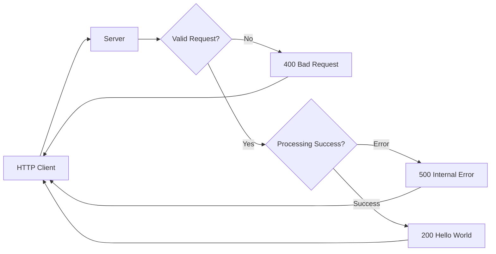
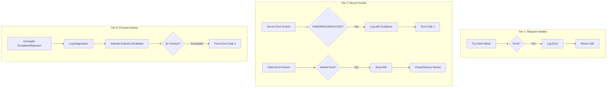
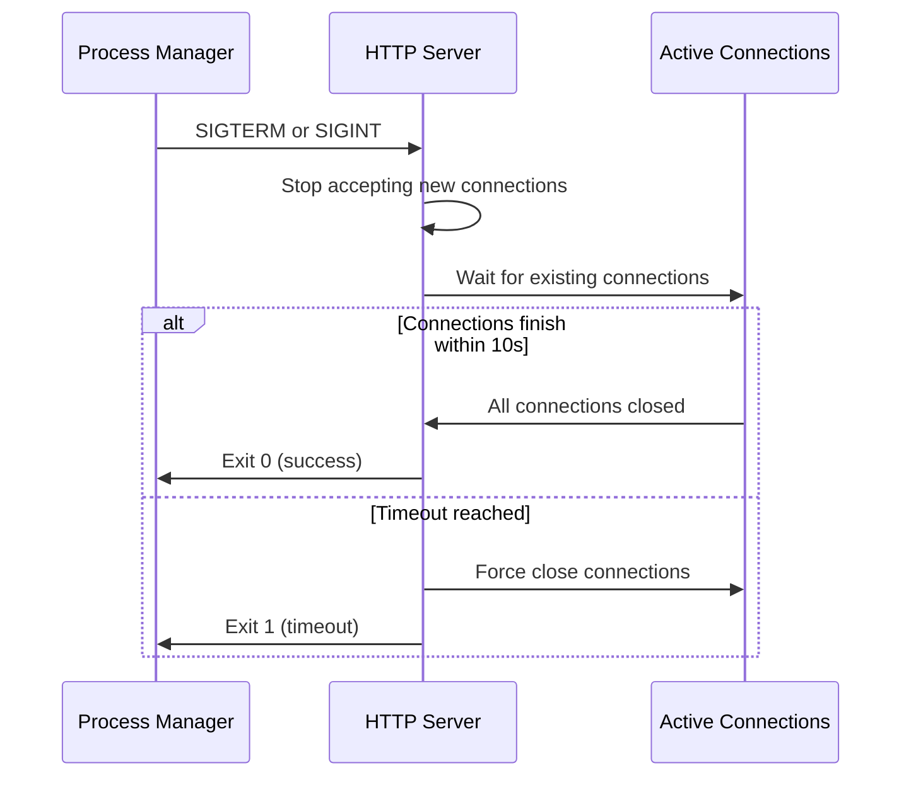

# hello_world - Node.js HTTP Server

 

## Overview

A minimal, production-ready Node.js HTTP server demonstrating enterprise-grade patterns for error handling, graceful shutdown, and process management. This server uses only Node.js built-in modules with zero external dependencies, providing a minimal attack surface and reproducible builds.

Originally created as "hao-backprop-test" for Backprop integration testing, this server also serves as a reference implementation demonstrating production-ready Node.js patterns for building robust, scalable HTTP services.

**Key Characteristics:**
- **Zero Dependencies**: Uses only Node.js built-in `http` module
- **Three-Tier Error Handling**: Request-level, server-level, and process-level error handling
- **Graceful Shutdown**: Connection draining with configurable timeout
- **Environment Configuration**: 12-factor app principles for deployment flexibility
- **Production-Ready**: Comprehensive logging, signal handling, and process resilience

## Features

- ✓ Simple HTTP server using Node.js built-in `http` module
- ✓ Request validation (returns 400 for invalid requests)
- ✓ Comprehensive error handling (three-tier architecture)
- ✓ Graceful shutdown with configurable timeout (10 seconds)
- ✓ Process resilience (handles uncaught exceptions and unhandled rejections)
- ✓ Environment-based configuration (HOST and PORT)
- ✓ Detailed logging for debugging and monitoring

## Prerequisites

**Required:**
- **Node.js**: v14.x or higher (tested with v20.19.5 LTS)
- **npm**: 10.x (bundled with Node.js)

**Optional:**
- **PM2**: For production process management
- **Docker**: For containerized deployment

**Verify your environment:**

```bash
# Check Node.js version
node --version
# Expected: v20.19.5 (or v14.x+)

# Check npm version
npm --version
# Expected: 10.x
```

## Installation & Setup

```bash
# Clone the repository (or navigate to project directory)
cd existing-projects-qa-test

# Install dependencies (verifies zero-dependency installation)
npm ci

# Verify installation by starting the server
node server.js
```

**Note:** Running `npm ci` verifies package integrity but installs no external dependencies. This project uses only Node.js built-in modules.

**View available npm scripts:**
```bash
npm run
```

This displays available npm scripts. The project intentionally has minimal scripts - only a placeholder test script. Verification procedures are documented in `blitzy/documentation/Technical Specifications.md`.

## Quick Start

**Start the server:**

```bash
node server.js
```

**Expected output:**
```
Server running at http://127.0.0.1:3000/
Press Ctrl+C to stop the server
```

**Test the server** (in another terminal):

```bash
curl http://127.0.0.1:3000/
```

**Expected response:**
```
Hello, World!
```

**Stop the server:**

- Press `Ctrl+C` for interactive shutdown
- Or send SIGTERM signal: `kill -SIGTERM <pid>`

## Configuration

The server is configured through environment variables following 12-factor app principles:

| Variable | Default | Type | Description |
|----------|---------|------|-------------|
| `HOST` | `127.0.0.1` | string | Server bind address. Set to `0.0.0.0` in production to accept connections from all network interfaces. Defaults to localhost for security. |
| `PORT` | `3000` | number | Server listen port. Ports below 1024 require elevated privileges on Unix systems. |

**Configuration Examples:**

```bash
# Bind to all network interfaces (production)
HOST=0.0.0.0 node server.js

# Use custom port
PORT=8080 node server.js

# Combined configuration
HOST=0.0.0.0 PORT=8080 node server.js
```

**Test Environment Variables:**

The following environment variables are available in the test environment but not currently used by the server implementation:
- `Api Key`
- `Token`
- `https://8008`

These appear to be test credentials/endpoints for integration testing context.

## Usage Examples

**Basic requests:**

```bash
# GET request (default method)
curl http://127.0.0.1:3000/

# POST request
curl -X POST http://127.0.0.1:3000/any/path

# GET request to different path
curl -X GET http://127.0.0.1:3000/different/path
```

**All requests return:**
```
Hello, World!
```

**Note:** This server intentionally responds to all HTTP methods and all paths with the same response, demonstrating simplicity and universal handler patterns.

## API Reference

### Universal Handler Endpoint

**Endpoint:** `/*` (all paths)  
**Methods:** All HTTP methods (GET, POST, PUT, DELETE, etc.)  
**Request Requirements:** Must have `req.method` and `req.url` properties

**Responses:**

| Status Code | Condition | Response Body |
|-------------|-----------|---------------|
| `200` | Valid request processed successfully | `Hello, World!\n` |
| `400` | Invalid request format (missing method or URL) | `Bad Request: Invalid request format\n` |
| `500` | Internal server error during request processing | `Internal Server Error\n` |

**Server-Level Errors** (prevent server startup):

| Error Code | Description | Action |
|------------|-------------|--------|
| `EADDRINUSE` | Port already in use by another process | Process exits with code 1. See Troubleshooting section. |
| `EACCES` | Permission denied (typically for privileged ports <1024) | Process exits with code 1. See Troubleshooting section. |

**Performance Target:** Response time < 5ms per request

**Implementation Details:**
- Request validation: `server.js` lines 14-19
- Response handling: `server.js` lines 21-24
- Error handling: `server.js` lines 25-36

## Architecture

### Design Philosophy

**Zero-Dependency Architecture:**  
This server uses only Node.js built-in `http` module to minimize attack surface, ensure reproducible builds, eliminate supply chain security risks, and maintain complete control over behavior.

**12-Factor App Configuration:**  
Environment variables (`HOST`, `PORT`) enable deployment-time configuration without code changes, following modern cloud-native application principles (server.js lines 3-6).

### Three-Tier Error Handling

The server implements a comprehensive three-tier error handling strategy to prevent crashes and ensure graceful degradation:

#### **Tier 1: Request-Level Error Handling** (server.js lines 11-37)

Catches synchronous errors during request processing using try-catch blocks:
- Validates request format (checks `req.method` and `req.url` presence)
- Returns HTTP 500 to client on processing errors
- Logs errors for debugging
- Prevents request errors from crashing the entire server process

#### **Tier 2: Server-Level Error Handling** (server.js lines 42-68)

Handles server and client connection errors using event handlers:

- **`server.on('error')`**: Handles server binding failures (EADDRINUSE, EACCES)
  - Provides specific guidance for common deployment errors
  - Exits process with code 1 to signal failure to process managers
  
- **`server.on('clientError')`**: Handles malformed requests and client connection errors
  - Sends HTTP 400 response if socket is writable
  - Destroys socket if not writable to prevent leaks
  - Prevents client errors from crashing server

#### **Tier 3: Process-Level Error Handling** (server.js lines 97-137)

Last-resort handlers for catastrophic errors:

- **`process.on('uncaughtException')`**: Catches uncaught exceptions
  - Logs detailed error information (name, message, stack trace)
  - Attempts graceful shutdown with 5-second timeout
  - Exits process (per Node.js best practice: do not continue in corrupted state)
  
- **`process.on('unhandledRejection')`**: Catches unhandled promise rejections
  - Logs rejection reason and promise details
  - Treats as critical error (prevents silent failures and data corruption)
  - Attempts graceful shutdown with 5-second timeout

### Request Flow Diagram



### Error Handling Tiers Diagram



### Graceful Shutdown Mechanism

The server implements graceful shutdown to ensure zero-downtime deployments (server.js lines 72-88):

**Shutdown Process:**
1. Receive SIGTERM or SIGINT signal (kill command, Ctrl+C, systemd, Docker, Kubernetes)
2. Stop accepting new connections (`server.close()`)
3. Wait for existing connections to complete (up to 10 seconds)
4. Exit cleanly (code 0) if all connections drain successfully
5. Force exit (code 1) after 10-second timeout if connections don't close naturally



### Code Organization

| Component | Line Range | Purpose |
|-----------|------------|---------|
| Configuration | 5-6 | Environment variables (HOST, PORT) |
| Request Handler | 10-38 | HTTP request processing with validation and error handling |
| Server Error Handling | 42-54 | `server.on('error')` for binding failures |
| Client Error Handling | 58-68 | `server.on('clientError')` for malformed requests |
| Graceful Shutdown | 72-88 | `gracefulShutdown()` function with 10-second timeout |
| Signal Handlers | 92-93 | SIGTERM and SIGINT process handlers |
| Uncaught Exception Handler | 97-115 | Last-resort error handler with 5-second timeout |
| Unhandled Rejection Handler | 119-137 | Async error handler with 5-second timeout |
| Server Startup | 140-143 | Server initialization and listening |

## Deployment

### 10.1 Standalone Node.js

**Development (foreground):**

```bash
node server.js
```

**Production (background with PID tracking):**

```bash
# Start in background, redirect logs
nohup node server.js > server.log 2>&1 &

# Save PID for later management
echo $! > server.pid

# Stop gracefully
kill -SIGTERM $(cat server.pid)

# View logs
tail -f server.log
```

### 10.2 PM2 Process Manager

**Installation:**

```bash
npm install -g pm2
```

**Start server:**

```bash
pm2 start server.js --name hello-world
```

**Ecosystem configuration** (`ecosystem.config.js`):

```javascript
module.exports = {
  apps: [{
    name: 'hello-world',
    script: './server.js',
    instances: 2,
    exec_mode: 'cluster',
    env: {
      NODE_ENV: 'production',
      HOST: '0.0.0.0',
      PORT: 3000
    },
    max_memory_restart: '100M',
    error_file: './logs/error.log',
    out_file: './logs/output.log',
    time: true
  }]
};
```

**PM2 Commands:**

```bash
# Start with ecosystem file
pm2 start ecosystem.config.js

# View status
pm2 status

# View logs
pm2 logs hello-world

# Restart
pm2 restart hello-world

# Stop
pm2 stop hello-world

# Remove from PM2
pm2 delete hello-world

# Save process list
pm2 save

# Auto-start on system boot
pm2 startup
```

### 10.3 systemd Service

**Create service file** `/etc/systemd/system/hello-world.service`:

```ini
[Unit]
Description=Hello World Node.js HTTP Server
Documentation=https://github.com/yourrepo/hello-world
After=network.target

[Service]
Type=simple
User=nodejs
Group=nodejs
WorkingDirectory=/opt/hello-world
Environment="NODE_ENV=production"
Environment="HOST=0.0.0.0"
Environment="PORT=3000"
ExecStart=/usr/bin/node /opt/hello-world/server.js
Restart=on-failure
RestartSec=10
StandardOutput=journal
StandardError=journal
SyslogIdentifier=hello-world

# Security hardening
NoNewPrivileges=true
PrivateTmp=true
ProtectSystem=strict
ProtectHome=true
ReadWritePaths=/opt/hello-world

[Install]
WantedBy=multi-user.target
```

**systemd Commands:**

```bash
# Reload systemd configuration
sudo systemctl daemon-reload

# Enable service (auto-start on boot)
sudo systemctl enable hello-world

# Start service
sudo systemctl start hello-world

# Check status
sudo systemctl status hello-world

# View logs
sudo journalctl -u hello-world -f

# Stop service
sudo systemctl stop hello-world

# Restart service
sudo systemctl restart hello-world
```

### 10.4 Docker Container

**Dockerfile:**

```dockerfile
FROM node:20-alpine

# Create app directory
WORKDIR /usr/src/app

# Copy package files
COPY package*.json ./

# Install dependencies (npm ci for reproducible builds)
# Note: This project has zero dependencies, but we run npm ci for verification
RUN npm ci --only=production

# Copy application source
COPY server.js ./

# Expose port (must match PORT environment variable)
EXPOSE 3000

# Run as non-root user for security
USER node

# Health check (optional but recommended)
HEALTHCHECK --interval=30s --timeout=3s --start-period=5s --retries=3 \
  CMD node -e "require('http').get('http://localhost:3000/', (r) => { process.exit(r.statusCode === 200 ? 0 : 1); })"

# Start server
CMD ["node", "server.js"]
```

**Docker Commands:**

```bash
# Build image
docker build -t hello-world:latest .

# Run container (development)
docker run -d \
  --name hello-world \
  -p 3000:3000 \
  hello-world:latest

# Run container (production with custom configuration)
docker run -d \
  --name hello-world \
  -p 80:8080 \
  -e HOST=0.0.0.0 \
  -e PORT=8080 \
  --restart unless-stopped \
  hello-world:latest

# View logs
docker logs hello-world

# Follow logs
docker logs -f hello-world

# Stop container gracefully (sends SIGTERM)
docker stop hello-world

# Restart container
docker restart hello-world

# Remove container
docker rm hello-world
```

**Docker Compose** (`docker-compose.yml`):

```yaml
version: '3.8'

services:
  hello-world:
    build: .
    image: hello-world:latest
    container_name: hello-world
    environment:
      - HOST=0.0.0.0
      - PORT=3000
    ports:
      - "3000:3000"
    restart: unless-stopped
    healthcheck:
      test: ["CMD", "node", "-e", "require('http').get('http://localhost:3000/', (r) => { process.exit(r.statusCode === 200 ? 0 : 1); })"]
      interval: 30s
      timeout: 3s
      retries: 3
      start_period: 5s
```

```bash
# Start with Docker Compose
docker-compose up -d

# View logs
docker-compose logs -f

# Stop
docker-compose down
```

## Operations

### Graceful Shutdown Procedures

**Find process ID:**

```bash
ps aux | grep "node server.js"
```

**Send SIGTERM (graceful shutdown):**

```bash
kill -SIGTERM <pid>
```

**Send SIGINT (Ctrl+C equivalent):**

```bash
kill -SIGINT <pid>
```

**Expected console output:**
```
SIGTERM received. Starting graceful shutdown...
Server closed. All connections finished.
```

**Timeout behavior:** If connections don't drain within 10 seconds, server forces exit with code 1.

### Process Management

**Start in background:**

```bash
node server.js > server.log 2>&1 &
```

**Stop gracefully:**

```bash
kill -SIGTERM $(pgrep -f "node server.js")
```

**Restart:**

```bash
# Stop existing process
kill -SIGTERM $(pgrep -f "node server.js")
# Wait for graceful shutdown (up to 10 seconds)
sleep 2
# Start new process
node server.js > server.log 2>&1 &
```

### Monitoring and Health Checks

**Health check endpoint:**

```bash
curl http://127.0.0.1:3000/
```

**Expected response:** HTTP 200 with body `Hello, World!`

**Performance Targets:**
- **Response Time:** < 5ms per request
- **Startup Time:** < 100ms
- **Memory Usage:** ≤ 30MB

**Log Monitoring:**

Console output includes:
- Server startup confirmation
- All error events (request, server, client, process)
- Graceful shutdown events
- Forced exit warnings

**Production log aggregation examples:**

```bash
# With PM2
pm2 logs hello-world

# With systemd
journalctl -u hello-world -f

# With Docker
docker logs -f hello-world
```

## Troubleshooting

### Common Issues

#### 12.1 EADDRINUSE - Port Already in Use

**Error message:**
```
Server error: listen EADDRINUSE: address already in use 0.0.0.0:3000
Port 3000 is already in use
```

**Diagnosis:**

```bash
# Find process using the port
lsof -i :3000

# Or on Linux
netstat -tulpn | grep :3000

# Or using ss
ss -tulpn | grep :3000
```

**Solutions:**

```bash
# Option 1: Kill the conflicting process
kill -SIGTERM <pid>

# Option 2: Force kill if graceful shutdown fails
kill -9 <pid>

# Option 3: Use a different port
PORT=3001 node server.js
```

#### 12.2 EACCES - Permission Denied

**Error message:**
```
Server error: listen EACCES: permission denied 0.0.0.0:80
Permission denied to bind to port 80
```

**Cause:** Ports below 1024 (privileged ports) require elevated privileges on Unix systems.

**Solutions:**

```bash
# Option 1: Use port above 1024 (recommended)
PORT=8080 node server.js

# Option 2: Use setcap to grant bind capability (Linux only)
# Allows specific Node.js binary to bind to privileged ports
sudo setcap 'cap_net_bind_service=+ep' $(which node)
node server.js  # Now works with PORT=80

# Option 3: Run as root (NOT recommended for production)
sudo node server.js

# Option 4: Use reverse proxy (recommended for production)
# Run server on high port (e.g., 3000) and use nginx/Apache to proxy port 80
```

#### 12.3 Server Not Responding

**Diagnosis:**

```bash
# Check if process is running
ps aux | grep "node server.js"

# Check if port is listening
netstat -tulpn | grep :3000
# Or
lsof -i :3000

# Test with verbose curl
curl -v http://127.0.0.1:3000/

# Check firewall rules (Linux)
sudo iptables -L -n

# Test from localhost vs. remote
curl http://127.0.0.1:3000/  # Localhost
curl http://<server-ip>:3000/  # Remote (requires HOST=0.0.0.0)
```

**Solutions:**

- Ensure server is running: `ps aux | grep node`
- Check server is binding to correct interface:
  - `HOST=127.0.0.1` only accepts localhost connections
  - `HOST=0.0.0.0` accepts connections from all interfaces
- Verify firewall allows traffic on the port
- Check logs for startup errors: `tail -f server.log`

#### 12.4 High Resource Usage

**Diagnosis:**

```bash
# Monitor with PM2
pm2 monit

# Check with top
top -p $(pgrep -f "node server.js")

# Check with htop (if installed)
htop -p $(pgrep -f "node server.js")

# View process details
ps -o pid,ppid,%cpu,%mem,vsz,rss,stat,start,time,command -p $(pgrep -f "node server.js")
```

**Check logs for errors:**

```bash
# Standalone
tail -f server.log

# PM2
pm2 logs hello-world --lines 100

# systemd
journalctl -u hello-world -n 100 -f

# Docker
docker logs hello-world --tail 100 -f
```

**Solutions:**

- Review logs for uncaught exceptions or unhandled rejections
- Check for connection leaks (should not occur with this implementation)
- Monitor request rate and consider load balancing
- Verify no infinite loops or memory leaks in request handler

### Debugging Techniques

**Enable verbose logging:**

```bash
# Add NODE_DEBUG environment variable
NODE_DEBUG=http node server.js
```

**Test graceful shutdown:**

```bash
# Start server
node server.js &
SERVER_PID=$!

# Test graceful shutdown
kill -SIGTERM $SERVER_PID

# Verify log output shows graceful shutdown messages
```

**Test error handling:**

```bash
# Test port conflict
node server.js &
node server.js  # Should fail with EADDRINUSE

# Test invalid request (requires crafting malformed HTTP)
# Server handles this automatically via clientError event
```

**Verify response times:**

```bash
# Test with curl timing
curl -w "@-" -o /dev/null -s http://127.0.0.1:3000/ <<'EOF'
    time_namelookup:  %{time_namelookup}\n
       time_connect:  %{time_connect}\n
    time_appconnect:  %{time_appconnect}\n
   time_pretransfer:  %{time_pretransfer}\n
      time_redirect:  %{time_redirect}\n
 time_starttransfer:  %{time_starttransfer}\n
                    ----------\n
         time_total:  %{time_total}\n
EOF
```

## Advanced Documentation

For detailed operational procedures, verification requirements, and Backprop integration details, see the authoritative documentation in the `blitzy/documentation/` directory:

- **[Project Guide.md](blitzy/documentation/Project%20Guide.md)**: Comprehensive operational runbook with detailed deployment scenarios, verification commands (5-test verification suite with expected 5/5 passing results), performance benchmarks and targets, troubleshooting procedures, commit metadata tracking, and quarterly review requirements for CI gating and Backprop integration.

- **[Technical Specifications.md](blitzy/documentation/Technical%20Specifications.md)**: Canonical remediation specifications, CI acceptance criteria, PR review requirements, branch naming conventions, platform support matrix (Linux, macOS, Windows), Node.js version compatibility (12+ minimum, 18/20 recommended), and Backprop integration context.

These documents serve as governance artifacts for continuous integration gating, automated analysis, and operational procedures. They provide the authoritative source for:
- Exact verification commands and expected results
- Performance baselines and acceptance criteria
- Platform-specific considerations and testing
- Integration with Backprop automated analysis
- PR metadata templates and review workflows

## Contributing

### Preservation Requirements

When contributing to this project, you **must preserve**:

1. **Zero-dependency policy**: No external packages may be added to `package.json` (dependencies or devDependencies)
2. **Existing inline comments**: All "Motive:" comments explain design rationale and must remain verbatim
3. **Error handling architecture**: Three-tier error handling (request, server, process) must be maintained
4. **Graceful shutdown behavior**: Connection draining with 10-second timeout must be preserved
5. **Test fixture compatibility**: Changes must not break Backprop integration or CI gating

### Code Change Requirements

When modifying `server.js`:

1. **Update JSDoc comments** immediately above modified functions
2. **Update README sections** corresponding to changes:
   - Configuration (for environment variables)
   - API Reference (for endpoint behavior)
   - Operations (for process management)
   - Troubleshooting (for error handling)
3. **Verify cross-references** remain accurate (line numbers, example outputs)
4. **Test all code examples** for accuracy
5. **Run verification suite** documented in `Technical Specifications.md`
6. **Ensure no new dependencies** are introduced

### Documentation Synchronization

Maintain consistency across all documentation:

- **Environment variable names and defaults** must match between JSDoc and README
- **Timeout values** must be identical across JSDoc, inline comments, and README
- **Error codes and status codes** must match implementation exactly
- **Performance targets** must align with values in Project Guide.md

### Testing Requirements

Before submitting changes:

```bash
# Verify server starts successfully
node server.js &
SERVER_PID=$!

# Test basic functionality
curl http://127.0.0.1:3000/
# Expected: "Hello, World!"

# Test graceful shutdown
kill -SIGTERM $SERVER_PID
wait $SERVER_PID
# Expected exit code: 0

# Run verification suite (see Technical Specifications.md)
npm ci
# Run 5-test verification suite as documented
```

## License

MIT License

Copyright (c) 2024 hxu

**Project:** hello_world v1.0.0

Permission is hereby granted, free of charge, to any person obtaining a copy of this software and associated documentation files (the "Software"), to deal in the Software without restriction, including without limitation the rights to use, copy, modify, merge, publish, distribute, sublicense, and/or sell copies of the Software, and to permit persons to whom the Software is furnished to do so, subject to the following conditions:

The above copyright notice and this permission notice shall be included in all copies or substantial portions of the Software.

THE SOFTWARE IS PROVIDED "AS IS", WITHOUT WARRANTY OF ANY KIND, EXPRESS OR IMPLIED, INCLUDING BUT NOT LIMITED TO THE WARRANTIES OF MERCHANTABILITY, FITNESS FOR A PARTICULAR PURPOSE AND NONINFRINGEMENT. IN NO EVENT SHALL THE AUTHORS OR COPYRIGHT HOLDERS BE LIABLE FOR ANY CLAIM, DAMAGES OR OTHER LIABILITY, WHETHER IN AN ACTION OF CONTRACT, TORT OR OTHERWISE, ARISING FROM, OUT OF OR IN CONNECTION WITH THE SOFTWARE OR THE USE OR OTHER DEALINGS IN THE SOFTWARE.

---

For complete license information, see `package.json`.
