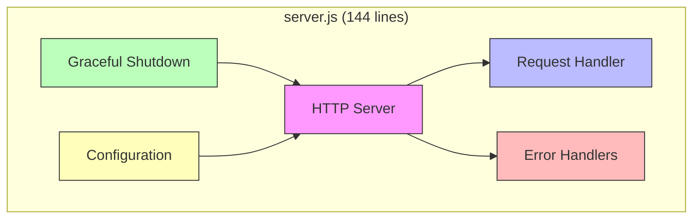
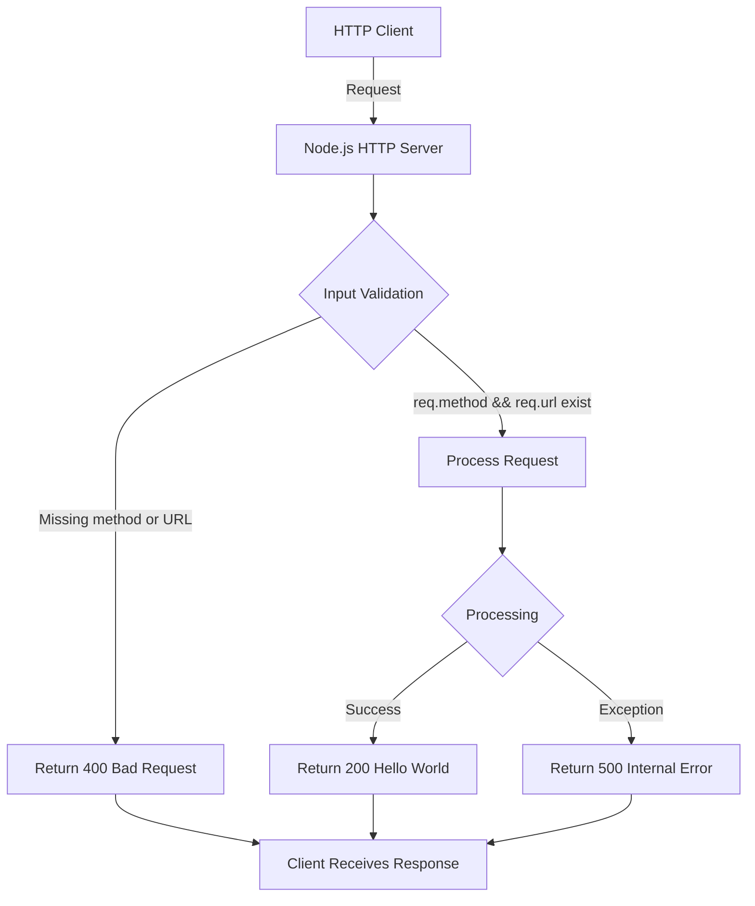
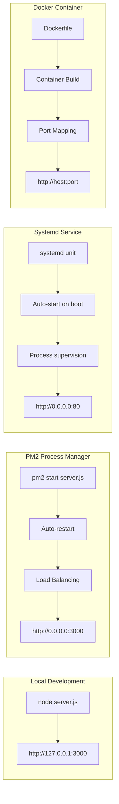

# hao-backprop-test

**Production-hardened Hello World HTTP server | Test project for backprop integration**

## Table of Contents

- [Overview](#overview)
- [Features](#features)
- [Architecture](#architecture)
- [Prerequisites](#prerequisites)
- [Installation](#installation)
- [Configuration](#configuration)
- [Usage](#usage)
- [API Documentation](#api-documentation)
- [Deployment](#deployment)
- [Graceful Shutdown](#graceful-shutdown)
- [Error Handling](#error-handling)
- [Troubleshooting](#troubleshooting)
- [Performance](#performance)
- [Development](#development)
- [License](#license)
- [Additional Resources](#additional-resources)

## Overview

This is a **production-hardened Hello World HTTP server** built with Node.js built-in modules. Originally created as a test project for backprop integration, it demonstrates enterprise-grade reliability patterns including comprehensive error handling, graceful shutdown support, and defensive input validation—all with **zero external dependencies**.

The server uses only Node.js built-in modules (`http` module) and implements production reliability features typically found in much more complex applications. This makes it an excellent reference implementation for production-ready Node.js servers.

**What it does**: Responds to all HTTP requests with "Hello, World!" while handling errors gracefully at every level (request, server, client, and process).

**Why it exists**: Demonstrates how to build reliable production services using only Node.js built-ins, serving as a test project for backprop integration while showcasing production hardening patterns.

**How to use it**: Run `node server.js` and test with `curl http://127.0.0.1:3000/` - it's that simple.

## Features

- ✅ **Comprehensive Error Handling**: Error boundaries at request level (try/catch), server level (binding failures), client level (malformed requests), and process level (uncaught exceptions and unhandled rejections)
- ✅ **Graceful Shutdown Support**: Responds to SIGTERM and SIGINT signals with connection draining and 10-second timeout
- ✅ **Input Validation**: Prevents null reference errors by validating request method and URL before processing
- ✅ **Zero External Dependencies**: Uses only Node.js built-in modules for maximum security and deployment simplicity
- ✅ **Production-Hardened**: Multiple defensive layers prevent crashes and ensure clean shutdown behavior

## Architecture

### Design Rationale

**Zero-Dependency Architecture**: This server intentionally uses **no external npm packages**, relying exclusively on Node.js built-in modules. This design decision provides:
- **Security**: Reduced attack surface with no supply chain vulnerabilities from third-party packages
- **Auditability**: All code is in a single 144-line file that can be fully audited in minutes
- **Deployment Simplicity**: No `node_modules` folder, faster deployments, smaller container images
- **Long-term Stability**: No dependency updates, no breaking changes from upstream packages

**Built-in HTTP Module vs Frameworks**: While frameworks like Express, Fastify, or Koa offer routing and middleware, this server demonstrates that Node.js built-ins are sufficient for simple use cases. The trade-off:
- **What we gain**: Zero dependencies, minimal complexity, maximum transparency
- **What we lose**: No routing, no middleware system, no request parsing utilities
- **When to use this approach**: Simple servers, learning projects, maximum security requirements

**Single-File Monolithic Structure**: All logic resides in one file (`server.js`) for:
- **Auditability**: Complete codebase review in one read
- **No Module Complexity**: No imports, no file organization decisions
- **Simplicity**: Perfect for learning and reference implementations

**Production Hardening Approach** (Defense in Depth):
1. **Input Validation**: Check `req.method` and `req.url` exist before use
2. **Request Error Boundaries**: Wrap request handling in try/catch
3. **Server Error Handling**: Handle EADDRINUSE, EACCES binding failures
4. **Client Error Handling**: Handle malformed requests gracefully
5. **Process Error Handlers**: Catch uncaught exceptions and unhandled rejections
6. **Graceful Shutdown**: Drain connections on SIGTERM/SIGINT

### Component Architecture



## Prerequisites

- **Node.js**: Version 12+ (tested on Node.js 20.19.5 LTS)
- **npm**: Version 7+ (comes with Node.js)
- **Operating System**: Any (Linux, macOS, Windows)
- **No Additional Dependencies**: Zero external packages required

Download Node.js from the [Node.js official website](https://nodejs.org/en/download/).

## Installation

```bash
# Clone or download the repository
git clone <repository-url>
cd existing-projects-qa-test

# Install dependencies (none exist, but this verifies package.json)
npm ci

# Start the server
node server.js
```

Expected output:
```
Server running at http://127.0.0.1:3000/
Press Ctrl+C to stop the server
```

## Configuration

The server is configured via environment variables following the [12-factor app](https://12factor.net/config) methodology.

### Environment Variables

| Variable | Type | Default | Valid Values | Description |
|----------|------|---------|--------------|-------------|
| `HOST` | string | `127.0.0.1` | Any valid hostname or IP | Server bind address. Use `127.0.0.1` for localhost-only (development), or `0.0.0.0` for all network interfaces (production) |
| `PORT` | number | `3000` | 1-65535 | Server bind port. Ports 1-1024 require elevated permissions |

### Configuration Examples

**Linux/macOS:**
```bash
# Development (default - localhost only)
node server.js

# Production (bind to all interfaces)
HOST=0.0.0.0 PORT=8080 node server.js

# Custom port
PORT=8080 node server.js
```

**Windows CMD:**
```cmd
set HOST=0.0.0.0
set PORT=8080
node server.js
```

**Windows PowerShell:**
```powershell
$env:HOST="0.0.0.0"
$env:PORT="8080"
node server.js
```

### Security Considerations

- **127.0.0.1 vs 0.0.0.0**: 
  - `127.0.0.1`: Server only accepts connections from localhost (more secure for development)
  - `0.0.0.0`: Server accepts connections from any network interface (required for production)
  
- **Privileged Ports** (1-1024): Require elevated permissions (sudo/root). Recommended to use ports ≥1024 for security.

## Usage

### Quick Start

```bash
# Start the server
node server.js
```

### Testing the Server

```bash
# Basic GET request
curl http://127.0.0.1:3000/

# Expected response:
# Hello, World!

# Test with different HTTP methods (all work)
curl -X POST http://127.0.0.1:3000/
curl -X PUT http://127.0.0.1:3000/any-path
curl -X DELETE http://127.0.0.1:3000/test
```

### Stopping the Server

Press `Ctrl+C` in the terminal where the server is running. This triggers a graceful shutdown:

```
^C
SIGINT received. Starting graceful shutdown...
Server closed. All connections finished.
```

## API Documentation

### Endpoint Specification

The server provides a single universal endpoint that accepts all HTTP methods and paths.

**Endpoint**: `http://{HOST}:{PORT}/*`  
**Methods**: ALL (GET, POST, PUT, DELETE, PATCH, HEAD, OPTIONS, etc.)  
**Paths**: ALL (/, /api, /test, etc.)

### Request Format

**Required Headers**: None  
**Required Body**: None  
**Input Validation**: Server validates that `req.method` and `req.url` properties exist

### Response Formats

#### Success Response (200)

```http
HTTP/1.1 200 OK
Content-Type: text/plain

Hello, World!
```

**When**: Valid HTTP request with method and URL present

#### Bad Request (400)

```http
HTTP/1.1 400 Bad Request
Content-Type: text/plain

Bad Request: Invalid request format
```

**When**: Request missing `method` or `url` properties (malformed request)

#### Internal Server Error (500)

```http
HTTP/1.1 500 Internal Server Error
Content-Type: text/plain

Internal Server Error
```

**When**: Uncaught exception during request processing

### Status Codes

| Code | Status | Description |
|------|--------|-------------|
| 200 | OK | Successful request, returns "Hello, World!" |
| 400 | Bad Request | Malformed request (missing method or URL) |
| 500 | Internal Server Error | Uncaught exception during processing |

### API Examples

**Successful GET request:**
```bash
$ curl http://127.0.0.1:3000/
Hello, World!
```

**Successful POST request:**
```bash
$ curl -X POST http://127.0.0.1:3000/api/test
Hello, World!
```

**Testing with different paths (all return same response):**
```bash
$ curl http://127.0.0.1:3000/anything
Hello, World!
```

### Request Flow



## Deployment

### Local/Development Deployment

**Best for**: Local development and testing

```bash
# Start on localhost (127.0.0.1:3000)
node server.js

# Or with custom configuration
HOST=127.0.0.1 PORT=3000 node server.js
```

### PM2 Process Manager

**Best for**: Production deployments with auto-restart and process monitoring

```bash
# Install PM2 globally (one-time)
npm install -g pm2

# Start server with PM2
pm2 start server.js --name hello-server

# Configure auto-start on system boot
pm2 startup
pm2 save

# Monitor logs
pm2 logs hello-server

# Stop server
pm2 stop hello-server
pm2 delete hello-server
```

### systemd Service

**Best for**: Linux production servers with systemd

Create `/etc/systemd/system/hello-server.service`:

```ini
[Unit]
Description=Hello World HTTP Server
After=network.target

[Service]
Type=simple
User=nodejs
WorkingDirectory=/opt/hello-server
Environment=HOST=0.0.0.0
Environment=PORT=3000
ExecStart=/usr/bin/node server.js
Restart=always
RestartSec=10

[Install]
WantedBy=multi-user.target
```

**Commands:**
```bash
# Enable and start service
sudo systemctl enable hello-server
sudo systemctl start hello-server

# Check status
sudo systemctl status hello-server

# View logs
sudo journalctl -u hello-server -f

# Stop service
sudo systemctl stop hello-server
```

### Docker Container

**Best for**: Containerized deployments, Kubernetes, Docker Swarm

**Dockerfile:**
```dockerfile
FROM node:20-alpine
WORKDIR /app
COPY package*.json ./
RUN npm ci --only=production
COPY server.js ./
EXPOSE 3000
CMD ["node", "server.js"]
```

**Commands:**
```bash
# Build image
docker build -t hello-server:1.0.0 .

# Run container
docker run -d \
  --name hello-server \
  -p 3000:3000 \
  -e HOST=0.0.0.0 \
  -e PORT=3000 \
  --restart unless-stopped \
  hello-server:1.0.0

# View logs
docker logs -f hello-server

# Stop container
docker stop hello-server
docker rm hello-server
```

### Deployment Options Comparison



For comprehensive deployment procedures and operational runbooks, see [Project Guide](blitzy/documentation/Project Guide.md).

## Graceful Shutdown

The server implements graceful shutdown to support **zero-downtime deployments** and prevent client errors during server restarts.

### How It Works

**Signal Handling**: The server listens for operating system signals:
- **SIGTERM**: Sent by Docker stop, systemd service stop, or `kill <PID>` command
- **SIGINT**: Sent by Ctrl+C in terminal or `kill -2 <PID>` command

### Shutdown Sequence


### Behavior Details

1. **Stop Accepting New Connections**: `server.close()` called immediately
2. **Drain Existing Connections**: Server waits for active requests to complete
3. **Clean Exit (0)**: If all connections close within 10 seconds, exit with code 0
4. **Forced Exit (1)**: If timeout expires after 10 seconds, force exit with code 1

### Exit Codes

| Code | Meaning | Scenario |
|------|---------|----------|
| 0 | Clean shutdown | All connections drained successfully |
| 1 | Forced shutdown | Timeout expired or error occurred |

### Testing Graceful Shutdown

```bash
# Start server
node server.js &
SERVER_PID=$!

# Send SIGTERM
kill -TERM $SERVER_PID

# Or send SIGINT (Ctrl+C equivalent)
kill -INT $SERVER_PID
```

**Implementation**: Source code at [server.js lines 72-88](server.js#L72-L88)

## Error Handling

The server implements **defense in depth** with error handling at four distinct layers, ensuring no error can crash the server unexpectedly.

### Error Handling Architecture

```mermaid
graph TB
    subgraph "Request Errors"
        A[Request Processing] --> B{Error Occurs?}
        B -->|Sync Error| C[try/catch]
        C --> D[Log Error]
        D --> E{Headers Sent?}
        E -->|No| F[Send 500 Response]
        E -->|Yes| G[Cannot Send Response]
    end
    
    subgraph "Server Errors"
        H[Server Start] --> I{Binding Error?}
        I -->|EADDRINUSE| J[Log Port In Use]
        I -->|EACCES| K[Log Permission Denied]
        J --> L[exit 1]
        K --> L
    end
    
    subgraph "Client Errors"
        M[Client Connection] --> N{Malformed?}
        N -->|Yes| O{Socket Writable?}
        O -->|Yes| P[Send 400 HTTP]
        O -->|No| Q[Destroy Socket]
    end
    
    subgraph "Process Errors"
        R[Uncaught Exception] --> S[Log Full Stack]
        T[Unhandled Rejection] --> U[Log Promise + Reason]
        S --> V[Graceful Shutdown]
        U --> V
        V --> W{Closes in 5s?}
        W -->|Yes| X[exit 1]
        W -->|No| Y[Force exit 1]
    end
```



### Layer 1: Request-Level Errors

**Where**: Inside request handler ([server.js lines 11-37](server.js#L11-L37))  
**Handles**: Synchronous errors during request processing  
**Response**: Returns 500 Internal Server Error to client  
**Behavior**: Server continues running, only affected request fails

```javascript
try {
  // Request processing with input validation
  if (!req.method || !req.url) {
    // Return 400 for invalid requests
  }
  // Return 200 for valid requests
} catch (error) {
  // Log error and return 500
}
```

### Layer 2: Server-Level Errors

**Where**: `server.on('error')` handler ([server.js lines 42-54](server.js#L42-L54))  
**Handles**: Server binding failures (EADDRINUSE, EACCES)  
**Response**: Logs specific error message and exits with code 1  
**Behavior**: Server cannot start, process terminates

**Common Error Codes**:
- `EADDRINUSE`: Port already in use by another process
- `EACCES`: Permission denied (privileged port without sudo)

### Layer 3: Client-Level Errors

**Where**: `server.on('clientError')` handler ([server.js lines 58-68](server.js#L58-L68))  
**Handles**: Malformed HTTP requests or client connection errors  
**Response**: Sends HTTP 400 response if socket writable, otherwise destroys socket  
**Behavior**: Server continues running, only affected connection terminates

### Layer 4: Process-Level Errors

**Where**: `process.on('uncaughtException')` and `process.on('unhandledRejection')` ([server.js lines 97-137](server.js#L97-L137))  
**Handles**: Uncaught exceptions and promise rejections that slip through other layers  
**Response**: Logs full error details, attempts graceful shutdown, forces exit after 5 seconds  
**Behavior**: Server terminates (per Node.js best practices, never continue after uncaught exception)

## Troubleshooting

### Port Already in Use (EADDRINUSE)

**Error Message:**
```
Server error: listen EADDRINUSE: address already in use 127.0.0.1:3000
Port 3000 is already in use
```

**Cause**: Another process is already using port 3000

**Solutions**:

1. **Find the process using the port:**
   ```bash
   # Linux/macOS
   lsof -i :3000
   
   # Or using netstat
   netstat -tuln | grep 3000
   
   # Windows
   netstat -ano | findstr :3000
   ```

2. **Kill the existing process:**
   ```bash
   # Linux/macOS
   kill -9 <PID>
   
   # Windows
   taskkill /PID <PID> /F
   ```

3. **Or use a different port:**
   ```bash
   PORT=3001 node server.js
   ```

### Permission Denied (EACCES)

**Error Message:**
```
Server error: listen EACCES: permission denied 0.0.0.0:80
Permission denied to bind to port 80
```

**Cause**: Attempting to bind to privileged port (<1024) without elevated permissions

**Solutions**:

1. **Use a non-privileged port (≥1024):**
   ```bash
   PORT=8080 node server.js
   ```

2. **Or run with elevated permissions (not recommended):**
   ```bash
   sudo node server.js
   ```

3. **Or configure port forwarding (recommended for production):**
   ```bash
   # Use iptables to forward port 80 to 3000
   sudo iptables -t nat -A PREROUTING -p tcp --dport 80 -j REDIRECT --to-port 3000
   ```

### Connection Refused

**Symptoms**: `curl: (7) Failed to connect to 127.0.0.1 port 3000: Connection refused`

**Causes and Solutions**:

1. **Server not running**: Check if server started successfully
   ```bash
   ps aux | grep node
   ```

2. **Wrong host binding**: Server bound to 127.0.0.1 but accessing from different machine
   ```bash
   # Bind to all interfaces
   HOST=0.0.0.0 node server.js
   ```

3. **Firewall blocking connections**: Check firewall rules
   ```bash
   # Linux - check if port is open
   sudo ufw status
   sudo ufw allow 3000
   ```

### Graceful Shutdown Hangs

**Symptoms**: After Ctrl+C, server shows "Starting graceful shutdown..." but hangs for 10 seconds

**Cause**: Active connections not closing within timeout

**Explanation**: This is normal behavior. Server waits up to 10 seconds for connections to drain before forcing shutdown.

**How to verify**:
```bash
# Check for active connections
lsof -i :3000
netstat -an | grep :3000
```

**Normal shutdown time**: 0-10 seconds depending on active connections

### Cannot Find Module Errors

**Error Message:**
```
Error: Cannot find module 'http'
```

**Cause**: Node.js not properly installed or corrupted

**Solution**:
```bash
# Verify Node.js installation
node --version
npm --version

# Reinstall Node.js if needed
# Download from https://nodejs.org/
```

## Performance

Expected performance characteristics based on testing documented in [Project Guide](blitzy/documentation/Project Guide.md):

| Metric | Value | Notes |
|--------|-------|-------|
| **Startup Time** | <100ms | Time from `node server.js` to listening |
| **Response Latency** | <5ms | Time from request receipt to response sent (p95) |
| **Memory Footprint** | ~30MB RSS | Resident Set Size under normal load |
| **Throughput** | Thousands of req/s | Limited by Node.js single-threaded event loop |

**Tested Environment**: Node.js 20.19.5 LTS on Linux

**Performance Notes**:
- Single-threaded: Use cluster module or PM2 cluster mode for multi-core utilization
- No database: Response time is pure compute (Hello World string generation)
- Zero dependencies: Minimal memory overhead from external packages

## Development

### Testing

**Current Status**: No automated tests implemented

The `package.json` test script intentionally fails:
```bash
$ npm test
Error: no test specified
```

**Future Testing**: Consider adding tests with Node.js built-in `assert` module to maintain zero-dependency philosophy.

### Contributing

When contributing to this project, please:

1. **Preserve Inline Comment Style**: Maintain the "Motive:" prefix pattern explaining architectural decisions
2. **Maintain Zero Dependencies**: Do not add external npm packages
3. **Focus on Production Hardening**: All changes should improve reliability and error handling
4. **Test All Error Paths**: Verify error handling at all four layers

### Code Review Focus Areas

- **Error Handling**: Verify all error paths are covered
- **Security**: Validate input, prevent injection attacks
- **Resource Cleanup**: Ensure sockets and connections are properly closed
- **Documentation**: Update README if behavior changes

## License

This project is licensed under the **MIT License**.

**Author**: hxu  
**Version**: 1.0.0

See the [MIT License](https://opensource.org/licenses/MIT) for full license text.

## Additional Resources

- **[Project Guide](blitzy/documentation/Project Guide.md)**: Comprehensive operational procedures, deployment instructions, diagnostic commands, and performance expectations
- **[Technical Specifications](blitzy/documentation/Technical Specifications.md)**: Root cause analysis, remediation plan, implementation details, and compatibility constraints
- **[Node.js HTTP Module Documentation](https://nodejs.org/api/http.html)**: Official documentation for the built-in http module
- **[Node.js Process Documentation](https://nodejs.org/api/process.html)**: Official documentation for process signals and error handling
- **[12-Factor App Methodology](https://12factor.net/)**: Best practices for building modern web applications

---

**Note**: This is a test project for backprop integration. While it demonstrates production-ready patterns, it is not intended for production use without proper security hardening (authentication, rate limiting, TLS, etc.).
