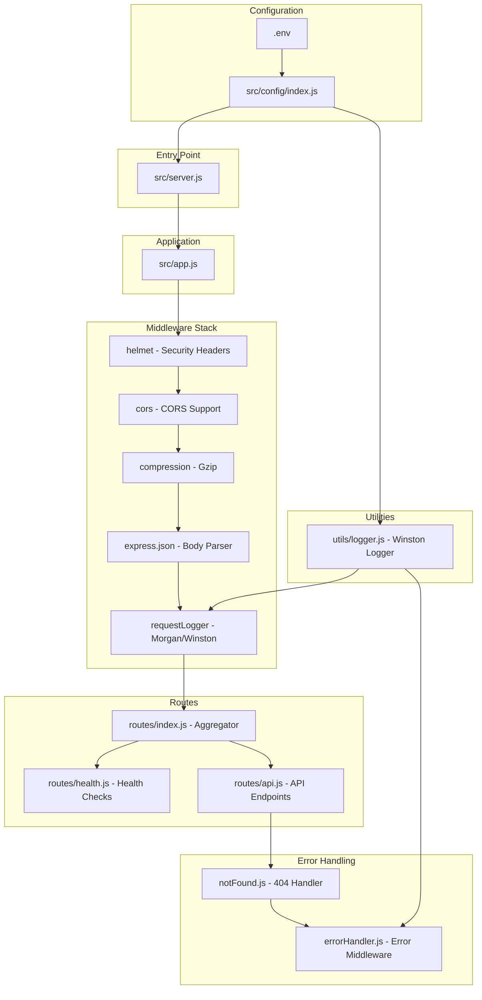
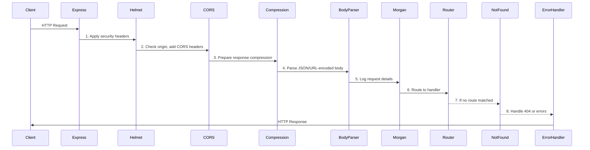
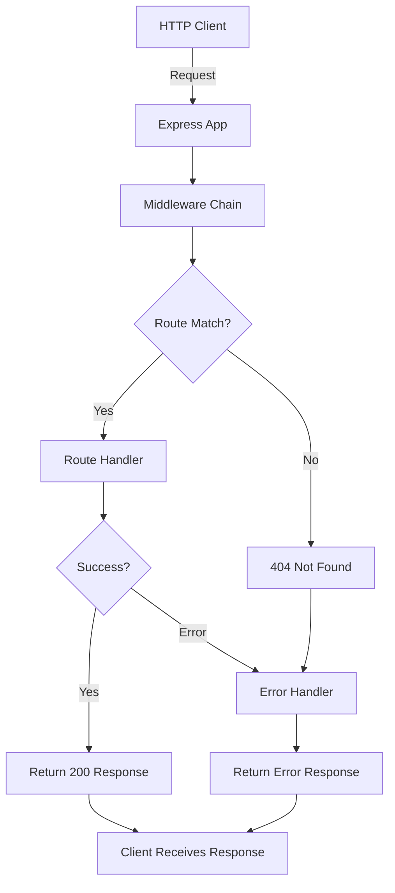
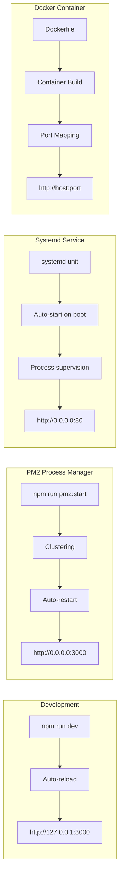
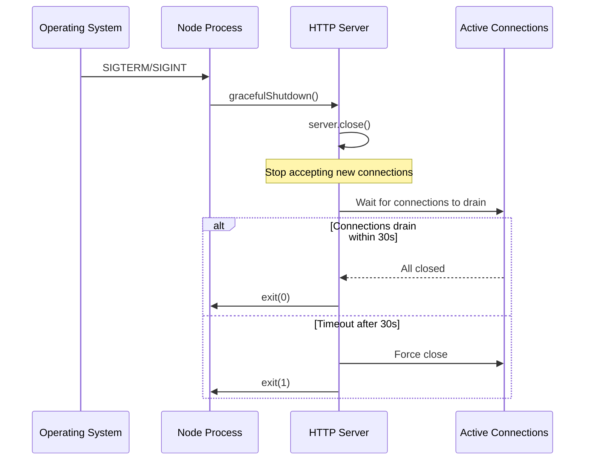

# hao-backprop-test

**Production-ready Express.js HTTP server | Test project for backprop integration**

## Table of Contents

- [Overview](#overview)
- [Features](#features)
- [Project Structure](#project-structure)
- [Architecture](#architecture)
- [Middleware Pipeline](#middleware-pipeline)
- [Prerequisites](#prerequisites)
- [Installation](#installation)
- [Configuration](#configuration)
- [NPM Scripts](#npm-scripts)
- [Usage](#usage)
- [API Documentation](#api-documentation)
- [Deployment](#deployment)
- [PM2 Process Management](#pm2-process-management)
- [Graceful Shutdown](#graceful-shutdown)
- [Error Handling](#error-handling)
- [Troubleshooting](#troubleshooting)
- [Performance](#performance)
- [Development](#development)
- [License](#license)
- [Additional Resources](#additional-resources)

## Overview

This is a **production-ready Express.js HTTP server** built with enterprise-grade reliability patterns. Originally created as a test project for backprop integration, it demonstrates comprehensive error handling, graceful shutdown support, structured logging, and security middleware.

The server uses the Express.js framework with a modular architecture, featuring a well-organized middleware stack (helmet, cors, compression, morgan), Winston logging, and PM2 process management support for production deployments.

**What it does**: Provides multiple HTTP endpoints including health checks, request echoing, and server information while handling errors gracefully at every level (request, server, client, and process).

**Why it exists**: Demonstrates how to build reliable production Express.js services with proper middleware architecture, serving as a test project for backprop integration while showcasing production hardening patterns.

**How to use it**: Run `npm install` followed by `npm start` and test with `curl http://127.0.0.1:3000/` - it's that simple.

## Features

- ✅ **Express.js Framework**: Modern web application framework with robust routing and middleware support
- ✅ **Security Middleware**: Helmet for security headers, CORS for cross-origin requests
- ✅ **Structured Logging**: Winston logger with console and file transports, Morgan HTTP request logging
- ✅ **Response Compression**: Gzip compression middleware for optimized response sizes
- ✅ **Environment Configuration**: Dotenv-based configuration with validation
- ✅ **Comprehensive Error Handling**: Centralized error middleware with development/production modes
- ✅ **Graceful Shutdown Support**: Responds to SIGTERM and SIGINT signals with connection draining and 30-second timeout
- ✅ **PM2 Ready**: Ecosystem configuration for production clustering and process management
- ✅ **Health Checks**: Detailed health endpoint with memory and uptime metrics

## Project Structure

```
existing-projects-qa-test/
├── src/
│   ├── app.js                    # Express application factory
│   ├── server.js                 # Server bootstrap and lifecycle management
│   ├── config/
│   │   └── index.js              # Environment configuration loader
│   ├── routes/
│   │   ├── index.js              # Route aggregator
│   │   ├── health.js             # Health check endpoint
│   │   └── api.js                # API routes (echo, info)
│   ├── middleware/
│   │   ├── errorHandler.js       # Express error handling middleware
│   │   ├── requestLogger.js      # Morgan + Winston integration
│   │   └── notFound.js           # 404 Not Found handler
│   └── utils/
│       └── logger.js             # Winston logger configuration
├── logs/                         # Log files (created at runtime)
│   ├── combined.log              # All logs
│   └── error.log                 # Error logs only
├── package.json                  # Package manifest with dependencies
├── package-lock.json             # Dependency lock file
├── ecosystem.config.js           # PM2 process manager configuration
├── .env                          # Environment variables (development)
├── .env.example                  # Environment variable template
├── .gitignore                    # Git ignore patterns
├── README.md                     # This documentation
└── blitzy/
    └── documentation/
        ├── Project Guide.md
        └── Technical Specifications.md
```

## Architecture

### Design Rationale

**Express.js Framework**: This server uses the Express.js framework for its mature ecosystem, extensive middleware support, and production-proven reliability. This design decision provides:
- **Robust Routing**: Declarative route definitions with Express Router
- **Middleware Architecture**: Composable middleware for cross-cutting concerns
- **Community Support**: Extensive ecosystem of tested middleware packages
- **Performance**: Optimized request handling with minimal overhead

**Modular Architecture**: The application follows separation of concerns with dedicated modules:
- **Routes**: Endpoint definitions separated from business logic
- **Middleware**: Reusable middleware for logging, errors, security
- **Configuration**: Centralized environment-based settings
- **Utilities**: Shared services like logging

**Production Hardening Approach** (Defense in Depth):
1. **Security Headers**: Helmet middleware sets secure HTTP headers
2. **CORS Protection**: Configurable cross-origin request handling
3. **Request Logging**: Morgan/Winston integration for audit trails
4. **Centralized Errors**: Express error middleware catches all errors
5. **Process Management**: PM2 clustering for high availability
6. **Graceful Shutdown**: Connection draining on SIGTERM/SIGINT

### Component Architecture



### Application Factory Pattern

The application uses a factory pattern in `src/app.js` that:
- Creates and configures the Express application
- Applies middleware in the correct order
- Mounts route modules
- Configures error handling

This pattern enables:
- **Testability**: Create fresh app instances for testing
- **Separation**: Decouples app configuration from server lifecycle
- **Flexibility**: Easy to modify middleware order or add new features

## Middleware Pipeline

The server implements a structured middleware pipeline that processes requests in a specific order. Understanding this pipeline is essential for debugging and extending the application.

### Middleware Execution Order



### Middleware Stack Details

| Order | Middleware | Package | Purpose |
|-------|------------|---------|---------|
| 1 | **Helmet** | `helmet` | Sets security HTTP headers (CSP, X-Frame-Options, X-XSS-Protection, etc.) |
| 2 | **CORS** | `cors` | Handles Cross-Origin Resource Sharing headers and preflight requests |
| 3 | **Compression** | `compression` | Gzip compresses response bodies for faster transfer |
| 4 | **Body Parser** | `express.json()` | Parses JSON request bodies (with size limits) |
| 5 | **Request Logger** | `morgan` + `winston` | Logs HTTP requests with method, URL, status, response time |
| 6 | **Routes** | Express Router | Matches URL patterns to route handlers |
| 7 | **Not Found** | Custom | Catches unmatched routes, returns 404 error |
| 8 | **Error Handler** | Custom | Catches all errors, returns structured JSON response |

### Security Headers (Helmet)

Helmet automatically sets these security headers:
- `Content-Security-Policy`: Prevents XSS attacks
- `X-Frame-Options`: Prevents clickjacking
- `X-Content-Type-Options`: Prevents MIME sniffing
- `Strict-Transport-Security`: Enforces HTTPS
- `X-XSS-Protection`: Additional XSS protection

### CORS Configuration

The CORS middleware is configured to:
- Allow specified origins in production
- Allow all origins in development (default)
- Handle preflight OPTIONS requests
- Set appropriate Access-Control-* headers

### Logging Pipeline

Request logging uses Morgan integrated with Winston:
- **Morgan**: Captures HTTP request details (method, URL, status, response time)
- **Winston**: Writes logs to console (development) and files (production)
- **Format**: Combined format in production, dev format in development

## Prerequisites

- **Node.js**: Version 18.0.0 or higher (LTS recommended, tested on Node.js 20.x)
- **npm**: Version 8+ (comes with Node.js)
- **Operating System**: Any (Linux, macOS, Windows)
- **PM2** (optional): For production process management

Download Node.js from the [Node.js official website](https://nodejs.org/en/download/).

## Installation

```bash
# Clone or download the repository
git clone <repository-url>
cd existing-projects-qa-test

# Install dependencies
npm install

# Create environment file (optional - defaults are provided)
cp .env.example .env

# Start the server
npm start
```

Expected output:
```
[2024-01-15T10:30:00.000Z] info: Server running at http://0.0.0.0:3000
[2024-01-15T10:30:00.000Z] info: Press Ctrl+C to stop the server
```

### Quick Install (One-liner)

```bash
npm install && npm start
```

## Configuration

The server is configured via environment variables following the [12-factor app](https://12factor.net/config) methodology. Environment variables can be set in a `.env` file for local development.

### Environment Variables

| Variable | Type | Default | Valid Values | Description |
|----------|------|---------|--------------|-------------|
| `NODE_ENV` | string | `development` | `development`, `production`, `test` | Environment mode. Affects logging verbosity and error details |
| `PORT` | number | `3000` | 1-65535 | Server bind port. Ports 1-1024 require elevated permissions |
| `HOST` | string | `0.0.0.0` | Any valid hostname or IP | Server bind address. Use `127.0.0.1` for localhost-only, `0.0.0.0` for all interfaces |
| `LOG_LEVEL` | string | `info` | `error`, `warn`, `info`, `http`, `verbose`, `debug`, `silly` | Winston logging level. Lower levels include all higher levels |

### Environment File Examples

**.env (Development)**:
```bash
NODE_ENV=development
PORT=3000
HOST=0.0.0.0
LOG_LEVEL=debug
```

**.env (Production)**:
```bash
NODE_ENV=production
PORT=8080
HOST=0.0.0.0
LOG_LEVEL=info
```

### Configuration Examples

**Linux/macOS:**
```bash
# Development (uses .env file)
npm run dev

# Production with custom settings
NODE_ENV=production PORT=8080 npm start

# Custom port only
PORT=8080 npm start
```

**Windows CMD:**
```cmd
set NODE_ENV=production
set PORT=8080
npm start
```

**Windows PowerShell:**
```powershell
$env:NODE_ENV="production"
$env:PORT="8080"
npm start
```

### Security Considerations

- **127.0.0.1 vs 0.0.0.0**: 
  - `127.0.0.1`: Server only accepts connections from localhost (more secure for development)
  - `0.0.0.0`: Server accepts connections from any network interface (required for production)
  
- **Privileged Ports** (1-1024): Require elevated permissions (sudo/root). Recommended to use ports ≥1024 for security.

- **NODE_ENV=production**: Enables security features and disables verbose error messages

## NPM Scripts

The following npm scripts are available for development and production workflows:

| Script | Command | Description |
|--------|---------|-------------|
| `npm start` | `node src/server.js` | Start the server in production mode |
| `npm run dev` | `nodemon src/server.js` | Start with auto-reload for development |
| `npm run start:prod` | `NODE_ENV=production node src/server.js` | Start explicitly in production mode |
| `npm run pm2:start` | `pm2 start ecosystem.config.js` | Start with PM2 process manager |
| `npm run pm2:stop` | `pm2 stop ecosystem.config.js` | Stop PM2 managed processes |
| `npm run pm2:restart` | `pm2 restart ecosystem.config.js` | Restart PM2 managed processes |
| `npm run pm2:logs` | `pm2 logs` | View PM2 process logs |
| `npm test` | `echo "Error: no test specified" && exit 1` | Run tests (placeholder) |

### Script Usage Examples

```bash
# Development with hot-reload
npm run dev

# Production start
npm start

# Start with PM2 clustering
npm run pm2:start

# View PM2 logs in real-time
npm run pm2:logs

# Restart after code changes
npm run pm2:restart
```

## Usage

### Quick Start

```bash
# Install and start
npm install
npm start
```

### Development Mode

```bash
# Start with auto-reload on file changes
npm run dev
```

### Testing the Server

```bash
# Root endpoint
curl http://127.0.0.1:3000/
# Response: Hello, World!

# Health check
curl http://127.0.0.1:3000/health
# Response: {"status":"healthy","timestamp":"...","uptime":123.45,"memory":{...}}

# Echo endpoint (POST)
curl -X POST http://127.0.0.1:3000/echo \
  -H "Content-Type: application/json" \
  -d '{"message": "Hello"}'
# Response: {"message": "Hello"}

# Server info
curl http://127.0.0.1:3000/info
# Response: {"name":"hao-backprop-test","version":"1.0.0",...}
```

### Stopping the Server

Press `Ctrl+C` in the terminal where the server is running. This triggers a graceful shutdown:

```
^C
SIGINT received. Starting graceful shutdown...
Waiting for active connections to close...
Server closed. All connections finished.
```

## API Documentation

### Endpoint Specification

The server provides the following REST endpoints:

| Endpoint | Method | Description |
|----------|--------|-------------|
| `/` | GET | Root endpoint, returns "Hello, World!" |
| `/health` | GET | Health check with system metrics |
| `/echo` | POST | Echoes back the request body |
| `/info` | GET | Returns server metadata |

### Root Endpoint

**Endpoint**: `GET /`

**Response**:
```http
HTTP/1.1 200 OK
Content-Type: text/plain

Hello, World!
```

### Health Endpoint

**Endpoint**: `GET /health`

**Response**:
```json
{
  "status": "healthy",
  "timestamp": "2024-01-15T10:30:00.000Z",
  "uptime": 3600.123,
  "memory": {
    "rss": 52428800,
    "heapTotal": 20971520,
    "heapUsed": 12582912,
    "external": 1048576
  }
}
```

| Field | Type | Description |
|-------|------|-------------|
| `status` | string | Health status (`healthy`) |
| `timestamp` | string | ISO 8601 timestamp |
| `uptime` | number | Process uptime in seconds |
| `memory` | object | Memory usage metrics from `process.memoryUsage()` |

### Echo Endpoint

**Endpoint**: `POST /echo`

**Request**:
```http
POST /echo HTTP/1.1
Content-Type: application/json

{"message": "Hello, Express!"}
```

**Response**:
```json
{
  "message": "Hello, Express!"
}
```

The echo endpoint returns the exact request body sent to it. Useful for testing and debugging.

### Info Endpoint

**Endpoint**: `GET /info`

**Response**:
```json
{
  "name": "hao-backprop-test",
  "version": "1.0.0",
  "description": "Production-ready Express.js HTTP server",
  "nodeVersion": "v20.10.0",
  "environment": "development"
}
```

### Error Responses

#### Not Found (404)

```json
{
  "error": "Not Found",
  "message": "The requested resource /unknown-path was not found",
  "statusCode": 404
}
```

#### Bad Request (400)

```json
{
  "error": "Bad Request",
  "message": "Invalid request format",
  "statusCode": 400
}
```

#### Internal Server Error (500)

```json
{
  "error": "Internal Server Error",
  "message": "An unexpected error occurred",
  "statusCode": 500
}
```

**Note**: In development mode, error responses include a `stack` field with the full stack trace. In production, stack traces are omitted for security.

### Status Codes

| Code | Status | Description |
|------|--------|-------------|
| 200 | OK | Successful request |
| 400 | Bad Request | Malformed request or invalid input |
| 404 | Not Found | Endpoint or resource not found |
| 500 | Internal Server Error | Uncaught exception during processing |

### Request Flow



## Deployment

### Local/Development Deployment

**Best for**: Local development and testing

```bash
# Start with auto-reload
npm run dev

# Or start without auto-reload
npm start
```

### Production Deployment (Direct Node.js)

**Best for**: Simple production deployments, small-scale applications

```bash
# Install production dependencies only
npm ci --production

# Start in production mode
npm run start:prod
```

**Alternative: Manual Node.js Execution**

For environments where npm scripts are not available:

```bash
# Set environment variables and run directly
NODE_ENV=production PORT=3000 HOST=0.0.0.0 node src/server.js
```

### systemd Service

**Best for**: Linux production servers with systemd

Create `/etc/systemd/system/hello-server.service`:

```ini
[Unit]
Description=Express.js HTTP Server
After=network.target

[Service]
Type=simple
User=nodejs
WorkingDirectory=/opt/hello-server
Environment=NODE_ENV=production
Environment=HOST=0.0.0.0
Environment=PORT=3000
Environment=LOG_LEVEL=info
ExecStart=/usr/bin/node src/server.js
Restart=always
RestartSec=10

[Install]
WantedBy=multi-user.target
```

**Commands:**
```bash
# Enable and start service
sudo systemctl enable hello-server
sudo systemctl start hello-server

# Check status
sudo systemctl status hello-server

# View logs
sudo journalctl -u hello-server -f

# Stop service
sudo systemctl stop hello-server
```

### Docker Container

**Best for**: Containerized deployments, Kubernetes, Docker Swarm

**Dockerfile:**
```dockerfile
FROM node:20-alpine
WORKDIR /app
COPY package*.json ./
RUN npm ci --production
COPY src/ ./src/
COPY ecosystem.config.js ./
EXPOSE 3000
ENV NODE_ENV=production
CMD ["node", "src/server.js"]
```

**Commands:**
```bash
# Build image
docker build -t hello-server:1.0.0 .

# Run container
docker run -d \
  --name hello-server \
  -p 3000:3000 \
  -e NODE_ENV=production \
  -e PORT=3000 \
  -e HOST=0.0.0.0 \
  --restart unless-stopped \
  hello-server:1.0.0

# View logs
docker logs -f hello-server

# Stop container
docker stop hello-server
docker rm hello-server
```

### Deployment Options Comparison



For comprehensive deployment procedures and operational runbooks, see [Project Guide](blitzy/documentation/Project%20Guide.md).

## PM2 Process Management

PM2 is a production process manager for Node.js applications with a built-in load balancer. It enables clustering, zero-downtime deployments, and process monitoring.

### PM2 Installation

```bash
# Install PM2 globally
npm install -g pm2
```

### Using ecosystem.config.js

The project includes an `ecosystem.config.js` file for PM2 configuration:

```javascript
module.exports = {
  apps: [{
    name: 'hello-server',
    script: 'src/server.js',
    instances: 'max',           // Use all CPU cores
    exec_mode: 'cluster',       // Enable cluster mode
    max_memory_restart: '300M', // Restart if memory exceeds 300MB
    watch: false,               // Disable file watching in production
    env: {
      NODE_ENV: 'development',
      PORT: 3000
    },
    env_production: {
      NODE_ENV: 'production',
      PORT: 3000
    }
  }]
};
```

### PM2 Commands

```bash
# Start application with ecosystem file
npm run pm2:start
# Or directly: pm2 start ecosystem.config.js

# Start in production environment
pm2 start ecosystem.config.js --env production

# View running processes
pm2 list

# Monitor CPU and memory
pm2 monit

# View logs
npm run pm2:logs
# Or directly: pm2 logs hello-server

# Restart application
npm run pm2:restart
# Or directly: pm2 restart hello-server

# Reload with zero downtime
pm2 reload hello-server

# Stop application
npm run pm2:stop
# Or directly: pm2 stop hello-server

# Delete from PM2
pm2 delete hello-server
```

### PM2 Startup Configuration

To ensure PM2 starts on system boot:

```bash
# Generate startup script
pm2 startup

# Save current process list
pm2 save
```

### PM2 Cluster Mode

The ecosystem configuration enables cluster mode, which:
- Spawns multiple worker processes (one per CPU core by default)
- Distributes incoming connections across workers
- Provides automatic restarts if a worker crashes
- Enables zero-downtime reloads

### PM2 Monitoring

```bash
# Real-time monitoring dashboard
pm2 monit

# Display memory and CPU usage
pm2 list

# Detailed process information
pm2 describe hello-server
```

## Graceful Shutdown

The server implements graceful shutdown to support **zero-downtime deployments** and prevent client errors during server restarts.

### How It Works

**Signal Handling**: The server listens for operating system signals:
- **SIGTERM**: Sent by Docker stop, PM2 stop, systemd service stop, or `kill <PID>` command
- **SIGINT**: Sent by Ctrl+C in terminal or `kill -2 <PID>` command

### Shutdown Sequence



### Behavior Details

1. **Stop Accepting New Connections**: `server.close()` called immediately
2. **Drain Existing Connections**: Server waits for active requests to complete
3. **Clean Exit (0)**: If all connections close within 30 seconds, exit with code 0
4. **Forced Exit (1)**: If timeout expires after 30 seconds, force exit with code 1

### Exit Codes

| Code | Meaning | Scenario |
|------|---------|----------|
| 0 | Clean shutdown | All connections drained successfully |
| 1 | Forced shutdown | Timeout expired or error occurred |

### Testing Graceful Shutdown

```bash
# Start server
npm start &
SERVER_PID=$!

# Send SIGTERM
kill -TERM $SERVER_PID

# Or send SIGINT (Ctrl+C equivalent)
kill -INT $SERVER_PID
```

## Error Handling

The server implements **defense in depth** with error handling at multiple layers, ensuring no error can crash the server unexpectedly.

### Error Handling Architecture

```mermaid
graph TB
    subgraph "Route Errors"
        A[Request Processing] --> B{Error Occurs?}
        B -->|Sync Error| C[Error Middleware]
        B -->|Async Error| C
        C --> D[Log Error]
        D --> E[Send JSON Error Response]
    end
    
    subgraph "404 Not Found"
        F[Unknown Route] --> G[notFound Middleware]
        G --> H[Return 404 JSON]
    end
    
    subgraph "Server Errors"
        I[Server Start] --> J{Binding Error?}
        J -->|EADDRINUSE| K[Log Port In Use]
        J -->|EACCES| L[Log Permission Denied]
        K --> M[exit 1]
        L --> M
    end
    
    subgraph "Process Errors"
        N[Uncaught Exception] --> O[Log Full Stack]
        P[Unhandled Rejection] --> Q[Log Promise + Reason]
        O --> R[Graceful Shutdown]
        Q --> R
        R --> S{Closes in 5s?}
        S -->|Yes| T[exit 1]
        S -->|No| U[Force exit 1]
    end
```



### Express Error Middleware

The centralized error handler in `src/middleware/errorHandler.js`:
- Catches all errors passed via `next(error)`
- Logs errors using Winston logger
- Returns structured JSON error responses
- Includes stack traces in development mode only
- Handles both synchronous and asynchronous errors

### Error Response Format

All errors return consistent JSON responses:

```json
{
  "error": "Error Type",
  "message": "Human-readable error message",
  "statusCode": 500,
  "stack": "Error stack trace (development only)"
}
```

### Server Binding Errors

Common server startup errors:
- `EADDRINUSE`: Port already in use by another process
- `EACCES`: Permission denied (privileged port without sudo)

### Process-Level Errors

The server handles fatal errors gracefully:
- Logs full error details including stack trace
- Attempts graceful shutdown
- Forces exit after 5-second timeout

## Troubleshooting

### Port Already in Use (EADDRINUSE)

**Error Message:**
```
Server error: listen EADDRINUSE: address already in use 0.0.0.0:3000
Port 3000 is already in use
```

**Cause**: Another process is already using port 3000

**Solutions**:

1. **Find the process using the port:**
   ```bash
   # Linux/macOS
   lsof -i :3000
   
   # Or using netstat
   netstat -tuln | grep 3000
   
   # Windows
   netstat -ano | findstr :3000
   ```

2. **Kill the existing process:**
   ```bash
   # Linux/macOS
   kill -9 <PID>
   
   # Windows
   taskkill /PID <PID> /F
   ```

3. **Or use a different port:**
   ```bash
   PORT=3001 npm start
   ```

### Permission Denied (EACCES)

**Error Message:**
```
Server error: listen EACCES: permission denied 0.0.0.0:80
Permission denied to bind to port 80
```

**Cause**: Attempting to bind to privileged port (<1024) without elevated permissions

**Solutions**:

1. **Use a non-privileged port (≥1024):**
   ```bash
   PORT=8080 npm start
   ```

2. **Or run with elevated permissions (not recommended):**
   ```bash
   sudo npm start
   ```

3. **Or configure port forwarding (recommended for production):**
   ```bash
   # Use iptables to forward port 80 to 3000
   sudo iptables -t nat -A PREROUTING -p tcp --dport 80 -j REDIRECT --to-port 3000
   ```

### Connection Refused

**Symptoms**: `curl: (7) Failed to connect to 127.0.0.1 port 3000: Connection refused`

**Causes and Solutions**:

1. **Server not running**: Check if server started successfully
   ```bash
   ps aux | grep node
   ```

2. **Wrong host binding**: Server bound to 127.0.0.1 but accessing from different machine
   ```bash
   # Bind to all interfaces
   HOST=0.0.0.0 npm start
   ```

3. **Firewall blocking connections**: Check firewall rules
   ```bash
   # Linux - check if port is open
   sudo ufw status
   sudo ufw allow 3000
   ```

### Module Not Found Errors

**Error Message:**
```
Error: Cannot find module 'express'
```

**Cause**: Dependencies not installed

**Solution**:
```bash
# Install all dependencies
npm install

# Or for production
npm ci --production
```

### Graceful Shutdown Hangs

**Symptoms**: After Ctrl+C, server shows "Starting graceful shutdown..." but hangs for 30 seconds

**Cause**: Active connections not closing within timeout

**Explanation**: This is normal behavior. Server waits up to 30 seconds for connections to drain before forcing shutdown.

**How to verify**:
```bash
# Check for active connections
lsof -i :3000
netstat -an | grep :3000
```

## Performance

Expected performance characteristics:

| Metric | Value | Notes |
|--------|-------|-------|
| **Startup Time** | <500ms | Time from `npm start` to listening (includes module loading) |
| **Response Latency** | <10ms | Time from request receipt to response sent (p95) |
| **Memory Footprint** | ~50-80MB RSS | Resident Set Size under normal load |
| **Throughput** | Thousands of req/s | Use PM2 cluster mode for multi-core utilization |

**Tested Environment**: Node.js 20.x LTS on Linux

**Performance Notes**:
- **Clustering**: Use PM2 cluster mode (`npm run pm2:start`) to utilize all CPU cores
- **Compression**: Gzip middleware reduces response sizes significantly
- **Logging**: Winston async file writing minimizes I/O blocking
- **Keep-Alive**: Express enables HTTP keep-alive by default

### Performance Optimization Tips

1. **Enable compression** (enabled by default)
2. **Use PM2 cluster mode** for multi-core systems
3. **Set `NODE_ENV=production`** to disable development features
4. **Configure appropriate `LOG_LEVEL`** (`info` or `warn` in production)
5. **Use a reverse proxy** (nginx) for TLS termination

## Development

### Development Mode

Start the server with auto-reload on file changes:

```bash
npm run dev
```

This uses `nodemon` to watch for file changes and automatically restart the server.

### Testing

**Current Status**: No automated tests implemented

The `package.json` test script is a placeholder:
```bash
$ npm test
Error: no test specified
```

### Code Structure

When contributing or extending the application:

1. **Routes**: Add new routes in `src/routes/` and mount them in `src/routes/index.js`
2. **Middleware**: Add new middleware in `src/middleware/` and apply in `src/app.js`
3. **Configuration**: Add new env variables in `src/config/index.js` and document in `.env.example`
4. **Utilities**: Add shared utilities in `src/utils/`

### Contributing

When contributing to this project, please:

1. **Follow Express.js patterns**: Use Router, middleware, and error handling conventions
2. **Update documentation**: Keep README.md and .env.example in sync with changes
3. **Test error handling**: Verify error paths work correctly
4. **Use Winston logger**: Log at appropriate levels (error, warn, info, debug)

### Code Review Focus Areas

- **Security**: Validate input, use Helmet defaults, check CORS configuration
- **Error Handling**: Verify all error paths return proper JSON responses
- **Logging**: Ensure appropriate log levels are used
- **Performance**: Avoid blocking operations, use async/await properly
- **Documentation**: Update README if behavior changes

## License

This project is licensed under the **MIT License**.

**Author**: hxu  
**Version**: 1.0.0

See the [MIT License](https://opensource.org/licenses/MIT) for full license text.

## Additional Resources

- **[Project Guide](blitzy/documentation/Project%20Guide.md)**: Comprehensive operational procedures, deployment instructions, diagnostic commands, and performance expectations
- **[Technical Specifications](blitzy/documentation/Technical%20Specifications.md)**: Root cause analysis, remediation plan, implementation details, and compatibility constraints
- **[Express.js Documentation](https://expressjs.com/)**: Official Express.js framework documentation
- **[Winston Documentation](https://github.com/winstonjs/winston)**: Winston logging library documentation
- **[PM2 Documentation](https://pm2.keymetrics.io/docs/)**: PM2 process manager documentation
- **[Helmet Documentation](https://helmetjs.github.io/)**: Helmet security middleware documentation
- **[12-Factor App Methodology](https://12factor.net/)**: Best practices for building modern web applications

---

**Note**: This is a test project for backprop integration. While it demonstrates production-ready patterns with Express.js and comprehensive middleware, ensure proper security hardening (authentication, rate limiting, TLS, etc.) for actual production deployments.
